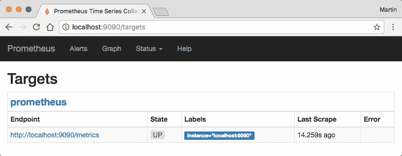
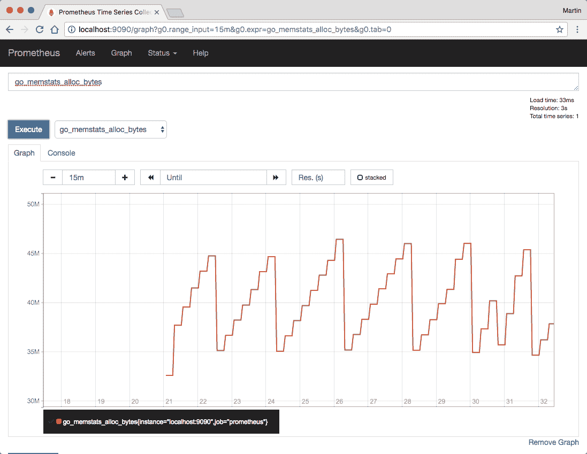
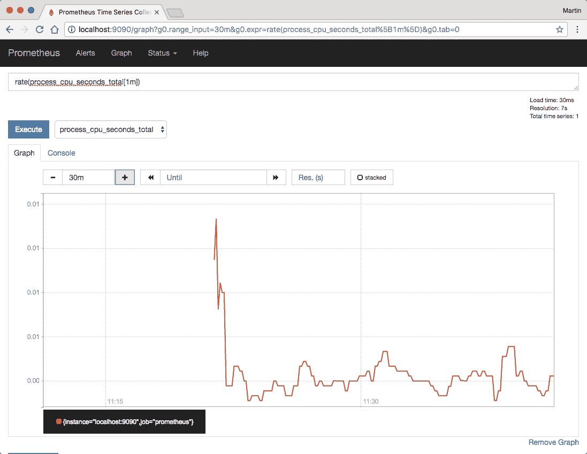
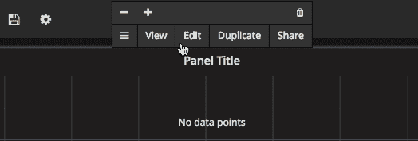
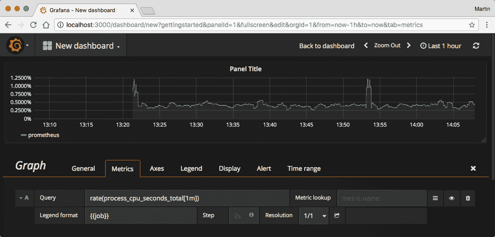
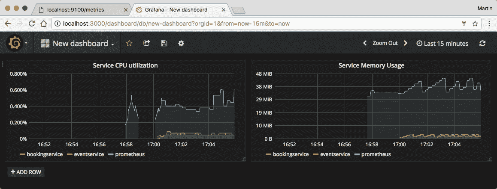
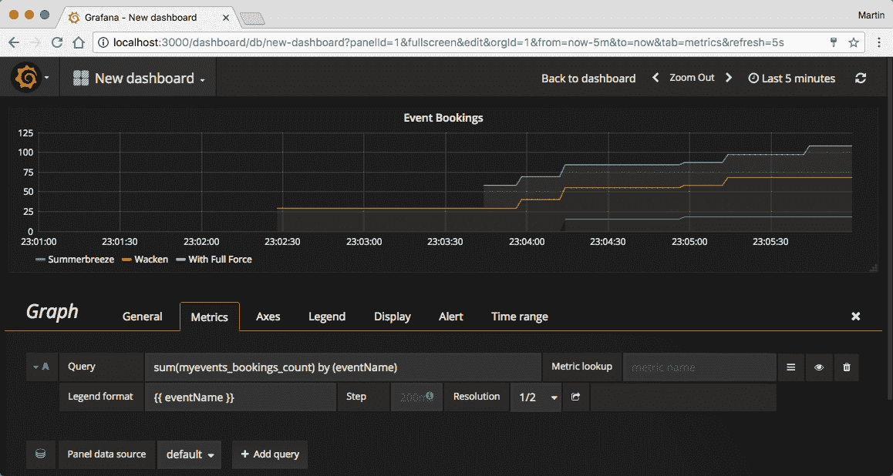

# 十、监视应用

在前面的章节中，您学习了如何使用 Go 编程语言构建微服务应用，以及如何（连续地）将其部署到各种环境中。

然而，我们的工作尚未完成。当您的应用在生产环境中运行时，您需要确保它保持正常运行，并按照您作为开发人员的预期方式运行。这就是监控的目的。

在本章中，我们将向您介绍**普罗米修斯**，这是一款开源监控软件，它在监控基于云的分布式应用方面迅速流行。它通常与**Grafana**一起使用，这是一个前端，用于可视化普罗米修斯收集的度量数据。这两个应用都是根据 Apache 许可证授权的。您将学习如何设置 Prometheus 和 Grafana，以及如何将它们集成到您自己的应用中。

在本章中，我们将介绍以下主题：

*   安装和使用普罗米修斯
*   安装 Grafana
*   从您自己的应用将度量导出到 Prometheus

# 建立普罗米修斯和格拉法纳

在使用普罗米修斯和格拉法纳在我们自己的应用之前，让我们来看看普罗米修斯原理上是如何工作的。

# 普罗米修斯的基础

与其他监控解决方案不同，普罗米修斯的工作方式是定期从客户端提取数据（普罗米修斯术语中称为**度量**。此过程称为**刮取**。由 Prometheus 监控的客户端必须实现一个 HTTP 端点，Prometheus 可以定期（默认情况下，1 分钟）对该端点进行刮取。然后，这些度量端点可以以预定义的格式返回特定于应用的度量。

例如，应用可以在`/metrics`提供一个 HTTP 端点，该端点响应`GET`请求并返回以下正文：

```go
memory_consumption_bytes 6168432 
http_requests_count{path="/events",method="get"} 241 
http_requests_count{path="/events",method="post"} 5 
http_requests_count{path="/events/:id",method="get"} 125 
```

本文档公开了两个指标-`memory_consumption_bytes`和`http_requests_count`。每个度量都与一个值（例如，6168432 字节的当前内存消耗）相关联。由于 Prometheus 以固定的时间间隔从应用中获取这些度量，因此它可以使用这些时间点值来构建此度量的时间序列。

普罗米修斯指标也可以有标签。在前面的示例中，您可能会注意到，`http_request_count`度量实际上对于`path`和`method`标签的不同组合有三个不同的值。稍后，您将能够使用这些标签使用自定义查询语言**PromQL**从普罗米修斯查询数据。

应用导出到普罗米修斯的度量可能会变得相当复杂。例如，使用标签和不同的度量名称，客户机可以导出直方图，其中数据聚合在不同的存储桶中：

```go
http_request_duration_seconds_bucket{le="0.1"} 6835 
http_request_duration_seconds_bucket{le="0.5"} 79447 
http_request_duration_seconds_bucket{le="1"} 80700 
http_request_duration_seconds_bucket{le="+Inf"} 80953 
http_request_duration_seconds_sum 46135 
http_request_duration_seconds_count 80953 
```

前面的指标描述了应用 HTTP 响应时间的直方图。在这种情况下，处理了 6835 个请求，响应时间少于 0.1 秒；79447 个响应时间小于 0.5 秒的请求（包括之前的 6835 个请求）；等等最后两个指标导出已处理 HTTP 请求的总量以及处理这些请求所需的时间总和。这两个值一起可用于计算平均请求持续时间。

不用担心，您不需要自己构建这些复杂的直方图指标；这就是普罗米修斯客户端库的用途。但是，首先，让我们从实际设置普罗米修斯实例开始。

# 创建初始普罗米修斯配置文件

在我们自己的应用中使用 Prometheus 和 Grafana 之前，我们需要先设置它。幸运的是，您可以在 Docker Hub 上找到这两个应用的 Docker 映像。在启动我们自己的 Prometheus 容器之前，我们只需要创建一个配置文件，然后将其注入容器中。

首先在本地计算机上的某个位置创建一个新目录，并在其中放置一个新的`prometheus.yml`文件：

```go
global: 
  scrape_interval: 15s 

scrape_configs: 
  - job_name: prometheus 
    static_configs: 
      - targets: ["localhost:9090"] 
```

此配置定义了 15 秒的全局刮除间隔（默认值为 1 分钟），并已配置了第一个刮除目标，即普罗米修斯本身（是的，您已正确读取；普罗米修斯导出普罗米修斯度量，然后您可以使用普罗米修斯进行监控）。

稍后，我们将向`scape_configs`属性添加更多配置项。就目前而言，这就足够了。

# 在码头上运行普罗米修斯

创建配置文件后，我们可以使用卷装载将此配置文件注入即将启动的 Docker 容器。

对于本例，我们假设您的本地计算机上的 Docker 容器中运行 MyEvents 应用，并且容器连接到名为`myevents`的容器网络（您是手动创建容器还是通过 Docker Compose 创建容器并不重要）。

因此，启动这两个应用非常容易。我们将首先为监控组件定义一个单独的容器网络：

```go
$ docker network create monitoring 
```

接下来，创建一个新卷，Prometheus 服务器可以在其中存储其数据：

```go
$ docker volume create prometheus-data 
```

现在，您可以使用新创建的网络和卷来创建 Prometheus 容器：

```go
$ docker container run \ 
    --name prometheus \ 
    --network monitoring \ 
    --network myevents \ 
    -v $PWD/prometheus.yml:/etc/prometheus/prometheus.yml 
    -v prometheus-data:/prometheus 
    -p 9090:9090 
    prom/prometheus:v1.6.1 
```

请注意，在前面的示例中，我们将`prometheus`容器连接到`myevents`和`monitoring`网络。这是因为稍后，Prometheus 服务器将需要通过网络访问 MyEvents 服务，以从中获取度量。

启动 Prometheus 容器后，您将能够通过导航到[在浏览器中打开 Prometheus web UIhttp://localhost:9090](http://localhost:9090/) ：


普罗米修斯网络用户界面

在我们的配置文件中，我们已经配置了第一个抓取目标普罗米修斯服务器本身。通过选择 Status（状态）菜单项，然后选择 targets（目标）项，您将看到所有配置的刮片目标的概览：



Prometheus web UI 中的目标项

正如您在前面的屏幕截图中所看到的，普罗米修斯报告了刮取目标的当前状态（在本例中为向上）以及上次刮取目标的时间。

现在，您可以使用图表菜单项来检查普罗米修斯已经收集到的关于自身的指标。在这里，在表达式输入字段中输入`go_memstats_alloc_bytes`并单击执行。之后，切换到图表选项卡。普罗米修斯现在将打印过去 1 小时内自己的内存使用情况。您可以使用图表上方的控件更改观察周期。默认情况下，普罗米修斯将保留其时间序列数据 2 周：



普罗米修斯网络用户界面图

普罗米修斯也支持更复杂的表达式。例如，考虑{Ωt0}度量。将其显示为图形时，您会注意到它是单调递增的。这是因为该特定指标描述了程序在其整个生命周期内使用的所有 CPU 秒数之和（根据定义，它必须始终在增加）。然而，出于监控目的，了解进程的当前 CPU 使用情况通常更有趣。为此，ProMQ 提供了计算时间序列每秒平均增长的`rate()`方法。使用以下表达式尝试此操作：

```go
rate(process_cpu_seconds_total[1m]) 
```

在图表视图中，您现在可以找到每秒 1 分钟的平均 CPU 使用率（这可能比所有已使用 CPU 秒的总和更容易理解）：



Prometheus web UI 适合于快速分析和特殊查询。但是，普罗米修斯不支持保存查询供以后使用，也不支持在同一页面上显示多个图形。这就是格拉法纳发挥作用的地方。

# 在 Docker 上运行 Grafana

跑格拉法纳和跑普罗米修斯一样容易。首先为永久性存储设置一个卷：

```go
$ docker volume create grafana-data 
```

然后，启动实际的容器并将其连接到`monitoring`网络（不是`myevents`网络；Grafana 需要与 Prometheus 服务器通信，但不需要直接与您的后端服务通信）：

```go
$ docker container run \ 
    -v grafana-data \ 
    -p 3000:3000 \ 
    --name grafana \ 
    --network monitoring \ 
    grafana/grafana:4.2.0 
```

之后，您将能够在`http://localhost:3000`的浏览器中访问 Grafana。默认凭证为用户名`admin`和密码`admin`。


加凡纳主页

首次访问时，系统将提示您为 Grafana 实例配置数据源。单击添加数据源按钮，并在下一页配置对 Prometheus 服务器的访问。在这里，选择普罗米修斯*作为*类型*，输入`http://prometheus:9090`作为 URL，选择代理*作为*访问方式。*

 *添加数据源后，继续创建仪表板（选择左上角的按钮，选择仪表板，然后新建）。然后，通过单击相应的按钮向仪表板添加新图形。添加图形面板后，通过单击面板标题并选择编辑来编辑面板：



面板

然后，在 Metrics 选项卡中，在 query 输入字段中输入之前的 CPU 使用情况查询。要进一步自定义面板，您可能需要输入`{{ job }}`作为图例，以使图形图例更易于理解，并将 Y 轴格式（在轴选项卡、左侧 Y 部分和单位字段中）更改为百分比（0.0-1.0）：



Gafana 新仪表板

关闭编辑面板，点击保存按钮或按*Ctrl*+*S*保存仪表板。您的仪表板现在已保存。您可以在稍后使用更新的指标再次查看它，或与其他用户共享此仪表板。

您还可以通过在仪表板中添加更多面板来进行试验，在仪表板中您可以可视化其他指标（默认情况下，普罗米修斯已经导出了大量关于自身的指标，您可以进行试验）。有关普罗米修斯查询语言的详细参考，您还可以查看以下 URL 的官方文档：[https://prometheus.io/docs/querying/basics/](https://prometheus.io/docs/querying/basics/) 。

现在我们已经有了一个正在运行的 Prometheus 和 Grafana 设置，我们可以看看如何将度量从您自己的应用中获取到 Prometheus 中。

# 导出度量

如前所示，从您自己的应用导出度量很容易，至少在原则上是如此。您的应用所需要做的就是提供一个 HTTP 端点，该端点返回任意指标，然后可以保存在 Prometheus 中。实际上，这会变得更加困难，特别是当您关心 Go 运行时的状态（例如，CPU 和内存使用情况、Goroutine 计数等）时。出于这个原因，使用 Prometheus 客户端库 For Go 通常是一个好主意，它负责收集所有可能的 Go 运行时度量。

事实上，Prometheus 本身就是用 Go 编写的，它还使用自己的客户端库导出关于 Go 运行时的度量（例如，您以前使用过的`go_memstats_alloc_bytes`或`process_cpu_seconds_total`度量）。

# 在 Go 应用中使用 Prometheus 客户端

您可以使用`go get`获取普罗米修斯客户端库，如下所示：

```go
$ go get -u github.com/prometheus/client_golang 
```

如果您的应用使用依赖项管理工具（如上一章介绍的 Glide），您可能还希望在`glide.yaml`文件中声明此新的依赖项，并向应用的`vendor/`目录添加一个稳定版本。要一步完成所有这些，只需在应用目录中运行`glide get`而不是`go get`：

```go
$ glide get github.com/prometheus/client_golang 
$ glide update 
```

出于安全原因，我们将在与事件服务和预订服务的 RESTAPI 不同的 TCP 端口上公开 metrics API。否则，很容易意外地将 metricsapi 暴露给外部世界。

让我们从事件服务开始。设置 metrics API 不需要太多代码，因此我们将直接在`main.go`文件中进行设置。在调用`rest.ServeAPI`方法之前，在主函数中添加以下代码：

```go
import "net/http" 
import "github.com/prometheus/client_golang/prometheus/promhttp" 
// ... 

func main() { 
  // ... 

  go func() { 
    fmt.Println("Serving metrics API") 

    h := http.NewServeMux() 
    h.Handle("/metrics", promhttp.Handler()) 

    http.ListenAndServe(":9100", h) 
  }() 

  fmt.Println("Serving API") 
  // ... 
} 
```

现在，编译应用并运行它。尝试在浏览器中打开`http://localhost:9100/metrics`处的地址，您会看到新端点返回大量度量：


本地主机上显示的页面：9100/metrics

现在，对预订服务进行同样的调整。另外，请记住向两个服务的 Dockerfiles 添加一个`EXPOSE 9100`语句，并使用更新的映像和`-p 9100:9100`标志（或`-p 9101:9100`以防止端口冲突）重新创建任何容器。

# 配置普罗米修斯刮靶

现在我们已经有了两个公开普罗米修斯度量的服务，我们可以配置普罗米修斯来获取这些服务。为此，我们可以修改您先前创建的`prometheus.yml`文件。将以下部分添加到`scrape_configs`属性：

```go
global: 
  scrape_interval: 15s 

scrape_configs: 
  - job_name: prometheus 
    static_configs: 
      - targets: ["localhost:9090"] 
  - job_name: eventservice 
    static_configs: 
      - targets: ["events:9090"] 
  - job_name: bookingservice 
    static_configs: 
      - targets: ["bookings:9090"] 
```

添加新的刮削目标后，运行`docker container restart prometheus`重启普罗米修斯容器。之后，普罗米修斯 web UI 中将显示两个新的抓取目标：


普罗米修斯网络用户界面目标

现在，最好的部分还记得你之前创建的 Grafana 仪表板吗？现在，您已经添加了普罗米修斯所需的两项新服务，请再看一看：



加凡纳

如您所见，Grafana 和 Prometheus 立即从新服务中获取指标。这是因为到目前为止我们使用的`process_cpu_seconds_total`和`go_memstats_alloc_bytes`指标实际上是由我们的三个服务导出的，因为它们都使用 Prometheus Go 客户端库。然而，普罗米修斯在每个被刮掉的指标上增加了一个额外的工作标签；这使得普罗米修斯和格拉法纳能够区分来自不同刮削目标的相同指标，并相应地呈现它们。

# 导出自定义度量

当然，您也可以使用 Prometheus 客户端库导出您自己的度量。这些不需要是反映 Go 运行时某些方面的技术指标（如 CPU 使用率和内存分配），但也可以是业务指标。一个可能的例子是每个活动的不同标签的预订门票数量。

例如，在`todo.com/myevents/bookingservice/rest`包中，您可以添加一个新文件，我们称之为`metrics.go`*-*，它声明并注册一个新的普罗米修斯度量：

```go
package rest 

import "github.com/prometheus/client_golang/prometheus" 

var bookingCount = prometheus.NewCounterVec( 
  prometheus.CounterOpts{ 
    Name:      "bookings_count", 
    Namespace: "myevents", 
    Help:      "Amount of booked tickets", 
  }, 
  []string{"eventID", "eventName"}, 
) 

func init() { 
  prometheus.MustRegister(bookingCount) 
} 
```

Prometheus 客户端库跟踪包（自动初始化的全局注册表）中所有创建的度量对象。通过调用`prometheus.MustRegister`函数，您可以向该注册表添加新的度量。当普罗米修斯服务器刮取`/metrics`端点时，所有注册的指标将自动公开。

所使用的`NewCounterVec`函数创建了一个度量集合，这些度量集合都命名为`myevents_bookings_count`，但由两个标签`eventID`和`eventName`区分（实际上，这两个标签在功能上是相关的，您并不真正需要两者；但是在 Grafana 中可视化此度量时，将事件名称作为标签非常方便）。刮取时，这些指标可能如下所示：

```go
myevents_bookings_count{eventID="507...",eventName="Foo"} 251 
myevents_bookings_count{eventID="508...",eventName="Bar} 51 
```

普罗米修斯客户端库知道不同类型的度量。我们在前面代码中使用的计数器是比较简单的计数器之一。在前面的一节中，您看到了一个复杂的直方图是如何表示为许多不同的度量的。普罗米修斯客户端库也可以实现这一点。为了演示，我们这次添加另一个指标，直方图：

```go
var seatsPerBooking = prometheus.NewHistogram( 
  prometheus.HistogramOpts{ 
    Name: "seats_per_booking", 
    Namespace: "myevents", 
    Help: "Amount of seats per booking", 
    Buckets: []float64{1,2,3,4} 
  } 
) 

func init() { 
  prometheus.MustRegister(bookingCount) 
  prometheus.MustRegister(seatsPerBooking) 
} 
```

刮取时，该直方图将导出为七个单独的度量：您将得到五个直方图桶（*一个座位或更少的预订数量*最多*四个座位或更少的预订数量*和*无限多个座位或更少的预订数量*），以及一个用于所有座位和所有观察结果总和的度量，分别为：

```go
myevents_seats_per_booking_bucket{le="1"} 1 
myevents_seats_per_booking_bucket{le="2"} 8 
myevents_seats_per_booking_bucket{le="3"} 18 
myevents_seats_per_booking_bucket{le="4"} 20 
myevents_seats_per_booking_bucket{le="+Inf"} 22 
myevents_seats_per_booking_sum 72 
myevents_seats_per_booking_count 22 
```

当然，我们需要告诉 Prometheus 库，当 Prometheus 服务器抓取这些度量时，应该导出哪些值。由于这两个指标（预订数量和每次预订的座位数量）只能在进行新预订时更改，因此我们可以将此代码添加到 REST 处理程序函数中，该函数处理`/events/{id}/bookings`路线上的 POST 请求。

在`booking_create.go`文件中，在原始请求处理完成后的某处添加以下代码（例如，在事件发射器上发出`EventBooked`事件后）：

```go
h.eventEmitter.emit(&msg) 

bookingCount. 
  WithLabelValues(eventID, event.Name). 
  Add(float64(request.Seats)) 
seatsPerBooking. 
  Observe(float64(bookingRequest.Seats)) 

h.database.AddBookingForUser(
   // ... 
```

第一个语句将预订座位的数量（`request.Seats`添加到计数器度量。由于您在`CounterVec`声明中定义了一个名为`event`的标签，因此需要使用相应的标签值调用`WithLabelValues`方法（如果度量声明由两个标签组成，则需要将两个参数传递到`WithLabelValues`。

第二条语句在柱状图中添加了一个新的`observation`。它将自动找到正确的 bucket 并将其增加 1（例如，如果在同一预订中添加了三个座位，`myevents_seats_per_booking_bucket{le="3"}`度量将增加 1）。

现在，启动您的应用，并确保普罗米修斯定期刮擦它。花点时间在应用中添加一些示例记录。另外，在预订服务中添加一些活动预订；请确保不要一次创建所有对象。之后，您可以使用`myevents_bookings_count`指标在 Grafana 仪表板中创建一个新图形：

>

加凡纳图

默认情况下，普罗米修斯将为每个刮取的实例创建一个时间序列。这意味着当您有多个预订服务实例时，您将获得多个时间序列，每个时间序列都有不同的`job`标签：

```go
myevents_bookings_count{eventName="Foo",job="bookingservice-0"} 1 
myevents_bookings_count{eventName="Foo",job="bookingservice-1"} 3 
myevents_bookings_count{eventName="Bar",job="bookingservice-0"} 2 
myevents_bookings_count{eventName="Bar",job="bookingservice-1"} 1 
```

当显示业务指标（例如，售出的票数）时，您可能并不关心每个特定预订放置在哪个实例，而是更喜欢聚合时间序列而不是所有实例。为此，您可以在构建仪表板时使用 PromQL 函数`sum()`：

```go
sum(myevents_bookings_count) by (eventName) 
```

# 让普罗米修斯在库伯尼特斯上奔跑

到目前为止，我们已经通过将普罗米修斯的所有刮削目标添加到`prometheus.yml`配置文件中，手动配置了普罗米修斯的所有刮削目标。这在测试中效果很好，但在更大的生产设置中很快就会变得单调乏味（并且一旦引入自动缩放等功能就完全没有意义）。

当在 Kubernetes 集群中运行应用时，Prometheus 提供了一个交钥匙解决方案，使用`prometheus.yml`配置文件，您可以将 Prometheus 配置为自动从 Kubernetes API 加载其刮片目标。例如，如果您为预订服务定义了一个部署，普罗米修斯可以自动找到由该部署管理的所有吊舱，并将其全部删除。如果部署按比例增加，其他实例将自动添加到 Prometheus。

对于以下示例，我们将假设您的本地机器上运行一个 Minikube VM，或者云环境中的某个地方有一个 Kubernetes 群集。我们将首先部署 Prometheus 服务器。为了管理普罗米修斯配置文件，我们将使用以前从未使用过的 Kubernetes 资源-a`ConfigMap`。`ConfigMap`基本上只是一个可以保存在 Kubernetes 中的任意键值映射。创建 Pod（或部署或状态集）时，您可以将这些值作为文件装载到容器中，这使得`ConfigMaps`非常适合管理配置文件：

```go
apiVersion: v1 
kind: ConfigMap 
name: prometheus-config 
data: 
  prometheus.yml: | 
    global: 
      scrape_config: 15s 

    scrape_configs: 
    - job_name: prometheus 
      static_configs: 
      - targets: ["localhost:9090"] 
```

您可以像创建任何其他资源一样创建`ConfigMap`，方法是将其保存到`.yaml`文件中，然后对该文件调用`kubectl apply -f`。当您修改了`.yaml`文件时，您也可以使用相同的命令来更新`ConfigMap`。

创建了`ConfigMap`之后，让我们部署实际的普罗米修斯服务器。由于 Prometheus 是一个有状态的应用，我们将它部署为一个`StatefulSet`：

```go
apiVersion: apps/v1beta1 
kind: StatefulSet 
metadata: 
  name: prometheus 
spec: 
  serviceName: prometheus 
  replicas: 1 
  template: 
    metadata: 
      labels: 
        app: prometheus 
    spec: 
      containers: 
      - name: prometheus 
        image: prom/prometheus:v1.6.1 
        ports: 
        - containerPort: 9090 
          name: http 
        volumeMounts: 
        - name: data 
          mountPath: /prometheus 
        - name: config 
          mountPath: /etc/prometheus 
      volumes: 
      - name: config 
        configMap: 
          name: prometheus-config 
  volumeClaimTemplates: 
  - metadata: 
      name: data 
      annotations: 
        volume.alpha.kubernetes.io/storage-class: standard 
    spec: 
      accessModes: ["ReadWriteOnce"] 
      resources: 
        requests: 
          storage: 5Gi 
```

另外，创建关联的`Service`：

```go
apiVersion: v1 
kind: Service 
metadata: 
  name: prometheus 
spec: 
  clusterIP: None 
  selector: 
    app: prometheus 
  ports: 
  - port: 9090 
    name: http 
```

现在，在 Kubernetes 集群中运行了一台 Prometheus 服务器；然而，目前，该服务器只获取自己的度量端点，还没有获取集群中运行的任何其他 pod。

要启用自动抓取吊舱，请在您的`ConfigMap`中的`prometheus.yml`文件的`scrape_configs`部分添加以下部分：

```go
scrape_configs: 
  # ... 
  - job_name: kubernetes-pods 
    kubernetes_sd_configs: 
    - role: pod 
  relabel_configs: 
  - source_labels: [__meta_kubernetes_pod_annotation_prometheus_io_scrape] 
    action: keep 
    regex: true 
  - source_labels: [__meta_kubernetes_pod_annotation_prometheus_io_path] 
    action: replace 
    target_label: __metrics_path__ 
    regex: (.+) 
  - source_labels: [__address__, __meta_kubernetes_pod_annotation_prometheus_io_port] 
    action: replace 
    regex: ([^:]+)(?::\d+)?;(\d+) 
    replacement: $1:$2 
    target_label: __address__ 
  - action: labelmap 
    regex: __meta_kubernetes_pod_label_(.+) 
  - source_labels: [__meta_kubernetes_namespace] 
    action: replace 
    target_label: kubernetes_namespace 
  - source_labels: [__meta_kubernetes_pod_name] 
    action: replace 
    target_label: kubernetes_pod_name 
```

是的，这是相当多的配置，但不要惊慌。其中大多数配置用于将已知 Kubernetes 吊舱的属性（如用户定义的吊舱名称和标签）映射到 Prometheus 标签，该标签将附加到从这些吊舱中刮取的所有度量。

请注意，更新`ConfigMap`后，您可能需要销毁普罗米修斯吊舱，更新后的配置才能激活。别担心；即使删除 Pod，`StatefulSet`控制器也会立即创建一个新的 Pod：

```go
$ kubectl delete pod -l app=prometheus 
```

该配置还定义了普罗米修斯将清除集群中所有标注为`prometheus.io/scrape`的吊舱。例如，在部署中定义 Pod 模板时，可以设置此注释。此外，您现在可以按如下方式调整事件服务部署（请记住将 TCP 端口`9100`添加到公开端口列表中）：

```go
apiVersion: apps/v1beta1 
kind: Deployment 
metadata: 
  name: eventservice 
spec: 
  replicas: 2 
  template: 
    metadata: 
      labels: 
        myevents/app: events 
        myevents/tier: api 
      annotations: 
        prometheus.io/scrape: true 
        prometheus.io/port: 9100 
    spec: 
      containers: 
      - name: api 
        image: myevents/eventservice 
        imagePullPolicy: Never 
        ports: 
        - containerPort: 8181 
          name: http 
        - containerPort: 9100 
          name: metrics 
        # ... 
```

更新部署后，Kubernetes 应自动开始重新创建事件服务吊舱。一旦创建了带有`prometheus.io/scrape`注释的新豆荚，普罗米修斯将自动拾取它们，并将其刮取作为度量标准。如果它们再次被删除（例如，在更新或缩小部署规模后），普罗米修斯将保留从这些 POD 收集的度量，但停止删除它们。

通过让普罗米修斯根据注释自动拾取新的抓取目标，管理普罗米修斯服务器变得非常容易；在初始设置之后，您可能不需要再次编辑配置文件。

# 总结

在本章中，您学习了如何使用 Prometheus 和 Grafana 设置一个监控堆栈，以在技术层面上监控应用的运行状况（通过关注系统指标，如 RAM 和 CPU 使用情况）和定制的、特定于应用的指标，如在本例中，预订的票证数量。

在本书中，我们几乎涵盖了典型 Go 云应用的整个生命周期，从架构和实际编程开始，构建容器映像，在各种云环境中不断部署它们，并监控您的应用。

在下一章中，我们将借此机会详细回顾我们迄今所取得的成就，并指出今后的方向。*