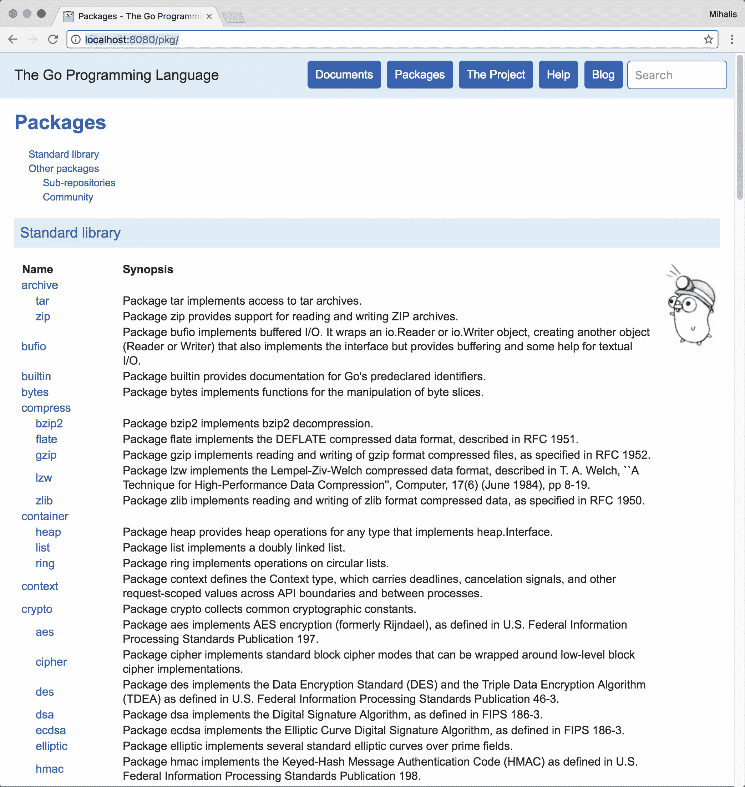

# 一、Go 和 Unix 系统编程入门

操作系统是一种允许您与硬件通信的软件，这意味着您无法在没有操作系统的情况下使用硬件。Unix 是一种具有许多变体的操作系统，这些变体有许多共同之处，包括它们的编程接口。

Unix 操作系统主要是用 C 语言编写的，而不是完全用汇编语言编写的，这使得它可以移植到其他计算机体系结构中，而不必从头重写所有内容。重要的是要理解，即使您在 Unix 机器上开发 Go 程序，最终代码也会被转换为 C 函数和系统调用，因为这是直接与 Unix 内核通信的唯一方法。从编写 Go 代码而不是 C 代码中获得的主要好处是较小的程序具有较少的愚蠢错误。您将在[第三章](03.html)*、**高级Go功能**中了解更多信息。*

由于本书将使用 Go，您需要在 Unix 机器上安装 Go 的一个版本。好消息是，几乎所有现代 Unix 系统（包括 macOS、Linux 和 FreeBSD）都有一种 port of The Go 编程语言。还有一个 Windows 的 Go 端口，但这本书不会涉及 Microsoft Windows。

尽管您的 Unix 变体很有可能有一个 Go 包，但您也可以从[获得 Gohttps://golang.org/dl/](https://golang.org/dl/) 。

在本章中，您将学习以下主题：

*   系统编程
*   Go的优缺点
*   Unix 进程的状态
*   两个Go工具：`gofmt`和`godoc`
*   最新 Go 版本（1.8）的功能

# 这本书的结构

这本书有三个部分。第一部分，包括本章，是关于 Go 以及在开发系统软件时可以使用的 Go 功能：这并不意味着在开发程序时应该使用所有这些功能。第二部分是关于使用文件、目录和进程进行编程，这是最常见的系统软件类型。第三部分探讨 Go 中的 goroutines、web 应用和网络编程，Go 是最先进的系统软件类型。好在你不需要马上读这本书的第三部分。

# 什么是系统编程？

系统编程是 Unix 机器上编程的一个特殊领域。请注意，系统编程并不局限于 Unix 机器：这本书只讨论 Unix 操作系统。大多数与系统管理任务有关的命令，如磁盘格式化、网络接口配置、模块加载和内核性能跟踪，都是使用系统编程技术实现的。此外，`/etc`目录可以在所有 Unix 系统上找到，它包含处理 Unix 机器及其服务配置的纯文本文件，也可以使用系统软件进行操作。

您可以在以下集合中对系统软件和相关系统调用的各个区域进行分组：

*   **文件 I/O**：该区域处理文件读写操作，这是操作系统最重要的任务。文件输入和输出必须快速有效，最重要的是可靠。
*   **高级文件 I/O**：除了基本的输入输出系统调用外，还有更高级的文件读写方式，包括异步 I/O 和非阻塞 I/O。
*   **系统文件和配置**：这组系统软件包括允许您处理系统文件的功能，例如`/etc/passwd`，以及获取系统特定信息的功能，例如系统时间和 DNS 配置。
*   **文件和目录**：该集群包含函数和系统调用，允许程序员创建和删除目录，并获取文件或目录的所有者和权限等信息。
*   **进程控制**：这组软件允许您创建 Unix 进程并与之交互。
*   **线程**：当一个进程有多个线程时，它可以执行多个任务。但是，必须创建、终止和同步线程，这是函数和系统调用集合的目的。
*   **服务器进程**：此集合包括允许您开发服务器进程的技术，这些进程在后台执行，无需活动终端。Go 不太擅长用传统的 Unix 方式编写服务器进程：但让我进一步解释一下。Unix 服务器（如 Apache）使用`fork(2)`创建一个或多个子进程（此进程称为**分叉**，指将父进程克隆到子进程中），并从同一点继续执行相同的可执行文件，最重要的是，共享内存。尽管 Go 没有提供与`fork(2)`函数等价的功能，但这不是一个问题，因为您可以使用 goroutines 来涵盖`fork(2)`的大部分用法。
*   **进程间通信**：这组函数允许在同一台 Unix 机器上运行的进程使用管道、FIFO、消息队列、信号量和共享内存等功能相互通信。
*   **信号处理**：信号提供了一种处理异步事件的方法，非常方便。几乎所有服务器进程都有额外的代码，允许它们使用此组的系统调用来处理 Unix 信号。
*   **网络编程**：这是在 TCP/IP 的帮助下开发在计算机网络上工作的应用的艺术，而不是系统编程本身。然而，大多数 TCP/IP 服务器和客户机处理的是系统资源、用户、文件和目录。因此，大多数情况下，如果不进行某种系统编程，就无法创建网络应用。

系统编程的挑战在于你不能承受一个不完整的程序；您可以拥有一个可以在生产系统上使用的完全工作、安全的程序，也可以什么都没有。这主要是因为你不能信任最终用户和黑客。系统编程中的关键困难在于，错误的系统调用可能会使 Unix 机器行为异常，甚至崩溃！

Unix 系统上的大多数安全问题通常来自错误实现的系统软件，因为系统软件中的错误会危及整个系统的安全。最糟糕的是，这种情况可能在使用某个软件多年后发生。

在编写系统软件时，您应该很好地注意错误消息和警告，因为它们是帮助您了解正在发生的事情以及程序没有按预期运行的原因的朋友。简单地说，*文件未找到*和*没有足够的权限读取文件*错误消息之间存在很大差异。

当 Unix 首次引入时，编写系统软件的唯一方法是使用 C；现在，您可以使用包括 Go 在内的编程语言对系统软件进行编程，这将是本书的主题。

您应该了解，使用 C 以外的编程语言开发系统软件的两个主要好处如下：

*   使用现代编程语言及其工具
*   简单性，因为您通常需要编写、调试和维护更少的代码

除了 Go 之外，开发系统工具的其他优秀候选工具还有 Python、Perl、Rust 和 Ruby。

# 学习系统编程

学习系统编程的唯一方法是使用本书作为参考和教程开发自己的实用程序。起初，你会犯大量可笑的错误，但随着你的进步，你会犯少量更聪明、更难调试的错误！然而，在学习的过程中尝试新事物是很好的。事实上，尝试新事物并失败是必要的，因为这意味着你真的在学习新的东西。只需确保不要使用生产 web 服务器进行学习系统编程。

如果您很难找到要开发的内容，您可以从创建一些现有 Unix 命令行实用程序的自己版本开始，例如`ls(1)`、`mkdir(1)`、`ln(1)`、`wc(1)`和`which(1)`。您不必为它们中的每一个创建一个功能齐全的版本，并支持所有命令行选项；重要的是开发一个稳定、安全的版本，实现主要功能，并且工作正常。

教你用 C 编写 Unix 系统编程的最好的书是由 Richard Stevens 撰写的*Unix 环境中的高级 Unix 编程*。它的第三版现在已经上市，但所有版本都很有用，并且包含了大量有价值的细节。

# 即将开始

Go 是一种现代通用的开源编程语言，于 2009 年底正式发布。它最初是一个谷歌内部项目，受到了许多其他编程语言的启发，包括 C、Pascal、Alef 和 Oberon。它的精神之父是*罗伯特·格里默*、*肯·汤姆森*和*罗伯·派克*，他们将Go设计成一种语言，面向那些希望构建可靠、健壮软件的专业程序员。除了语法和标准函数外，Go 还提供了一个非常丰富的标准库。

在撰写本书时，最新的 stable Go 版本是 1.8，其中包括一些方便的新功能，包括以下内容：如果您以前没有使用过 Go，请随时跳过此部分：

*   新的转换规则允许您在满足某些条件的情况下轻松地在几乎相等的类型之间进行转换。您可以使用`go tool`命令将`golang.org/x/net/name`表单的导入路径固定为 Go 源文件的名称，而无需自己打开源文件。
*   该工具的操作在某些情况下更为严格，在用于产生误报的情况下更为宽松。
*   当 GOPATH 未定义时，GOPATH 环境变量现在有一个默认值。对于 Unix 系统，默认值为$HOME/go。
*   Go 运行时有各种改进，可以加快 Go 的运行速度。
*   有一个`sort.slice()`函数，允许您通过提供比较器回调而不是实现`sort.Interface`来对切片进行排序。
*   现在有一个`Shutdown`方法来`http.Server`。
*   `database/sql`包中存在各种各样的小更改，使开发人员能够更好地控制查询。
*   您可以使用`go bug`命令创建 bug。

# 准备出发

您可以使用以下命令轻松找到您的 Go 版本：

```go
$ go version
go version go1.7.5 darwin/amd64  
```

之前的输出来自 macOS 机器，因此为`darwin`字符串。Linux 机器将提供以下类型的输出：

```go
$ go version
go version go1.3.3 linux/amd64
```

在接下来的章节中，您将了解更多关于`go tool`，您将一直使用它。

正如我所能想象的，你一定迫不及待地想看到一些Go代码；下面是著名的 Hello World 节目的 Go 版本：

```go
package main 

import "fmt" 

// This is a demonstrative comment! 
func main() { 
   fmt.Println("Hello World!") 
} 
```

如果你熟悉 C 或 C++，你会发现 GO 代码很容易理解。包含 Go 代码的每个文件都以包声明开始，后跟所需的导入声明。包声明显示此文件所属的包。请注意，成功终止 Go 语句不需要分号，除非要将两个或多个 Go 语句放在同一行中。

在[第 2 章](02.html)中*在 Go*中编写程序，您将了解如何编译和执行 Go 代码。现在，只需记住 Go 源文件是使用`.go`文件扩展名存储的：您的任务是选择一个描述性文件名。

搜索Go相关信息时，请使用`Golang`或`golang`作为Go编程语言的关键字，因为Go一词在英语中几乎随处可见，对您的搜索毫无帮助！

# 两个有用的Go工具

Go 发行版附带了大量的工具，可以使您的程序员生活更加轻松。其中最有用的两个是`gofmt`和`godoc`。

注意，`go tool`本身也可以调用各种工具：通过执行`go tool`可以看到它们的列表。

`gofmt`实用程序格式以给定的方式运行程序，当不同的人在一个大项目中使用相同的代码时，这一点非常重要。有关`gofmt`的更多信息，请访问[https://golang.org/cmd/gofmt/](https://golang.org/cmd/gofmt/) 。

以下是一个格式不良的`hw.go`程序版本，难以阅读和理解：

```go
$ cat unglyHW.go
package main

import
    "fmt"

// This is a demonstrative comment!
        func main() {
  fmt.Println("Hello World!")

}
```

处理前一个代码，将其与`gofmt`一起保存为`unglyHW.go`，生成以下易于阅读和理解的输出：

```go
$ gofmt unglyHW.go
package main

import "fmt"

// This is a demonstrative comment!
func main() {
      fmt.Println("Hello World!")

}
```

记住`gofmt`实用程序不会自动保存生成的输出是很重要的，这意味着您应该使用`-w`选项，后跟一个有效的文件名，或者将`gofmt`的输出重定向到一个新文件。

`godoc`实用程序允许您查看现有 Go 包和函数的文档。有关`godoc`的更多信息，请访问[http://godoc.org/golang.org/x/tools/cmd/godoc](http://godoc.org/golang.org/x/tools/cmd/godoc) 。

您将大量使用`godoc`，因为它是学习 Go 函数细节的绝佳工具。

下面的屏幕截图显示了当询问关于`fmt`包的`Println()`功能的信息时，在终端上生成的`godoc`命令的输出：


godoc 命令的输出

`godoc`的另一个便利功能是，它可以启动自己的 web 服务器，并允许您使用 web 浏览器查看其文档：

```go
$ godoc -http=:8080  
```

下面的屏幕截图显示了在上一个命令运行时访问`http://localhost:8080/pkg/`后在 web 浏览器上获得的输出类型。您可以使用所需的任何端口号，前提是该端口号尚未使用：



从 web 浏览器中使用 godoc 实用程序

程序员最重要的工具是他们用来编写源代码的编辑器。当我在 Mac 上时，我通常使用 TextMate 编辑器，但当我在另一台 Unix 机器上时，我更喜欢 vi。选择一个编辑器不是一件容易的事，因为你要花很多时间使用它。但是，任何文本编辑器只要不在源代码文件中放置任何控制字符，就可以执行此任务。以下屏幕截图显示了 TextMate 编辑器的运行：


TextMate 编辑器显示某个 Go 代码的外观

# Go的优缺点

Go 并不完美，但它有一些非常有趣的特性。强大功能列表包括以下内容：

*   Go 代码易于阅读和理解。
*   Go 需要快乐的开发人员，因为快乐的开发人员编写更好的代码！
*   Go 编译器打印实际的警告和错误消息，帮助您解决实际问题。简单地说，Go 编译器是为了帮助您，而不是让您的生活变得困难！
*   Go 代码是可移植的。
*   Go 是一种现代编程语言。
*   Go 支持过程、并发和分布式编程。
*   Go 支持**垃圾回收**（**GC**），因此您不必处理内存分配和释放。但是，GC 可能会使您的程序慢一点。
*   Go 没有预处理器，可以进行高速编译。因此，Go 可以用作脚本语言。
*   Go 可以构建 web 应用。除非您使用非标准的外部库，否则用 C 构建 web 应用效率很低。此外，Go 为程序员提供了一个简单的 web 服务器，用于测试目的。
*   标准 Go 库提供了许多简化程序员工作的包。此外，在标准 Go 库中找到的方法都是预先测试和调试的，这意味着大多数时候它们都不包含 bug。
*   Go 默认使用静态链接，这意味着生成的二进制文件可以轻松地传输到具有相同操作系统的其他机器。因此，开发人员不需要担心库、依赖项和不同的库版本。
*   您不需要 GUI 来开发、调试和测试 Go 应用，因为 Go 可以从命令行使用。
*   Go 支持 Unicode。这意味着您不需要任何额外的代码来打印来自多种人类语言的字符。
*   Go 使概念保持正交，因为几个正交特征比许多重叠特征工作得更好。

Go 缺点列表包括以下内容：

*   Go 不是 C，这意味着您或您的团队应该学习一种新的编程语言来开发系统软件。
*   Go 不直接支持面向对象编程，这对于习惯于以面向对象方式编写代码的程序员来说可能是个问题。不过，您可以在 Go 中使用组合来模拟继承。
*   当 Unix 首次引入时，C 是编写系统软件的唯一编程语言。现在，你也可以使用 Road、C++、Swift 编写系统软件，这意味着不是每个人都会使用 GO。
*   对于系统编程来说，C 仍然比任何其他编程语言都快，这主要是因为 Unix 是用 C 编写的。

尽管一种编程语言有其优点或缺点，但不管你喜欢与否，你都有最终决定权。重要的是，你要选择一种你喜欢的编程语言，并且可以完成你想要的工作！我个人不喜欢 C++，尽管它是一种非常有能力的编程语言，我在 C++中编写了一个 FTP 客户端！此外，我从不喜欢 Java。个人品味没有对错之分，所以不要对自己的选择感到内疚。

# Unix 进程的各种状态

严格地说，流程是一个执行环境，它包含指令、用户数据和系统数据部分，以及在运行时获得的其他类型的资源。程序是包含指令和数据的文件，用于初始化进程的指令和用户数据部分。

当 Unix 操作系统首次引入时，计算机只有一个 CPU，没有多个内核和少量 RAM。然而，Unix 是一个多用户多任务操作系统。为了真正成为多用户并执行多任务，它必须能够偶尔运行每个单独的进程，这意味着一个进程应该有多个状态。下图显示了流程的可能状态以及从一种状态到另一种状态的正确路径：


Unix 进程的状态

有三类进程：用户进程、内核进程和守护进程：

*   用户进程在用户空间中运行，通常没有特殊的访问权限
*   内核进程仅在内核空间中执行，并且可以完全访问所有内核数据结构
*   守护进程是可以在用户空间中找到并在后台运行的程序，无需终端

意识到无法控制进程的状态非常重要，因为这是在内核中运行的操作系统的**调度器**的工作。简单地说，您无法判断流程的状态何时将发生更改，或者流程何时将进入运行状态，因此您的代码无法依赖任何此类假设！

创建新进程的 C 方式包括调用`fork()`系统调用。`fork()`的返回值允许程序员区分父进程和子进程。但是，Go 不支持类似的功能。

# 练习

1.  访问Go网站：[https://golang.org/](https://golang.org/) 。
2.  在您的系统上安装 Go 并查找其版本。
3.  自己键入 Hello World 程序的代码并将其保存到文件中。
4.  如果您使用 Mac，请从[下载 TextMatehttp://macromates.com/](http://macromates.com/) 。
5.  如果您在 Mac 电脑上，请从[下载 TextWrangler 编辑器 http://www.barebones.com/products/TextWrangler/](http://www.barebones.com/products/TextWrangler/) 试试看。
6.  如果您还不熟悉其他 Unix 文本编辑器，请尝试自学 vi 或 Emacs。
7.  看看你能找到的任何 Go 代码，并尝试对其进行一些小的修改。

# 总结

在本章中，您学习了如何在计算机上使用 Go，最新 Go 版本的功能，Go 的优缺点，以及`gofmt`和`godoc`Go 工具，以及有关 Unix 操作系统的一些重要内容。

下一章不仅将告诉您如何编译 Go 代码，还将讨论其他重要的 Go 主题，如读取和使用命令行参数、环境变量、编写函数、数据结构、接口、获取用户输入和打印输出。