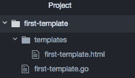
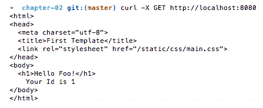
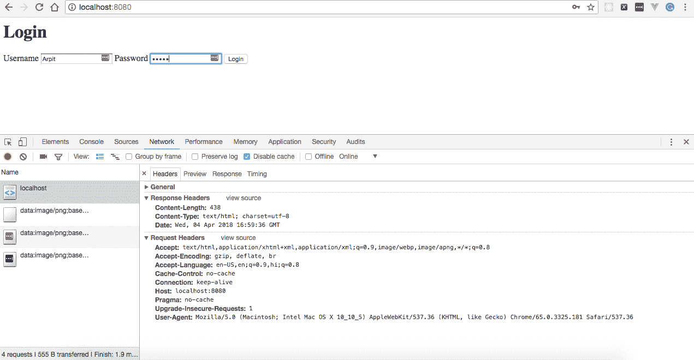
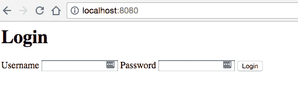
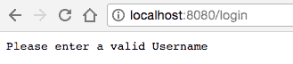
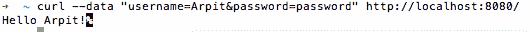
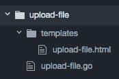
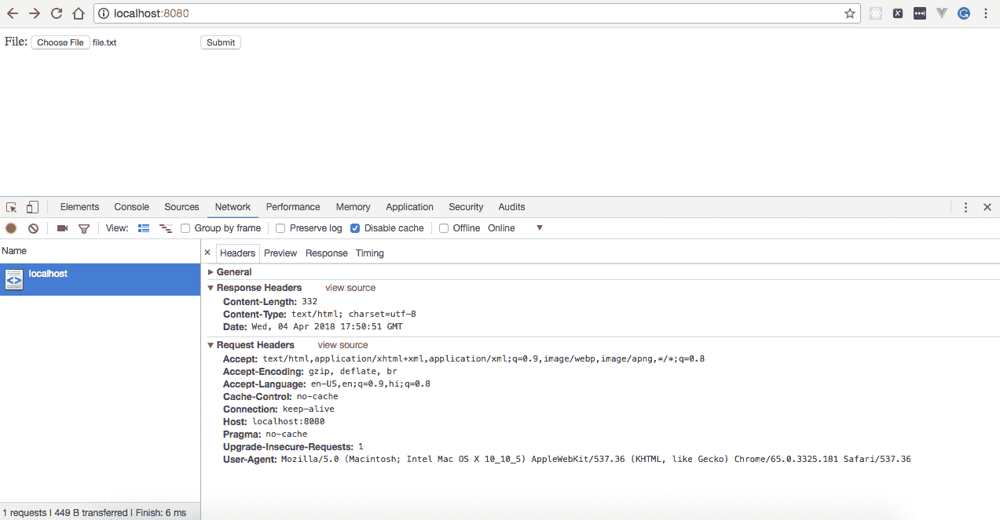
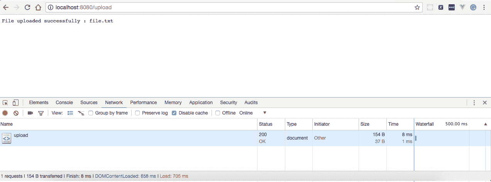

# 二、使用模板、静态文件和 HTML 表单

在本章中，我们将介绍以下配方：

*   创建第一个模板
*   通过 HTTP 服务静态文件
*   使用 Gorilla Mux 通过 HTTP 提供静态文件
*   创建第一个 HTML 表单
*   阅读您的第一个 HTML 表单
*   验证您的第一个 HTML 表单
*   上传你的第一个文件

# 介绍

通常，我们希望创建 HTML 表单，以便以指定的格式从客户端获取信息，将文件或文件夹上载到服务器，并生成通用 HTML 模板，而不是重复相同的静态文本。有了本章所涵盖概念的知识，我们将能够在 Go 中高效地实现所有这些功能。

在本章中，我们将从创建基本模板开始，然后继续从文件系统中提供静态文件，例如`.js`、`.css`和`images`，并最终创建、读取和验证 HTML 表单，并将文件上载到服务器。

# 创建第一个模板

模板允许我们为动态内容定义占位符，这些占位符可以在运行时由模板引擎替换为值。然后可以将它们转换为 HTML 文件并发送到客户端。使用 Go 的`html/template`包在 Go 中创建模板相当容易，我们将在本食谱中介绍它。

# 怎么做…

在这个配方中，我们将创建一个带有两个占位符的`first-template.html`，这些占位符的值将在运行时由模板引擎注入。执行以下步骤：

1.  通过执行以下 Unix 命令在`templates`目录中创建`first-template.html`：

```go
$ mkdir templates && cd templates && touch first-template.html
```

2.  将以下内容复制到`first-template.html`：

```go
<html>
  <head>
    <meta charset="utf-8">
    <title>First Template</title>
    <link rel="stylesheet" href="/static/stylesheets/main.css">
  </head>
  <body>
    <h1>Hello {{.Name}}!</h1>
    Your Id is {{.Id}}
  </body>
</html>
```

前面的模板有两个占位符`{{.Name}}`和`{{.Id}}`，它们的值将在运行时被模板引擎替换或注入。

3.  创建`first-template.go`，我们将在其中填充占位符的值，生成一个 HTML 作为输出，并将其写入客户端，如下所示：

```go
import 
(
  "fmt"
  "html/template"
  "log"
  "net/http"
)
const 
(
  CONN_HOST = "localhost"
  CONN_PORT = "8080"
)
type Person struct 
{
  Id   string
  Name string
}
func renderTemplate(w http.ResponseWriter, r *http.Request) 
{
  person := Person{Id: "1", Name: "Foo"}
  parsedTemplate, _ := template.ParseFiles("templates/
  first-template.html")
  err := parsedTemplate.Execute(w, person)
  if err != nil 
  {
    log.Printf("Error occurred while executing the template
    or writing its output : ", err)
    return
  }
}
func main() 
{
  http.HandleFunc("/", renderTemplate)
  err := http.ListenAndServe(CONN_HOST+":"+CONN_PORT, nil)
  if err != nil 
  {
    log.Fatal("error starting http server : ", err)
    return
  }
}
```

一切就绪后，目录结构应如下所示：



4.  使用以下命令运行程序：

```go
$ go run first-template.go
```

# 它是如何工作的…

一旦我们运行程序，HTTP 服务器将在端口`8080`上开始本地侦听。

浏览`http://localhost:8080`将向我们展示 Hello Foo！由模板引擎提供服务，如以下屏幕截图所示：


从命令行执行`curl -X GET http://localhost:8080`如下：

```go
$ curl -X GET http://localhost:8080
```

这将导致服务器做出以下响应：



让我们了解一下我们编写的围棋程序：

*   `type Person struct { Id string Name string }`：这里我们定义了一个具有`Id`和`Name`字段的`person`结构类型。

字段名称在类型定义中应以大写字母开头；否则，它将导致错误，并且不会在模板中被替换。

接下来，我们定义了一个`renderTemplate()`处理程序，它可以做很多事情。

*   `person := Person{Id: "1", Name: "Foo"}`：这里我们正在初始化一个`person`结构类型，其中`Id`为`1`，而`Name`为`Foo`。
*   `parsedTemplate, _ := template.ParseFiles("templates/first-template.html")`：这里我们调用`html/template`包的`ParseFiles`，该包创建一个新模板，并解析我们作为输入传递的文件名，该文件名位于模板目录中的`first-template.html ,`。生成的模板将具有输入文件的名称和内容。
*   `err := parsedTemplate.Execute(w, person)`：我们在解析模板上调用`Execute`处理程序，将`person`数据注入模板，生成 HTML 输出，并将其写入 HTTP 响应流。
*   `if err != nil {log.Printf("Error occurred while executing the template or writing its output : ", err) return }`：这里我们检查执行模板或将其输出写入响应流时是否有问题。如果有，则记录错误并以状态代码 1 退出。

# 通过 HTTP 服务静态文件

在设计 web 应用时，最好的做法是从文件系统或任何**内容交付网络**（**CDN**）提供静态资源，如`.js`、`.css`和`images`，如 Akamai 或 Amazon CloudFront，而不是从 web 服务器提供。这是因为所有这些类型的文件都是静态的，不需要处理；那么，我们为什么要在服务器上增加额外的负载呢？此外，它有助于提高应用的性能，因为对静态文件的所有请求都将从外部源提供，从而减少服务器上的负载。

Go 的`net/http`包足以通过`FileServer`提供来自文件系统的静态资源，我们将在本配方中介绍。

# 准备好了…

由于我们已经在前面的配方中创建了一个模板，我们将扩展它以提供来自`static/css`目录的静态`.css`文件。

# 怎么做…

在这个配方中，我们将创建一个文件服务器，它将为来自文件系统的静态资源提供服务。执行以下步骤：

1.  在`static/css`目录中创建`main.css`，如下所示：

```go
$ mkdir static && cd static && mkdir css && cd css && touch main.css
```

2.  将以下内容复制到`main.css`：

```go
body {color: #00008B}
```

3.  创建`serve-static-files.go`，我们将在其中创建`FileServer`，它将为文件系统上存在的`static/css`目录中的资源提供`/static`的所有 URL 模式，如下所示：

```go
package main
import 
(
  "fmt"
  "html/template"
  "log"
  "net/http"
)
const 
(
  CONN_HOST = "localhost"
  CONN_PORT = "8080"
)
type Person struct 
{
  Name string
  Age string
}
func renderTemplate(w http.ResponseWriter, r *http.Request) 
{
  person := Person{Id: "1", Name: "Foo"}
  parsedTemplate, _ := template.ParseFiles("templates/
  first-template.html")
  err := parsedTemplate.Execute(w, person)
  if err != nil 
  {
    log.Printf("Error occurred while executing the template 
    or writing its output : ", err)
    return
  }
}
func main() 
{
  fileServer := http.FileServer(http.Dir("static"))
  http.Handle("/static/", http.StripPrefix("/static/", fileServer))
  http.HandleFunc("/", renderTemplate)
  err := http.ListenAndServe(CONN_HOST+":"+CONN_PORT, nil)
  if err != nil 
  {
    log.Fatal("error starting http server : ", err)
    return
  }
}
```

4.  更新`first-template.html`（在我们之前的配方中创建）以包括`static/css`目录中的`main.css`：

```go
<html>
  <head>
    <meta charset="utf-8">
    <title>First Template</title>
    <link rel="stylesheet" href="/static/css/main.css">
  </head>
  <body>
    <h1>Hello {{.Name}}!</h1>
    Your Id is {{.Id}}
  </body>
</html>
```

一切就绪后，目录结构应如下所示：


5.  使用以下命令运行程序：

```go
$ go run serve-static-files.go
```

# 它是如何工作的…

一旦我们运行程序，HTTP 服务器将在端口`8080`上开始本地侦听。浏览`http://localhost:8080`将向我们显示与上一个配方相同的输出，但这次文本颜色已从默认的**黑色**更改为**蓝色**，如下图所示：


如果我们查看 Chrome DevTools 的网络选项卡，我们可以看到`main.css`，它是从文件系统上的`static/css`目录加载的。

让我们了解一下我们在`main()`方法中引入的变化，作为本配方的一部分：

*   `fileServer := http.FileServer(http.Dir("static"))`：在这里，我们使用`net/http`包的`FileServer`处理程序创建了一个文件服务器，它为来自文件系统上`static`目录的 HTTP 请求提供服务。
*   `http.Handle("/static/", http.StripPrefix("/static/", fileServer))`：这里，我们使用`net/http`包的`HandleFunc`将`http.StripPrefix("/static/", fileServer)`处理程序注册为`/static`URL 模式，这意味着无论何时我们使用`/static`模式访问 HTTP URL，都会执行`http.StripPrefix("/static/", fileServer)`并将`(http.ResponseWriter, *http.Request)`作为参数传递给它。
*   `http.StripPrefix("/static/", fileServer)`：返回一个处理程序，该处理程序通过从请求 URL 的路径中删除`/static`来服务 HTTP 请求，并调用文件服务器。`StripPrefix`通过 HTTP 404 回复，处理对不以前缀开头的路径的请求。

# 使用 Gorilla Mux 通过 HTTP 提供静态文件

在前面的配方中，我们通过 Go 的 HTTP 文件服务器提供`static`资源。在本食谱中，我们将了解如何通过 Gorilla Mux 路由器提供服务，这也是创建 HTTP 路由器的最常用方法之一。

# 准备好了…

由于我们已经创建了一个模板，该模板从我们之前配方中文件系统上的`static/css`目录提供`main.css`服务，因此我们将只更新它以使用 Gorilla Mux 路由器。

# 怎么做…

1.  使用`go get`命令安装`github.com/gorilla/mux`包，如下所示：

```go
$ go get github.com/gorilla/mux
```

2.  创建`serve-static-files-gorilla-mux.go`，在这里我们将创建一个 Gorilla Mux 路由器，而不是 HTTP`FileServer`，如下所示：

```go
package main
import 
(
  "html/template"
  "log"
  "net/http"
  "github.com/gorilla/mux"
)
const 
(
  CONN_HOST = "localhost"
  CONN_PORT = "8080"
)
type Person struct 
{
  Id string
  Name string
}
func renderTemplate(w http.ResponseWriter, r *http.Request) 
{
  person := Person{Id: "1", Name: "Foo"}
  parsedTemplate, _ := template.ParseFiles("templates/
  first-template.html")
  err := parsedTemplate.Execute(w, person)
  if err != nil 
  {
    log.Printf("Error occurred while executing the template 
    or writing its output : ", err)
    return
  }
}
func main() 
{
  router := mux.NewRouter()
  router.HandleFunc("/", renderTemplate).Methods("GET")
  router.PathPrefix("/").Handler(http.StripPrefix("/static",
  http.FileServer(http.Dir("static/"))))
  err := http.ListenAndServe(CONN_HOST+":"+CONN_PORT, router)
  if err != nil 
  {
    log.Fatal("error starting http server : ", err)
    return
  }
}
```

3.  使用以下命令运行程序：

```go
$ go run serve-static-files-gorilla-mux.go
```

# 它是如何工作的…

一旦我们运行程序，HTTP 服务器将在端口`8080`上开始本地侦听。

浏览`http://localhost:8080`将向我们显示我们在上一个配方中看到的相同输出，如以下屏幕截图所示：


让我们了解一下我们在`main()`方法中引入的变化，作为本配方的一部分：

*   `router :=mux.NewRouter()`：这里我们实例化了`gorilla/mux`路由器调用 mux 路由器的`NewRouter()`处理程序。
*   `router.HandleFunc("/",renderTemplate).Methods("GET")`：这里我们向`renderTemplate`处理程序注册了`/`URL 模式。这意味着`renderTemplate`将对 URL 模式为`/`的每个请求执行。
*   `router.PathPrefix("/").Handler(http.StripPrefix("/static", http.FileServer(http.Dir("static/"))))`：这里我们将`/`注册为一个新的路由，并设置一旦调用就要执行的处理程序。
*   `http.StripPrefix("/static", http.FileServer(http.Dir("static/")))`：返回一个处理程序，该处理程序通过从请求 URL 的路径中删除`/static`并调用文件服务器来服务 HTTP 请求。`StripPrefix`通过 HTTP 404 回复，处理对不以前缀开头的路径的请求。

# 创建第一个 HTML 表单

每当我们想要从客户机收集数据并将其发送到服务器进行处理时，实现 HTML 表单是最佳选择。我们将在本食谱中介绍这一点。

# 怎么做…

在这个配方中，我们将创建一个简单的 HTML 表单，它有两个输入字段和一个提交表单的按钮。执行以下步骤：

1.  在`templates`目录中创建`login-form.html`，如下所示：

```go
$ mkdir templates && cd templates && touch login-form.html
```

2.  将以下内容复制到`login-form.html`：

```go
<html>
  <head>
    <title>First Form</title>
  </head>
  <body>
    <h1>Login</h1>
    <form method="post" action="/login">
      <label for="username">Username</label>
      <input type="text" id="username" name="username">
      <label for="password">Password</label>
      <input type="password" id="password" name="password">
      <button type="submit">Login</button>
    </form>
  </body>
</html>
```

前面的模板有两个文本框-`username`和`password`-以及一个登录按钮。

单击登录按钮，客户端将对 HTML 表单中定义的操作进行`POST`调用，在我们的例子中是`/login`。

3.  创建`html-form.go`，我们将解析表单模板并将其写入 HTTP 响应流，如下所示：

```go
package main
import 
(
  "html/template"
  "log"
  "net/http"
)
const 
(
  CONN_HOST = "localhost"
  CONN_PORT = "8080"
)
func login(w http.ResponseWriter, r *http.Request) 
{
  parsedTemplate, _ := template.ParseFiles("templates/
  login-form.html")
  parsedTemplate.Execute(w, nil)
}
func main() 
{
  http.HandleFunc("/", login)
  err := http.ListenAndServe(CONN_HOST+":"+CONN_PORT, nil)
  if err != nil 
  {
    log.Fatal("error starting http server : ", err)
    return
  }
}
```

一切就绪后，目录结构应如下所示：


4.  使用以下命令运行程序：

```go
$ go run html-form.go
```

# 它是如何工作的…

一旦我们运行程序，HTTP 服务器将在端口`8080`上开始本地侦听。浏览`http://localhost:8080`会显示一个 HTML 表单，如下图所示：


让我们了解一下我们编写的程序：

*   `func login(w http.ResponseWriter, r *http.Request) { parsedTemplate, _ := template.ParseFiles("templates/login-form.html") parsedTemplate.Execute(w, nil) }`：这是一个 Go 函数，接受`ResponseWriter`和`Request`作为输入参数，解析`login-form.html`，并返回一个新模板。

*   `http.HandleFunc("/", login)`：这里我们使用`net/http`包的`HandleFunc`注册一个`/`URL 模式的登录函数，这意味着我们每次访问 HTTP URL 时都会执行登录函数，其中`/`模式通过`ResponseWriter`和`Request`作为参数。
*   `err := http.ListenAndServe(CONN_HOST+":"+CONN_PORT, nil)`：这里我们调用`http.ListenAndServe`为 HTTP 请求提供服务，这些请求在单独的 Goroutine 中处理每个传入连接。`ListenAndServe`接受两个参数：服务器地址和处理程序，其中服务器地址为`localhost:8080`，处理程序为`nil`
*   `if err != nil { log.Fatal("error starting http server : ", err) return}`：在这里我们检查启动服务器是否有问题。如果有，则记录错误并使用状态代码`1`退出。

# 阅读您的第一个 HTML 表单

提交 HTML 表单后，我们必须读取服务器端的客户机数据以采取适当的操作。我们将在本食谱中介绍这一点。

# 准备好了…

因为我们已经在前面的配方中创建了一个 HTML 表单，所以我们将扩展配方以读取其字段值。

# 怎么做…

1.  使用`go get`命令安装`github.com/gorilla/schema`包，如下所示：

```go
$ go get github.com/gorilla/schema
```

2.  创建`html-form-read.go`，使用`github.com/gorilla/schema`包解码后，我们将读取一个 HTML 表单字段，并将 Hello 后跟用户名写入 HTTP 响应流，如下所示：

```go
package main
import 
(
  "fmt"
  "html/template"
  "log"
  "net/http"
  "github.com/gorilla/schema"
)
const 
(
  CONN_HOST = "localhost"
  CONN_PORT = "8080"
)
type User struct 
{
  Username string
  Password string
}
func readForm(r *http.Request) *User 
{
  r.ParseForm()
  user := new(User)
  decoder := schema.NewDecoder()
  decodeErr := decoder.Decode(user, r.PostForm)
  if decodeErr != nil 
  {
    log.Printf("error mapping parsed form data to struct : ",
    decodeErr)
  }
  return user
}
func login(w http.ResponseWriter, r *http.Request) 
{
  if r.Method == "GET" 
  {
    parsedTemplate, _ := template.ParseFiles("templates/
    login-form.html")
    parsedTemplate.Execute(w, nil)
  } 
  else 
  {
    user := readForm(r)
    fmt.Fprintf(w, "Hello "+user.Username+"!")
  }
}
func main() 
{
  http.HandleFunc("/", login)
  err := http.ListenAndServe(CONN_HOST+":"+CONN_PORT, nil)
  if err != nil 
  {
    log.Fatal("error starting http server : ", err)
    return
  }
}
```

3.  使用以下命令运行程序：

```go
$ go run html-form-read.go
```

# 它是如何工作的…

一旦我们运行程序，HTTP 服务器将在端口`8080`上开始本地侦听。浏览`http://localhost:8080`会显示一个 HTML 表单，如下图所示：



输入用户名和密码并单击登录按钮后，我们将看到 Hello 后面跟着用户名作为服务器的响应，如以下屏幕截图所示：


让我们了解一下作为本配方一部分引入的更改：

1.  使用`import ( "fmt" "html/template" "log" "net/http" "github.com/gorilla/schema")`，我们导入了两个额外的包——`fmt`和`github.com/gorilla/schema`——这有助于将`structs`与`Form`值进行转换。
2.  接下来，我们定义了`User struct`类型，它有`Username`和`Password`字段，如下所示：

```go
type User struct 
{
  Username string
  Password string
}
```

3.  然后我们定义了`readForm`处理程序，它以`HTTP Request`为输入参数，返回`User`，如下所示：

```go
func readForm(r *http.Request) *User {
 r.ParseForm()
 user := new(User)
 decoder := schema.NewDecoder()
 decodeErr := decoder.Decode(user, r.PostForm)
 if decodeErr != nil {
 log.Printf("error mapping parsed form data to struct : ", decodeErr)
 }
 return user
 }
```

让我们详细了解这个 Go 函数：

*   `r.ParseForm()`：这里我们将请求主体解析为一个表单，并将结果放入`r.PostForm`和`r.Form`中。
*   `user := new(User)`：这里我们创建一个新的`User struct`类型。
*   `decoder := schema.NewDecoder()`：我们正在创建一个解码器，我们将使用它向用户`struct`填充`Form`值。
*   `decodeErr := decoder.Decode(user, r.PostForm)`：这里我们将解析后的表单数据从`POST`主体参数解码给用户`struct`

`r.PostForm` is only available after `ParseForm` is called.

*   `if decodeErr != nil { log.Printf("error mapping parsed form data to struct : ", decodeErr) }`：这里我们检查表单数据到结构的映射是否有问题，如果有，则记录。

然后定义了一个`login`处理程序，检查调用该处理程序的 HTTP 请求是否为`GET`请求，然后从 templates 目录解析`login-form.html`并写入 HTTP 响应流；否则调用`readForm`处理程序，如下所示：

```go
func login(w http.ResponseWriter, r *http.Request) 
{
  if r.Method == "GET" 
  {
    parsedTemplate, _ := template.ParseFiles("templates/
    login-form.html")
    parsedTemplate.Execute(w, nil)
  } 
  else 
  {
    user := readForm(r)
    fmt.Fprintf(w, "Hello "+user.Username+"!")
  }
}
```

# 验证您的第一个 HTML 表单

大多数情况下，我们必须在处理客户的输入之前对其进行验证，这可以通过 Go 中的外部包数来实现，例如`gopkg.in/go-playground/validator.v9`、`gopkg.in/validator.v2`、`github.com/asaskevich/govalidator`。

在这个配方中，我们将使用最著名和最常用的验证器`github.com/asaskevich/govalidator`，来验证我们的 HTML 表单。

# 准备好了…

由于我们已经在前面的配方中创建并读取了一个 HTML 表单，所以我们将对其进行扩展以验证其字段值。

# 怎么做…

1.  使用`go get`命令安装`github.com/asaskevich/govalidator`和`github.com/gorilla/schema`包，如下所示：

```go
$ go get github.com/asaskevich/govalidator
$ go get github.com/gorilla/schema
```

2.  创建`html-form-validation.go`，在这里我们将读取一个 HTML 表单，使用`github.com/gorilla/schema`对其进行解码，并使用`github.com/asaskevich/govalidator`根据`User struct`中定义的标记对其每个字段进行验证，如下所示：

```go
package main
import 
(
  "fmt"
  "html/template"
  "log"
  "net/http"
  "github.com/asaskevich/govalidator"
  "github.com/gorilla/schema"
)
const 
(
  CONN_HOST = "localhost"
  CONN_PORT = "8080"
  USERNAME_ERROR_MESSAGE = "Please enter a valid Username"
  PASSWORD_ERROR_MESSAGE = "Please enter a valid Password"
  GENERIC_ERROR_MESSAGE = "Validation Error"
)
type User struct 
{
  Username string `valid:"alpha,required"`
  Password string `valid:"alpha,required"`
}
func readForm(r *http.Request) *User 
{
  r.ParseForm()
  user := new(User)
  decoder := schema.NewDecoder()
  decodeErr := decoder.Decode(user, r.PostForm)
  if decodeErr != nil 
  {
    log.Printf("error mapping parsed form data to struct : ",
    decodeErr)
  }
  return user
}
func validateUser(w http.ResponseWriter, r *http.Request, user *User) (bool, string) 
{
  valid, validationError := govalidator.ValidateStruct(user)
  if !valid 
  {
    usernameError := govalidator.ErrorByField(validationError,
    "Username")
    passwordError := govalidator.ErrorByField(validationError,
    "Password")
    if usernameError != "" 
    {
      log.Printf("username validation error : ", usernameError)
      return valid, USERNAME_ERROR_MESSAGE
    }
    if passwordError != "" 
    {
      log.Printf("password validation error : ", passwordError)
      return valid, PASSWORD_ERROR_MESSAGE
    }
  }
  return valid, GENERIC_ERROR_MESSAGE
}
func login(w http.ResponseWriter, r *http.Request) 
{
  if r.Method == "GET" 
  {
    parsedTemplate, _ := template.ParseFiles("templates/
    login-form.html")
    parsedTemplate.Execute(w, nil)
  } 
  else 
  {
    user := readForm(r)
    valid, validationErrorMessage := validateUser(w, r, user)
    if !valid 
    {
      fmt.Fprintf(w, validationErrorMessage)
      return
    }
    fmt.Fprintf(w, "Hello "+user.Username+"!")
  }
}
func main() 
{
  http.HandleFunc("/", login)
  err := http.ListenAndServe(CONN_HOST+":"+CONN_PORT, nil)
  if err != nil 
  {
    log.Fatal("error starting http server : ", err)
    return
  }
}
```

3.  使用以下命令运行程序：

```go
$ go run html-form-validation.go
```

# 它是如何工作的…

一旦我们运行程序，HTTP 服务器将在端口`8080`上开始本地侦听。浏览`http://localhost:8080`会显示一个 HTML 表单，如下图所示：



然后提交包含有效值的表单：


它将在浏览器屏幕上显示 Hello，后跟用户名，如以下屏幕截图所示：


在任何字段中提交值为非 alpha 的表单都会显示错误消息。例如，提交用户名值为`1234`的表单：


它将在浏览器上向我们显示一条错误消息，如以下屏幕截图所示：



此外，我们可以从命令行提交 HTML 表单，如下所示：

```go
$ curl --data "username=Foo&password=password" http://localhost:8080/
```

这将为我们提供与浏览器中相同的输出：



让我们了解一下我们在这个配方中引入的变化：

1.  使用`import ("fmt", "html/template", "log", "net/http" "github.com/asaskevich/govalidator" "github.com/gorilla/schema" )`，我们导入了一个额外的包——`github.com/asaskevich/govalidator`，它帮助我们验证结构。

2.  接下来，我们更新了`User struct`类型以包含一个字符串文字标记，其中`key`为`valid`，而`value`为`alpha, required`，如下所示：

```go
type User struct 
{
  Username string `valid:"alpha,required"`
  Password string 
  valid:"alpha,required"
}
```

3.  接下来，我们定义了一个`validateUser`处理程序，该处理程序以`ResponseWriter`、`Request`和`User`作为输入，并返回一个`bool`和`string`，分别是结构的有效状态和验证错误消息。在这个处理程序中，我们验证了从`govalidator`调用`ValidateStruct`处理程序的结构标记。如果验证字段时出错，那么我们从`govalidator`获取调用`ErrorByField`处理程序的错误，并将结果与验证错误消息一起返回。
4.  接下来，我们更新了`login`处理程序，以调用`validateUser`传递`(w http.ResponseWriter, r *http.Request, user *User)`作为输入参数，并检查是否存在任何验证错误。如果有错误，那么我们将错误消息写入 HTTP 响应流并返回它。

# 上传你的第一个文件

任何 web 应用中最常见的场景之一是将文件或文件夹上载到服务器。例如，如果我们正在开发一个工作门户，那么我们可能必须提供一个选项，申请人可以上传他们的个人资料/简历，或者，比方说，我们必须开发一个电子商务网站，其中客户可以使用文件批量上传订单

使用 Go 的内置软件包实现在 Go 中上传文件的功能非常简单，我们将在本食谱中介绍。

# 怎么做…

在这个配方中，我们将创建一个 HTML 表单，其字段类型为`file`，用户可以通过表单提交选择一个或多个文件上传到服务器。执行以下步骤：

1.  在`templates`目录中创建`upload-file.html`，如下所示：

```go
$ mkdir templates && cd templates && touch upload-file.html
```

2.  将以下内容复制到`upload-file.html`：

```go
<html>
  <head>
    <meta charset="utf-8">
    <title>File Upload</title>
  </head>
  <body>
    <form action="/upload" method="post" enctype="multipart/
    form-data">
      <label for="file">File:</label>
      <input type="file" name="file" id="file">
      <input type="submit" name="submit" value="Submit">
    </form>
  </body>
</html>
```

在前面的模板中，我们定义了一个类型为`file`的字段和一个`Submit`按钮。

单击 Submit 按钮，客户机对构成请求主体的数据进行编码，并对表单操作进行`POST`调用，在我们的例子中是`/upload`

3.  创建`upload-file.go`，在这里我们将定义处理程序来呈现文件上传模板，从请求中获取文件，处理它，并将响应写入 HTTP 响应流，如下所示：

```go
package main
import 
(
  "fmt"
  "html/template"
  "io"
  "log"
  "net/http"
  "os"
)
const 
(
  CONN_HOST = "localhost"
  CONN_PORT = "8080"
)
func fileHandler(w http.ResponseWriter, r *http.Request) 
{
  file, header, err := r.FormFile("file")
  if err != nil 
  {
    log.Printf("error getting a file for the provided form key : ",
    err)
    return
  }
  defer file.Close()
  out, pathError := os.Create("/tmp/uploadedFile")
  if pathError != nil 
  {
    log.Printf("error creating a file for writing : ", pathError)
    return
  }
  defer out.Close()
  _, copyFileError := io.Copy(out, file)
  if copyFileError != nil 
  {
    log.Printf("error occurred while file copy : ", copyFileError)
  }
  fmt.Fprintf(w, "File uploaded successfully : "+header.Filename)
}
func index(w http.ResponseWriter, r *http.Request) 
{
  parsedTemplate, _ := template.ParseFiles("templates/
  upload-file.html")
  parsedTemplate.Execute(w, nil)
}
func main() 
{
  http.HandleFunc("/", index)
  http.HandleFunc("/upload", fileHandler)
  err := http.ListenAndServe(CONN_HOST+":"+CONN_PORT, nil)
  if err != nil 
  {
    log.Fatal("error starting http server : ", err)
    return
  }
}
```

一切就绪后，目录结构应如下所示：



4.  使用以下命令运行程序：

```go
$ go run upload-file.go
```

# 它是如何工作的…

一旦我们运行程序，HTTP 服务器将在端口`8080`上开始本地侦听。浏览`http://localhost:8080`会显示文件上传表单，如下图所示：



选择文件后按 Submit 按钮将在服务器上创建一个名为`uploadedFile`的文件，该文件位于`/tmp`目录中。通过执行以下命令可以看到这一点：

****

此外，成功上载将在浏览器上显示消息，如以下屏幕截图所示：



让我们了解一下我们编写的围棋程序：

我们定义了`fileHandler()`处理程序，它从请求中获取文件，读取其内容，并最终将其写入服务器上的文件。由于这个处理程序做了很多事情，让我们详细讨论一下：

*   `file, header, err := r.FormFile("file")`：这里我们调用 HTTP 请求上的`FormFile`处理程序来获取所提供表单密钥的文件。
*   `if err != nil { log.Printf("error getting a file for the provided form key : ", err) return }`：这里我们检查从请求中获取文件时是否有问题。如果有，则记录错误并使用状态代码`1`退出。
*   `defer file.Close()`：`defer`语句在我们从函数返回后关闭`file`。
*   `out, pathError := os.Create("/tmp/uploadedFile")`：我们在`/tmp`目录中创建一个名为`uploadedFile`的文件，模式为`666`，这意味着客户端可以读写，但不能执行该文件。
*   `if pathError != nil { log.Printf("error creating a file for writing : ", pathError) return }`：我们在这里检查在服务器上创建文件是否有问题。如果有，则记录错误并使用状态代码`1`退出。
*   `_, copyFileError := io.Copy(out, file)`：这里我们将收到的文件中的内容复制到`/tmp`目录中创建的文件中。
*   `fmt.Fprintf(w, "File uploaded successfully : "+header.Filename)`：这里我们将一条消息和一个文件名一起写入 HTTP 响应流。