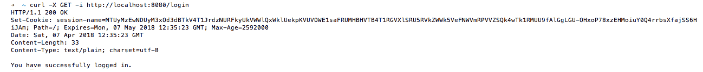
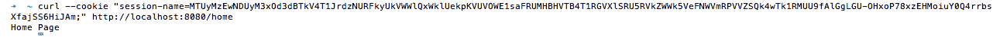
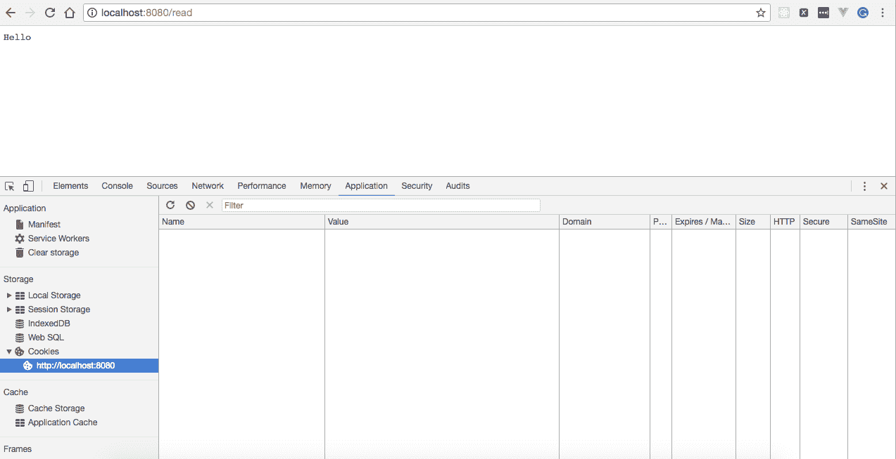
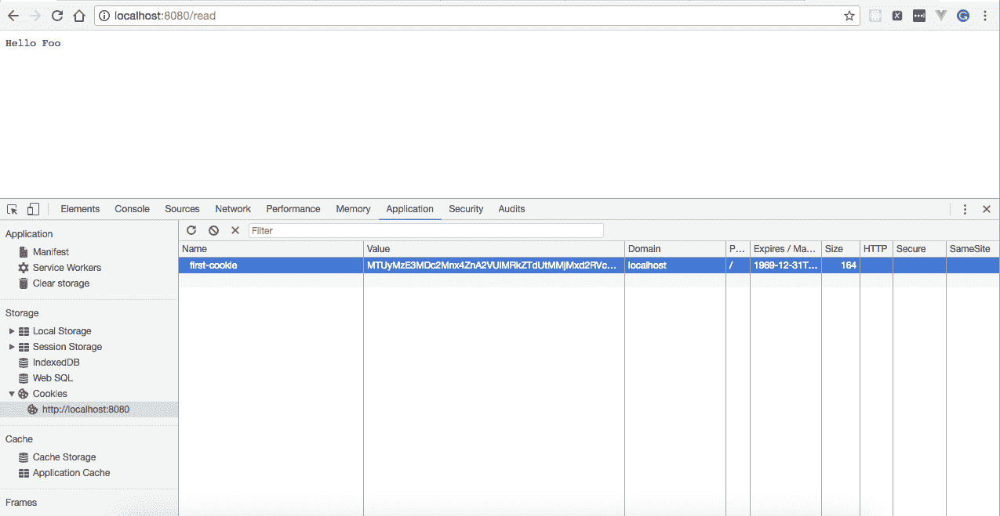
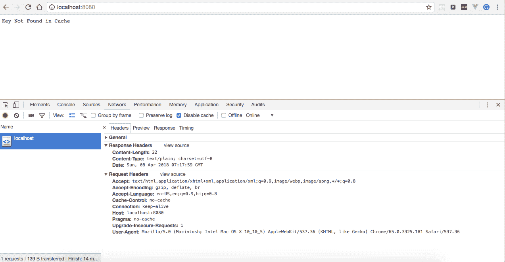
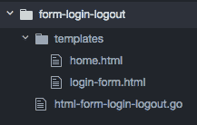
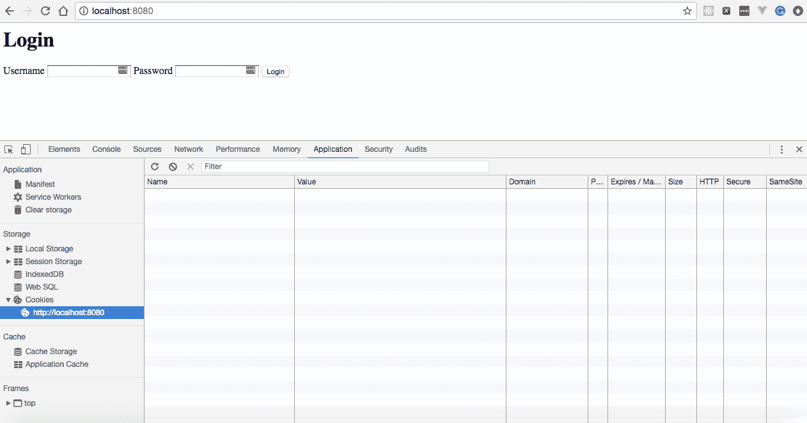
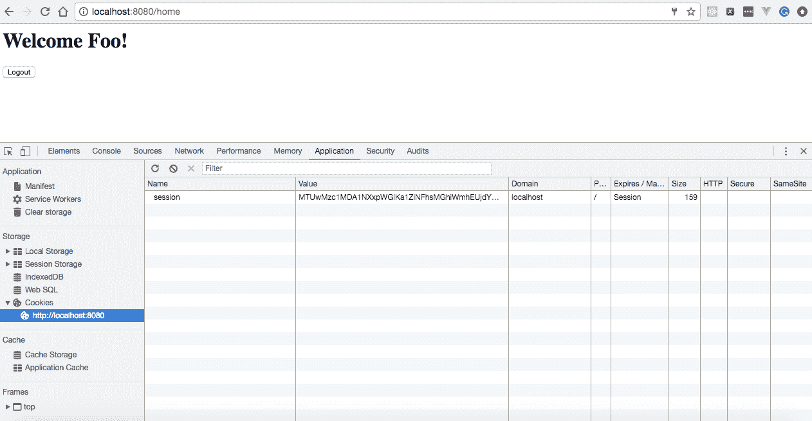
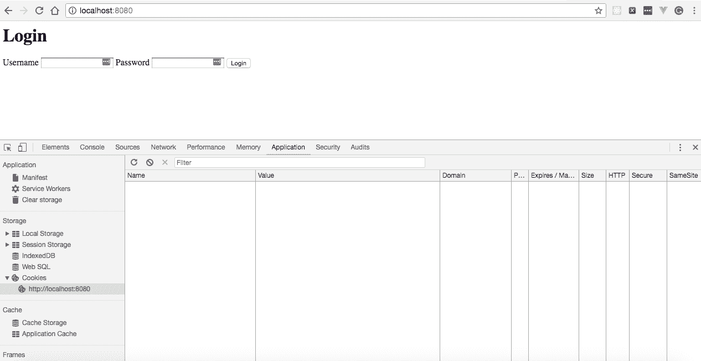

# 三、在 Go 中使用会话、错误处理和缓存

在本章中，我们将介绍以下配方：

*   创建第一个 HTTP 会话
*   使用 Redis 管理 HTTP 会话
*   创建第一个 HTTP cookie
*   在 Go 中实现缓存
*   在 Go 中实现 HTTP 错误处理
*   在 web 应用中实现登录和注销

# 介绍

有时，我们希望将诸如用户数据之类的信息持久化到应用级别，而不是将其持久化到数据库中，这可以通过会话和 cookie 轻松实现。两者的区别在于会话存储在服务器端，而 cookie 存储在客户端。我们可能还需要缓存静态数据，以避免对数据库或 web 服务进行不必要的调用，并在开发 web 应用时实现错误处理。了解了本章所涵盖的概念后，我们将能够以一种相当简单的方式实现所有这些功能。

在本章中，我们将从创建 HTTP 会话开始，然后学习如何使用 Redis 管理会话，创建 cookie，缓存 HTTP 响应，实现错误处理，最后在 Go 中实现登录和注销机制

# 创建第一个 HTTP 会话

HTTP 是一种无状态协议，这意味着每次客户端检索网页时，客户端都会打开一个与服务器的单独连接，服务器会响应该连接，而不会保留以前客户端请求的任何记录。因此，如果我们想要实现一种机制，其中服务器知道客户端发送给它的请求，那么我们可以使用会话来实现它。

当我们使用会话时，客户端只需要发送一个 ID，并从服务器加载相应 ID 的数据。我们可以通过三种方式在 web 应用中实现这一点：

*   曲奇饼
*   隐藏表单字段
*   URL 重写

在此配方中，我们将使用 HTTP cookies 实现一个会话。

# 怎么做…

1.  使用`go get`命令安装`github.com/gorilla/sessions`包，如下所示：

```go
$ go get github.com/gorilla/sessions
```

2.  创建`http-session.go`，其中我们将创建一个 Gorilla cookie 存储，以保存和检索会话信息，定义三个处理程序—`/login`、`/home`和`/logout`——其中我们将创建有效的会话 cookie，将响应写入 HTTP 响应流，并分别使会话 cookie 无效，如下所示：

```go
package main
import 
(
  "fmt"
  "log"
  "net/http"
  "github.com/gorilla/sessions"
)
const 
(
  CONN_HOST = "localhost"
  CONN_PORT = "8080"
)
var store *sessions.CookieStore
func init() 
{
  store = sessions.NewCookieStore([]byte("secret-key"))
}
func home(w http.ResponseWriter, r *http.Request) 
{
  session, _ := store.Get(r, "session-name")
  var authenticated interface{} = session.Values["authenticated"]
  if authenticated != nil 
  {
    isAuthenticated := session.Values["authenticated"].(bool)
    if !isAuthenticated 
    {
      http.Error(w, "You are unauthorized to view the page",
      http.StatusForbidden)
      return
    }
    fmt.Fprintln(w, "Home Page")
  } 
  else 
  {
    http.Error(w, "You are unauthorized to view the page",
    http.StatusForbidden)
    return
  }
}
func login(w http.ResponseWriter, r *http.Request) 
{
  session, _ := store.Get(r, "session-name")
  session.Values["authenticated"] = true
  session.Save(r, w)
  fmt.Fprintln(w, "You have successfully logged in.")
}
func logout(w http.ResponseWriter, r *http.Request) 
{
  session, _ := store.Get(r, "session-name")
  session.Values["authenticated"] = false
  session.Save(r, w)
  fmt.Fprintln(w, "You have successfully logged out.")
}
func main() 
{
  http.HandleFunc("/home", home)
  http.HandleFunc("/login", login)
  http.HandleFunc("/logout", logout)
  err := http.ListenAndServe(CONN_HOST+":"+CONN_PORT, nil)
  if err != nil 
  {
    log.Fatal("error starting http server : ", err)
    return
  }
}
```

3.  使用以下命令运行程序：

```go
$ go run http-session.go
```

# 它是如何工作的…

一旦我们运行该程序，HTTP 服务器将开始在端口`8080`上本地侦听。

接下来，我们将执行几个命令来查看会话是如何工作的。

首先，我们将通过执行以下命令来访问`/home`：

```go
$ curl -X GET http://localhost:8080/home
```

这将导致服务器发出未经授权的访问消息，如以下屏幕截图所示：


这是因为我们首先必须登录到一个应用，该应用将创建一个会话 ID，服务器将在提供对任何网页的访问之前验证该会话 ID。那么，让我们登录到应用：

```go
$ curl -X GET -i http://localhost:8080/login
```

执行上一个命令将给我们提供`Cookie`，必须将其设置为访问任何网页的请求标头：


接下来，我们将使用提供的`Cookie`访问`/home`，如下所示：

```go
$ curl --cookie "session-name=MTUyMzEwMTI3NXxEdi1CQkFFQ180SUFBUkFCRUFBQUpmLUNBQUVHYzNSeWFXNW5EQThBRFdGMWRHaGxiblJwWTJGMFpXUUVZbTl2YkFJQ0FBRT18ou7Zxn3qSbqHHiajubn23Eiv8a348AhPl8RN3uTRM4M=;" http://localhost:8080/home
```

这将导致主页作为服务器的响应：


让我们了解一下我们编写的围棋程序：

*   使用`var store *sessions.CookieStore`，我们声明了一个私有 cookie 存储，以使用安全 cookie 存储会话。
*   使用`func init() { store = sessions.NewCookieStore([]byte("secret-key")) }`，我们定义了一个在`main()`之前运行的`init()`函数来创建一个新的 cookie 存储并将其分配给`store`。

`init()` is always called, regardless of whether there's a main function or not, so if you import a package that has an `init` function, it will be executed.

*   接下来，我们定义了一个`home`处理程序，在使用`store.Get`将会话添加到注册表并从缓存中获取`authenticated`键的值之后，我们从 cookie 存储中获取给定名称的会话。如果为真，则将`Home Page`写入 HTTP 响应流；否则，我们会写一封未经授权查看页面的邮件，并附上一个`403`HTTP 代码。

*   接下来，我们定义了一个`login`处理程序，在这里我们再次获得一个会话，将`authenticated`键设置为`true`值，保存它，最后将您已成功登录写入 HTTP 响应流。
*   接下来，我们定义了一个`logout`处理程序，在其中我们获得一个会话，设置一个`authenticated`键，值为`false`，保存它，最后将您已成功注销写入 HTTP 响应流。
*   最后，我们定义了`main()`，将所有处理程序`home`、`login`和`logout`分别映射到`/home`、`/login`和`/logout`，并在`localhost:8080`上启动 HTTP 服务器。

# 使用 Redis 管理 HTTP 会话

在使用分布式应用时，我们可能必须为前端用户实现无状态负载平衡。这样我们就可以在数据库或文件系统中持久保存会话信息，以便在服务器关闭或重新启动时识别用户并检索他们的信息。

我们将解决这个问题，作为使用 Redis 作为持久存储来保存会话的方法的一部分。

# 准备好了…

由于我们已经使用 Gorilla cookie store 在之前的配方中创建了一个会话变量，因此我们将扩展此配方以在 Redis 中保存会话信息，而不是在服务器上维护它。

Gorilla 会话存储有多种实现，您可以在`https://github.com/gorilla/sessions#store-implementations`中找到。由于我们使用 Redis 作为后端存储，我们将使用`https://github.com/boj/redistore`，它依赖于 Redigo Redis 库来存储会话。

此方法假设您已在端口`6379`和`4567`上分别安装并本地运行 Redis 和 Redis Browser。

# 怎么做…

1.  使用`go get`命令安装`gopkg.in/boj/redistore.v1`和`github.com/gorilla/sessions`，如下所示：

```go
$ go get gopkg.in/boj/redistore.v1
$ go get github.com/gorilla/sessions
```

2.  创建`http-session-redis.go`，在这里我们将创建一个`RedisStore`来存储和检索会话变量，如下所示：

```go
package main
import 
(
  "fmt"
  "log"
  "net/http"
  "github.com/gorilla/sessions"
  redisStore "gopkg.in/boj/redistore.v1"
)
const 
(
  CONN_HOST = "localhost"
  CONN_PORT = "8080"
)
var store *redisStore.RediStore
var err error
func init() 
{
  store, err = redisStore.NewRediStore(10, "tcp", ":6379", "",
  []byte("secret-key"))
  if err != nil 
  {
    log.Fatal("error getting redis store : ", err)
  }
}
func home(w http.ResponseWriter, r *http.Request) 
{
  session, _ := store.Get(r, "session-name")
  var authenticated interface{} = session.Values["authenticated"]
  if authenticated != nil 
  {
    isAuthenticated := session.Values["authenticated"].(bool)
    if !isAuthenticated 
    {
      http.Error(w, "You are unauthorized to view the page",
      http.StatusForbidden)
      return
    }
    fmt.Fprintln(w, "Home Page")
  } 
  else 
  {
    http.Error(w, "You are unauthorized to view the page",
    http.StatusForbidden)
    return
  }
}
func login(w http.ResponseWriter, r *http.Request) 
{
  session, _ := store.Get(r, "session-name")
  session.Values["authenticated"] = true
  if err = sessions.Save(r, w); err != nil 
  {
    log.Fatalf("Error saving session: %v", err)
  }
  fmt.Fprintln(w, "You have successfully logged in.")
}
func logout(w http.ResponseWriter, r *http.Request) 
{
  session, _ := store.Get(r, "session-name")
  session.Values["authenticated"] = false
  session.Save(r, w)
  fmt.Fprintln(w, "You have successfully logged out.")
}
func main() 
{
  http.HandleFunc("/home", home)
  http.HandleFunc("/login", login)
  http.HandleFunc("/logout", logout)
  err := http.ListenAndServe(CONN_HOST+":"+CONN_PORT, nil)
  defer store.Close()
  if err != nil 
  {
    log.Fatal("error starting http server : ", err)
    return
  }
}
```

3.  使用以下命令运行程序：

```go
$ go run http-session-redis.go
```

# 它是如何工作的…

一旦我们运行程序，HTTP 服务器将在端口`8080`上开始本地侦听。

接下来，我们将执行几个命令来查看会话是如何工作的。

首先，我们将通过执行以下命令来访问`/home`：

```go
$ curl -X GET http://localhost:8080/home
```

这将导致服务器发出未经授权的访问消息，如以下屏幕截图所示：


这是因为我们首先必须登录到一个应用，它将创建一个**会话 ID**，服务器将在提供对任何网页的访问之前验证该 ID。那么，让我们登录到应用：

```go
$ curl -X GET -i http://localhost:8080/login
```

执行上一个命令将给我们提供`Cookie`，必须将其设置为访问任何网页的请求标头：



执行上一个命令后，将在 Redis 中创建并保存一个`Cookie`，您可以通过从`redis-cli`或在 Redis 浏览器中执行该命令看到，如下图所示：


接下来，我们将使用提供的`Cookie`访问`/home`，如下所示：

```go
$ curl --cookie "session-name=MTUyMzEwNDUyM3xOd3dBTkV4T1JrdzNURFkyUkVWWlQxWklUekpKVUVOWE1saFRUMHBHVTB4T1RGVXlSRU5RVkZWWk5VeFNWVmRPVVZSQk4wTk1RMUU9fAlGgLGU-OHxoP78xzEHMoiuY0Q4rrbsXfajSS6HiJAm;" http://localhost:8080/home
```

这将导致主页作为服务器的响应：



让我们了解一下我们在这个配方中引入的变化：

1.  使用`var store *redisStore.RediStore`，我们声明了一个私有`RediStore`来在 Redis 中存储会话。
2.  接下来，我们更新了`init()`函数以创建`NewRediStore`，其中空闲连接的大小和最大数量为`10`，并将其分配给存储。如果在创建存储时出现错误，那么我们将记录错误并使用状态代码`1`退出。
3.  最后，我们更新了`main()`以引入`defer store.Close()`语句，一旦我们从函数返回，它将关闭 Redis 存储。

# 创建第一个 HTTP cookie

Cookie 在客户端存储信息时起着重要作用，我们可以使用它们的值来识别用户。基本上，Cookie 的发明是为了解决记住用户信息或持久登录身份验证的问题，持久登录身份验证指的是网站能够在会话之间记住主体的身份。

Cookie 是 web 浏览器在您访问 internet 上的网站时创建的简单文本文件。您的设备将文本文件存储在本地，允许浏览器访问 cookie 并将数据传递回原始网站，并以名称-值对的形式保存。

# 怎么做…

1.  使用`go get`命令安装`github.com/gorilla/securecookie`包，如下所示：

```go
$ go get github.com/gorilla/securecookie
```

2.  创建`http-cookie.go`，在这里我们将创建一个 Gorilla 安全 cookie 来存储和检索 cookie，如下所示：

```go
package main
import 
(
  "fmt"
  "log"
  "net/http"
  "github.com/gorilla/securecookie"
)
const 
(
  CONN_HOST = "localhost"
  CONN_PORT = "8080"
)
var cookieHandler *securecookie.SecureCookie
func init() 
{
  cookieHandler = securecookie.New(securecookie.
  GenerateRandomKey(64),
  securecookie.GenerateRandomKey(32))
}
func createCookie(w http.ResponseWriter, r *http.Request) 
{
  value := map[string]string
  {
    "username": "Foo",
  }
  base64Encoded, err := cookieHandler.Encode("key", value)
  if err == nil 
  {
    cookie := &http.Cookie
    {
      Name: "first-cookie",
      Value: base64Encoded,
      Path: "/",
    }
    http.SetCookie(w, cookie)
  }
  w.Write([]byte(fmt.Sprintf("Cookie created.")))
}
func readCookie(w http.ResponseWriter, r *http.Request) 
{
  log.Printf("Reading Cookie..")
  cookie, err := r.Cookie("first-cookie")
  if cookie != nil && err == nil 
  {
    value := make(map[string]string)
    if err = cookieHandler.Decode("key", cookie.Value, &value); 
    err == nil 
    {
      w.Write([]byte(fmt.Sprintf("Hello %v \n", 
      value["username"])))
    }
  } 
  else 
  {
    log.Printf("Cookie not found..")
    w.Write([]byte(fmt.Sprint("Hello")))
  }
}

func main() 
{
  http.HandleFunc("/create", createCookie)
  http.HandleFunc("/read", readCookie)
  err := http.ListenAndServe(CONN_HOST+":"+CONN_PORT, nil)
  if err != nil 
  {
    log.Fatal("error starting http server : ", err)
    return
  }
}
```

3.  使用以下命令运行程序：

```go
$ go run http-cookie.go
```

# 它是如何工作的…

一旦我们运行程序，HTTP 服务器将在端口`8080`上开始本地侦听。

浏览`http://localhost:8080/read`会在浏览器中显示 Hello，如下图所示：



接下来，我们将访问`http://localhost:8080/create`，它将创建一个名为 first cookie 的 cookie，并在浏览器中显示 cookie created 消息：


现在，对`http://localhost:8080/read`的后续访问将使用 first cookie 显示 Hello，后面是 first cookie 的值，如下所示：



让我们了解一下我们编写的程序：

*   使用`import ("fmt" "log" "net/http" "github.com/gorilla
    /securecookie")`，我们引入了一个额外的包——`github.com/gorilla/securecookie`，我们将使用它对经过身份验证和加密的 cookie 值进行编码和解码。
*   使用`var cookieHandler *securecookie.SecureCookie`，我们声明了一个私有安全 cookie。
*   接下来，我们更新了`init()`函数，创建`SecureCookie`传递 64 字节的散列密钥，该散列密钥用于使用 HMAC 验证值，32 字节的块密钥用于加密值。
*   接下来，我们定义了一个`createCookie`处理程序，其中我们使用`gorilla/securecookie`的`Encode`处理程序创建一个`Base64`编码的 cookie，其键为`username`，值为`Foo`。然后，我们在提供的`ResponseWriter`头中添加`Set-Cookie`头，并将`Cookie created.`消息写入 HTTP 响应。

*   接下来，我们定义了一个`readCookie`处理程序，在这里我们从请求中检索一个 cookie，在我们的代码中是`first-cookie`，为它获取一个值，并将其写入 HTTP 响应。
*   最后，我们定义了`main()`，将所有处理程序`createCookie`和`readCookie`分别映射到`/create`和`/read`，并在`localhost:8080`上启动 HTTP 服务器。

# 在 Go 中实现缓存

在 web 应用中缓存数据有时是必要的，以避免一次又一次地从数据库或外部服务请求静态数据。Go 不提供任何内置包来缓存响应，但它通过外部包来支持它。

有许多包，例如`https://github.com/coocood/freecache`和`https://github.com/patrickmn/go-cache`，可以帮助实现缓存，在这个配方中，我们将使用`https://github.com/patrickmn/go-cache`来实现缓存。

# 怎么做…

1.  使用`go get`命令安装`github.com/patrickmn/go-cache`包，如下所示：

```go
$ go get github.com/patrickmn/go-cache
```

2.  创建`http-caching.go`，在这里我们将创建一个缓存，并在服务器启动时用数据填充它，如下所示：

```go
package main
import 
(
  "fmt"
  "log"
  "net/http"
  "time"
  "github.com/patrickmn/go-cache"
)
const 
(
  CONN_HOST = "localhost"
  CONN_PORT = "8080"
)
var newCache *cache.Cache
func init() 
{
  newCache = cache.New(5*time.Minute, 10*time.Minute)
  newCache.Set("foo", "bar", cache.DefaultExpiration)
}
func getFromCache(w http.ResponseWriter, r *http.Request) 
{
  foo, found := newCache.Get("foo")
  if found 
  {
    log.Print("Key Found in Cache with value as :: ", 
    foo.(string))
    fmt.Fprintf(w, "Hello "+foo.(string))
  } 
  else 
  {
    log.Print("Key Not Found in Cache :: ", "foo")
    fmt.Fprintf(w, "Key Not Found in Cache")
  }
}
func main() 
{
  http.HandleFunc("/", getFromCache)
  err := http.ListenAndServe(CONN_HOST+":"+CONN_PORT, nil)
  if err != nil 
  {
    log.Fatal("error starting http server : ", err)
    return
  }
}
```

3.  使用以下命令运行程序：

```go
$ go run http-caching.go
```

# 它是如何工作的…

一旦我们运行程序，HTTP 服务器将在端口`8080`上开始本地侦听。

启动时，名为`foo`且值为`bar`的密钥将添加到缓存中

浏览`http://localhost:8080/`会从缓存中读取一个键值，并将其附加到 Hello 中，如下图所示：


我们在程序中指定了缓存数据过期时间为 5 分钟，这意味着我们在服务器启动时在缓存中创建的密钥在 5 分钟后将不在那里。因此，五分钟后再次访问同一 URL 将从服务器返回缓存中未找到的密钥，如下所示：



让我们了解一下我们编写的程序：

1.  使用`var newCache *cache.Cache`，我们声明了一个私有缓存。
2.  接下来，我们更新了`init()`函数，其中我们创建了一个有 5 分钟过期时间和 10 分钟清理间隔的缓存，并向缓存中添加了一个项，该项的键为`foo`，其值为`bar`，其过期值为`0`，这意味着我们要使用缓存的默认过期时间。

如果过期持续时间小于一（或`NoExpiration`，则缓存中的项目永远不会过期（默认），必须手动删除。如果清除间隔小于 1，则在调用`c.DeleteExpired()`之前不会从缓存中删除过期项目。

3.  接下来，我们定义了`getFromCache`处理程序，在该处理程序中，我们从缓存中检索密钥的值。如果找到，我们将其写入 HTTP 响应；否则，我们将`Key Not Found in Cache`消息写入 HTTP 响应。

# 在 Go 中实现 HTTP 错误处理

在任何 web 应用中实现错误处理是主要方面之一，因为它有助于更快地排除故障和修复错误。错误处理意味着，每当应用中发生错误时，应该将其记录在某个地方，或者记录在文件中，或者记录在数据库中，并带有正确的错误消息以及堆栈跟踪。

在 Go 中，它可以以多种方式实现。一种方法是编写自定义处理程序，我们将在本食谱中介绍。

# 怎么做…

1.  使用`go get`命令安装`github.com/gorilla/mux`包，如下所示：

```go
$ go get github.com/gorilla/mux
```

2.  创建`http-error-handling.go`，在这里我们将创建一个自定义处理程序，作为包装器来处理所有 HTTP 请求，如下所示：

```go
package main
import 
(
  "errors"
  "fmt"
  "log"
  "net/http"
  "strings"
  "github.com/gorilla/mux"
)
const 
(
  CONN_HOST = "localhost"
  CONN_PORT = "8080"
)
type NameNotFoundError struct 
{
  Code int
  Err error
}
func (nameNotFoundError NameNotFoundError) Error() string 
{
  return nameNotFoundError.Err.Error()
}
type WrapperHandler func(http.ResponseWriter, *http.Request) 
error
func (wrapperHandler WrapperHandler) ServeHTTP(w http.
ResponseWriter, r *http.Request) 
{
  err := wrapperHandler(w, r)
  if err != nil 
  {
    switch e := err.(type) 
    {
      case NameNotFoundError:
      log.Printf("HTTP %s - %d", e.Err, e.Code)
      http.Error(w, e.Err.Error(), e.Code)
      default:
      http.Error(w, http.StatusText(http.
      StatusInternalServerError),
      http.StatusInternalServerError)
    }
  }
}
func getName(w http.ResponseWriter, r *http.Request) error 
{
  vars := mux.Vars(r)
  name := vars["name"]
  if strings.EqualFold(name, "foo") 
  {
    fmt.Fprintf(w, "Hello "+name)
    return nil
  } 
  else 
  {
    return NameNotFoundError{500, errors.New("Name Not Found")}
  }
}
func main() 
{
  router := mux.NewRouter()
  router.Handle("/employee/get/{name}",
  WrapperHandler(getName)).Methods("GET")
  err := http.ListenAndServe(CONN_HOST+":"+CONN_PORT, router)
  if err != nil 
  {
    log.Fatal("error starting http server : ", err)
    return
  }
}
```

3.  使用以下命令运行程序：

```go
$ go run http-error-handling.go
```

# 它是如何工作的…

一旦我们运行程序，HTTP 服务器将在端口`8080`上开始本地侦听。

接下来，浏览`http://localhost:8080/employee/get/foo`会给我们打招呼，然后是员工姓名，状态代码为`200`，作为浏览器中的响应：


另一方面，访问`http://localhost:8080/employee/get/bar`会返回一个 HTTP 错误，消息名为 Not Found，错误代码为`500`：


让我们了解一下我们编写的程序：

1.  我们定义了一个具有两个字段的`NameNotFoundError`结构-`int`类型的`Code`和`error`类型的`Err`，这表示一个与相关 HTTP 状态代码相关的错误，如下所示：

```go
type NameNotFoundError struct 
{
  Code int
  Err error
}
```

2.  然后，我们允许`NameNotFoundError`满足错误接口，如下所示：

```go
func (nameNotFoundError NameNotFoundError) Error() string 
{
  return nameNotFoundError.Err.Error()
}
```

3.  接下来，我们定义了一个用户定义的类型`WrapperHandler`，这是一个 Go 函数，它接受任何接受`func(http.ResponseWriter, *http.Request)`作为输入参数的处理程序，并返回一个错误。
4.  然后，我们定义了一个`ServeHTTP`处理程序，它调用我们传递给`WrapperHandler`的处理程序，将`(http.ResponseWriter, *http.Request)`作为参数传递给它，并检查处理程序是否返回任何错误。如果有，则使用开关盒对其进行适当处理，如下所示：

```go
if err != nil 
{
  switch e := err.(type) 
  {
    case NameNotFoundError:
    log.Printf("HTTP %s - %d", e.Err, e.Code)
    http.Error(w, e.Err.Error(), e.Code)
    default:
    http.Error(w, http.StatusText(http.
    StatusInternalServerError),
    http.StatusInternalServerError)
  }
}
```

5.  接下来，我们定义了一个`getName`处理程序，它提取请求路径变量，获取`name`变量的值，并检查名称是否与`foo`匹配。如果是这样，那么它会将 Hello（后跟名称）写入 HTTP 响应；否则，它返回一个`Code`字段值为`500`的`NameNotFoundError`结构和一个带文本`Name Not Found`的`err`字段值为`error`的`NameNotFoundError`结构。
6.  最后，我们定义了`main()`，其中我们注册`WrapperHandler`作为 URL 模式调用的处理程序`/get/{name}`。

# 在 web 应用中实现登录和注销

每当我们希望注册用户访问应用时，我们都必须实现一种机制，在允许用户查看任何网页之前要求用户提供凭据，我们将在本配方中介绍这一点。

# 准备好了…

由于我们已经在前面的一个方法中创建了一个 HTML 表单，我们将使用`gorilla/securecookie`包对其进行更新，以实现登录和注销机制。

参见[第 2 章](02.html)中的*在 web 应用*中实现登录和注销的配方，*使用模板、静态文件和 HTML 表单*。

# 怎么做…

1.  使用`go get`命令安装`github.com/gorilla/mux`和`github.com/gorilla/securecookie`，如下所示：

```go
$ go get github.com/gorilla/mux
$ go get github.com/gorilla/securecookie
```

2.  在`templates`目录中创建`home.html`，如下所示：

```go
$ mkdir templates && cd templates && touch home.html
```

3.  将以下内容复制到`home.html`：

```go
<html>
  <head>
    <title></title>
  </head>
  <body>
    <h1>Welcome {{.userName}}!</h1>
    <form method="post" action="/logout">
      <button type="submit">Logout</button>
    </form>
  </body>
</html>
```

在前面的模板中，我们定义了占位符`{{.userName}}`，其值将在运行时由模板引擎和注销按钮替换。通过单击注销按钮，客户端将对表单操作进行`POST`调用，在本例中为`/logout`

4.  创建`html-form-login-logout.go`，在这里我们将解析登录表单，读取用户名字段，并在用户单击登录按钮时设置会话 cookie。我们还将在用户单击注销按钮后清除会话，如下所示：

```go
package main
import 
(
  "html/template"
  "log"
  "net/http"
  "github.com/gorilla/mux"
  "github.com/gorilla/securecookie"
)
const 
(
  CONN_HOST = "localhost"
  CONN_PORT = "8080"
)
var cookieHandler = securecookie.New
(
  securecookie.GenerateRandomKey(64),
  securecookie.GenerateRandomKey(32)
)
func getUserName(request *http.Request) (userName string) 
{
  cookie, err := request.Cookie("session")
  if err == nil 
  {
    cookieValue := make(map[string]string)
    err = cookieHandler.Decode("session", cookie.Value,
    &cookieValue)
    if err == nil 
    {
      userName = cookieValue["username"]
    }
  }
  return userName
}
func setSession(userName string, response http.ResponseWriter) 
{
  value := map[string]string
  {
    "username": userName,
  }
  encoded, err := cookieHandler.Encode("session", value)
  if err == nil 
  {
    cookie := &http.Cookie
    {
      Name: "session",
      Value: encoded,
      Path: "/",
    }
    http.SetCookie(response, cookie)
  }
}
func clearSession(response http.ResponseWriter) 
{
  cookie := &http.Cookie
  {
    Name: "session",
    Value: "",
    Path: "/",
    MaxAge: -1,
  }
  http.SetCookie(response, cookie)
}
func login(response http.ResponseWriter, request *http.Request) 
{
  username := request.FormValue("username")
  password := request.FormValue("password")
  target := "/"
  if username != "" && password != "" 
  {
    setSession(username, response)
    target = "/home"
  }
  http.Redirect(response, request, target, 302)
}
func logout(response http.ResponseWriter, request *http.Request) 
{
  clearSession(response)
  http.Redirect(response, request, "/", 302)
}
func loginPage(w http.ResponseWriter, r *http.Request) 
{
  parsedTemplate, _ := template.ParseFiles("templates/
  login-form.html")
  parsedTemplate.Execute(w, nil)
}
func homePage(response http.ResponseWriter, request *http.Request) 
{
  userName := getUserName(request)
  if userName != "" 
  {
    data := map[string]interface{}
    {
      "userName": userName,
    }
    parsedTemplate, _ := template.ParseFiles("templates/home.html")
    parsedTemplate.Execute(response, data)
  } 
  else 
  {
    http.Redirect(response, request, "/", 302)
  }
}
func main() 
{
  var router = mux.NewRouter()
  router.HandleFunc("/", loginPage)
  router.HandleFunc("/home", homePage)
  router.HandleFunc("/login", login).Methods("POST")
  router.HandleFunc("/logout", logout).Methods("POST")
  http.Handle("/", router)
  err := http.ListenAndServe(CONN_HOST+":"+CONN_PORT, nil)
  if err != nil 
  {
    log.Fatal("error starting http server : ", err)
    return
  }
}
```

一切就绪后，目录结构应如下所示：



5.  使用以下命令运行程序：

```go
$ go run html-form-login-logout.go
```

# 它是如何工作的…

一旦我们运行该程序，HTTP 服务器将开始在端口`8080`上本地侦听。

接下来浏览`http://localhost:8080`会显示登录表单，如下图所示：



在输入用户名`Foo`和随机密码后提交表单将显示欢迎 Foo！在浏览器中创建一个名为 session 的 cookie，该 cookie 管理用户登录/注销状态：



现在，`http://localhost:8080/home`的每个后续请求都将显示 Welcome Foo！在浏览器中显示消息，直到名为 session 的 cookie 存在。

接下来，清除 cookie 后访问`http://localhost:8080/home`会将我们重定向到`http://localhost:8080/`并显示登录表单：



让我们了解一下我们编写的程序。

1.  使用`var cookieHandler = securecookie.New(securecookie.
    GenerateRandomKey(64), securecookie.GenerateRandomKey(32))`，我们正在创建一个安全 cookie，将哈希键作为第一个参数传递，将块键作为第二个参数传递。散列密钥用于使用 HMAC 对值进行身份验证，块密钥用于对值进行加密。
2.  接下来，我们定义了一个`getUserName`处理程序，从 HTTP 请求中获取 cookie，初始化字符串`keys`到字符串`values`的`cookieValue`映射，解码 cookie，并获取用户名和返回值。
3.  接下来，我们定义了一个`setSession`处理程序，在这里我们创建并初始化一个映射，`key`和`value`为`username`，**将其序列化，使用消息身份验证代码对其签名，使用`cookieHandler.Encode`处理程序对其编码，创建一个新的 HTTP cookie，并将其写入 HTTP 响应流。**

 **4.  接下来，我们定义了`clearSession`，它基本上将 cookie 的值设置为空，并将其写入 HTTP 响应流。
5.  接下来，我们定义了一个`login`处理程序，从 HTTP 表单中获取用户名和密码，检查两者是否都为空，然后调用`setSession`处理程序并重定向到`/home`，否则重定向到根 URL`/`。
6.  接下来，我们定义了一个`logout`处理程序，在这里我们清除调用`clearSession`处理程序的会话值并重定向到根 URL。
7.  接下来，我们定义了一个`loginPage`处理程序，在这里我们解析`login-form.html`，返回一个带有名称及其内容的新模板，调用解析模板上的`Execute`处理程序，该处理程序生成 HTML 输出，并将其写入 HTTP 响应流
8.  接下来，我们定义了一个`homePage`处理程序，它从调用`getUserName`处理程序的 HTTP 请求中获取用户名。然后，我们检查它是否为空或是否存在 cookie 值。如果用户名不为空，解析`home.html`，将用户名作为数据映射注入，生成 HTML 输出，写入 HTTP 响应流；否则，我们将其重定向到根 URL`/`。

最后，我们定义了`main()`方法，在这里我们开始执行程序。由于此方法可以做很多事情，让我们逐行查看：

*   `var router = mux.NewRouter()`：这里我们创建一个新的路由器实例。
*   `router.HandleFunc("/", loginPage)`：这里，我们使用`gorilla/mux`包的`HandleFunc`将`loginPageHandler`处理程序注册为`/`URL 模式，这意味着每当我们使用`/`模式访问 HTTP URL 时，`loginPage`处理程序通过将`(http.ResponseWriter, *http.Request)`作为参数传递给它来执行。
*   `router.HandleFunc("/home", homePage)`：在这里，我们使用`gorilla/mux`包的`HandleFunc`将`homePageHandler`处理程序注册到`/home`URL 模式，这意味着每当我们使用`/home`模式访问 HTTP URL 时，`homePage`处理程序通过将`(http.ResponseWriter, *http.Request)`作为参数传递给它来执行。

*   `router.HandleFunc("/login", login).Methods("POST")`：在这里，我们使用`gorilla/mux`包的`HandleFunc`将`loginHandler`处理程序注册到`/login`URL 模式，这意味着每当我们使用`/login`模式访问 HTTP URL 时，`login`处理程序通过将`(http.ResponseWriter, *http.Request)`作为参数传递给它来执行。
*   `router.HandleFunc("/logout", logout).Methods("POST")`：在这里，我们使用`gorilla/mux`包的`HandleFunc`将`logoutHandler`处理程序注册到`/logout`URL 模式，这意味着每当我们使用`/logout`模式访问 HTTP URL 时，`logout`处理程序通过将`(http.ResponseWriter, *http.Request)`作为参数传递给它来执行。
*   `http.Handle("/", router)`：在这里，我们使用`net/http`包的`HandleFunc`为`/`URL 模式注册路由器，这意味着所有具有`/`URL 模式的请求都由路由器处理程序处理。
*   `err := http.ListenAndServe(CONN_HOST+":"+CONN_PORT, nil)`：在这里，我们调用`http.ListenAndServe`为 HTTP 请求提供服务，这些请求在单独的 Goroutine 中处理每个传入连接。`ListenAndServe`接受两个参数 server address 和 handler，其中 server address 为`localhost:8080`，handler 为`nil`，这意味着我们要求服务器使用`DefaultServeMux`作为处理程序。
*   `if err != nil { log.Fatal("error starting http server : ", err) return}`：在这里，我们检查启动服务器是否有问题。如果有，则记录错误并使用状态代码`1`退出。**