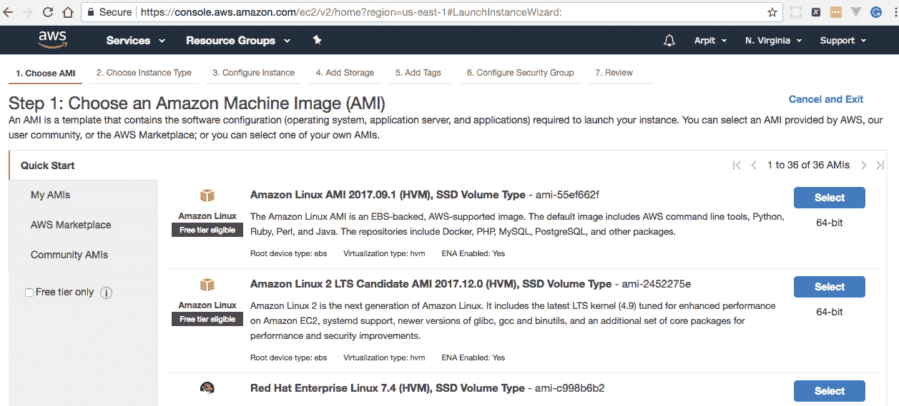
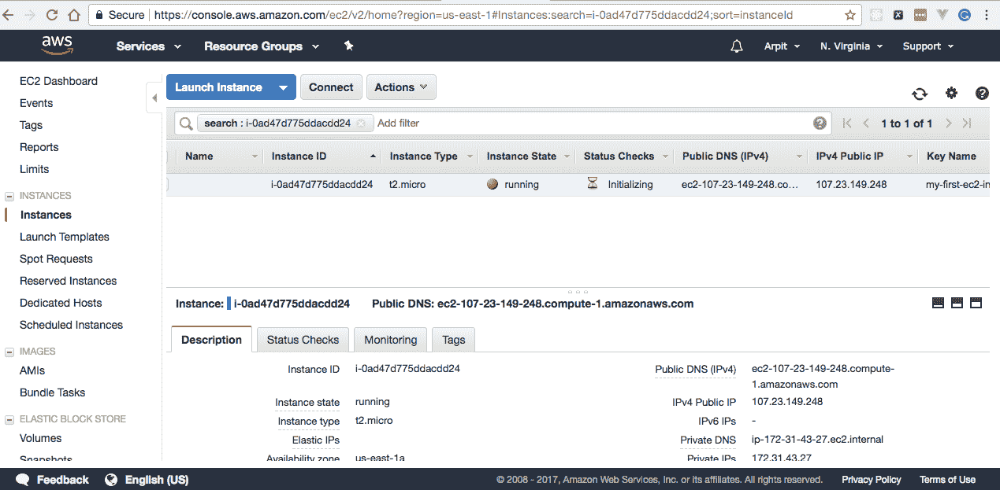
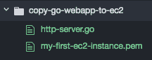
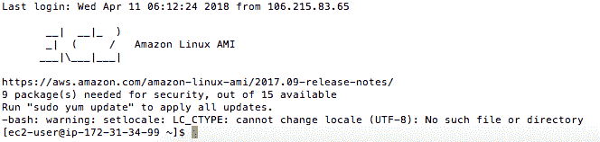
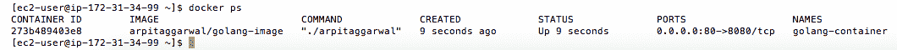

# 十一、将 Go Web 应用和 Docker 容器部署到 AWS

在本章中，我们将介绍以下配方：

*   创建第一个 EC2 实例以运行 Go web 应用
*   与第一个 EC2 实例交互
*   在第一个 EC2 实例上创建、复制和运行 Go web 应用
*   设置 EC2 实例以运行 Docker 容器
*   从 Docker Hub 拉取 AWS EC2 实例上的 Docker 映像
*   在 EC2 实例上运行 Go Docker 容器

# 介绍

如今，每个组织都在向 DevOps 迈进，每个人都在谈论持续集成和持续部署，通常称为 CI 和 CD，这已经成为开发人员必须学习的技能。当我们提到 CI/CD 时，在一个非常高的层次上，我们讨论了通过持续集成工具（如 Jenkins 和 Bambor）将容器部署到公共/私有云

在本章中，我们将学习如何将简单的 Go web 应用和 Go Docker 容器部署到手动配置的 EC2 实例。由于我们将与 Docker 和 AWS 合作，我假设您具备 Docker 和 AWS 的基本知识。

# 创建第一个 EC2 实例以运行 Go web 应用

在 AWS 上创建 EC2 实例与获得一台新机器并安装运行 web 应用所需的软件是一样的。在这个配方中，我们将创建一个 EC2 实例，提供它，并运行一个简单的 GoWeb 应用。

# 准备好了…

要开始在 AWSEC2 实例上创建和部署，首先，您必须创建并激活一个 AWS 帐户。因为这不符合这个食谱的上下文，所以我们不会在这里做

`https://aws.amazon.com/premiumsupport/knowledge-center/create-and-activate-aws-account/`提供了创建和激活 AWS 帐户的详细说明流程

# 怎么做…

1.  登录 AWS，进入 EC2 管理控制台**，点击创建实例部分的启动实例，如下图所示：**

 **

2.  选择 Amazon Linux AMI 2017.09.1（HVM），SSD 卷类型，如以下屏幕截图所示：



3.  选择 t2.micro 实例类型并单击下一步：配置实例详细信息：


4.  在配置实例详细信息部分启用自动分配公共 IP，如以下屏幕截图所示：


5.  请勿对添加存储和添加标记部分进行任何更改。
6.  添加 HTTP 和 HTTPS 规则，并单击 Configure Security Group 部分中的 Review and Launch 按钮，如以下屏幕截图所示：


7.  从下拉菜单中选择 Create a new key pair（创建新密钥对），为密钥对命名，然后单击 Download key pair（下载密钥对）按钮。保存`my-first-ec2-instance.pem`文件，点击启动实例，如下图所示：


# 它是如何工作的…

一旦单击 Launch Instance，它将在 AWS 上创建并启动一台 Linux 机器，并为该实例分配一个 ID、公共 DNS 和公共 IP，我们可以通过该 ID 访问它。

移动到 EC2 仪表板的 Instances 部分，您可以看到实例正在运行，如以下屏幕截图所示：



# 与第一个 EC2 实例交互

要在 EC2 实例上部署应用，我们首先必须登录并安装必要的包/软件，这可以通过`SSH`客户端轻松完成，例如`MobaXterm`、`Putty`等等。在这个配方中，我们将登录到一个 EC2 实例，它是我们在前面的配方中创建的，并使用 Red Hat 软件包管理器安装`Go`。

# 怎么做…

1.  通过执行`chmod`命令，将私钥文件`my-first-ec2-instance.pem`的权限设置为`400`，这意味着用户/所有者可以读取、不能写入、不能执行，而组和其他人不能读取、不能写入、不能执行，如下所示：

```go
$ chmod 400 my-first-ec2-instance.pem
```

2.  获取 EC2 实例的公共 DNS，通过执行`ssh`命令，使用私钥文件作为`ec2-user`连接到 EC2 实例，如下所示：

```go
$ ssh -i my-first-ec2-instance.pem ec2-user@ec2-172-31-34-99.compute-1.amazonaws.com
```

命令成功执行后，我们将登录到 EC2 实例，输出如下所示：


3.  执行`sudo`命令，从`ec2-user`切换到`root`用户：

```go
[ec2-user@ip-172-31-34-99 ~]$ sudo su
```

4.  使用 Red Hat 软件包管理器`yum`安装`Go`，如下所示：

```go
[root@ip-172-31-34-99 ~]$ yum install -y go
```

# 它是如何工作的…

通过执行`go version`命令，验证`ec2-user`是否已成功安装`Go`，如下所示：

```go
[ec2-user@ip-172-31-34-99 ~]$ go version
go version go1.8.4 linux/amd64
```

# 在第一个 EC2 实例上创建、复制和运行 Go web 应用

一旦我们有了一个安装了所需库的 EC2 实例，我们就可以简单地使用安全复制协议复制应用，然后使用`go run`命令运行它，我们将在本配方中介绍。

# 怎么做…

1.  创建`http-server.go`，在这里我们将创建一个简单的 HTTP 服务器，它将呈现 Hello World！从命令行浏览`http://ec2-instance-public-dns:80`或执行`curl -X GET http://ec2-instance-public-dns:80`，如下所示：

```go
package main
import 
(
  "fmt"
  "log"
  "net/http"
)
const 
(
  CONN_PORT = "80"
)
func helloWorld(w http.ResponseWriter, r *http.Request) 
{
  fmt.Fprintf(w, "Hello World!")
}
func main() 
{ 
  http.HandleFunc("/", helloWorld)
  err := http.ListenAndServe(":"+CONN_PORT, nil)
  if err != nil 
  {
    log.Fatal("error starting http server : ", err)
    return
  }
}
```

一切就绪后，目录结构应如下所示：



2.  使用安全复制或`scp`命令将`http-server.go`从本地机器目录复制到 EC2 用户主页（`/home/ec2-user`目录，如下所示：

```go
$ scp -i my-first-ec2-instance.pem http-server.go ec2-user@ec2-172-31-34-99.compute-1.amazonaws.com:/home/ec2-user
```

3.  使用私钥文件和公共 DNS 名称登录到 EC2 实例，如下所示：

```go
$ ssh -i my-first-ec2-instance.pem ec2-user@ec2-172-31-34-99.compute-1.amazonaws.com
```

4.  在后台运行`http-server.go`，执行不挂断或`nohup`命令，如下所示：

```go
[ec2-user@ip-172-31-34-99 ~] $ nohup go run http-server.go &
```

# 它是如何工作的…

一旦我们在 EC2 实例上运行该程序，HTTP 服务器将在端口`80`上开始本地侦听。 

接下来，从命令行执行一个`GET`请求，如下所示：

```go
$ curl -i -X GET http://ec2-172-31-34-99.compute-1.amazonaws.com:80/
```

这将给你好世界！作为响应，将给出以下输出：

```go
HTTP/1.1 200 OK
Date: Sat, 06 Jan 2018 10:59:38 GMT
Content-Length: 12
Content-Type: text/plain; charset=utf-8

Hello World!
```

# 设置 EC2 实例以运行 Docker 容器

要在 EC2 实例上运行 Docker 容器，我们首先必须使用 Docker 安装设置一个实例，并向 Docker 组添加一个`ec2-user`，以便我们可以使用`ec2-user`而不是`root`用户执行 Docker 命令，我们将在本配方中介绍这一点。

# 怎么做…

1.  执行以下命令，从`ec2-user`用户切换到`root`用户：

```go
[ec2-user@ip-172-31-34-99 ~]$ sudo su
[root@ip-172-31-34-99 ec2-user]#
```

2.  执行以下命令安装`Docker`并更新 EC2 实例：

```go
[root@ip-172-31-34-99 ec2-user] yum install -y docker
[root@ip-172-31-34-99 ec2-user] yum update -y
```

3.  通过执行以下命令，在 EC2 实例上将`Docker`作为服务启动：

```go
[root@ip-172-31-34-99 ec2-user] service docker start
```

4.  将`ec2-user`添加到`docker`组中，这样您就可以在不使用`sudo`的情况下执行 Docker 命令，如下所示：

```go
[root@ip-172-31-34-99 ec2-user] usermod -a -G docker ec2-user
```

5.  通过执行以下命令注销 EC2 实例：

```go
[root@ip-172-31-34-99 ec2-user]# exit
 exit
[ec2-user@ip-172-31-34-99 ~]$ exit
 logout
Connection to ec2-172-31-34-99.compute-1.amazonaws.com closed.
```

6.  通过执行以下命令，再次登录以获取新的 Docker 组权限：

```go
$ ssh -i my-first-ec2-instance.pem ec2-user@ec2-172-31-34-99.compute-1.amazonaws.com
```

这将为我们提供控制台上的输出，如以下屏幕截图所示：



# 它是如何工作的…

登录 EC2 实例，通过执行以下命令验证`ec2-user`是否可以在不使用`sudo`的情况下运行 Docker 命令：

```go
[ec2-user@ip-54-196-74-162 ~]$ docker info
```

这将显示有关 Docker 安装的系统范围信息，如以下输出所示：

```go
 Containers: 1
 Running: 1
 Paused: 0
 Stopped: 0
 Images: 1
 ...
 Kernel Version: 4.9.62-21.56.amzn1.x86_64
 Operating System: Amazon Linux AMI 2017.09
 ...
 Live Restore Enabled: false
```

# 从 Docker Hub 拉取 AWS EC2 实例上的 Docker 映像

要运行 Docker 容器，我们需要一个 Docker 映像，我们可以从`DockerFile`构建该映像，也可以从任何公共或私有 Docker 注册中心（如 Docker Hub、Quay、Google container Registry、AWS container Registry 等）提取该映像

由于我们已经在第 9 章*与 Go 和 Docker*合作中学习了如何从`DockerFile`创建 Docker 图像并将其推送到 Docker Hub，因此我们将不再在此配方中创建图像。相反，我们将在 EC2 实例上从 Docker Hub 中提取预构建的映像。

参见[第 9 章](09.html)*中的*打造你的第一个 Go-Docker 形象*配方*与 Go-and-Docker 合作。

# 怎么做…

1.  通过执行以下命令，从命令行使用凭据登录 Docker Hub：

```go
$ docker login --username arpitaggarwal --password XXXXX
 Login Succeeded
```

2.  执行`docker pull`命令将`arpitaggarwal/golang-image`从 Docker Hub 中拉出，如下所示：

```go
$ docker pull arpitaggarwal/golang-image
```

这将产生以下输出：


# 它是如何工作的…

登录 EC2 实例，执行以下命令验证`arpitaggarwal/golang-image`是否已成功从 Docker Hub 拉取：

```go
$ docker images
```

这将列出所有顶级图像、它们的存储库、标记及其大小，如以下屏幕截图所示：


# 在 EC2 实例上运行 Go Docker 容器

一旦我们在 EC2 实例上安装了 Docker 映像和 Docker，您就可以通过执行`docker run`命令来运行 Docker 容器，我们将在本配方中介绍这一点。

# 怎么做…

登录 EC2 实例，执行`docker run`命令，从`arpitaggarwal/golang-image`创建并运行 Docker 容器，将容器名称分配为`golang-container`，使用`--name`标志，如下所示：

```go
$ docker run -d -p 80:8080 --name golang-container -it arpitaggarwal/golang-image
 8a9256fcbffc505ad9406f5a8b42ae33ab3951fffb791502cfe3ada42aff781e
```

`docker run`命令中指定的`-d`标志以守护程序模式启动容器，最后的哈希字符串表示`golang-container`的 ID。
在`docker run`命令中指定的`-p`标志将容器的端口发布到主机。由于我们在 Docker 容器内的端口`8080`上运行 HTTP 服务器，并且我们为 E2C 实例的入站流量打开了端口`80`，因此我们将其映射为`80:8080`。

# 它是如何工作的…

登录到 EC2 实例，并通过执行以下命令验证 Docker 容器是否已创建并正在成功运行：

```go
$ docker ps
```

成功执行上述命令后，它将为我们提供正在运行的 Docker 容器详细信息，如以下屏幕截图所示：



获取 EC2 实例的公共 DNS，从命令行执行`GET`请求，如下所示：

```go
$ curl -i -X GET http://ec2-172-31-34-99.compute-1.amazonaws.com/
```

这将给你好世界！作为响应，如以下输出所示：

```go
 HTTP/1.1 200 OK
 Date: Sat, 06 Jan 2018 12:49:28 GMT
 Content-Length: 12
 Content-Type: text/plain; charset=utf-8
 Hello World!
```**