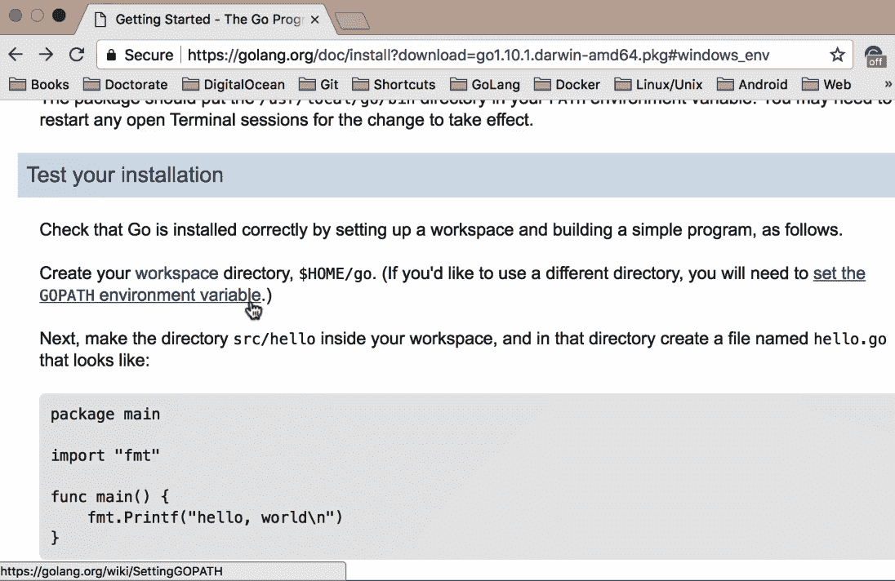
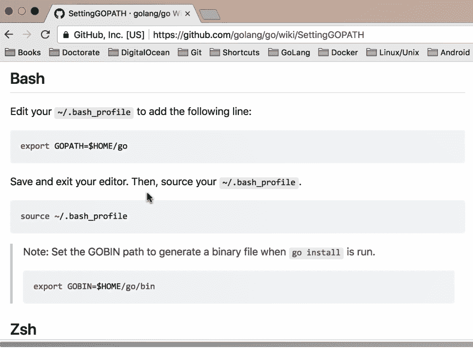
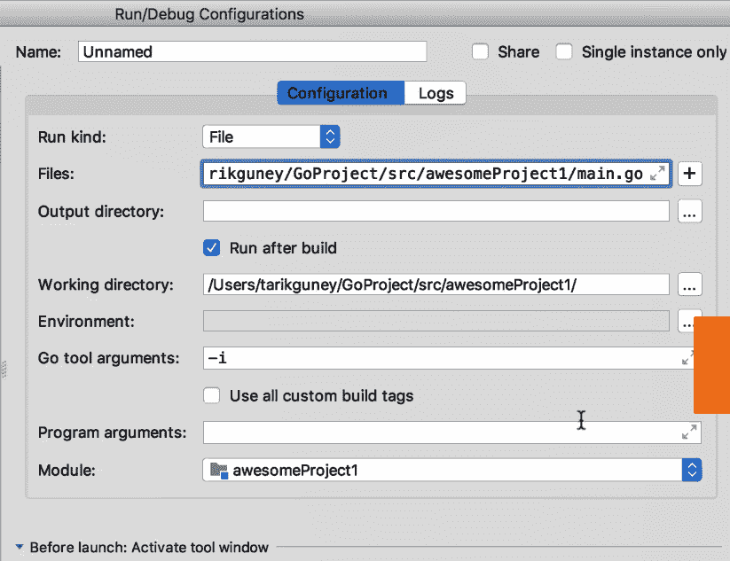
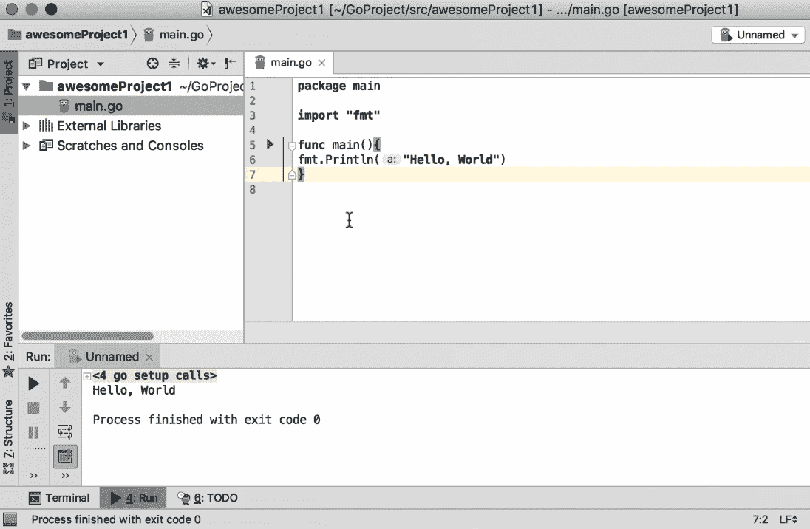
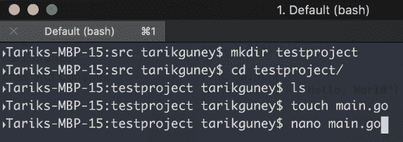

# 一、Go 入门


这本书将帮助你的 Go 编程之旅，特别是当你开始积极开发 Go 应用程序时。本章介绍了新 Go 开发人员以及使用其他语言的人员在日常编程中面临的最常见问题。我希望你喜欢这本书，觉得它有用。

我们将讨论以下主题：

*   安装 Go 二进制文件
*   快速浏览 Go 语言


# 安装 Go 二进制文件


让我们从 Go 开始吧。在本节中，我们将学习如何安装 Go 二进制文件，并简要介绍 Go 语言。

要安装 Go 二进制文件，首先要导航到以下链接：[https://golang.org/doc/install](https://golang.org/doc/install) ；如果您直接在谷歌中搜索也可以访问它。您将找到在不同平台和操作系统上安装 Go 的分步指南。如果您点击下载 Go，它将带您进入下载页面，在那里您可以找到各种二进制格式。

您将找到适用于 Windows、Linux 和 macOS 的 MSI，如以下屏幕截图所示：


我将使用 macOS，但您会发现其他平台的步骤也类似。让我们继续下载吧。

安装程序基本上是一个循序渐进的向导；您只需运行它并持续单击继续，直到安装完成。安装后，您可能还需要做一件事，即设置环境变量。此外，您还必须设置您的工作区。您将有三个文件夹，`bin`、`pkg`和`src`，如以下屏幕截图所示：


`src`文件夹是您放置源文件的地方，`pkg`文件夹是 Go 存储目标文件的地方，`bin`文件夹是存储二进制文件（实际可执行文件）的地方。接下来，我将使用我的 shell，您需要使用`export`设置几个环境变量。您还可以使用配置文件来设置环境变量。如果您查看以下屏幕截图，您可以看到路径`$PATH:/usr/local/go/bin`，这就是我的 Go 二进制文件所在的位置：


所以，当我运行`Go`命令时，它会自动找到 Go 程序所在的位置。

接下来，我们设置`GOPATH`。`GOPATH`基本上就是您的 Go 工作区所在的位置。如果您还记得，工作区包含三个文件夹，`pkg`、`src`和`bin`。`GoProject`是该结构的父文件夹。最后一个是`$GOPATH/bin`，当您希望终端查找已安装的 Go 二进制文件时使用。在重新启动终端之前，请确保您正在添加这三项内容并保存此文件。那么，你就可以走了！

您还可以通过点击链接了解如何为 Go 路径设置环境变量，如下图所示，该链接位于同一页面：



您可以找到不同操作系统的说明。例如，对于基于 Unix 的系统，您可以使用`~/.bash_profile`，或者，根据您使用的 shell，您可以使用各种配置文件。在我的例子中，我使用了如下截图所示的配置文件：



对于 Windows，在安装之后，一旦你有了 Go 工作区，按照给出的说明进行操作，你就可以开始了。说明将如以下屏幕截图所示：


测试您是否已安装的最快方法是只需键入`go`，如以下屏幕截图所示：


它将打开帮助教程，您可以使用 Go 版本查看可用的命令和代码的版本。

这就是您可以轻松设置 Go 环境的方式。在下一节中，我们将快速了解 Go 语言本身。


# 快速浏览 Go 语言


在本节中，我们将快速了解 Go 编程语言。Go 是一种表达力强、简洁明了的语言；它有并发机制，这有助于程序员编写能够充分利用多核和网络机器的程序。它还可以快速编译为机器代码，并具有垃圾收集的便利性和运行时反射的能力。它是一种静态类型化的编译语言，但对大多数人来说，它感觉像是一种动态类型化的解释语言。那好吧！让我们通过导航到[来了解 Go 的语法 https://tour.golang.org/welcome/1](https://tour.golang.org/welcome/1) ；对于那些想学习 Go 语法的人来说，这是一个很好的起点：


好的，如果你看屏幕截图中的语法，如果你来自 java 和 C++语言或者 C 语言和 C++语言，你会发现语法有点不同。例如，如果您查看返回类型，而不是定义类型，那么实际上是在函数末尾定义返回类型。我们还有一个 main 函数，它是我们应用程序的入口点，类似于许多其他编程语言，如果您查看以下屏幕截图中显示的上下文，您可以看到我们有包、变量、函数和流控制语句：`for`、`if...else`和类型，例如`struct`，`slices`、`maps`：


如果您想创建一个类，比如 structure，您可以使用 struct 类型并将其与指针组合。此外，它有方法、接口和并发性，但没有泛型。

话虽如此，我还将讨论我将在本书中使用的工具。**GoLand**中有两种工具可用。GoLand 是 JetBrains 推出的一款相对较新的 IDE。我们将在整本书中使用 GoLand。您可以轻松地创建新项目，给它们命名并选择 SDK，即 Go 1.9。您还可以添加新文件或新包，等等。

您可以通过输入输入文件来定义您的配置并构建 Go，如以下屏幕截图所示。然后您可以运行`main.go`并单击确定：



最后，按下*Ctrl*+*r*将构建您的项目，如下图所示：



在结束本章之前，让我快速向您展示一个仅使用终端的示例。我将使用`touch`命令创建`main.go`文件并添加以下代码：

```go
package main
import "fmt"
func main(){
 fmt.Println(a:"Hello World")
}
```

您可以使用`go run main.go`命令运行它，您将得到以下输出：



您可以保存它，然后运行它。因此，这就是如何使用终端快速编写 Go 代码并运行它。


# 总结


在本章中，我们学习了如何安装 Go 二进制文件，并简要介绍了 Go 语言。我们已经学习了如何编写 Go 代码并仅使用终端运行它。我们还研究了将在所有章节中使用的工具，以及可用于开发 Go 应用程序的其他工具。我们现在准备进入下一章，在那里我们将看到一些操纵字符串值的方法。


