# 五、Go 中的矩阵和向量计算

矩阵和向量计算在计算机科学中很重要。向量可以在动态数组中容纳一组对象。它们使用连续存储，可以进行操作以适应增长。矩阵建立在向量的基础上，创建一组二维向量。在本章中，我们将讨论矩阵和向量，以及如何实际使用这两种数据结构来执行当今计算机科学中发生的许多数据操作。向量和矩阵是线性代数中常用的构造块，在当今的计算机科学中非常重要。图像处理、计算机视觉和 web 搜索等过程都使用线性代数来执行各自的操作。

在本章中，您将了解以下主题：

*   **基本线性代数子程序**（**BLAS**）
*   载体
*   矩阵
*   向量和矩阵操作

一旦我们能够将所有这些联系在一起，您将了解矩阵和向量计算的这些不同方面如何有助于推动对大型数据分组的有效操作。

# 介绍 Gonum 和稀疏库

Gonum 软件包是 Go for scientific algorithms 中最流行的库之一。Gonum 包（[https://github.com/gonum](https://github.com/gonum) 提供了一些实用程序，帮助我们使用 Go 编写有效的数值算法。本软件包的重点是创建用于许多不同应用程序的性能算法，向量和矩阵是本软件包的核心原则。这个库是在考虑性能的情况下创建的——创建者发现 C 语言中的矢量化存在问题，所以他们创建这个库是为了能够在 Go 中更轻松地操作向量和矩阵。稀疏库（[https://github.com/james-bowman/sparse](https://github.com/james-bowman/sparse) 是建立在 Gonum 库之上的，用于处理机器学习和科学计算其他部分中发生的一些常规稀疏矩阵操作。同时使用这些库是在 Go 中管理向量和矩阵的一种有效方法。

在下一节中，我们将了解 BLAS 是什么。

# 介绍 BLAS

BLAS 规范通常用于执行线性代数运算。该库最初于 1979 年作为 FORTRAN 库创建，此后一直保持不变。BLAS 对矩阵的性能操作进行了许多优化。由于该规范的深度和广度，许多语言选择使用该规范作为其领域内线性代数库的一部分。Go 稀疏库使用 BLAS 实现进行线性代数操作。BLAS 规范由三个独立的例程组成：

*   第 1 级：向量运算
*   第 2 级：矩阵向量运算
*   第 3 级：矩阵运算

拥有这些分级例程有助于实现和测试本规范。BLAS 已在许多实现中使用，从 Accelerate（macOS 和 iOS 框架）到 Intel**数学内核库**（**MKL**），一直是应用计算机科学中线性代数的一个组成部分。

现在，是学习向量的时候了。

# 引入向量

向量是一种一维数组，通常用于存储数据。Go 最初有一个容器/向量实现，但在 2011 年 10 月 18 日被删除，因为对于 Go 中的向量使用，切片被认为更惯用。内置切片提供的功能提供了大量向量操作帮助。切片将是一个行向量或 1×m 矩阵的实现。简单的行向量如下所示：


如你所见，我们有一个 1×m 矩阵。要在 Go 中实现简单的行向量，我们可以使用切片表示，如下所示：

```go
v := []int{0, 1, 2, 3}
```

这是使用 Go 的内置功能描绘简单行向量的简单方法。

# 向量计算

列向量是 mx1 矩阵，也称为行向量的转置。矩阵变换是指矩阵在其对角线上翻转，通常用上标 T 表示。我们可以在下图中看到列向量的示例：


如果我们想在 Go 中实现一个列向量，我们可以使用 Gonum 向量包来初始化该向量，如下代码块所示：

```go
package main

import (
   "fmt"
   "gonum.org/v1/gonum/mat"
)
func main() {
   v := mat.NewVecDense(4, []float64{0, 1, 2, 3})
   matPrint(v)
}

func matrixPrint(m mat.Matrix) {
   formattedMatrix := mat.Formatted(m, mat.Prefix(""), mat.Squeeze())
   fmt.Printf("%v\n", formattedMatrix)
}
```

这将打印出如上图所示的列向量。

我们还可以使用 Gonum 包进行一些整洁的向量操作。例如，在下面的代码块中，我们可以看到将向量中的值加倍是多么简单。我们可以使用`AddVec`函数将两个向量相加，从而创建一个加倍的向量。我们还有`prettyPrintMatrix`便利功能，使我们的矩阵更容易阅读：

```go
package main

import (
   "fmt"
   "gonum.org/v1/gonum/mat"
)

func main() {
   v := mat.NewVecDense(5, []float64{1, 2, 3, 4, 5})
   d := mat.NewVecDense(5, nil)
   d.AddVec(v, v)
   fmt.Println(d)
}

func prettyPrintMatrix(m mat.Matrix) { 
    formattedM := mat.Formatted(m, mat.Prefix(""), mat.Squeeze())
    fmt.Printf("%v\n", formattedM)
}

```

该函数的结果，即加倍向量，如下所示：

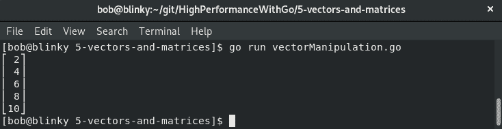

`gonum/mat`包还为我们提供了许多其他向量的简洁辅助函数，包括：

*   `Cap()`给出向量的容量
*   `Len()`提供向量中的列数
*   `IsZero()`验证向量大小是否为零
*   `MulVec()`将向量*a*和*b*相乘并服务结果
*   `AtVec()`返回给定位置向量内的值

`gonum/mat`包中的向量操作功能帮助我们轻松地将向量操作到所需的数据集中。

现在我们已经完成了向量，让我们看看矩阵。

# 引入矩阵

矩阵是按行和列分类的二维数组。它们在图形处理和人工智能中非常重要；即图像识别。矩阵通常用于图形，因为矩阵中的行和列可以对应于屏幕上像素的行和列排列，也因为我们可以使矩阵值对应于特定的颜色。矩阵也经常用于数字声音处理，因为数字音频信号使用傅里叶变换进行过滤和压缩，矩阵有助于执行这些操作。

矩阵通常用*M×N*命名方案表示，其中*M*为矩阵中的行数，*N*为矩阵中的列数，如下图所示：

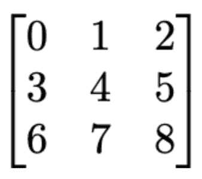

例如，前面的图像是一个 3x3 矩阵。*M x N*矩阵是线性代数的核心租户之一，因此在这里了解其关系很重要。

现在，让我们看看矩阵是如何运作的。

# 矩阵运算

矩阵是一种有效地存储大量信息的好方法，但矩阵的操作是矩阵的实际值的来源。最常用的矩阵操作技术如下：

*   矩阵加法
*   矩阵标量乘法
*   矩阵变换
*   矩阵乘法

能够在矩阵上执行这些操作非常重要，因为它们可以帮助大规模地处理真实世界的数据。在下面的章节中，我们将介绍其中的一些操作以及它们的实际应用。

# 矩阵加法

矩阵加法是将两个矩阵相加的方法。也许我们想要找到两个 2D 集合之和的结果值。如果我们有两个大小相同的矩阵，我们可以将它们相加，如下所示：

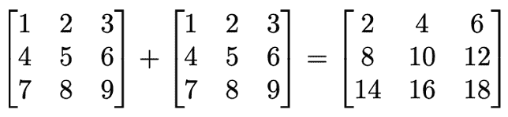

我们也可以在 Go 代码中表示这一点，如以下代码块所示：

```go
package main

import (
   "fmt"
   "gonum.org/v1/gonum/mat"
)

func main() {
   a := mat.NewDense(3, 3, []float64{1, 2, 3, 4, 5, 6, 7, 8, 9})
   a.Add(a, a) // add a and a together
   matrixPrint(a)
}

func matrixPrint(m mat.Matrix) {
   formattedMatrix := mat.Formatted(m, mat.Prefix(""), mat.Squeeze())
   fmt.Printf("%v\n", formattedMatrix)
}
```

执行此功能的结果如下：


结果是我们代码块中矩阵求和的描述。

在下一节中，我们将讨论矩阵操作的一个实际示例。为了演示这个示例，我们将使用矩阵减法。

# 一个实例（矩阵减法）

假设您拥有两家餐厅，一家位于纽约州**纽约**，另一家位于佐治亚州**亚特兰大**。为了确保在接下来的几个月里你能储备到合适的食材，你需要弄清楚每个月你的餐厅里哪些商品卖得最好。我们可以利用矩阵减法来计算每个餐厅的净总销售额。我们需要每个餐厅单位销售额的原始数据，如下表所示：

5 月份单位销售额：

|  | **纽约州纽约市** | **佐治亚州亚特兰大** |
| 龙虾浓汤 | 1,345 | 823 |
| 家常沙拉 | 346 | 234 |
| 里贝耶牛排 | 843 | 945 |
| 冰淇淋圣代 | 442 | 692 |

6 月份单位销售额：

|  | **纽约州纽约市** | **佐治亚州亚特兰大** |
| 龙虾浓汤 | 920 | 776 |
| 家常沙拉 | 498 | 439 |
| 里贝耶牛排 | 902 | 1,023 |
| 冰淇淋圣代 | 663 | 843 |

现在，我们可以使用以下矩阵减法计算这两个月的单位销售额差异：


我们可以在 Go 中执行相同的操作，如以下代码块所示：

```go
package main

import (
  "fmt"

  "gonum.org/v1/gonum/mat"
)

func main() {
  a := mat.NewDense(4, 2, []float64{1345, 823, 346, 234, 843, 945, 442, 692})
  b := mat.NewDense(4, 2, []float64{920, 776, 498, 439, 902, 1023, 663, 843})
  var c mat.Dense
  c.Sub(b, a)
  result := mat.Formatted(&c, mat.Prefix(""), mat.Squeeze())
 fmt.Println(result)
}
```

我们得出的结果为我们提供了这两家餐厅在 5 月和 6 月之间的销售额差异，如下所示：

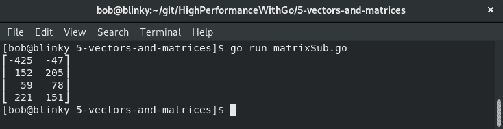

前面截图中的结果显示为一个*N×M*矩阵，描述了销售差异。

随着我们获得更多的餐厅，并在餐厅菜单中添加更多的项目，利用矩阵减法将有助于我们记录哪些项目需要库存。

# 标量乘法

在处理矩阵时，我们可能希望将矩阵中的所有值乘以一个标量值。 

我们可以用以下代码来表示这一点：

```go
package main

import (
  "fmt"

  "gonum.org/v1/gonum/mat"
)

func main() {
  a := mat.NewDense(3, 3, []float64{1, 2, 3, 4, 5, 6, 7, 8, 9})
  a.Scale(4, a) // Scale matrix by 4
  matrixPrint(a)
}

func matrixPrint(m mat.Matrix) {
  formattedMatrix := mat.Formatted(m, mat.Prefix(""), mat.Squeeze())
  fmt.Printf("%v\n", formattedMatrix)
}
```

此代码生成以下结果：

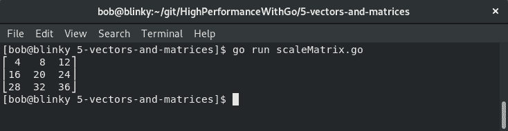

在这里，我们可以看到矩阵中的每个元素都按 4 进行了缩放，因此提供了一个矩阵缩放的执行示例。

# 标量乘法实例

假设我们拥有一家五金店，我们有一个产品目录，与之相关的价值为**美元**（**美元**）。我们公司决定开始在加拿大和美国销售我们的产品。在撰写本书时，1 美元相当于 1.34 美元**加元**（**加元**）。我们可以查看基于体积计数的螺钉、螺母和螺栓价格矩阵，如下表所示：

|  | **个人美元** | **100 吨美元** | **1000 吨美元** |
| 螺钉 | $0.10 | $0.05 | $0.03 |
| 坚果 | $0.06 | $0.04 | $0.02 |
| 螺栓 | $0.03 | $0.02 | $0.01 |

如果我们在 CAD 中使用矩阵标量乘法来计算结果成本，我们将得到以下矩阵计算：


我们可以使用 Go 标量乘法功能验证这一点，如以下代码段所示：

```go
package main

import (
    "fmt"

    "gonum.org/v1/gonum/mat"
) 

func main() {
    usd := mat.NewDense(3, 3, []float64{0.1, 0.05, 0.03, 0.06, 0.04, 0.02, 0.03, 0.02, 0.01})
    var cad mat.Dense
    cad.Scale(1.34, usd)
    result := mat.Formatted(&cad, mat.Prefix(""), mat.Squeeze()) 
    fmt.Println(result)
} 
```

我们收到一个结果矩阵，其中包含 CAD 中每个项目的值：


输出向我们显示缩放后的矩阵。

随着我们得到越来越多的产品，拥有越来越多不同的货币，我们的标量矩阵操作将非常方便，因为它将减少我们操作这些大型数据集所需的工作量。

# 矩阵乘法

我们也可以将两个矩阵相乘。将两个矩阵相乘得到两个矩阵的乘积。当我们想要同时将多个数字相乘时，这会非常有用。我们可以采用矩阵*A*和*N×M*矩阵，以及*B*和*M×P*矩阵。结果集被称为*AB*，它是一个*N×P*矩阵，如下所示：


我们可以用以下代码来表示这一点：

```go
package main

import (
    "fmt"
    "gonum.org/v1/gonum/mat"
)

func main() {
    a := mat.NewDense(2, 2, []float64{1, 2, 3, 4})
    b := mat.NewDense(2, 3, []float64{1, 2, 3, 4, 5, 6})
    var c mat.Dense
    c.Mul(a, b)
    result := mat.Formatted(&c, mat.Prefix(""), mat.Squeeze())
    fmt.Println(result)
}
```

执行后，我们收到以下结果：


这就是我们如何使用`gonum/mat`包将矩阵相乘的方法。矩阵乘法是一种常见的矩阵函数，了解如何执行此操作将帮助您有效地操作矩阵。

# 矩阵乘法实例

让我们来谈谈矩阵乘法的一个实际例子，这样我们就可以把我们的理论工作与一个可行的例子联系起来。两个独立的电子供应商正在争夺您的业务，为您的公司制造小部件。供应商 A 和供应商 B 都为小部件设计产品，并为您提供他们需要的部件列表。供应商 A 和供应商 B 使用相同的部件供应商。在这个例子中，我们可以使用矩阵乘法来找出哪个供应商创建了一个更便宜的小部件。各供应商提供给您的零件清单如下：

*   **供应商 A**：电阻器：5 个
    晶体管：10 个
    电容器：2 个

*   **供应商 B**：
    电阻器：8
    晶体管：6
    电容器：3

您从组件的供应商目录中了解到，每个组件的定价如下所示：

*   成本：0.10 美元
*   晶体管成本：0.42 美元
*   电容器成本：0.37 美元

我们可以用矩阵表示这些输入中的每一个，正如我们之前所学的那样。具体做法如下：

1.  我们创建了一个由组件成本组成的矩阵，如下所示：


我们创建一个矩阵，由每个供应商的组件数量组成：

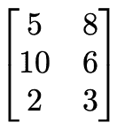

3.  然后，我们使用矩阵乘法找到一些简洁的结果：

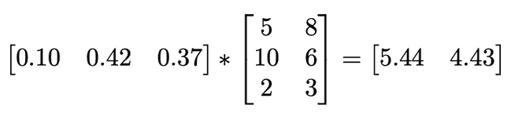

该结果告诉我们，供应商 A 的解决方案的零件成本为 5.44 美元，而供应商 B 的解决方案的零件成本为 4.43 美元。从原材料的角度来看，供应商 B 的解决方案成本较低。

可使用以下代码按照 Go 进行计算：

```go
package main

import (
    "fmt"
    "gonum.org/v1/gonum/mat"
)

func main() {
    a := mat.NewDense(1, 3, []float64{0.10, 0.42, 0.37})
    b := mat.NewDense(3, 2, []float64{5, 8, 10, 6, 2, 3})
    var c mat.Dense
    c.Mul(a, b)
    result := mat.Formatted(&c, mat.Prefix("    "), mat.Squeeze())
    fmt.Println(result)
}
```

结果输出证实了我们在前面程序中进行的计算：

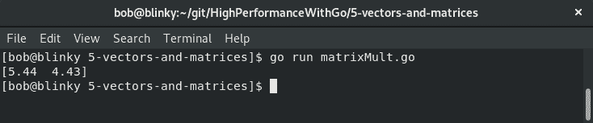

正如我们从结果中看到的，我们格式化的矩阵与我们之前执行的数学一致。有一个实际的例子可以非常有助于巩固我们对理论概念的理解。

# 矩阵变换

变换矩阵会沿对角线翻转矩阵，交换行和列索引。下图显示了矩阵的换位示例：


我们可以使用以下代码表示 Go 中的矩阵换位：

```go
package main

import (
    "fmt"
    "gonum.org/v1/gonum/mat"
)

func main() {
    a := mat.NewDense(3, 3, []float64{5, 3, 10, 1, 6, 4, 8, 7, 2})
    matrixPrint(a)
    matrixPrint(a.T())
}

func matrixPrint(m mat.Matrix) {
    formattedMatrix := mat.Formatted(m, mat.Prefix(""), mat.Squeeze())
    fmt.Printf("%v\n", formattedMatrix)
}
```

此矩阵变换的结果可以在下图中看到：


在前面的输出中，我们可以看到正则矩阵和转置版本。矩阵转置在计算机科学中经常被用来做一些事情，例如通过在内存中转置矩阵来改善内存的局部性。

# 矩阵变换实例

转置矩阵很有趣，但有一个实际的例子说明什么时候可以使用矩阵转置可能会对您有所帮助。假设我们有三名工程师：**鲍勃**、**汤姆**和**爱丽丝**。这三位工程师每天推 Git 提交。我们希望以有意义的方式跟踪这些 Git 提交，以便确保工程师拥有继续编写代码所需的所有资源。让我们对工程师的代码进行统计 3 天：

| **用户** | **天** | **提交** |
| 上下快速移动 | 1. | 5. |
| 上下快速移动 | 2. | 3. |
| 上下快速移动 | 3. | 10 |
| 汤姆 | 1. | 1. |
| 汤姆 | 2. | 6. |
| 汤姆 | 3. | 4. |
| 爱丽丝 | 1. | 8. |
| 爱丽丝 | 2. | 7. |
| 爱丽丝 | 3. | 2. |

获得数据点后，我们可以在二维数组中表示它们：


现在我们有了这个数组，我们可以进行数组的换位：

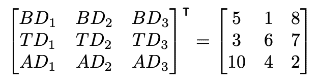

现在我们已经执行了这个转置，我们可以看到转置数组的行对应于提交的日期，而不是单个最终用户的提交。让我们看一下第一行：


现在代表**BD1**、**TD1**和**AD1**——每个开发人员的第一天承诺。

现在我们已经完成了操作部分，是时候看看矩阵结构了。

# 理解矩阵结构

矩阵通常分为两种不同的结构：密集矩阵和稀疏矩阵。稠密矩阵主要由非零元素组成。稀疏矩阵是主要由值为 0 的元素组成的矩阵。矩阵的稀疏性计算为零值元素数除以元素总数。

如果该方程的结果大于 0.5，则矩阵稀疏。这种区别很重要，因为它有助于我们确定矩阵操作的最佳方法。如果矩阵是稀疏的，我们可以使用一些优化来提高矩阵操作的效率。相反，如果我们有一个稠密矩阵，我们知道我们很可能会对整个矩阵执行操作。

重要的是要记住，对矩阵的操作很可能是与当今计算机硬件有关的内存限制。矩阵的大小是需要记住的一件重要事情。在计算何时使用稀疏矩阵或密集矩阵时，密集矩阵的值为 1 int64，根据 Go 中数字类型的大小和对齐方式，该值为 8 字节。稀疏矩阵将具有该值，加上一个 int 作为条目的列索引。在选择用于数据的数据结构时，请记住这些大小。

# 稠密矩阵

创建密集矩阵时，将存储该矩阵的所有值。有时这是不可避免的——当我们关心与一个表相关联的所有值时，该表大部分是满的。使用 2D 切片或阵列进行密集矩阵存储通常是最佳选择，但如果您想操作矩阵，使用 Gonum 软件包可以有效地提供数据操作。实际上，大多数矩阵不属于稠密矩阵范畴。

# 稀疏矩阵

稀疏矩阵在现实数据集中经常出现。无论是否有人看过电影目录中的视频，听过播放列表中的歌曲数量，或完成了待办事项列表中的一项，都是使用稀疏矩阵的好例子。这些表中的许多值都是零，因此将这些矩阵存储为密集矩阵是没有意义的。这将占用大量内存空间，并且操作起来成本高昂。

我们可以使用 Go 稀疏库来创建和操作稀疏矩阵。稀疏库使用 BLAS 例程中的习惯用法来执行许多常见的矩阵操作。Go 稀疏库与 Gonum 矩阵包完全兼容，因此可以与此包互换使用。在本例中，我们将创建一个新的稀疏**键字典**（**DOK**。在我们创建这个之后，我们将为数组中的集合设置特定的*M x N*值。最后，我们将使用`gonum/mat`包打印我们创建的稀疏矩阵。

在下面的代码中，我们将使用稀疏包创建稀疏矩阵。`ToCSR()`和`ToCSC()`矩阵函数分别创建 CSR 和 CSC 矩阵：

```go
package main

import (
    "fmt"
    "github.com/james-bowman/sparse"
    "gonum.org/v1/gonum/mat"
)

func main() {
    sparseMatrix := sparse.NewDOK(3, 3)
    sparseMatrix.Set(0, 0, 5)
    sparseMatrix.Set(1, 1, 1)
    sparseMatrix.Set(2, 1, -3)
    fmt.Println(mat.Formatted(sparseMatrix))
    csrMatrix := sparseMatrix.ToCSR()
    fmt.Println(mat.Formatted(csrMatrix))
    cscMatrix := sparseMatrix.ToCSC()
    fmt.Println(mat.Formatted(cscMatrix))
}
```

执行此代码后，我们可以看到已返回稀疏矩阵：

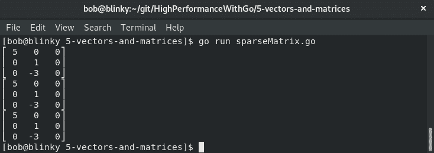

该输出向我们显示了生成的稀疏矩阵。

稀疏矩阵可以分为三种不同的格式：

*   用于高效创建和修改矩阵的格式
*   用于高效访问和矩阵操作的格式
*   专门格式

用于高效创建和修改矩阵的格式如下：

*   **钥匙字典**（**DOK**
*   **列表****列表**（**LIL**）
*   **坐标表**（**COO**）

这些格式将在以下章节中定义。

# DOK 矩阵

DOK 矩阵是 Go 中的一个映射。此映射将行和列对链接到它们的关联值。如果没有为矩阵中的特定坐标定义值，则假定为零。通常，hashmap 用作底层数据结构，为随机访问提供 O（1），但在元素上的迭代最终会稍微慢一点。DOK 对于矩阵构造或更新很有用，但对于算术运算来说，它是一种无性能的选择。DOK 矩阵也可以在创建后简单地转换为 COO 矩阵。

# LIL 矩阵

LIL 矩阵每行存储一个列表，其中包含列索引和值，通常按列排序，因为这样可以减少查找时间。LIL 矩阵对于增量合成稀疏矩阵非常有用。当我们不知道传入数据集的稀疏模式时，它们也很有用。 

# COO 矩阵

COO 矩阵（通常也称为三元组格式矩阵）存储包含行、列和值的元组列表，按行和列索引排序。COO 矩阵很容易用 O（1）定时附加到它。从 COO 矩阵中随机读取相对较慢（O（n））。COO 矩阵是矩阵初始化和转换为 CSR 的良好选择。对于算术运算来说，COO 矩阵是一个糟糕的选择。通过对 COO 矩阵中的向量进行排序，可以提高 COO 矩阵上顺序迭代的性能。

用于高效访问和矩阵操作的格式如下：

*   **压缩稀疏行**（**CSR**）
*   **压缩稀疏列**（**CSC**）

这些格式将在以下章节中定义。

# 企业社会责任矩阵

CSR 矩阵使用三个一维数组来表示矩阵。CSR 格式使用以下三种数组：

*   A：数组中存在的值。
*   IA：每个值所在的索引。这些定义如下：
    *   0 索引处 IA 的值，IA[0]=0
    *   i 索引处 IA 的值，IA[i]=IA[i− 1] +（原矩阵中 i-1<sup>th</sup>行非零元素个数）
*   JA：存储元素的列索引。

下图显示了 4 x 4 矩阵的示例。这是我们将在以下代码示例中使用的矩阵：

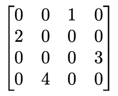

我们可以如下计算这些值：

*   A=[1 2 3 4]

*   IA=[01 2 3 4]
*   JA=[2 0 3 1]

我们可以使用`sparse`包对此进行验证，如以下代码段所示：

```go
package main

import (
    "fmt"
    "github.com/james-bowman/sparse"
    "gonum.org/v1/gonum/mat"
)

func main() {
    sparseMatrix := sparse.NewDOK(4, 4)
    sparseMatrix.Set(0, 2, 1)
    sparseMatrix.Set(1, 0, 2)
    sparseMatrix.Set(2, 3, 3)
    sparseMatrix.Set(3, 1, 4)
    fmt.Print("DOK Matrix:\n", mat.Formatted(sparseMatrix), "\n\n") // Dictionary of Keys
    fmt.Print("CSR Matrix:\n", sparseMatrix.ToCSR(), "\n\n")        // Print CSR version of the matrix
}
```

结果显示了我们创建的矩阵的 DOK 表示的重新转换值，以及相应的 CSR 矩阵：


该代码的输出向我们显示了一个 CSR 矩阵，它分别打印 IA、JA 和 a 值。随着矩阵的增长，能够计算 CSR 矩阵使得矩阵操作越来越高效。计算机科学通常会处理具有数百万行和列的矩阵，因此能够以高效的方式处理矩阵会使代码的性能大大提高。

# CSC 矩阵

CSC 矩阵的格式与 CSR 矩阵相同，但有一点不同。列索引切片是被压缩的元素，而不是我们在 CSR 矩阵中看到的行索引切片。这意味着 CSC 矩阵以列主顺序而不是行主顺序存储其值。这也可以看作是 CSR 矩阵的自然换位。我们可以使用上一节中使用的示例来查看如何创建 CSC 矩阵，如以下代码块所示：

```go
package main

import (
    "fmt"

    "github.com/james-bowman/sparse"
    "gonum.org/v1/gonum/mat"
)

func main() {
    sparseMatrix := sparse.NewDOK(4, 4)
    sparseMatrix.Set(0, 2, 1)
    sparseMatrix.Set(1, 0, 2)
    sparseMatrix.Set(2, 3, 3)
    sparseMatrix.Set(3, 1, 4)
    fmt.Print("DOK Matrix:\n", mat.Formatted(sparseMatrix), "\n\n") // Dictionary of Keys
    fmt.Print("CSC Matrix:\n", sparseMatrix.ToCSC(), "\n\n")        // Print CSC version
}
```

结果显示了我们创建的矩阵的 DOK 表示的重新转换值，以及相应的 CSC 矩阵：

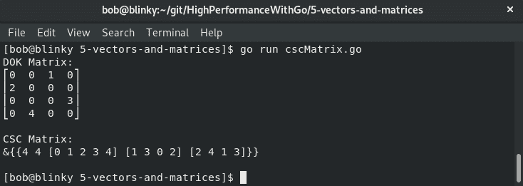

前面代码块的输出向我们显示了 DOK 矩阵和 CSC 矩阵。在矩阵操作过程中，了解如何表示 CSR 和 CSC 矩阵至关重要。这两种不同类型的矩阵具有不同的区别特征。例如，DOK 矩阵具有 O（1）访问模式，而 CSC 矩阵使用面向列的操作来提高效率。

# 总结

在本章中，我们讨论了矩阵和向量，以及如何实际使用这两种数据结构来执行当今计算机科学中发生的许多数据操作。此外，我们还学习了 BLAS、向量、矩阵和向量/矩阵操作。向量和矩阵是线性代数中常用的构建块，我们看到了在哪里可以实现这一点的硬示例

我们在本章中讨论的示例将在与实际数据操作相关的情况下对我们有很大帮助。在[第 6 章](06.html)*编写可读 Go 代码*中，我们将讨论编写可读 Go 代码。能够编写可读的 Go 代码将有助于保持主题和想法清晰简洁，便于跨代码贡献者进行协作。