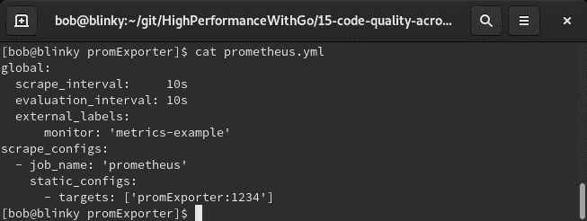
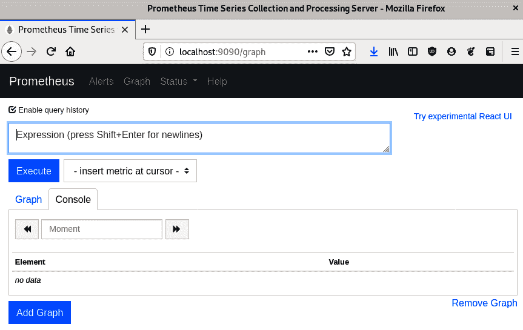
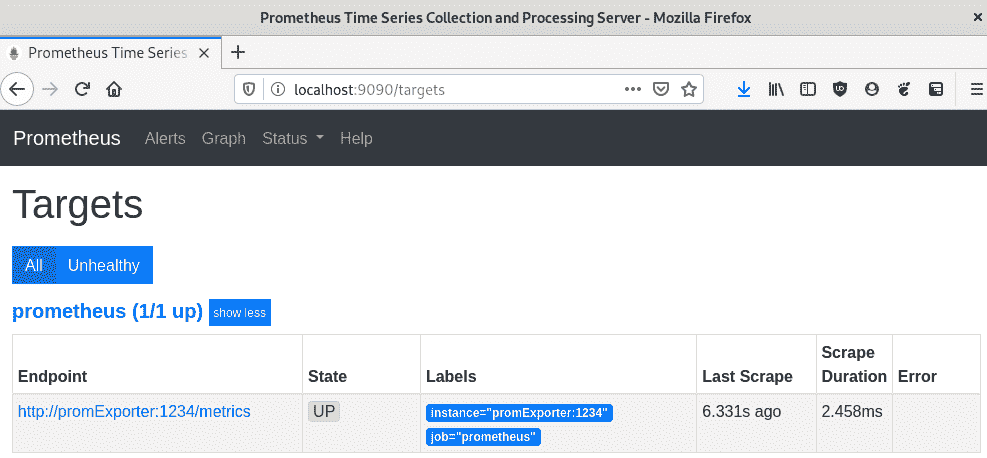
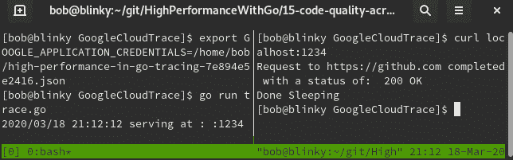
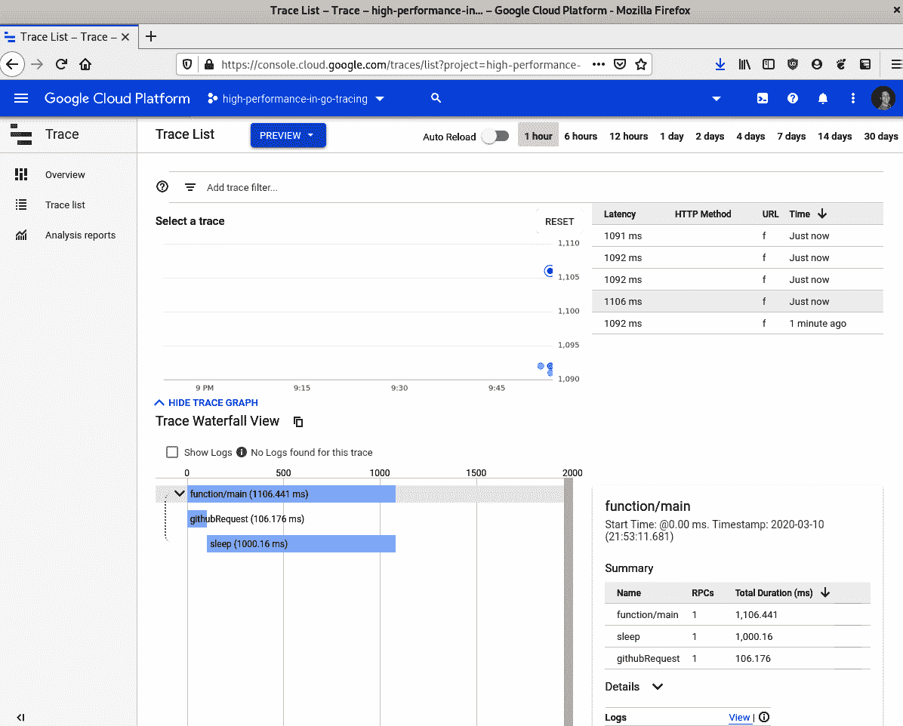
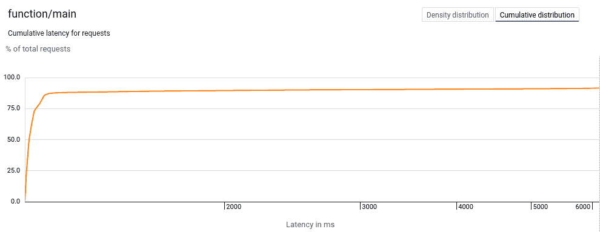
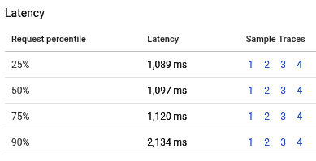
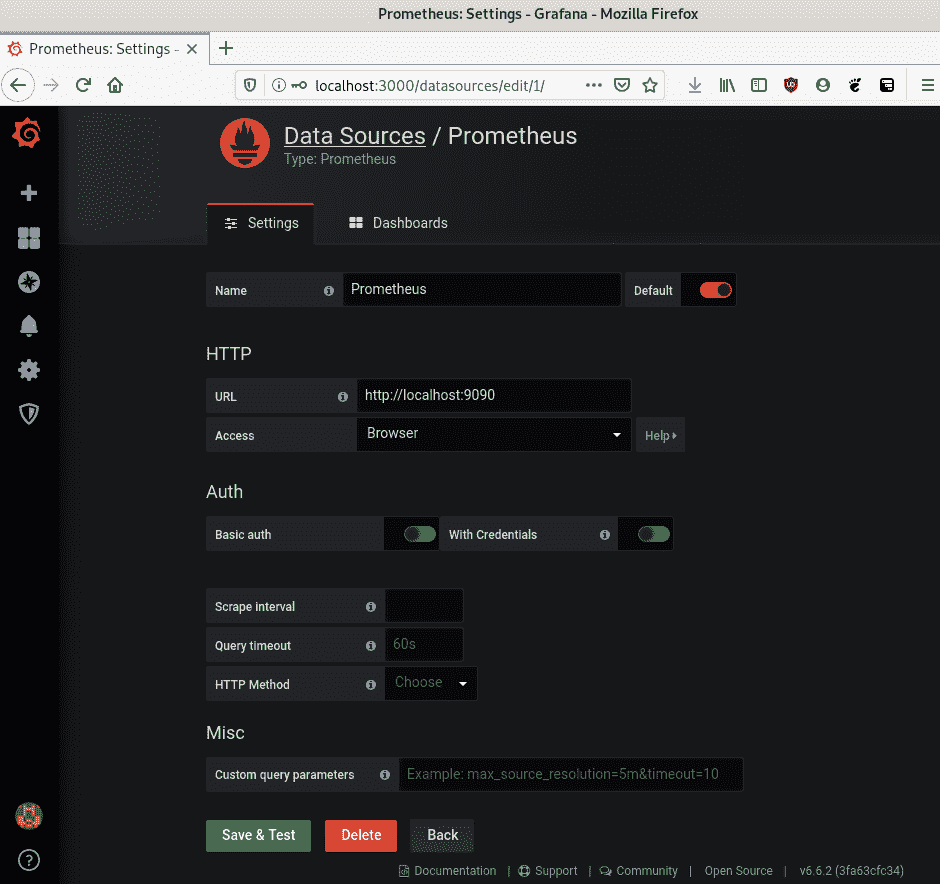
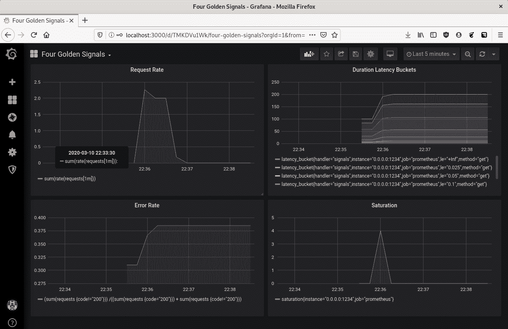

# 十四、比较不同版本的代码质量

在编写、调试、分析和监控 Go 代码之后，您需要长期监控应用程序的性能回归。如果您不能继续提供基础架构中其他系统所依赖的性能级别，那么向代码中添加新功能是无用的。

在本章中，我们将学习以下主题：

*   利用 Go Prometheus 出口商
*   **应用程序性能监控**（**APM**工具
*   **服务水平指标**和**服务水平目标**（**SLI**和**SLO**）
*   利用测井

理解这些概念将有助于推动您编写长期性能良好的代码。在处理大型项目时，工作通常不能很好地扩展。拥有 10 倍数量的工程师通常不能保证 10 倍的产出。随着软件团队的成长和产品功能的增加，能够以编程方式量化代码性能非常重要。传播性能代码是一件总是从积极的角度看待的事情，使用本章中描述的一些技术将帮助您长期提高代码性能，无论您是在企业环境中还是在小型开源项目中工作。

# Go Prometheus exporter–从 Go 应用程序导出数据

跟踪应用程序长期更改的最佳方法之一是使用时间序列数据来监视重要更改并向我们发出警报。普罗米修斯
（[https://prometheus.io/](https://prometheus.io/) 是执行此任务的一种很好的方式。Prometheus 是一个开源的时间序列监视工具，它通过 HTTP 利用拉模型来驱动监视和警报。它是用 Go 编写的，并且具有用于 Go 程序的一流客户机库。以下步骤显示了 Go Prometheus HTTP 库的一个非常简单的实现：

1.  首先，我们实例化我们的包并导入必要的库：

```go
package main
import (
    "net/http"
    "github.com/prometheus/client_golang/prometheus/promhttp"

)
```

2.  然后，在我们的`main`函数中，我们实例化了一个新服务器，并让它为返回普罗米修斯处理器（`promhttp.Handler()`的`NewServeMux`提供服务：

```go
func main() {
    mux := http.NewServeMux()
    mux.Handle("/metrics", promhttp.Handler())
    http.ListenAndServe(":1234", mux)
}
```

完成此操作后，我们可以看到从默认的 Prometheus 导出器返回值。这些都得到了很好的评论，包括以下内容：

3.  接下来，我们将为 Go 服务构建二进制文件：

```go
GOOS=linux go build promExporter.go
```

4.  接下来，我们将创建一个 docker 网络，用于将我们的服务链接在一起：

```go
docker network create prometheus
```

5.  随后，我们创建了普罗米修斯出口商服务：

```go
docker build -t promexporter -f Dockerfile.promExporter .
```

6.  接下来，我们在 Docker 主机上运行 Prometheus exporter 服务：

```go
docker run -it --rm --name promExporter -d -p 1234:1234 --net prometheus promexporter
```

在下面的屏幕截图中，我们可以看到此响应的截断输出。为简洁起见，不包括注释和内置的 Go 统计信息。您可以在服务器的响应中看到键-值响应：


在我们设置好这个服务器之后，我们可以以给定的频率监视它。我们可以在容器中运行我们的 metrics 服务和 Prometheus，并让它们相互对话。我们可以对我们的普罗米修斯容器使用一个简单的`prometheus.yml`定义：



如果您想使用 docker 主机以外的其他设备，可以使用 IP 地址或主机名替换 YAML 的`scrape_configs`->`static_configs`->`targets`部分中的`promExporter`。

7.  在二进制构建之后，我们可以创建两个单独的 DockerFile：一个用于包含我们的 Prometheus exporter 服务的容器，另一个用于包含我们的 Prometheus 服务。Prometheus 服务的 Dockerfile 采用基线 Prometheus 映像，并将 YAML 配置添加到映像中的适当位置。我们的`Dockerfile.promservice`配置如下：

```go
FROM prom/prometheus
ADD prometheus.yml /etc/prometheus/
```

8.  一旦我们创建了`Dockerfile.promservice`，我们就可以构建普罗米修斯服务：

```go
docker build -t prom -f Dockerfile.promservice .
```

9.  然后，我们可以在 Docker 主机上运行 Prometheus 服务：

```go
docker run -it --rm --name prom -d -p 9090:9090 --net prometheus prom
```

现在我们在本地环境中运行了一个 Prometheus 实例。

10.  在我们的普罗米修斯服务启动并运行之后，我们可以转到`http://[IPADDRESS]:9090/`，我们将看到我们的普罗米修斯实例：



11.  我们可以通过查看同一 URL 中的`/targets`路径来验证我们正在抓取目标：



12.  接下来，我们可以向主机发出几个请求：

```go
for i in {1..10}; do curl -s localhost:1234/metrics -o /dev/null; done
```

13.  接下来，我们可以在普罗米修斯的例子中看到我们`curl`的结果：


通过这些结果，我们可以看到使用 200、500 和 503 状态代码服务的 HTTP 响应总数。我们的例子很简单，但是我们可以在这里使用许多不同类型的度量来验证我们的任何假设。在本章后面的 SLI/SLO 示例中，我们将做一个更复杂的度量收集示例

在下一节中，我们将讨论 APM 以及如何将其用于维护性能良好的分布式系统。

# APM–观察您的分布式系统性能

目前市场上有许多 APM 工具。它们经常被用来监控软件的性能和可靠性。在撰写本书时，Go 提供的一些产品如下：

*   **弹性 APM 剂**：[https://www.elastic.co/guide/en/apm/agent/go/current/index.html](https://www.elastic.co/guide/en/apm/agent/go/current/index.html)
*   **新遗址 APM**：[https://newrelic.com/golang](https://newrelic.com/golang)
*   **数据狗**：[https://docs.datadoghq.com/tracing/setup/go/](https://docs.datadoghq.com/tracing/setup/go/)
*   **信号 FX**：[https://docs.signalfx.com/en/latest/apm/apm-instrument/apm-go.html](https://docs.signalfx.com/en/latest/apm/apm-instrument/apm-go.html)
*   **AppDynamics**：[https://www.appdynamics.com/supported-technologies/go](https://www.appdynamics.com/supported-technologies/go)
*   **蜂窝 APM**：[https://docs.honeycomb.io/getting-data-in/go/](https://docs.honeycomb.io/getting-data-in/go/)
*   **AWS X 光**：[https://docs.aws.amazon.com/xray/latest/devguide/xray-sdk-go.html](https://docs.aws.amazon.com/xray/latest/devguide/xray-sdk-go.html)
*   **谷歌 APM 产品套件**：[https://cloud.google.com/apm/](https://cloud.google.com/apm/)

这些工具中的大多数都是封闭源代码和付费服务。聚合分布式跟踪是一个困难的价值主张。这里列出的供应商（以及一些未提及的供应商）结合了数据存储、聚合和分析，以便为 APM 提供一站式服务。我们也可以使用我们在[第 13 章](12.html)*跟踪 Go 代码*中创建的 OpenCensus/Zipkin 开源示例，在我们的系统中执行分布式跟踪。围绕代码库的特定位实现跨度可以帮助我们监控长期应用程序性能。

让我们来看看谷歌 APM 解决方案的一个例子。在撰写本文时，谷歌云每月提供 250 万次 span 摄取和 2500 万次 span 扫描，这对于一个例子来说已经足够了。

# 谷歌云环境设置

我们需要做的第一件事是创建 GCP 项目并检索应用程序凭据：

1.  首先我们登录[https://console.cloud.google.com/](https://console.cloud.google.com/) 。登录后，我们可以点击页面顶部的项目选择器下拉列表：


2.  然后，我们可以在屏幕右上角为特定应用程序创建一个新项目，如以下屏幕截图所示：


3.  然后我们可以访问[的服务账户密钥页面 https://console.cloud.google.com/apis/credentials/serviceaccountkey](https://console.cloud.google.com/apis/credentials/serviceaccountkey) ，这将允许我们创建一个服务帐户密钥。

4.  我们可以为应用程序创建服务帐户密钥。确保您选择了云跟踪代理，因为这是我们向 Google Cloud Trace 添加跟踪所必需的。以下屏幕截图描述了这一点：


5.  单击“创建”后，浏览器将提示我们下载新凭据。作为参考，我们将此键称为`high-performance-in-go-tracing.json`。你可以给钥匙取你喜欢的名字。
6.  一旦本地保存了该密钥，就可以将其转换为环境变量。在终端中，输入以下命令：

```go
export GOOGLE_APPLICATION_CREDENTIALS=/home/bob/service-accounts-private-key.json
```

这将把您的服务帐户凭据保存为一个特殊的环境变量`GOOGLE_APPLICATION_CREDENTIALS`，我们将在下一个示例中使用它。

# 谷歌云跟踪代码

一旦我们的应用程序凭据都设置好了；我们将前往比赛，写下 APM 将捕捉到的第一条轨迹：

1.  首先，我们实例化必要的包并设置服务器主机/端口常量：

```go
package main

import (
    "context"
    "fmt"
    "log"
    "net/http"
    "os"
    "time"

    "contrib.go.opencensus.io/exporter/stackdriver"

    "go.opencensus.io/trace"

)

const server = ":1234"
```

2.  接下来，在我们的`init()`函数中，我们设置了 StackDriver 导出器，并注册跟踪程序以对传入的每个 web 请求进行采样。在生产中，我们可能应该对更少的请求进行采样，因为采样会给请求增加额外的延迟：

```go
func init() {

    exporter, err := stackdriver.NewExporter(stackdriver.Options{
       ProjectID: os.Getenv("GOOGLE_CLOUD_PROJECT"),
    })

    if err != nil {
       log.Fatal("Can't initialize GOOGLE_CLOUD_PROJECT environment    
         variable", err)

    }

    trace.RegisterExporter(exporter)
    trace.ApplyConfig(trace.Config{DefaultSampler:   
      trace.AlwaysSample()})

}
```

3.  接下来，我们将有一个 sleep 函数，它获取上下文、睡眠并向最终用户写入消息。在该函数中，我将跨度的末尾推迟到函数的末尾：

```go
func sleep(ctx context.Context, w http.ResponseWriter, r *http.Request) {
    _, span := trace.StartSpan(ctx, "sleep")
    defer span.End()
    time.Sleep(1 * time.Second)
    fmt.Fprintln(w, "Done Sleeping")
}
```

4.  我们的 GitHub 请求功能向[发出请求 https://github.com](https://github.com) 并将状态返回给我们的最终用户。在这个函数中，我显式地调用跨度的末尾：

```go
func githubRequest(ctx context.Context, w http.ResponseWriter, r *http.Request) {
    _, span := trace.StartSpan(ctx, "githubRequest")
    defer span.End()
    res, err := http.Get("https://github.com")
    if err != nil {
       log.Fatal(err)
    }

    res.Body.Close()
    fmt.Fprintln(w, "Request to https://github.com completed with a status of: ", res.Status)
    span.End()
}
```

我们的主函数设置了一个 HTTP 处理函数，该函数执行`githubRequest`和`sleep`函数：

```go
func main() {

    h := http.HandlerFunc(func(w http.ResponseWriter, r *http.Request) {

       ctx, span := trace.StartSpan(context.Background(), "function/main")
       defer span.End()
       githubRequest(ctx, w, r)
       sleep(ctx, w, r)
    })

    http.Handle("/", h)
    log.Printf("serving at : %s", server)
    err := http.ListenAndServe(server, nil)

    if err != nil {
       log.Fatal("Couldn't start HTTP server: %s", err)
    }
}
```

5.  执行主功能后，我们向`localhost:1234`发出请求并看到响应：



6.  之后，我们访问 Google 云控制台并选择我们所做的跟踪：



在这个跟踪示例中，我们可以看到各种相关的详细信息：

*   所有采集的跟踪样本（我在这里添加了一堆不同的样本来填充字段）。
*   我们的请求流瀑布图。对于我们的示例来说，这有点小，只包含 web 请求和睡眠，但是当我们在分布式系统中传递上下文时，这个图很快就会变得更大。
*   每个跟踪的摘要。如果单击图形中的一个跟踪栏，可以看到有关特定跟踪的更多详细信息。

将分布式跟踪添加为 APM 解决方案对于确定花费最多时间的 web 请求的位置非常有帮助。找到现实生活中的瓶颈通常比浏览日志要实际得多。谷歌的 APM 还让你能够根据你所做的跟踪运行报告。发出 100 多个请求后，可以执行分析报告并查看结果。密度分布延迟图显示了请求延迟在图中的位置。我们的示例应该有大致相似的结果，因为我们执行了长时间睡眠并向外部服务发出了一个单独的请求。我们可以在以下屏幕截图中看到密度分布图：


我们还可以查看此门户中的累积延迟，它将向我们显示短于*x*轴上的值的请求百分比：



我们还可以看到相关请求的延迟配置文件：



此外，我们还可以看到分布式系统中感知到的瓶颈：


这些分析工具帮助我们推断出我们可以在分布式系统中进行哪些改进。APMs 帮助许多公司向其客户交付高性能的应用程序。这些工具非常有价值，因为它们从客户体验的角度来看性能。在下一节中，我们将讨论使用 SLI 和 SLO 设置目标。

# SLI 和 SLO–设定目标

SLI 和 SLO 是谷歌带给计算机科学界的两种范式。它们在 SRE 工作簿
（[中定义 https://landing.google.com/sre/sre-book/chapters/service-level-objectives/](https://landing.google.com/sre/sre-book/chapters/service-level-objectives/) ）和是测量计算系统中可操作项目的极好方法。这些测量通常遵循谷歌的四个黄金信号：

*   **延迟**：请求完成所需的时间（通常以毫秒为单位）
*   **流量**：您的服务正在接收的流量（通常以每秒请求数为单位）

*   **错误**：失败请求占总请求的百分比（通常用百分比衡量）
*   **饱和**：硬件饱和的度量（通常通过排队请求计数来度量）

然后可以使用这些度量来创建一个或多个 SLA。这些服务通常提供给希望您的应用程序提供特定级别服务的客户。

我们可以用普罗米修斯来衡量这些指标。普罗米修斯有一系列不同的计数方法，包括仪表、计数器和直方图。我们将使用所有这些不同的工具来衡量系统中的这些指标。

为了测试我们的系统，我们将使用`hey`负载生成器。这是一个类似于`ab`的工具，我们在前面的章节中使用了它，但它将更好地展示我们在这个特定场景中的分布。我们可以通过运行以下命令来获取它：

```go
go get -u github.com/rakyll/hey
```

我们将需要站起来，我们的普罗米修斯服务，以阅读其中一些价值观。如果您的示例与前面的示例不同，我们可以执行以下命令：

```go
docker build -t slislo -f Dockerfile.promservice .
docker run -it --rm --name slislo -d -p 9090:9090 --net host slislo
```

这将使我们的普罗米修斯实例站起来测量请求：

1.  我们的代码首先实例化`main`包并导入必要的 Prometheus 包：

```go
package main

import (
    "math/rand"
    "net/http"
    "time"

    "github.com/prometheus/client_golang/prometheus"
    "github.com/prometheus/client_golang/prometheus/promhttp"

)
```

2.  然后，我们在`main`函数中收集饱和度、请求和延迟数。我们使用饱和度测量仪、请求计数器和延迟直方图：

```go
    saturation := prometheus.NewGauge(prometheus.GaugeOpts{
       Name: "saturation",
       Help: "A gauge of the saturation golden signal",
    })

    requests := prometheus.NewCounterVec(
       prometheus.CounterOpts{
           Name: "requests",
           Help: "A counter for the requests golden signal",
       },
       []string{"code", "method"},
    )

    latency := prometheus.NewHistogramVec(
       prometheus.HistogramOpts{
           Name: "latency",
           Help: "A histogram of latencies for the latency golden 
            signal",
           Buckets: []float64{.025, .05, 0.1, 0.25, 0.5, 0.75},
       },
       []string{"handler", "method"},
    )
```

3.  然后我们创建我们的`goldenSignalHandler`，它随机生成 0 到 1 秒的延迟。为了增加信号的可视性，如果随机数可被 4 整除，则返回 404 错误状态，如果可被 5 整除，则返回 500 错误。然后我们返回一个响应并记录请求已完成。

我们的`goldenSignalChain`将这些指标联系在一起：

```go
goldenSignalChain := promhttp.InstrumentHandlerInFlight
 (saturation,promhttp.InstrumentHandlerDuration
 (latency.MustCurryWith(prometheus.Labels{"handler": "signals"}),

           promhttp.InstrumentHandlerCounter(requests, goldenSignalHandler),
       ),
    )
```

4.  然后，我们向 Prometheus 注册所有测量值（饱和度、请求和延迟），处理 HTTP 请求，并启动 HTTP 服务器：

```go
    prometheus.MustRegister(saturation, requests, latency)
    http.Handle("/metrics", promhttp.Handler())
    http.Handle("/signals", goldenSignalChain)
    http.ListenAndServe(":1234", nil)
}
```

5.  在我们通过执行`go run SLISLO.go`启动 HTTP 服务器后，我们可以向 HTTP 服务器发出`hey`请求。我们的`hey`调用的输出在下面的屏幕截图中可见。请记住，这些都是随机值，如果执行相同的测试，它们将不同：


然后我们可以看看我们各自的黄金信号。

# 测量交通量

为了测量我们的流量，我们可以使用普罗米修斯查询`sum(rate(requests[1m]))`。

我们可以在任何给定的时间间隔测量速率。以两种不同的方式配置此速率，并查看哪种速率最适合您的系统要求。

# 测量潜伏期

为了测量延迟，我们可以查看`latency_bucket`Prometheus 查询。我们的请求被集中到一个具有不同延迟数的柱状图中，这个查询反映了这一点。

# 测量误差

为了测量系统中的错误数量，我们需要找到具有成功响应代码的请求与没有成功响应代码的请求的比率。我们可以通过以下查询`sum(requests {code!="200"}) / (sum(requests {code="200"})) + sum(requests {code!="200"})`找到这一点。

这一比率对监测很重要。计算机系统出现故障，人们发出错误的请求，但您的 200 个响应与非 200 个响应的比率应该相对较小。

# 测量饱和度

我们可以使用`saturation`**普罗米修斯**查询来测量饱和度。我们想验证我们的系统是否饱和，这个查询可以帮助我们执行这个操作。

# 格拉凡纳

我们可以将所有这些黄金信号封装到 Grafana 仪表板中。我们可以通过调用以下命令在本地运行 Grafana：

```go
docker run  -it --rm --name grafana -d -p 3000:3000 --net prometheus grafana/grafana
```

我们需要通过访问`http://localhost:3000`并使用默认用户名和密码组合登录 Grafana 门户：
**用户名**：管理员
**密码**：管理员

登录后，我们可以根据自己的喜好设置新密码。

登录后，单击页面顶部的“添加数据源”，并在下一页选择“普罗米修斯”。然后输入本地 IP 地址并单击保存和测试。如果一切正常，我们应该看到屏幕底部弹出的数据源正在工作：



完成后，我们访问[http://localhost:3000/dashboard/import](http://localhost:3000/dashboard/import) 。

然后，我们在右上角选择 Upload.json 文件，并在[上传为该仪表板创建的 json 文件 https://github.com/bobstrecansky/HighPerformanceWithGo/blob/master/15-code-quality-across-versions/SLISLO/four_golden_signals_grafana_dashboard.json](https://github.com/bobstrecansky/HighPerformanceWithGo/blob/master/15-code-quality-across-versions/SLISLO/four_golden_signals_grafana_dashboard.json) 。

上传此 JSON 文件后，我们将导入此数据源，我们将能够看到我们的请求速率、持续时间延迟桶、错误率和饱和度图表，如以下屏幕截图所示：



了解这些统计数据有助于维持一个稳定的系统。捕获这些统计信息后，可以使用 Prometheus Alertmanager 根据您感兴趣的监控阈值设置警报

有关配置 Alertmanager 的更多信息，请参见
[https://prometheus.io/docs/alerting/alertmanager/](https://prometheus.io/docs/alerting/alertmanager/) 。

在下一节中，我们将学习如何跟踪数据，也称为日志记录。

# 日志记录–跟踪您的数据

日志记录是记录系统中发生的事件的行为，对于创建性能良好的软件系统至关重要。能够在编程系统中记录和验证事件是确保跨应用程序版本保持代码质量的一种好方法。日志通常可以快速显示软件中的错误，并且能够快速使用这些信息通常有助于降低您的**平均恢复时间**（**MTTR**。

Go 有许多不同的日志记录包。以下是一些最受欢迎的软件包：

*   Go 维护人员提供的标准内置日志包
*   **Glog 包**：[https://github.com/golang/glog](https://github.com/golang/glog)
*   **优步 Zap 套餐**：[https://github.com/uber-go/zap](https://github.com/uber-go/zap)
*   **零分配 JSON 记录器**：[https://github.com/rs/zerolog](https://github.com/rs/zerolog)
*   **Logrus 包**：[https://github.com/sirupsen/logrus](https://github.com/sirupsen/logrus)

我们将使用 Zap 包作为示例，正如基准所示。使用标准的库记录器通常就足够了（如果您注意到了，这就是迄今为止我在本书中用于登录的包）。拥有一个结构化的日志记录包（如 Zap）可以弥补愉快的体验，因为它提供了一些标准库记录器无法提供的功能，例如：

*   日志记录级别
*   结构化日志（特别是 JSON）
*   打字日志

它在伐木者的比较基准中也性能最好。Zap 有两种不同类型的日志记录可用，糖化日志记录和结构化日志记录。结构化记录器的性能稍高，而糖化记录器的类型更松散。由于这是一本关于性能的书，我们将研究结构化记录器，因为它的性能更高，但这两种日志选项对于生产使用来说都是足够的

拥有具有不同日志记录级别的日志记录程序非常重要，因为它允许您确定哪些日志需要特别注意，哪些日志只是返回信息。这还允许您根据遇到日志记录拐点时修复的紧急程度为团队设置优先级。

拥有可以结构化的日志有助于将其吸收到其他系统中。JSON 日志记录正迅速变得越来越流行，因为以下日志聚合工具接受 JSON 日志记录：

*   麋鹿群（ElasticSearch、Logstash 和 Kibana）
*   日志
*   喷溅
*   消费主义的
*   数据狗
*   Google Stackdriver 日志记录

正如我们在 APM 解决方案中看到的那样，我们可以利用这些日志服务在一个集中的位置聚合大量日志，无论是在本地还是在云中。

键入日志允许您以对您的程序或业务有意义的方式组织日志数据。保持日志记录的一致性可以让系统操作员和站点可靠性工程师更快地诊断问题，从而缩短生产事件的 MTTR。

让我们来看一个使用 Zap 的日志记录示例：

1.  首先，我们实例化我们的包并导入`time`包和 Zap 记录器：

```go
package main

import (
    "time"
    "go.uber.org/zap"

)
```

2.  然后，我们设置一个日志生成配置，将日志返回到`stdout`（遵循十二因素应用程序流程）。这些通常可以发送到日志路由器，如 Fluentd（[https://www.fluentd.org/](https://www.fluentd.org/) ），我们可以测试 Zap 中可用的所有不同日志级别：

```go
func main() {

    c := zap.NewProductionConfig()
    c.OutputPaths = []string{"stdout"}
    logger, _ := c.Build()

    logger.Debug("We can use this logging level to debug. This won't be printed, as the NewProduction logger only prints info and above log levels.")

    logger.Info("This is an INFO message for your code. We can log individual structured things here", zap.String("url", "https://reddit.com"), zap.Int("connectionAttempts", 3), zap.Time("requestTime", time.Now()))

    logger.Warn("This is a WARNING message for your code. It will not exit your program.")

    logger.Error("This is an ERROR message for your code. It will not exit your program, but it will print your error message -> ")

    logger.Fatal("This is a Fatal message for your code. It will exit your program with an os.Exit(1).")

    logger.Panic("This is a panic message for your code. It will exit your program. We won't see this execute because we have already exited from the above logger.Fatal log message. This also exits with an os.Exit(1)")

}
```

运行记录器后，我们可以看到一些非常干净的 JSON 输出。我们还可以使用 jq（[等实用程序 https://stedolan.github.io/jq/](https://stedolan.github.io/jq/) 为了使其在您当地的环境中易于使用：


正如我们提到的，在 Go 应用程序中使用结构化、分级的记录器将帮助您更快、更有效地进行故障排除。

# 总结

在本章中，我们讨论了比较不同版本代码质量的不同方法：

*   利用 Go Prometheus 出口商
*   APM 工具
*   SLI 和 SLO
*   利用测井

利用所有这些技术可以帮助您确定应用程序在何处没有按预期执行。了解这些知识可以帮助您快速迭代并生成最佳软件。

在本书的整个过程中，您已经了解了应用程序性能以及它与 Go 的关系。我希望这本书能帮助您在编写应用程序时思考 web 性能。始终将绩效放在你的首要位置。每个人都喜欢高性能的应用程序，希望这本书能帮助你作为一名开发人员做好制作这些应用程序的工作。