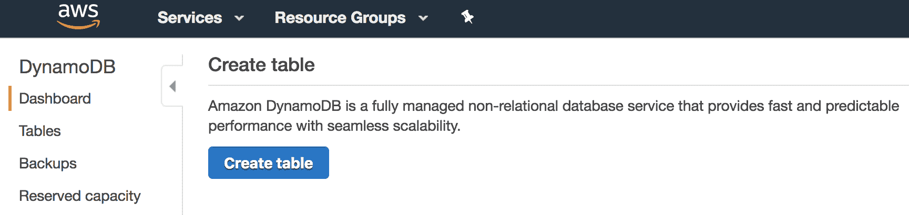
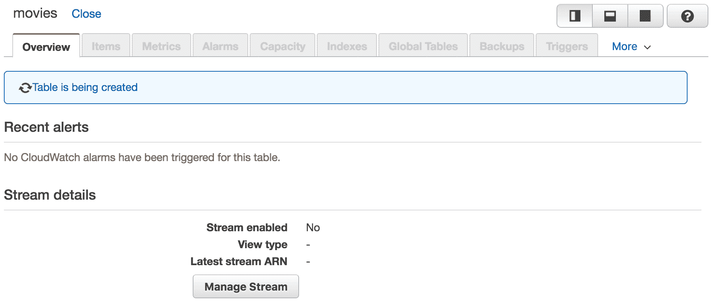
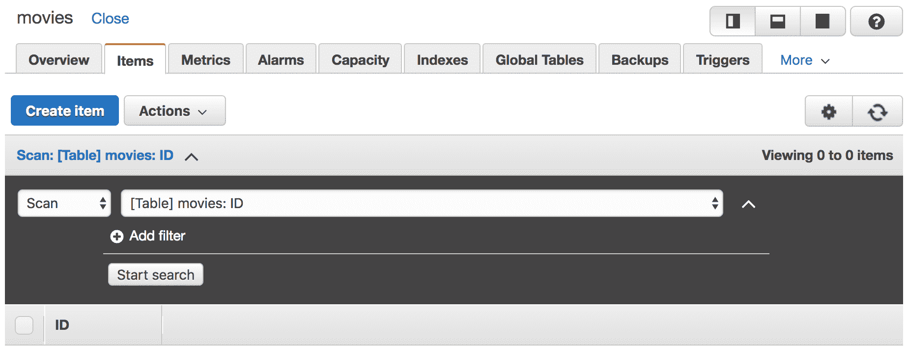
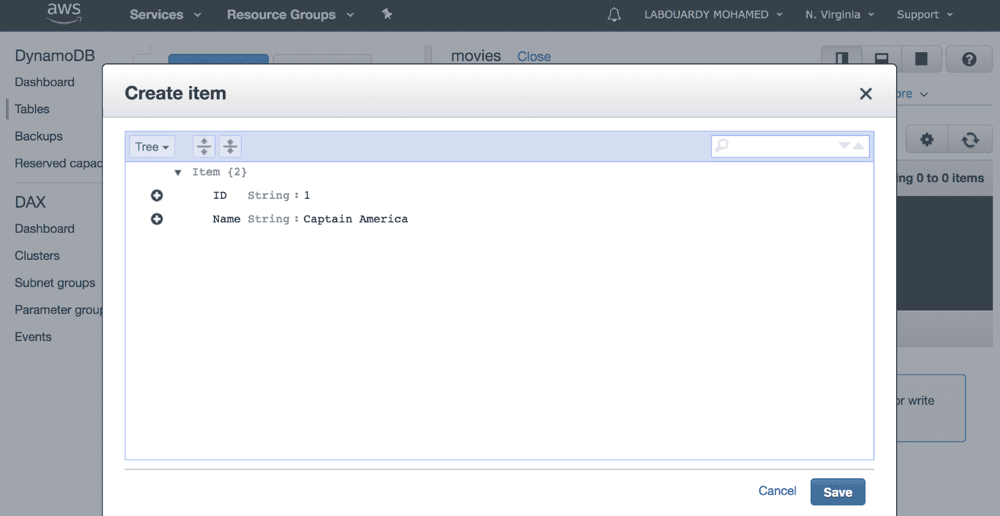
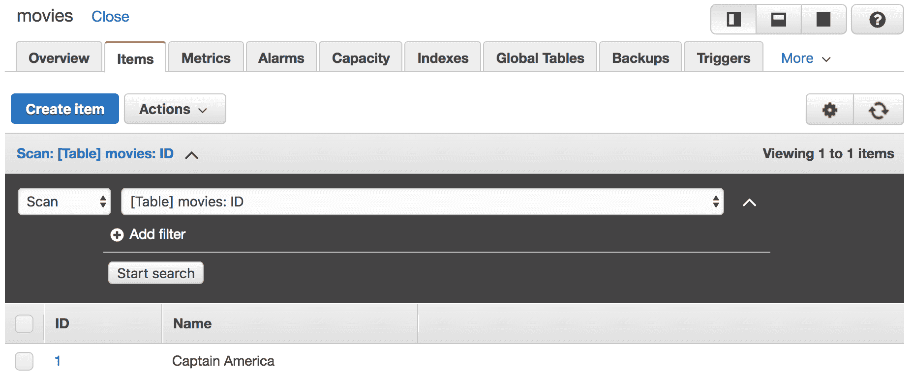
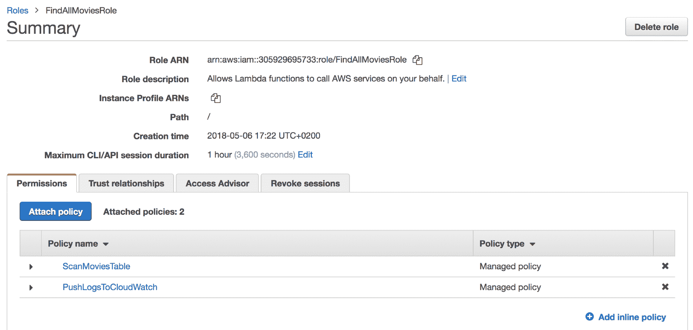
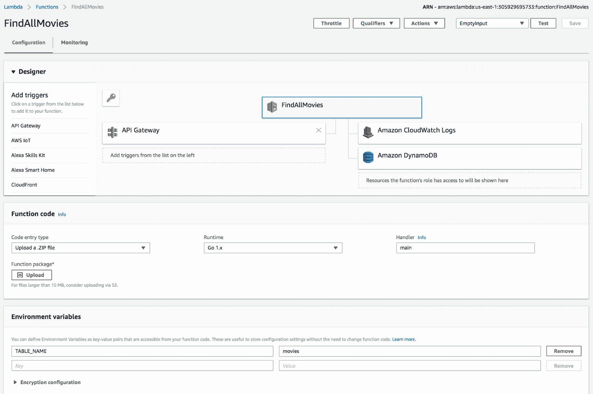
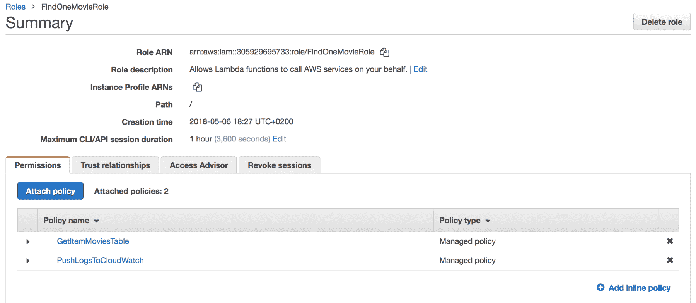
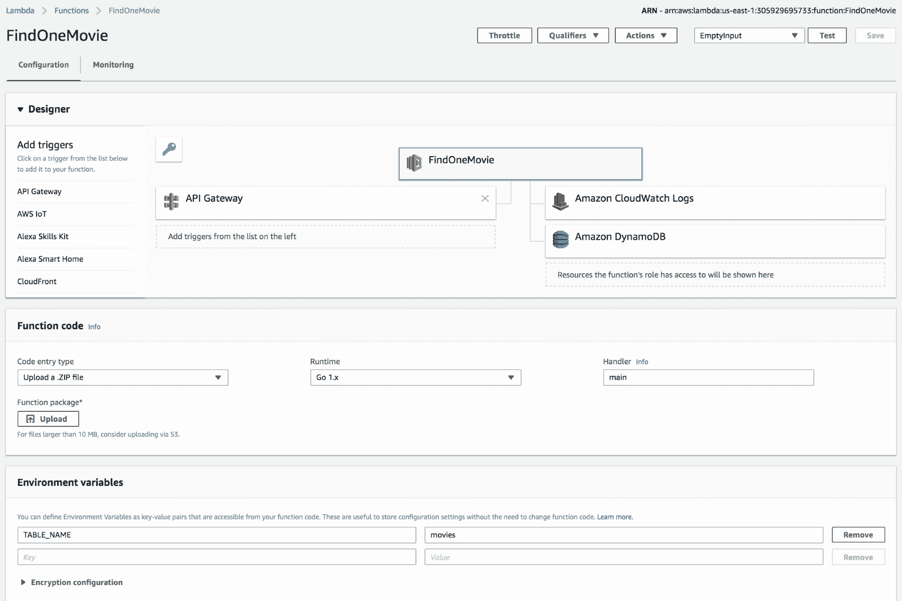
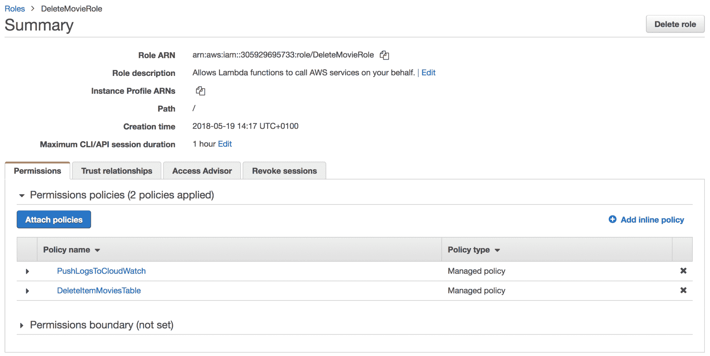

# 五、使用 DynamoDB 管理数据持久性

在上一章中，我们学习了如何使用 Lambda 和 API 网关构建 restfulapi，并发现了 Lambda 函数为何应该是无状态的。在本章中，我们将通过使用 AWS DynamoDB 进行数据存储来解决无状态问题。此外，我们还将看到如何将其与 Lambda 函数集成。

我们将讨论以下主题：

*   设置 DynamoDB
*   使用 DynamoDB

# 技术要求

本章是前一章的后续，因为它将使用相同的源代码。因此，为了避免重复，将不对某些片段进行解释。此外，最好了解 NoSQL 概念的基本知识，以便您轻松地阅读本章。本章的代码包位于 GitHub 上的[https://github.com/PacktPublishing/Hands-On-Serverless-Applications-with-Go](https://github.com/PacktPublishing/Hands-On-Serverless-Applications-with-Go) 。

# 设置 DynamoDB

DynamoDB 是一个 AWS NoSQL 数据库。它是一个托管 AWS 服务，允许您大规模存储和检索数据，而无需管理或维护数据库服务器。

在深入研究 DynamoDB 与 AWS Lambda 的集成之前，您需要了解有关 DynamoDB 的一些关键概念：

*   **结构与设计**：
    *   **表**：这是一组项目（行），其中每个项目都是一组属性（列）和值。
    *   **分区键**：也称为散列键。它是 DynamoDB 用于确定项目可在其中找到（读取操作）或将在其中存储（写入操作）的分区（物理位置）的唯一 ID。排序键可用于对同一分区中的项目排序。
    *   **索引**：与关系数据库类似，索引用于加快查询速度。在 DynamoDB 中，可以创建两种类型的索引：
        *   **全球二级指数**（**GSI**）
        *   **本地二级指标**（**LSI**）
*   **操作**：
    *   **扫描**：顾名思义，此操作在返回请求项之前扫描整个表。
    *   **查询**：此操作根据主键值查找项目。
    *   **PutItem**：创建新项目或用新项目替换旧项目。
    *   **GetItem**：通过主键查找项目。
    *   **DeleteItem**：通过主键删除表中的单个项。

就性能而言，扫描操作的效率更低，成本更高（它们消耗更多的吞吐量），因为操作必须遍历表中的每个项才能获得请求的项。因此，始终建议使用查询扫描操作。

现在您已经熟悉了 DynamoDB 术语，我们可以开始创建第一个 DynamoDB 表来存储 API 项。

# 创建表

要开始创建表，请登录 AWS 管理控制台（[https://console.aws.amazon.com/console/home](https://console.aws.amazon.com/console/home) 并从数据库部分选择 DynamoDB，点击**创建表格**按钮创建一个新的 DynamoDB 表格，如下图所示：



接下来，在下一个示例中为表指定一个名称，如`movies`。。由于每个电影都将由一个唯一的 ID 标识，因此它将是表的分区键。将所有其他设置保留为默认状态，然后点击 Create，如下所示：


创建表时请等待几秒钟，如下所示：



创建`movies`表后，将显示一条成功消息，提示您确认其创建。现在，我们需要将示例数据加载到表中。

# 加载样本数据

要填充`movies`表中的项目，请单击**项目**选项卡：



然后，点击**创建项目**并插入一部新电影，如下图所示（您需要使用加号（+）按钮附加一列以存储电影名称）：



点击保存。该表应如下所示：



对于真实世界的应用，我们不会使用控制台来填充数百万项。为了节省时间，我们将使用 AWS SDK 在 Go To load items To the table 中编写一个小应用。

在 Go 工作区中创建一个新项目，并将以下内容复制到`init-db.go`文件中：

```go
func main() {
  cfg, err := external.LoadDefaultAWSConfig()
  if err != nil {
    log.Fatal(err)
  }

  movies, err := readMovies("movies.json")
  if err != nil {
    log.Fatal(err)
  }

  for _, movie := range movies {
    fmt.Println("Inserting:", movie.Name)
    err = insertMovie(cfg, movie)
    if err != nil {
      log.Fatal(err)
    }
  }

}
```

前面的代码读取一个 JSON 文件（[https://github.com/PacktPublishing/Hands-On-Serverless-Applications-with-Go/blob/master/ch5/movies.json](https://github.com/PacktPublishing/Hands-On-Serverless-Applications-with-Go/blob/master/ch5/movies.json) ），包含电影列表；将其编码到一个`Movie`结构的数组中，如下所示：

```go
func readMovies(fileName string) ([]Movie, error) {
  movies := make([]Movie, 0)

  data, err := ioutil.ReadFile(fileName)
  if err != nil {
    return movies, err
  }

  err = json.Unmarshal(data, &movies)
  if err != nil {
    return movies, err
  }

  return movies, nil
}
```

然后，它遍历 movies 数组中的每一部电影。然后，使用`PutItem`方法将其插入 DynamoDB 表中，如下所示：

```go
func insertMovie(cfg aws.Config, movie Movie) error {
  item, err := dynamodbattribute.MarshalMap(movie)
  if err != nil {
    return err
  }

  svc := dynamodb.New(cfg)
  req := svc.PutItemRequest(&dynamodb.PutItemInput{
    TableName: aws.String("movies"),
    Item: item,
  })
  _, err = req.Send()
  if err != nil {
    return err
  }
  return nil
}
```

确保使用终端会话*中的`go get github.com/aws/aws-sdk-go-v2/aws`命令安装 AWS Go SDK。*

要用数据加载`movies`表，请输入以下命令：

```go
AWS_REGION=us-east-1 go run init-db.go
```

您可以使用 DynamoDB 控制台验证加载到`movies`表中的数据，如以下屏幕截图所示：


现在已经准备好了 DynamoDB 表，我们需要更新每个 API 端点函数的代码以使用该表，而不是硬编码的电影列表。

# 使用 DynamoDB

在本节中，我们将更新现有函数以从/向 DynamoDB 表读写。下图描述了目标体系结构：


API 网关将传入的请求转发给目标 Lambda 函数，该函数将调用`movies`表上相应的 DynamoDB 操作。

# 扫描请求

首先，我们需要实现返回电影列表的功能；以下步骤描述了如何实现这一目标：

1.  更新`findAll`处理程序端点以使用`Scan`方法从表中获取所有项：

```go
func findAll() (events.APIGatewayProxyResponse, error) {
  cfg, err := external.LoadDefaultAWSConfig()
  if err != nil {
    return events.APIGatewayProxyResponse{
      StatusCode: http.StatusInternalServerError,
      Body: "Error while retrieving AWS credentials",
    }, nil
  }

  svc := dynamodb.New(cfg)
  req := svc.ScanRequest(&dynamodb.ScanInput{
    TableName: aws.String(os.Getenv("TABLE_NAME")),
  })
  res, err := req.Send()
  if err != nil {
    return events.APIGatewayProxyResponse{
      StatusCode: http.StatusInternalServerError,
      Body: "Error while scanning DynamoDB",
    }, nil
  }

  response, err := json.Marshal(res.Items)
  if err != nil {
    return events.APIGatewayProxyResponse{
      StatusCode: http.StatusInternalServerError,
      Body: "Error while decoding to string value",
    }, nil
  }

  return events.APIGatewayProxyResponse{
    StatusCode: 200,
    Headers: map[string]string{
      "Content-Type": "application/json",
    },
    Body: string(response),
  }, nil
}
```

此功能的完整实现可在 GitHub 存储库（[中找到 https://github.com/PacktPublishing/Hands-On-Serverless-Applications-with-Go/blob/master/ch5/findAll/main.go](https://github.com/PacktPublishing/Hands-On-Serverless-Applications-with-Go/blob/master/ch5/findAll/main.go) ）。

2.  构建部署包并使用以下 AWS CLI 命令更新`FindAllMovies`Lambda 功能代码：

```go
aws lambda update-function-code --function-name FindAllMovies \
 --zip-file fileb://./deployment.zip \
 --region us-east-1
```

3.  通过添加以下 IAM 策略，确保更新 FindAllMoviesRole，以授予 Lambda 函数调用 DynamoDB 表上的`Scan`操作的权限：

```go
{
  "Version": "2012-10-17",
  "Statement": [
    {
      "Sid": "1",
      "Effect": "Allow",
      "Action": "dynamodb:Scan",
      "Resource": [
        "arn:aws:dynamodb:us-east-1:ACCOUNT_ID:table/movies/index/ID",
        "arn:aws:dynamodb:us-east-1:ACCOUNT_ID:table/movies"
      ]
    }
  ]
}
```

将策略分配给 IAM 角色后，它应成为附加策略的一部分，如下一屏幕截图所示：



4.  最后，使用 Lambda 控制台或使用 AWS CLI，添加一个新的环境变量以指向我们先前创建的 DynamoDB 表名：

```go
aws lambda update-function-configuration --function-name FindAllMovies \
 --environment Variables={TABLE_NAME=movies} \
 --region us-east-1
```

以下屏幕截图显示了一个正确配置的 FindAllMovies 功能，IAM 通过定义的`TABLE_NAME`环境变量访问 DynamoDB 和 CloudWatch：



正确配置 FindAllMovies 功能

5.  保存它并使用 cURL 命令调用 API 网关 URL，如下所示：

```go
curl -sX GET https://51cxzthvma.execute-api.us-east-1.amazonaws.com/staging/movies | jq '.'
```

6.  数组将以 JSON 格式返回，如下所示：


7.  端点正在工作并从表中获取电影的项目，但返回的 JSON 是原始 DynamoDB 响应。我们将通过仅返回以下`ID`和`Name`属性来解决此问题：

```go
movies := make([]Movie, 0)
for _, item := range res.Items {
  movies = append(movies, Movie{
    ID: *item["ID"].S,
    Name: *item["Name"].S,
  })
}

response, err := json.Marshal(movies)
```

8.  此外，生成 ZIP 文件并更新 Lambda 函数代码，然后使用前面给出的 cURL 命令调用 API 网关 URL，如下所示：


好多了，对吧

# GetItem 请求

要实现的第二个功能将负责从 DynamoDB 返回单个项，以下步骤说明了如何构建该项：

1.  更新`findOne`处理程序以调用 DynamoDB 中的`GetItem`方法。这将返回一个项目，该项目的标识符传递到 API 端点参数中：

```go
func findOne(request events.APIGatewayProxyRequest) (events.APIGatewayProxyResponse, error) {
  id := request.PathParameters["id"]

  cfg, err := external.LoadDefaultAWSConfig()
  if err != nil {
    return events.APIGatewayProxyResponse{
      StatusCode: http.StatusInternalServerError,
      Body: "Error while retrieving AWS credentials",
    }, nil
  }

  svc := dynamodb.New(cfg)
  req := svc.GetItemRequest(&dynamodb.GetItemInput{
    TableName: aws.String(os.Getenv("TABLE_NAME")),
    Key: map[string]dynamodb.AttributeValue{
      "ID": dynamodb.AttributeValue{
        S: aws.String(id),
      },
    },
  })
  res, err := req.Send()
  if err != nil {
    return events.APIGatewayProxyResponse{
      StatusCode: http.StatusInternalServerError,
      Body: "Error while fetching movie from DynamoDB",
    }, nil
  }

  ...
}
```

此功能的完整实现可在 GitHub 存储库（[中找到 https://github.com/PacktPublishing/Hands-On-Serverless-Applications-with-Go/blob/master/ch5/findOne/main.go](https://github.com/PacktPublishing/Hands-On-Serverless-Applications-with-Go/blob/master/ch5/findAll/main.go) ）。

2.  与`FindAllMovies`函数类似，创建 ZIP 文件并使用以下 AWS CLI 命令更新现有 Lambda 函数代码：

```go
aws lambda update-function-code --function-name FindOneMovie \
 --zip-file fileb://./deployment.zip \
 --region us-east-1
```

3.  使用以下 IAM 策略在`movies`表上向`FindOneMovie`Lambda 函数授予`GetItem`权限：

```go
{
  "Version": "2012-10-17",
  "Statement": [
    {
      "Sid": "1",
      "Effect": "Allow",
      "Action": "dynamodb:GetItem",
      "Resource": "arn:aws:dynamodb:us-east-1:ACCOUNT_ID:table/movies"
    }
  ]
}
```

4.  IAM 角色的配置应如以下屏幕截图所示：



5.  以 DynamoDB 表名作为值定义新的环境变量：

```go
aws lambda update-function-configuration --function-name FindOneMovie \
 --environment Variables={TABLE_NAME=movies} \
 --region us-east-1
```

6.  返回`FindOneMovie`仪表板，确认所有设置均已配置，如以下屏幕截图所示：



7.  通过发出以下 cURL 命令调用 API 网关：

```go
curl -sX GET https://51cxzthvma.execute-api.us-east-1.amazonaws.com/staging/movies/3 | jq '.'
```

8.  正如所料，响应是单个电影项目，ID 为 3，如 cURL 命令中所请求的：


# PutItem 请求

到目前为止，我们已经学习了如何列出所有项目并从 DynamoDB 返回单个项目。以下部分介绍了如何实现 Lambda 函数以向数据库中添加新项：

1.  更新`insert`处理程序以调用`PutItem`方法将新电影插入表中：

```go
func insert(request events.APIGatewayProxyRequest) (events.APIGatewayProxyResponse, error) {
  ...

  cfg, err := external.LoadDefaultAWSConfig()
  if err != nil {
    return events.APIGatewayProxyResponse{
      StatusCode: http.StatusInternalServerError,
      Body: "Error while retrieving AWS credentials",
    }, nil
  }

  svc := dynamodb.New(cfg)
  req := svc.PutItemRequest(&dynamodb.PutItemInput{
    TableName: aws.String(os.Getenv("TABLE_NAME")),
    Item: map[string]dynamodb.AttributeValue{
      "ID": dynamodb.AttributeValue{
        S: aws.String(movie.ID),
      },
      "Name": dynamodb.AttributeValue{
        S: aws.String(movie.Name),
      },
    },
  })
  _, err = req.Send()
  if err != nil {
    return events.APIGatewayProxyResponse{
      StatusCode: http.StatusInternalServerError,
      Body: "Error while inserting movie to DynamoDB",
    }, nil
  }

  ...
}
```

此功能的完整实现可在 GitHub 存储库（[中找到 https://github.com/PacktPublishing/Hands-On-Serverless-Applications-with-Go/blob/master/ch5/insert/main.go](https://github.com/PacktPublishing/Hands-On-Serverless-Applications-with-Go/blob/master/ch5/findAll/main.go) ）。

2.  创建部署包并使用以下命令更新`InsertMovie`Lambda 功能代码：

```go
aws lambda update-function-code --function-name InsertMovie \
 --zip-file fileb://./deployment.zip \
 --region us-east-1
```

3.  允许函数使用 IAM 策略调用电影表上的`PutItem`操作，如下所示：

```go
{
  "Version": "2012-10-17",
  "Statement": [
    {
      "Sid": "1",
      "Effect": "Allow",
      "Action": "dynamodb:PutItem",
      "Resource": "arn:aws:dynamodb:us-east-1:ACCOUNT_ID:table/movies"
    }
  ]
}
```

以下屏幕截图显示 IAM 角色已更新以处理`PutItem`操作的权限：


4.  创建一个具有 DynamoDB 表名的新环境变量，如下所示：

```go
aws lambda update-function-configuration --function-name InsertMovie \
 --environment Variables={TABLE_NAME=movies} \
 --region us-east-1
```

5.  确保 Lambda 功能配置如下：


正确配置的 InsertMovie 函数

6.  通过在 API 网关 URL 上调用以下 cURL 命令插入新电影：

```go
curl -sX POST -d '{"id":"17", "name":"The Punisher"}' https://51cxzthvma.execute-api.us-east-1.amazonaws.com/staging/movies | jq '.'
```

7.  验证电影是否已插入 DynamoDB 控制台，如下一个屏幕截图所示：


验证插入是否执行良好的另一种方法是使用带有 cURL 命令的`findAll`端点：

```go
curl -sX GET https://51cxzthvma.execute-api.us-east-1.amazonaws.com/staging/movies | jq '.'
```

8.  已创建 ID 为`17`的电影。如果表中包含具有相同 ID 的电影项，则它将被替换。以下是输出：


# 删除项目请求

最后，为了从 DynamoDB 中删除项，应实现以下 Lambda 函数：

1.  注册新处理程序以删除电影。处理程序将请求正文中的有效负载编码为一个`Movie`结构：

```go
var movie Movie
err := json.Unmarshal([]byte(request.Body), &movie)
if err != nil {
   return events.APIGatewayProxyResponse{
      StatusCode: 400,
      Body: "Invalid payload",
   }, nil
}
```

2.  然后，以电影 ID 为参数调用`DeleteItem`方法，将其从表中删除：

```go
cfg, err := external.LoadDefaultAWSConfig()
if err != nil {
  return events.APIGatewayProxyResponse{
    StatusCode: http.StatusInternalServerError,
    Body: "Error while retrieving AWS credentials",
  }, nil
}

svc := dynamodb.New(cfg)
req := svc.DeleteItemRequest(&dynamodb.DeleteItemInput{
  TableName: aws.String(os.Getenv("TABLE_NAME")),
  Key: map[string]dynamodb.AttributeValue{
    "ID": dynamodb.AttributeValue{
      S: aws.String(movie.ID),
    },
  },
})
_, err = req.Send()
if err != nil {
  return events.APIGatewayProxyResponse{
    StatusCode: http.StatusInternalServerError,
    Body: "Error while deleting movie from DynamoDB",
  }, nil
}
```

此功能的完整实现可在 GitHub 存储库（[中找到 https://github.com/PacktPublishing/Hands-On-Serverless-Applications-with-Go/blob/master/ch5/delete/main.go](https://github.com/PacktPublishing/Hands-On-Serverless-Applications-with-Go/blob/master/ch5/findAll/main.go) ）。

3.  与我们对其他功能所做的类似，创建一个名为`DeleteMovieRole`的新 IAM 角色，该角色有权将日志推送到 CloudWatch，并在 movies 表上调用`DeleteItem`操作，如下一个屏幕截图所示：



4.  接下来，在构建部署包后创建一个新的 Lambda 函数：

```go
aws lambda create-function --function-name DeleteMovie \
 --zip-file fileb://./deployment.zip \
 --runtime go1.x --handler main \
 --role arn:aws:iam::ACCOUNT_ID:role/DeleteMovieRole \
 --environment Variables={TABLE_NAME=movies} \
 --region us-east-1
```

5.  回到 Lambda 控制台。应该已经创建了一个`DeleteMovie`函数，如下一个屏幕截图所示：


6.  最后，我们需要在 API 网关的`/movies`端点上公开一个`DELETE`方法。为此，我们将不使用 API 网关控制台，而是使用 AWS CLI，以便您熟悉它。
7.  要在`movies`资源上创建`DELETE`方法，我们将使用以下命令：

```go
aws apigateway put-method --rest-api-id API_ID \
 --resource-id RESOURCE_ID \
 --http-method DELETE \
 --authorization-type "NONE" \
 --region us-east-1 
```

8.  但是，我们需要提供 API ID 和资源 ID。这些 ID 可以在 API 网关控制台中轻松找到，如下所示：


对于像我这样的 CLI 爱好者，您还可以通过运行以下命令来获取此信息：

```go
aws apigateway get-rest-apis --query "items[?name==\`MoviesAPI\`].id" --output text
```

```go
aws apigateway get-resources --rest-api-id API_ID --query "items[?path==\`/movies\`].id" --output text
```

9.  现在已经定义了 ID，用您的 ID 更新`aws apigateway put-method`命令并执行该命令。
10.  接下来，将`DeleteMovie`函数设置为`DELETE`方法的目标：

```go
aws apigateway put-integration \
 --rest-api-id API_ID \
 --resource-id RESOURCE_ID \
 --http-method DELETE \
 --type AWS_PROXY \
 --integration-http-method DELETE \
 --uri arn:aws:apigateway:us-east-1:lambda:path/2015-03-31/functions/arn:aws:lambda:us-east-1:ACCOUNT_ID:function:DeleteMovie/invocations \
 --region us-east-1
```

11.  最后，告诉 API 网关跳过任何转换，并在不做任何修改的情况下传递 Lambda 函数返回的响应：

```go
aws apigateway put-method-response \
 --rest-api-id API_ID \
 --resource-id RESOURCE_ID \
 --http-method DELETE \
 --status-code 200 \
 --response-models '{"application/json": "Empty"}' \
 --region us-east-1
```

12.  在资源面板中，`DELETE`方法应定义如下：


13.  使用以下 AWS CLI 命令重新部署 API：

```go
aws apigateway create-deployment \
 --rest-api-id API_ID \
 --stage-name staging \
 --region us-east-1
```

14.  使用以下 cURL 命令删除电影：

```go
curl -sX DELETE -d '{"id":"1", "name":"Captain America"}' https://51cxzthvma.execute-api.us-east-1.amazonaws.com/staging/movies | jq '.'
```

15.  使用以下 cURL 命令调用`findAll`端点，验证电影是否已被删除：

```go
curl -sX GET https://51cxzthvma.execute-api.us-east-1.amazonaws.com/staging/movies | jq '.'
```

16.  ID 为 1 的电影将不在正在返回的列表中。您可以在 DynamoDB 控制台中验证电影是否已成功删除，如下所示：


事实上，`movies`表中不再存在 ID 为 1 的电影。

现在，我们已经用 AWS Lambda、API 网关和 DynamoDB 创建了一个无服务器 RESTful API。

# 总结

在本章中，您学习了如何使用 Lambda 和 API 网关构建事件驱动 API，以及如何在 DynamoDB 中存储数据。在后面的章节中，我们将更进一步，在 API 网关上添加一个安全层，构建一个 CI/CD 管道来自动化部署，等等。

在下一章中，我们将介绍一些高级 AWS CLI 命令和选项，您可以使用这些命令和选项在 AWS Lambda 中构建无服务器功能以节省时间。我们还将了解如何创建和维护 Lambda 函数的多个版本和发行版。

# 问题

1.  实现一个`update`处理程序来更新现有的电影项目。
2.  在 API 网关中创建一个新的 PUT 方法来触发`update`Lambda 函数。
3.  实现一个 Lambda 函数来处理所有类型的事件（GET、POST、DELETE、PUT）。
4.  更新`findOne`处理程序，为有效请求返回正确的响应代码，但返回空数据（例如，请求的 ID 没有电影）。
5.  使用`Range`头和`Query`字符串在`findAll`端点上实现分页系统。