# 十二、保护无服务器应用的安全

AWS Lambda 是最终的现收现付云计算服务。客户只需将其 Lambda 功能代码上传到云端，云端即可启动并运行，无需保护或修补底层基础设施。但是，根据 AWS 的共享责任模型，您仍然需要负责保护 Lambda 函数的代码。本章专门介绍 AWS Lambda 中可以遵循的最佳实践和建议，以根据 AWS 良好架构的框架使应用具有弹性和安全性。本章将介绍以下主题：

*   身份验证和用户控制访问
*   加密环境变量
*   使用 CloudTrail 记录 AWS Lambda API 调用
*   对依赖项的漏洞扫描

# 技术要求

为了遵循本章，您可以遵循 API 网关设置章节，也可以基于 Lambda 和 API 网关准备一个无服务器 RESTful API。本章的代码包位于 GitHub 上的[https://github.com/PacktPublishing/Hands-On-Serverless-Applications-with-Go](https://github.com/PacktPublishing/Hands-On-Serverless-Applications-with-Go) 。

# 身份验证和用户控制访问

到目前为止，我们构建的无服务器应用工作起来很有魅力，并且对公众开放。如果任何人拥有 API 网关调用 URL，他/她都可以调用 Lambda 函数。幸运的是，AWS 提供了一个名为 Cognito 的托管服务。

**Amazon Cognito**是一家大规模的身份验证提供商和管理服务，允许您添加用户注册并轻松登录到您的应用。用户存储在称为用户池的可伸缩目录中。在下一节中，AmazonCognito 将用于在允许用户请求 RESTfulAPI 之前对用户进行身份验证。

首先，在 Amazon Cognito 中创建一个新的用户池，并为其命名：

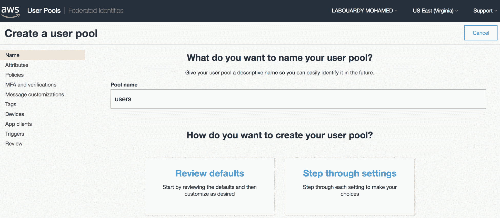

单击“查看默认值”选项以创建具有默认设置的池：


单击导航窗格中的属性，并勾选电子邮件地址或电话号码下的允许电子邮件地址选项，以允许用户使用电子邮件地址登录：


返回查看并单击创建池。创建过程结束时应显示一条成功消息：


创建第一个用户池后，在“常规设置”下从应用客户端注册无服务器 API，然后选择“添加应用客户端”。为应用指定一个名称并取消选中 Generate client secret 选项，如下所示：身份验证将在客户端完成。因此，出于安全目的，不应在 URL 上传递客户端机密：

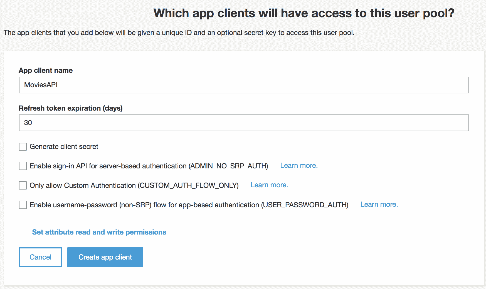

选择创建应用客户端注册应用，并将**应用客户端 id**复制到剪贴板：


现在已经创建了用户池，我们可以配置 API 网关来验证成功的用户池身份验证中的访问令牌，然后再授予对 Lambda 函数的访问权。

# 保护 API 访问安全

要开始保护 API 访问，请转到 API 网关控制台，选择我们在前几章中构建的 RESTful API，然后单击导航栏中的 Authorizers：


单击 createnewauthorizer 按钮并选择 Cognito。然后，选择我们之前创建的用户池，并将令牌源字段设置为`Authorization`。这定义了包含 API 调用方的身份令牌的传入请求头的名称`Authorization`：

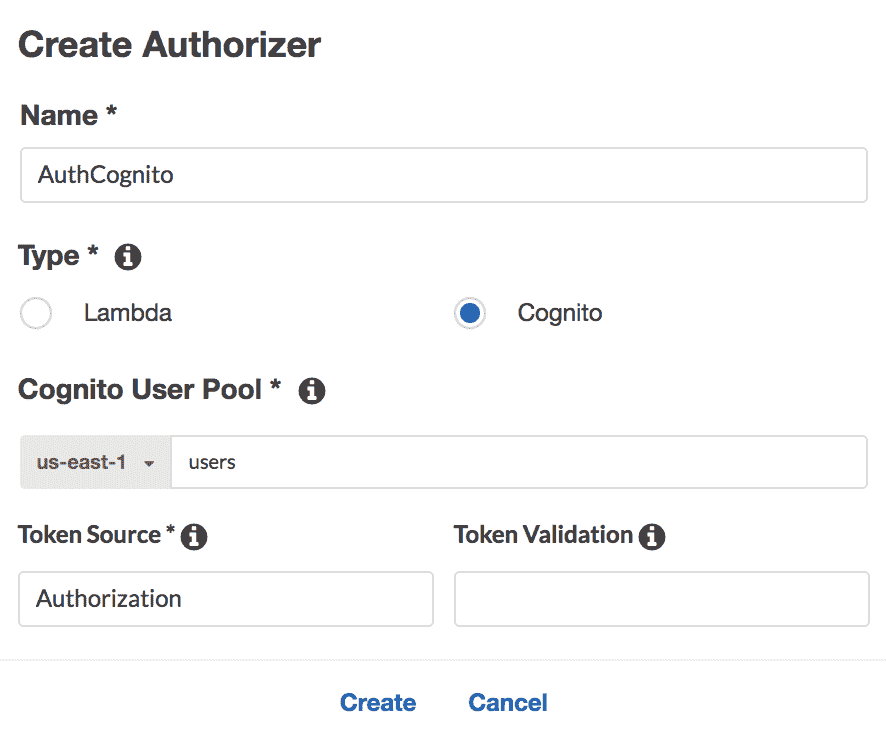

填写表单后，单击 Create 将 Cognito 用户池与 API 网关集成：


您现在可以保护所有端点，例如，为了保护负责列出所有`movies`的端点。点击`/movies`资源下对应的`GET`方法：

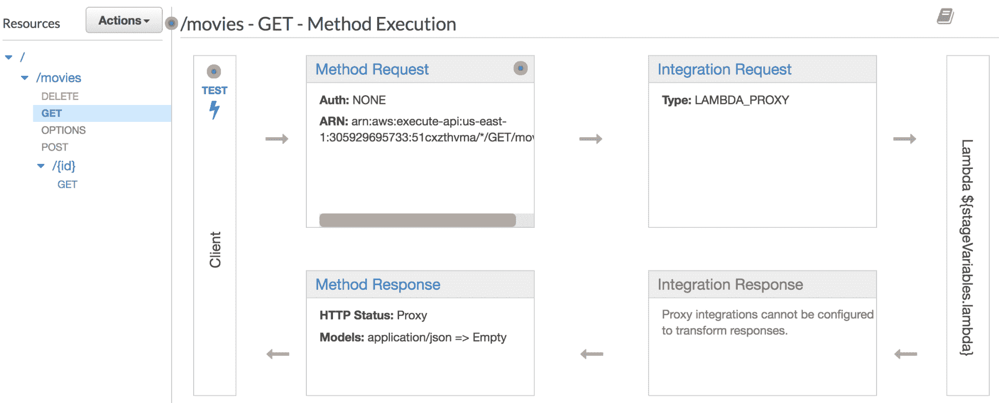

单击方法请求框，然后单击授权，并选择我们之前创建的用户池：


将 OAuth Scopes 选项保留为`None`，并对其余方法重复上述步骤以保护它们：


完成后，重新部署 API 并将浏览器指向 API 网关调用 URL：

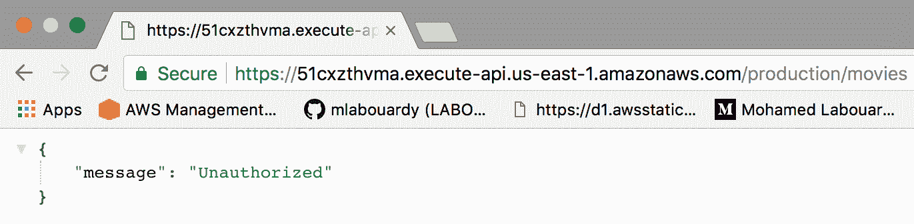

这一次，端点是安全的，需要身份验证。您可以通过检查我们以前构建的前端来确认该行为。如果检查网络请求，API 网关请求应返回 401 未经授权的错误：

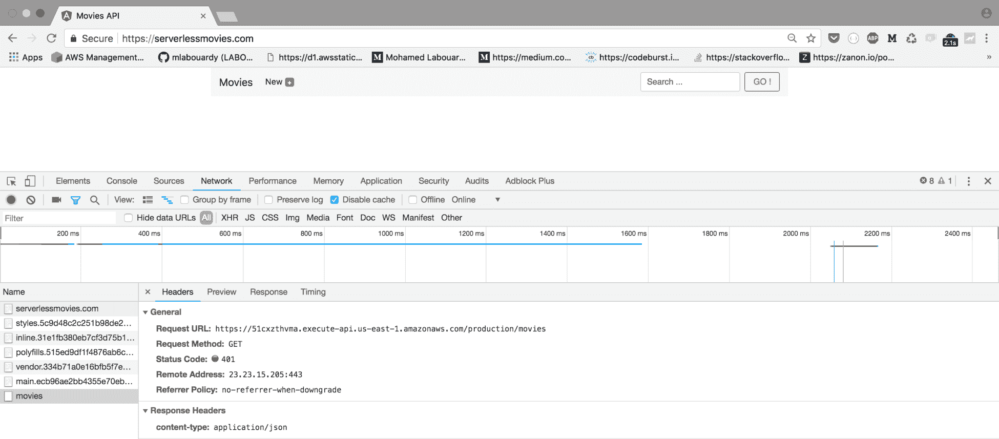

为了修复此错误，我们需要更新客户端（web 应用）以执行以下操作：

*   使用 Cognito JavaScript SDK 登录用户池
*   从用户池中获取已登录用户的标识令牌
*   在 API 网关请求的`Authorization`头中包含标识令牌

返回的标识令牌的过期日期为 1 小时。一旦过期，您需要使用刷新令牌来刷新会话。

# 使用 AWS Cognito 进行用户管理

在客户端进行更改之前，我们需要在 AmazonCognito 中创建一个测试用户。要实现这一点，您可以使用 AWS 管理控制台，也可以使用*AWS Golang SDK 以编程方式完成此操作。*

 *# 通过 AWS 管理控制台设置测试用户

单击用户和组，然后单击创建用户按钮：

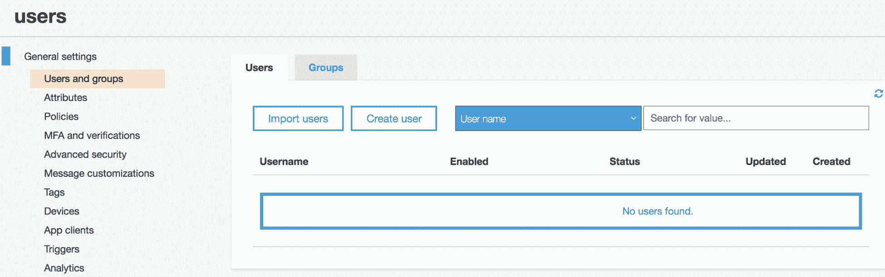

设置用户名和密码。如果要接收确认电子邮件，可以取消选中“将电子邮件标记为已验证”框：

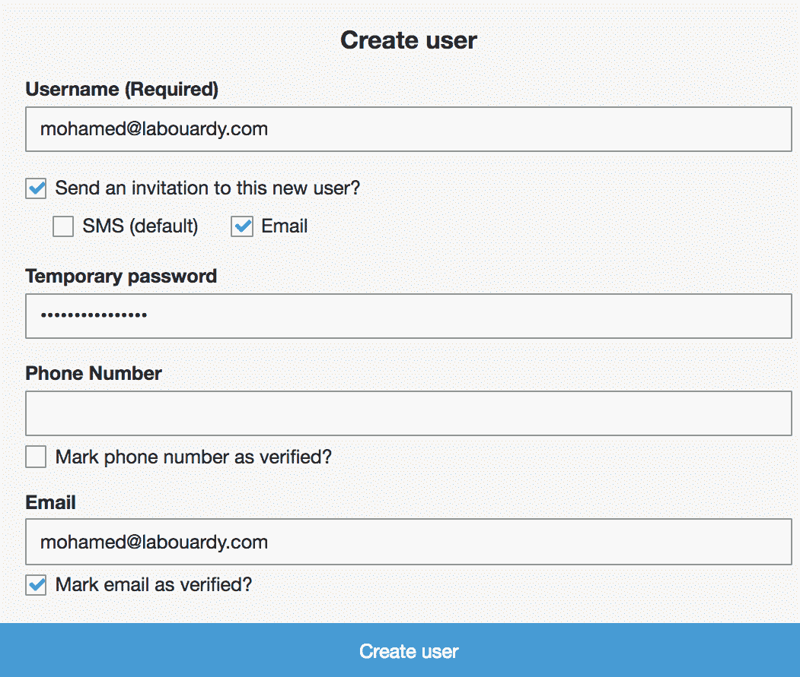

# 使用 Cognito Golang SDK 进行安装

创建一个包含以下内容的`main.go`文件。代码使用`cognitoidentityprovider`包中的`SignUpRequest`方法创建新用户。作为参数，它接受一个带有客户端 ID、用户名和密码的结构：

```go
package main

import (
  "log"
  "os"

  "github.com/aws/aws-sdk-go-v2/aws/external"
  "github.com/aws/aws-sdk-go-v2/service/cognitoidentityprovider"
  "github.com/aws/aws-sdk-go/aws"
)

func main() {
  cfg, err := external.LoadDefaultAWSConfig()
  if err != nil {
    log.Fatal(err)
  }

  cognito := cognitoidentityprovider.New(cfg)
  req := cognito.SignUpRequest(&cognitoidentityprovider.SignUpInput{
    ClientId: aws.String(os.Getenv("COGNITO_CLIENT_ID")),
    Username: aws.String("EMAIL"),
    Password: aws.String("PASSWORD"),
  })
  _, err = req.Send()
  if err != nil {
    log.Fatal(err)
  }
}
```

使用`go run main.go`命令运行前面的命令。您将收到一封带有临时密码的电子邮件：

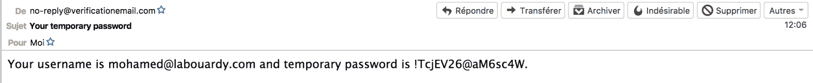

注册后，用户必须通过输入通过电子邮件发送的代码来确认注册。要确认注册过程，您必须收集用户收到的代码并按如下方式使用：

```go
cognito := cognitoidentityprovider.New(cfg)
req := cognito.ConfirmSignUpRequest(&cognitoidentityprovider.ConfirmSignUpInput{
  ClientId: aws.String(os.Getenv("COGNITO_CLIENT_ID")),
  Username: aws.String("EMAIL"),
  ConfirmationCode: aws.String("CONFIRMATION_CODE"),
})
_, err = req.Send()
if err != nil {
  log.Fatal(err)
}
```

现在已经在 Cognito 用户池中创建了一个用户，我们准备好更新客户端了。首先创建一个登录表单，如下所示：

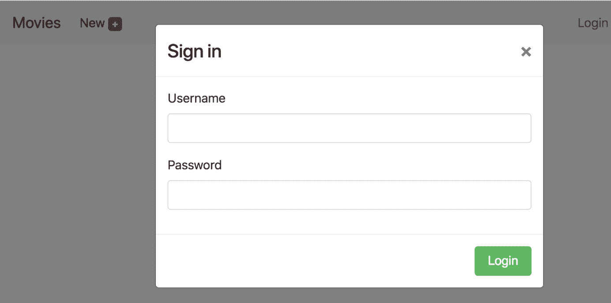

接下来，使用 Node.js 包管理器安装 Cognito SDK for Javascript。此软件包包含 Angular 模块和您可能需要与 Cognito 交互的提供者：

```go
npm install --save amazon-cognito-identity-js
```

此外，我们必须使用`auth`方法创建 Angular 服务，该方法通过提供`UserPoolId`对象和`ClientId`来创建`CognitoUserPool`对象，并根据参数中给出的用户名和密码对用户进行身份验证。如果登录成功，则调用`onSuccess`回调。如果登录失败，则调用`onFailure`回调：

```go
import { Injectable } from '@angular/core';
import { CognitoUserPool, CognitoUser, AuthenticationDetails} from 'amazon-cognito-identity-js';
import { environment } from '../../environments/environment';

@Injectable()
export class CognitoService {

  public static CONFIG = {
    UserPoolId: environment.userPoolId,
    ClientId: environment.clientId
  }

  auth(username, password, callback){
    let user = new CognitoUser({
      Username: username,
      Pool: this.getUserPool()
    })

    let authDetails = new AuthenticationDetails({
      Username: username,
      Password: password
    })

    user.authenticateUser(authDetails, {
      onSuccess: res => {
        callback(null, res.getIdToken().getJwtToken())
      },
      onFailure: err => {
        callback(err, null)
      }
    })
  }

  getUserPool() {
    return new CognitoUserPool(CognitoService.CONFIG);
  }

  getCurrentUser() {
    return this.getUserPool().getCurrentUser();
  }

}
```

每次单击登录按钮时都会调用`auth`方法。如果用户输入了正确的凭据，那么将与 Amazon Cognito 服务建立一个用户会话，并且将在浏览器的本地存储器中保存一个用户标识令牌。如果未输入正确的凭据，将向用户显示一条错误消息：

```go
signin(username, password){
    this.cognitoService.auth(username, password, (err, token) => {
      if(err){
        this.loginError = true
      }else{
        this.loginError = false
        this.storage.set("COGNITO_TOKEN", token)
        this.loginModal.close()
      }
    })
  }
```

最后，`MoviesAPI`服务应该更新为包含用户身份令牌（称为 JWT 令牌–[https://docs.aws.amazon.com/cognito/latest/developerguide/amazon-cognito-user-pools-using-tokens-with-identity-providers.html#amazon-cognito 用户池使用`Authorization`中的 id 令牌](https://docs.aws.amazon.com/cognito/latest/developerguide/amazon-cognito-user-pools-using-tokens-with-identity-providers.html#amazon-cognito-user-pools-using-the-id-token)每个 API 网关请求调用的标头，如下所示：

```go
@Injectable()
export class MoviesApiService {

  constructor(private http: Http,
    @Inject(LOCAL_STORAGE) private storage: WebStorageService) {}

    findAll() {
      return this.http
          .get(environment.api, {
              headers: this.getHeaders()
          })
          .map(res => {
              return res.json()
          })
    }

    getHeaders() {
      let headers = new Headers()
      headers.append('Authorization', this.storage.get("COGNITO_TOKEN"))
      return headers
    }

}
```

前面的代码示例已使用 Angular 5 进行了测试。此外，请确保将代码相应地应用到您自己的 web 框架中。

要测试它，请返回浏览器。应弹出登录表单；用我们先前创建的用户凭据填充字段。然后，单击登录按钮：


将返回用户标识，并使用请求头中包含的令牌调用 RESTful API。API 网关将验证令牌并调用`FindAllMovies`Lambda 函数，该函数将从 DynamoDB 表返回电影：

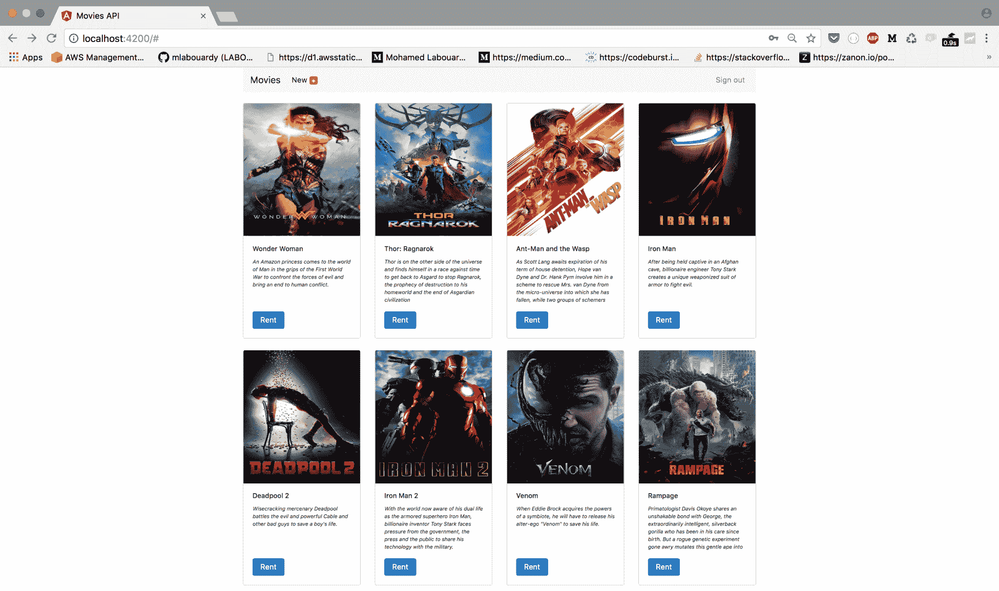

对于 web 开发人员，Cognito 的`getSession`方法可用于从本地存储检索当前用户，因为 JavaScript SDK 配置为在正确验证后自动存储令牌，如以下屏幕截图所示：


总而言之，到目前为止，我们已经做了以下工作：

*   构建多个 Lambda 函数来管理电影存储
*   DynamoDB 表中的托管 Lambda 数据持久性
*   通过 API 网关公开这些 Lambda 函数
*   构建了一个 web 客户端，用于测试 S3 中构建的堆栈
*   使用 CloudFront 发行版加快了 web 客户端资产
*   在路由 53 中设置自定义域名
*   使用 AWS Cognito 保护 API

以下模式说明了我们迄今为止构建的无服务器体系结构：


Amazon Cognito 可以配置多个身份提供者，如 Facebook、Twitter、Google 或开发者身份验证。

# 加密环境变量

在前面的章节中，我们了解了如何使用环境变量和 AWS Lambda 动态地将数据传递给函数代码，而不更改任何代码。根据**十二因素 App**方法（[https://12factor.net/](https://12factor.net/) ），您应该始终将配置与代码分开，以避免将敏感凭据检查到存储库，并能够定义 Lambda 函数的多个版本（暂存、生产和沙箱）使用相同的源代码。此外，环境变量可用于根据不同设置**（A/B 测试）**改变功能行为。

如果您想在多个 Lambda 函数之间共享机密，可以使用 AWS 的**系统管理器参数存储**。

以下示例说明了如何使用环境变量将 MySQL 凭据传递给函数的代码：

```go
func handler() error {
  MYSQL_USERNAME := os.Getenv("MYSQL_USERNAME")
  MYSQL_PASSWORD := os.Getenv("MYSQL_PASSWORD")
  MYSQL_DATABASE := os.Getenv("MYSQL_DATABASE")
  MYSQL_PORT := os.Getenv("MYSQL_PORT")
  MYSQL_HOST := os.Getenv("MYSQL_HOST")

  uri := fmt.Sprintf("%s:%s@tcp(%s:%s)/%s", MYSQL_USERNAME, MYSQL_PASSWORD, MYSQL_HOST, MYSQL_PORT, MYSQL_DATABASE)
  db, err := sql.Open("mysql", uri)
  if err != nil {
    return err
  }
  defer db.Close()

  _, err = db.Query(`CREATE TABLE IF NOT EXISTS movies(id INT PRIMARY KEY AUTO_INCREMENT, name VARCHAR(50) NOT NULL)`)
  if err != nil {
    return err
  }

  for _, movie := range []string{"Iron Man", "Thor", "Avengers", "Wonder Woman"} {
    _, err := db.Query("INSERT INTO movies(name) VALUES(?)", movie)
    if err != nil {
      return err
    }
  }

  movies, err := db.Query("SELECT id, name FROM movies")
  if err != nil {
    return err
  }

  for movies.Next() {
    var name string
    var id int
    err = movies.Scan(&id, &name)
    if err != nil {
      return err
    }

    log.Printf("ID=%d\tName=%s\n", id, name)
  }
  return nil
}
```

一旦将该函数部署到 AWS Lambda 并设置了环境变量，就可以调用该函数。它将输出插入数据库的电影列表：

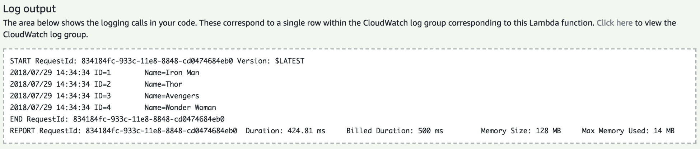

到目前为止，一切顺利。但是，数据库凭据是纯文本的！


幸运的是，AWS Lambda 使用 AWS 密钥管理服务提供了两个级别的加密：在传输和静止。

# 静态数据加密

AWS Lambda 在部署函数时加密所有环境变量，并在调用函数时（动态）解密这些变量。

如果展开“加密配置”部分，您将注意到默认情况下 AWS Lambda 使用默认 Lambda 服务密钥在静止时加密环境变量。第一次在特定区域中创建 Lambda 函数时，会自动创建此键：


通过导航到 Identity and Access Management Console，您可以更改密钥并使用自己的密钥。然后，单击加密密钥：

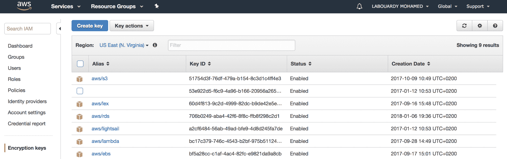

单击“创建密钥”按钮创建新的客户主密钥：

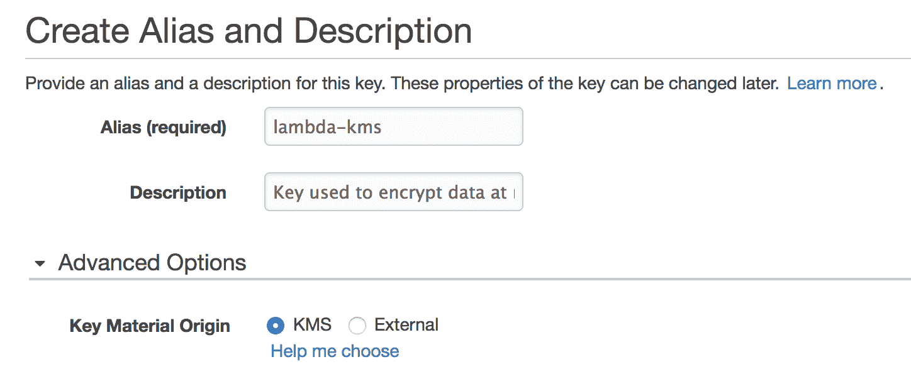

通过**密钥管理服务**（**KMS**API）选择 IAM 角色和帐户来管理密钥。然后，选择创建 Lambda 函数时使用的 IAM 角色。这允许 Lambda 功能使用**客户主密钥**（**CMK**）并成功请求`encrypt`和`decrypt`方法：

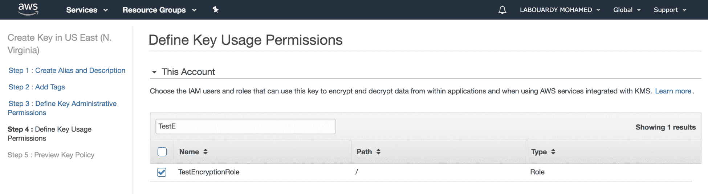

创建密钥后，返回 Lambda 函数配置页面，将密钥更改为您刚刚创建的密钥：


现在，AWS Lambda 将使用您自己的密钥加密存储在 Amazon 中的静态环境变量。

# 传输中的数据加密

建议在部署函数之前加密环境变量（敏感信息）。AWS Lambda 在控制台上提供加密帮助程序，使此过程易于遵循。

为了在传输过程中加密（通过使用我们前面使用的 KMS），您需要通过选中启用传输过程中加密的帮助程序复选框来启用此功能：


通过点击相应的加密按钮对`MYSQL_USERNAME`和`MYSQL_PASSWORD`进行加密：


凭证将被加密，您将在控制台中看到它们为`CipherText`。接下来，需要使用 KMS SDK 更新函数的处理程序以解密环境变量：

```go
var encryptedMysqlUsername string = os.Getenv("MYSQL_USERNAME")
var encryptedMysqlPassword string = os.Getenv("MYSQL_PASSWORD")
var mysqlDatabase string = os.Getenv("MYSQL_DATABASE")
var mysqlPort string = os.Getenv("MYSQL_PORT")
var mysqlHost string = os.Getenv("MYSQL_HOST")
var decryptedMysqlUsername, decryptedMysqlPassword string

func decrypt(encrypted string) (string, error) {
  kmsClient := kms.New(session.New())
  decodedBytes, err := base64.StdEncoding.DecodeString(encrypted)
  if err != nil {
    return "", err
  }
  input := &kms.DecryptInput{
    CiphertextBlob: decodedBytes,
  }
  response, err := kmsClient.Decrypt(input)
  if err != nil {
    return "", err
  }
  return string(response.Plaintext[:]), nil
}

func init() {
  decryptedMysqlUsername, _ = decrypt(encryptedMysqlUsername)
  decryptedMysqlPassword, _ = decrypt(encryptedMysqlPassword)
}

func handler() error {
  uri := fmt.Sprintf("%s:%s@tcp(%s:%s)/%s", decryptedMysqlUsername, decryptedMysqlPassword, mysqlHost, mysqlPort, mysqlDatabase)
  db, err := sql.Open("mysql", uri)
  if err != nil {
    return err
  }
  ...
}
```

如果您使用自己的 KMS 密钥，则需要向附加到 Lambda 函数的执行角色（IAM 角色）授予`kms:Decrypt`权限。另外，请确保增加默认执行超时，以便有足够的时间完成函数代码。

# 使用 CloudTrail 记录 AWS Lambda API 调用

捕获 Lambda 函数发出的所有调用对于审核、安全性和法规遵从性非常重要。它为您提供了与之交互的 AWS 服务的全局概览。利用此功能的一个服务是**CloudTrail**。

CloudTrail 记录 Lambda 函数发出的 API 调用。它简单易用。您只需从 AWS 管理控制台导航到 CloudTrail，并按事件源过滤事件，事件源应为`lambda.amazonaws.com`。

在这里，您应该拥有每个 Lambda 函数发出的所有调用，如以下屏幕截图所示：


除了公开事件历史记录外，您还可以在每个 AWS 区域中创建一条线索，在单个 S3 存储桶中记录 Lambda 函数的事件，然后使用**ELK**（**Elasticsearch、Logstash 和 Kibana**堆栈实现日志分析管道，以按如下方式处理日志：


最后，您可以创建交互式和动态小部件，在 kibana 中构建仪表板，以查看 Lambda 函数事件：


# 对依赖项的漏洞扫描

由于大多数 Lambda 函数代码都包含多个第三方 Go 依赖项（请记住`go get`命令），因此对所有这些依赖项执行审计非常重要。因此，扫描 Golang 依赖项的漏洞应该是 CI/CD 的一部分。您必须使用第三方工具（如**S****nyk**（[等）自动执行安全分析 https://snyk.io/](https://snyk.io/) 持续扫描依赖项中的已知安全漏洞。以下屏幕截图描述了一个完整的端到端部署过程，您可以选择为 Lambda 功能实施该过程：


通过将漏洞扫描作为工作流程的一部分，您将能够发现并修复软件包中可能导致数据丢失、服务中断和未经授权访问敏感信息的已知漏洞。

此外，应用最佳实践仍然可以应用于无服务器体系结构、软件工程实践（如代码审查和 git 分支）以及安全检查（如输入验证或清理），以避免 SQL 注入。

# 总结

在本章中，您学习了一些基于 Lambda 函数构建安全无服务器应用的最佳实践和建议。我们介绍了 AmazonCognito 如何被用作身份验证提供者，以及如何将其与 API 网关集成以保护 API 端点。然后，我们研究了 Lambda 函数代码实践，例如使用 AWS KMS 加密敏感数据和输入验证。此外，其他做法也很有用，可以挽救生命，例如应用配额和节流以防止使用者消耗您的所有 Lambda 函数容量，以及使用每个函数一个 IAM 角色来利用最小特权原则*。*

在下一章中，我们将讨论 Lambda 定价模型，以及如何基于预期负载估计定价。

# 问题

1.  将用户池中的用户与身份池集成，以允许用户使用其 Facebook 帐户登录。
2.  将用户池中的用户与身份池集成，以允许用户使用其 Twitter 帐户登录
3.  将用户池中的用户与身份池集成，以允许用户使用其 Google 帐户登录。
4.  实现一个表单，允许用户在 web 应用上创建帐户，以便他们能够登录。
5.  为未经身份验证的用户实施遗忘密码流。*