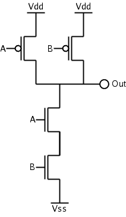
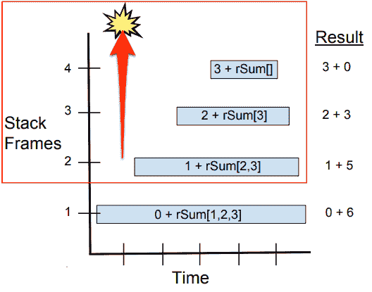
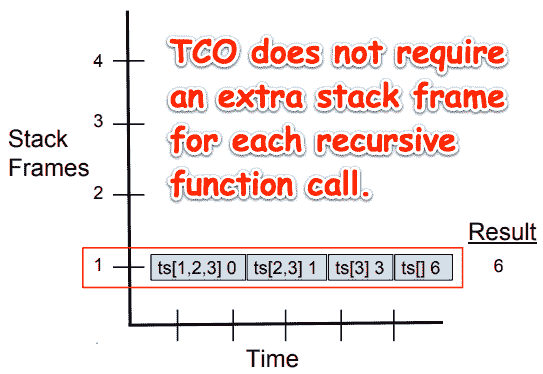
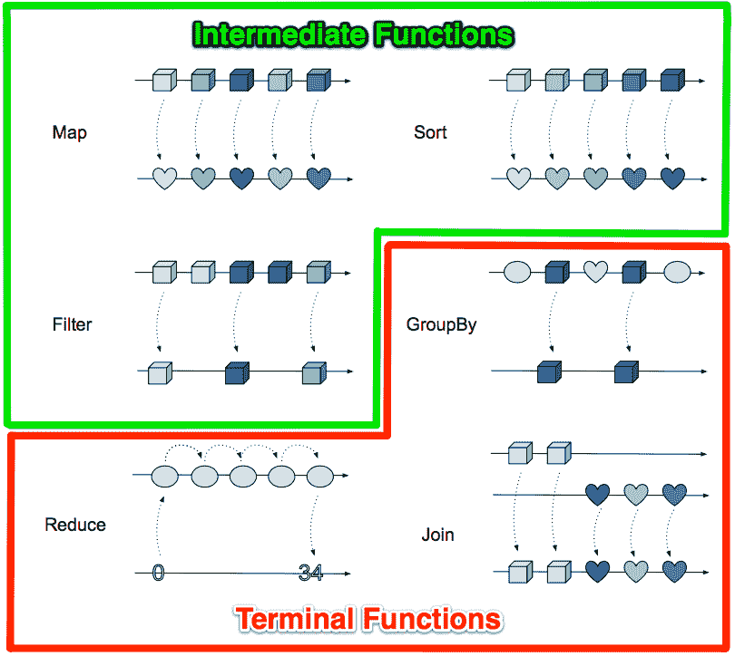

# 二、操纵集合

处理项目列表在生活中以及在编程语言中都很常见。当列表具有帮助我们操作列表中项目的关联函数时，我们通常将该对象称为集合。

在本章中，我们将了解如何使用高阶函数来大大简化操作集合的任务。我们将看到如何使用函数式编程技术和开源函数包编写代码，以创建优雅的解决方案，这些解决方案不仅具有深刻的见解，而且在当今的分布式处理环境中表现出色。

本章的目标是：

*   遍历集合
*   了解中间函子和终端函子
*   使用谓词筛选集合中的项
*   使用类似 Mocha 的 BDD 库进行测试
*   关注地图功能
*   掌握 Itertools 中集合操作函数的广度
*   利用例程和通道对集合进行迭代
*   了解我们如何使用 Go 处理大数据收集

## 遍历集合

为了实现一个集合，我们必须提供一种方法来访问集合中的每个元素，这可以使用下面代码中显示的 int 索引值来实现。我们将实现一个**先进先出**（**先进先出**订单队列。我们将提供一种使用切片数据结构存储元素的方法。最后，我们将实现一个`Next()`方法来提供遍历集合中元素的方法。

在下面的代码中，我们为`Iterator`对象定义了一个接口。它有一个方法`Next()`，它将返回集合中的下一个元素和一个布尔标志，以指示是否可以继续迭代：

```go
type CarIterator interface {
     Next() (value string, ok bool)
}
const INVALID_INT_VAL = -1
const INVALID_STRING_VAL = ""
```

接下来，我们定义一个集合对象，它有两个属性：一个用于访问当前元素的`int`索引和一段字符串，即集合中的实际数据：

```go
type Collection struct {
       index int
       List  []string
}
```

现在，我们实现集合的`Next()`方法，以满足`IntIterator`接口的规范：

```go
func (collection *Collection) Next() (value string, ok bool) {
       collection.index++
       if collection.index >= len(collection.List) {
              return INVALID_STRING_VAL, false
       }
       return collection.List[collection.index], true
}
```

`newSlice`函数是 iterable 集合`intCollection`的构造函数：

```go
func newSlice(s []string) *Collection {
        return &Collection{INVALID_INT_VAL, s}
}
```

最后，我们实现了`main()`功能来测试我们的`Collection`。

让我们打开一个终端窗口，使用`.init`工具集运行简单的 Go 应用程序：


`. init`（“Dot Init”）工具集确保我们已经安装了 Go，并且正确配置了`GOPATH`和`GOBIN`目录。首先，我们通过键入`.init`来获取 init 脚本的源代码。因为我们没有 import 语句，所以不需要运行 glideupdate。要运行我们的应用程序，请键入`go-run`。有关 Dot Init 的更多详细信息，请参见[附录](https://cdp.packtpub.com/learning_functional_programming_in_go/wp-admin/post.php?post=99&action=edit#post_7)、*杂项信息和操作指南*。

这个实现的问题是，我们把我们想要做的和我们如何做的混为一谈。我们实现了一个显式的`for`循环来执行迭代机制。为了遍历元素，我们定义并改变索引值的值。我们可以立即看到，这是一项势在必行的实施。

在函数式编程中，我们声明要做什么，而不是强制实现每个操作的每个细节。我们还避免了`for`循环的顺序性，这很难适应并发编程模型。

Go 不是一种函数式编程语言，但它有很多函数特性，我们可以利用这些特性来编写简洁、富有表现力的代码，希望代码没有 bug。

纯函数式语言不维护状态。函数调用通常是链式的，其中输入从一个函数传递到另一个函数。每个函数调用都以某种方式转换其输入。这些功能不需要关注外部状态，也不会产生副作用。每个函数调用都可以非常有效地完成它的工作。这种编程风格有助于进行有效的测试。

接下来，我们将看到函数链接与通过 Bash 命令进行管道输出非常相似。

## 管道 Bash 命令

执行组合或函数链非常类似于执行一系列 Bash 命令，其中一个命令的输出通过管道传输到下一个命令。例如，我们可以在`awk`命令中对包含时间戳和 IP 地址列表的文件进行 cat 输入。`awk`命令删除除第七列以外的所有列。接下来，我们按照降序对列表进行排序，最后，我们按照唯一的 IP 地址对数据进行分组。

考虑下面的 BASH 命令：

```go
$ cat ips.log | awk '{print $7}' | sort | uniq -c
```

让我们为该命令提供以下输入：

```go
Sun Feb 12 20:27:32 EST 2017 74.125.196.101
Sun Feb 12 20:27:33 EST 2017 98.139.183.24
Sun Feb 12 20:27:34 EST 2017 151.101.0.73
Sun Feb 12 20:27:35 EST 2017 98.139.183.24
Sun Feb 12 20:27:36 EST 2017 151.101.0.73
>Sun Feb 12 20:27:37 EST 2017 74.125.196.101
Sun Feb 12 20:27:38 EST 2017 98.139.183.24
Sun Feb 12 20:27:39 EST 2017 151.101.0.73
Sun Feb 12 20:27:40 EST 2017 98.139.183.24
Sun Feb 12 20:27:41 EST 2017 151.101.0.73
Sun Feb 12 20:27:42 EST 2017 151.101.0.73
Sun Feb 12 20:27:43 EST 2017 151.101.0.73
```

我们将获得以下输出：

```go
6 151.101.0.73
2 74.125.196.101
4 98.139.183.24
```

这是函数式编程中非常常见的模式。我们通常向函数或函数调用链输入一组数据，然后得到以某种方式转换的结果。

经常使用集合。当我们以简洁的方式实现它们时，将显式声明我们想要完成的任务的函数调用链接起来，我们就大大减少了代码量。结果是我们的代码更具表现力、简洁，更易于阅读。

## 函子

Go 有三种预声明/原始数据类型：`bool`、`string`、数字（`float`、`int64`等等）。Go 中的其他数据类型需要类型声明，也就是说，它们要求我们使用`type`关键字。函数与数组、结构、指针、接口、切片、映射和通道类型一起属于后一类数据类型。在 Go 中，函数是一流的数据类型，这意味着可以作为参数传递，并作为值返回。可以将函数作为参数和返回函数的函数称为高阶函数。

我们可以编写函数工厂——返回函数的函数——甚至函数工厂。我们还可以编写修改函数或为特定目的创建函数的函数。

**Functors**: A functor is a collection of `X` variables that can apply a function, `f`, over itself to create a collection of `Y`, that is, `f (X) → Y`. (To see what we're talking about here, take a quick look at the *Fingers times 10 functor* example in [Chapter 9](09.html), *Functors, Monoids, and Generics*)

请注意，Prolog 软件语言将函子定义为一个函数。前面的定义来自*范畴论*对函数式编程的影响。（详见[第 11 章](11.html)，*范畴论，适用*。）

### 修改函数的函数

在我们探讨中间函数和终端函数之前，让我们先用几个例子来说明修改函数的短语*函数。*

#### 修改函数的函数的编码示例

以下是我们可能编写的代码片段，用于构建包含两个下拉列表的页面部分，一个用于品牌，另一个用于车型：

```go
// http.Get :: String -> JSON
var renderPage = curry(func(makes, models) { /* render page */ })
// return two divs: one with makes and the other with models HTML/ULs
Task.Of(renderPage).Ap(http.Get("/makes")).Ap(http.Get("/models"))
```

请注意，每个 http.Get 都是一个单独的 API 调用。每个 API 调用都是部分应用程序。为了让 renderPage 等待每个调用完成，我们必须进行 API 调用。

下面是生成的 HTML 的外观：


#### 修改函数的函数的可视化示例

在前面的示例中，我们组成了 HTML 网页的一部分。在本例中，让我们沉浸在一个铁路世界中，并使用函数组合来铺设一些火车轨道。


沉浸式铁路世界

下面是我们的可重用组件工具箱。我们通过从工具箱中添加项来修改我们的世界。因此，我们的沉浸式铁路*世界*功能通过添加和连接一组较小的*组件*功能进行了修改。


Christian 正在铺设一个铁路道岔：


##### 头脑风暴中的构图

我们可以在[找到这个沉浸式铁路应用程序的源代码 https://github.com/cam72cam/ImmersiveRailroading](https://github.com/cam72cam/ImmersiveRailroading) 。

Minecraft 本可以选择使用 FP 技术来实现他们的 world building UI，只使用部分应用程序，但当我们仔细观察时，我们发现更多的是一种强制性的实现。尽管使用了泛型：

```go
// cam72cam.immersiverailroading.render.TileSteamHammerRender
public class TileSteamHammerRender extends TileEntitySpecialRenderer<TileSteamHammer> {   
   private List<String> hammer;
   private List<String> rest;
```

### 默契编程

默契编程是一种编程风格，其中函数定义组成其他函数，而组合器操纵参数。组合子是一种高阶函数，它仅使用函数应用程序和预定义的组合子来定义其参数的结果。更多详细信息，请参见[第 11 章](11.html)*范畴论中适用于*的摩西·肖恩克尔章节。

#### 使用 Unix 管道进行默认编程

以下组合符是管道中的函数，例如，`head`、`awk`、`grep`等。每个组合器都是一个函数，它将输出发送到标准输出，并从标准输入读取输入。请注意，命令中没有提到参数。

```go
$ cat access10k.log | head -n 1 | awk '{print $7}' | grep "\.json" | uniq -c | sort -nr 
```

#### 用 Unix 管道编程 CMOS

Unix 管道也可用于模拟 CMOS 器件的与非门的流量控制。

假设 nil 代表电子，`/dev/zero`（又名 VSS）提供无限的电子供应，`/dev/null`（又名 VDD）将消耗发送给它的每个电子。



CMOS 与非门

在我们的模型中，UNIX 管道的行为就像一根电线。当管道连接到 Vss 时，其缓冲区将充满零字节，管道的行为就像一个带负电的金属板。当它连接到 Vdd 时，管道的缓冲器被排空，管道就像一个带正电的金属板。Unix 管道用于模拟我们的 NAND 逻辑门中的流控制。

更多详情请参见[http://www.linusakesson.net/programming/pipelogic/index.php](http://www.linusakesson.net/programming/pipelogic/index.php) 。

#### 带 FP 的默会编程

我们将使用 Haskell 演示一个对整数列表求和的程序。两者都是递归的，第二个好处来自**尾部调用优化**（**TCO**。我们将使用 Go，但目前 Go 不支持 TCO。

我们在数字列表上循环以累加总和。在命令式编程中，我们将使用循环索引来存储累积的和值。在函数式编程中，我们使用递归实现循环，其中累积的和作为参数传递给下一个递归调用。命令式语言中的循环索引变量/累加器变量在尾部递归版本中成为*参数*。

##### 非 TCO 递归示例

首先，我们来看一个命令式示例：

```go
rSum :: [Integer] -> Integer
rSum (x:xs) = x + (rSum xs)
rSum [] = 0

```

注意，x:xs 意味着我们将列表的头部存储在 x 中，而列表的其余部分则存储在 xs 中。



对`rSum`的每次调用都需要获取递归调用的返回值，并将其添加到其 x 参数中，然后才能返回。这意味着每个函数在堆栈上的停留时间必须长于它调用的任何函数的帧。我们必须创建四个堆栈帧来求三个数字的和。想象一下，当我们处理具有大量值的列表时，此实现将需要多少 RAM 存储。如果没有 TCO，根据列表中的项目数量，我们的实施将需要**O**（n）RAM 存储空间。（参见[第 10 章](10.html)、*单子、类型类和泛型*中的大 Oh 符号）

##### TCO 递归示例

在尾部递归函数中，不需要保留堆栈帧。

```go
tSum :: [Integer] -> Integer
tSum lst = tSum lst 0 where
 tSum (x:xs) i = tSum xs (i+x)
    tSum [] i = i
```

下图说明了与前面的示例（`rSum`不同，`tSum`进行递归调用后，无需在帧上下文中执行任何操作。`rSum`为列表中的每个成员创建了一个堆栈框架。`tSum`只需创建一个堆栈帧，即可重用。



当递归中的最后一个调用是函数本身时，TCO 避免创建新的堆栈帧。Go 目前不支持 TCO。这意味着什么？如果没有 TCO，我们应该避免使用递归来处理包含大量元素的列表，即超过几千个元素的列表；否则，我们的程序可能会耗尽 RAM 并崩溃。为什么不用实现命令循环的函数替换递归函数呢？换句话说，递归在函数式编程中的重要性是什么？

### 递归的重要性

首先，让我们确保我们理解什么是递归。让我们想想我们是如何拆开俄罗斯娃娃的。


递归就像寻找最小玩偶的过程。我们重复同样的过程，也就是说，把娃娃拉开，直到找到一个结实的娃娃。虽然我们的问题越来越小，但解决问题的过程与之前相同，因为嵌套玩偶的结构是相同的。每个玩偶都比前一个小。最终，我们得到了一个太小的洋娃娃，里面没有洋娃娃，我们完成了。这是递归背后的基本思想。

我们还需要了解如何编写尾部递归函数，因为这种递归是 TCO 的候选对象。当我们的递归函数调用自己作为它的最后一个动作时，我们可以重用该函数的堆栈框架。上一节中的 tSum 函数是尾部递归的一个示例。

理解递归标志着我们从程序员向计算机科学家的转变。递归需要一些复杂的数学知识才能理解，但一旦我们掌握了它，我们就会发现它为解决重要问题开辟了大量的途径。

一个足球教练不会让他的球员练习把球踢下山到达目标；这种情况在游戏中永远不会发生。类似地，我们不会花很多时间在 Go 中实现递归。

尾部递归函数是循环的函数形式，使用 TCO，它的执行效率与循环一样高。如果没有递归，我们必须使用命令式编程技术实现大多数循环。因此，Go 中的 TCO 实际上比泛型更有益于 FP。我们将在[第 9 章](09.html)、*函子、单群和泛型*和[第 10 章](10.html)、*单子、类型类和泛型*中了解有关泛型的更多信息。请参阅附录中的*如何提出对 Go*的变更建议部分，或直接跳到[中关于将 TCO 添加到 Go 的讨论 https://github.com/golang/go/issues/22624](https://github.com/golang/go/issues/22624) 。

### 各种中间和终端功能

查看以下函子图中的各种中间函数和终端函数。他们都是函子。当一个函数（例如，`Map`）被提供一组值作为输入时，它将对元素应用转换，并产生不同值集的输出。

在函数式编程中，给定相同的输入，给定的函数将始终返回相同的结果集。



在前面的第一行函子`Map`和`Sort`中，获取一个集合，以某种方式对其进行变换，然后返回一个大小相同的集合。

在第二行函子`Filter`和`GroupBy`中，获取一个集合并将其转换为另一个较小的集合。

在第三行，`Reduce`获取一个集合，对其元素执行计算，并返回单个结果值。

### 简化示例

下面是一个使用`alediaferia/go-collections`包减少集合以找到最大值的实现：

```go
numbers := []interface{}{
 1,
 5,
 3,
 2,
}

coll := collections.NewFromSlice(numbers)
min := collections.Reduce(0, func(a, b interface{}) interface{} {
 if a > b { return a } else { return b }
})
```

`Join`函数接受两个不同的集合，并将它们组合成一个更大的集合。

函数编程中有两种基本类型的函子：中间函数和终端函数。它们一起将传入集合转换为另一个集合或单个值。任何数量的中间函数都可以链接在一起，然后是终端函数。

### 中间函数

在处理终端函数之前，不会计算中间函数。

**Lazy evaluation** is an evaluation strategy that delays the processing of an intermediate function until its value is required. It can be combined with **memoization**, where the evaluation is first cached so that subsequent requests for that value return the cached value immediately without reevaluating the expression that originally created it.

一些比较流行的中间函数包括`map`、`filter`和`sort`。

我们可以创建许多其他高阶函数来处理传入流，这通常是一个集合。我们很快就会看到函数编程库提供了这些基本函数类型的大量变体。

#### 公共中间函数

下面的表格描述了一些更常见的中间函数：

| **功能** | **微光** | **保留类型** | **保存计数** | **保存订单** | **说明** |
| `map` | 对 | 不 | 对 | 对 | 这会将列表中的每个元素转换为结果列表中大小相同的另一个元素。 |
| `filter` | 对 | 对 | 不 | 对 | 这将调用一个谓词函数。如果为 true，则跳过当前项，并且不在结果列表中结束。 |
| `sort` | 对 | 对 | 对 | 对 | 这将根据条件对结果集进行排序。 |

##### 地图示例

下面是一个使用`alediaferia/go-collections`包映射集合的示例：

```go
names := []interface{}{
 "Alice",
 "Bob",
 "Cindy",
}
collection := collections.NewFromSlice(planets)
collection = collection.Map(func(v interface{}) interface{} {
 return strings.Join([]string{ "Hey ", v.(string) })
})
println(collection)
```

结果如下：

```go
Hey Alice
Hey Bob
Hey Cindy
```

### 终端功能

终端功能被急切地执行。它们立即执行，一旦执行，就会执行调用链中所有先前的中间、惰性函数。终端函数要么返回单个值，要么产生副作用。我们前面看到的 reduce 示例返回一个值：`1`。`ForEach`函数不返回值，但会产生副作用，例如打印每个项目。`Collect`、`Join`和`GroupBy`功能是对集合中的项目进行分组。

#### 公共终端功能

下面的表格描述了一些更流行的终端功能：

| **功能** | **微光** | **分组项目** | **产生副作用** | **收集结果** | **说明** |
| `Collect`、`Join`和`GroupBy` | 对 | 对 |  |  | 制作另一个收藏 |
| `ForEach` | 对 |  | 对 |  | 用于处理单个项目 |
| `Reduce` | 对 |  |  | 对 | 强制激发所需的惰性表达式并生成结果 |

##### 连接示例

以下代码显示了`Join()`功能的示例：

```go
 // left collection:
 0001, "alice", "bob"
 0001, "cindy", "dan"
 0002, "evelyn", "frank"
 // right collection:
 0001, "greg", "izzy"
 0002, "jenny", "alice"

left.Join(right)
```

结果如下：

```go
 0001, "alice", "bob", "greg", "izzy"
 0001, "cindy", "dan", "greg", "izzy"
 0002, "evelyn", "frank", "jenny", "alice"
```

##### 分组示例

以下代码显示了`GroupBy()`功能的示例：

```go
// input collection:
 0001, "alice", 0002
 0001, "bob", 0002
 0003, "cindy", 0002

 GroupBy(1,3)
```

结果如下：

```go
 0001, 0002, ["alice", "bob"]
 0003, 0002, ["cindy"]
```

##### 简化示例

下面是一个使用`alediaferia/go-collections`包减少集合以找到最大值的实现：

```go
numbers := []interface{}{
 1,
 5,
 3,
 2,
}
collection := collections.NewFromSlice(numbers)
min := collection.Reduce(0, func(a, b interface{}) interface{} {
 if a > b { return a } else { return b }
})
```

## 谓词

我们可以使用谓词对输入数据执行操作。谓词可用于实现我们应用于集合的许多函数，以将输入数据转换为结果集合或值。

`predicate`函数是一个函数，它接受一个项目作为输入，并根据该项目是否满足某些条件返回 true 或 false。它们通常有条件地用于确定是否在执行链中应用某些操作。

让我们创建一些谓词函数，可以用来操纵一组汽车。

只有当集合中的所有值都满足`predicate`条件时，`All()`函数才返回`true`：

```go
package predicate

func All(vals []string, predicate func(string) bool) bool {
       for _, val := range vals {
              if !predicate(val) {
                     return false
              }
       }
       return true
}
```

只要集合中的任何一个值满足`predicate`条件，`Any()`函数返回`true`：

```go
func Any(vs []string, predicate func(string) bool) bool {
       for _, val := range vs {
              if predicate(val) {
                     return true
              }
       }
       return false
}
```

`Filter()`函数返回一个新的、更小或大小相等的集合，其中包含集合中满足`predicate`条件的所有字符串：

```go
func Filter(vals []string, predicate func(string) bool) []string {
       filteredVals := make([]string, 0)
       for _, v := range vals {
              if predicate(v) {
                     filteredVals = append(filteredVals, v)
              }
       }
       return filteredVals
}
```

`Count()`函数是一个辅助函数：

```go
func Count(vals []string) int {
       return len(vals)
}
```

现在，让我们使用一个类似 Mocha 的 BDD Go 测试框架，名为`goblin`，来测试我们的谓词。

声明包并定义基本导入。我们只需要定义一个函数。我们称之为`TestPredicateSucceed`：

```go
package predicate

import (
       "testing"
 "strings"
 . "github.com/franela/goblin"
)

func TestPredicateSucceed(t *testing.T) {
       fakeTest := testing.T{}
       g := Goblin(&fakeTest)
```

让我们用一个名为`Predicate Tests`的`Describe`块来包装所有单元测试，在这里我们定义`cars`变量来保存我们的车型列表：

```go
     g.Describe("Predicate Tests", func() {
          cars := []string{"CRV", "IS250", "Highlander"}
```

这是我们的第一次测试。它以一个`Describe`块开始，包含一个`It`块。在我们的`It`块中，我们分配一级函数`bs`，调用`Any()`函数的返回值。我们的谓词函数是调用`strings.HasPrefix()`函数的函数文本。我们单元测试的最后一行断言`bs`是`true`：

```go
g.Describe("Starts High", func() {
       g.It("Should be true", func() {
              bs := Any(cars, func(v string) bool {
                     return strings.HasPrefix(v, "High")
              })
              g.Assert(bs).Equal(true)
       })
})
```

我们的下一个单元测试说`Highlander should be High`并断言它应该是真的。我们将`strings.Contains()`函数作为谓词传递给`Filter()`函数，以仅返回列表中包含`High`子字符串的项目：

```go
g.Describe("Highlander should be High", func() {
       high := Filter(cars, func(v string) bool {
              return strings.Contains(v, "High")
       })
       highlander := []string{"Highlander"}
       g.It("Should be true", func() {
              g.Assert(high).Equal(highlander)
       })
})
```

此测试统计包含`High`子字符串的车辆数量，并断言计数应为 1：

```go
g.Describe("One is High", func() {
       high := Count(Filter(cars, func(v string) bool {
              return strings.Contains(v, "High")
       }))
       g.It("Should be true", func() {
              g.Assert(high).Equal(1)
       })
})
```

我们上一次测试断言，并非所有汽车都包含`High`子字符串：

```go
g.Describe("All are High", func() {
       high := All(cars, func(v string) bool {
              return strings.Contains(v, "High")
       })
       g.It("Should be false", func() {
              g.Assert(high).Equal(false)
       })
})
```

让我们花一点时间思考一下这个实现。

### 反射

我们的谓词实现是有性能的，但有限制的。以`Any()`函数签名为例：

```go
func Any(vs []string, predicate func(string) bool) bool
```

`Any`功能仅适用于`string`的切片。如果我们想在一个树或映射结构上迭代呢？我们必须为每个函数编写单独的函数。这是请求 Go 支持泛型的有效参数。如果 Go 支持泛型，我们的实现可能需要更少的代码。

另一种实现方法是使用空接口。这将解决为我们想要处理的每种类型的数据实现单独函数的问题，因为空接口可以接受任何类型的值。要使用`interface{}`类型的值，必须使用反射、类型断言或类型开关来确定值的类型，并且这些方法中的任何一种都会受到性能影响。

另一种替代实现可以是使用 Goroutines 和 channels。Itertools 使用空接口、goroutine 和通道。

`github.com/ahl5esoft/golang-underscore`是一个使用大量反射和空接口来提供高阶函数的下划线式实现的包。

### 组合模式

因为 Go 支持将函数作为值传递，所以我们可以创建谓词组合器来从简单的谓词构建更复杂的谓词。

**Combinator pattern**: Creating systems by combining more primitive functions into more complex functions.

在本书后面，我们将深入探讨构图和组合模式。现在，让我们更仔细地看一下`map`和`filter`函数。

## 映射和过滤器

下一个代码示例演示了几个标准中间函数的使用：`map`和`filter`。

本例中的代码可以复制/粘贴到 Go Playerd 中，Go Playerd 是一种服务，它在沙箱中使用最新版本的 Go 接收您的 Go 程序，编译、链接并运行您的程序，然后将输出返回到屏幕。您可以在[找到它 https://play.golang.org/](https://play.golang.org/) 。

可执行命令必须始终使用`package main`。为了便于阅读，我们可以在单独的行中分隔每个导入语句。

可以使用其远程 GitHub 存储库路径引用外部包。我们可以用一个较短的别名作为长包名的开头。`go_utils`包现在可以用`u`字母引用。请注意，如果我们将包名别名为`_`，则其导出的函数可以在我们的 Go 代码中直接引用，而无需指明它来自哪个包：

```go
package main
import (
   "fmt"
   "log"
   "strings"
   "errors"
   u "github.com/go-goodies/go_utils"
)
```

`iota`: A Go identifier used in `const` declarations that represents successive untyped integer constants. It is reset to 0 whenever the reserved word `const` appears:

`const (`
`SMALL = iota // 0`
`MEDIUM // 1`
`LARGE // 2`
`)` 
We can apply expressions to iota to set increment values greater than `1`. We do this as discussed in the next section.

让我们定义一种称为`WordSize`的 int 类型，并使用`iota`表达式从常量创建枚举。第一个`iota`元素的赋值从 0 开始，然后增加 1。因为我们将`iota`元素乘以`6`，所以序列看起来像`0`、`6`、`12`、`18`等等。我们将`50`的值显式分配给枚举中的最后一个元素：

```go
type WordSize int
const (
     ZERO WordSize = 6 * iota
     SMALL
     MEDIUM
     LARGE
     XLARGE
     XXLARGE  WordSize = 50
     SEPARATOR = ", "
)
```

`ChainLink`类型允许我们链接函数/方法调用。它还将数据保存在`ChainLink`内部，避免了变异数据的副作用：

```go
type ChainLink struct {
     Data []string
}
```

`Value()`方法将返回链中引用元素或链接的值：

```go
func (v *ChainLink) Value() []string {
     return v.Data
}
```

让我们将`stringFunc`定义为一个函数类型。此一级方法在以下代码中用作`Map`函数的参数：

```go
type stringFunc func(s string) (result string)
```

`Map`函数使用`stringFunc`转换切片中的每个字符串（大写）：

```go
func (v *ChainLink)Map(fn stringFunc) *ChainLink {
     var mapped []string
     orig := *v
     for _, s := range orig.Data {
            mapped = append(mapped, fn(s))
     }
     v.Data = mapped
     return v
}
```

这句话值得重复：

```go
mapped = append(mapped, fn(s))
```

我们对切片中的每个元素执行`fn()`函数参数。

`Filter`函数使用嵌入式逻辑过滤字符串片段。我们本可以选择使用一级函数，但这种实现速度更快：

```go
func (v *ChainLink)Filter(max WordSize) *ChainLink {
     filtered := []string{}
     orig := *v
     for _, s := range orig.Data {
            if len(s) <= int(max) {             // embedded logic
                   filtered = append(filtered, s)
            }
     }
     v.Data = filtered
     return v
}
```

从纯 FP 的角度来看，前面代码中的过滤器函数有什么问题？

*   我们正在使用命令循环
*   我们正在将过滤结果保存到我们的`ChainLink`结构的`Data`字段中

为什么不使用递归呢？我们早些时候讨论过这个问题。简短的版本是，在 Go 获得 TCO 之前，如果我们正在处理的元素列表可能超过几千个元素，我们需要避免递归。

为什么我们要存储过滤后的数据而不是返回数据？好问题。这个过滤器功能的实现是一个学习课程。它向我们展示了如何以非纯 FP 的方式链接函数。我们将在下一章中介绍改进的过滤器实现。以下是偷窥：

```go
func (cars Collection) Filter(fn FilterFunc) Collection {
   filteredCars := make(Collection, 0)
   for _, car := range cars {
      if fn(car) {
         filteredCars = append(filteredCars, car)
      }
   }
   return filteredCars
}
```

让我们使用带插值的 here doc 来显示常量。注意，`fmt.Printf`语句的第一个参数是我们的 heredoc，`constants`，其余参数插入到`constants`中。

```go
func main() {
   constants := `
** Constants ***
ZERO: %v
SMALL: %d
MEDIUM: %d
LARGE: %d
XLARGE: %d
XXLARGE: %d
`
 fmt.Printf(constants, ZERO, SMALL, MEDIUM, LARGE, XLARGE, XXLARGE)
```

输出结果如下：

```go
** Constants ***
ZERO: 0
SMALL: 6
MEDIUM: 12
LARGE: 18
XLARGE: 24
XXLARGE: 50
```

让我们用一段文字来初始化`ChainLink`：

```go
words := []string{
   "tiny",
   "marathon",
   "philanthropinist",
   "supercalifragilisticexpialidocious"}

data := ChainLink{words};
fmt.Printf("unfiltered: %#v\n", data.Value())
```

输出结果如下：

```go
unfiltered: []string{"tiny", "marathon", "philanthropinist", "supercalifragilisticexpialidocious"}
```

现在，让我们筛选单词列表：

```go
  filtered := data.Filter(SMALL)
  fmt.Printf("filtered: %#vn", filtered)
```

输出结果如下：

```go
filtered: &main.ChainLink{Data:[]string{"tiny"}}
```

接下来，让我们将`ToUpper`映射应用于我们的小字词：

```go
     fmt.Printf("filtered and mapped (<= SMALL sized words): %#vn",
          filtered.Map(strings.ToUpper).Value())
```

输出结果如下：

```go
filtered and mapped (<= SMALL sized words): []string{"TINY"}
```

让我们应用一个`MEDIUM`过滤器和`ToUpper`过滤器：

```go
     data = ChainLink{words}
     fmt.Printf("filtered and mapped (<= MEDIUM and smaller sized words): %#vn",
          data.Filter(MEDIUM).Map(strings.ToUpper).Value())
```

输出结果如下：

```go
filtered and mapped (<= MEDIUM and smaller sized words): []string{"TINY", "MARATHON"}
```

接下来，让我们应用我们的`XLARGE`过滤器和映射，然后应用`ToUpper`：

```go
     data = ChainLink{words}
     fmt.Printf("filtered twice and mapped (<= LARGE and smaller sized words): 
     %#vn",
          data.Filter(XLARGE).Map(strings.ToUpper).Filter(LARGE).Value())
```

输出结果如下：

```go
filtered twice and mapped (<= LARGE and smaller sized words): []string{"TINY", "MARATHON", "PHILANTHROPINIST"}
```

现在，让我们用`ToUpper`应用我们的`XXLARGE`过滤器和映射：

```go
     data = ChainLink{words}
     val := data.Map(strings.ToUpper).Filter(XXLARGE).Value()
     fmt.Printf("mapped and filtered (<= XXLARGE and smaller sized words): %#vn", 
     val)
```

输出结果如下：

```go
mapped and filtered (<= XXLARGE and smaller sized words): []string{"TINY", "MARATHON", "PHILANTHROPINIST", "SUPERCALIFRAGILISTICEXPIALIDOCIOUS"}
```

输出结果如下：

```go
** Constants ***
ZERO: 0
SMALL: 6
MEDIUM: 12
LARGE: 18
XLARGE: 24
XXLARGE: 50
```

在这里，我们使用`Join()`函数连接列表中的项目，以帮助格式化输出：

```go
     fmt.Printf("norig_data : %vn", u.Join(orig_data, SEPARATOR))
     fmt.Printf("data: %vnn", u.Join(data.Value(), SEPARATOR))
```

输出结果如下：

```go
 orig_data : tiny, marathon, philanthropinist, supercalifragilisticexpialidocious
 data: TINY, MARATHON, PHILANTHROPINIST, SUPERCALIFRAGILISTICEXPIALIDOCIOUS
```

现在，让我们将原始单词集合与通过函数链传递的值进行比较，看看是否有副作用：

这是终端控制台的外观：


## 包含

让我们考虑另一个常见的集合操作：

在 Go 中，事物列表通常存储在一个切片中。如果 Go 提供了一个`contains`方法来告诉我们正在寻找的物品是否包含在切片中，那不是很好吗？因为没有通用的`contains`方法来处理 Go 中的项目列表，所以让我们实现一个方法来迭代一组 car 对象。

### 迭代一组汽车

首先，让我们创建一个`Car`结构，我们可以使用它将`Cars`集合定义为`Car`的一部分。稍后，我们将创建一个`Contains()`方法，在我们的收藏中试用：

```go
package main
type Car struct {
     Make string
     Model string
}
type Cars []*Car
```

这是我们的`Contains()`实现。`Contains()`是`Cars`的一种方法。它接受一个`modelName`字符串，例如`Highlander`，如果在`Cars`的切片中找到，则返回`true`：

```go
func (cars Cars) Contains(modelName string) bool {
     for _, a := range cars {
            if a.Model == modelName {
                   return true
            }
     }
     return false
}
```

这看起来很容易实现，但是当我们得到一个要迭代的船只或箱子列表时会发生什么呢？没错，我们必须为每一个重新实现`Contains()`方法。太难看了！

这是另一种情况，如果有泛型就好了。

#### 空接口

另一种选择是使用空接口，如下所示：

```go
type Object interface{}
type Collection []Object
func (list Collection) Contains(e string) bool {
     for _, t := range list { if t == e { return true } }
     return false
}
```

但是，需要进行反射或打字，这将再次对性能产生不利影响。

#### Contains（）方法

现在，让我们来练习我们的`Contains()`方法：

```go
func main() {
     crv := &Car{"Honda", "CRV"}
     is250 := &Car{"Lexus", "IS250"}
     highlander := &Car{"Toyota", "Highlander"}
     cars := Cars{crv, is250, highlander}
     if cars.Contains("Highlander") {
            println("Found Highlander")
     }
     if !cars.Contains("Hummer") {
            println("Did NOT find a Hummer")
     }
}
```

输出结果如下：

```go
Found Highlander
Did NOT find a Hummer
```

为了理解如何从命令式编程过渡到函数式编程，让我们看一下纯函数式编程语言，以及如何实现高阶函数，如操作集合的`Map()`。

对于纯函数类型，您有一个函数`f`，它接受一个立方体并返回一个心脏，如下图所示：


如果您传递`f`一个立方体列表，您可以使用`f`返回一个红心列表。

为了在 Go 中实现这一点，我们可以用字符串替换立方体，用`bool`值替换心脏：

```go
func Map(f func(v string) bool, vs [] string) []bool {
     if len(vs) == 0 {
            return nil
     }
     return append(
            []bool{f(vs[0])},
            Map(f, vs[1:])...)
}
```

首先，我们定义了一个元音映射，稍后在不检索值的情况下使用下划线代替第一个值对其进行键测试：

```go
func main() {
     vowels := map[string]bool{
            "a": true,
            "e": true,
            "i": true,
            "o": true,
            "u": true,
     }
     isVowel := func(v string) bool { _, ok := vowels[v]; return ok }
     letters := []string{"a", "b", "c", "d", "e"}
     fmt.Println(Map(isVowel, letters))
}
```

我们将`isVowel`定义为接受字符串并返回`bool`结果的文本函数。我们将字母定义为一段字符串（`a`、`b`、`e`），然后调用`Map`函数，传递`isVowel`函数和要检查的字符串列表。

这很好，但问题是我们必须为我们想要使用的每种数据类型重写逻辑。如果我们想检查符文列表中是否存在特定的符文字符，我们必须编写一个新的`Map`函数。我们必须关注这样的事情：`len()`是否像处理字符串一样处理符文？如果不是这样，我们将不得不取代这种逻辑。这将包括大量的工作和代码，这些工作和代码将执行类似的操作，并且不是好的风格。

这是又一个例子，说明为什么在 Go 中使用泛型会是一种乐趣。

## 如果 Go 有泛型

如果 Go 有泛型，我们可以编写如下函数签名，用符文替换字符串，而不必重写内部逻辑：

```go
func Map(f func(v <string>) <bool>, vs [] <string>) []<bool> 
```

但是，Go 没有泛型，因此我们可以使用空接口和反射来实现相同的结果。

### 映射函数

让我们创建一个`Map`函数来转换集合的内容。

首先，我们将`Object`定义为空接口类型，并创建一个`Collection`类型作为对象切片：

```go
package main
import "fmt"
type Object interface{}
type Collection []Object
func NewCollection(size int) Collection {
     return make(Collection, size)
}
```

`NewCollection`函数创建具有给定大小的集合的新实例：

```go
type Callback func(current, currentKey, src Object) Object
```

`Callback`类型是返回计算结果的一级函数类型：

```go
func Map(c Collection, cb Callback) Collection {
     if c == nil {
          return Collection{}
     } else if cb == nil {
          return c
     }
     result := NewCollection(len(c))
     for index, val := range c {
          result[index] = cb(val, index, c)
     }
     return result
}
```

`Map`函数返回一个新集合，其中每个元素都是调用`Callback`函数的结果。

### 测试基于空接口的 Map 函数

我们将通过定义转换函数来测试新的基于空接口的`Map`函数。此函数将集合中的每个项目乘以 10：

```go
func main() {
     transformation10 := func(curVal, _, _ Object) Object {
     return curVal.(int) * 10 }
     result := Map(Collection{1, 2, 3, 4}, transformation10)
     fmt.Printf("result: %vn", result)
```

我们传递一组数字`1`、`2`、`3`和`4`以及转换函数。

输出结果如下：

```go
result: [10 20 30 40]
```

现在，让我们将`Map`函数传递给字符串集合：

```go
     transformationUpper := func(curVal, _, _ Object) Object { return strings.ToUpper(curVal.(string)) }
     result = Map(Collection{"alice", "bob", "cindy"}, transformationUpper)
     fmt.Printf("result: %vn", result)
}
```

这一次，我们传递了一组字符串，并通过调用`ToUpper`对每个字符串进行转换。

以下是输出：

```go
result: [ALICE BOB CINDY]
```

注意，在每种情况下，我们都必须投下每一个`curVal`？通过`transformation10`，我们可以将集合中的每个项目强制转换为`int`变量；使用`transformationUpper`，我们可以将每个项目转换为`string`变量。我们可以选择使用反射来避免显式转换，但这对性能来说比转换更糟糕。

与前面的示例一样，我们可以将集合传递给一系列转换函数以获得结果，结果可以是另一个集合或单个终值。

我们需要另一个高阶函数，而不是每次都重新发明轮子；让我们使用现有的任意一个 Go 包，它们可以轻松地启用 Go 中的功能性编程风格。

## Itertools

Itertools 是一个 Go 包，它提供了许多来自 Python 标准库的相同高阶函数。

接下来，我们将看到 Itertools 提供的不同类型的高阶函数。高阶函数为声明式编码风格提供了词汇表。

无限迭代器创建者：

*   `Count(i)`：从`i`开始无限计数
*   `Cycle(iter)`：无限循环`iter`（需要内存）
*   `Repeat(element [, n])`：重复元素`n`次（或无限次）

迭代器销毁程序：

*   `Reduce(iter, reducer, memo)`：整个迭代器中的 Reduce（或 Foldl）
*   `List(iter)`：从迭代器创建列表

迭代器修饰符：

*   `Chain(iters...)`：将多个迭代器链接在一起。
*   `DropWhile(predicate, iter)`：删除元素直到谓词（el）==false。
*   `TakeWhile(predicate, iter)`：获取元素直到谓词（el）==false。
*   `Filter(predicate, iter)`：当谓词（el）=false 时过滤掉元素。
*   `FilterFalse(predicate, iter)`：当谓词（el）=true 时过滤掉元素。
*   `Slice(iter, start[, stop[, step]])`：删除元素直到开始（基于零的索引）。一站接一站（不包括），除非未给出。除非给出，否则步骤为 1。

更多迭代器修饰符：

*   `Map(mapper func(interface{}) interface{}, iter)`：将每个元素映射到映射器（el）。
*   `MultiMap(multiMapper func(interface{}...)interface{}, iters...)`：将所有迭代器作为变量参数映射到`multiMaper(elements...)`；在最短的迭代器处停止。
*   `MultiMapLongest(multiMapper func(interface{}...)interface{}, iters...)`：与`MultiMap`相同，只是这里需要在最长的迭代器处停止。较短的迭代器在耗尽后用 nil 填充。
*   `Starmap(multiMapper func(interface{}...)interface{}, iter)`：如果`iter`是`[]interface{}`的迭代器，则将其扩展为`multiMapper`。
*   `Zip(iters...)`：将多个迭代器压缩在一起。
*   `ZipLongest(iters...)`：将多个迭代器压缩在一起。走最长的路；较短的加上 nil。
*   `Tee(iter, n)`：将迭代器拆分为 n 个相等的版本。
*   `Tee2(iter)`：将迭代器拆分为两个相等的版本。

### 新功能使用的 Go 通道

在`itertools.go`文件中，我们看到迭代器使用 Go 通道对集合中的每个元素进行范围划分：

```go
type Iter chan interface{}
func New(els ... interface{}) Iter {
     c := make(Iter)
     go func () {
            for _, el := range els {
                   c <- el
            }
            close(c)
     }()
     return c
}
```

`New`函数可按如下方式使用，以获取值列表并将其转换为新的可编辑集合：

```go
New(3,5,6)
```

### 测试 itertool 的 Map 功能

让我们通过传递一个不同长度的单词集合和一个文本函数来测试 itertool 的`Map`函数，对每个单词进行操作以返回其长度：

```go
package itertools
import (
     "testing"
     "reflect"
     . "github.com/yanatan16/itertools"
)
```

别忘了运行`go get -u github.com/yanatan16/itertools`下载`itertools`包及其依赖项。

### 测试迭代器的元素相等性

首先，我们创建`testIterEq`函数来测试两个集合是否相等：

```go
func testIterEq(t *testing.T, it1, it2 Iter) {
     t.Log("Start")
     for el1 := range it1 {
            if el2, ok := <- it2; !ok {
                   t.Error("it2 shorter than it1!", el1)
                   return
            } else if !reflect.DeepEqual(el1, el2) {
                   t.Error("Elements are not equal", el1, el2)
            } else {
                   t.Log(el1, el2)
            }
     }
     if el2, ok := <- it2; ok {
            t.Error("it1 shorter than it2!", el2)
     }
     t.Log("Stop")
}
```

在我们的测试函数`TestMap`中，我们定义了一个`mapper`函数文本，它被传递给我们的`Map`函数来执行转换。`mapper`函数返回传递给它的每个字符串的长度：

```go
func TestMap(t *testing.T) {
     mapper := func (i interface{}) interface{} {
            return len(i.(string))
     }
     testIterEq(t, New(3,5,10), Map(mapper, New("CRV", "IS250", "Highlander")))
}
```

让我们转到包含此测试文件的目录，并运行以下命令，以验证`Map`函数是否按预期工作。我的控制台输出如下所示：

```go
~/clients/packt/dev/go/src/bitbucket.org/lsheehan/fp-in-go-work/chapter2/itertools $ go test
PASS
ok bitbucket.org/lsheehan/fp-in-go-work/chapter2/itertools 0.008s
```

## 功能包

还有许多其他 Go 包提供了高阶函数（HOF），这是我们在编写用于操作集合的声明性代码时所期望的。它们通常使用空接口和反射，这会对性能产生负面影响。著名的 HOF 实现是 Rob Pike 的`Reduce`包（参见[https://github.com/robpike/filter](https://github.com/robpike/filter) ）其中，他陈述了他对使用 for 循环的偏好，并明确指出，*不要使用此*。

## 另一次反思

我们感到沮丧了吗？我们学习了如何以简洁、声明式的函数式编程风格编写代码，结果却发现它可能运行得太慢，无法在生产环境中运行。我们尝试了各种技术来加速它，但到目前为止，我们用纯函数式编程所做的一切都无法与老式命令式编程的性能相媲美。

我们的目标是找到一种使用声明式函数式编程风格进行编程的方法，使性能数字达到或超过预期。

### Go 棒极了

Go 是我们最喜欢的语言，原因有很多，包括：

*   表演
*   快速简便的部署
*   跨平台支撑
*   受保护的源代码
*   并行处理

### Go 很棒，但是

既然 Go 不是设计成一种纯函数式语言，也没有泛型，我们就必须在性能上受到冲击，才能迫使 Go 进入函数式编程，对吗？（坚持信念！希望就在眼前。）

我们已经介绍了实现和使用集合的核心原则。您了解到，在函数式编程中，单个函数可以接受输入，并向函数内部发生的集合返回结果和转换。您了解到，我们可以通过将函数链接在一起来组合函数。

如果 Go 有可以简化我们的实现任务的泛型，但更重要的是，如果 Go 设计用于执行**尾部调用优化**（**TCO**）和其他提高性能的优化，那么选择 Go 中的函数式编程将是一个简单的决定。

Go 最好的特性之一是它的性能，如果我们正在开发一个在单个服务器上运行的解决方案，并且性能对我们来说比拥有简洁、直观和声明性的代码更重要，那么我们很可能不会以功能性风格编程 Go。

## 治疗

然而，如果我们希望使用 Go 实现分布式计算解决方案，那么我们就很幸运了。

让我们快速查看一个新的 GO 包的特性，用于执行分布式的 To.T0\. MapReduce，T1，用于数据处理的规模。

### Gleam-适用于 Golang 的分布式 MapReduce

“首先，需要泛型。当然，我们可以使用反射。但是反射速度明显较慢，我不想显示性能数字。其次，如果我们想动态调整执行计划，还需要动态远程代码执行。我们可以先预构建所有执行 DAG，然后在运行时选择其中一个。但这是非常有限的。和在座的其他人一样，我喜欢 Go 的美妙。如何让它在大数据中发挥作用？”

-陆克文

这是正确的问题。

Chris 使用名为 LuaJIT 的脚本语言解决了反射和缺少泛型的性能问题。LuaJIT 的脚本性质允许动态远程代码执行，允许我们在运行时动态调整执行计划，而不是构建整个**有向无环图**（**DAG**）然后在运行时选择一个分支。

#### 卢阿吉特 FFI 图书馆

LuaJIT 的 FFI 库可以通过解析 C 声明轻松调用 C 函数和 C 数据结构：

```go
local ffi = require("ffi")
Load LuaJIT's FF library
ffi.cdef[[
int printf(const char *fmt, ...);
]]
Add a C declaration for the function.
ffi.C.printf("Hello %s!", "world")
```

调用命名的 C 函数。易于理解的

#### Unix 管道工具

Gleam 还利用 Unix 管道工具。

Gleam=Go+LuaJIT+Unix 管道

让我们看看如何使用 Gleam 处理集合。

### 处理 Gleam 集合

让我们看看 Gleam 是如何处理集合的。我们将使用的输入是由`/etc/paths`文件中的单词组成的行集合：

```go
$ cat /etc/paths
/usr/local/bin
/usr/bin
/bin
/usr/sbin
/sbin
```

Gleam 以行的形式读取文件内容，并将每行输入到流中。由此，它创建一个流，通过该流调用函数`Map`和`Reduce`来计算每个单词的出现次数：

```go
package main
import (
     "os"
     "github.com/chrislusf/gleam/flow"
)
func main() {
     flow.New().TextFile("/etc/paths").Partition(2).FlatMap(`
            function(line)
                   return line:gmatch("%w+")
            end
     `).Map(`
            function(word)
                   return word, 1
            end
     `).ReduceBy(`
            function(x, y)
                   return x + y
            end
     `).Fprintf(os.Stdout, "%s,%dn").Run()
}
```

下面是这个的输出：

```go
bin,3
local,1
sbin,2
usr,3
```

失望的你希望纯函数编程在纯 Go 中有实际应用吗？（在实际情况下，使用递归的性能不是问题，并且您可以以声明式风格编写业务逻辑和控制流逻辑，没有空接口、向下转换/取消装箱和那些嘈杂的错误！=nil 块？）继续阅读本书，您将在最后一单元中找到解决方案。

## 总结

我们在代码中不断地操作集合。我们通常从一个项目列表开始，需要将初始列表转换为另一个不同项目的列表。有时，我们希望将我们的列表映射到另一个大小相同的列表。有时，我们想对我们的列表进行分组和排序。其他时候，我们需要得到一个单一的结果值。

在本章中，我们探讨了集合函子的不同类型（中间函子和终端函子）。我们深入研究了集合操作的几个关键领域，包括迭代器、`map`函数、`contains`方法和函数链接。

我们看了一些 Go 包，它们提供了一系列高阶函数，我们可以在新的函数式编程中使用这些函数。

我们非常欣赏 Unix 管道，并发现一个名为 Gleam 的新分布式处理 Go 包利用管道提供了一个基于 Go 的轻量级功能解决方案。

在下一章中，我们将深入探讨流水线技术，并了解它如何提高性能。