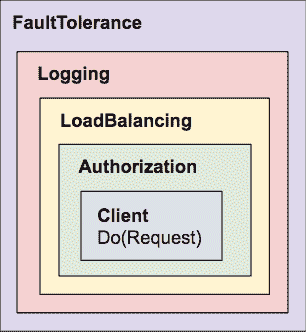
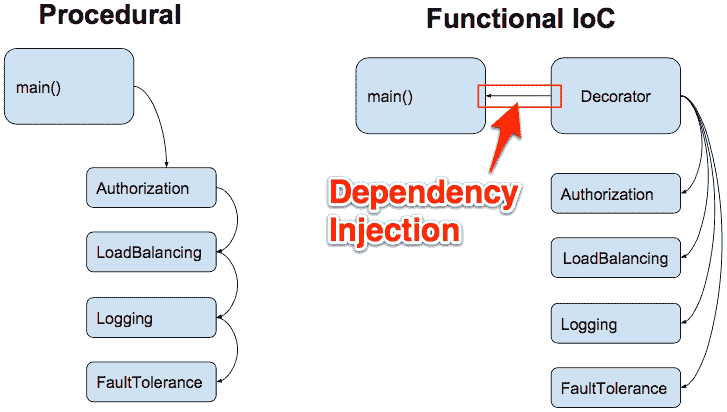
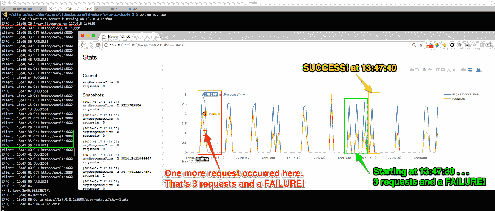

# 五、使用装饰器添加功能

在本章中，我们将继续讨论这句话：*如果您喜欢设计模式，请使用 Java，而不是 Go*。我们将在装饰器和策略模式的帮助下实现这一点。

本章的目标是了解：

*   Go 的读写器接口
*   为什么使用接口组合设计优于类型层次结构设计
*   如何使用 Decorator 模式进行设计和实现
*   通过实施 IoC 框架实现控制反转（IoC）
*   如何使用代理设置请求超时
*   负载平衡请求时如何应用策略模式
*   如何理解简易度量图
*   如何使用标准库接口实现简单而有效的记录器
*   如何使用依赖项注入通过日志记录来丰富 HTTP 请求
*   如何使用通道控制并发程序中的事件流
*   扩展应用程序功能的更好方法

## 界面组成

就像一个作家从一组章节中撰写一本书或从一组章节中撰写一章一样，作为 Go 程序员，我们可以使用函数组合来编写我们的软件应用程序。


我们可以采用功能组合方法来设计软件解决方案，使我们能够从一组较小的 API 中设计复杂的 API。

例如，在上一章的 Viva La Duck 示例中，我们用两个较小的接口组成了`SurvivalBehaviors`接口：

```go
type SurvivalBehaviors interface {
       StrokeBehavior
       EatBehavior
}
```

没有什么是困难的。复杂的事物只是建立在更小、更简单的事物之上！当我们从这个角度处理所有软件设计问题时，我们能够更容易地对现实世界建模——我们的应用程序变得更容易阅读和推理。

### Go 免费的读写器界面

为了帮助我们理解 Go 如何鼓励合成，让我们看看 Go 的免费`Reader`和`Writer`界面：

```go
type Reader interface {
       Read(p []byte) (n int, err error)
}

type Writer interface {
       Write(p []byte) (n int, err error)
}
```

我们可以从这些接口声明中观察到什么？简单

它们都有一个方法，该方法接受单个参数并返回单个结果（以及必需的错误值）。

这给我们买了什么？首先，我们可以通过简单地添加更简单的接口来组合广泛的接口。

#### 读写器接口的示例用法

Go 标准库中的`Hash`接口由`io.Writer`接口和其他四个接口组成。因此，`Hash`可以在任何需要`io.Writer`接口的地方使用：

```go
type Hash interface {
       io.Writer
       Sum(b []byte) []byte
       Reset()
       Size() int
       BlockSize() int
}
```

##### 鸭型设计

如前一章所述，这称为 Duck 类型。这是一个强大的设计模式。事物不是由其类型层次结构定义的，而是由其行为定义的。

下面是来自`github.com/couchbase/moss`包的`File`接口示例：

```go
// The File interface is implemented by os.File. App specific
// implementations may add concurrency, caching, stats, fuzzing, etc.
type File interface {
       io.ReaderAt
       io.WriterAt
       io.Closer
       Stat() (os.FileInfo, error)
       Sync() error
       Truncate(size int64) error
}
```

下面是 Go`mime/multipart`项目的另一个例子：

```go
// File is an interface to access the file part of a multipart message.
// Its contents may be either stored in memory or on disk.
type File interface {
       io.Reader
       io.ReaderAt
       io.Seeker
       io.Closer
}
```

当使用接口进行组合时，请尽可能简单。类似地，函数签名应该设计为只接受完成任务所需的最小接口。

注意单一责任原则和开放/关闭原则在实际中的应用：我们的软件应该开放以进行扩展，但关闭以进行修改。

#### 使用接口进行设计的更多理由

似乎这还不足以作为使用接口进行设计的理由。

我们还可以访问过多的功能。例如，与读者和作者合作时，我们可以免费获得以下内容：

| **免费功能** | **说明** |
| `io.Copy` | 

```go
// Copy copies from src to dst until either EOF is reached
// on src or an error occurs. It returns the number of bytes
// copied and the first error encountered while copying, if any.
func Copy(dst Writer, src Reader) (written int64, err error) {
    return copyBuffer(dst, src, nil)
}
```

 |
| `io.LimitReader` | 

```go
// A LimitedReader reads from R but limits the amount of
// data returned to just N bytes. Each call to Read
// updates N to reflect the new amount remaining.
// Read returns EOF when N <= 0 or when the underlying R returns EOF.
type LimitedReader struct {
   R Reader // underlying reader
   N int64 // max bytes remaining
}
```

 |
| `io.MultiReader` | 

```go
// MultiReader returns a Reader that's the logical concatenation of
// the provided input readers. They're read sequentially. Once all
// inputs have returned EOF, Read will return EOF. If any of the readers
// return a non-nil, non-EOF error, Read will return that error.
func MultiReader(readers ...Reader) Reader {
     r := make([]Reader, len(readers))
     copy(r, readers)
  return &multiReader{r}
 }
```

 |
| `io.RuneReader` | 

```go
// ReadRune reads a single UTF-8 encoded Unicode character
// and returns the rune and its size in bytes. If no character is
// available, err will be set.
type RuneReader interface {
     ReadRune() (r rune, size int, err error) }
```

 |
| `io.ReadSeeker` | 

```go
// WriteSeeker is the interface that groups the basic Write and Seek methods.
type WriteSeeker interface {
     Writer
     Seeker
 }
```

 |
| `io.MultiWriter` | 

```go
// MultiWriter creates a writer that duplicates its writes to all the
// provided writers, similar to the Unix tee(1) command.
func MultiWriter(writers ...Writer) Writer {
     w := make([]Writer, len(writers))
     copy(w, writers)
  return &multiWriter{w}
 }
```

 |
| `bufio.ScanBytes` | `ScanBytes`是扫描仪的拆分函数，它将每个字节作为标记返回。 |
| `bufio.ScanLines` | `ScanLines`是扫描器的拆分功能，它返回每行文本，去掉任何行尾标记。返回的行可能为空。行尾标记是一个可选的回车符，后跟一个强制换行符。在正则表达式表示法中，它是`\r?\n`。
即使没有换行符，也会返回输入的最后一个非空行。 |
| `bufio.ScanRunes` | `ScanRunes`是扫描器的拆分函数，它将每个 UTF-8 编码的符文作为令牌返回。返回的符文序列相当于作为字符串的输入上的范围循环序列，这意味着错误的 UTF-8 编码转换为`U+FFFD = "\xef\xbf\xbd"`。
由于`Scan`接口，客户端无法区分正确编码的替换符文和编码错误。 |
| `ioutil.ReadDir` | `ReadDir`读取由`dirname`命名的目录，并返回按文件名排序的目录项列表。 |
| `ioutil.ReadFile` | `addKeyFromFileToConfigMap`向`ConfigMap`添加一个具有给定名称的密钥，用给定文件路径的内容填充该值；或者，它返回一个错误。 |

这是很多开箱即用的功能，我们不需要测试和编码。重用 Go 标准库接口和函数几乎总是一件好事！

### 使用读写器接口

让我们来练习我们所学到的关于`io.Reader`和`io.Writer`接口的知识：

```go
package main

import (
       "io"
 "strings"
 "os"
)

type titlizeReader struct {
       src io.Reader
}

func NewTitlizeReader(source io.Reader) *titlizeReader {
       return &titlizeReader{source}
}
```

回想一下，`Reader`界面如下所示：

```go
type Reader interface {
       Read(p []byte) (n int, err error)
}
```

当我们实现`Read`方法时，我们的`titlizeReader`结构现在满足`Reader`接口：

```go
func (t *titlizeReader) Read(p []byte) (int, error) {
       count, err := t.src.Read(p)
       if err != nil {
              return count, err
       }
       for i := 0; i < len(p); i++ {
              if i == 0 {
                     if (p[i] >= 't' && p[i] <= 'z') {
                            p[i] = p[i] - 32
 }
              } else {
                     if (p[i] >= 'A' && p[i] <= 'Z') {
                            p[i] = p[i] + 32
 }
              }
       }
       return count, io.EOF
}
```

我们的`titlizeReader`类型将把句子中的第一个单词大写，并将后面的所有字母改为小写。当我们遍历每个字节时，我们检查其 ASCII 值。`A`的 ASCII 值为`97`。`a`的小数点为`65`。97 减去 65 等于 32。

这里我们使用字符串的`NewReader`方法从字符串中创建`io.Reader`接口，即`"this IS a tEsT"`：

```go
func main() {
       var r io.Reader
       r = strings.NewReader("this IS a tEsT")
       r = io.LimitReader(r, 12)
       r = NewTitlizeReader(r)
```

我们在每行上分别指定了读卡器值。我们可以在一行中执行此操作：

```go
r := NewTitlizeReader(io.LimitReader(strings.NewReader("this IS a tEsT", 12))
```

我们使用三个阅读器：一个来自 strings 包，另一个用于将字符串截断为 12 个字符的免费阅读器，还有一个是我们自己编写的。

鉴于我们已将逻辑分离为单独的函数调用，Go 的并发结构使我们能够独立处理它们以提高性能：

```go
        var w io.Writer
       w = os.Stdout
       io.Copy(w, r)
}
```

我们使用`os.Stdout`编写器将结果输出到标准输出（我们的终端控制台）。

因为我们使用的是读写器接口，所以我们可以免费使用`io.Copy`接口。

通过`Readers`和`Writers`接口，我们可以逐段处理流。诚然，我们的示例只使用了一个 14 个字符的字符串，但我们可以同时处理比 RAM 中更多的数据。

**Gang of Four** (**GOF**) refers to four authors who wrote the *Design Patterns: Elements of Reusable Object-Oriented Software* ([https://en.wikipedia.org/wiki/Design_Patterns](https://en.wikipedia.org/wiki/Design_Patterns)) book. Though the examples in the book are in SmallTalk and C++, the book is frequently referenced by many resourceful developers as they build object-oriented software. Languages such as Java, which supports inheritance, can greatly benefit from all the patterns in the GOF book. Not all patterns are equally important for Go. Though, as we saw in the previous chapter, we can definitely benefit from the structural Decorator pattern and the behavioral Strategy pattern.

## 装饰者模式

尽管在不了解 GOF 设计模式的情况下编写高质量的 Go 代码比编写高质量的 Java 代码更容易，但这并不意味着我们作为 Go 开发人员不能从 GOF 的洞察中获益。

我们将很快看到如何在 Go 中很好地使用装饰图案。

### 类型层次 UML

这是我们在使用面向对象语言的那一天设计装饰器模式时可能创建的类型层次 UML：


这是使用 Go 表示相同装饰图案所需的设计工作：



“越少越好”

-罗布派克

### 程序设计与功能控制反转（IoC）的比较

客户请求由`Authorization`、`LoadBalancing`、`Logging`和`FaultTolerance`装饰器包装。当执行客户机请求时，这些 Decorator 中的功能将由我们的 Decorator 框架注入流中，如下图所示：



在程序编程中，`main()`函数将控制逻辑流。代码将是单片的，并且紧密耦合。例如，为了实现`Authorization`，程序员将在执行请求之前在某处插入以下行：

```go
request.Header.Add("Authorization", token)
```

`FaultTolerance`和`LoadBalancing`的逻辑很可能看起来像意大利面条代码。

通过对 Decorator 函数进行编程，我们遵循以下客户机界面：

```go
type Client interface {
       Do(*http.Request) (*http.Response, error)
}
```

每个装饰器都是一个单独的特定于功能的组件。

#### 程序设计示例

程序编程就像在终端中与 Bash 脚本交互一样：

```go
Pick a Product Type:
(1) Appliance
(2) Book
(3) Clothing
3

Pick a Clothing Type:
(1) Men
(2) Women
(3) Children
2
```

在程序设计中，用户交互本质上是预定义的和顺序的。

#### 功能性 IoC 示例

将基于文本的 Bash 脚本示例与用户控制的 web 应用程序进行对比：


在 GUI 应用程序中，控件是反向的。与程序强制下一次用户交互不同，用户主要控制接下来发生的事情。IoC 容器是一个 web 应用程序框架，它运行事件循环，并在用户单击控件（如下拉列表中的项目或提交按钮）时处理回调。

对于一些 J2EE 应用程序，IoC 还可以以 XML 配置文件的形式出现，这些文件被注入到 Spring 框架中。

在一个产品购物示例中，依赖项是诸如选择产品或输入发货地址之类的内容。在我们的 decorator 实现中，依赖项包括`Authorization`、`LoadBalancing`等，每个依赖项都修饰请求。我们的 IoC 容器是 decorator 框架，类似于`Authorization`和`LoadBalancing`的函数在其中实现客户机接口。

## 装饰器实现

我们的 decorator 模式示例将是可运行的，因此我们将把它放在`main`包中，并定义一个`main()`函数。

我们使用 easy metrics 软件包记录和显示我们的指标。它提供了一个用于显示统计数据的漂亮 GUI。

我们还导入带有点（.）的 decorator 包和序言，以便在本地文件块中访问 decorator 包中的标识符，而不使用限定符。

### main.go 文件

我们来看看`main.go`的内容：

```go
package main

import (
   "crypto/tls"
 "flag"
 "fmt"
 "io/ioutil"
 "log"
 "net/http"
 "net/url"
 "os"
 "os/signal"
 "time"
 "easy_metrics"
 . "decorator"
)

const (
   host = "127.0.0.1"
 protocol = "http://"
)
var (
   serverUrl string
   proxyUrl string
)
```

这就是导入在使用 init 脚本及其别名（和 glide）之前的样子：

`import (`
`. . .`
`"time"`
`"github.com/l3x/fp-in-go/chapter5/02_decorator/easy_metrics"`
`. "github.com/l3x/fp-in-go/chapter5/02_decorator"`
`)`

我从不喜欢导入中的长存储库路径。我想是时候给这种技术起个名字了。我们叫它**保持简单愚蠢的滑翔**（**亲吻滑翔**。

我们将主机定义为常量，因为我们将始终在本地工作站上运行此示例代码。我们将保持简单，并使用 HTTP 协议（无 SSL）。

我们的示例使用代理服务器，还使用 Go 的标准库 HTTP 服务器实现来侦听处理请求：


任何名为`init()`的函数将在`main()`函数之前执行。我们为两台服务器定义默认端口号，并允许用户在运行时使用`flag`包指定不同的端口，该包实现命令行标志解析：

```go
func init() {
       serverPort := 3000
 proxyPort := 8080
 flag.IntVar(&serverPort, "serverPort", serverPort, "Server Port")
       flag.IntVar(&proxyPort, "proxyPort", proxyPort, "Server Port")
       flag.Parse()
       serverUrl = fmt.Sprintf("%s:%d", host, serverPort)
       proxyUrl = fmt.Sprintf("%s:%d", host, proxyPort)
}

Simple Logger
```

我们将实现一个简单的记录器，它将：

*   提供日志文件跟踪
*   提供`Debug`、`Info`和`Error`日志级别
*   请允许我们指定所需的日志级别
*   使我们能够更轻松地交换底层日志框架

### decorator/simple_log.go 文件

我们的记录器利用 Go 的`Logger`包，如下所示：

```go
package decorator

import (
       "io"
 "log"
 "os"
)

var (
       Debug   *log.Logger
       Info    *log.Logger
       Error   *log.Logger
       InfoHandler io.Writer
)
```

一个简单的记录器导出一个函数，即`InitLog`，调用包使用该函数来启用日志功能：

```go
func InitLog(
       traceFileName string,
       debugHandler io.Writer,
       infoHandler io.Writer,
       errorHandler io.Writer,
) {
```

#### InitLog 调用示例

这里我们传递跟踪文件的名称，称为`trace-log.txt`，它将接收所有日志输出。我们不需要`Debug`信息，但我们需要信息和错误输出：

```go
InitLog("trace-log.txt", ioutil.Discard, os.Stdout, os.Stderr)
```

这一次，我们传递了 nil 作为跟踪日志文件的名称，它告诉我们的记录器不要创建跟踪日志文件。我们确实希望在我们的终端控制台中将`Debug`、`Info`和`Error`数据显示为标准输出。

```go
InitLog(nil, os.Stdout, os.Stdout, os.Stderr)
```

当我们指定`traceFileName`时，我们需要创建一个`io.MultiWriter`接口，将输出同时发送到两个地方：

```go
if len(traceFileName) > 0 {
      _ = os.Remove(traceFileName)
      file, err := os.OpenFile(traceFileName,
      os.O_CREATE|os.O_APPEND|os.O_WRONLY, 0666)
      if err != nil {
             log.Fatalf("Failed to create log file: %s", traceFileName)
      }
      debugHandler = io.MultiWriter(file, debugHandler)
      infoHandler = io.MultiWriter(file, infoHandler)
      errorHandler = io.MultiWriter(file, errorHandler)
}

InfoHandler = infoHandler

Debug = log.New(debugHandler, "DEBUG : ",
        log.Ldate|log.Ltime|log.Lshortfile)

Info = log.New(infoHandler, "INFO : ",
       log.Ltime)

Error = log.New(errorHandler, "ERROR : ",
        log.Ldate|log.Ltime|log.Lshortfile)
}
```

我们将在每个日志行前面加上`DEBUG`、`INFO`或`ERROR`以指示其日志级别。

#### 回到我们的主包装

`main`块的第一行调用`InitLog`函数：

```go
func main() {
       InitLog("trace-log.txt", 
              ioutil.Discard, os.Stdout, os.Stderr)
```

我们使用`INFO`级别来指示我们的服务器正在监听哪个。

我们使用 Goroutine 启动服务器，因为这是`main()`函数，所以我们使用`log.Fatal`方法，这相当于带有恐慌的`println`。这是因为，如果我们无法在此时启动服务器，那么就没有要刷新的缓冲区，没有未完成的延迟语句，也没有要处理的临时文件。我们还要等待一秒钟，以便让服务器有时间启动：

```go
Info.Printf("Metrics server listening on %s", serverUrl)
go func() {
       log.Fatal(easy_metrics.Serve(serverUrl))
}()
time.Sleep(1 * time.Second)
```

接下来，我们使用`req`声明我们的请求，稍后我们将执行`NumRequests`次：

```go
req, err := http.NewRequest(http.MethodGet, protocol + serverUrl, nil)
if err != nil {
       log.Fatalln(err)
}
```

在我们的示例中，我们使用代理服务器来传递所有请求。这使我们能够灵活地在每次调用的基础上处理代理级别的处理。我们的简单示例没有这样的处理，但我们确实指定了 1 秒的代理超时：

```go
Info.Printf("Proxy listening on %s", proxyUrl)
proxyURL, _ := url.Parse(proxyUrl)
tr := &http.Transport{
       Proxy: http.ProxyURL(proxyURL),
       TLSClientConfig: &tls.Config{
              InsecureSkipVerify: true,
       },
}
```

我们的客户使用装饰图案将我们的`proxyTimeoutClient`客户包装为`Authorization`、`LoadBalancing`、`Logging`和`FaultTolerance`功能：

```go
tr.TLSNextProto = make(map[string]func(string, *tls.Conn) http.RoundTripper)
proxyTimeoutClient := &http.Client{Transport: tr, Timeout: 1 * time.Second}
```

我们不修改客户机实现，而是扩展其功能（还记得打开/关闭原则吗？）：

```go
client := Decorate(proxyTimeoutClient,
       Authorization("mysecretpassword"),
       LoadBalancing(RoundRobin(0, "web01:3000", "web02:3000", "web03:3000")),
       Logging(log.New(InfoHandler, "client: ", log.Ltime)),
       FaultTolerance(2, time.Second),
)
```

这是一种声明式编程形式。没有仪式。我们链接函数调用，只传递配置其行为所需的最少信息。

要使负载平衡在本地工作，您可以在`/etc/hosts`文件中添加以下行：

```go
127.0.0.1 localhost web01 web02 web03
```

接下来，我们定义我们的工作。我们传递客户机、请求、要处理的请求数以及处理每个请求前的等待时间：

```go
job := &Job{
       Client:       client,
       Request:      req,
       NumRequests:  10,
       IntervalSecs: 10,
}
```

为了更好地理解统计数据，稍后在 easy metrics web 应用程序中，我们将`IntervalSecs`值设置为 10。10 次请求处理尝试之间的间隔时间为 10 秒。

我们通过`job.Run()`设置开始时间并开始作业处理。`Run`函数使用`sync`包等待所有正在运行的作业完成后再返回控件，此时我们打印出请求处理位花费的时间：

```go
start := time.Now()
job.Run()
Info.Printf("\n>> It took %s", time.Since(start))
```

处理完成后，我们从`easy_metrics`包调用`DisplayResults`，该包显示如下消息：

```go
INFO  : 12:48:30 Go to http://127.0.0.1:3000/easy-metrics?show=Stats
```

```go
Info.Printf("metrics")
err = easy_metrics.DisplayResults(serverUrl)
if err != nil {
       log.Fatalln(err)
}
```

我们的服务器需要保持运行，以便我们可以访问 easy metrics URL，使用用户友好的 easy metrics web 应用程序查看我们的统计数据。

我们创建一个通道来捕获*Ctrl*+*C*键序列，它将向我们的程序发出停止的信号：

```go
        Info.Printf("CTRL+C to exit")
       c := make(chan os.Signal, 1)
       signal.Notify(c, os.Interrupt)
       <-c
}
```

#### 使用 easy metrics GUI 了解我们的统计数据

接下来的几个屏幕截图将在执行 Go 的`main.go`命令后立即在`http://127.0.0.1:3000/easy-metrics?show=Stats`处显示我们的终端控制台和 web 浏览器：



在下面的部分中，我们将把这个图像分成三部分。

##### 快速查看 Dot Init 更新

这是使用 KISS Glide 工具集时我们的终端的外观：


KISS Glide 使它更简单，并且需要更少的键入才能达到相同的结果。这是一个双赢的局面。

当我最初编写本章时，我使用了标准的`go get`、`go build`和`go run main.go`命令。随着项目变得越来越复杂（需要更多的第三方依赖），我发现创建 KISS Glide 工具很有帮助。后来，我回到所有的项目，并使用 KISS Glide 工具简化了它们。您可以随意使用任何依赖关系管理工具，并根据自己的喜好构建和运行 Go 应用程序。这是 Go 最棒的地方之一。只要工具制造商遵守标准的 Go 惯例，比如使用`GOPATH`，而不破坏其他 Go 工具，比如`go test`、`go doc`、`go vet`，一切都好。我更喜欢简单而有力的（亲吻滑翔）。

##### 简易指标-第 1 项，共 3 项

与 easy metrics GUI 相比，第一个屏幕截图更多的是关于我们在终端控制台中看到的内容：


前两行输出来自我们的`main.go`文件。接下来的三行来自这个装饰师：`Logging(log.New(InfoHandler, "client: ", log.Ltime)),`。

每行前面都有`INFO`或客户。`client`行表示单个请求尝试。`INFO`**行表示初始请求（可能尝试了两次）是成功还是失败。**

 **### decorator/decorator.go 文件

让我们看看我们的`decorator.go`实现。在`02_decorator`目录下，包名为`decorator`：

```go
package decorator

import (
       "log"
 "net/http"
 "sync/atomic"
 "time"
)

type Client interface {
       Do(*http.Request) (*http.Response, error)
}

// ClientFunc is a function type that implements the client interface.
type ClientFunc func(*http.Request) (*http.Response, error)

func (f ClientFunc) Do(r *http.Request) (*http.Response, error) {
       return f(r)
}
```

`ClientFunc`函数是实现`Client`接口的函数类型。

我们还定义了两个额外的方法，它们充当`ratelimitDuration`值的 getter 和 setter：

```go
var ratelimitDuration time.Duration

func (f ClientFunc) SetRatelimit(duration time.Duration) (error) {
       ratelimitDuration = duration
       return nil
}

func (f ClientFunc) GetRatelimit() (time.Duration, error) {
       return ratelimitDuration, nil
}
```

接下来，我们定义`Decorator`函数类型，用其他行为包装`Client`：

```go
type Decorator func(Client) Client
```

#### 注入依赖项的框架

接下来，我们将更仔细地研究 IoC 容器框架的实现。

我们将看到，通过围绕我们的核心客户机调用包装实现`Client`接口的 decorators 并使用 decorator 模式，我们的框架能够以模块化和易于理解的方式扩展我们的应用程序功能。

`Decorator`符号表示这是一个可变参数，可以取任意数量的值。还记得我们在`main`拜访我们的装饰师吗？

##### 使用 decorators 包装客户机请求（在 main 中）

```go
client := Decorate(proxyTimeoutClient,
       Authorization("mysecretpassword"),
       LoadBalancing(RoundRobin(0, "web01:3000", "web02:3000", "web03:3000")),
       Logging(log.New(InfoHandler, "client: ", log.Ltime)),
       FaultTolerance(2, time.Second),
)
```

我们的`Decorate`函数通过依次迭代每个装饰器来扩展客户机的功能。

请注意，有几种方法可以实现此包装功能。我们可以像本章前面所做的那样使用递归、逐行换行或内联换行：

```go
r := NewTitlizeReader(io.LimitReader(strings.NewReader("this IS a tEsT", 12))
```

当我们不确定需要包装的装饰器数量时，将可变参数与范围构造结合使用可能是最佳选择：

```go
func Decorate(c Client, ds ...Decorator) Client {
       decorated := c
       for _, decorate := range ds {
              decorated = decorate(decorated)
       }
       return decorated
}
```

#### 授权装饰器

我们的第一个装饰师是`Authorization`。我们调用`Header`helper 函数，该函数在运行时向每个请求添加带有给定令牌的`Authorization`头：

```go
func Authorization(token string) Decorator {
       return Header("Authorization", token)
}

func Header(name, value string) Decorator {
       return func(c Client) Client {
              return ClientFunc(func(r *http.Request)(*http.Response, error) {
                     r.Header.Add(name, value)
                     return c.Do(r)
              })
       }
}
```
