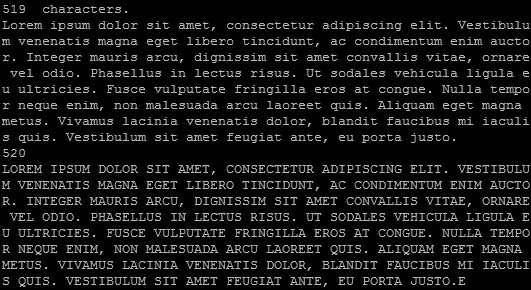

# 一、Go 并发介绍

虽然 Go 是一种优秀的通用和低级系统语言，但它的主要优势之一是内置的并发模型和工具。许多其他语言都有第三方库（或扩展），但内在并发性是现代语言所独有的，它是 Go 设计的核心功能。

尽管毫无疑问，Go 在并发性方面非常出色，我们将在本书中看到，许多其他语言所缺乏的是一套健壮的工具，用于测试和构建并发、并行和分布式代码。

关于 Go 惊人的并发特性和工具的讨论已经够多了，让我们开始吧。

# 引入 goroutines

处理并发的主要方法是通过 goroutine。诚然，我们的第一段并发代码（在前言中提到）没有完成很多工作，只是在整个任务完成之前交替地发出“hello”和“world”。

下面是代码：

```go
package main

import (
  "fmt"
  "time"
)

type Job struct {
  i int
  max int
  text string
}

func outputText(j *Job) {
  for j.i < j.max {
    time.Sleep(1 * time.Millisecond)
    fmt.Println(j.text)
    j.i++
  }
}

func main() {
  hello := new(Job)
  world := new(Job)

  hello.text = "hello"
  hello.i = 0
  hello.max = 3

  world.text = "world"
  world.i = 0
  world.max = 5

  go outputText(hello)
  outputText(world)

}
```

### 提示

**下载示例代码**

您可以下载您在[账户购买的所有 Packt 书籍的示例代码文件 http://www. packtpub.com](http://www.%20packtpub.com)。如果您在其他地方购买了本书，您可以访问[http://www.packtpub.com/support](http://www.packtpub.com/support) 并注册，将文件直接通过电子邮件发送给您。

但是，如果你回想一下我们为你的祖母计划一个惊喜派对的真实例子，这正是通常必须用有限或有限的资源来管理事情的方式。这种异步行为对于某些应用的平稳运行至关重要，尽管我们的示例基本上是在真空中运行的。

您可能已经注意到我们早期示例中的一个怪癖：尽管我们首先调用了`hello`结构上的`outputText()`函数，但我们的输出是从`world`结构的文本值开始的。为什么呢？

由于是异步的，当调用 goroutine 时，它会在并发开始之前等待阻塞代码完成。您可以通过用 goroutine 替换`world`结构上的`outputText()`函数调用来测试这一点，如下代码所示：

```go
  go outputText(hello)
  go outputText(world)
```

如果运行此命令，将不会得到任何输出，因为主函数在异步 goroutine 运行时结束。有两种方法可以停止此操作，以便在主函数完成执行和程序退出之前查看输出。经典方法只是在执行前请求用户输入，允许您直接控制应用何时完成。您还可以在主函数的末尾放置一个无限循环，如下所示：

```go
for {}
```

更好的是，Go 还有一个内置的机制，即`sync`包中的`WaitGroup`类型。

如果在代码中添加`WaitGroup`结构，它可能会延迟主函数的执行，直到所有 goroutine 完成。简单地说，它允许您设置所需的迭代次数，以便在允许应用继续之前从 goroutines 获得完整的响应。下面让我们看一下对“Hello World”应用的一个小修改。

## 一个病人，戈罗廷

从这里开始，我们将实现一个`WaitGroup`结构，以确保我们的 goroutines 在继续我们的应用之前完全运行。在这个案例中，当我们说 patient 时，它与我们在前面的示例中看到的 goroutine 在父方法之外运行的方式形成了对比。在下面的代码中，我们将实现我们的第一个`Waitgroup`结构：

```go
package main

import (
  "fmt"
  "sync"
  "time"
)

type Job struct {
  i int
  max int
  text string
}

func outputText(j *Job, goGroup *sync.WaitGroup) {
  for j.i < j.max {
    time.Sleep(1 * time.Millisecond)
    fmt.Println(j.text)
    j.i++
  }
  goGroup.Done()
}

func main() {

  goGroup := new(sync.WaitGroup)
  fmt.Println("Starting")

  hello := new(Job)
  hello.text = "hello"
  hello.i = 0
  hello.max = 2

  world := new(Job)
  world.text = "world"
  world.i = 0
  world.max = 2

  go outputText(hello, goGroup)
  go outputText(world, goGroup)

  goGroup.Add(2)
  goGroup.Wait()

}
```

让我们看一下以下代码中的更改：

```go
  goGroup := new(sync.WaitGroup)
```

在这里，我们声明了一个名为`goGroup`的`WaitGroup`结构。此变量将收到通知，我们的 goroutine 函数在允许程序退出之前已完成*x*次。以下是在`WaitGroup`中发送此类期望的示例：

```go
  goGroup.Add(2)
```

`Add()`方法指定在满足等待之前`Done`消息`goGroup`应该接收多少条。在这里，我们指定了`2`，因为我们有两个异步运行的函数。如果您有三个 goroutine 成员，但仍然调用了两个，那么您可能会看到第三个 goroutine 成员的输出。如果您向`goGroup`添加了一个大于 2 的值，例如`goGroup.Add(3)`，则`WaitGroup`将永远等待并死锁。

记住这一点，您不应该手动设置需要等待的 goroutine 的数量；这是理想的处理计算或显式在一个范围内。这就是我们告诉`WaitGroup`等待的方式：

```go
  goGroup.Wait()
```

现在，我们等待。此代码将因同样的原因失败`goGroup.Add(3)`失败；`goGroup`结构从未收到我们的 goroutine 已完成的消息。因此，让我们按照以下代码段所示执行此操作：

```go
func outputText(j *Job, goGroup *sync.WaitGroup) {
  for j.i < j.max {
    time.Sleep(1 * time.Millisecond)
    fmt.Println(j.text)
    j.i++
  }
  goGroup.Done()
}
```

在前言中，我们对`outputText()`函数只做了两处更改。首先，我们添加了一个指向`goGroup`的指针作为第二个函数参数。然后，当我们所有的迭代都完成时，我们告诉`goGroup`它们都完成了。

# 执行延迟控制机制

当我们在这里的时候，我们应该花点时间谈谈延迟。Go 具有延迟控制机制的优雅实现。如果您在其他语言中使用过 defer（或功能类似的东西），这似乎很熟悉，它是一种将语句的执行延迟到函数的其余部分完成的有用方法。

在大多数情况下，这是一种语法糖，允许您一起查看相关操作，即使它们不会一起执行。如果您曾经编写过类似于以下伪代码的代码，您就会明白我的意思：

```go
x = file.open('test.txt')
int longFunction() {
…
}
x.close();
```

您可能知道分离相关代码位的大“距离”会带来什么样的痛苦。在 Go 中，您实际上可以编写类似于以下内容的代码：

```go
package main

import(
"os"
)

func main() {

  file, _ := os.Create("/defer.txt")

  defer file.Close()

  for {

    break

  }

}
```

除了生成更清晰、更可读的代码之外，这没有任何实际的功能优势，但这本身就是一个很大的优势。延迟调用的执行顺序与它们的定义顺序相反，或者是后进先出。您还应该注意，通过引用传递的任何数据都可能处于意外状态。

例如，请参阅以下代码段：

```go
func main() {

  aValue := new(int)

  defer fmt.Println(*aValue)

  for i := 0; i < 100; i++ {
    *aValue++
  }

}
```

这将返回`0`，而不是`100`，因为它是整数的默认值。

### 注

*延期*与其他语言中的*延期*（或期货/承诺）不同。我们将在[第 2 章](02.html#page "Chapter 2. Understanding the Concurrency Model")*理解并发模型*中讨论 Go 的实现以及未来和承诺的替代方案。

## 使用 Go 的调度程序

在其他语言中有大量的并发和并行应用，软线程和硬线程的管理都是在操作系统级别处理的。由于操作系统负责在多个进程之间进行上下文切换，因此这是一种固有的低效和昂贵的方法。当应用或进程可以管理自己的线程和调度时，运行速度会更快。授予我们的应用和 Go 的调度程序的线程具有较少的 OS 属性，这些属性需要在切换上下文中考虑，从而减少了开销。

如果你想一想，这是不言而喻的，你必须玩的越多，管理所有球的速度就越慢。Go 通过使用自己的调度程序消除了这种机制的自然低效性。

这实际上只有一个怪癖，一个你会很早就学会的怪癖：如果你不向主线程屈服，你的 goroutine 将以意想不到的方式执行（或者根本不会执行）。

看待这一点的另一种方式是，在并发有效并可以开始之前，必须阻止 goroutine。让我们修改我们的示例并包含一些要记录的文件 I/O，以演示此怪癖，如以下代码所示：

```go
package main

import (
  "fmt"
  "time"
  "io/ioutil"
)

type Job struct {
  i int
  max int
  text string
}

func outputText(j *Job) {
  fileName := j.text + ".txt"
  fileContents := ""
  for j.i < j.max {
    time.Sleep(1 * time.Millisecond)
    fileContents += j.text
    fmt.Println(j.text)
    j.i++
  }
  err := ioutil.WriteFile(fileName, []byte(fileContents), 0644)
  if (err != nil) {
    panic("Something went awry")
  }

}

func main() {

  hello := new(Job)
  hello.text = "hello"
  hello.i = 0
  hello.max = 3

  world := new(Job)
  world.text = "world"
  world.i = 0
  world.max = 5

  go outputText(hello)
  go outputText(world)

}
```

理论上，所有的改变是我们现在使用一个文件操作将每个操作记录到一个不同的文件中（在本例中为`hello.txt`和`world.txt`）。但是，如果运行此操作，则不会创建任何文件。

在我们的最后一个示例中，我们使用`sync.WaitSync`结构强制主线程延迟执行，直到异步任务完成。虽然这是可行的（而且很优雅），但它并不能真正解释异步任务失败的原因。如前所述，您还可以利用阻塞代码来防止主线程在其异步任务之前完成。

由于 Go 调度器管理上下文切换，因此每个 goroutine 必须将控制权交还给主线程，以调度所有这些异步任务。手动执行此操作有两种方法。一种可能是理想的方法是`WaitGroup`结构。另一个是运行时包中的`GoSched()`函数。

`GoSched()`函数暂时产生处理器，然后返回当前 goroutine。考虑下面的代码作为一个例子：

```go
package main

import(
  "runtime"
  "fmt"
)

func showNumber(num int) {
  fmt.Println(num)
}

func main() {
  iterations := 10

  for i := 0; i<=iterations; i++ {

    go showNumber(i)

  }
  //runtime.Gosched()
  fmt.Println("Goodbye!")

}
```

运行此命令时，注释掉`runtime.Gosched()`并删除`"runtime"`之前的下划线，您将只看到`Goodbye!`。这是因为无法保证在`main()`函数结束之前会完成多少个 goroutine（如果有的话）。

正如前面我们所了解到的，在结束应用的执行之前，您可以显式地等待有限数量的 goroutine。然而，`Gosched()`允许（在大多数情况下）相同的基本功能。删除`runtime.Gosched()`之前的注释，您应该在`Goodbye!`之前打印 0 到 10。

为了好玩，请尝试在多核服务器上运行此代码，并使用`runtime.GOMAXPROCS()`修改 max 处理器，如下所示：

```go
func main() {

  runtime.GOMAXPROCS(2)
```

同时，将你的`runtime.Gosched()`推到绝对终点，这样所有的 goroutine 都有机会在`main`结束前跑步。

有什么意想不到的事吗？这并不意外！您可能会在执行 goroutines 时遇到完全冲突，如以下屏幕截图所示：


虽然没有必要完全演示如何使用多个内核处理 goroutines，但这是最简单的方法之一，可以确切地说明它们（和 Go 调度程序）之间通信的重要性。

您可以使用`GOMAXPROCS > 1`来调试此操作的并行性，使用时间戳显示来封装 goroutine 调用，如下所示：

```go
  tstamp := strconv.FormatInt(time.Now().UnixNano(), 10)
  fmt.Println(num, tstamp)
```

### 注

记住在这里导入`time`和`strconv`父包。

这也是查看并发性并将其与实际并行性进行比较的好地方。首先，在`showNumber()`函数中添加一秒钟的延迟，如下代码段所示：

```go
func showNumber(num int) {
  tstamp := strconv.FormatInt(time.Now().UnixNano(), 10)
  fmt.Println(num,tstamp)
  time.Sleep(time.Millisecond * 10)
}
```

然后，用`GOMAXPROCS(0)`删除`showNumber()`函数前面的 goroutine 调用，如下代码段所示：

```go
  runtime.GOMAXPROCS(0)
  iterations := 10

  for i := 0; i<=iterations; i++ {
    showNumber(i)
  }
```

正如预期的那样，您将得到 0-10，它们之间有 10 毫秒的延迟，然后以`Goodbye!`作为输出。这是直接的串行计算。

接下来，让我们将单个线程的`GOMAXPROCS`保持为零，但恢复 goroutine 如下：

```go
go showNumber(i)
```

这是与之前相同的过程，除了事实，即所有内容都将在相同的一般时间范围内执行，这表明了执行的并发性。现在，继续，把你的`GOMAXPROCS`换成两个，然后再跑。如前所述，只有一个（或可能两个）时间戳，但顺序已更改，因为所有内容都同时运行。

goroutine（不一定）是基于线程的，但它们感觉像是基于线程的。编译 Go 代码时，goroutine 在可用线程之间进行多路复用。这就是为什么 Go 的调度器需要知道正在运行什么，在应用生命周期结束之前需要完成什么，等等。如果代码有两个线程要处理，那么它将使用这两个线程。

## 使用系统变量

那么如果您想知道您的代码提供了多少线程，该怎么办？

Go 有一个从运行时包函数`GOMAXPROCS`返回的环境变量。要了解可用的内容，您可以编写类似以下代码的快速应用：

```go
package main

import (
  "fmt"
  "runtime"
)

func listThreads() int {

  threads := runtime.GOMAXPROCS(0)
  return threads
}

func main() {
  runtime.GOMAXPROCS(2)
  fmt.Printf("%d thread(s) available to Go.", listThreads())

}
```

在此基础上进行简单的 Go 构建将产生以下输出：

```go
2 thread(s) available to Go.

```

传递给`GOMAXPROCS`的`0`参数（或无参数）表示不做任何更改。您可以在其中输入另一个数字，但正如您可能想象的那样，它只会返回实际可用的数字。您不能超过可用的内核数，但可以限制应用使用的内核数少于可用的内核数。

`GOMAXPROCS()`调用本身返回一个整数，该整数表示*之前的*可用处理器数量。在本例中，我们首先将设置为 2，然后将其设置为零（无变化），返回 2。

另外值得注意的是，增加`GOMAXPROCS`有时会降低应用的性能。

由于在大型应用和操作系统中存在上下文切换惩罚，因此增加使用的线程数意味着 goroutine 可以在多个应用和操作系统之间共享，并且 goroutine 的轻量级优势可能会被牺牲。

如果您有一个多核系统，您可以使用 Go 的内部基准测试功能非常轻松地进行测试。我们将在[第 5 章](05.html#page "Chapter 5. Locks, Blocks, and Better Channels")、*锁、块和更好的通道、*和[第 7 章](07.html#page "Chapter 7. Performance and Scalability")、*性能和可扩展性*中详细介绍此功能。

运行时包还有一些其他非常有用的环境变量返回函数，如`NumCPU`、`NumGoroutine`、`CPUProfile`和`BlockProfile`。这些工具不仅便于调试，而且知道如何最好地利用您的资源也很有用。这个包还可以与 reflect 包配合使用，reflect 包处理元编程和程序自分析。稍后我们将在[第 9 章](09.html#page "Chapter 9. Logging and Testing Concurrency in Go")、*在 Go*中记录和测试并发，以及[第 10 章](10.html#page "Chapter 10. Advanced Concurrency and Best Practices")、*高级并发和最佳实践*中更详细地讨论这一点。

# 理解 goroutines 与 corroutines

在这一点上，你可能会想，“啊，goroutines，我知道这些是 coroutines。”。

协同路由是一种协作任务控制机制，但从最简单的意义上讲，协同路由不是并发的。虽然协同路由和 goroutine 的使用方式相似，但 Go 对并发性的关注远远不止于状态控制和收益。在我们迄今为止看到的例子中，我们可以称之为*哑*goroutines。虽然它们在相同的时间和地址空间中工作，但两者之间没有真正的通信。如果您查看其他语言中的协程，您可能会发现它们通常不一定是并发的或异步的，而是基于步骤的。它们彼此服从于`main()`和，但两个协同路由不一定彼此通信，依赖于一个集中的、明确编写的数据管理系统。

### 注

**原协同程序**

协同程序是由梅尔文·康威（Melvin Conway）首先为 COBOL 描述的。在他的论文*可分离转换图编译器的设计*中，他提出协同程序的目的是将程序分解成子任务，并允许它们独立运行，只共享少量数据。

Goroutines 有时会违反 Conway 公司的基本原则。例如，康威建议只有一条单向的执行路径；换句话说，A 后面跟着 B，然后是 C，然后是 D，依此类推，其中每一个都表示协同路由中的一个应用块。我们知道 goroutines 可以并行运行，并且可以按照看似任意的顺序执行（至少没有方向）。到目前为止，我们的 goroutines 也没有共享任何信息；它们只是以共享模式执行。

# 实施渠道

到目前为止，我们已经涉足了能够做很多事情但不能有效地相互通信的并发进程。换句话说，如果您有两个进程占用相同的处理时间并共享相同的内存和数据，那么您必须能够知道作为更大任务的一部分，哪个进程位于哪个位置。

例如，一个应用必须循环遍历 Lorem Ipsum 的一段，并将每个字母大写，然后将结果写入文件。当然，我们并不真正需要一个并发应用来实现这一点（事实上，这是几乎所有处理字符串的语言的特有函数），但这是一种快速的方式来展示孤立 goroutine 的潜在局限性。很快，我们将把这个原始示例变成更实际的示例，但现在，这里是我们的资本化示例的开始：

```go
package main

import (
  "fmt"
  "runtime"
  "strings"
)
var loremIpsum string
var finalIpsum string
var letterSentChan chan string

func deliverToFinal(letter string, finalIpsum *string) {
  *finalIpsum += letter
}

func capitalize(current *int, length int, letters []byte, 
  finalIpsum *string) {
  for *current < length {
    thisLetter := strings.ToUpper(string(letters[*current]))

    deliverToFinal(thisLetter, finalIpsum)
    *current++
  }
}

func main() {

  runtime.GOMAXPROCS(2)

  index := new(int)
  *index = 0
  loremIpsum = "Lorem ipsum dolor sit amet, consectetur adipiscing 
  elit. Vestibulum venenatis magna eget libero tincidunt, ac 
  condimentum enim auctor. Integer mauris arcu, dignissim sit amet 
  convallis vitae, ornare vel odio. Phasellus in lectus risus. Ut 
  sodales vehicula ligula eu ultricies. Fusce vulputate fringilla 
  eros at congue. Nulla tempor neque enim, non malesuada arcu 
  laoreet quis. Aliquam eget magna metus. Vivamus lacinia 
  venenatis dolor, blandit faucibus mi iaculis quis. Vestibulum 
  sit amet feugiat ante, eu porta justo."

  letters := []byte(loremIpsum)
  length := len(letters)

  go capitalize(index, length, letters, &finalIpsum)
  go func() {
    go capitalize(index, length, letters, &finalIpsum)
  }()

  fmt.Println(length, " characters.")
  fmt.Println(loremIpsum)
  fmt.Println(*index)
  fmt.Println(finalIpsum)

}
```

如果我们在这里以某种程度的并行性运行这个，但我们的 goroutines 之间没有通信，那么我们将得到一个混乱的文本，如下面的屏幕截图所示：



由于 Go 中并发调度的不可预测性，可能需要多次迭代才能获得精确的输出。事实上，您可能永远也得不到确切的输出。

这显然不行。那么，我们如何最好地构建这个应用呢？这里缺少的是同步，但我们也可以使用更好的设计模式。

这里有另一种方法可以把这个问题分解成几个部分。与其让两个进程并行处理同一件事情（这充满了风险），不如让一个进程从`loremIpsum`字符串中提取一个字母并将其大写，然后将其传递到另一个进程，将其添加到我们的`finalIpsum`字符串中。

你可以想象这是两个人坐在两张桌子旁，每个人都有一堆信件。A 负责将字母大写。然后，他将信传递给 B，B 将信添加到`finalIpsum`堆栈中。为了做到这一点，我们将在应用中的代码中实现一个通道，任务是获取文本（在本例中，是亚伯拉罕·林肯葛底斯堡演讲的第一行）并将每个字母大写。

## 字母大写工厂基于通道的分拣

让我们以最后一个例子为例，通过尝试将亚伯拉罕·林肯的葛底斯堡演讲的序言大写，同时减轻 Go 中并发有时不可预测的影响，做一些（稍微）有目的的事情，如以下代码所示：

```go
package main

import(
  "fmt"
  "sync"
  "runtime"
  "strings"
)

var initialString string
var finalString string

var stringLength int

func addToFinalStack(letterChannel chan string, wg 
  *sync.WaitGroup) {
  letter := <-letterChannel
  finalString += letter
  wg.Done()
}

func capitalize(letterChannel chan string, currentLetter string, 
  wg *sync.WaitGroup) {

  thisLetter := strings.ToUpper(currentLetter)
  wg.Done()
  letterChannel <- thisLetter  
}

func main() {

  runtime.GOMAXPROCS(2)
  var wg sync.WaitGroup

  initialString = "Four score and seven years ago our fathers 
  brought forth on this continent, a new nation, conceived in 
  Liberty, and dedicated to the proposition that all men are 
  created equal."
  initialBytes := []byte(initialString)

  var letterChannel chan string = make(chan string)

  stringLength = len(initialBytes)

  for i := 0; i < stringLength; i++ {
    wg.Add(2)

    go capitalize(letterChannel, string(initialBytes[i]), &wg)
    go addToFinalStack(letterChannel, &wg)

    wg.Wait()
  }

  fmt.Println(finalString)

}
```

您会注意到我们甚至将其升级为双核进程，并最终得到以下输出：

```go
go run alpha-channel.go
FOUR SCORE AND SEVEN YEARS AGO OUR FATHERS BROUGHT FORTH ON THIS 
 CONTINENT, A NEW NATION, CONCEIVED IN LIBERTY, AND DEDICATED TO THE 
 PROPOSITION THAT ALL MEN ARE CREATED EQUAL.

```

输出和我们预期的一样。值得重申的是，这个例子是最极端的，但我们将很快把这个功能应用到一个可用的实际应用中。

那么这里发生了什么？首先，我们重新实现了`sync.WaitGroup`结构，以允许在保持主线程活动的同时执行所有并发代码，如以下代码段所示：

```go
var wg sync.WaitGroup
...
for i := 0; i < stringLength; i++ {
  wg.Add(2)

  go capitalize(letterChannel, string(initialBytes[i]), &wg)
  go addToFinalStack(letterChannel, &wg)

  wg.Wait()
}
```

我们允许每个 goroutine 告诉`WaitGroup`结构我们已经完成了步骤。由于我们有两个 goroutine，我们将两个`Add()`方法排队到`WaitGroup`结构。每个 goroutine 都有责任宣布它完成了。

接下来，我们创建了第一个频道。我们使用以下代码行实例化一个通道：

```go
  var letterChannel chan string = make(chan string)
```

这告诉Go，我们有一个通道，可以向各种过程/goroutine 发送和接收字符串。这实际上是所有 goroutine 的管理者。它还负责向 goroutines 发送和接收数据，并管理执行顺序。正如我们前面提到的，通道在不依赖多线程的情况下通过内部上下文切换进行操作的能力允许它们非常快速地操作。

此功能有一个内置的限制。如果您设计非并发或阻塞代码，您将有效地从 goroutine 中删除并发性。稍后我们将对此进行更多讨论。

我们通过`letterChannel`：`capitalize()`和`addToFinalStack()`运行两个单独的 goroutine。第一个简单地从由字符串构造的字节数组中提取一个字节并将其大写。然后，它将字节返回到通道，如以下代码行所示：

```go
letterChannel <- thisLetter
```

所有跨通道的通信都是以这种方式进行的。`<-`符号从语法上告诉我们，数据将被发送回（或通过）一个通道。不需要对这些数据做任何事情，但要知道的最重要的事情是，通道可以阻塞，至少每个线程阻塞，直到它接收到数据为止。您可以通过创建一个通道，然后对其完全不做任何有价值的操作来测试这一点，如以下代码段所示：

```go
package main

func doNothing()(string) {

  return "nothing"
}

func main() {

  var channel chan string = make(chan string)
  channel <- doNothing()

}
```

由于没有沿通道发送任何内容，也没有实例化 goroutine，因此会导致死锁。您可以通过创建 goroutine 和在`main()`之外创建通道将其引入全局空间来轻松解决此问题。

### 注

为了清楚起见，这里的示例使用本地范围通道。只要有可能，保持这些全局性就可以消除很多麻烦，特别是当您有很多 goroutine 时，因为对通道的引用可能会使您的代码很快变得混乱。

对于我们的整个示例，您可以查看它，如下图所示：


## 清理我们的社交活动

您可能想知道为什么在使用通道时需要`WaitGroup`结构。毕竟，我们不是说过一个通道在收到数据之前会被阻塞吗？这是正确的，但它需要另一种语法。

零或未初始化的通道将始终被阻塞。我们将在[第 7 章](07.html#page "Chapter 7. Performance and Scalability")、*性能和可扩展性*和[第 10 章](10.html#page "Chapter 10. Advanced Concurrency and Best Practices")、*高级并发性和最佳实践*中讨论此方法的潜在用途和缺陷。

您可以通过指定通道缓冲区，根据`make`命令的第二个选项，指定通道如何阻止应用。

### 缓冲或非缓冲通道

默认情况下，通道是无缓冲的，这意味着如果有一个通道准备接收，它们将接受发送给它们的任何内容。这也意味着每个通道调用都会阻止应用的执行。通过提供缓冲区，通道将仅在发送多个返回时阻塞应用。

缓冲通道是同步的。为了保证异步性能，您需要通过提供缓冲区长度进行实验。在下一章中，我们将探讨确保执行力下降的方法。

### 注

Go 的通道系统基于**通信顺序过程**（**CSP**），一种形式语言，用于设计并发模式和多处理。当人们描述 goroutines 和 channels 时，您可能会单独遇到 CSP。

## 使用 select 语句

第一个实现通道的一个问题是，尽管 goroutines 以前是简化和并发执行代码的方法，但现在我们有了一个单一用途的通道，可以跨 goroutines 指定应用逻辑。当然，频道是交通管理器，但它永远不知道什么时候交通会来，什么时候不再来，什么时候回家，除非有人明确告诉。它被动地等待通信，如果从未收到任何消息，可能会导致问题。

Go 有一个选择控制机制，它的工作原理与`switch`语句一样有效，但它是在通道通信上，而不是在变量值上。`switch`语句根据变量的值修改执行，`select`对动作和通过通道的通信做出反应。您可以使用来编排和安排应用的控制流。下面的代码片段是我们传统的`switch`，用户熟悉，在其他语言中也很常见：

```go
switch {

  case 'x':

  case 'y':

}
```

下面的代码片段表示`select`语句：

```go
select {

  case <- channelA:

  case <- channelB:

}
```

在`switch`语句中，右边的表达式表示一个值；在`select`中，它表示信道上的接收操作。`select`语句将阻止应用，直到一些信息沿通道发送。如果没有发送任何内容，应用就会死锁，您将得到一个错误。

如果同时发送两个接收操作（或者如果满足两种情况），Go 将以不可预测的方式对其进行评估。

那么，这有什么用处呢？让我们看看字母大写应用主要功能的修改版本：

```go
package main

import(
  "fmt"  
  "strings"
)

var initialString string
var initialBytes []byte
var stringLength int
var finalString string
var lettersProcessed int
var applicationStatus bool
var wg sync.WaitGroup

func getLetters(gQ chan string) {

  for i := range initialBytes {
    gQ <- string(initialBytes[i])  

  }

}

func capitalizeLetters(gQ chan string, sQ chan string) {

  for {
    if lettersProcessed >= stringLength {
      applicationStatus = false
      break
    }
    select {
      case letter := <- gQ:
        capitalLetter := strings.ToUpper(letter)
        finalString += capitalLetter
        lettersProcessed++
    }
  }
}

func main() {

  applicationStatus = true;

  getQueue := make(chan string)
  stackQueue := make(chan string)

  initialString = "Four score and seven years ago our fathers brought forth on this continent, a new nation, conceived in Liberty, and dedicated to the proposition that all men are created equal."
  initialBytes = []byte(initialString)
  stringLength = len(initialString)
  lettersProcessed = 0

  fmt.Println("Let's start capitalizing")

  go getLetters(getQueue)
  capitalizeLetters(getQueue,stackQueue)

  close(getQueue)
  close(stackQueue)

  for {

    if applicationStatus == false {
      fmt.Println("Done")
      fmt.Println(finalString)
      break
    }

  }
}
```

这里的主要区别在于，我们现在有一个通道，它监听同时运行的两个函数`getLetters`和`capitalizeLetters`中的数据。在底部，您将看到一个`for{}`循环，该循环将保持 main 处于活动状态，直到`applicationStatus`变量设置为`false`。在以下代码中，我们将这些字节作为字符串通过 Go 通道传递：

```go
func getLetters(gQ chan string) {

  for i := range initialBytes {
    gQ <- string(initialBytes[i])  

  }

}
```

`getLetters`函数是我们的主要 goroutine，它从 Lincoln 行构造的字节数组中获取单个字母。当函数遍历每个字节时，它通过`getQueue`通道发送字母。

在接收端，我们有`capitalizeLetters`，它将每个字母作为通过通道发送的字母，大写，并附加到`finalString`变量。让我们来看看这个：

```go
func capitalizeLetters(gQ chan string, sQ chan string) {

  for {
    if lettersProcessed >= stringLength {
      applicationStatus = false
      break
    }
    select {
      case letter := <- gQ:
        capitalLetter := strings.ToUpper(letter)
        finalString += capitalLetter
        lettersProcessed++
    }
  }
}
```

至关重要的是所有通道在某一点关闭，否则我们的应用将陷入死锁。如果我们从未在这里中断`for`循环，我们的通道将等待从并发进程接收，程序将死锁。我们手动检查所有字母是否大写，然后才中断循环。

# 关闭和 goroutines

您可能已经注意到 Lorem Ipsum 中的匿名 goroutine：

```go
  go func() {
    go capitalize(index, length, letters, &finalIpsum)
  }()
```

虽然它并不总是理想的，但在很多地方，内联函数在创建 goroutine 时效果最好。

描述这一点最简单的方法是说一个函数不够大或重要，不值得命名函数，但事实是，它更多的是关于可读性。如果您已经用其他语言处理过 lambda，这可能不需要太多解释，但请尝试将其保留给快速内联函数。

在前面的示例中，闭包主要作为一个包装器来调用`select`语句，或者创建匿名 goroutine 来为`select`语句提供信息。

由于函数是 Go 中的一级公民，因此不仅可以在代码中直接使用内联或匿名函数，还可以将它们传递给其他函数或从其他函数传递。

下面是一个示例，它将函数的结果作为返回值传递，并将状态保持在该返回函数之外。在本文中，我们将返回一个函数作为变量，并在返回的函数上迭代初始值。初始参数将接受一个字符串，该字符串将在每次连续调用返回函数时按字长进行修剪。

```go
import(
  "fmt"
  "strings"
)

func shortenString(message string) func() string {

  return func() string {
    messageSlice := strings.Split(message," ")
    wordLength := len(messageSlice)
    if wordLength < 1 {
      return "Nothingn Left!"
    }else {
      messageSlice = messageSlice[:(wordLength-1)]
      message = strings.Join(messageSlice, " ")
      return message
    }
  }
}

func main() {

  myString := shortenString("Welcome to concurrency in Go! ...")

  fmt.Println(myString())
  fmt.Println(myString())  
  fmt.Println(myString())  
  fmt.Println(myString())  
  fmt.Println(myString())  
  fmt.Println(myString())
}
```

一旦初始化并返回，我们就设置消息变量，并且返回方法的每个连续运行都会对该值进行迭代。此功能允许我们避免在返回值上多次运行函数或不必要地循环，因为我们可以使用闭包非常干净地处理此问题，如图所示。

# 使用 goroutines 和 channels 构建网络蜘蛛

让我们以这个基本上无用的大写应用为例，用它做一些实用的事情。在这里，我们的目标是建立一个初级蜘蛛。为此，我们将完成以下任务：

*   阅读五个网址
*   读取这些 URL 并将内容保存为字符串
*   扫描并读取所有 URL 后，将该字符串写入文件

这些类型的应用每天都在编写，它们是从并发性和非阻塞代码中获益最多的应用。

这可能不用说，但这不是一个特别优雅的网页刮板。首先，它只知道我们提供的五个 URL 的几个起点。此外，就数据完整性而言，它既不是递归的，也不是线程安全的。

也就是说，下面的代码工作并演示了我们如何使用通道和`select`语句：

```go
package main

import(
  "fmt"
  "io/ioutil"
  "net/http"
  "time"
)

var applicationStatus bool
var urls []string
var urlsProcessed int
var foundUrls []string
var fullText string
var totalURLCount int
var wg sync.WaitGroup

var v1 int
```

首先，我们有最基本的全局变量，用于应用状态。`applicationStatus`变量告诉我们，我们的爬行进程已经开始，`urls`是我们的简单字符串 URL 片段。其余的是惯用的数据存储变量和/或应用流机制。下面的代码片段是我们读取 URL 并通过通道传递它们的函数：

```go
func readURLs(statusChannel chan int, textChannel chan string) {

  time.Sleep(time.Millisecond * 1)
  fmt.Println("Grabbing", len(urls), "urls")
  for i := 0; i < totalURLCount; i++ {

    fmt.Println("Url", i, urls[i])
    resp, _ := http.Get(urls[i])
    text, err := ioutil.ReadAll(resp.Body)

    textChannel <- string(text)

    if err != nil {
      fmt.Println("No HTML body")
    }

    statusChannel <- 0

  }

}
```

`readURLs`函数假设`statusChannel`和`textChannel`用于通信，并通过`urls`变量片循环，返回`textChannel`上的文本和`statusChannel`上的简单ping。接下来，让我们看一看将刮取的文本附加到全文的函数：

```go
func addToScrapedText(textChannel chan string, processChannel chan bool) {

  for {
    select {
    case pC := <-processChannel:
      if pC == true {
        // hang on
      }
      if pC == false {

        close(textChannel)
        close(processChannel)
      }
    case tC := <-textChannel:
      fullText += tC

    }

  }

}
```

我们使用`addToScrapedText`函数累积处理后的文本，并将其添加到主文本字符串中。当我们在`processChannel`上收到杀伤信号时，我们也会关闭两个主要通道。让我们看一下 Type T2^函数：

```go
func evaluateStatus(statusChannel chan int, textChannel chan string, processChannel chan bool) {

  for {
    select {
    case status := <-statusChannel:

      fmt.Print(urlsProcessed, totalURLCount)
      urlsProcessed++
      if status == 0 {

        fmt.Println("Got url")

      }
      if status == 1 {

        close(statusChannel)
      }
      if urlsProcessed == totalURLCount {
        fmt.Println("Read all top-level URLs")
        processChannel <- false
        applicationStatus = false

      }
    }

  }
}
```

此时，`evaluateStatus`函数所做的只是确定整体应用范围内发生了什么。当我们通过这个通道发送`0`（我们前面提到的 ping）时，我们增加`urlsProcessed`变量。当我们发送`1`时，这是一条我们可以关闭频道的信息。最后，我们来看一下`main`函数：

```go
func main() {
  applicationStatus = true
  statusChannel := make(chan int)
  textChannel := make(chan string)
  processChannel := make(chan bool)
  totalURLCount = 0

  urls = append(urls, "http://www.mastergoco.com/index1.html")
  urls = append(urls, "http://www.mastergoco.com/index2.html")
  urls = append(urls, "http://www.mastergoco.com/index3.html")
  urls = append(urls, "http://www.mastergoco.com/index4.html")
  urls = append(urls, "http://www.mastergoco.com/index5.html")

  fmt.Println("Starting spider")

  urlsProcessed = 0
  totalURLCount = len(urls)

  go evaluateStatus(statusChannel, textChannel, processChannel)

  go readURLs(statusChannel, textChannel)

  go addToScrapedText(textChannel, processChannel)

  for {
    if applicationStatus == false {
      fmt.Println(fullText)
      fmt.Println("Done!")
      break
    }
    select {
    case sC := <-statusChannel:
      fmt.Println("Message on StatusChannel", sC)

    }
  }

}
```

这是我们最后一个函数资本化函数的基本外推。然而，这里的每一个部分都负责读取 URL 或将其各自的内容附加到更大的变量中的某些方面。

在下面的代码中，我们创建了一种主循环，让您知道在`statusChannel`上抓取 URL 的时间：

```go
  for {
    if applicationStatus == false {
      fmt.Println(fullText)
      fmt.Println("Done!")
      break
    }
    select {
      case sC := <- statusChannel:
        fmt.Println("Message on StatusChannel",sC)

    }
  }
```

通常情况下，您会看到它作为`WaitGroup`结构的一部分包装在`go func()`中，或者根本不包装（取决于您需要的反馈类型）。

在本例中，控制流是`evaluateStatus`，它作为通道监视器工作，让我们知道数据何时通过每个通道，并在完成时结束执行。`readURLs`函数立即开始读取我们的 URL，提取底层数据并将其传递给`textChannel`。此时，我们的`addToScrapedText`函数获取每个发送的 HTML 文件，并将其附加到`fullText`变量。当`evaluateStatus`确定已读取所有 URL 时，将`applicationStatus`设置为`false`。此时，`main()`底部的无限循环退出。

如前所述，爬虫程序不可能比这更基本，但看到 goroutines 如何在国会工作的真实例子将为我们在接下来的章节中提供更安全、更复杂的例子。

# 总结

在本章中，我们学习了如何从简单的 goroutine 和实例化通道扩展到 goroutine 的基本功能，并允许在并发进程中进行跨通道、双向通信。我们研究了创建阻塞代码的新方法，以防止主进程在 goroutine 之前结束。最后，我们学习了如何使用 select 语句开发被动通道，除非数据沿着通道发送，否则这些通道是静默的。

在我们初步的 WebSpider 示例中，我们将这些概念结合在一起，创建了一个安全、轻量级的过程，该过程可以从 URL 数组中提取所有链接，通过 HTTP 获取内容，并存储结果响应。

在下一章中，我们将深入了解 go 的内部调度是如何管理并发的，并开始使用通道来真正利用 go 中并发的能力、节俭性和速度。