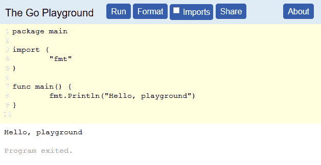
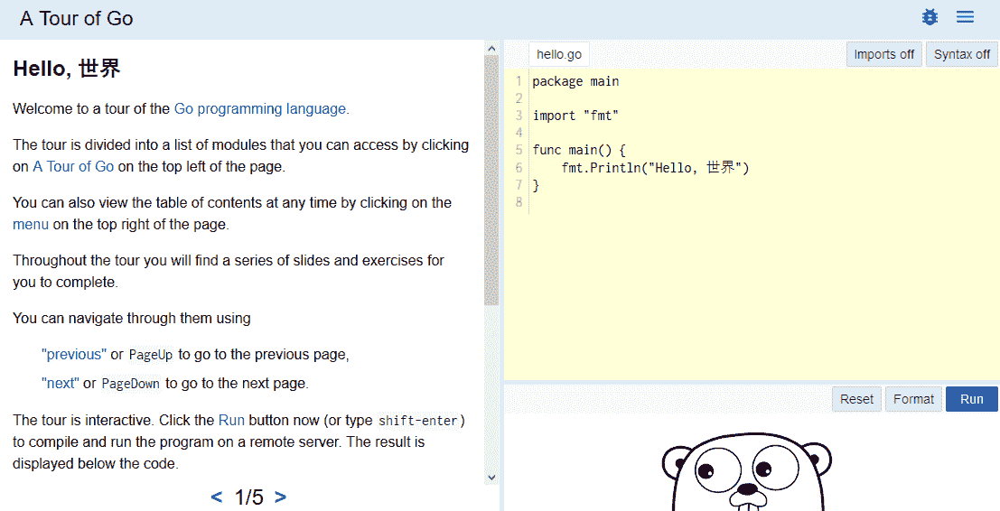

# 二、Go 编程语言

在深入研究使用 GO 进行安全性的更复杂的例子之前，有一个坚实的基础是很重要的。本章概述了 Go 编程语言，以便您掌握后续示例所需的知识。

本章不是对 Go 编程语言的详尽论述，但将为您提供对主要功能的全面概述。本章的目的是为您提供所需的信息，以便您在从未使用过 Go 的情况下理解并遵循源代码。如果你已经熟悉Go，这一章应该是对你已经知道的事情的快速而简单的回顾，但也许你会学到一条新的信息。

本章具体涵盖以下主题：

*   Go 语言规范
*   Go场
*   A tour of Go
*   关键词
*   关于源代码的注释
*   评论
*   类型
*   控制结构
*   推迟
*   Packages
*   班级
*   戈罗季斯
*   获取帮助和文档

# Go 语言规范

整个 Go 语言规范可在网上[找到 https://golang.org/ref/spec](https://golang.org/ref/spec) 。本章中的大部分信息来自规范，因为这是该语言的真实文档。这里剩下的信息是简短的示例、提示、最佳实践，以及我在Go学习期间学到的其他东西。

# The Go playground

Go 游乐场是一个网站，您可以在其中编写和执行 Go 代码，而无需安装任何东西。在操场上，[https://play.golang.org](https://play.golang.org) 您可以测试代码片段来探索该语言，还可以处理一些事情来理解该语言是如何工作的。它还允许您通过创建存储代码段的唯一 URL 来共享代码段。通过操场共享代码比纯文本片段更有帮助，因为它允许读者实际执行代码，如果他们对代码的工作原理有任何疑问，可以修改源代码：



前面的屏幕截图显示了一个正在操场上运行的简单程序。顶部有用于运行、格式化、添加导入语句以及与其他人共享代码的按钮。

# Go之旅

Go团队提供的另一个资源是*Go之旅*。本网站，[https://tour.golang.org](https://tour.golang.org) 建在上节提到的操场之上。这次参观是我对这门语言的第一次介绍，当我完成它的时候，我觉得自己已经准备好开始处理Go中的项目了。它将带您一步一步地了解该语言以及工作代码示例，以便您可以运行和修改代码以熟悉该语言。这是一个实用的方法，介绍一个新来的人去。如果你从来没有使用过Go，我鼓励你去看看。



前面的屏幕截图显示了教程的第一页。在右侧，您将有一个小型嵌入式游乐场，其代码示例与左侧显示的简短课程相关。每节课都有一个简短的代码示例，您可以运行并修改它。

# 关键词

为了强调Go有多简单，这里列出了它的 25 个关键词。如果您熟悉其他编程语言，您可能已经知道其中的大多数。关键字被分组在一起，根据它们的用途来检查它们。

**数据类型**：

| `var` | 这定义了一个新变量 |
| `const` | This defines a constant value that does not change |
| `type` | 这定义了一个新的数据类型 |
| `struct` | This defines a new structured data type that contains multiple variables |
| `map` | 这将定义一个新的映射或哈希变量 |
| `interface` | 这定义了一个新接口 |

**功能**：

| `func` | 这定义了一个新函数 |
| `return` | 这将退出一个函数，可以选择返回值 |

**Packages**:

| `import` | 这将导入当前包中的外部包 |
| `package` | 这指定文件属于哪个包 |

**程序流程**：

| `if` | 这用于基于条件 true 的分支执行 |
| `else` | 如果条件不为真，则此选项用于分支 |
| `goto` | 这用于直接跳转到标签；它很少被使用，也不被鼓励 |

**切换语句**：

| `switch` | This is used to branch based off of a condition |
| `case` | 这定义了`switch`语句的条件 |
| `default` | 这定义了在没有匹配案例时的默认执行 |
| `fallthrough` | This is used to continue executing the next case |

**迭代**：

| `for` | `for`循环可以像在 C 中一样使用，在 C 中提供三个表达式：初始值设定项、条件和增量。Go 中没有`while`循环，`for`关键字同时扮演`for`和`while`的角色。如果传递了一个表达式（条件），则可以像使用`while`循环一样使用`for`循环。 |
| `range` | `range`关键字与`for`循环一起用于迭代地图或切片。 |
| `continue` | `continue`关键字将跳过当前循环中剩余的任何执行，并直接跳转到下一个迭代。 |
| `break` | `break`关键字将立即完全退出`for`循环，跳过任何剩余的迭代。 |

**Concurrency**:

| `go` | goroutine 是语言中内置的轻量级线程。您只需将`go`关键字放在函数调用前面，Go 将在单独的线程中执行该函数调用。 |
| `chan` | 为了在线程之间通信，使用了通道。通道用于发送和接收特定的数据类型。默认情况下，它们是阻塞的。 |
| `select` | `select`语句允许以非阻塞方式使用通道。 |

**方便性**：

| `defer` | `defer`关键字是我以前在其他语言中没有遇到过的一个相对独特的关键字。它允许您指定稍后在周围函数返回时调用的函数。当您希望确保在当前函数结束时执行某种类型的清理操作，但不确定该函数何时或何处返回时，此选项非常有用。一个常见的用例是延迟文件关闭。 |

# 关于源代码的注释

Go 源代码文件应具有`.go`扩展名。Go 文件的源代码以 UTF-8 Unicode 编码。这意味着您可以在代码中使用任何 Unicode 字符，就像在字符串中硬编码日语字符一样。

分号在行尾是可选的，通常省略。仅当在一行上分隔多个语句或表达式时才需要分号。

Go 确实有一个代码格式标准，可以通过在源代码文件上运行`go fmt`轻松遵守该标准。应该遵循代码格式，但编译器并没有严格执行这种格式，Python 需要精确的格式才能正确执行。

# 评论

注释遵循 C++风格，允许双斜线和斜线星号包样式：

```go
// Line comment, everything after slashes ignored
/* General comment, can be in middle of line or span multiple lines */
```

# 类型

内置数据类型的命名非常直观。Go 附带了一组位长度不同的整数和无符号整数类型。还有浮点数、布尔值和字符串，这并不奇怪。

There are a few types like runes that are not common in other languages. This section covers all of the different types.

# Boolean

布尔类型表示真值或假值。有些语言不提供`bool`类型，您必须使用整数或定义自己的枚举，但 Go 附带了一个预先声明的`bool`类型。`true`和`false`常量也是预定义的，并以所有小写字母使用。以下是创建布尔值的示例：

```go
var customFlag bool = false  
```

`bool`类型在任何情况下都不是唯一的，但布尔类型的一个有趣细节是，它是唯一以一个人命名的类型。乔治·布尔（George Boole）生活在 1815 年至 1864 年间，他写了《思想的法则》（T2）和《思想的法则》（T3），他在书中描述了布尔代数，这是所有数字逻辑的基础。`bool`类型在 Go 中非常简单，但名称背后的历史非常丰富。

# 数字的

主要的数字数据类型是整数和浮点数。Go 还提供了复数类型、字节类型和符文。以下是 Go 中可用的数字数据类型。

# 通用编号

当您不特别关心数字是 32 位还是 64 位时，可以使用这些泛型类型。将自动使用最大的可用大小，但将与 32 位和 64 位处理器兼容。

*   `uint`：这是一个 32 位或 64 位的无符号整数
*   `int`：这是一个与`uint`大小相同的有符号整数
*   `uintptr`：用于存储指针值的无符号整数

# 具体数字

这些数字类型指定位长度以及是否有符号位来确定正值或负值。位长度将决定最大范围。有符号整数的范围减少了一位，因为最后一位是为符号保留的。

# 无符号整数

使用不带数字的`uint`通常会选择系统的最大大小，通常为 64 位。您还可以指定四种特定`uint`尺寸中的一种：

*   `uint8`：无符号 8 位整数（0 到 255）
*   `uint16`：无符号 16 位整数（0 到 65535）
*   `uint32`：无符号 32 位整数（0 到 4294967295）
*   `uint64`: Unsigned 64-bit integer (0 to 18446744073709551615)

# Signed integers

与无符号整数一样，您可以使用`int`自行选择最佳默认大小，或指定以下四种特定`int`大小之一：

*   `int8`：8 位整数（-128 到 127）
*   `int16`：16 位整数（-32768 到 32767）
*   `int32`：32 位整数（-2147483648 到 2147483647）
*   `int64`：64 位整数（-9223372036854775808 至 9223372036854775807）

# 浮点数

浮点类型没有泛型类型，必须是以下两个选项之一：

*   `float32`：IEEE-754 32 位浮点数
*   `float64`：IEEE-754 64 位浮点数

# 其他数字类型

Go also provides a complex number for advanced mathematical applications, and a few aliases for conveniences:

*   `complex64`：实部和虚部为`float32`的复数
*   `complex128`: Complex number with `float64` real and imaginary parts
*   `byte`：`uint8`的别名
*   `rune`：`int32`的别名

您可以定义十进制、八进制或十六进制格式的数字。十进制或十进制数字不需要前缀。八进制或八进制数字的前缀应为零。十六进制或十六进制数字的前缀应为零和 x。

有关八进制数字系统的更多信息，请访问[https://en.wikipedia.org/wiki/Octal](https://en.wikipedia.org/wiki/Octal) ，小数点位于[https://en.wikipedia.org/wiki/Decimal](https://en.wikipedia.org/wiki/Decimal) 和[处的十六进制 https://en.wikipedia.org/wiki/Hexadecimal](https://en.wikipedia.org/wiki/Hexadecimal) 。

请注意，数字存储为整数，它们之间除了在源代码中如何格式化之外没有任何区别。处理二进制数据时，八进制和十六进制可能很有用。下面是一个如何定义整数的简短示例：

```go
package main

import "fmt"

func main() {
   // Decimal for 15
   number0 := 15

   // Octal for 15
   number1 := 017 

   // Hexadecimal for 15
   number2 := 0x0F

   fmt.Println(number0, number1, number2)
} 
```

# 一串

Go 带有一个`string`类型以及一个`strings`包，其中包含一套有用的功能，如`Contains()`、`Join()`、`Replace()`、`Split()`、`Trim()`和`ToUpper()`。另外还有一个`strconv`包，专门用于将各种数据类型与字符串进行转换。有关`strings`套餐的更多信息，请访问[https://golang.org/pkg/strings/](https://golang.org/pkg/strings/) 和[处的`strconv`包装 https://golang.org/pkg/strconv/](https://golang.org/pkg/strconv/) 。

双引号用于字符串。单引号仅用于单个字符或符文，而不是字符串。字符串可以通过 declare 和 assign 操作符使用长格式或短格式定义。您还可以使用```go（反勾号）符号来封装跨多行的字符串。下面是字符串用法的一个简短示例：

```
package main

import "fmt"

func main() {
   // Long form assignment
   var myText = "test string 1"

   // Short form assignment
   myText2 := "test string 2"

   // Multiline string
   myText3 := `long string
   spanning multiple
   lines` 

   fmt.Println(myText) 
   fmt.Println(myText2) 
   fmt.Println(myText3)
} 
```go

# 大堆

数组由特定类型的序列元素组成。可以为任何数据类型创建数组。数组的长度不能更改，必须在声明时指定。数组很少直接使用，但主要通过下一节介绍的切片类型使用。数组始终是一维的，但可以创建数组数组来创建多维对象。

要创建 128 字节的数组，可以使用以下语法：

```
var myByteArray [128]byte  
```go

数组的单个元素可以通过其基于 0 的数字索引进行访问。例如，要从字节数组中获取第五个元素，语法如下：

```
singleByte := myByteArray[4]
```go

# 片

切片使用数组作为基础数据类型。主要的优点是，与阵列不同，切片可以调整大小。将切片视为底层数组中的查看窗口。**容量**是指底层数组的大小，以及片的最大可能长度。切片的**长度**是指其当前长度，可以调整大小。

使用`make()`函数创建切片。`make()`函数将创建具有特定长度和容量的特定类型的切片。创建切片时，`make()`功能可通过两种方式使用。只有两个参数，长度和容量是相同的。使用三个参数，可以指定大于长度的最大容量。以下是两个`make()`函数声明：

```
make([]T, lengthAndCapacity)
make([]T, length, capacity) 
```go

可以创建容量和长度为 0 的 nil 片。没有与 nil 片关联的基础数组。下面是一个简短的示例程序，演示如何创建和检查切片：

```
package main

import "fmt"

func main() {
   // Create a nil slice
   var mySlice []byte

   // Create a byte slice of length 8 and max capacity 128
   mySlice = make([]byte, 8, 128)

   // Maximum capacity of the slice
   fmt.Println("Capacity:", cap(mySlice))

   // Current length of slice
   fmt.Println("Length:", len(mySlice))
} 
```go

您还可以使用内置的`append()`函数附加到切片。

Append 可以一次添加一个或多个元素。如有必要，将调整基础阵列的大小。这意味着可以增加片的最大容量。当一个片增加其底层容量，创建一个更大的底层阵列时，它将创建一个具有一些额外空间的阵列。这意味着，如果一个片的容量超过一个，那么阵列大小可能会增加四个。这样做是为了使底层阵列有增长的空间，以减少底层阵列必须调整大小的次数，这可能需要移动内存以适应更大的阵列。每次仅仅为了添加一个元素而调整数组的大小可能会很昂贵。切片机制将自动确定调整大小的最佳尺寸。

此代码示例提供了使用切片的各种示例：

```
package main

import "fmt"

func main() {
   var mySlice []int // nil slice

   // Appending works on nil slices.
   // Since nil slices have zero capacity, and have
   // no underlying array, it will create one.
   mySlice = append(mySlice, 1, 2, 3, 4, 5)

   // Individual elements can be accessed from a slice
   // just like an array by using the square bracket operator.
   firstElement := mySlice[0]
   fmt.Println("First element:", firstElement)

   // To get only the second and third element, use:
   subset := mySlice[1:4]
   fmt.Println(subset)

   // To get the full contents of a slice except for the 
   // first element, use:
   subset = mySlice[1:]
   fmt.Println(subset)

   // To get the full contents of a slice except for the 
   // last element, use:
   subset = mySlice[0 : len(mySlice)-1]
   fmt.Println(subset)

   // To copy a slice, use the copy() function.
   // If you assign one slice to another with the equal operator,
   // the slices will point at the same memory location,
   // and changing one would change both slices.
   slice1 := []int{1, 2, 3, 4}
   slice2 := make([]int, 4)

   // Create a unique copy in memory
   copy(slice2, slice1)

   // Changing one should not affect the other
   slice2[3] = 99
   fmt.Println(slice1)
   fmt.Println(slice2)
} 
```go

# 结构

在 Go 中，结构或数据结构是变量的集合。变量可以是不同的类型。我们将看一个创建自定义结构类型的示例。

Go 使用基于案例的作用域来声明变量`public`或`private`。大写的变量和方法可以从其他包中导出和访问。小写值是私有的，只能在同一个包中访问。

下面的示例创建了一个名为`Person`的简单结构和一个名为`Hacker`的结构。`Hacker`类型中嵌入了一个`Person`类型。然后创建每种类型的实例，并将有关它们的信息打印到标准输出：

```
package main

import "fmt"

func main() {
   // Define a Person type. Both fields public
   type Person struct {
      Name string
      Age  int
   }

   // Create a Person object and store the pointer to it
   nanodano := &Person{Name: "NanoDano", Age: 99}
   fmt.Println(nanodano)

   // Structs can also be embedded within other structs.
   // This replaces inheritance by simply storing the
   // data type as another variable.
   type Hacker struct {
      Person           Person
      FavoriteLanguage string
   }
   fmt.Println(nanodano)

   hacker := &Hacker{
      Person:           *nanodano,
      FavoriteLanguage: "Go",
   }
   fmt.Println(hacker)
   fmt.Println(hacker.Person.Name)

   fmt.Println(hacker)
} 
```go

您可以通过以小写字母开头的方式创建*私有*变量。我使用引号是因为私有变量的工作方式与其他语言略有不同。隐私在包级别工作，而不是在*类*或类型级别。

# 指针

Go 提供一种指针类型，用于存储存储特定类型数据的内存位置。指针可用于通过引用将结构传递给函数，而无需创建副本。这也允许函数在适当的位置修改对象。

Go 中不允许使用指针算法。指针被认为是*安全的*，因为 Go 甚至没有在指针类型上定义加法运算符。它们只能用于引用现有对象。

此示例演示了指针的基本用法。它首先创建一个整数，然后创建一个指向该整数的指针。然后，它打印出指针的数据类型、指针中存储的地址，以及指向的数据值：

```
package main

import (
   "fmt"
   "reflect"
)

func main() {
   myInt := 42
   intPointer := &myInt

   fmt.Println(reflect.TypeOf(intPointer))
   fmt.Println(intPointer)
   fmt.Println(*intPointer)
} 
```go

# 作用

函数是用`func`关键字定义的。函数可以有多个参数。所有参数都是位置参数，没有命名参数。Go 支持可变参数，允许未知数量的参数。函数是 Go 中的一级公民，可以匿名使用并作为变量返回。Go 还支持函数的多个返回值。下划线可用于忽略返回变量。

以下代码源中演示了所有这些示例：

```
package main

import "fmt"

// Function with no parameters
func sayHello() {
   fmt.Println("Hello.")
}

// Function with one parameter
func greet(name string) {
   fmt.Printf("Hello, %s.\n", name)
}

// Function with multiple params of same type
func greetCustom(name, greeting string) {
   fmt.Printf("%s, %s.\n", greeting, name)
}

// Variadic parameters, unlimited parameters
func addAll(numbers ...int) int {
   sum := 0
   for _, number := range numbers {
      sum += number
   }
   return sum
}

// Function with multiple return values
// Multiple values encapsulated by parenthesis
func checkStatus() (int, error) {
   return 200, nil
}

// Define a type as a function so it can be used
// as a return type
type greeterFunc func(string)

// Generate and return a function
func generateGreetFunc(greeting string) greeterFunc {
   return func(name string) {
      fmt.Printf("%s, %s.\n", greeting, name)
   }
}

func main() {
   sayHello()
   greet("NanoDano")
   greetCustom("NanoDano", "Hi")
   fmt.Println(addAll(4, 5, 2, 3, 9))

   russianGreet := generateGreetFunc("Привет")
   russianGreet("NanoDano")

   statusCode, err := checkStatus()
   fmt.Println(statusCode, err)
} 
```go

# 界面

接口是定义函数签名集合的特殊类型。您可以将接口看作是这样的：“类型必须实现函数 X 和函数 Y 才能满足此接口。”如果您创建任何类型并实现满足该接口所需的函数，则您的类型可以在预期接口的任何位置使用。您不必指定您正在尝试满足接口，编译器将确定它是否满足要求。

您可以向自定义类型添加任意数量的其他函数。接口定义了所需的函数，但这并不意味着您的类型仅限于实现这些函数。

最常用的接口是`error`接口。`error`接口只需要实现一个函数，一个名为`Error()`的函数返回一个带有错误消息的字符串。以下是接口定义：

```
type error interface {
   Error() string
} 
```go

这使得实现自己的错误接口变得非常容易。本例创建一个`customError`类型，然后实现满足接口所需的`Error()`函数。然后，创建一个示例函数，返回自定义错误：

```
package main

import "fmt"

// Define a custom type that will
// be used to satisfy the error interface
type customError struct {
   Message string
}

// Satisfy the error interface
// by implementing the Error() function
// which returns a string
func (e *customError) Error() string {
   return e.Message
}

// Sample function to demonstrate
// how to use the custom error
func testFunction() error {
   if true != false { // Mimic an error condition
      return &customError{"Something went wrong."}
   }
   return nil
}

func main() {
   err := testFunction()
   if err != nil {
      fmt.Println(err)
   }
} 
```go

其他常用的接口有`Reader`和`Writer`接口。为了满足接口需求，每一个都只需要实现一个功能。这里最大的好处是，您可以创建自己的自定义类型，以任意方式读取和写入数据。实现细节对于接口并不重要。该接口不会关心您是在读写硬盘、网络连接、内存存储还是`/dev/null`。只要实现所需的函数签名，就可以在使用接口的任何地方使用类型。以下是`Reader`和`Writer`接口的定义：

```
type Reader interface {
   Read(p []byte) (n int, err error)
} 

type Writer interface {
   Write(p []byte) (n int, err error)
} 
```go

# 地图

A map is a hash table or dictionary that stores key and value pairs. The key and value can be any data types, including maps themselves, creating multiple dimensions.

订单不能保证。您可以在一个映射上迭代多次，它可能会有所不同。此外，映射不是并发安全的。如果必须在线程之间共享映射，请使用互斥锁。

以下是一些地图使用示例：

```
package main

import (
   "fmt"
   "reflect"
)

func main() {
   // Nil maps will cause runtime panic if used 
   // without being initialized with make()
   var intToStringMap map[int]string
   var stringToIntMap map[string]int
   fmt.Println(reflect.TypeOf(intToStringMap))
   fmt.Println(reflect.TypeOf(stringToIntMap))

   // Initialize a map using make
   map1 := make(map[string]string)
   map1["Key Example"] = "Value Example"
   map1["Red"] = "FF0000"
   fmt.Println(map1)

   // Initialize a map with literal values
   map2 := map[int]bool{
      4:  false,
      6:  false,
      42: true,
   }

   // Access individual elements using the key
   fmt.Println(map1["Red"])
   fmt.Println(map2[42])
```go

```
   // Use range to iterate through maps
   for key, value := range map2 {
      fmt.Printf("%d: %t\n", key, value)
   }

} 
```go

# 频道

通道用于线程之间的通信。通道为**先进先出**（**先进先出**队列。您可以将对象推送到队列上，并从前面异步拉出。每个通道只能支持一种数据类型。默认情况下，通道是阻塞的，但可以使用`select`语句使其成为非阻塞的。与切片和贴图一样，通道在使用`make()`功能之前必须初始化。

Go中的谚语是*不要通过分享记忆来交流；相反，通过通信*共享内存。在[上阅读更多关于这一理念的信息 https://blog.golang.org/share-memory-by-communicating](https://blog.golang.org/share-memory-by-communicating) 。

下面是一个示例程序，演示了基本频道用法：

```
package main

import (
   "log"
   "time"
)

// Do some processing that takes a long time
// in a separate thread and signal when done
func process(doneChannel chan bool) {
   time.Sleep(time.Second * 3)
   doneChannel <- true
}

func main() {
   // Each channel can support one data type.
   // Can also use custom types
   var doneChannel chan bool

   // Channels are nil until initialized with make
   doneChannel = make(chan bool)

   // Kick off a lengthy process that will
   // signal when complete
   go process(doneChannel)

   // Get the first bool available in the channel
   // This is a blocking operation so execution
   // will not progress until value is received
   tempBool := <-doneChannel
   log.Println(tempBool)
   // or to simply ignore the value but still wait
   // <-doneChannel

   // Start another process thread to run in background
   // and signal when done
   go process(doneChannel)

   // Make channel non-blocking with select statement
   // This gives you the ability to continue executing
   // even if no message is waiting in the channel
   var readyToExit = false
   for !readyToExit {
      select {
      case done := <-doneChannel:
         log.Println("Done message received.", done)
         readyToExit = true
      default:
         log.Println("No done signal yet. Waiting.")
         time.Sleep(time.Millisecond * 500)
      }
   }
} 
```go

# 控制结构

控制结构用于控制程序执行的流程。最常见的形式是`if`语句、`for`循环和`switch`语句。Go 也支持`goto`语句，但应保留用于极端性能和不经常使用的情况。让我们简要地看一下其中的每一个，以了解语法。

# 如果

与大多数其他语言一样，`if`语句附带`if`、`else if`和`else`子句。Go 的一个有趣的特性是能够将语句放在条件之前，创建在`if`语句完成后丢弃的临时变量。

本例演示了使用`if`语句的各种方法：

```
package main

import (
   "fmt"
   "math/rand"
)

func main() {
   x := rand.Int()

   if x < 100 {
      fmt.Println("x is less than 100.")
   }

   if x < 1000 {
      fmt.Println("x is less than 1000.")
   } else if x < 10000 {
      fmt.Println("x is less than 10,000.")
   } else {
      fmt.Println("x is greater than 10,000")
   }

   fmt.Println("x:", x)

   // You can put a statement before the condition 
   // The variable scope of n is limited
   if n := rand.Int(); n > 1000 {
      fmt.Println("n is greater than 1000.")
      fmt.Println("n:", n)
   } else {
      fmt.Println("n is not greater than 1000.")
      fmt.Println("n:", n)
   }
   // n is no longer available past the if statement
} 
```go

# 对于

`for`循环有三个组件，可以像 C 或 Java 中的`for`循环一样使用。Go 没有`while`循环，因为`for`循环在与单个条件一起使用时具有相同的用途。请参阅以下示例以了解更多信息：

```
package main

import (
   "fmt"
)

func main() {
   // Basic for loop
   for i := 0; i < 3; i++ {
      fmt.Println("i:", i)
   }

   // For used as a while loop
   n := 5
   for n < 10 {
      fmt.Println(n)
      n++
   }
} 
```go

# 范围

`range`关键字用于迭代切片、映射或其他数据结构。`range`关键字与`for`循环结合使用，以在可编辑的数据结构上进行操作。`range`关键字返回键和值变量。以下是使用`range`关键字的一些基本示例：

```
package main

import "fmt"

func main() {
   intSlice := []int{2, 4, 6, 8}
   for key, value := range intSlice {
      fmt.Println(key, value)
   }

   myMap := map[string]string{
      "d": "Donut",
      "o": "Operator",
   }

   // Iterate over a map
   for key, value := range myMap {
      fmt.Println(key, value)
   }

   // Iterate but only utilize keys
   for key := range myMap {
      fmt.Println(key)
   }

   // Use underscore to ignore keys
   for _, value := range myMap {
      fmt.Println(value)
   }
} 
```go

# 开关、大小写、故障排除和默认值

`switch`语句允许您根据变量的状态来分支执行。它类似于 C 和其他语言中的`switch`语句。

默认情况下没有`fallthrough`。这意味着一旦到达案例的结尾，除非提供了明确的`fallthrough`命令，否则代码将完全退出`switch`语句。如果没有匹配的案例，则可以提供一个`default`案例。

您可以在要切换的变量前面放一条语句，例如`if`语句。这将创建一个变量，其范围仅限于`switch`语句。

这个例子演示了两个`switch`语句。第一个使用硬编码值，包括一个`default`案例。第二条`switch`语句使用另一种语法，允许在第一行中使用语句：

```
package main

import (
   "fmt"
   "math/rand"
)

func main() {
   x := 42

   switch x {
   case 25:
      fmt.Println("X is 25")
   case 42:
      fmt.Println("X is the magical 42")
      // Fallthrough will continue to next case
      fallthrough
   case 100:
      fmt.Println("X is 100")
   case 1000:
      fmt.Println("X is 1000")
   default:
      fmt.Println("X is something else.")
   }

   // Like the if statement a statement
   // can be put in front of the switched variable
   switch r := rand.Int(); r {
   case r % 2:
      fmt.Println("Random number r is even.")
   default:
      fmt.Println("Random number r is odd.")
   }
   // r is no longer available after the switch statement
} 
```go

# 后藤

Go 确实有一个`goto`语句，但它很少被使用。创建一个带有名称和冒号的标签，然后使用`goto`关键字*转到*。以下是一个基本示例：

```
package main

import "fmt"

func main() {

   goto customLabel

   // Will never get executed because
   // the goto statement will jump right
   // past this line
   fmt.Println("Hello")

   customLabel:
   fmt.Println("World")
} 
```go

# 推迟

通过延迟函数，它将在当前函数退出时运行。这是一种方便的方法，可以确保函数在退出之前执行，这对于清理或关闭文件很有用。这是很方便的，因为如果有多个返回位置，则无论周围函数在哪里退出，都会执行延迟函数。

常见的用例是延迟关闭文件或数据库连接的调用。打开文件后，您可以立即推迟关闭调用。这将确保在函数退出时关闭文件，即使存在多个 return 语句，并且您无法确定当前函数将在何时何地退出。

这个例子演示了一个简单的`defer`关键字用例。它创建一个文件，然后推迟对`file.Close()`的调用：

```
package main

import (
   "log"
   "os"
)

func main() {

   file, err := os.Create("test.txt")
   if err != nil {
      log.Fatal("Error creating file.")
   }
   defer file.Close()
   // It is important to defer after checking the errors.
   // You can't call Close() on a nil object
   // if the open failed.

   // ...perform some other actions here...

   // file.Close() will be called before final exit
} 
```go

确保正确检查和处理错误。如果使用 nil 指针，`defer`调用将死机。

了解延迟函数是在退出周围函数时运行的，这一点也很重要。如果将一个`defer`调用放在`for`循环中，则在每次`for`循环迭代结束时不会调用它。

# 包装

包只是目录。每个目录都是它自己的包。创建子目录将创建一个新包。没有子包会导致扁平的层次结构。子目录仅用于组织代码。

软件包应存储在`$GOPATH`变量的`src`文件夹中。

包名称应与文件夹名称匹配或命名为`main`。`main`包意味着它不打算被导入到另一个应用中，而是作为一个程序进行编译和运行。使用`import`关键字导入包。

您可以单独导入包：

```
import "fmt" 
```go

或者，可以通过使用括号将多个包括起来，一次导入多个包：

```
import (
   "fmt"
   "log"
) 
```go

# 班级

从技术上讲，Go 没有类，但只有一些细微的区别使它不能被称为面向对象语言。从概念上讲，我认为它是面向对象的编程语言，虽然它只支持面向对象语言的最基本的特性。它并不具备许多人认为与面向对象编程相关的所有特性，如继承和多态性，这些特性被其他特性（如嵌入式类型和接口）所取代。也许你可以称之为*微类*系统，因为它是一个极简的实现，没有任何额外的功能或负担，这取决于你的观点。

在本书中，术语*对象*和*类*可以用来说明使用熟悉术语的观点，但请注意，这些术语在 Go 中不是正式术语。类型定义与操作该类型的函数的组合类似于类，对象是类型的实例。

# 遗产

Go 中没有继承，但可以嵌入类型。下面是一个`Person`和`Doctor`类型的示例，其中嵌入了`Person`类型。它不是直接继承`Person`的行为，而是将`Person`对象存储为变量，这将带来所有预期的`Person`方法和属性：

```
package main

import (
   "fmt"
   "reflect"
)

type Person struct {
   Name string
   Age  int
} 

type Doctor struct {
   Person         Person
   Specialization string
}

func main() {
   nanodano := Person{
      Name: "NanoDano",
      Age:  99,
   } 

   drDano := Doctor{
      Person:         nanodano,
      Specialization: "Hacking",
   }

   fmt.Println(reflect.TypeOf(nanodano))
   fmt.Println(nanodano)
```go

```
   fmt.Println(reflect.TypeOf(drDano))
   fmt.Println(drDano)
} 
```go

# 多态性

Go 中没有多态性，但您可以使用接口创建可由多种类型使用的公共抽象。接口定义一个或多个必须满足的方法声明，以与接口兼容。本章前面介绍了接口。

# 建设者

Go 中没有构造函数，但有`New()`函数的作用类似于初始化对象的工厂。您只需创建一个名为`New()`的函数来返回您的数据类型。以下是一个例子：

```
package main

import "fmt"

type Person struct {
   Name string
}

func NewPerson() Person {
   return Person{
      Name: "Anonymous",
   }
}

func main() {
   p := NewPerson()
   fmt.Println(p)
} 
```go

Go 中没有解构器，因为所有东西都是垃圾收集的，并且您不需要手动销毁对象。当当前函数结束时，通过延迟函数调用以执行某些清理，可以获得最接近的延迟。

# 方法

方法是属于特定类型的函数，使用点表示法调用，例如：

```
myObject.myMethod() 
```go

点标记法广泛应用于 C++和其他面向对象语言中。点表示法和类系统源于 C 中使用的公共模式。公共模式是定义一组函数，所有函数都对特定的数据类型进行操作。所有相关函数都具有相同的第一个参数，即要操作的数据。既然这是一种常见的模式，就把它构建到语言中去吧。在 Go 函数定义中，有一个指定接收者的特殊位置，而不是将要操作的对象作为第一个参数传递。接收器在函数名前的一组括号之间指定。下一个示例演示如何使用函数接收器。

您可以编写具有特殊的*接收器*的函数，而不是编写所有以指针作为第一个参数的大型函数集。接收器可以是类型，也可以是指向类型的指针：

```
package main

import "fmt"

type Person struct {
   Name string
}

// Person function receiver
func (p Person) PrintInfo() {
   fmt.Printf("Name: %s\n", p.Name)
}

// Person pointer receiver
// If you did not use the pointer receivers
// it would not modify the person object
// Try removing the asterisk here and seeing how the
// program changes behavior
func (p *Person) ChangeName(newName string) {
   p.Name = newName
}

func main() {
   nanodano := Person{Name: "NanoDano"}
   nanodano.PrintInfo()
   nanodano.ChangeName("Just Dano")
   nanodano.PrintInfo()
} 
```go

在 Go 中，您不会将所有变量和方法封装在一对大括号中。定义一个类型，然后定义对该类型进行操作的方法。这允许您在一个位置定义所有结构和数据类型，并在包的其他位置定义方法。您还可以选择定义一个类型和紧挨着彼此的方法。它非常简单明了，并且在状态（数据）和逻辑之间创建了一个稍微清晰的区别。

# 运算符重载

Go 中没有运算符重载，因此不能将`+`符号添加到结构中，但可以轻松地在类型上定义一个`Add()`函数，然后调用类似于`dataSet1.Add(dataSet2)`的东西。通过省略语言中的运算符重载，我们可以自信地使用运算符，而不必担心由于运算符行为在代码中的其他地方被重载而导致的意外行为。

# 戈罗季斯

goroutine 是语言中内置的轻量级线程。您只需在函数调用前面加上单词`go`，即可在线程中执行函数。在本书中，Goroutines 也可以称为线程。

Go 确实提供互斥锁，但在大多数情况下它们是可以避免的，本书将不介绍它们。您可以在[上的`sync`包文档中阅读有关互斥体的更多信息 https://golang.org/pkg/sync/](https://golang.org/pkg/sync/) 。通道应该用于共享数据和线程之间的通信。本章前面介绍了频道。

注意，`log`包可以安全地同时使用，但`fmt`包不能。下面是一个使用 goroutines 的简短示例：

```
package main

import (
   "log"
   "time"
)

func countDown() {
   for i := 5; i >= 0; i-- {
      log.Println(i)
      time.Sleep(time.Millisecond * 500)
   }
}

func main() {
   // Kick off a thread
   go countDown()

   // Since functions are first-class
   // you can write an anonymous function
   // for a goroutine
   go func() {
      time.Sleep(time.Second * 2)
      log.Println("Delayed greetings!")
   }()

   // Use channels to signal when complete
   // Or in this case just wait
   time.Sleep(time.Second * 4)
} 
```go

# 获取帮助和文档

Go 有在线和离线帮助文档。脱机文档是 Go 的内置文档，与联机托管的文档相同。接下来的这些部分将引导您访问这两种形式的文档。

# 在线Go文档

在线文档可在[获取 https://golang.org/](https://golang.org/) ，并拥有所有正式文档、规范和帮助文件。具体语言文档位于[https://golang.org/doc/](https://golang.org/doc/) ，标准库信息见[https://golang.org/pkg/](https://golang.org/pkg/) 。

# 脱机 Go 文档

Go 还附带了带有`godoc`命令行工具的脱机文档。您可以在命令行上使用它，或者让它运行一个 web 服务器，在那里它为[提供相同的网站服务 https://golang.org/](https://golang.org/) 主持人。在本地提供完整的网站文档非常方便。下面是一些获取`fmt`包文档的示例。将`fmt`替换为您感兴趣的任何软件包：

```
 # Get fmt package information
 godoc fmt

 # Get source code for fmt package
 godoc -src fmt

 # Get specific function information
 godoc fmt Printf

 # Get source code for function
 godoc -src fmt Printf

 # Run HTTP server to view HTML documentation
 godoc -http=localhost:9999

```

The HTTP option serves the same documentation that is available on [https://golang.org/](https://golang.org/).

# 总结

阅读本章后，您应该对Go基础知识有一个基本的了解，如关键词是什么、它们的作用以及可用的基本数据类型。创建函数和自定义数据类型也应该让您感到舒适。

我们的目标不是要记住前面的所有信息，而是要知道语言中有哪些工具可用。如有必要，请将本章作为参考。有关 Go 语言规范的更多信息，请访问[https://golang.org/ref/spec](https://golang.org/ref/spec) 。

In the next chapter, we will look at working with files in Go. We will cover basics such as getting file information, seeing whether a file exists, truncating files, checking permissions, and creating new files. We will also cover the reader and writer interfaces, as well as a number of ways to read and write data. In addition to this, we will cover things such as archiving to ZIP or TAR files and compressing files with GZIP.