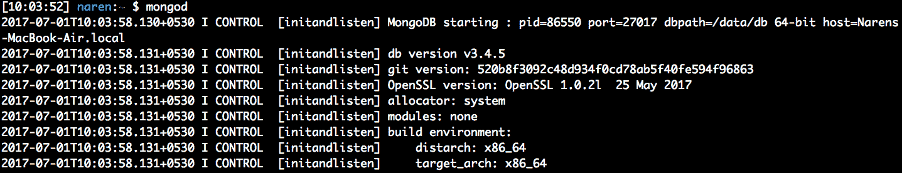
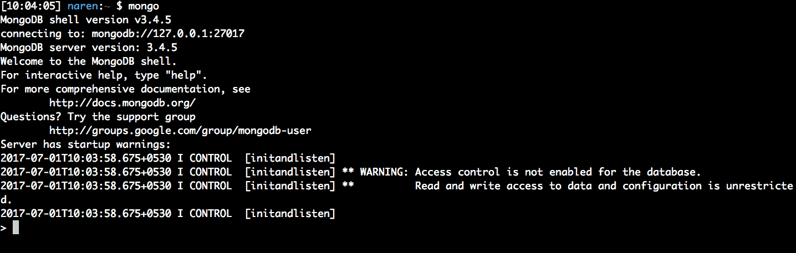

# 使用 MongoDB 并创建 RESTAPI

在本章中，我们将介绍名为`MongoDB`的 NoSQL 数据库。我们将了解 MongoDB 如何适应现代 web 服务。我们将从学习`MongoDB`集合和文档开始。我们将尝试创建一个以`MongoDB`为数据库的示例 API。在这个过程中，我们将使用一个名为`mgo`的驱动程序包。我们将**然后尝试为电子商务 REST 服务设计一个文档模型。**

 **基本上，我们将讨论以下主题：

*   安装和使用 MongoDB
*   使用 Mongo shell
*   以 MongoDB 为数据库构建 RESTAPI
*   数据库索引基础
*   电子商务文档模型的设计

# 获取代码

您可以从[获取本章的代码示例 https://github.com/narenaryan/gorestful/tree/master/chapter5](https://github.com/narenaryan/gorestful/tree/master/chapter5) 。本章的示例是单个计划和项目的组合。因此，将相应的目录复制到您的`GOPATH`以正确运行代码示例。

# MongoDB 简介

**MongoDB**是一款受欢迎的 NoSQL 数据库，吸引了全球许多开发者。它不同于传统的关系数据库，如 MySQL、PostgreSQL 和 SQLite3。与其他数据库相比，MongoDB 的主要区别在于在互联网流量时易于扩展。它还有 JSON 作为其数据模型，这允许我们将 JSON 直接存储到数据库中。

许多大型公司，如 Expedia、Comcast 和大都会人寿，都在 MongoDB 上构建了它们的应用程序。它已经被证明是现代互联网业务中的一个重要元素。MongoDB 将数据存储在文档中；将其视为 SQL 数据库中的一行。所有 MongoDB 文档都存储在一个集合中，集合是一个表（在 SQL 类比中）。IMDB 电影的示例文档如下所示：

```go
{
  _id: 5,
  name: 'Star Trek',
  year: 2009,
  directors: ['J.J. Abrams'],
  writers: ['Roberto Orci', 'Alex Kurtzman'],
  boxOffice: {
     budget:150000000,
     gross:257704099
  }
}
```

与关系数据库相比，MongoDB 的主要优势是：

*   易于建模（无模式）
*   可以利用查询能力
*   文档结构适合现代 web 应用程序（JSON）
*   比关系数据库更具可扩展性

# 安装 MongoDB 并使用 shell

MongoDB 可以轻松地安装在任何平台上。在 Ubuntu 16.04 上，在运行`apt-get`命令之前，我们需要执行一些过程：

```go
sudo apt-key adv --keyserver hkp://keyserver.ubuntu.com:80 --recv 0C49F3730359A14518585931BC711F9BA15703C6 
 echo "deb [ arch=amd64,arm64 ] http://repo.mongodb.org/apt/ubuntu xenial/mongodb-org/3.4 multiverse" | sudo tee /etc/apt/sources.list.d/mongodb-org-3.4.list

sudo apt-get update && sudo apt-get install mongodb-org
```

它将在最后一步要求确认安装；按*Y*键。安装完成后，我们需要使用以下命令启动 MongoDB 守护程序：

```go
systemctl start mongod
```

前面的所有命令都将由 root 用户运行。如果用户不是 root 用户，则在每个命令之前使用 prepend`sudo`关键字。

我们也可以从网站上手动下载 MongoDB，并使用`~/mongodb/bin/mongod/`命令运行服务器。为此，我们需要创建一个初始化脚本，因为如果我们关闭终端，服务器将被杀死。我们也可以使用`nohup`在后台运行服务器。通常，最好使用`apt-get`进行安装。

 **要在 macOS X 上安装 MongoDB，请使用自制软件。我们可以使用以下命令轻松安装它：

```go
brew install mongodb
```

之后，我们需要创建 MongoDB 存储数据库的`db`目录：

```go
mkdir -p /data/db
```

然后，使用`chown`更改该文件的权限：

```go
chown -R `id -un` /data/db
```

现在我们已经准备好 MongoDB 了。我们可以使用以下命令在终端窗口中运行它，该命令启动 MongoDB 守护进程：

```go
mongod
```

请看以下屏幕截图：



在 Windows 上，我们可以手动下载安装程序二进制文件，并通过将安装目录`bin`添加到`PATH`变量来启动它。然后，我们可以使用`mongod`**命令运行它。**

 **# 使用 Mongo shell

每当我们开始使用 MongoDB 时，我们首先要做的就是使用它一段时间。查找可用的数据库、集合、文档等可以使用一个名为 MongoShell 的简单工具来完成。此 shell 与我们在上一节中提到的安装步骤一起打包。我们需要使用以下命令启动它：

```go
mongo
```

请参阅以下屏幕截图：



如果你看到这个屏幕，一切正常。如果出现任何错误，则表明服务器未运行或存在其他问题。有关故障排除，您可以查看官方的 MongoDB 故障排除指南，网址为[https://docs.mongodb.com/manual/faq/diagnostics](https://docs.mongodb.com/manual/faq/diagnostics/) 。客户端提供有关 MongoDB 版本和其他警告的信息。要查看所有可用的 shell 命令，请使用`help`命令。

现在，我们已经准备好设置。让我们创建一个名为`movies`的新集合，并将前面的示例文档插入其中。默认情况下，数据库将是一个测试数据库。您可以使用`use`**命令切换到新数据库：**

 **```go
> show databases
```

它显示所有可用的数据库。默认情况下，`admin`、`test`和`local`是可用的三个数据库。要创建新数据库，只需使用`use db_name`：

```go
> use appdb
```

将当前数据库切换到`appdb`数据库。**如果您试图在可用的数据库中看到这一点，它将不会显示，因为 MongoDB 仅在数据插入数据库（第一个集合或文档）时才会创建数据库。因此，现在我们可以通过从 shell 插入一个文档来创建一个新集合。然后，我们可以使用以下命令将前面的《星际迷航》电影记录插入名为`movies`、**的集合中：****

 ****```go
> db.movies.insertOne({ _id: 5, name: 'Star Trek', year: 2009, directors: ['J.J. Abrams'], writers: ['Roberto Orci', 'Alex Kurtzman'], boxOffice: { budget:150000000, gross:257704099 } } )
{ 
 "acknowledged" : true,
 "insertedId" : 5 
}
```

您插入的 JSON 有一个名为`_id`的 ID。我们可以在插入文档时提供它，或者 MongoDB 可以为您自己插入一个。在 SQL 数据库中，我们使用*自动递增*和`ID`模式来**递增`ID`字段。在这里，MongoDB 生成一个唯一的散列`ID`，而不是一个序列。让我们再插入一份关于`The Dark Knight`的文件，但这次我们不要通过`_id`字段：**

 **```go
> db.movies.insertOne({ name: 'The Dark Knight ', year: 2008, directors: ['Christopher Nolan'], writers: ['Jonathan Nolan', 'Christopher Nolan'], boxOffice: { budget:185000000, gross:533316061 } } )> db.movies.insertOne({ name: 'The Dark Knight ', year: 2008, directors: ['Christopher Nolan'], writers: ['Jonathan Nolan', 'Christopher Nolan'], boxOffice: { budget:185000000, gross:533316061 } } )
{ 
 "acknowledged" : true,
 "insertedId" : ObjectId("59574125bf7a73d140d5ba4a")
}
```

如果您观察确认 JSON 响应，`insertId`**已经**现在更改为非常长的`59574125bf7a73d140d5ba4a`。**这是 MongoDB 生成的唯一哈希。现在，让我们看看我们收藏的所有文件。我们还可以使用`insertMany`功能在给定时间插入一批文档：******

 ******```go
> db.movies.find()

{ "_id" : 5, "name" : "Star Trek", "year" : 2009, "directors" : [ "J.J. Abrams" ], "writers" : [ "Roberto Orci", "Alex Kurtzman" ], "boxOffice" : { "budget" : 150000000, "gross" : 257704099 } }
{ "_id" : ObjectId("59574125bf7a73d140d5ba4a"), "name" : "The Dark Knight ", "year" : 2008, "directors" : [ "Christopher Nolan" ], "writers" : [ "Jonathan Nolan", "Christopher Nolan" ], "boxOffice" : { "budget" : 185000000, "gross" : 533316061 } }
```

在 movies 集合上使用`find`函数返回集合中所有匹配的文档。以退单；文档，使用`findOne`功能。它从多个结果中返回最新文档：

```go
> db.movies.findOne()

{ "_id" : 5, "name" : "Star Trek", "year" : 2009, "directors" : [ "J.J. Abrams" ], "writers" : [ "Roberto Orci", "Alex Kurtzman" ], "boxOffice" : { "budget" : 150000000, "gross" : 257704099 }}
```

如何获取具有某些条件的文档？这意味着查询。MongoDB 中的查询称为过滤数据并返回结果。如果我们需要筛选 2008 年发行的电影，那么我们可以这样做：

```go
> db.movies.find({year: {$eq: 2008}})

{ "_id" : ObjectId("59574125bf7a73d140d5ba4a"), "name" : "The Dark Knight ", "year" : 2008, "directors" : [ "Christopher Nolan" ], "writers" : [ "Jonathan Nolan", "Christopher Nolan" ], "boxOffice" : { "budget" : 185000000, "gross" : 533316061 } }
```

来自前面 mongo 语句的筛选器查询是：

```go
{year: {$eq: 2008}}
```

这表示搜索条件为*年*，值应为*2008。*`$eq`**称为过滤操作符，有助于将字段和数据之间的条件关联起来。它相当于 SQL 中的`=`运算符。在 SQL 中，等效查询可以写成：**

 **```go
SELECT * FROM movies WHERE year=2008;
```

我们可以将上次编写的 mongo 查询语句简化为：

```go
> db.movies.find({year: 2008})
```

这个 find 查询和上面的 mongo 查询是相同的，返回相同的文档集。前一种语法是使用`$eq`**这是一个查询运算符。从现在开始，让我们将*查询操作符*简单地称为*操作符*。其他营办商包括：**

 **| **操作员** | **功能** |
| `$lt` | 少于 |
| `$gt` | 大于 |
| `$in` | 在 |
| `$lte` | 小于或等于 |
| `$ne` | 不等于 |

现在，让我们向自己提出一个问题。我们要取所有预算超过 15000000 美元的文件。我们如何用以前获得的知识过滤它？请看以下代码段：

```go
> db.movies.find({'boxOffice.budget': {$gt: 150000000}})

{ "_id" : ObjectId("59574125bf7a73d140d5ba4a"), "name" : "The Dark Knight ", "year" : 2008, "directors" : [ "Christopher Nolan" ], "writers" : [ "Jonathan Nolan", "Christopher Nolan" ], "boxOffice" : { "budget" : 185000000, "gross" : 533316061 } }
```

如果您注意到，我们使用`boxOffice.budget`访问 JSON 中的预算键。**MongoDB 的美妙之处在于它允许我们自由地查询 JSON。在获取文档时，我们不能向条件中添加两个或多个运算符吗？是的，我们可以！让我们在数据库中查找 2009 年发行的预算超过 15000000 美元的所有电影：**

 **```go
> db.movies.find({'boxOffice.budget': {$gt: 150000000}, year: 2009})
```

这不会返回任何内容，因为我们没有任何符合给定条件的文档。逗号分隔字段实际上与`AND`**操作相结合。现在，让我们放松一下，看看 2009 年上映或预算超过 1500 万美元的电影：**

 **```go
> db.movies.find({$or: [{'boxOffice.budget': {$gt: 150000000}}, {year: 2009}]})

{ "_id" : 5, "name" : "Star Trek", "year" : 2009, "directors" : [ "J.J. Abrams" ], "writers" : [ "Roberto Orci", "Alex Kurtzman" ], "boxOffice" : { "budget" : 150000000, "gross" : 257704099 } }
{ "_id" : ObjectId("59574125bf7a73d140d5ba4a"), "name" : "The Dark Knight ", "year" : 2008, "directors" : [ "Christopher Nolan" ], "writers" : [ "Jonathan Nolan", "Christopher Nolan" ], "boxOffice" : { "budget" : 185000000, "gross" : 533316061 } }
```

这里的查询有点不同。我们使用一个名为`$or`**的操作符来查找两个条件的谓词。结果将成为获取文档的标准。`$or`**需要分配给一个包含 JSON 条件对象列表的列表。因为 JSON 可以嵌套，所以条件也可以嵌套。对于来自 SQL 背景的人来说，这种查询方式可能是新的。MongoDB 团队设计它是为了直观地过滤数据。通过巧妙地使用运算符，我们还可以在 MongoDB 中轻松编写高级查询，如内部联接、外部联接、嵌套查询等。****

 ****不知不觉中，我们在 CRUD 中完成了三次操作。我们了解了如何创建数据库和集合。然后，我们插入文档并使用过滤器读取它们。现在是执行删除操作的时候了。我们可以使用`deleteOne`和`deleteMany`功能从给定集合中删除文档：

```go
> db.movies.deleteOne({"_id": ObjectId("59574125bf7a73d140d5ba4a")})
{ "acknowledged" : true, "deletedCount" : 1 }
```

传递给**`deleteOne`**函数的参数是过滤条件，与读取操作类似。符合给定条件的所有文档都将从集合中删除。响应中有一条很好的确认消息，其中包含已删除的文档数。

前面的所有部分都讨论了 MongoDB 的基础知识，但是使用了执行 JavaScript 语句的 shell。手动执行 shell 中的`db`语句不是很有用。我们需要使用驱动程序在 Go 中调用 Mongo DB 的 API。在接下来的部分中，我们将看到这样一个名为`mgo`的驱动程序包。官方的 MongoDB 驱动程序包括 Python、Java 和 Ruby 等语言。Go 的`mgo`驱动程序是第三方软件包。

# 介绍 mgo，Go 的 MongoDB 驱动程序

`mgo`是一个丰富的 MongoDB 驱动程序，它帮助开发人员编写与 MongoDB 对话的应用程序，而不需要 MongoShell。Go 应用程序可以使用`mgo`驱动程序轻松地与 MongoDB 进行所有 CRUD 操作。它是一个开源实现，可以自由使用和修改。它由 Labix 维护。我们可以将其视为 MongoDB API 的包装器。安装该包非常简单，请参阅以下命令：

```go
go get gopkg.in/mgo.v2
```

这将在`$GOPATH`中安装程序包。现在，我们可以参考我们的 Go 计划，如下所示：

```go
import "gopkg.in/mgo.v2"
```

让我们编写一个与 MongoDB 对话并插入`The Dark Knight`电影记录的简单程序：

```go
package main

import (
        "fmt"
        "log"

        mgo "gopkg.in/mgo.v2"
        "gopkg.in/mgo.v2/bson"
)

// Movie holds a movie data
type Movie struct {
        Name      string   `bson:"name"`
        Year      string   `bson:"year"`
        Directors []string `bson:"directors"`
        Writers   []string `bson:"writers"`
        BoxOffice `bson:"boxOffice"`
}

// BoxOffice is nested in Movie
type BoxOffice struct {
        Budget uint64 `bson:"budget"`
        Gross  uint64 `bson:"gross"`
}

func main() {
        session, err := mgo.Dial("127.0.0.1")
        if err != nil {
                panic(err)
        }
        defer session.Close()

        c := session.DB("appdb").C("movies")

        // Create a movie
        darkNight := &Movie{
                Name:      "The Dark Knight",
                Year:      "2008",
                Directors: []string{"Christopher Nolan"},
                Writers:   []string{"Jonathan Nolan", "Christopher Nolan"},
                BoxOffice: BoxOffice{
                        Budget: 185000000,
                        Gross:  533316061,
                },
        }

        // Insert into MongoDB
        err = c.Insert(darkNight)
        if err != nil {
                log.Fatal(err)
        }

        // Now query the movie back
        result := Movie{}
        // bson.M is used for nested fields
        err = c.Find(bson.M{"boxOffice.budget": bson.M{"$gt": 150000000}}).One(&result)
        if err != nil {
                log.Fatal(err)
        }

        fmt.Println("Movie:", result.Name)
}
```

如果您遵守代码，我们导入了`mgo`包和`bson`包。接下来，我们创建了将 JSON 插入数据库的结构。在 main 函数中，我们使用**`mgo.Dial`**函数创建了一个会话。之后，我们以链式方式使用`DB`和`C`函数获取了一个集合：

```go
c := session.DB("appdb").C("movies")
```

这里，`c`代表收藏。我们正在从`appdb`获取电影收藏。**然后，我们通过填充数据创建一个 struct 对象。接下来，我们使用`c`集合**上的**`Insert`**函数将`darkNight`数据插入集合。此函数还可以获取结构对象列表以插入一批电影。然后，我们使用集合上的**`Find`**功能来阅读具有给定标准的电影。这里，条件（查询）的形式与我们在 shell 中使用的不同。因为 Go 不是 JavaScript shell，所以我们需要一个转换器，可以将普通的过滤器查询转换为 MongoDB 可理解的查询。**`bson.M`**功能是为`mgo`包中的功能而设计的：****

 ****```go
bson.M{"year": "2008"}
```

但是，如果我们需要使用运算符执行高级查询，该怎么办？我们可以通过用`bson.M`函数替换简单的 JSON 语法来实现这一点。通过这个查询，我们可以从数据库中找到一部预算超过 150000000 美元**的电影：**

 **```go
bson.M{"boxOffice.budget": bson.M{"$gt": 150000000}}
```

如果您将其与 shell 命令进行对比，我们只是在 JSON 查询前面添加了`bson.M`，并按原样编写了剩余的查询。此处的运算符符号应为字符串（`"$gt"`。

结构定义中更值得注意的一点是，我们在每个字段中添加了一个`bson:identifier`标记。如果没有这个，Go 将 BoxOffice 存储为 BoxOffice。因此，为了让 Go 维护 CamelCase，我们添加了这些标记。现在，让我们运行此程序并查看输出：

```go
go run mgoIntro.go
```

输出如下所示：

```go
Movie: The Dark Knight
```

查询结果可以存储在新结构中，并可以序列化为 JSON 供客户端使用。

# 带有 Gorilla Mux 和 MongoDB 的 RESTful API

在前面的章节中，我们探讨了构建 RESTful API 的所有可能方法。我们首先研究了 HTTP 路由器，然后是 web 框架。但是作为个人选择，为了使我们的 API 轻量级，我们更喜欢 Gorilla Mux 作为默认选择，而 MongoDB 驱动程序则选择`mgo`。在本节中，我们将构建一个适当的电影 API，该 API 具有数据库和 HTTP 路由器的端到端集成。我们了解了如何创建一个新资源，并使用 Go 和 MongoDB 将其检索回来。利用这些知识，让我们编写这个程序：

```go
package main

import (
        "encoding/json"
        "io/ioutil"
        "log"
        "net/http"
        "time"

        "github.com/gorilla/mux"
        mgo "gopkg.in/mgo.v2"
        "gopkg.in/mgo.v2/bson"
)

// DB stores the database session imformation. Needs to be initialized once
type DB struct {
        session    *mgo.Session
        collection *mgo.Collection
}

type Movie struct {
        ID        bson.ObjectId `json:"id" bson:"_id,omitempty"`
        Name      string        `json:"name" bson:"name"`
        Year      string        `json:"year" bson:"year"`
        Directors []string      `json:"directors" bson:"directors"`
        Writers   []string      `json:"writers" bson:"writers"`
        BoxOffice BoxOffice     `json:"boxOffice" bson:"boxOffice"`
}

type BoxOffice struct {
        Budget uint64 `json:"budget" bson:"budget"`
        Gross  uint64 `json:"gross" bson:"gross"`
}

// GetMovie fetches a movie with a given ID
func (db *DB) GetMovie(w http.ResponseWriter, r *http.Request) {
        vars := mux.Vars(r)
        w.WriteHeader(http.StatusOK)
        var movie Movie
        err := db.collection.Find(bson.M{"_id": bson.ObjectIdHex(vars["id"])}).One(&movie)
        if err != nil {
                w.Write([]byte(err.Error()))
        } else {
                w.Header().Set("Content-Type", "application/json")
                response, _ := json.Marshal(movie)
                w.Write(response)
        }

}

// PostMovie adds a new movie to our MongoDB collection
func (db *DB) PostMovie(w http.ResponseWriter, r *http.Request) {
        var movie Movie
        postBody, _ := ioutil.ReadAll(r.Body)
        json.Unmarshal(postBody, &movie)
        // Create a Hash ID to insert
        movie.ID = bson.NewObjectId()
        err := db.collection.Insert(movie)
        if err != nil {
                w.Write([]byte(err.Error()))
        } else {
                w.Header().Set("Content-Type", "application/json")
                response, _ := json.Marshal(movie)
                w.Write(response)
        }
}

func main() {
        session, err := mgo.Dial("127.0.0.1")
        c := session.DB("appdb").C("movies")
        db := &DB{session: session, collection: c}
        if err != nil {
                panic(err)
        }
        defer session.Close()
        // Create a new router
        r := mux.NewRouter()
        // Attach an elegant path with handler
        r.HandleFunc("/v1/movies/{id:[a-zA-Z0-9]*}", db.GetMovie).Methods("GET")
        r.HandleFunc("/v1/movies", db.PostMovie).Methods("POST")
        srv := &http.Server{
                Handler: r,
                Addr:    "127.0.0.1:8000",
                // Good practice: enforce timeouts for servers you create!
                WriteTimeout: 15 * time.Second,
                ReadTimeout:  15 * time.Second,
        }
        log.Fatal(srv.ListenAndServe())
}
```

让我们将此程序命名为`movieAPI.go`并运行它：

```go
go run movieAPI.go
```

接下来，我们可以使用 curl 或 Postman 发出`POST`API 请求来创建新电影：

```go
curl -X POST \
 http://localhost:8000/v1/movies \
 -H 'cache-control: no-cache' \
 -H 'content-type: application/json' \
 -H 'postman-token: 6ef9507e-65b3-c3dd-4748-3a2a3e055c9c' \
 -d '{ "name" : "The Dark Knight", "year" : "2008", "directors" : [ "Christopher Nolan" ], "writers" : [ "Jonathan Nolan", "Christopher Nolan" ], "boxOffice" : { "budget" : 185000000, "gross" : 533316061 }
}'
```

这将返回以下响应：

```go
{"id":"5958be2a057d926f089a9700","name":"The Dark Knight","year":"2008","directors":["Christopher Nolan"],"writers":["Jonathan Nolan","Christopher Nolan"],"boxOffice":{"budget":185000000,"gross":533316061}}
```

我们的电影制作成功了。这里返回的 ID 是由`mgo`包生成的。MongoDB 希望驱动程序提供唯一的 ID。如果没有提供，则`Db`自己创建一个。现在，让我们使用 curl 发出一个`GET`API 请求：

```go
curl -X GET \
 http://localhost:8000/v1/movies/5958be2a057d926f089a9700 \
 -H 'cache-control: no-cache' \
 -H 'postman-token: 00282916-e7f8-5977-ea34-d8f89aeb43e2'
```

它返回创建资源时获得的相同数据：

```go
{"id":"5958be2a057d926f089a9700","name":"The Dark Knight","year":"2008","directors":["Christopher Nolan"],"writers":["Jonathan Nolan","Christopher Nolan"],"boxOffice":{"budget":185000000,"gross":533316061}}
```

在前面的程序中发生了很多事情。我们将在接下来的章节中详细解释。

在前面的程序中，为了简单起见，`PostMovie`中跳过了分配正确状态代码的普通逻辑。读者可以随意修改程序，为操作添加正确的状态代码（200 OK、201 Created 等等）。

首先，我们正在为我们的程序导入必要的包。我们为 MongoDB 相关的实现导入了`mgo`和`bson`，为 HTTP 路由器编码/JSON 导入了 Gorilla Mux，为 HTTP 请求生命周期中的 JSON 读写导入了 ioutil。

然后，我们创建了一个名为**`DB`**的结构，用于存储 MongoDB 的会话和集合信息。为了拥有一个全局会话并将其用于多种用途，而不是创建一个新的会话（客户端连接），我们需要使用它。请看以下代码段：

```go
// DB stores the database session imformation. Needs to be initialized once 
type DB struct {
   session *mgo.Session 
   collection *mgo.Collection 
}
```

我们需要这个，因为 Mux 的多个 HTTP 处理程序需要这个信息。这是一个将公共数据附加到不同函数的简单技巧。在 Go 中，我们可以创建一个结构并向其中添加函数，以便在函数中可以访问结构中的数据。然后，我们声明了保存电影嵌套 JSON 信息的结构。在 Go 中，为了创建嵌套的 JSON 结构，我们也应该嵌套这些结构

接下来，我们在`DB`结构上定义了两个函数。稍后我们将使用这些函数作为 Gorilla Mux 路由器的处理程序。这两个函数可以访问会话和集合信息，而无需创建新的会话和集合信息。**`GetMovie`**处理函数从 MongoDB 读取数据并将 JSON 返回给客户端。**`PostMovie`**在名为`moviex`的集合中的数据库中创建一个新资源（此处为电影）。

现在，进入主函数，我们在这里创建会话和集合。`session`将在程序的整个生命周期内保持不变。但如果需要，处理函数可以使用`session`变量覆盖集合。这允许我们编写可重用的数据库参数。然后，我们使用**`HandleFunc`**创建了一个新的路由器和附加的处理函数和路由。然后，我们创建了一个在 localhost 的`8000`端口上运行的服务器。

在`PostMovie`、**中，我们正在使用`mgo`函数的**`bson.NewObjectId()`**创建一个新的哈希 ID。此函数每次调用时都返回新的哈希值。然后将其传递给插入数据库的结构。我们使用**`collection.Insert`**电影**功能在集合中插入一个文档。如果出现问题，则返回一个错误。为了发送回消息，我们正在使用`json.Marshal`封送结构。如果仔细观察`Movie`结构的结构，是这样的：****

 ****```go
type Movie struct {
  ID        bson.ObjectId `json:"id" bson:"_id,omitempty"`
  Name      string        `json:"name" bson:"name"`
  Year      string        `json:"year" bson:"year"`
  Directors []string      `json:"directors" bson:"directors"`
  Writers   []string      `json:"writers" bson:"writers"`
  BoxOffice BoxOffice     `json:"boxOffice" bson:"boxOffice"`
}
```

右侧的标识符``json:"id" bson:"_id,omitempty"``是一个帮助器，用于显示在结构上执行封送或解封送时如何序列化。`bson`**标记显示了如何将字段插入 MongoDB。`json`**显示了我们的 HTTP 处理程序应该分别从客户端和向客户端接收和发送数据的格式。****

 ****在`GetMovie`中，我们使用`Mux.vars`**映射获取作为路径参数传递的 ID。我们不能直接将 ID 传递给 MongoDB，因为它需要一个 BSON 对象而不是普通字符串。为了实现这一点，我们使用了**`bson.ObjectIdHex`**功能。一旦我们得到给定 ID 的电影，它将被加载到 struct 对象中。接下来，我们使用**`json.Marshal`**函数将其序列化为 JSON，并将其发送回客户端。我们可以很容易地在前面的代码中添加`PUT`（更新）和`DELETE`方法。我们只需要再定义两个处理程序，如下代码所示：**

 **```go
// UpdateMovie modifies the data of given resource
func (db *DB) UpdateMovie(w http.ResponseWriter, r *http.Request) {
    vars := mux.Vars(r)
    var movie Movie
    putBody, _ := ioutil.ReadAll(r.Body)
    json.Unmarshal(putBody, &movie)
    // Create an Hash ID to insert
    err := db.collection.Update(bson.M{"_id": bson.ObjectIdHex(vars["id"])}, bson.M{"$set": &movie})
    if err != nil {
      w.WriteHeader(http.StatusOK)
      w.Write([]byte(err.Error()))
    } else {
      w.Header().Set("Content-Type", "text")
      w.Write([]byte("Updated succesfully!"))
    }
}

// DeleteMovie removes the data from the db
func (db *DB) DeleteMovie(w http.ResponseWriter, r *http.Request) {
    vars := mux.Vars(r)
    // Create an Hash ID to insert
    err := db.collection.Remove(bson.M{"_id": bson.ObjectIdHex(vars["id"])})
    if err != nil {
      w.WriteHeader(http.StatusOK)
      w.Write([]byte(err.Error()))
    } else {
      w.Header().Set("Content-Type", "text")
      w.Write([]byte("Deleted succesfully!"))
    }
}
```

方法完全相同，只是`mgo`的 DB 方法不同。这里，我们使用了`Update`和`Remove`函数。因为这些都不重要，所以我们可以将状态发送回客户机，而不需要任何人。要使这些处理程序处于活动状态，我们需要在前面程序的主块中添加以下两行：

```go
r.HandleFunc("/v1/movies/{id:[a-zA-Z0-9]*}", db.UpdateMovie).Methods("PUT")
r.HandleFunc("/v1/movies/{id:[a-zA-Z0-9]*}", db.DeleteMovie).Methods("DELETE")
```

`chapter5/movieAPI_updated.go`文件中提供了这些添加的完整代码。

# 通过索引提高查询性能

我们都知道在阅读一本书时，索引是非常重要的。当我们试图在书中搜索某个主题时，我们首先会在索引页中滚动我们的眼睛。如果找到索引，那么我们将转到该主题的特定页码。但这里有一个缺点。为了编制索引，我们正在使用其他页面。类似地，每当我们查询某些内容时，MongoDB 需要遍历所有文档。如果文档存储了重要字段的索引，它可以快速地将数据返回给我们。同时，我们也在为索引浪费额外的空间。

在计算领域，B-树是实现索引的重要数据结构，因为它可以对节点进行分类。通过遍历该树，我们可以用更少的步骤找到所需的数据。我们可以使用 MongoDB 提供的`createIndex`函数创建索引。让我们以学生及其考试成绩为例。我们将通过分数排序更频繁地进行`GET`操作。该场景的索引可以用这种形式可视化。请看下图：


这是 MongoDB 网站给出的官方示例。由于频繁使用，分数是要编制索引的字段。索引后，数据库将每个文档的地址存储在二叉树中。每当有人查询此字段时，它都会检查范围运算符（在本例中为`$lt`），遍历二叉树，并以较短的步骤获取文档的地址。由于分数**已编制索引，因此排序操作的成本较低。因此，数据库返回排序（升序或降序）结果所需的时间更短。**

 **在前面的 moviesapi 示例中，我们可以为数据创建索引。默认情况下，所有的`_id`**字段都被索引，这里使用 mongo shell 来显示。以前，我们将年份字段视为字符串。让我们将其修改为整数并对其进行索引。使用`mongo`命令启动 mongo shell。使用新的 mongo 数据库并在其中插入一个文档：**

 **```go
> db.movies.insertOne({ name: 'Star Trek',   year: 2009,   directors: ['J.J. Abrams'],   writers: ['Roberto Orci', 'Alex Kurtzman'],   boxOffice: {      budget:150000000,      gross:257704099   } } )
{ 
 "acknowledged" : true,
 "insertedId" : ObjectId("595a6cc01226e5fdf52026a1")
}
```

插入另一个具有不同数据的类似文档：

```go
> db.movies.insertOne({ name: 'The Dark Knight ', year: 2008, directors: ['Christopher Nolan'], writers: ['Jonathan Nolan', 'Christopher Nolan'], boxOffice: { budget:185000000, gross:533316061 } } )
{ 
 "acknowledged" : true,
 "insertedId" : ObjectId("59603d3b0f41ead96110cf4f")
}
```

现在，让我们通过`createIndex`功能为年份添加索引：

```go
db.movies.createIndex({year: 1})
```

这一行增加了更快检索数据库记录的魔力。现在，所有与年份相关的查询都利用了索引：

```go
> db.movies.find({year: {$lt: 2010}})
{ "_id" : ObjectId("5957397f4e5c31eb7a9ed48f"), "name" : "Star Trek", "year" : 2009, "directors" : [ "J.J. Abrams" ], "writers" : [ "Roberto Orci", "Alex Kurtzman" ], "boxOffice" : { "budget" : 150000000, "gross" : 257704099 } }
{ "_id" : ObjectId("59603d3b0f41ead96110cf4f"), "name" : "The Dark Knight ", "year" : 2008, "directors" : [ "Christopher Nolan" ], "writers" : [ "Jonathan Nolan", "Christopher Nolan" ], "boxOffice" : { "budget" : 185000000, "gross" : 533316061 } }
```

查询结果没有差异。但是`MongoDB`对文档的查找机制因索引而改变。对于数量较多的文档，这可以大大缩短查找时间。

索引是有代价的。如果索引未正确完成，某些查询在不同字段上运行得非常慢。我们还可以在 MongoDB 中使用复合索引来索引多个字段。

要查看查询的执行时间，请在`query`函数之后使用`explain`函数。例如，`db.movies.find({year: {$lt: 2010}}).explain("executionStats")`。这解释了查询的获胜计划、所用时间（毫秒）、使用的索引等

使用`explain`函数查看索引和非索引数据的性能。

# 电子商务数据文档模型的设计

到目前为止，我们已经了解了如何与 MongoDB 交互并为 RESTAPI 执行 CRUD 操作。在这里，我们将定义一个可以由 MongoDB 实现的真实 JSON 文档。让我们为一个电子商务问题设计 JSON。这五个组件是任何电子商务设计的必备组件：

*   产品
*   客户/用户
*   类别
*   顺序
*   回顾

让我们看看每个组件的模式：

产品：

```go
{
    _id: ObjectId("59603d3b0f41ead96110cf4f"),
    sku: 1022,
    slug: "highlander-shirt-223",
    name: "Highlander casual shirt",
    description: "A nice looking casual shirt for men",
    details: {
      model_number: 235476,
      manufacturer: "HighLander",
      color: "light blue",
      mfg_date: new Date(2017, 4, 8),
      size: 40 
    },
    reviews: 3,
    pricing: {
      cost: 23,
      retail: 29
    },
    categories: {
      ObjectId("3d3b10f41efad96g110vcf4f"),
      ObjectId("603d3eb0ft41ead96110cf4f")
    },
    tags: ["shirts", "men", "clothing"],
    reviews: {
      ObjectId("3bd310f41efad96g110vcf4f"),
      ObjectId("f4e603d3eb0ft41ead96110c"),
      ObjectId("96g3bd310f41efad110vcf4g")
    }
}
```

类别：

```go
{
    _id: ObjectId("6d3b56900f41ead96110cf4f"),
    name: "Casual Shirts",
    description: "All casual shirts for men",
    slug: "casual-shirts",
    parent_categories: [{
      slug: "home"
      name: "Home",
      _id: ObjectId("3d3b10f41efad96g110vcf4f"),
    }, 
    {
      slug: "shirts"
      name: "Shirts",
      _id: ObjectId("603d3eb0ft41ead96110cf4f"),
    }]
}
```

用户：

```go
{
  _id: ObjectId("4fcf3eb0ft41ead96110"),
  username: "John",
  email_address: "john.p@gmail.com",
  password: "5kj64k56hdfjkhdfkgdf98g79df7g9dfg",
  first_name: "John",
  last_name: "Pauling",
  address_multiple: [{
    type: "home"
    street: "601 Sherwood Ave",
    city: "San Bernardino",
    state: "California",
    pincode: 94565
  }, 
  {
    type: "work"
    street: "241 Indian Spring St",
    city: "Pittsburg",
    state: "California",
    pincode: 94565
  }] ,
  payments: {
    name: "Paypal",
    auth: {
      token: "dfghjvbsclka76asdadn89"
    }
  }
}
```

订单：

```go
{
  _id: ObjectId(),
  user: ObjectId("4fcf3eb0ft41ead96110"),
  state: "cart",
  item_queue: [{
    item: ObjectId("59603d3b0f41ead96110cf4f"),
    quantity: 1,
    cost: 23
  }],
  shipping_address: {
    type: "work"
    street: "241 Indian Spring St",
    city: "Pittsburg",
    state: "California",
    pincode: 94565
  },
  total: 23, 
}
```

审查：

```go
{
  _id: ObjectId("5tcf3eb0ft41ead96110"),
  product: ObjectId("4fcf3eb0ft41ead96110"),
  posted_date: new Date(2017, 2, 6),
  title: "Overall satisfied with product",
  body: "The product is good and durable. After dry wash, the color hasn't changed much",
  user: ObjectId(),
  rating: 4,
  upvotes: 3,
  downvotes: 0,
  upvoters: [ObjectId("41ea5tcf3eb0ftd9233476hg"),
             ObjectId("507f1f77bcf86cd799439011"),
             ObjectId("54f113fffba522406c9cc20f")
            ],
  downvoters: []
}
```

前面的所有模式都是为了说明如何设计电子商务 REST 服务。所有必要的字段都应包含在最终数据中。

请注意，前面的 JSON 不是真正的 JSON，而是 Mongo shell 中使用的格式。请在创建服务时注意这一差异。给出该模式是为了让读者了解电子商务关系数据是如何设计的。

因为我们定义了模式，所以读者需要进行编码练习。您能否利用我们在本章开头部分获得的知识，使用前面的模式创建 REST 服务？无论如何，在接下来的章节中，我们将在其他数据库中实现此模型

# 总结

首先，本章首先介绍 MongoDB 以及它如何解决现代 web 的问题。MongoDB 是不同于传统关系数据库的 NoSQL 数据库。然后，我们学习了如何在所有平台上安装 MongoDB 以及如何启动 Mongo 服务器。然后，我们探索了 Mongo shell 的特性。MongoShell 是一种用于快速检查或执行 CRUD 操作以及 MongoDB 中许多其他操作的工具。我们查看了用于查询的运算符符号。接下来我们介绍了 Go 的 MongoDB 驱动程序`mgo`**，并了解了它的用法。我们在`mgo`和 MongoDB 的帮助下创建了一个持久的电影 API。我们了解了如何将 Go 结构映射到 JSON 文档。**

 **并非所有查询在 MongoDB 中都有效。因此，为了提高查询性能，我们看到了索引机制，该机制通过按 B 树的顺序排列文档来减少文档获取时间。我们了解了如何使用`explain`命令来度量查询的执行时间。最后，我们通过提供 BSON（MongoShell 的 JSON）设计了一个电子商务文档。******************************************************