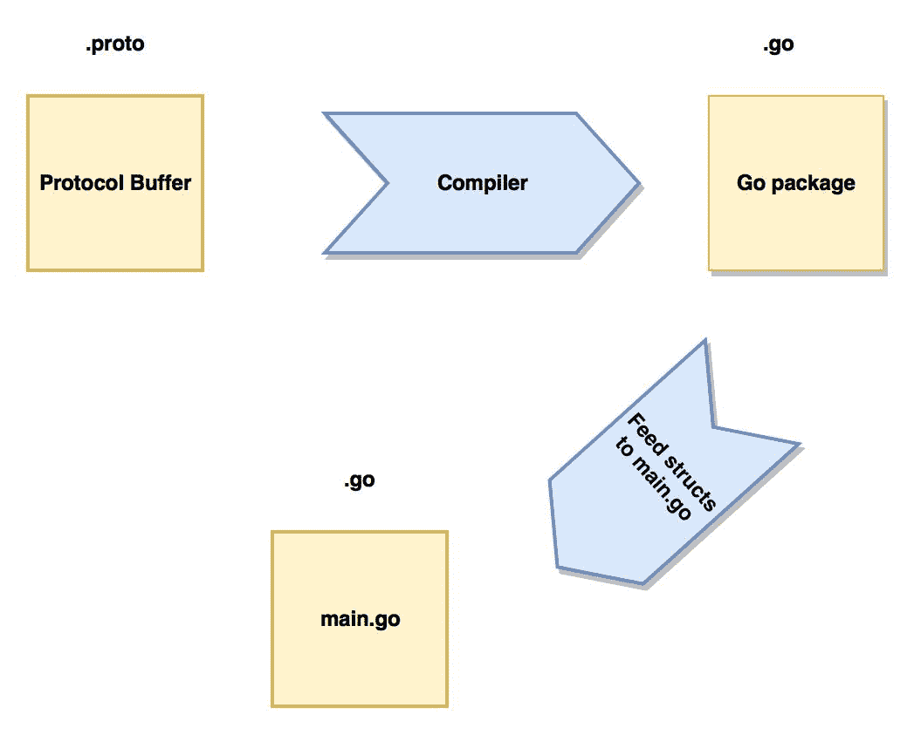

# 六、使用协议缓冲区和 GRPC

在本章中，我们将进入协议缓冲区的世界。我们将发现使用协议缓冲区而不是 JSON 的好处，以及在何处使用两者。我们将使用谷歌的`proto`库来编译协议缓冲区。我们将尝试编写一些带有协议缓冲区的 web 服务，这些缓冲区可以与 Go 或其他应用程序（如 Python、NodeJS 等）通信。然后，我们将解释 GRPC，一种高级的 RPC 简化形式。我们将学习 GRPC 和协议缓冲区如何帮助我们构建任何客户端都可以使用的服务。我们还将讨论 HTTP/2 及其相对于基于纯 HTTP/1.1 JSON 的服务的优势。

简而言之，我们将介绍以下主题：

*   协议缓冲区介绍
*   协议缓冲区的格式
*   protobuf 的编译过程
*   GRPC，一个现代 RPC 库
*   GRPC 双向流媒体

# 获取代码

您可以从[获取本章的代码示例 https://github.com/narenaryan/gorestful/tree/master/chapter6](https://github.com/narenaryan/gorestful/tree/master/chapter6) 。本章的示例是单个计划和项目的组合。因此，将相应的目录复制到您的`GOPATH`以正确运行代码示例。

# 协议缓冲区简介

HTTP/1.1 是 web 社区采用的标准。近年来，HTTP/2 由于其优点而变得越来越流行。使用 HTTP/2 的一些好处是：

*   通过 TLS（HTTPS）加密数据
*   标题压缩
*   单 TCP 连接
*   回退到 HTTP/1.1
*   来自所有主要浏览器的支持

Google 关于协议缓冲区的技术定义是：

协议缓冲区是一种灵活、高效、自动化的结构化数据序列化机制——想想 XML，它更小、更快、更简单。您只需定义一次数据的结构化方式，然后就可以使用生成的特殊源代码轻松地在各种数据流之间以及使用各种语言编写和读取结构化数据。您甚至可以更新您的数据结构，而无需中断根据“旧”格式编译的已部署程序。

在 Go 中，协议缓冲区与 HTTP/2 耦合。它们是一种类似于 JSON 的格式，但类型严格，只能从客户端到服务器理解。首先，我们将了解 protobufs（协议缓冲区的缩写形式）存在的原因以及如何使用它们。

协议缓冲区在序列化结构化数据方面比 JSON/XML 有许多优势，例如：

*   它们更简单
*   它们要小 3 到 10 倍
*   它们的速度要快 20 到 100 倍
*   它们不那么模棱两可
*   它们生成更易于编程使用的数据访问类

# 协议缓冲语言

协议缓冲区是具有最低限度语言语法的文件。我们编译一个协议缓冲区，并为编程语言生成目标文件。例如，在 Go 中，编译后的文件将是一个结构映射 protobuf 文件的`.go`文件。在 Java 中，将创建一个类文件。将协议缓冲区视为具有特定顺序的数据的框架。在进入实际代码之前，我们需要知道类型。为了使事情更简单，我将首先在协议缓冲区中显示 JSON 及其等价物。然后，我们将实现一个坚实的示例。

这里，我们将使用**proto3**作为我们的协议缓冲版本。版本略有变化，但最新版本经过改进后发布。

有许多类型的协议缓冲区元素。其中包括：

*   标量值
*   枚举
*   默认值
*   嵌套值
*   未知类型

首先，让我们看看如何在 protobuf 中定义消息类型。在这里，我们尝试定义一个简单的网络接口消息：

```go
syntax 'proto3';

message NetworkInterface {
  int index = 1;
  int mtu = 2;
  string name = 3;
  string hardwareaddr = 4;
}
```

语法可能看起来很新。在前面的代码中，我们定义了一个名为`NetworkInterface`的消息类型。**有四个字段：*索引*、*最大传输单元（MTU）*、*名称*、*硬件地址（MAC）*。如果我们希望用 JSON 编写相同的代码，它将如下所示：**

 **```go
{
   "networkInterface": {
       "index" : 0,
       "mtu" : 68,
       "name": "eth0",
       "hardwareAddr": "00:A0:C9:14:C8:29"
   }
}
```

字段名将根据 JSON 样式指南进行更改，但其本质和结构是相同的。但是，protobuf 文件中字段的序列号（1,2,3,4）是什么？它们是用于在两个系统之间序列化和反序列化协议缓冲区数据的顺序标记。这就像暗示协议缓冲区编码/解码系统分别按照特定顺序写入/读取数据。当编译前面的 protobuf 文件并生成编程语言目标时，协议缓冲区消息将转换为 Go 结构，字段将填充空的默认值。

# 标量值

我们在`networkInterface`消息中分配给字段的类型是标量类型。这些类型与 Go 类型类似，并且与它们完全匹配。对于其他编程语言，它们将被转换为各自的类型。protobuf 的设计考虑到了 Go，因此大多数类型，如`int`、`int32`、`int64`、`string`和`bool`**完全相同，但有一些不同。他们是：**

 **| **Go 型** | **原型** |
| `float32` | `float` |
| `float64` | `double` |
| `uint32` | `fixed32` |
| `uint64` | `fixed64` |
| `[]byte` | `bytes` |

在 protbuf 文件中定义消息时，应该记住这些事情。除此之外，我们还可以自由使用其他 Go 类型作为普通标量类型。**默认值**是如果用户不为这些标量值赋值，则将填充这些类型的值。我们都知道，在任何给定的编程语言中，变量都是定义和赋值的。定义为变量分配内存，赋值为变量填充一个值。类似地，我们在前面的消息中定义的标量字段将被指定默认值。让我们看看给定类型的默认值：

| **原型** | **默认值** |
| `string` | `""` |
| `bytes` | `empty bytes[]` |
| `bool` | `false` |
| `int`、`int32`、`int64`、`float`、`double` | `0` |
| `enum` | `0` |

由于协议缓冲区使用数据结构在终端系统之间达成协议，因此它们不会为 JSON 中的密钥占用额外的空间

# 枚举和重复字段

枚举提供给定元素集的数字顺序。值的默认顺序是从零到*n*。所以，在协议缓冲区消息中，我们可以有一个枚举类型。让我们看一个`enum`的示例：

```go
syntax 'proto3';

message Schedule{
  enum Days{
     SUNDAY = 0;
     MONDAY = 1;
     TUESDAY = 2;
     WEDNESDAY = 3;
     THURSDAY = 4;
     FRIDAY = 5;
     SATURDAY = 6;
  }
}
```

如果我们需要为多个枚举成员分配相同的值，该怎么办。Protobuf3 允许名为**允许别名**的选项为两个不同的成员分配相同的值。例如：

```go
enum EnumAllowingAlias {
  option allow_alias = true;
  UNKNOWN = 0;
  STARTED = 1;
  RUNNING = 1;
}
```

这里，`STARTED`和`RUNNING`都有一个`1`标签。这意味着两者在数据中可以具有相同的值。如果我们试图删除重复的值，我们还应该删除`allow_alias`**选项。否则，proto 编译器将抛出一个错误（我们将很快看到什么是 proto 编译器）。**

 **`Repeated`字段是协议缓冲区消息中表示项目列表的字段。在 JSON 中，我们有一个给定键的元素列表。类似地，重复字段允许我们定义特定类型元素的数组/列表：

```go
message Site{
   string url = 1;
   int latency = 2;
   repeated string proxies = 3;
}
```

在前面的代码中，第三个字段是重复字段，这意味着它是代理的数组/列表。该值可以是诸如`["100.104.112.10", "100.104.112.12"]`之类的内容。除了重复字段外，我们还可以使用其他消息作为类型。它类似于嵌套的 JSON。例如，请查看以下代码：

```go
{
  outerJSON: {
      outerKey1: val1,
      innerJSON: {
         innerKey1: val2
      }
  }
}
```

我们看到我们有一个嵌套的`innerJSON`**作为`outerJSON`的成员之一。我们如何在 protobufs 中对同一事物建模？我们可以使用嵌套消息来完成此操作，如以下代码所示：**

 **```go
message Site {
  string url = 1;
  int latency = 2;
  repeated Proxy proxies = 3;
}

message Proxy {
  string url = 1;
  int latency = 2;
}
```

在这里，我们将`Proxy`类型嵌套到`Site`中。我们很快就会看到所有这些类型字段的真实示例。

# 用 protoc 编译协议缓冲区

到目前为止，我们已经讨论了如何编写以前以 JSON 或其他数据格式编写的协议缓冲区文件。但是，我们实际上如何将其整合到我们的计划中呢？请记住，协议缓冲区是数据格式，仅此而已。它们是不同系统之间的通信格式，类似于 JSON。以下是我们在 Go 计划中使用 protobufs 的实际步骤：

1.  安装`protoc`命令行工具和`proto`库。
2.  编写一个扩展名为`.proto`的 protobuf 文件。
3.  将其编译为一种编程语言（这里就是了）。
4.  从生成的目标文件导入结构并序列化数据。
5.  在远程计算机上，接收序列化数据并将其解码为结构或类

请看下图：



第一步是在我们的机器上安装`protobuf`编译器。为此，请从[下载`protobuf`软件包 https://github.com/google/protobuf/releases](https://github.com/google/protobuf/releases) 。在 macOS X 上，我们可以使用以下命令安装`protobuf`：

```go
brew install protobuf
```

在 Ubuntu 或 Linux 上，我们可以将`protoc`复制到`/usr/bin`文件夹：

```go
# Make sure you grab the latest version
curl -OL https://github.com/google/protobuf/releases/download/v3.3.0/protoc-3.3.0-linux-x86_64.zip
# Unzip
unzip protoc-3.3.0-linux-x86_64.zip -d protoc3
# Move only protoc* to /usr/bin/
sudo mv protoc3/bin/protoc /usr/bin/protoc
```

在 Windows 上，我们可以从[复制可执行文件（`.exe`）https://github.com/google/protobuf/releases/download/v3.3.0/protoc-3.3.0-win32.zip](https://github.com/google/protobuf/releases/download/v3.3.0/protoc-3.3.0-win32.zip) 到`PATH`环境变量。让我们编写一个简单的协议缓冲区来说明如何从目标文件编译和使用结构。使用以下命令在`$GOPATH/src/github.com/narenaryan`中创建一个名为`protofiles`的文件夹（这是我们 Go 项目的位置）：

```go
mkdir $GOPATH/src/github.com/narenaryan/protofiles
```

在这里，创建一个名为`person.proto`的文件，该文件模拟一个人的信息。向其中添加一些消息，如以下代码段所示：

```go
syntax = "proto3";
package protofiles;

message Person {
  string name = 1;
  int32 id = 2;  // Unique ID number for this person.
  string email = 3;

  enum PhoneType {
    MOBILE = 0;
    HOME = 1;
    WORK = 2;
  }

  message PhoneNumber {
    string number = 1;
    PhoneType type = 2;
  }

  repeated PhoneNumber phones = 4;
}

// Our address book file is just one of these.
message AddressBook {
  repeated Person people = 1;
}
```

我们创建了两条主要消息，分别称为`AddressBook`和`Person`。**`AddressBook`有人员名单。A`Person`有 A`name`、`id`、`email`和`phone Number`。在第二行中，我们将包装声明为`protofiles`，如下所示：**

 **```go
package protofiles;
```

这告诉编译器添加与给定包名相关的生成文件。Go 无法直接使用此`.proto`文件。我们需要将其编译为有效的 Go 文件。编译时，此包名`protofiles`将用于设置输出文件的包（本例中为 Go）。要编译此协议缓冲区文件，请遍历到`protofiles`目录并运行以下命令：

```go
protoc --go_out=. *.proto
```

此命令将给定的协议缓冲区文件转换为具有相同名称的 Go 文件。您将看到，在运行此命令后，在同一目录中创建了一个新文件：

```go
[16:20:27] naren:protofiles git:(master*) $ ls -l
total 24
-rw-r--r-- 1 naren staff 5657 Jul 15 16:20 person.pb.go
-rw-r--r--@ 1 naren staff 433 Jul 15 15:58 person.proto
```

新文件名为`person.pb.go`。**如果我们打开并检查此文件，它包含以下重要块：**

 **```go
........
type Person_PhoneType int32

const (
  Person_MOBILE Person_PhoneType = 0
  Person_HOME   Person_PhoneType = 1
  Person_WORK   Person_PhoneType = 2
)

var Person_PhoneType_name = map[int32]string{
  0: "MOBILE",
  1: "HOME",
  2: "WORK",
}
var Person_PhoneType_value = map[string]int32{
  "MOBILE": 0,
  "HOME":   1,
  "WORK":   2,
}
.......
```

这只是该文件的一部分。在输出文件中，将为给定的结构（如`Person`和`AddressBook`）创建许多 getter 和 setter 方法。此代码是自动生成的。我们需要在主程序中使用这些代码来创建协议缓冲字符串。现在，让我们创建一个名为`protobufs`的新目录。**保存使用`person.pb.go`文件中的`Person`结构的`main.go`文件：**

 **```go
mkdir $GOPATH/src/github.com/narenaryan/protobufs
```

现在，为了将结构序列化为 protobinary 格式，我们需要安装 Go proto 驱动程序。使用`go get`命令安装：

```go
go get github.com/golang/protobuf/proto
```

在此之后，让我们组成`main.go`：

```go
package main

import (
  "fmt"

  "github.com/golang/protobuf/proto"
  pb "github.com/narenaryan/protofiles"
)

func main() {
  p := &pb.Person{
    Id:    1234,
    Name:  "Roger F",
    Email: "rf@example.com",
    Phones: []*pb.Person_PhoneNumber{
      {Number: "555-4321", Type: pb.Person_HOME},
    },
  }

  p1 := &pb.Person{}
  body, _ := proto.Marshal(p)
  _ = proto.Unmarshal(body, p1)
  fmt.Println("Original struct loaded from proto file:", p, "\n")
  fmt.Println("Marshaled proto data: ", body, "\n")
  fmt.Println("Unmarshaled struct: ", p1)
}
```

我们正在从`protofiles`包中导入**协议缓冲区**（**pb**。在`proto files.`中有映射到给定 protobuf 的结构，我们使用了`Person`结构并初始化了它。然后，我们使用`proto.Marshal`**函数序列化了该结构。如果我们运行此程序，输出如下所示：**

 **```go
go run main.go
Original struct loaded from proto file: name:"Roger F" id:1234 email:"rf@example.com" phones:<number:"555-4321" type:HOME >

Marshaled proto data: [10 7 82 111 103 101 114 32 70 16 210 9 26 14 114 102 64 101 120 97 109 112 108 101 46 99 111 109 34 12 10 8 53 53 53 45 52 51 50 49 16 1]

Unmarshaled struct: name:"Roger F" id:1234 email:"rf@example.com" phones:<number:"555-4321" type:HOME >
```

封送数据的第二个输出不是直观的，因为`proto`库将数据序列化为二进制字节。Go 中协议缓冲区的另一个优点是，通过编译 proto 文件生成的结构可以用于动态生成 JSON。让我们将前面的示例修改为这样。称之为`main_json.go`：

```go
package main

import (
  "fmt"

  "encoding/json"
  pb "github.com/narenaryan/protofiles"
)

func main() {
  p := &pb.Person{
    Id:    1234,
    Name:  "Roger F",
    Email: "rf@example.com",
    Phones: []*pb.Person_PhoneNumber{
      {Number: "555-4321", Type: pb.Person_HOME},
    },
  }
  body, _ := json.Marshal(p)
  fmt.Println(string(body))
}
```

如果我们运行它，它会打印一个 JSON 字符串，可以发送给任何能够理解 JSON 的客户端：

```go
go run main_json.go

{"name":"Roger F","id":1234,"email":"rf@example.com","phones":[{"number":"555-4321","type":1}]}
```

任何其他语言或平台都可以轻松加载此 JSON 字符串并立即使用数据。那么，使用协议缓冲区而不是 JSON 有什么好处呢？首先，协议缓冲区用于两个后端系统以较少的开销相互通信。由于二进制文件的大小小于文本，协议封送数据的大小小于 JSON。

通过使用协议缓冲区，我们将 JSON 和协议缓冲区格式映射到 Go 结构。通过动态地将一种格式转换为另一种格式，这将提供两个世界的最佳效果。

但是，协议缓冲区只是一种数据格式。如果我们不沟通，他们就不重要了。因此，在这里，协议缓冲区用于以 RPC 的形式在两个终端系统之间传递消息。在前面的章节中，我们了解了 RPC 的工作原理，并创建了一个 RPC 客户端和服务器。现在，我们将扩展这些知识，使用带有协议缓冲区的**Google 远程过程调用**（**GRPC**）来扩展我们的微服务通信。在这种情况下，服务器和客户端可以协议缓冲区格式相互通信。

# GRPC 简介

GRPC 是一种在两个系统之间发送和接收消息的传输机制。这两个系统传统上是服务器和客户端。如前几章所述，RPC 可以在 Go 中实现，用于传输 JSON。我们称之为 JSON RPC 服务。类似地，Google RPC 专门设计用于以协议缓冲区的形式传输数据

GRPC 使服务创建变得简单而优雅。它提供了一组很好的 API 来定义服务并开始运行它们。在本节中，我们将主要关注如何创建和使用 GRPC 服务。GRPC 的主要优点是可以被多种编程语言理解。协议缓冲区提供公共数据结构。因此，这种组合能够实现各种技术堆栈和系统之间的无缝通信。这是分布式计算的整体概念。

Square、Netflix 等利用 GRPC 来扩展其庞大的易受流量影响的服务。谷歌前产品经理安德鲁·杰瑟普（Andrew Jessup）在一次会议上说，在谷歌，每天处理数十亿个 GRPC 电话。如果任何商业组织需要接受谷歌的做法，它也可以通过这些服务中的调整来处理流量需求。

在编写服务之前，我们需要安装`grpc`Go 库和`protoc-gen`插件。使用以下命令安装它们：

```go
go get google.golang.org/grpc
go get -u github.com/golang/protobuf/protoc-gen-go
```

与传统的 HTTP/REST/JSON 体系结构相比，GRPC 具有以下优势：

*   GRPC 使用 HTTP/2，这是一种二进制协议
*   头压缩在 HTTP/2 中是可能的，这意味着开销更少
*   我们可以在一个连接上多路传输多个请求
*   protobufs 用于严格的数据类型化
*   可以使用请求或响应流而不是请求/响应事务

请看下图：


该图清楚地显示，任何后端系统或移动应用程序都可以通过触发协议缓冲区请求直接与 GRPC 服务器通信。让我们使用 GRPC 和协议缓冲区在 Go 中编写一个货币交易服务。这里，我们将展示如何实现客户端和服务器。这些步骤是：

1.  为服务和消息创建协议缓冲区文件。
2.  编译协议缓冲区文件。
3.  使用生成的 Go 包创建 GRPC 服务器。
4.  创建与服务器对话的 GRPC 客户端。

对于这个项目，在您的 Go 工作区中创建一个名为`datafiles`的文件夹（这里是`$GOPATH/src/github.com/narenaryan/`：

```go
mkdir grpc_example
cd grpc_example
mkdir datafiles
```

在其中创建一个名为`transaction.proto`的文件，并定义消息和服务。我们将很快了解什么是服务：

```go
syntax = "proto3";
package datafiles;

message TransactionRequest {
   string from = 1;
   string to = 2;
   float amount = 3;
}

message TransactionResponse {
  bool confirmation = 1;
}

service MoneyTransaction {
    rpc MakeTransaction(TransactionRequest) returns (TransactionResponse) {}
}
```

这是服务器上货币交易的最小协议缓冲区。我们已经在 proto 文件中看到了消息关键字。最后一个关键字`service`对我们来说是新的。`service`告诉 GRPC 将其视为服务，所有 RPC 方法都将充当实现此功能的服务器的接口。实现 Go 接口的结构应实现其所有功能。现在，让我们编译这个文件：

```go
protoc -I datafiles/ datafiles/transaction.proto --go_out=plugins=grpc:datafiles
```

此命令比我们以前使用的命令稍大。这是因为我们在这里使用的是`protoc-gen-go`插件。该命令只是说使用数据文件作为 proto 文件的输入目录，并使用相同的目录输出目标 Go 文件。现在，如果我们看到文件系统，将有两个文件：

```go
-rw-r--r-- 1 naren staff 6215 Jul 16 17:28 transaction.pb.go
-rw-r--r-- 1 naren staff 294 Jul 16 17:28 transaction.proto
```

现在，在`$GOPATH/src/github.com/narenaryan/grpc_example`中为服务器和客户端逻辑再创建两个目录。服务器实现从 proto 文件生成的接口：

```go
mkdir grpcServer grpcClient
```

现在，将名为`server.go`的文件添加到`grpcServer`目录，该目录实现了事务服务：

```go
package main

import (
  "log"
  "net"

  pb "github.com/narenaryan/grpc_example/datafiles"
  "golang.org/x/net/context"
  "google.golang.org/grpc"
  "google.golang.org/grpc/reflection"
)

const (
  port = ":50051"
)

// server is used to create MoneyTransactionServer.
type server struct{}

// MakeTransaction implements MoneyTransactionServer.MakeTransaction
func (s *server) MakeTransaction(ctx context.Context, in *pb.TransactionRequest) (*pb.TransactionResponse, error) {
  log.Printf("Got request for money Transfer....")
  log.Printf("Amount: %f, From A/c:%s, To A/c:%s", in.Amount, in.From, in.To)
  // Do database logic here....
  return &pb.TransactionResponse{Confirmation: true}, nil
}

func main() {
  lis, err := net.Listen("tcp", port)
  if err != nil {
    log.Fatalf("Failed to listen: %v", err)
  }
  s := grpc.NewServer()
  pb.RegisterMoneyTransactionServer(s, &server{})
  // Register reflection service on gRPC server.
  reflection.Register(s)
  if err := s.Serve(lis); err != nil {
    log.Fatalf("Failed to serve: %v", err)
  }
}
```

在前面的文件中发生了很多事情。首先，我们进口了所有必要的进口品。这里新的是`context`和`reflection`。**上下文用于创建一个`context`变量，该变量在 RPC 请求的生命周期内一直存在。GRPC 将这两个库用于其内部功能。**

 **在解释下一节之前，如果我们打开生成的`transaction.pb.go`文件，我们可以清楚地看到有两件重要的事情：

*   `RegisterMoneyTransactionServer`功能
*   `MakeTransaction`功能作为`MoneyTransactionServer`接口的一部分

为了实现服务，我们需要这两种东西；`MakeTransaction`用于实际服务功能，`RegisterMoneyTransactionServer`用于注册服务（即，创建一个 RPC 服务器以在端口上运行）

`MakeTransaction`的`in`变量包含 RPC 请求的详细信息。它基本上是一个映射到我们在协议缓冲文件中定义的`TransactionRequest`消息的结构。从`MakeTransaction`返回的是`TransactionResponse`。**此函数签名与我们最初在协议缓冲区文件中定义的签名匹配：**

 **```go
rpc MakeTransaction(TransactionRequest) returns (TransactionResponse) {}
```

现在，让我们编写一个客户端。我们可以用任何编程语言编写客户端（或）服务器，但在这里，我们要用 Go 编写客户端和服务器，以理解 Go GRPC API。在`grpcClient`目录中添加一个名为`client.go`的文件：

```go
package main

import (
  "log"

  pb "github.com/narenaryan/grpc_example/datafiles"
  "golang.org/x/net/context"
  "google.golang.org/grpc"
)

const (
  address = "localhost:50051"
)

func main() {
  // Set up a connection to the server.
  conn, err := grpc.Dial(address, grpc.WithInsecure())
  if err != nil {
    log.Fatalf("Did not connect: %v", err)
  }
  defer conn.Close()
  c := pb.NewMoneyTransactionClient(conn)

  // Prepare data. Get this from clients like Frontend or App
  from := "1234"
  to := "5678"
  amount := float32(1250.75)

  // Contact the server and print out its response.
  r, err := c.MakeTransaction(context.Background(), &pb.TransactionRequest{From: from,
    To: to, Amount: amount})
  if err != nil {
    log.Fatalf("Could not transact: %v", err)
  }
  log.Printf("Transaction confirmed: %t", r.Confirmation)
}
```

该客户还使用了`grpc`**软件包。它使用一个名为`context.Background()`**的空上下文传递给`MakeTransaction`**函数。函数的第二个参数是`TransactionRequest`结构：******

 ******```go
&pb.TransactionRequest{From: from, To: to, Amount: amount}
```

它清楚地映射了我们在上一节中讨论的理论。现在，让我们运行它并查看输出。打开新控制台并使用以下命令运行 GRPC 服务器：

```go
go run $GOPATH/src/github.com/narenaryan/grpc_example/grpcServer/server.go
```

TCP 服务器开始侦听端口`50051`。现在，再打开一个终端/外壳并启动与此服务器对话的客户端程序：

```go
go run $GOPATH/src/github.com/narenaryan/grpc_example/grpcClient/client.go
```

它打印成功事务的输出：

```go
2017/07/16 19:13:16 Transaction confirmed: true
```

同时，服务器将此消息记录到控制台：

```go
2017/07/16 19:13:16 Amount: 1250.750000, From A/c:1234, To A/c:5678
```

在此，客户端向 GRPC 服务器发出一个请求，并传递了`From A/c`号、`To A/c`号和`Amount`号的详细信息。服务器选择这些细节，处理它们，然后发送一个回复，说一切正常。

因为我在我的机器上运行代码示例，所以我将`narenaryan`作为[github.com](https://github.com/)下的项目目录。您可以用任何其他名称替换它。

# GRPC 双向流媒体

与传统 HTTP/1.1 相比，GRPC 的主要优势在于它使用单个 TCP 连接在服务器和客户端之间发送和接收多条消息。我们以前见过货币交易的例子。另一个实际使用案例是安装在出租车上的 GPS。在这里，taxi 是一个客户端，它将地理位置点沿其路径发送给服务器。最后，服务器可以根据点与点之间的时间和总距离计算总票价

另一个这样的用例是，每当执行某些处理时，服务器需要通知客户端。这称为服务器推送模型。当客户端只请求一次结果流时，服务器可以将结果流发回。这与轮询不同，在轮询中，客户端每次都会请求某些内容。当需要执行一系列耗时步骤时，这可能非常有用。GRPC 客户端可以将该作业升级到 GRPC 服务器。然后，服务器花时间将消息转发回客户端，客户端读取消息并执行一些有用的操作。让我们实现这一点。

此概念类似于 WebSocket，但在任何类型的平台之间。创建一个名为`serverPush`的项目：

```go
mkdir $GOPATH/src/github.com/narenaryan/serverPush
mkdir $GOPATH/src/github.com/narenaryan/serverPush/datafiles
```

现在，在`datafiles`中写入一个与前一个类似的协议缓冲区：

```go
syntax = "proto3";
package datafiles;

message TransactionRequest {
   string from = 1;
   string to = 2;
   float amount = 3;
}

message TransactionResponse {
  string status = 1;
  int32 step = 2;
  string description = 3;
}

service MoneyTransaction {
    rpc MakeTransaction(TransactionRequest) returns (stream TransactionResponse) {}
}
```

我们在协议缓冲文件中定义了两条消息和一个服务。令人兴奋的部分在于服务；我们返回的是流，而不是简单的响应：

```go
rpc MakeTransaction(TransactionRequest) returns (stream TransactionResponse) {}
```

该项目的用例是：*客户端向服务器发送汇款请求，服务器执行一些任务，并将这些步骤细节作为响应流发送回服务器*。现在，让我们编译该原型文件：

```go
protoc -I datafiles/ datafiles/transaction.proto --go_out=plugins=grpc:datafiles
```

这将在`datafiles`目录中创建一个名为`transaction.pb.go`的新文件。我们将在服务器和客户端程序中使用此文件中的定义，稍后将创建这些程序。现在，让我们编写 GRPC 服务器代码。由于引入了流，此代码与前面的示例略有不同：

```go
mkdir $GOPATH/src/github.com/narenaryan/serverPush/grpcServer
vi $GOPATH/src/github.com/narenaryan/serverPush/grpcServer/server.go
```

现在，将此程序添加到文件中：

```go
package main

import (
  "fmt"
  "log"
  "net"
  "time"

  pb "github.com/narenaryan/serverPush/datafiles"
  "google.golang.org/grpc"
  "google.golang.org/grpc/reflection"
)

const (
  port      = ":50051"
  noOfSteps = 3
)

// server is used to create MoneyTransactionServer.
type server struct{}

// MakeTransaction implements MoneyTransactionServer.MakeTransaction
func (s *server) MakeTransaction(in *pb.TransactionRequest, stream pb.MoneyTransaction_MakeTransactionServer) error {
  log.Printf("Got request for money transfer....")
  log.Printf("Amount: $%f, From A/c:%s, To A/c:%s", in.Amount, in.From, in.To)
  // Send streams here
  for i := 0; i < noOfSteps; i++ {
    // Simulating I/O or Computation process using sleep........
    // Usually this will be saving money transfer details in DB or
    // talk to the third party API
    time.Sleep(time.Second * 2)
    // Once task is done, send the successful message back to the client
    if err := stream.Send(&pb.TransactionResponse{Status: "good",
      Step:        int32(i),
      Description: fmt.Sprintf("Description of step %d", int32(i))}); err != nil {
      log.Fatalf("%v.Send(%v) = %v", stream, "status", err)
    }
  }
  log.Printf("Successfully transfered amount $%v from %v to %v", in.Amount, in.From, in.To)
  return nil
}

func main() {
  lis, err := net.Listen("tcp", port)
  if err != nil {
    log.Fatalf("Failed to listen: %v", err)
  }
  // Create a new GRPC Server
  s := grpc.NewServer()
  // Register it with Proto service
  pb.RegisterMoneyTransactionServer(s, &server{})
  // Register reflection service on gRPC server.
  reflection.Register(s)
  if err := s.Serve(lis); err != nil {
    log.Fatalf("Failed to serve: %v", err)
  }
}
```

`MakeTransaction`**是我们感兴趣的功能。它接受一个请求和一个流作为它的参数。在函数中，我们循环执行步骤数（这里是三个），并执行计算。服务器正在使用`time.Sleep`**功能模拟模拟模拟 I/O 或计算：****

 ****```go
stream.Send()
```

此函数用于从服务器向客户端发送流响应。现在，让我们编写客户端程序。这与我们在前面代码中看到的基本 GRPC 客户端也有点不同。为客户端程序创建新目录：

```go
mkdir $GOPATH/src/github.com/narenaryan/serverPush/grpcClient
vi $GOPATH/src/github.com/narenaryan/serverPush/grpcClient/cilent.go
```

现在，开始在该文件中写入客户端逻辑：

```go
package main

import (
  "io"
  "log"

  pb "github.com/narenaryan/serverPush/datafiles"
  "golang.org/x/net/context"
  "google.golang.org/grpc"
)

const (
  address = "localhost:50051"
)

// ReceiveStream listens to the stream contents and use them
func ReceiveStream(client pb.MoneyTransactionClient, request *pb.TransactionRequest) {
  log.Println("Started listening to the server stream!")
  stream, err := client.MakeTransaction(context.Background(), request)
  if err != nil {
    log.Fatalf("%v.MakeTransaction(_) = _, %v", client, err)
  }
  // Listen to the stream of messages
  for {
    response, err := stream.Recv()
    if err == io.EOF {
      // If there are no more messages, get out of loop
      break
    }
    if err != nil {
      log.Fatalf("%v.MakeTransaction(_) = _, %v", client, err)
    }
    log.Printf("Status: %v, Operation: %v", response.Status, response.Description)
  }
}

func main() {
  // Set up a connection to the server.
  conn, err := grpc.Dial(address, grpc.WithInsecure())
  if err != nil {
    log.Fatalf("Did not connect: %v", err)
  }
  defer conn.Close()
  client := pb.NewMoneyTransactionClient(conn)

  // Prepare data. Get this from clients like Front-end or Android App
  from := "1234"
  to := "5678"
  amount := float32(1250.75)

  // Contact the server and print out its response.
  ReceiveStream(client, &pb.TransactionRequest{From: from,
    To: to, Amount: amount})
}
```

这里，`ReceiveStream`**是我们为发送请求和接收消息流而编写的自定义函数。它有两个参数：`MoneyTransactionClient`**和`TransactionRequest`。**它使用第一个参数创建一个流并开始侦听它。每当服务器耗尽所有消息时，客户端将停止侦听并终止。然后，如果客户端尝试接收消息，将返回一个`io.EOF`错误。我们正在记录从 GRPC 服务器收集的响应。第二个参数`TransactionRequest`、**用于第一次向服务器发送请求。现在，运行它会让我们更清楚。在终端 1 上，运行 GRPC 服务器：********

 ******```go
go run $GOPATH/src/github.com/narenaryan/serverPush/grpcServer/server.go
```

它将继续侦听传入的请求。现在，在第二个终端上运行客户端以查看操作：

```go
go run $GOPATH/src/github.com/narenaryan/serverPush/grpcClient/client.go
```

这将向控制台输出以下内容：

```go
2017/07/16 15:08:15 Started listening to the server stream!
2017/07/16 15:08:17 Status: good, Operation: Description of step 0
2017/07/16 15:08:19 Status: good, Operation: Description of step 1
2017/07/16 15:08:21 Status: good, Operation: Description of step 2
```

同时，服务器还将自己的消息记录在终端一上：

```go
2017/07/16 15:08:15 Got request for money Transfer....
2017/07/16 15:08:15 Amount: $1250.750000, From A/c:1234, To A/c:5678
2017/07/16 15:08:21 Successfully transfered amount $1250.75 from 1234 to 5678
```

此过程与服务器同步进行。客户端将保持活动状态，直到所有流式消息被发回。服务器可以在给定时间处理任意数量的客户端。每个客户端请求都被视为一个单独的实体。这是服务器发送响应流的示例。还可以使用协议缓冲区和 GRPC 实现其他情况：

*   客户端发送流式请求以从服务器获取一个最终响应
*   客户端和服务器同时发送流式请求和响应

GRPC 官方团队提供了一个在 GitHub 上安排出租车路线的好例子。您可以在
[了解更多关于双向流功能的信息 https://github.com/grpc/grpc-go/tree/master/examples/route_guide](https://github.com/grpc/grpc-go/tree/master/examples/route_guide) 。

# 总结

在本章中，我们通过了解协议缓冲区的基础知识开始了我们的旅程。然后，我们遇到了 ProtocolBuffers 语言，它有许多类型，如标量、枚举和重复类型。我们看到了 JSON 和协议缓冲区之间的一些类似之处。我们了解了为什么协议缓冲区比普通 JSON 数据格式更节省内存。我们通过模拟网络接口定义了一个示例协议缓冲区。`message`**关键字用于定义协议缓冲区中的消息。**

 **接下来，我们安装了`protoc`编译器来编译用协议缓冲区语言编写的文件。然后，我们看到了如何编译一个`.proto`文件来生成一个`.go`文件。这个 Go 文件包含主程序要使用的所有结构和接口。接下来，我们为地址簿和个人编写了一个协议缓冲区。**我们了解了如何使用`grpc.Marshal`**将 Go 结构序列化为二进制可传输数据。我们还发现，在 Go 中，从协议缓冲区到 JSON 的转换非常容易实现，反之亦然****

 ****然后我们转向 GRPC，这是一种使用协议缓冲区的 RPC 技术。我们看到了 HTTP/2 和 GRPC 的好处。然后，我们以协议缓冲区的形式定义了 GRPC 服务和数据。接下来，我们针对`.proto`生成的文件实现了 GRPC 服务器和 GRPC

GRPC 提供双向和多路传输机制。这意味着它可以对所有消息传输使用单个 TCP 连接。我们实现了这样一个场景：客户端向服务器发送消息，服务器用消息流回复。******************************************