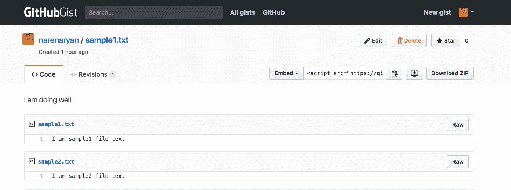
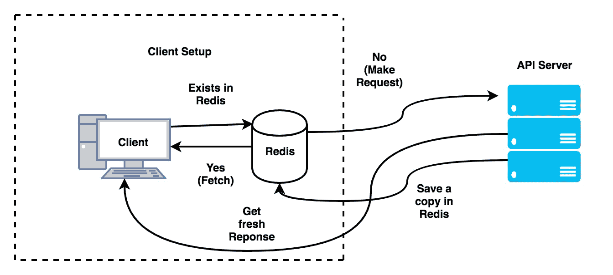

# 在 Go 和单元测试中构建 restapi 客户机

在本章中，我们将深入讨论 Go 客户端应用程序是如何工作的。我们将探索`grequests`，这是一个 Python 请求样式库，允许我们从 Go 代码进行 API 调用。然后，我们将编写一个使用 GitHub API 的客户端软件。在此过程中，我们将尝试了解两个名为`cli`和`cobra`的精彩库。**在这些基础知识之后，我们将尝试使用这些知识在命令行上编写一个 API 测试工具。然后我们将了解 Redis，一个内存中的数据库，我们可以使用它缓存 API 响应以备份数据。**

 **在本章中，我们将介绍以下主题：

*   什么是客户端软件？
*   在 Go 中编写命令行工具的基础知识
*   介绍`grequests`，一个类似于 Go 中的库的 Python 请求
*   从 Go 客户端检查 GitHub REST API
*   在 Go 中创建 API 客户端
*   缓存 API 以供以后使用
*   为 API 创建单元测试工具

# 获取代码

您可以通过 GitHub 存储库链接[获取本章的代码示例 https://github.com/narenaryan/gorestful/tree/master/chapter8](https://github.com/narenaryan/gorestful/tree/master/chapter8) 。本章有一些示例，它们是单个程序和项目的组合。因此，将相应的目录复制到您的`GOPATH`以正确运行代码示例。对于单元测试 URL 缩短服务的最后一个示例，测试可在[上获得 https://github.com/narenaryan/gorestful/tree/master/chapter7](https://github.com/narenaryan/gorestful/tree/master/chapter7) 。

# 构建 RESTAPI 客户端的计划

到目前为止，我们主要专注于编写服务器端 RESTAPI。基本上，它们是服务器程序。在少数情况下，例如 GRPC，我们也需要客户机。但是真正的客户端程序从用户那里获取输入并执行一些逻辑。为了与 Go 客户合作，我们应该了解 Go 中的`flag`库。在此之前，我们应该知道如何从 Go 程序请求 API。在前面的章节中，我们假设客户机可以是 CURL、Browser、Postman 等等。但是我们如何使用 Go 的 API 呢？

命令行工具与执行系统任务的 web 用户界面一样重要。在**企业对企业**（**B2B**公司中，软件被打包为单个二进制文件，而不是多个不同的部分。作为 Go 开发人员，您应该知道如何实现为命令行编写应用程序的目标。然后，可以利用这些知识轻松优雅地创建 RESTAPI 相关的 web 客户机。

# 在 Go 中编写命令行工具的基础知识

Go 提供了一个名为`flag`的基本库。它指的是命令行标志。因为它已经打包了 Go 发行版，所以不需要在外部安装任何东西。我们可以看到编写命令行工具的绝对基础。`flag`**包有`Int`和`String`等多个功能，用于处理作为命令行标志给出的输入。假设我们需要从用户那里获取一个名称并打印回控制台。我们使用`flag.String`**方法，如下代码片段所示：****

 ****```go
import "flag"
var name = flag.String("name", "No Namer", "your wonderful name")
```

让我们写一个简短的程序来了解清楚的细节。在`$GOPATH/src/github.com/narenaryan`中创建一个名为`flagExample.go`**的文件，并添加以下内容：**

 **```go
package main

import (
  "flag"
  "log"
  )

var name = flag.String("name", "stranger", "your wonderful name")

func main(){
  flag.Parse()
  log.Printf("Hello %s, Welcome to the command line world", *name)
}
```

在这个程序中，我们正在创建一个名为`name`的标志。它是一个字符串指针。`flag.String`**接受三个参数。第一个是参数的名称。第二个和第三个分别是该标志和帮助文本的默认值。然后，我们要求程序解析所有标志指针。当我们运行程序时，它实际上会将命令行中的值填充到相应的变量中。要访问指针的值，我们使用`*`。首先使用以下命令生成并运行程序：**

 **```go
go build flagExample.go
```

这将在同一目录中创建一个二进制文件。我们可以像正常的可执行文件一样运行它：

```go
./flagExample
```

它给出以下输出：

```go
Hello stranger, Welcome to the command line world
```

在这里，我们没有给出任何称为`name`的论点。但是我们已经为这个参数指定了默认值。Go 的标志采用默认值并继续。现在，为了查看哪些选项可用并了解它们，请寻求帮助：

```go
./flagExample -h

Output
========
Usage of ./flagExample:
 -name string
 your wonderful name (default "stranger") 
```

这就是我们将帮助文本作为 flag 命令的第三个参数传递的原因。

在 Windows 中，构建`.go`文件时会生成`flagExample.exe`。之后，从命令行，我们可以通过调用程序名来运行程序。

现在尝试添加参数，它将打印给定的名称：

```go
./flagExample -name Albert
(or)
./flagExample -name=Albert
```

这两个参数都可以很好地作为参数来提供输出：

```go
Hello Albert, Welcome to the command line world
```

如果我们需要收集多个参数，我们需要将前面的程序修改为：

```go
package main

import (
  "flag"
  "log"
  )

var name = flag.String("name", "stranger", "your wonderful name")
var age = flag.Int("age", 0, "your graceful age")

func main(){
  flag.Parse()
  log.Printf("Hello %s (%d years), Welcome to the command line world", *name, *age)
}
```

这需要两个参数，只需再添加一个不同类型的参数。如果运行此命令，我们将看到输出：

```go
./flagExampleMultiParam -name Albert -age 24

Hello Albert (24 years), Welcome to the command line world
```

这正是我们所期望的。我们可以将变量绑定到解析的输出，而不是使用指针。此绑定通过`init()`**函数完成，该函数将在 Go 程序中运行，无论 main 是否存在：**

 **```go
var name String 
func init() {
  flag.IntVar(&name, "name", "stranger", "your wonderful name")
}
```

这样，值将直接出现并位于变量中。使用`init()`函数完全重写前面的程序，如以下代码段所示：

`initFlag.go`:

```go
package main

import (
  "flag"
  "log"
  )

var name string
var age int

func init() {
  flag.StringVar(&name, "name", "stranger", "your wonderful name")
  flag.IntVar(&age, "age", 0, "your graceful age")
}

func main(){
  flag.Parse()
  log.Printf("Hello %s (%d years), Welcome to the command line world", name, age)
}
```

输出与前面的程序完全相同。在这里，我们可以直接将数据加载到变量中，而不是使用指针。

在 Go 中，执行从主程序开始。但是 Go 程序可以有任意数量的`init`功能。如果包中有一个`init`函数，则将执行该函数。

这个`flag`**库是非常基础的工作。但是为了编写高级客户机应用程序，我们需要得到库的帮助。在下一节中，我们将介绍这样一个库。**

 **# CLI–用于构建漂亮客户端的库

这是 Go 开发者在使用`flag`**包之后的下一步。它为轻松创建命令行应用程序提供了直观的 API。它允许我们收集参数和标志。对于设计复杂的应用程序来说，它可能非常方便。要安装软件包，请使用以下命令：**

 **```go
go get github.com/urfave/cli
```

然后，让我们编写一个程序，该程序的工作与前面的程序完全相同：

`cli/cliBasic.go`：

```go
package main

import (
  "log"
  "os"

  "github.com/urfave/cli"
)

func main() {
  // Create new app
  app := cli.NewApp()

  // add flags with three arguments
  app.Flags = []cli.Flag {
    cli.StringFlag{
      Name: "name",
      Value: "stranger",
      Usage: "your wonderful name",
    },
    cli.IntFlag{
      Name: "age",
      Value: 0,
      Usage: "your graceful age",
    },
  }
  // This function parses and brings data in cli.Context struct
  app.Action = func(c *cli.Context) error {
    // c.String, c.Int looks for value of given flag
    log.Printf("Hello %s (%d years), Welcome to the command line world", c.String("name"), c.Int("age"))
    return nil
  }
  // Pass os.Args to cli app to parse content
  app.Run(os.Args)
}
```

这比以前的要长，但更具表现力。我们使用`cli.NewApp`功能创建了一个新的应用程序。它创建了一个新的结构。我们需要将一些参数附加到此结构。它们是`Flags`结构和`Action`函数。`Flags`**结构是定义此应用程序所有可能标志的列表。来自**GoDoc**（[的`Flag`**的结构 https://godoc.org/github.com/urfave/cli#Flag**](https://godoc.org/github.com/urfave/cli#Flag) ****为：******

 ******```go
type Flag interface {
    fmt.Stringer
    // Apply Flag settings to the given flag set
    Apply(*flag.FlagSet)
    GetName() string
}
```

内置结构，如`StringFlag`和`IntFlag`实现了这个`Flag`接口。`Name`、`Value`和`Usage`都很简单。它们与`flag`包装中使用的类似。`Action`函数接受参数`cli.Context`。**该上下文对象保存有关标志和命令行参数的所有信息。我们可以使用它们并对其应用逻辑。`c.String`、`c.Int`等函数用于查找标志变量。例如，在前面的程序中，`c.String("name")`获取一个名为`name`的标志变量。此程序与以前的程序运行相同：**

 **```go
go build cli/cliBasic.go
```

# 在 CLI 中收集命令行参数

命令行参数和标志之间存在差异。下图明确说明了它们之间的区别：


假设我们有一个名为 storeMarks 的命令行应用程序，用于保存学生的分数。它有一个标记（称为`save`），用于指定是否应将详细信息推送到 DB。给出的参数是学生的姓名和实际分数。我们已经了解了如何在程序中收集标志值。在本节中，我们将看到如何以表达的方式收集程序参数。

为了收集参数，我们使用了`c.Args`**函数，其中`c`是`Action`函数的`cli`上下文。创建一个名为`cli`的目录，并添加一个新程序`cli/storeMarks.go`：**

 **```go
package main

import (
  "github.com/urfave/cli"
  "log"
  "os"
)

func main() {
  app := cli.NewApp()
  // define flags
  app.Flags = []cli.Flag{
    cli.StringFlag{
      Name:  "save",
      Value: "no",
      Usage: "Should save to database (yes/no)",
    },
  }

  app.Version = "1.0"
  // define action
  app.Action = func(c *cli.Context) error {
    var args []string
    if c.NArg() > 0 {
      // Fetch arguments in a array
      args = c.Args()
      personName := args[0]
      marks := args[1:len(args)]
      log.Println("Person: ", personName)
      log.Println("marks", marks)
    }
    // check the flag value
    if c.String("save") == "no" {
      log.Println("Skipping saving to the database")
    } else {
      // Add database logic here
      log.Println("Saving to the database", args)
    }
    return nil
  }

  app.Run(os.Args)
}
```

`c.Args`**保留我们输入的所有参数。因为我们知道参数的顺序，所以我们推断第一个参数是名称，其余的值是标记。我们正在检查一个名为`save`的标志，以将这些详细信息是否保存在数据库中（为了简单起见，我们这里没有数据库逻辑）。`app.Version`设置工具的版本。所有其他内容与上一个程序保持相同。**

 **让我们运行此程序并查看输出：

```go
go build cli/storeMarks.go
```

运行程序：

```go
./storeMarks --save=yes Albert 89 85 97

2017/09/02 21:02:02 Person: Albert
2017/09/02 21:02:02 marks [89 85 97]
2017/09/02 21:02:02 Saving to the database [Albert 89 85 97]
```

如果我们没有给出任何标志，默认为`save=no`：

```go
./storeMarks Albert 89 85 97

2017/09/02 21:02:59 Person: Albert
2017/09/02 21:02:59 marks [89 85 97]
2017/09/02 21:02:59 Skipping saving to the database
```

到目前为止，一切看起来都很好。但是，当用户需要时，该工具如何显示帮助？`cli`**库已经为给定的应用程序创建了一个很好的帮助部分。键入以下任何命令，将自动生成帮助文本：**

 ***   `./storeMarks -h`（或）
*   `./storeMarks -help`（或）
*   `./storeMarks --help`
*   `./storeMarks help`

此时会出现一个很好的帮助部分，如下所示，其中显示了版本详细信息和可用标志（全局选项）、命令和参数：

```go
NAME:
 storeMarks - A new cli application

USAGE:
 storeMarks [global options] command [command options] [arguments...]

VERSION:
 1.0

COMMANDS:
 help, h Shows a list of commands or help for one command

GLOBAL OPTIONS:
 --save value Should save to database (yes/no) (default: "no")
 --help, -h show help
 --version, -v print the version
```

这实际上使构建客户端应用程序变得更容易。它比内部的`flag`**包更快、更直观。**

 **命令行工具是生成程序后生成的二进制文件。它们需要与选项一起运行。它和任何系统程序一样，不再与 Go 编译器相关

# grequests–用于 Go 的 restapi 包

从事 Python 工作的开发人员都知道`Requests`**库。它是一个干净、简短的库，不包含在 Python 的标准库中。围棋套装`grequests`**的灵感来自于该图书馆。它提供了一组简单的函数，使用这些函数我们可以从我们的 Go 代码中发出 API 请求，例如`GET`、`POST`、`PUT`和`DELETE`**。使用`grequests`可以封装内置的 HTTP 请求和响应。要为您的 Go 安装`grequests`软件包，请运行以下命令：******

 ******```go
go get -u github.com/levigross/grequests
```

现在，请看这个演示如何使用`grequests`库向 RESTAPI 发出`GET`请求的基本程序。在 Go 源目录中创建一个名为`grequests`的目录，并添加一个名为`basicRequest.go`的文件，如下面的代码段所示：

```go
package main

import (
  "github.com/levigross/grequests"
  "log"
)

func main() {
  resp, err := grequests.Get("http://httpbin.org/get", nil)
  // You can modify the request by passing an optional RequestOptions struct
  if err != nil {
    log.Fatalln("Unable to make request: ", err)
  }
  log.Println(resp.String())
}
```

`grequests`包具有执行所有 REST 操作的方法。前面的程序使用包中的`Get`**函数。它需要两个函数参数。第一个是 API 的 URL，第二个是请求参数对象。因为我们没有传递任何请求参数，所以第二个参数是`nil`。`resp`**是从请求返回的，它有一个名为`String()`**的函数返回响应体：******

 ******```go
go run grequests/basicRequest.go
```

输出为`httpbin`返回的 JSON 响应：

```go
{
  "args": {},
  "headers": {
    "Accept-Encoding": "gzip",
    "Connection": "close",
    "Host": "httpbin.org",
    "User-Agent": "GRequests/0.10"
  },
  "origin": "116.75.82.9",
  "url": "http://httpbin.org/get"
}
```

# grequests 的 API 概述

在`grequests`中要探索的最重要的不是 HTTP 函数，而是`RequestOptions`结构。它是一个非常大的结构，包含关于 API 方法类型的各种信息。如果剩余方法为`GET`，则`RequestOptions`持有`Params`**属性。如果方法是`POST`，则结构将具有`Data`属性。无论何时提出请求，我们都会得到回复。让我们看看反应的结构。根据官方文件，响应如下所示：**

 **```go
type Response struct {
    Ok bool
    Error error
    RawResponse *http.Response
    StatusCode int
    Header http.Header
}
```

response 的`Ok`**属性保存请求是否成功的信息。如果出现错误，将在`Error`属性中填充错误。`RawResponse`是`grequests`响应的其他功能将使用的 Go HTTP 响应。`StatusCode`和`Header`分别存储响应和标题详细信息的状态代码。`Response`中有几个有用的功能：**

 ***   JSON
*   XML
*   一串
*   字节

通过将空接口传递给函数-`grequests/jsonRequest.go`，可以对获得的响应调用这些函数：

```go
package main

import (
  "github.com/levigross/grequests"
  "log"
)

func main() {
  resp, err := grequests.Get("http://httpbin.org/get", nil)
  // You can modify the request by passing an optional RequestOptions struct
  if err != nil {
    log.Fatalln("Unable to make request: ", err)
  }
  var returnData map[string]interface{}
  resp.JSON(&returnData)
  log.Println(returnData)

}
```

我们声明了一个接口来保存 JSON 值。然后我们使用`resp.JSON`**函数填充`returnData`（空接口）。这个程序打印地图而不是普通的 JSON。**

 **# 熟悉 GitHub REST API

GitHub 提供了一个编写良好的 RESTAPI，供用户使用。它通过 API 向客户机打开有关用户、存储库、存储库统计信息等的数据。当前稳定版本为 v3。API 文档可在[中找到 https://developer.github.com/v3/](https://developer.github.com/v3/) 。API 的根端点是：

```go
curl https://api.github.com
```

其他 API 将添加到此基础 API。现在让我们看看如何进行一些查询并获取与各种元素相关的数据。对于未经验证的用户，费率限制为 60/小时，而对于通过`client_id`（可以从 GitHub 帐户获得）的客户，费率限制为 5000/小时。

如果您有 GitHub 帐户（如果没有，建议您创建一个），您可以在您的个人资料|个人访问令牌区域或通过访问[找到访问令牌 https://github.com/settings/tokens](https://github.com/settings/tokens) 。使用生成新令牌**按钮创建新的访问令牌。它要求对资源的类型具有各种权限。全部勾选。将生成一个新字符串。把它保存到某个私人的地方。我们生成的令牌可用于访问 GitHub API（用于更长的速率限制）。**

 **下一步是将该访问令牌保存到环境变量**`GITHUB_TOKEN`**中。为此，请打开您的**`~/.profile`**或**`~/.bashrc`**文件，并将其添加为最后一行：

```go
export GITHUB_TOKEN=YOUR_GITHUB_ACCESS_TOKEN
```

`YOUR_GITHUB_ACCESS_TOKEN`是以前从 GitHub 帐户生成并保存的内容。让我们创建一个程序来获取给定用户的所有回购。创建一个名为`githubAPI`**的新目录，并创建一个名为`getRepos.go`的程序文件：**

 **```go
package main

import (
  "github.com/levigross/grequests"
  "log"
  "os"
)

var GITHUB_TOKEN = os.Getenv("GITHUB_TOKEN")
var requestOptions = &grequests.RequestOptions{Auth: []string{GITHUB_TOKEN, "x-oauth-basic"}}

type Repo struct {
  ID int `json:"id"`
  Name string `json:"name"`
  FullName string  `json:"full_name"`
  Forks int `json:"forks"`
  Private bool `json:"private"`
}

func getStats(url string) *grequests.Response{
  resp, err := grequests.Get(url, requestOptions)
  // You can modify the request by passing an optional RequestOptions struct
  if err != nil {
    log.Fatalln("Unable to make request: ", err)
  }
  return resp
}

func main() {
  var repos []Repo
  var repoUrl = "https://api.github.com/users/torvalds/repos"
  resp := getStats(repoUrl)
  resp.JSON(&repos)
  log.Println(repos)
}
```

运行该程序，您将看到以下输出：

```go
2017/09/03 17:59:41 [{79171906 libdc-for-dirk torvalds/libdc-for-dirk 10 false} {2325298 linux torvalds/linux 18274 false} {78665021 subsurface-for-dirk torvalds/subsurface-for-dirk 16 false} {86106493 test-tlb torvalds/test-tlb 25 false}]
```

打印的输出不是 JSON，而是 Go Repo`struct`的列表。前面的程序说明了如何查询 GitHub API 并将数据加载到自定义结构中：

```go
type Repo struct {
  ID int `json:"id"`
  Name string `json:"name"`
  FullName string  `json:"full_name"`
  Forks int `json:"forks"`
  Private bool `json:"private"`
}
```

这是用于保存存储库详细信息的结构。返回的 JSON 有很多字段，但为了简单起见，我们只是从中提取了几个重要字段：

```go
var GITHUB_TOKEN = os.Getenv("GITHUB_TOKEN")
var requestOptions = &grequests.RequestOptions{Auth: []string{GITHUB_TOKEN, "x-oauth-basic"}}
```

在第一行中，我们获取名为`GITHUB_TOKEN`的环境变量。`os.Getenv`**函数按给定名称返回环境变量的值。为了让 GitHub 承担`GET`请求的来源，我们应该设置身份验证。为此，将一个参数传递给`RequestOptions`结构。该参数应该是用户名和密码的列表。**

 **# 创建 CLI 工具作为 GitHub REST API 的 API 客户端

在看了这个示例之后，我们能够从 Go 客户端轻松访问 GitHub API。到目前为止，我们可以将本章学到的这两种技术结合起来，生成一个使用 GitHub API 的命令行工具。让我们创建一个新的命令行应用程序，它：

*   提供按用户名获取回购详细信息的选项
*   使用给定的描述将任何文件上载到 GitHub gists（文本片段）
*   使用个人访问令牌进行身份验证

GIST 是 GitHub 提供的用于存储文本内容的代码段。欲了解更多详情，请访问[https://gist.github.com](https://gist.github.com) 。

在`githubAPI`目录中创建一个名为**`gitTool.go`**的程序。这将是上述程序规范的逻辑：

```go
package main

import (
  "encoding/json"
  "fmt"
  "github.com/levigross/grequests"
  "github.com/urfave/cli"
  "io/ioutil"
  "log"
  "os"
)

var GITHUB_TOKEN = os.Getenv("GITHUB_TOKEN")
var requestOptions = &grequests.RequestOptions{Auth: []string{GITHUB_TOKEN, "x-oauth-basic"}}

// Struct for holding response of repositories fetch API
type Repo struct {
  ID       int    `json:"id"`
  Name     string `json:"name"`
  FullName string `json:"full_name"`
  Forks    int    `json:"forks"`
  Private  bool   `json:"private"`
}

// Structs for modelling JSON body in create Gist
type File struct {
  Content string `json:"content"`
}

type Gist struct {
  Description string          `json:"description"`
  Public      bool            `json:"public"`
  Files       map[string]File `json:"files"`
}

// Fetches the repos for the given Github users
func getStats(url string) *grequests.Response {
  resp, err := grequests.Get(url, requestOptions)
  // you can modify the request by passing an optional RequestOptions struct
  if err != nil {
    log.Fatalln("Unable to make request: ", err)
  }
  return resp
}

// Reads the files provided and creates Gist on github
func createGist(url string, args []string) *grequests.Response {
  // get first teo arguments
  description := args[0]
  // remaining arguments are file names with path
  var fileContents = make(map[string]File)
  for i := 1; i < len(args); i++ {
    dat, err := ioutil.ReadFile(args[i])
    if err != nil {
      log.Println("Please check the filenames. Absolute path (or) same directory are allowed")
      return nil
    }
    var file File
    file.Content = string(dat)
    fileContents[args[i]] = file
  }
  var gist = Gist{Description: description, Public: true, Files: fileContents}
  var postBody, _ = json.Marshal(gist)
  var requestOptions_copy = requestOptions
  // Add data to JSON field
  requestOptions_copy.JSON = string(postBody)
  // make a Post request to Github
  resp, err := grequests.Post(url, requestOptions_copy)
  if err != nil {
    log.Println("Create request failed for Github API")
  }
  return resp
}

func main() {
  app := cli.NewApp()
  // define command for our client
  app.Commands = []cli.Command{
    {
      Name:    "fetch",
      Aliases: []string{"f"},
      Usage:   "Fetch the repo details with user. [Usage]: goTool fetch user",
      Action: func(c *cli.Context) error {
        if c.NArg() > 0 {
          // Github API Logic
          var repos []Repo
          user := c.Args()[0]
          var repoUrl = fmt.Sprintf("https://api.github.com/users/%s/repos", user)
          resp := getStats(repoUrl)
          resp.JSON(&repos)
          log.Println(repos)
        } else {
          log.Println("Please give a username. See -h to see help")
        }
        return nil
      },
    },
    {
      Name:    "create",
      Aliases: []string{"c"},
      Usage:   "Creates a gist from the given text. [Usage]: goTool name 'description' sample.txt",
      Action: func(c *cli.Context) error {
        if c.NArg() > 1 {
          // Github API Logic
          args := c.Args()
          var postUrl = "https://api.github.com/gists"
          resp := createGist(postUrl, args)
          log.Println(resp.String())
        } else {
          log.Println("Please give sufficient arguments. See -h to see help")
        }
        return nil
      },
    },
  }

  app.Version = "1.0"
  app.Run(os.Args)
}
```

让我们先运行程序，然后再开始详细解释。它清楚地说明了我们是如何实施该计划的：

```go
go build githubAPI/gitTool.go
```

它在同一目录中创建一个二进制文件。如果您输入`./gitTool -h`，则显示：

```go
NAME:
 gitTool - A new cli application

USAGE:
 gitTool [global options] command [command options] [arguments...]

VERSION:
 1.0

COMMANDS:
 fetch, f Fetch the repo details with user. [Usage]: goTool fetch user
 create, c Creates a gist from the given text. [Usage]: goTool name 'description' sample.txt
 help, h Shows a list of commands or help for one command

GLOBAL OPTIONS:
 --help, -h show help
 --version, -v print the version
```

如果您看到帮助命令，则有两个命令，`fetch`和`create`。`fetch`获取给定用户的存储库，`create`使用提供的文件创建一个`gist`。让我们在程序的同一目录中创建两个示例文件来测试`create`命令：

```go
echo 'I am sample1 file text' > githubAPI/sample1.txt
echo 'I am sample2 file text' > githubAPI/sample2.txt
```

使用第一个命令运行该工具：

```go
./gitTool f torvalds
```

它返回属于伟大的 Linus Torvalds 的所有存储库。**日志消息打印填写的结构：**

 **```go
[{79171906 libdc-for-dirk torvalds/libdc-for-dirk 10 false} {2325298 linux torvalds/linux 18310 false} {78665021 subsurface-for-dirk torvalds/subsurface-for-dirk 16 false} {86106493 test-tlb torvalds/test-tlb 25 false}]
```

现在，让我们检查第二个命令。它创建具有给定描述和一组文件作为参数的`gist`：

```go
./gitTool c "I am doing well" sample1.txt sample2.txt
```

它返回关于创建的`gist`的 JSON 详细信息。这是一个非常长的 JSON，因此这里跳过了输出。然后，打开您的[gist.github.com](https://gist.github.com/)账户，您将看到创建的`gist`：



现在来解释一下，我们首先导入`grequests`**进行 API 调用，导入`cli`**构建命令行工具。其他导入是读取文件、登录到控制台和编码 JSON 所必需的。然后我们定义了三个结构：`Repo`、`File`和`Gist`。GitHub`gists`API 需要一个 JSON 数据来创建：****

 ****```go
{
  "description": "the description for this gist",
  "public": true,
  "files": {
    "file1.txt": {
      "content": "String file contents"
    }
  }
}
```

`grequests``POST`请求将具有`Data`的`requestOptions`作为字段。但是它的签名是`Map[string]string]`、**，这不足以创建前面的结构。`grequests`**允许我们将任何结构的 JSON 字符串传递给 API。我们创建了结构，这样数据就可以被填充并编组成适当的 JSON，以使`POST`请求成功。****

 ****然后，我们创建了两个函数：`getStats`（返回给定用户的所有回购详细信息）和`createGist`（创建具有给定描述和文件名的新`gist`文件）。第二个函数更有趣。我们正在以`args`**数组的形式传递`POST`请求、描述和`file_names`的 URL。然后，我们对每个文件进行迭代并获取内容。我们正在调整结构，以便`POST`请求的最终 JSON 正文将位于相同的结构中。最后，我们正在使用包含 JSON 的**`requestOptions`**发出`POST`请求。**

 **通过这种方式，我们结合了这两个库来构建一个可以执行任何任务的 API 客户机。Go 的美妙之处在于，我们可以发布最终的二进制文件，命令行工具的逻辑和调用逻辑的 restapi 都被隐藏在其中。

要让任何围棋程序很快阅读和理解，请遵循`main`功能，然后进入其他功能。这样，我们就可以看到导入的包及其 API。

# 使用 Redis 缓存 API 数据

**Redis**是一个内存中的数据库，可以存储键/值对。它最适合于需要临时存储信息但流量巨大的缓存用例。例如，BBC 和《卫报》等网站在仪表板上显示最新文章。他们的流量非常高，如果从数据库中获取文档（文章），他们需要始终维护一个庞大的数据库集群。由于给定的文章集不会改变（至少在几个小时内），BBC 可以维护一个缓存来保存文章。当第一个客户访问该页面时，将从数据库中提取一份副本，发送到浏览器，并将其放入 Redis 缓存中。下次客户出现时，BBC 应用服务器将从 Redis 读取内容，而不是转到 DB。由于 Redis 在主内存中运行，因此延迟减少。客户看到他的页面在 flash 中加载。web 上的基准测试可以更多地说明网站优化内容的效率。

如果数据在 Redis 中不再相关怎么办？（例如，英国广播公司更新了它的头条新闻。）Redis 提供了一种使存储在其中的`keys:values`过期的方法。我们可以运行一个调度程序，每当过期时间过去时更新 Redis。

类似地，我们可以缓存给定请求的第三方 API 响应（`GET`。我们需要这样做，因为像 GitHub 这样的第三方系统给了我们一个利率限制（告诉我们要保守）。对于给定的`GET URL`，我们可以将`URL`存储为键，将`Response`存储为值。无论何时在下一次（密钥到期之前）发出相同的请求，只要从 Redis 中拉出响应，而不是点击 GitHub 服务器。这种方法也适用于我们的 RESTAPI。可以缓存最频繁和未更改的 RESTAPI，以减少主数据库上的负载。

有一个很棒的图书馆可供您与 Redis 聊天。是[https://github.com/go-redis/redis](https://github.com/go-redis/redis) 。这是一个众所周知的库，许多开发人员建议您使用它。下图很好地说明了这一概念：



这里需要注意的一点是 API 的过期。由于实时 API 的动态特性，不应缓存它。缓存给我们带来了性能优化，同时也带来了一些麻烦。缓存时要小心。全球有许多更好的做法。请通读它们以了解各种体系结构

# 为我们的 URL 缩短服务创建单元测试工具

在上一章中，我们创建了一个 URL 缩短服务。我们之前参与的 URL shortener 项目的结构如下所示：

```go
├── main.go
├── models
│   └── models.go
└── utils
    └── encodeutils.go

2 directories, 3 files
```

在`main.go`文件中，我们创建了两个 API 处理程序：一个用于`GET`，另一个用于`POST`。我们将为这两个处理程序编写单元测试。在项目的根目录中添加一个名为`main_test.go`的文件：

```go
touch main_test.go
```

为了测试我们的 API，我们需要测试我们的 API 处理程序：

```go
package main_test

import (
  "testing"
  "net/http"
)

func TestGetOriginalURL(t *testing.T) {
  // make a dummy reques
  response, err := http.Get("http://localhost:8000/v1/short/1")

    if http.StatusOK != response.StatusCode {
      t.Errorf("Expected response code %d. Got %d\n", http.StatusOK, response.StatusCode)
    }

    if err != nil {
      t.Errorf("Encountered an error:", err)
    }
}
```

Go 中有一个名为`testing`的测试包。它允许我们创建一些断言，并允许我们进行通过或失败测试。我们正在通过发出一个简单的 HTTP 请求来测试 API`TestGetOriginalURL`**。确保数据库中至少插入了一条记录。数据库连接的高级测试主题超出了本书的范围。我们可以在项目目录中使用 Go-test 命令进行测试。**

 **# 总结

我们从理解客户端软件开始本章：软件客户端如何工作以及我们如何创建一些。我们了解了编写命令行应用程序的基础知识。CLI 是一个第三方软件包，使我们能够创建漂亮的命令行应用程序。安装之后，我们看到了如何通过该工具收集命令行参数。我们还探讨了 CLI 应用程序中的命令和标志。接下来，我们研究了`grequests`、**一个类似于 Python 请求的包，以从 Go 代码发出 API 请求。我们看到了如何从客户端程序发出`GET`、`POST`等请求。**

 **接下来，我们探讨了 GithubAPI 如何获取存储库等细节。了解了这两个概念后，我们开发了一个客户端，它列出了给定用户的存储库，并创建了一个`gist`（GitHub 上的文本文件）。我们介绍了 Redis 体系结构，介绍了缓存如何帮助处理速率受限的 API。最后，我们为我们在上一章中创建的 URL 缩短服务编写了一个单元测试。************************************************************************