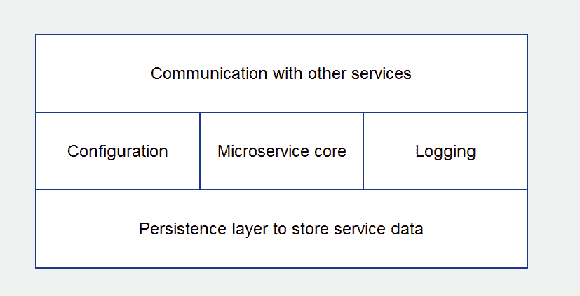
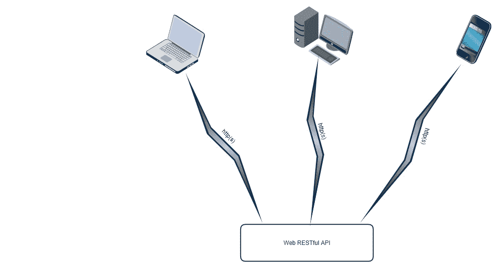
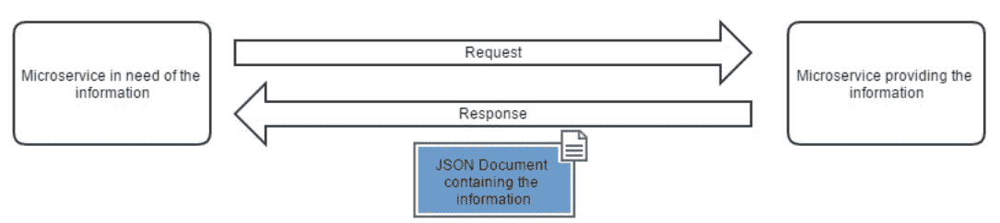
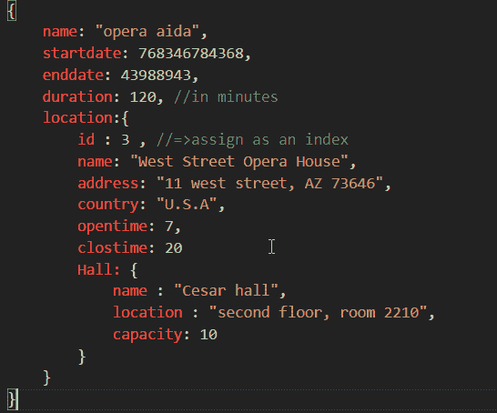
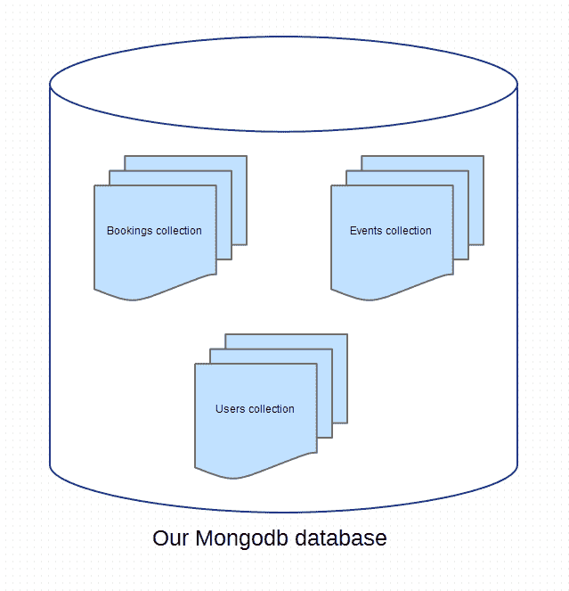

# 使用 RESTAPI 构建微服务

在本章中，我们将踏上了解微服务世界的旅程。我们将了解它们的结构、通信方式以及数据持久化方式。微服务的概念是一个需要涵盖的关键概念，因为当今生产中的大多数现代云应用程序都依赖微服务来实现弹性和可伸缩性。

在本章中，我们将介绍以下主题：

*   深入研究微服务体系结构
*   RESTfulWebAPI
*   用 Go 语言构建 restfulapi

# 背景

在第一章中，我们为微服务提供了一个实用的定义。在本章中，让我们进一步定义微服务。

为了充分欣赏微服务，让我们从讲述它们崛起的故事开始。在微服务的概念流行之前，大多数应用程序都是单片的。单片应用程序是一个试图同时完成多个任务的单一应用程序。然后，由于需要新功能，应用程序将变得更大、更笨重。从长远来看，这实际上产生了无法维护的应用程序。随着云计算的出现，以及负载巨大的分布式应用程序的出现，对更灵活的应用程序体系结构的需求变得越来越明显。

在[第 1 章](01.html)、*现代微服务架构*中，我们介绍了 MyEvents 应用程序，我们将在本书中介绍该应用程序。MyEvents 应用程序用于管理音乐会、戏剧等的活动预订。该应用程序的主要任务包括：

*   **处理预订**：例如，用户预订下个月的音乐会。我们需要存储此预订，确保有此活动的可用座位，并确认之前没有使用相同名称进行预订，以及其他事项。
*   **处理事件**：我们的应用程序需要知道我们希望支持的所有音乐会、戏剧和其他类型的事件。我们需要知道活动地址、座位总数、持续时间等等。
*   **句柄搜索**：我们的应用程序需要能够执行有效的搜索来检索我们的预订和活动。

下图显示了 MyEvents 的单片应用程序设计的外观：


单片应用

我们将在应用程序中构建多个软件层，以处理所需的每个不同任务。我们的应用程序将成为一个具有大型代码库的程序。由于代码都是连接在一起的，因此一层中的更改总是会影响到其他层上的代码。

因为它是一个单一的程序，所以用不同的编程语言编写一些软件层并不容易。当您知道在语言 X 中有一个非常好的库来支持功能 Y 时，这通常是一个非常好的选择，但是，语言 X 不适合功能 Z。

此外，当您添加新功能或层时，您的单个程序将继续增长，而没有良好的可扩展性选项。如果能够在不同的服务器上运行不同的软件层，这样您就可以控制应用程序负载，而不必在一台或两台服务器上投入更多的硬件，这不是更好吗？

长期以来，软件工程师一直试图解决单片应用程序的困境。微服务是解决单片应用程序所带来问题的一种方法。在术语微服务流行之前，就有了 SOA 的概念，它在原则上与微服务类似。

在我们深入研究微服务之前，值得一提的是，单片应用程序并不总是坏的。这完全取决于你想要达到的目标。如果您试图构建一个应用程序，该应用程序预期具有有限的任务集，并且预计不会增长太多，那么您可能只需要一个构建良好的应用程序。另一方面，如果您希望构建一个复杂的应用程序，该应用程序在处理大量数据负载的同时，可以执行许多独立的任务，由多人维护，那么 microservices 体系结构就是您的朋友。

# 那么，什么是微服务？

简单地说，微服务是一种理念，它不是将所有代码放在一个篮子（单片应用程序）中，而是编写多个小型软件服务或*微服务*。每项服务都应专注于一项任务并能很好地执行。这些服务的累积将构成您的应用程序。


微服务应用

对于 MyEvents 应用程序，单片应用程序的每个软件层都将转换为软件服务。这将一起通信以形成我们的应用程序。实际上，这些软件服务中的每一项都将是一项微服务。

由于这些服务协作构建复杂的应用程序，它们需要能够通过它们都理解的协议进行通信。使用 web Restful API 进行通信的微服务广泛使用 HTTP 协议。在本章中，我们将更详细地介绍 Restful API。

# 微服务内部

要建立适当的微服务，我们需要考虑几个组件。为了了解这五个组成部分，让我们讨论一下 microservice 预期承担的主要任务：

*   微服务需要能够与其他服务和外部世界发送和接收消息，以便任务能够协调地执行。微服务的通信方面有不同的形式。Restful API 在与外界交互时非常流行，消息队列在与其他服务通信时非常有用。还有其他流行的技术也很流行，例如**gRPC**。
*   微服务将需要一个配置层；这可以通过环境变量、文件或数据库实现。该配置层将告诉微服务如何操作。例如，假设我们的服务需要侦听 TCP 地址和端口号才能接收消息；TCP 地址和端口号将作为配置的一部分，在服务启动时提供给我们。
*   微服务将需要记录发生在它身上的事件，以便我们能够解决问题并了解行为。例如，如果在向另一个服务发送消息时出现通信问题，我们需要将错误记录在某个地方，以便能够识别问题。
*   微服务需要能够通过将数据存储在数据库或其他形式的数据存储中来持久化数据；我们还需要能够在以后检索数据。例如，在 MyEvents 应用程序中，我们的微服务将需要存储和检索与用户、预订和事件相关的数据。
*   最后，还有核心，我们微服务中最重要的部分。核心是负责我们的微服务预期完成的任务的代码。例如，如果我们的微服务负责处理用户预订，那么微服务核心就是我们编写代码来执行处理用户预订任务的地方。

因此，基于前面五点，微服务的构建块应该如下所示：



微服务的构建块

这些积木为建立高效的微服务提供了良好的基础。这些规则不是一成不变的。您可以使微服务更简单或更复杂，这取决于您尝试构建的应用程序。

# RESTfulWebAPI

**REST**代表**表征状态转移**。REST 只是不同服务通信和交换数据的一种方式。REST 体系结构的核心由客户机和服务器组成。服务器侦听传入的消息，然后对其进行答复，而客户端启动连接，然后向服务器发送消息。

在现代 web 编程世界中，RESTful web 应用程序使用 HTTP 协议进行通信。RESTful 客户端将是 HTTP 客户端，RESTful 服务器将是 HTTP 服务器。HTTP 协议是为 internet 提供动力的关键应用层通信协议，这就是 RESTful 应用程序也可以称为 web 应用程序的原因。RESTful 应用程序的通信层通常简称为 RESTful API。

RESTAPI 允许在各种平台上开发的应用程序进行通信。这包括应用程序中运行在其他操作系统上的其他微服务，以及运行在其他设备上的客户端应用程序。例如，智能手机可以通过 REST 与 web 服务可靠通信。



Web RESTful API

为了理解 RESTful 应用程序的工作原理，我们首先需要对 HTTP 协议的工作原理有一个良好的了解。HTTP 是一种应用程序级协议，用于网络、云和现代微服务世界的数据通信。

HTTP 是一种客户机-服务器、请求-响应协议。这意味着数据流的工作方式如下：

*   HTTP 客户端向 HTTP 服务器发送请求
*   HTTP 服务器侦听传入的请求，然后在它们到来时响应它们


请求和答复

HTTP 客户端请求通常是以下两种情况之一：

*   客户端正在从服务器请求资源
*   客户端请求在服务器上添加/编辑资源

资源的性质取决于您的应用程序。例如，如果您的客户端是一个试图访问网页的 web 浏览器，那么您的客户端将向服务器发送请求，请求一个 HTML 网页。HTML 页面将是 HTTP web 服务器对客户端的响应中返回的资源。

在通信微服务的世界中，REST 应用程序通常结合使用 HTTP 协议和 JSON 数据格式来交换数据消息。

考虑下面的场景：在我们的 MySvices 应用程序中，我们的一个微服务需要从另一个微服务获得事件（持续时间、开始日期、结束日期和位置）的信息。需要信息的微服务将是我们的客户机，而提供信息的微服务将是我们的服务器。假设我们的客户端微服务具有事件 ID，但需要服务器微服务提供属于该 ID 的事件信息。

客户端通过事件 ID 发送查询事件信息的请求；服务器将响应 JSON 格式中包含的信息，如下所示：



带响应的 JSON 文档

这个描述听起来很简单；然而，它并不能提供完整的情况。客户机的询问部分需要更多的细化，以便我们理解 RESTAPI 是如何真正工作的。

REST API 客户端请求需要指定两条主要信息来声明其意图，*请求 URL*和*请求方法*。

请求 URL 是客户端在服务器上查找的资源的地址。URL 是一个 web 地址，RESTAPI URL 的一个示例是[http://quotes.rest/qod.json](http://quotes.rest/qod.json) ，这是一个 API 服务，返回当天的报价。

在我们的场景中，MyEvents 客户端微服务可以向[发送 HTTP 请求 http://10.12.13.14:5500/events/id/1345](http://10.12.13.14:5500/events/id/1345) 查询事件 ID`1345`的 URL。

请求方法基本上就是我们想要执行的操作类型。从请求获取资源到请求编辑资源、添加资源，甚至删除资源。在 HTTP 协议中，有多种类型的方法需要成为客户端请求的一部分；以下是一些最常用的方法：

*   `GET`：web 应用中非常常见的 HTTP 方法；这就是我们从 HTTP web 服务器请求资源的方式；这是我们将在场景中使用的请求类型，用于请求事件 ID`1345`的数据。
*   `POST`：我们用来更新或创建资源的 HTTP 方法。

假设我们想使用`POST`更新一条属于事件 ID 1345 的信息，然后我们会向相对 URL`../events/id/1345`发送一个`POST`请求，请求主体中包含新的事件信息。

另一方面，如果我们想创建一个 ID 为 1346 的新事件，我们不应该向`../events/id/1346`发送带有新事件信息的`POST`请求，因为该 ID 还不存在。我们应该做的只是向`.../events`发送`POST`请求，并将所有新事件信息附加到请求正文中。

*   `PUT`：创建或覆盖资源的 HTTP 方法。

与`POST`不同，`PUT`请求可以通过向以前不存在的资源 ID 发送请求来创建新资源。因此，例如，如果我们想要创建一个 ID 为`1346`的新事件，我们可以向`../events/id/1346`发送一个`PUT`请求，web 服务器应该为我们创建资源。

`PUT`也可用于完全覆盖现有资源。因此，与`POST`不同，我们不应该使用`PUT`只更新资源的一条信息。

*   `DELETE`：用于删除资源。例如，如果我们向 web 服务器的相对 URL`../events/id/1345`发送删除请求，web 服务器将从数据库中删除资源。

# Gorilla 网络工具包

既然我们已经介绍了 web Restful API 是如何工作的，现在是时候了解如何在 Go 中最好地实现它们了。Go 语言在标准库中附带了一个非常强大的 web 包；Go 还享有众多第三方软件包的支持。在本书中，我们将使用非常流行的 Go web 第三方工具包 Gorilla web toolkit。Gorilla web toolkit 由一组 Go 软件包组成，这些软件包共同帮助快速高效地构建强大的 web 应用程序。

Gorilla web toolkit 生态系统中的关键包名为`gorilla/mux`。在包文档中，`mux`包被描述为*请求路由器和调度器*。这基本上是一个软件组件，它接受传入的 HTTP 请求，然后根据请求的性质决定要做什么。例如，假设客户机向 web 服务器发送 HTTP 请求。然后，web 服务器中的 HTTP 路由器调度程序组件可以检测到传入请求包含相对 URL 为`../events/id/1345`的`GET`方法。然后，它将检索事件 ID`1345`的信息并将其发送回客户端。

# 实现 Restful API

使用包的第一步是使用`go get`命令，以便将包获取到我们的开发环境中：

```go
$ go get github.com/gorilla/mux
```

这样，`mux`包就可以使用了。在我们的代码中，我们现在可以将`import`包添加到我们的 web 服务器代码中：

```go
import "github.com/gorilla/mux"
```

在我们的代码中，我们现在需要使用 Gorilla`mux`包创建一个路由器。这是通过以下代码实现的：

```go
r := mux.NewRouter()
```

有了这个，我们将得到一个名为`r`的路由器对象，以帮助我们定义路由并将它们与要执行的操作链接起来。

从这一点开始，代码将根据所讨论的微服务而有所不同，因为不同的服务将支持不同的路由和操作。在本章前面，我们介绍了 MyEvents 应用程序 Web UI 服务、搜索微服务、预订微服务和事件微服务中使用的以下四种不同类型的服务。让我们关注一下事件微服务。

events microservice 需要支持 RESTFul API 接口，该接口能够执行以下操作：

*   通过 ID 或事件名称搜索事件
*   一次检索所有事件
*   创建新事件

让我们关注其中的每一项任务。因为我们正在为微服务设计一个 web RESTful API，所以如果需要，每个任务都需要转换成一个 HTTP 方法，并结合 URL 和 HTTP 正文。

以下是详细情况：

*   通过以下方式搜索事件：
    *   ID：相对 URL 为`/events/id/3434`，方法为`GET`，HTTP 正文中不需要数据
    *   名称：相对 URL 为`/events/name/jazz_concert`，方法为`GET`，HTTP 正文中不需要数据
*   一次检索所有事件：相对 URL 为`/events`，方法为`GET`，HTTP 正文中不需要数据
*   创建新事件：相对 URL 为`/events`，方法为`POST`，HTTP 正文中的预期数据需要是我们要添加的新事件的 JSON 表示。假设我们想添加将在美国播放的`opera aida`事件，那么 HTTP 主体将如下所示：



现在，如果您查看每个任务的 HTTP 翻译，您会注意到它们的相对 URL 都共享一个公共属性，即它以`/events`开头。在 Gorilla web toolkit 中，我们可以为`/events`相对 URL 创建一个子计算机。子计算机基本上是一个对象，它将负责指向以`/events`开头的相对 URL 的任何传入 HTTP 请求。

要为前缀为`/events`的 URL 创建子计算机，需要以下代码：

```go
eventsrouter := r.PathPrefix("/events").Subrouter()
```

前面的代码使用我们前面创建的 router 对象，然后调用`PathPrefix`方法，该方法用于捕获任何以`/events`开头的 URL 路径。然后，最后，我们调用`Subrouter()`方法，该方法将创建一个新的路由器对象，供我们从现在开始使用，以处理对以`/events`开头的 URL 的任何传入请求。新路由器名为`eventsrouter`。

接下来，`eventsrouter`对象可用于定义如何处理共享`/events`前缀的其余 URL。因此，让我们重新查看任务的 HTTP 翻译列表，并探索完成这些任务所需的代码：

1.  **任务：**通过以下方式搜索事件：
    *   `id`：相对 URL 为`/events/id/3434`，方法为`GET`，HTTP 正文中不需要数据
    *   `name`：相对 URL 为`/events/name/jazz_concert`，方法为`GET`，HTTP 正文中不需要数据：

```go
eventsrouter.Methods("GET").Path("/{SearchCriteria}/{search}").HandlerFunc(handler.findEventHandler)
```

前面代码中的 handler 对象基本上是实现表示我们期望映射到传入 HTTP 请求的功能的方法的对象。稍后再谈。

2.  **任务：**一次检索所有事件相对 URL 为`/events`，方法为`GET`，HTTP 正文中不需要数据：

```go
eventsrouter.Methods("GET").Path("").HandlerFunc(handler.allEventHandler)
```

3.  **任务：**新建事件相对 URL 为`/events,`方法为`POST`，HTTP 正文中的预期数据需要是我们要添加的新事件的 JSON 表示：

```go
eventsrouter.Methods("POST").Path("").HandlerFunc(handler.newEventHandler)
```

对于任务 2 和 3，代码是自解释的。Gorilla`mux`包允许我们访问 Go 方法，这些方法雄辩地定义我们想要捕获的传入 HTTP 请求的属性。该包还允许我们将调用连成一行，以有效地构造代码。`Methods()`调用定义了预期的 HTTP 方法，`Path()`调用定义了预期的相对 URL 路径（注意我们将调用放在`eventsrouter`对象上，该对象将`/events`附加到`Path()`调用中定义的相对路径上），最后是`HandlerFunc()`方法。

`HandlerFunc()`方法是我们如何将捕获的传入 HTTP 请求与操作链接起来。`HandlerFunc()`采用`func(http.ResponseWriter, *http.Request)`类型的参数。这个参数基本上是一个包含两个重要参数的函数：一个是 HTTP 响应对象，我们需要用对传入请求的响应填充它；另一个是 HTTP 请求对象，它将包含有关传入 HTTP 请求的所有信息。

前面代码中我们传递给`HandlerFunc()`的函数是`handler.findEventHandler`、`handler.allEventHandler`、`handler.newEventHandler`-都支持`func(http.ResponseWriter, *http.Request)`签名。`handler`是一个 Go 结构对象，用于承载所有这些函数。`handler`对象属于名为`eventServiceHandler`的自定义 Go 结构类型。

为了使`eventServiceHandler`类型支持任务 1、2 和 3 的 HTTP 处理程序，需要如下定义：

```go
type eventServiceHandler struct {}

func (eh *eventServiceHandler) findEventHandler(w http.ResponseWriter, r *http.Request) {

}

func (eh *eventServiceHandler) allEventHandler(w http.ResponseWriter, r *http.Request) {

}

func (eh *eventServiceHandler) newEventHandler(w http.ResponseWriter, r *http.Request) {

}
```

在前面的代码中，我们将`eventServiceHandler`创建为一个没有字段的结构类型，然后将三个空方法附加到它。每个处理程序方法都支持成为 Gorilla`mux`包`HandlerFunc()`方法参数所需的函数签名。当我们介绍微服务的持久化层时，本章将更详细地讨论每一种`eventServiceHandler`方法的详细实现。

现在，让我们回到任务 1。我们代码中的`/{SearchCriteria}/{search}`路径表示用于搜索事件 ID`2323`的`/id/2323`路径，或用于搜索名称为`opera aida`的事件的`/name/opera aida`路径。路径中的花括号提醒 Gorilla`mux`包`SearchCriteria`和`search`基本上是预期在实际传入 HTTP 请求 URL 中用其他内容替换的变量。

Gorilla`mux`包对 URL 路径变量有强大的支持。它还支持通过正则表达式进行模式匹配。例如，如果我使用一个类似于`/{search:[0-9]+}`的路径，它将为我提供一个名为`search`的变量，该变量承载一个数字。

定义完路由器、路径和处理程序后，我们需要指定本地 TCP 地址，web 服务器将在其中侦听传入的 HTTP 请求。为此，我们需要 Go 的`net/http`包；下面是代码的样子：

```go
http.ListenAndServe(":8181", r)
```

在这一行代码中，我们创建了一个 web 服务器。它将在本地端口`8181`上侦听传入的 HTTP 请求，并将`r`对象用作请求的路由器。我们之前使用`mux`包创建了`r`对象。

现在是时候把我们讨论到这一点的所有代码放在一起了。让我们假设代码存在于一个名为`ServeAPI()`的函数中，该函数负责为我们的微服务激活 Restful API 逻辑。

```go
func ServeAPI(endpoint string) error {
  handler := &eventservicehandler{}
  r := mux.NewRouter()
  eventsrouter := r.PathPrefix("/events").Subrouter()
  eventsrouter.Methods("GET").Path("/{SearchCriteria}/{search}").HandlerFunc(handler.FindEventHandler)
  eventsrouter.Methods("GET").Path("").HandlerFunc(handler.AllEventHandler)
  eventsrouter.Methods("POST").Path("").HandlerFunc(handler.NewEventHandler)
  return http.ListenAndServe(endpoint, r)
}
```

我们将`eventServiceHandler`对象定义如下：

```go
type eventServiceHandler struct {}

func (eh *eventServiceHandler) findEventHandler(w http.ResponseWriter, r *http.Request) {}

func (eh *eventServiceHandler) allEventHandler(w http.ResponseWriter, r *http.Request) {}

func (eh *eventServiceHandler) newEventHandler(w http.ResponseWriter, r *http.Request) {}
```

显然，下一步将是填写`eventServiceHandler`类型的空方法。我们有`findEventHandler()`、`allEventHandler()`和`newEventHandler()`方法。他们每个人都需要一个持久层来执行任务。这是因为它们要么检索存储的数据，要么向存储添加新数据。

正如本节前面提到的，持久层是微服务的组件，其任务是在数据库中存储数据或从数据库中检索数据。我们已经到了需要更详细地介绍持久性层的地步。

# 持久层

设计持久性层时需要做的第一个决定是决定数据存储的类型。数据存储可以是关系型 SQL 数据库，如 Microsoft SQL 或 MySQL 等。或者，它可以是 NoSQL 存储，例如 MongoDB 或 ApacheCassandra 等。

在高效而复杂的生产环境中，代码需要能够在不进行太多重构的情况下从一个数据存储切换到另一个数据存储。考虑下面的示例，您为一个依赖 MangoDB 作为数据存储的启动建立多个微服务；然后，随着组织的变化，您决定 AWS 基于云的 DynamoDB 将为微服务提供更好的数据存储。如果代码不允许轻松地拔掉 MySQL，那么在其位置插入 MongoDB 层，我们的微服务将需要大量的代码重构。在 Go 中，我们将使用接口实现灵活的设计。

值得一提的是，在微服务体系结构中，不同的服务可能需要不同类型的数据存储，因此一个微服务使用 MongoDB 是正常的，而另一个服务将使用 MySQL。

让我们假设我们正在为 events microservice 构建一个持久层。根据我们到目前为止所讨论的内容，events microservice 持久化层主要关注三件事：

*   向数据库添加新事件
*   按 ID 查找事件
*   按名称查找事件

为了实现灵活的代码设计，我们需要在接口中定义前面的三个功能。它看起来是这样的：

```go
type DatabaseHandler interface {
    AddEvent(Event) ([]byte, error)
    FindEvent([]byte) (Event, error)
    FindEventByName(string) (Event, error)
    FindAllAvailableEvents() ([]Event, error)
}
```

`Event`数据类型是一种结构类型，表示事件的数据，如事件名称、位置、时间等。现在，让我们关注一下`DatabaseHandler`接口。它支持表示事件服务持久性层中所需任务的四种方法。然后，我们可以从这个接口创建许多具体的实现。一个实现可以支持 MongoDB，而另一个实现可以支持云本地 AWS DynamoDB 数据库。

我们将在下一章介绍 AWS DynamoDB。在本章中，重点将放在 MongoDB 上。

# 蒙哥达

如果您还不熟悉 MongoDB NoSQL 数据库引擎，本节将非常有用。

MongoDB 是一个 NoSQL 文档存储数据库引擎。理解 MongoDB 的两个关键词是*NoSQL*和*document store*。

NoSQL 是软件行业中一个相对较新的关键字，用于表示数据库引擎并不完全依赖关系数据。关系数据是指数据库中不同数据段之间存在关系网的概念，遵循数据之间的关系将构建数据所代表内容的全貌。

以 MySQL 为例，它是一个关系数据库。数据存储在多个表中，然后使用主键和外键定义不同表之间的关系。MongoDB 不是这样工作的，这就是为什么 MySQL 被认为是 SQL 数据库，而 MongoDB 被认为是 NoSQL。

如果您还不熟悉 Mongodb，或者没有本地安装，您可以使用它进行测试。转到[https://docs.mongodb.com/manual/installation/](https://docs.mongodb.com/manual/installation/) ，在这里，您可以找到一系列有用的链接，以指导在您选择的操作系统中安装和运行数据库的过程。通常，Mongodb 在安装时提供两个关键二进制文件：`mongod`和`mongo`。`mongod`命令是运行数据库所需执行的命令。然后您编写的任何软件都将与`mongod`通信以访问 Mongodb 的数据。另一方面，`mongo`命令基本上是一个客户端工具，您可以使用它在 Mongodb 上测试数据，`mongo`命令与`mongod`通信，类似于您编写的任何访问数据库的应用程序。
MongoDB 有两种版本：社区版和企业版。显然，企业版的目标是大型企业安装，而社区版则是用于测试和小型部署的。以下是社区版指南的链接，涵盖三种主要操作系统：

*   对于 linux Mongodb 安装和部署：[https://docs.mongodb.com/manual/administration/install-on-linux/](https://docs.mongodb.com/manual/administration/install-on-linux/)
*   对于 Windows Mongodb 安装和部署：[https://docs.mongodb.com/manual/tutorial/install-mongodb-on-windows/](https://docs.mongodb.com/manual/tutorial/install-mongodb-on-windows/)
*   对于 OS X Mongodb 安装和部署：[https://docs.mongodb.com/manual/tutorial/install-mongodb-on-os-x/](https://docs.mongodb.com/manual/tutorial/install-mongodb-on-os-x/)

总体而言，部署 MavGDB 实例时需要考虑的三个主要步骤：

1.  为您的操作系统安装 Mongodb，可在此处找到下载页面：[https://www.mongodb.com/download-center](https://www.mongodb.com/download-center)
2.  确保在环境路径中定义了 MongoDB 的密钥二进制文件，以便无论当前目录是什么，都可以从终端运行它们。关键二进制文件是`mongod`和`mongo`。另一个值得一提的二进制代码是`mongos`，如果您计划利用集群，这一点很重要

3.  不带任何参数运行`mongod`命令，这将使用所有默认设置运行 Mongodb。或者，您可以将其用于不同的配置。您可以使用配置文件，也可以只使用运行时参数。您可以在此处找到有关配置文件的信息：[https://docs.mongodb.com/manual/reference/configuration-options/#configuration-文件](https://docs.mongodb.com/manual/reference/configuration-options/#configuration-file)。要使用自定义配置文件启动`mongod`，您可以使用`--config`选项，下面是一个示例：`mongod --config /etc/mongod.conf`。另一方面，对于运行时参数，您可以在运行`mongod`时使用`--option`更改选项，例如您可以键入`mongod --port 5454`在不同于默认端口的端口上启动`mongod`

有不同类型的 NoSQL 数据库。其中一种是*文档库*数据库。文档存储的概念是将数据存储在多个文档文件中，这些文件堆叠在一起，以表示我们试图存储的内容。让我们以事件的微服务所需的数据存储为例。如果我们在微服务持久化层中使用文档存储，则每个事件都将存储在具有唯一 ID 的单独文档中。例如，我们有 Opera Aida 事件、Coldplay 音乐会事件和芭蕾舞表演事件。在 MongoDB 中，我们将创建一个名为*事件*的文档集合，其中将包含三个文档，一个用于歌剧，一个用于酷玩，一个用于芭蕾舞表演。

因此，为了巩固我们对 MongoDB 如何表示这些数据的理解，下面是一个事件集合图：


事件集合

集合和文档是 MongoDB 中的重要概念。生产 MongoDB 环境通常由多个集合组成；每个集合将代表不同的数据片段。因此，例如，我们的 MyEvents 应用程序由许多微服务组成，每个微服务都关心一段独特的数据。bookings 微服务将数据存储在 bookings 集合中，events 微服务将数据存储在 events 集合中。我们还需要单独存储用户的数据，以便独立管理应用程序的用户。以下是最终的结果：



我们的 MongoDB 数据库

您可以从[下载此文件 https://www.packtpub.com/sites/default/files/downloads/CloudNativeprogrammingwithGolang_ColorImages.pdf](https://www.packtpub.com/sites/default/files/downloads/CloudNativeprogrammingwithGolang_ColorImages.pdf) 。
该书的代码包也托管在 GitHub 上的[https://github.com/PacktPublishing/Cloud-Native-Programming-with-Golang](https://github.com/PacktPublishing/Cloud-Native-programming-with-Golang) 。

由于到目前为止，我们主要关注事件微服务，将其作为如何构建微服务的展示，因此让我们深入了解事件集合，该集合将由事件的微服务使用：


事件集合

事件集合中的每个文档都需要包含表示单个事件所需的所有信息。以下是事件文档的外观：


如果您还没有注意到，前面的 JSON 文档与我们作为添加事件 API HTTP`POST`请求主体的示例展示的 HTTP 主体文档相同。

为了编写能够处理这些数据的软件，我们需要创建模型。模型基本上是数据结构，包含与我们期望从数据库获得的数据相匹配的字段。对于 Go，我们将使用结构类型来创建模型。以下是事件模型的外观：

```go
type Event struct {
    ID bson.ObjectId `bson:"_id"`
    Name string
    Duration int
    StartDate int64
    EndDate int64
    Location Location
}
type Location struct {
    Name string
    Address string
    Country string
    OpenTime int
    CloseTime int
    Halls []Hall
}
type Hall struct {
    Name string `json:"name"`
    Location string `json:"location,omitempty"`
    Capacity int `json:"capacity"`
}
```

`Event struct`是我们事件文档的数据结构或模型。它包含 ID、事件名称、事件持续时间、事件开始日期、事件结束日期和事件位置。由于事件位置需要保存的信息不仅仅是单个字段，因此我们将创建一个名为 location 的结构类型来对位置进行建模。`Location struct`类型包含位置的名称、地址、国家、开放时间和关闭时间，以及该区域的大厅。大厅基本上是活动发生地点内的房间

例如，位于市中心山景城的山景城歌剧院将是位置，而东侧的硅谷房间将是大厅。

反过来，大厅不能用单个字段表示，因为我们需要知道它的名称、它在建筑中的位置（东南部、西部等等），以及它的容量（它可以容纳的人数）。

事件结构中的`bson.ObjectId`类型是表示 MongoDB 文档 ID 的特殊类型。可以在`mgo`适配器中找到`bson`包，这是选择与 MongoDB 通信的第三方框架。`bson.ObjectId`类型还提供了一些有用的方法，我们可以在代码的后面使用这些方法来验证 ID 的有效性。

在我们开始讨论 T0 之前，让我们花一点时间来解释一下 T1。`bson`是 MongoDB 用来表示存储文档中数据的数据格式。可以简单地将其视为二进制 JSON，因为它是类似 JSON 文档的二进制编码序列化。该规范可在以下网址找到：[http://bsonspec.org/](http://bsonspec.org/) 。

现在，让我们来报道`mgo`。

# MongoDB 和 Go 语言

mgo 是用 Go 语言编写的流行 MongoDB 驱动程序。包裹页面可在以下位置找到：[http://labix.org/mgo](http://labix.org/mgo) 。驱动程序只不过是一些 Go 包，它们有助于编写能够使用 MongoDB 的 Go 程序。

为了使用`mgo`，第一步是使用`go get`命令检索包：

```go
go get gopkg.in/mgo.v2
```

通过执行前面的命令，我们可以在代码中使用`mgo`。我们需要导入前面讨论过的`mgo`包和`bson`包。我们用来承载 MongoDB 持久层的包名叫做`mongolayer`。

我们来看看`mongolayer`套餐：

```go
package mongolayer
import (
    mgo "gopkg.in/mgo.v2"
    "gopkg.in/mgo.v2/bson"
)
```

接下来，让我们创建一些常量来表示数据库的名称和持久层中涉及的集合的名称。MongoDB 中的数据库名称应为`myevents`。我们将使用的集合名称是`users`用于用户集合，而`events`用于数据库中的事件集合：

```go
const (
    DB = "myevents"
    USERS = "users"
    EVENTS = "events"
)
```

为了公开`mgo`包的特性，我们需要使用属于`mgo`包的数据库会话对象，会话对象类型称为`*mgo.session`。为了在代码中使用`*mgo.session`，我们将使用名为`MongoDBLayer`的结构类型对其进行包装，如下所示：

```go
type MongoDBLayer struct {
    session *mgo.Session
}
```

现在是实现我们前面介绍的`DatabaseHandler`接口的时候了，以便构建我们应用程序的具体持久层。在 Go 语言中，在实现接口时通常首选使用指针类型，因为指针保留对底层对象原始内存地址的引用，而不是在使用它时复制整个对象。换句话说，`DatabaseHandler`接口的实现者对象类型需要是指向`MongoDBLayer`结构对象的指针，或者仅仅是`*MongoDBLayer`。

但是，在开始实现接口之前，我们首先需要创建一个构造函数，返回一个`*MongoDBLayer`类型的对象。这是 Go 中的惯用用法，以便我们能够在创建新的`*MongoDBLayer`类型的对象时执行任何必要的初始化代码。在我们的例子中，初始化代码基本上是为了获得到所需 MongoDB 数据库地址的连接会话处理程序。以下是构造函数代码的外观：

```go
func NewMongoDBLayer(connection string) (*MongoDBLayer, error) {
    s, err := mgo.Dial(connection)
    if err!= nil{
        return nil,err
    }
    return &MongoDBLayer{
        session: s,
    }, err
}
```

在前面的代码中，我们创建了一个名为`NewMongoDBLayer`的构造函数，它需要一个 string 类型的参数。参数表示连接字符串，其中包含与 MongoDB 数据库建立连接所需的信息。根据[的`mgo`文件 https://godoc.org/gopkg.in/mgo.v2#Dial](https://godoc.org/gopkg.in/mgo.v2#Dial) ，连接字符串的格式需要如下所示：


如果只是本地主机连接，则连接字符串如下所示：`mongodb://127.0.0.1`

如果连接字符串中未提供端口号，则端口默认为`27017`。

现在，让我们看看构造函数中的代码。在第一行中，我们使用连接字符串作为参数调用`mgo.Dial()`。`mgo.Dial()`是`mgo`包中的函数，它将返回一个 MongoDB 连接会话，供我们稍后在代码中使用。它返回两个结果`*mgo.Session`对象和一个错误对象。我们在结尾使用 struct literals 返回指向`MongoDBLayer`类型的新对象，该对象承载新创建的`*mgo.Session`对象。我们还返回 error 对象，以便将初始化过程中可能发生的任何错误传递给调用方。

现在，随着构造函数的退出，是时候实现`DatabaseHandler`接口的方法了。到目前为止，我们有四种方法-`AddEvent(Event)`、`FindEvent([]byte)`、`FindEventByName(string)`和`FindAllAvailableEvents()`。

以下是`AddEvent(Event)`方法的代码：

```go
func (mgoLayer *MongoDBLayer) AddEvent(e persistence.Event) ([]byte, error) {
    s := mgoLayer.getFreshSession()
    defer s.Close()
    if !e.ID.Valid() {
        e.ID = bson.NewObjectId()
    }
    //let's assume the method below checks if the ID is valid for the location object of the event
    if !e.Location.ID.Valid() {
        e.Location.ID = bson.NewObjectId()
    }
    return []byte(e.ID), s.DB(DB).C(EVENTS).Insert(e)
}
```

该方法采用一个类型为`persistence.Event`的参数，该参数对我们前面讨论过的事件的预期信息进行建模。它返回一个字节片（表示事件 ID）和一个错误对象（如果未找到错误，则返回为零）。

在第一行中，我们调用一个`getFreshSession()`方法，这是在我们的代码中实现的帮助器方法，用于帮助从连接池中检索新的数据库会话。方法代码如下所示：

```go
func (mgoLayer *MongoDBLayer) getFreshSession() *mgo.Session {
    return mgoLayer.session.Copy()
}
```

`session.Copy()`是每当我们从`mgo`包连接池请求新会话时调用的方法。`mgoLayer.session`这里基本上就是我们在`MongoDBLayer`结构中托管的`*mgo.Session`对象。在任何方法或函数的开头调用`session.Copy()`是一种习惯做法，该方法或函数将通过`mgo`包向 MongoDB 发出查询或命令。`getFreshSession()`方法只是一个助手方法，它为我们调用`session.Copy()`并返回结果会话。

现在，让我们回到`AddEvent()`方法。我们现在有一个数据库连接池中的`*mgo.Session`对象可用于代码中。首先要做的是调用 defer`s.Close()`以确保在`AddEvent()`方法退出后，该会话返回到`mgo`数据库连接池。

接下来，我们检查`Event`参数对象提供的事件 ID 是否有效，以及`Event`对象的 ID 字段是否为前面提到的`bson.ObjectID`类型。`bson.ObjectID`支持`Valid()`方法，我们可以使用该方法检测该 ID 是否为有效的 MongoDB 文档 ID。如果提供的事件 ID 无效，我们将使用`bson.NewObjectID()`函数调用创建自己的事件 ID。然后，我们将对事件中嵌入对象的位置重复相同的模式。

最后，我们将返回两个结果：第一个结果是添加事件的事件 ID，第二个结果是表示事件插入操作结果的错误对象。为了将 event 对象插入 MongoDB 数据库，我们将使用`s`变量中的 session 对象，然后调用`s.DB(DB).C(EVENTS)`来获取表示数据库中事件集合的对象。对象将为`*mgo.Collection`类型。`DB()`方法帮助我们访问数据库；我们将把`DB`常量作为参数，它有我们的数据库名。`C()`方法帮助我们访问收藏；我们将给它一个`EVENTS`常量，它有我们事件集合的名称。

`DB`和`EVENTS`常量在我们的代码中已经定义。然后，最后，我们将调用 collection 对象的`Insert()`方法，并将`Event`对象作为参数，这就是代码最终看起来像这样的原因-`s.DB(DB).C(EVENTS).Insert(e)`。这一行是我们将新文档插入 MongoDB 数据库集合所需要的，该数据库集合利用 Go 对象和`mgo`包。

现在，让我们看一下`FindEvent()`的代码，我们使用它从数据库的 ID 中检索某个事件的信息。代码如下所示：

```go
func (mgoLayer *MongoDBLayer) FindEvent(id []byte) (persistence.Event, error) {
    s := mgoLayer.getFreshSession()
    defer s.Close()
    e := persistence.Event{}
    err := s.DB(DB).C(EVENTS).FindId(bson.ObjectId(id)).One(&e)
    return e, err
}
```

注意 ID 是如何作为字节片而不是`bson.ObjectId`类型传递的。我们这样做是为了确保`DatabaseHandler`接口中的`FindEvent()`方法尽可能保持通用性。例如，我们知道在 MongoDB 的世界中，ID 将是`bson.ObjectId`类型，但是如果我们现在想要实现 MySQL 数据库层呢？将 ID 参数类型作为`bson.ObjectId`传递给`FindEvent()`是没有意义的。所以，这就是为什么我们选择`[]byte`类型来表示我们的 ID 参数。理论上，我们应该能够将字节片转换为任何其他可以表示 id 的类型。

重要的一点是，我们还可以选择空接口类型（`interface{}`，它在 Go 中可以转换为任何其他类型。

在`FindEvent()`方法的第一行中，我们像以前一样使用`mgoLayer.getFreshSession()`从连接池获得了一个新的会话。然后我们调用`defer s.Close()`以确保会话在完成后返回到连接池。

接下来，我们使用代码`e := persistence.Event{}`创建了一个空事件对象`e`。然后我们使用`s.DB(DB).C(EVENTS)`访问 MongoDB 中的事件集合。有一个名为`FindId()`的方法，由`mgo`的`*mgoCollection`对象支持。该方法将`bson.ObjectId`类型的对象作为参数，然后搜索具有所需 ID 的文档。

`FindId()`返回一个`*mgo.Query`类型的对象，这是`mgo`中的常见类型，我们可以使用它来检索查询结果。为了将检索到的文档数据提供给我们之前创建的`e`对象，我们需要调用属于`*mgo.Query`类型的`One()`方法，并将对`e`的引用作为参数传递。通过这样做，`e`将获得所需 ID 的检索文档的数据。如果操作失败，`One()`方法将返回包含错误信息的错误对象，否则`One()`将返回 nil。

在`FindEvent()`方法的末尾，我们将返回事件对象和错误对象。

现在，让我们看一下`FindEventByName()`方法的实现，它从 MongoDB 数据库中按事件名称检索事件。下面是代码的样子：

```go
func (mgoLayer *MongoDBLayer) FindEventByName(name string) (persistence.Event, error) {
    s := mgoLayer.getFreshSession()
    defer s.Close()
    e := persistence.Event{}
    err := s.DB(DB).C(EVENTS).Find(bson.M{"name": name}).One(&e)
    return e, err
}
```

该方法与`FindEvent()`方法非常相似，除了两件事。第一个区别是`FindEvent()`将字符串作为参数，它表示我们想要查找的事件名称。

第二个区别是我们查询的是事件名称而不是事件 ID。我们查询文档的代码行使用了一个名为`Find()`而不是`FindId()`的方法，这使得代码如下所示：

```go
err := s.DB(DB).C(EVENTS).Find(bson.M{"name":name}).One(&e)
```

`Find()`方法接受一个参数，该参数表示我们希望传递给 MongoDB 的查询。`bson`包提供了一个称为`bson.M`的好类型，它基本上是一个映射，我们可以用来表示我们想要查找的查询参数。在我们的例子中，我们正在寻找作为参数传递给`FindEventByName`的名称。我们数据库中事件集合中的 name 字段仅编码为`name`，而作为参数传递给我们并具有名称的变量称为`name`。因此，我们的查询结果为`bson.M{"name":name}`。

最后但并非最不重要的是我们的`FindAllAvailableEvents()`方法。该方法返回数据库中所有可用的事件。换句话说，它从 MongoDB 数据库返回整个事件集合。下面是代码的样子：

```go
func (mgoLayer *MongoDBLayer) FindAllAvailableEvents() ([]persistence.Event, error) {
    s := mgoLayer.getFreshSession()
    defer s.Close()
    events := []persistence.Event{}
    err := s.DB(DB).C(EVENTS).Find(nil).All(&events)
    return events, err
}
```

代码与`FindEventByName()`几乎相同，只是有三个简单的区别。第一个区别显然是`FindAllAvailableEvents()`不接受任何参数。

第二个区别是，我们需要将查询结果提供给事件对象的一部分，而不是单个事件对象。这就是为什么返回类型是`[]persistence.Event`，而不仅仅是`persistence.Event`。

第三个区别是，`Find()`方法将采用 nil 参数，而不是`bson.M`对象。这将导致代码如下所示：

```go
err := s.DB(DB).C(EVENTS).Find(nil).All(&events)
```

当`Find()`方法获得 nil 参数时，它将返回在相关 MongoDB 集合中找到的所有内容。另外，请注意，我们在`Find()`之后使用了`All()`而不是`One()`。这是因为我们期望多个结果，而不仅仅是一个。

这样，我们就完成了持久层的覆盖。

# 实现 RESTful API 处理函数

所以，既然已经介绍了持久性层，现在是时候返回到 RESTful API 处理程序并介绍它们的实现了。在本章前面，我们将`eventServiceHandler`结构类型定义为：

```go
type eventServiceHandler struct {}
func (eh *eventServiceHandler) findEventHandler(w http.ResponseWriter, r *http.Request) {}
func (eh *eventServiceHandler) allEventHandler(w http.ResponseWriter, r *http.Request) {}
func (eh *eventServiceHandler) newEventHandler(w http.ResponseWriter, r *http.Request) {}
```

`eventServiceHandler`类型现在需要支持我们在本章前面创建的`DatabaseHandler`接口类型，以便能够执行数据库操作。这将使结构看起来像这样：

```go
type eventServiceHandler struct {
    dbhandler persistence.DatabaseHandler
}
```

接下来，我们需要编写一个构造函数来初始化`eventServiceHandler`对象；其内容如下：

```go
func newEventHandler(databasehandler persistence.DatabaseHandler) *eventServiceHandler {
    return &eventServiceHandler{
        dbhandler: databasehandler,
    }
}
```

但是，我们将`eventServiceHandler`结构类型的三个方法保留为空。让我们一个接一个地看一遍。

第一种方法`findEventHandler()`负责处理用于查询数据库中存储的事件的 HTTP 请求。我们可以通过事件的 ID 或名称查询事件。正如本章前面提到的，当搜索 ID 时，请求 URL 将类似于`/events/id/3434`并且将是`GET`类型。另一方面，当按名称搜索时，请求将类似于`/events/name/jazz_concert`并且是`GET`类型。作为提醒，下面是我们如何定义路径并将其链接到处理程序的：

```go
eventsrouter := r.PathPrefix("/events").Subrouter()
eventsrouter.Methods("GET").Path("/{SearchCriteria}/{search}").HandlerFunc(handler.findEventHandler)
```

`{SearchCriteria}`和`{Search}`是我们路径中的两个变量。`{SearchCriteria}`可替换为`id`或`name`。

以下是`findEventHandler`方法的代码：

```go
func (eh *eventServiceHandler) findEventHandler(w http.ResponseWriter, r *http.Request) {
    vars := mux.Vars(r)
    criteria, ok := vars["SearchCriteria"]
    if !ok {
        w.WriteHeader(400)
        fmt.Fprint(w, `{error: No search criteria found, you can either search by id via /id/4
                   to search by name via /name/coldplayconcert}`)
        return
    }
    searchkey, ok := vars["search"]
    if !ok {
        w.WriteHeader(400)
        fmt.Fprint(w, `{error: No search keys found, you can either search by id via /id/4
                   to search by name via /name/coldplayconcert}`)
        return
    }
    var event persistence.Event
    var err error
    switch strings.ToLower(criteria) {
        case "name":
        event, err = eh.dbhandler.FindEventByName(searchkey)
        case "id":
        id, err := hex.DecodeString(searchkey)
        if err == nil {
            event, err = eh.dbhandler.FindEvent(id)
        }
    }
    if err != nil {
        fmt.Fprintf(w, "{error %s}", err)
        return
    }
    w.Header().Set("Content-Type", "application/json;charset=utf8")
    json.NewEncoder(w).Encode(&event)
}
```

该方法有两个参数：一个是`http.ResponseWriter`类型的对象，它表示我们需要填充的 HTTP 响应，而第二个参数是`*http.Request`类型，它表示我们收到的 HTTP 请求。在第一行中，我们使用`mux.Vars()`和请求对象作为参数；这将返回键和值的映射，它将表示我们的请求 URL 变量及其值。因此，例如，如果请求 URL 看起来像`/events/name/jazz_concert`，我们将在生成的映射中有两个键值对。第一个键是`"SearchCriteria"`，值为`"name"`，而第二个键是`"search"`，值为`jazz_concert`。生成的映射存储在 vars 变量中。

然后，我们从下一行的地图中获取标准：

```go
criteria, ok := vars["SearchCriteria"]
```

因此，如果用户发送了正确的请求 URL，那么 criteria 变量现在将具有`name`或`id`。`ok`变量为布尔型；如果`ok`为真，那么我们将在`vars`地图中找到一个名为`SearchCriteria`的钥匙。如果为 false，则我们知道收到的请求 URL 无效。

接下来，我们检查是否检索到搜索条件；如果没有，则报告错误，然后退出。注意这里我们是如何以类似 JSON 的格式报告错误的？这是因为具有 JSON 主体格式的 RESTful API 通常首选以 JSON 形式返回所有内容，包括错误。另一种方法是创建一个 JSONError 类型，并向它提供我们的错误字符串；但是，为了简单起见，我将在代码中详细说明 JSON 字符串：

```go
if !ok {
    fmt.Fprint(w, `{error: No search criteria found, you can either search by id via /id/4 to search by name via /name/coldplayconcert}`)
    return
}
```

`fmt.Fprint`允许我们将错误消息直接写入包含 HTTP 响应编写器的`w`变量。`http.responseWriter`对象类型支持 Go 的`io.Writer`接口，可与`fmt.Fprint()`一起使用。

现在，我们需要对`{search}`变量执行同样的操作：

```go
searchkey, ok := vars["search"]
if !ok {
    fmt.Fprint(w, `{error: No search keys found, you can either search by id via /id/4
               to search by name via /name/coldplayconcert}`)
    return
}
```

是时候根据提供的请求 URL 变量从数据库中提取信息了；以下是我们的做法：

```go
var event persistence.Event
var err error
switch strings.ToLower(criteria) {
    case "name":
    event, err = eh.dbhandler.FindEventByName(searchkey)
    case "id":
    id, err := hex.DecodeString(searchkey)

    if nil == err {
        event, err = eh.dbhandler.FindEvent(id)
    }
}
```

对于名称搜索条件，我们将使用`FindEventByName()`数据库处理程序方法按名称搜索。如果是 ID 搜索条件，我们将使用`hex.DecodeString()`将搜索键转换为字节片-如果我们成功获得字节片，我们将使用获得的 ID 调用`FindEvent()`。

然后，我们通过检查 err 对象来检查数据库操作期间是否发生任何错误。如果我们发现错误，我们在响应中写入一个`404`错误头，然后在 HTTP 响应体中打印错误：

```go
if err != nil {
    w.WriteHeader(404)
    fmt.Fprintf(w, "Error occured %s", err)
    return
}
```

我们需要做的最后一件事是将响应转换为 JSON 格式，因此我们将 HTTP`content-type`头更改为`application/json`；然后，我们使用功能强大的 Go JSON 包将从数据库调用获得的结果转换为 JSON 格式：

```go
w.Header().Set("Content-Type", "application/json;charset=utf8")
json.NewEncoder(w).Encode(&event)
```

现在，让我们看看`allEventHandler()`方法的代码，它将返回 HTTP 响应中的所有可用事件：

```go
func (eh *eventServiceHandler) allEventHandler(w http.ResponseWriter, r *http.Request) {
    events, err := eh.dbhandler.FindAllAvailableEvents()
    if err != nil {
        w.WriteHeader(500)
        fmt.Fprintf(w, "{error: Error occured while trying to find all available events %s}", err)
        return
    }
    w.Header().Set("Content-Type", "application/json;charset=utf8")
    err = json.NewEncoder(w).Encode(&events)
    if err != nil {
        w.WriteHeader(500)
        fmt.Fprintf(w, "{error: Error occured while trying encode events to JSON %s}", err)
    }
}
```

我们首先调用属于数据库处理程序的`FindAllAvailableEvents()`，以便从数据库中获取所有事件。然后我们检查是否发生任何错误。如果发现任何错误，我们将写入一个错误头，将错误打印到 HTTP 响应中，然后从函数返回。

如果没有发生错误，我们将向 HTTP 响应的`Content-Type`头写入`application/json`。然后，我们将事件编码为 JSON 格式，并将其发送到 HTTP 响应编写器对象。同样，如果发生任何错误，我们将记录它们，然后退出。

现在，让我们讨论一下`newEventHandler()`处理程序方法，它将使用从传入 HTTP 请求检索的数据向数据库添加一个新事件。我们希望传入 HTTP 请求中的事件数据采用 JSON 格式。下面是代码的外观：

```go
func (eh *eventServiceHandler) newEventHandler(w http.ResponseWriter, r *http.Request) {
    event := persistence.Event{}
    err := json.NewDecoder(r.Body).Decode(&event)
    if err != nil {
        w.WriteHeader(500)
        fmt.Fprintf(w, "{error: error occured while decoding event data %s}", err)
        return
    }
    id, err := eh.dbhandler.AddEvent(event)
    if nil != err {
        w.WriteHeader(500)
        fmt.Fprintf(w, "{error: error occured while persisting event %d %s}",id, err)
        return
    }
```

在第一行中，我们创建了一个`persistence.Event`类型的新对象，我们将使用它保存我们希望从传入 HTTP 请求中解析出来的数据。

在第二行中，我们使用 Go 的 JSON 包获取传入 HTTP 请求的主体（我们通过调用`r.Body`获得）。然后，我们解码嵌入其中的 JSON 数据，并将其提供给新的事件对象，如下所示：

```go
err := json.NewDecoder(r.Body).Decode(&event)
```

然后我们像往常一样检查错误。如果没有发现错误，我们调用数据库处理程序的`AddEvent()`方法，并将事件对象作为参数传递。这实际上将把我们从传入的 HTTP 请求中获得的事件对象添加到数据库中。然后，我们像往常一样再次检查错误并退出。

要对我们的 events microservice 进行最后润色，我们需要做三件事。第一个是允许我们在本章前面介绍的`ServeAPI()`函数调用`eventServiceHandler`构造函数，该函数定义 HTTP 路由和处理程序。代码最终将如下所示：

```go
func ServeAPI(endpoint string, dbHandler persistence.DatabaseHandler) error {
    handler := newEventHandler(dbHandler)
    r := mux.NewRouter()
    eventsrouter := r.PathPrefix("/events").Subrouter()
eventsrouter.Methods("GET").Path("/{SearchCriteria}/{search}").HandlerFunc(handler.findEventHandler)
    eventsrouter.Methods("GET").Path("").HandlerFunc(handler.allEventHandler)
    eventsrouter.Methods("POST").Path("").HandlerFunc(handler.newEventHandler)

    return http.ListenAndServe(endpoint, r)
}
```

我们需要做的第二件事是为我们的微服务编写一个配置层。正如本章前面提到的，一个设计良好的微服务需要一个配置层，它可以读取文件、数据库、环境变量或类似的介质。对于我们的配置，目前我们需要支持三个主要参数：我们的微服务使用的数据库类型（MongoDB 是我们的默认值）、数据库连接字符串（对于本地连接，默认值为`mongodb://127.0.0.1`，以及 Restful API 端点。下面是我们的配置层最终的样子：

```go
package configuration
var (
    DBTypeDefault = dblayer.DBTYPE("mongodb")
    DBConnectionDefault = "mongodb://127.0.0.1"
    RestfulEPDefault = "localhost:8181"
)
type ServiceConfig struct {
    Databasetype dblayer.DBTYPE `json:"databasetype"`
    DBConnection string `json:"dbconnection"`
    RestfulEndpoint string `json:"restfulapi_endpoint"`
}
func ExtractConfiguration(filename string) (ServiceConfig, error) {
    conf := ServiceConfig{
        DBTypeDefault,
        DBConnectionDefault,
        RestfulEPDefault,
    }
    file, err := os.Open(filename)
    if err != nil {
        fmt.Println("Configuration file not found. Continuing with default values.")
        return conf, err
    }
    err = json.NewDecoder(file).Decode(&conf)
    return conf,err
}
```

第三点是构建一个数据库层包，它充当微服务中持久层的网关。该包将通过实现工厂功能来利用工厂设计模式。工厂函数将生成我们的数据库处理程序。这是通过获取我们要连接到的数据库的名称以及连接字符串来完成的，然后返回一个数据库处理程序对象，从现在开始，我们可以将该对象用于与数据库相关的任务。我们目前只支持 MongoDB，下面是它的样子：

```go
package dblayer

import (
  "gocloudprogramming/chapter2/myevents/src/lib/persistence"
  "gocloudprogramming/chapter2/myevents/src/lib/persistence/mongolayer"
)

type DBTYPE string

const (
  MONGODB DBTYPE = "mongodb"
  DYNAMODB DBTYPE = "dynamodb"
)

func NewPersistenceLayer(options DBTYPE, connection string) (persistence.DatabaseHandler, error) {

  switch options {
  case MONGODB:
    return mongolayer.NewMongoDBLayer(connection)
  }
  return nil, nil
}
```

第四点也是最后一点是我们的`main`套餐。我们将编写主函数，该函数使用`flag`包从用户处获取配置文件的位置，然后使用配置文件初始化数据库连接和 HTTP 服务器。以下是结果代码：

```go
package main
func main(){
    confPath := flag.String("conf", `.\configuration\config.json`, "flag to set
                            the path to the configuration json file")
    flag.Parse()

    //extract configuration
    config, _ := configuration.ExtractConfiguration(*confPath)
    fmt.Println("Connecting to database")
    dbhandler, _ := dblayer.NewPersistenceLayer(config.Databasetype, config.DBConnection)

    //RESTful API start
    log.Fatal(rest.ServeAPI(config.RestfulEndpoint, dbhandler, eventEmitter))
}
```

通过这段代码，我们得出本章的结论。在下一章中，我们将讨论如何保护我们的微服务。

# 总结

在本章中，我们讨论了有关设计和构建现代微服务的广泛主题。现在，您应该对 RESTfulWebAPI、NoSQL 数据存储（如 MongoDB）以及可伸缩代码的正确 Go 设计模式有了实际的了解。