# AWS I–基础知识、AWS Go SDK 和 EC2

欢迎来到我们学习 Go 语言云编程之旅的新一步。在本章中，我们将通过介绍流行的**亚马逊网络服务**（**AWS**平台）开始讨论云技术。AWS 是首批为客户提供的云平台之一，客户可以在其初创企业、企业甚至个人项目中使用。AWS 于 2006 年由亚马逊推出，自那时以来一直在不断增长。由于题目太大，我们将把材料分为两章

在本章中，我们将介绍以下主题：

*   AWS 的基本原理
*   适用于 Go 的 AWS SDK
*   如何设置和保护 EC2 实例

# 美国焊接学会基础

AWS 最简单的定义是，它是由 Amazon 提供的服务，在那里您可以购买虚拟机、数据库、消息队列、RESTful API 端点以及托管在其云平台上的各种软件产品。为了充分了解 AWS，我们需要介绍平台上提供的一些主要服务。然后，我们将更深入地了解如何利用 Go-to-build 的强大功能，构建能够利用 AWS 通过其云 API 提供的服务的应用程序。

*   **弹性****计算****te****云****E****C2**：**弹性计算云****EC2**是 AWS 提供的最受欢迎的服务之一。它可以简单地描述为需要在 AWS 上旋转新服务器实例时使用的服务。EC2 的特殊之处在于，它使启动服务器和分配资源的过程对于用户和开发人员来说非常容易。EC2 允许自动伸缩，这意味着应用程序可以根据用户的需要自动上下伸缩。该服务支持多种设置和操作系统。
*   **简单存储服务**（**S3**）：S3 允许开发人员存储不同类型的数据，以便以后检索和数据分析。*S3 是另一种流行的 AWS 服务，被世界各地的众多开发人员使用。通常，开发人员将图像、照片、视频和类似类型的数据存储在 S3 上。服务可靠，可伸缩性好，使用方便。S3 的用例非常丰富；它可以用于网站、移动应用程序、物联网传感器等*
**   **简单队列服务（SQS）**：SQS 是 AWS 提供的托管消息队列服务。简而言之，我们可以将消息队列描述为一种软件，它可以可靠地接收消息、对消息进行排队并在其他应用程序之间传递消息。SQS 是一个可扩展、可靠的分布式托管消息队列*   **AmazonAPI 网关**：AmazonAPI 网关是一种托管服务，使开发人员能够大规模创建安全的 web API。它不仅允许您创建和发布 API，还公开了复杂的功能，如访问控制、授权、API 版本控制和状态监视*   **DynamoDB**：DynamoDB 是一个 NoSQL 数据库，托管在 AWS 中，作为服务提供。该数据库灵活、可靠、可扩展，延迟仅为几毫秒。NoSQL 是一个术语，用于描述非关系型且具有高性能的数据库。非关系数据库是一种不使用具有关系的表来存储数据的数据库。DynamoDB 使用两种数据模型：文档存储和键值存储。文档存储数据库将数据存储在文档文件的集合中，而键值存储将数据存储在简单的键值对中。在下一章中，您将学习如何在 AWS 中构建能够利用 DynamoDB 功能的 Go 应用程序。*   **AWS SDK for****Go**：AWS SDK for Go 是 Go 库的集合，使开发人员能够编写能够与 AWS 生态系统交互的应用程序。这些库是我们将用来利用到目前为止提到的不同 AWS 服务的工具，如 EC2、S3、DynamoDB 和 SQS。* 

 *在本章和下一章中，我们将更详细地介绍这些技术。我们将在本章中讨论的每一个主题都是大量的，可以在整本书中涵盖。因此，我们将提供每项服务的实际见解，以及如何整体利用这些服务来构建强大的生产级应用程序，而不是涵盖每项 AWS 服务的每一个方面。在深入了解每个 AWS 服务之前，让我们先介绍一下 AWS 世界中的一些一般概念。

# AWS 控制台

AWS 控制台是一个 web 门户，为我们提供对 AWS 提供的众多服务和功能的访问。要访问门户，首先需要导航到[aws.amazon.com](http://aws.amazon.com)，然后选择登录控制台选项，如下所示：


登录控制台后，您将看到一个显示 AWS 提供的服务的网页：


# AWS 命令行界面（CLI）

AWS CLI 是一个开源工具，提供与 AWS 服务交互的命令。AWS CLI 是跨平台的；它可以在 Linux、macOS 和 Windows 上运行。在本章中，我们将使用该工具执行某些任务，例如将文件从`S3`文件夹复制到 EC2 实例。AWS CLI 可以执行与 AWS 控制台执行的任务类似的任务；这包括 AWS 服务的配置、部署和监控。该工具可在[找到 https://aws.amazon.com/cli/](https://aws.amazon.com/cli/) 。

# AWS 区域和分区

AWS 服务托管在世界各地的多个地理位置。在 AWS 世界中，位置由区域和可用区域组成。每个地区都是一个独立的地理位置。每个区域包含多个独立的内部位置，称为可用性区域。一些服务（例如 AmazonEC2）为您提供了充分的能力，让您可以使用哪些区域进行服务部署。您还可以跨区域复制资源。您可以在[找到可用 AWS 区域的列表 http://docs.aws.amazon.com/AWSEC2/latest/UserGuide/using-regions-availability-zones.html#concepts-可用区域](http://docs.aws.amazon.com/AWSEC2/latest/UserGuide/using-regions-availability-zones.html#concepts-available-regions)。

对于 AWS 中的复杂应用程序部署，开发人员通常将其微服务部署到多个区域。这确保了应用程序将享受高可用性，即使某个地区的任何 Amazon 数据中心出现故障。

# AWS 标签

AWS 标签是 AWS 领域中的另一个重要概念。它允许您正确地对不同的 AWS 资源进行分类。这是非常有用的，尤其是当您为不同的事情使用大量 AWS 服务时。例如，您可以设置一个或多个标记来标识用于移动应用程序的`S3`存储桶。然后，可以使用相同的标记来标识用于该移动应用程序后端的 EC2 实例；该值是可选的

有关更好地理解 AWS 标签的良好资源，请访问：[https://aws.amazon.com/answers/account-management/aws-tagging-strategies/](https://aws.amazon.com/answers/account-management/aws-tagging-strategies/) 。

# 弹性豆茎

在我们开始深入研究 AWS 服务之前，重要的是要提到 AWS 生态系统中的一个有用的服务，名为*Elastic Beanstalk*。此服务的目的是通过 AWS 控制台提供易于使用的配置向导，允许您在 AWS 上快速部署和扩展应用程序

这项服务在多个场景中都很有用，我们鼓励读者在阅读本章和本书下一章后进行探索。然而，在本书中，我们将不会重点讨论弹性豆茎。这是因为本书涉及 AWS 的目的是为您提供有关主要 AWS 服务内部工作的实用基础知识。这些知识将使您不仅可以轻松地在 AWS 上部署和运行应用程序，还可以很好地掌握工作原理，并在必要时进行调整。基础知识也是你将技能提升到本书之外的下一个层次所需要的。

覆盖 AWS Beanstalk 而不深入了解使 AWS 成为开发人员最佳选择的关键 AWS 服务，将不足以让您获得足够的知识，从而在长期内发挥有效作用。然而，如果你在读完本章和本书的下一章后再看看 AWS Beanstalk，你将能够理解幕后发生的事情。

该服务可在[找到 https://aws.amazon.com/elasticbeanstalk/](https://aws.amazon.com/elasticbeanstalk/) 。

# AWS 服务

现在，是学习如何利用 Go 的强大功能与 AWS 交互并构建云本地应用程序的时候了。在本节中，我们将开始深入研究构建现代生产级云应用程序所需的一些 AWS 服务。

# AWS 围棋 SDK

如前所述，AWS SDK for Go 是一组库，使 Go 能够公开 AWS 的功能。为了利用 SDK，我们需要首先介绍一些关键概念。

我们需要做的第一步是为 Go 安装 AWS SDK；这是通过运行以下命令完成的：

```go
go get -u github.com/aws/aws-sdk-go/...
```

与任何其他 Go 包一样，此命令将 AWS SDK 库部署到我们的开发机器上

# 配置 AWS 区域

第二步是指定 AWS 区域；这有助于确定在进行调用时向何处发送 SDK 请求。SDK 没有默认区域，因此我们必须指定一个。有两种方法可以做到这一点：

*   将区域值分配给名为`AWS_REGION`的环境变量。区域值的示例为`us-west-2`或`us-east-2`。
*   在代码中指定它将在以后进行详细说明。

# 配置 AWS SDK 身份验证

第三步是实现正确的 AWS 认证；这一步涉及面更广，但对于确保与不同 AWS 服务交互的代码的安全性非常重要。为此，我们需要为应用程序提供安全凭据，以便对 AWS 进行安全调用

在通过 SDK 与 AWS 对话时，有两种主要方法可以生成使代码正常工作所需的凭据：

*   创建一个用户，它只是一个代表个人或服务的身份。您可以直接将单个权限分配给用户，也可以将多个用户组合到一个组中，以允许用户共享权限。AWS SDK for Go 要求使用 AWS 访问密钥保护用户，以验证您发送给 AWS 的请求。AWS 访问密钥由两部分组成：访问密钥 ID 和秘密访问密钥。这是我们在本地服务器上运行应用程序时使用的。
*   下一种方法是创建一个角色。角色与用户非常相似，因为它是一个具有指定权限的身份。然而，角色并不意味着分配给人；而是根据具体情况将其分配给需要它的人。例如，可以将角色附加到 EC2 实例，这将允许在此 EC2 实例上运行的应用程序对 AWS 进行安全调用，而无需指定不同的用户。这是在 EC2 实例上运行应用程序时的推荐方法，在 EC2 实例中，应用程序将进行 AWS API 调用。

# 创建 IAM 用户

如果您在自己的本地计算机上运行应用程序，建议创建访问密钥的方法是创建一个用户，该用户具有访问您希望代码使用的 AWS 服务的特定权限。这是通过在**AWS 身份和访问管理**（**IAM**中创建一个用户来完成的。

要在 IAM 中创建用户，我们首先需要登录 AWS 主 web 控制台，然后单击 IAM，它应位于安全、身份和合规类别下：

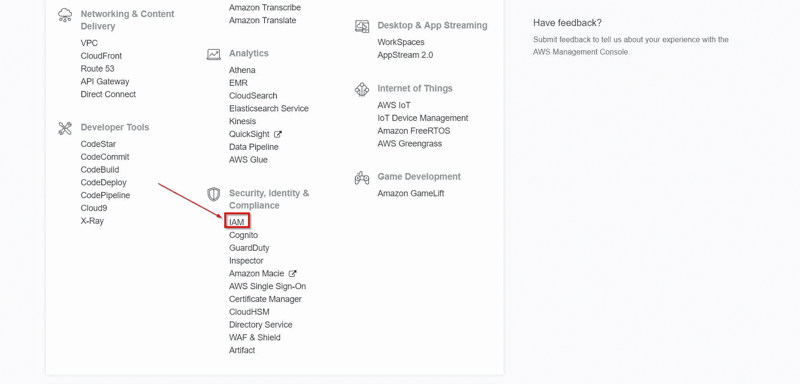

接下来，我们需要单击右侧的用户选项，然后单击添加用户以创建新的 IAM 用户：


从那里，将使用用户创建向导帮助您创建用户并生成访问密钥。在本向导的第一步中，您将选择用户名并为用户选择 AWS 访问类型。AWS 访问类型包括两种主要类型：编程访问或 AWS 管理控制台访问。显然，要创建能够被 AWS SDK 使用的用户，我们需要选择编程访问，如下所示：

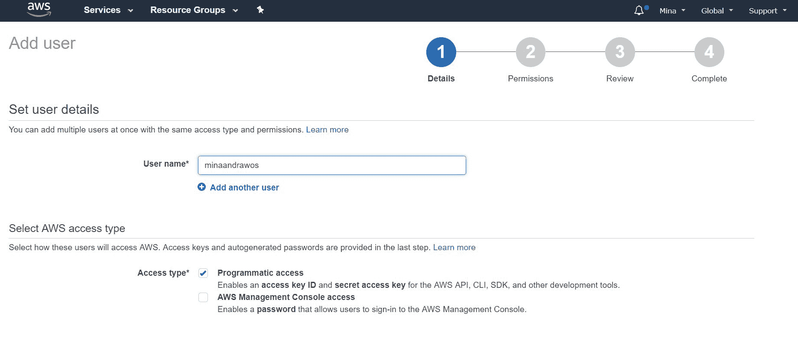

下一步将涉及将权限附加到正在创建的用户。为用户分配权限有三种方法。然而，在讨论这三种方法之前，我们首先需要了解政策的概念。策略只是定义权限的灵活方法。例如，可以创建一个新策略来定义对特定 S3 文件夹的只读访问。任何随后将此策略附加到其上的用户或组将只允许对此特定 S3 文件夹进行只读访问。AWS 提供了许多预创建的策略，我们可以在配置中使用这些策略。例如，有一个名为**AmazonS3FullAccess**的策略，允许其持有者完全访问 S3。现在，让我们回到为用户分配权限的三种方法：

*   **将用户添加到组**：组是可以有自己策略的实体。可以将多个用户添加到一个或多个组中。您可以将组简单地看作是用户的文件夹。特定组下的用户将有权访问该组策略允许的所有权限。此步骤中的配置向导将允许您创建新组并在需要时为其分配策略。这通常是向用户分配权限的推荐方式。
*   **复制现有用户的权限**：允许新用户享受已为不同用户配置的所有组和策略。例如，可以使用它将用户添加到新团队中。
*   **直接附加现有策略**：这允许直接将策略分配给新用户，而无需通过组或从其他用户复制。这种方法的缺点是，如果每个用户都被分配了单独的策略，而没有组提供的顺序感，那么随着用户数量的增加，管理用户变得单调乏味。

以下是三个选项的屏幕截图：

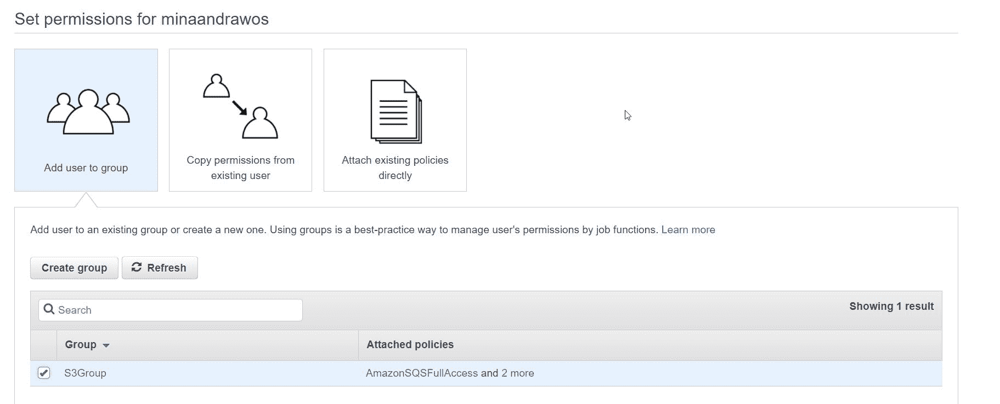

一旦完成了权限设置，我们就可以检查我们的选择并继续创建一个新用户。一旦创建了一个新用户，我们就可以选择将用户的访问密钥作为 CSV 文件下载。我们必须这样做，以便能够在以后的应用程序中使用这些访问密钥。访问密钥由访问密钥 ID 和秘密访问密钥值组成

一旦您拥有了访问密钥，就有多种方法允许您的代码使用它们；我们将讨论其中三个问题：

**直接使用环境变量**：我们的 AWS SDK 代码将查找两个主要环境变量，第三个环境变量是可选的。我们将只讨论两个主要的环境变量：

*   `AWS_ACCESS_KEY_ID`：设置访问密钥的密钥 ID
*   `AWS_SECRET_ACCESS_KEY`：设置访问密钥的密钥值

默认情况下，SDK 通常会先检查环境变量，然后再进行下一种方法。

**使用凭证文件**：凭证文件是一个纯文本文件，将承载您的访问密钥。该文件必须命名为`credentials`，并且需要位于计算机主目录的`.aws/`文件夹中。根据您的操作系统，主目录显然会有所不同。在 Windows 中，您可以使用环境变量`%UserProfile%`指出您的主目录。在 Unix 平台中，使用名为`$HOME`或`~`的环境变量。凭证文件为`.ini`格式，可以如下所示：

```go
[default]
aws_access_key_id = <YOUR_DEFAULT_ACCESS_KEY_ID>
aws_secret_access_key = <YOUR_DEFAULT_SECRET_ACCESS_KEY>

[test-account]
aws_access_key_id = <YOUR_TEST_ACCESS_KEY_ID>
aws_secret_access_key = <YOUR_TEST_SECRET_ACCESS_KEY>

[prod-account]
; work profile
aws_access_key_id = <YOUR_PROD_ACCESS_KEY_ID>
aws_secret_access_key = <YOUR_PROD_SECRET_ACCESS_KEY>
```

方括号之间的名称称为**剖面**。如前一段所示，您的凭证文件可以指定映射到不同配置文件的不同访问密钥。然而，接下来是一个重要的问题，我们的应用程序将使用什么配置文件？为此，我们需要创建一个名为`AWS_PROFILE,`的环境变量，该变量将指定配置文件名称以及分配给它的应用程序的名称。例如，假设我们的应用程序名为`testAWSapp`，我们希望它利用`test-account`配置文件，然后我们将`AWS_PROFILE`环境变量设置如下：

```go
$ AWS_PROFILE=test-account testAWSapp
```

如果未设置`AWS_PROFILE`环境变量，则默认拾取*默认*配置文件。

**在应用程序中对访问密钥进行硬编码**：出于安全原因，通常不建议这样做。因此，尽管在技术上可行，但不要在任何生产系统中尝试，因为任何有权访问您的应用程序代码的人（可能在 GitHub 中）都可以检索和使用您的访问密钥。

# 创建 IAM 角色

如前所述，如果应用程序运行在 AmazonEC2 实例上，建议使用 IAM 角色。通过 AWS 控制台创建 IAM 角色与创建 IAM 用户类似：

1.  我们首先登录 AWS 控制台（[AWS.amazon.com](http://aws.amazon.com)）
2.  然后，我们从安全、身份和合规类别下选择 IAM

从那以后，我们将走一条不同的道路。这一次，我们单击右侧的角色，然后选择创建新角色：

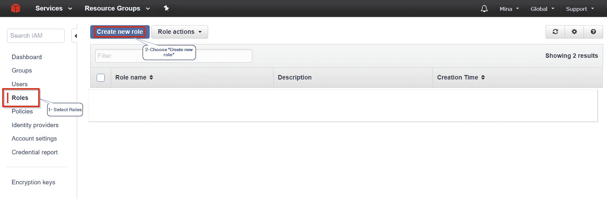

选择创建新角色后，我们将使用角色创建向导进行处理

我们首先被要求选择一个角色类型。对于我们的案例，我们需要选择 EC2 服务角色，然后选择 Amazon EC2：


从那里，我们将单击下一步。然后，我们需要选择新角色将使用的策略：


在我们的应用程序中，让我们选择以下四个策略：

*   AmazonS3FullAccess
*   AmazonSQSFullAccess
*   AmazondynamodFullAccess
*   AmazonAPIGatewayAdministrator

我们将再次单击下一步，然后进入最后一步，在这一步中，我们将设置角色名称，查看配置，然后单击创建角色以创建新角色。出于我们的目的，我创建了一个名为`EC2_S3_API_SQS_Dynamo`的新角色：


单击 createrole 后，将创建一个具有所选策略的新角色。

然后可以将此角色附加到 EC2 实例上，我们的应用程序代码将在该实例上运行。我们将在 EC2 部分探讨如何做到这一点。

# AWS Go SDK 的基础知识

为了利用 AWS SDK for Go 的强大功能，我们需要介绍两个关键概念。

# 会议

第一个概念是会话的概念。会话是 SDK 中的一个对象，它包含配置信息，我们可以使用这些信息与其他对象进行通信，以与 AWS 服务进行通信

`session`对象可以由不同的代码段共享和使用。对象应该被缓存和重用。创建一个新的`session`对象需要加载配置数据，因此重用它可以节省资源。`session`只要对象不被修改，就可以安全地同时使用。

要创建一个新的`session`对象，我们只需编写以下代码：

```go
session, err := session.NewSession()
```

这将创建一个新的`session`并将其存储在名为 session 的变量中。如果我们通过前面的代码创建一个新的`session`，将使用默认配置。如果需要重写配置，可以将指向`aws.Config`类型结构的对象的指针作为参数传递给`NewSession()`结构。假设我们要设置`Region`：

```go
session, err := session.NewSession(&aws.Config{
    Region: aws.String("us-east-2"),
})
```

我们可以用来创建新会话的另一个构造函数叫做`NewSessionWithOptions()`；这有助于覆盖我们用来提供创建会话所需信息的一些环境变量。例如，我们在前面讨论了如何定义一个配置文件来承载应用程序要使用的凭据。下面是它的样子：

```go
session,err := session.NewSessionWithOptions(session.Options{
   Profile: "test-account",
})
```

# 服务客户

第二个概念是服务客户的理念。服务客户端是一个对象，它提供对特定 AWS 服务（如 S3 或 SQS）的 API 访问

服务客户端对象是从会话对象创建的。下面是一段代码的示例，该代码使用 S3 服务客户端获取存储桶列表（S3 存储桶只是文件和文件夹的容器），然后分别打印出每个存储桶的名称：

```go
//Don't forget to import github.com/aws/aws-sdk-go/service/s3

 sess, err := session.NewSession(&aws.Config{
    Region: aws.String("us-west-1"),
  })
  if err != nil {
    log.Fatal(err)
  }
  s3Svc := s3.New(sess)
  results, err := s3Svc.ListBuckets(nil)
  if err != nil {
    log.Fatal("Unable to get bucket list")
  }

  fmt.Println("Buckets:")
  for _, b := range results.Buckets {
    log.Printf("Bucket: %s \n", aws.StringValue(b.Name))
  }
```

只要确保不更改并发代码中的配置，服务客户端对象通常可以安全地并发使用

在幕后，服务客户机利用 Restful API 调用与 AWS 交互。但是，它们会处理为您构建和保护 HTTP 请求所涉及的所有繁琐代码

在本章和下一章中，我们将创建会话和服务客户机对象来访问不同的 AWS 服务。会话和服务客户端是构建正确的 AWS 云本机应用程序所需的构建编码块。SDK 允许您深入研究底层请求；如果我们希望在发送多个请求之前对它们执行一些操作，这通常是很有用的。

AWS SDK 的大多数 API 方法调用遵循以下模式：

1.  API 方法名称通常描述某个操作。例如，假设我们有一个**简单队列服务**（**SQS**服务客户端对象，我们需要获取某个队列的 URL 地址。方法名称为`GetQueueUrl`。
2.  API 方法的输入参数通常类似于`<method name>Input`；所以，在`GetQueueUrl`方法的情况下，它的输入类型是`GetQueueUrlInput`。
3.  API 方法的输出类型通常类似于<method name="">输出；所以，在`GetQueueURL`方法的情况下，它的输出类型是`GetQueueUrlOutput`。</method>

# 本机数据类型

关于 SDK 方法的另一个重要注意事项是，几乎所有用作参数或结构字段中的数据类型都是指针，即使数据类型是本机的。例如，SDK 倾向于使用`*`字符串，而不是使用字符串数据类型作为字符串值，与 ints 和其他类型相同。为了让开发人员的生活更轻松，AWS SDK for Go 提供了帮助器方法，用于在本机数据类型及其指针之间进行转换，同时确保执行零检查以避免运行时恐慌

将本机数据类型转换为指向相同数据类型的指针的 helper 方法遵循以下模式：`aws.<datatype>`。例如，如果我们调用`aws.String("hello")`，该方法将返回指向存储`Hello`值的字符串的指针。如果我们调用`aws.Int(1)`，该方法将返回一个指向值为 1 的 int 的指针。

另一方面，在执行 nil 检查时将指针转换回其数据类型的方法遵循以下模式：`aws.<datatype>Value`。例如，如果我们调用`aws.IntValue(p)`，其中`p`是指向值为 1 的 int 的指针，那么返回的结果就是值为 1 的 int。为了进一步澄清，以下是 SDK 代码中`aws.IntValue`的实现：

```go
func IntValue(v *int) int {
  if v != nil {
    return *v
  }
  return 0
}
```

# 共享配置

由于不同的微服务在与 AWS 交互时可能需要使用相同的配置设置，AWS 提供了一个选项来使用所谓的共享配置。共享配置基本上是本地存储的配置文件。文件名和路径为`.aws/config`。记住，`.aws`文件夹将存在于我们操作系统的主文件夹中；在讨论凭据文件之前，该文件夹已被覆盖

配置文件应遵循类似于凭据文件的 ini 格式。它还以类似于我们前面在凭证文件中介绍的方式支持概要文件。以下是`.aws/config`应该是什么样子的示例：

```go
[default]
region=us-west-2
```

为了允许特定服务器中的微服务使用所述服务器的 AWS 配置文件，有两种方法：

1.  将`AWS_SDK_LOAD_CONFIG`环境变量设置为 true；这将导致 SDK 代码使用配置文件。
2.  创建会话对象时，使用`NewSessionWithOptions`构造函数启用使用共享配置。下面是代码的样子：

```go
sess, err := session.NewSessionWithOptions(session.Options{
    SharedConfigState: SharedConfigEnable,
})
```

有关完整的 AWS Go SDK 文档，您可以访问[https://docs.aws.amazon.com/sdk-for-go/api/](https://docs.aws.amazon.com/sdk-for-go/api/)

# 分页方法

一些 API 操作可以返回大量结果。例如，假设我们需要发出一个 API 调用来从 S3 存储桶中检索项目列表。现在，让我们假设 S3 存储桶包含大量的项，并且在一个 API 调用中返回所有项是没有效率的。AWS Go SDK 提供了一个名为**分页**的功能，以帮助实现该场景。通过分页，您可以在多个页面中获得结果。

您可以一次阅读每一页，然后在准备处理新项目时移动到项目的下一页。支持分页的 API 调用类似于<method name="">页面。例如，`ListObjects`S3 方法对应的分页 API 方法调用是`ListObjectsPages`。`ListObjectPages`方法将迭代`ListObject`操作产生的页面。它包含两个参数第一个参数是`ListObjectInput`类型，它将告诉`ListObjectPages`我们试图读取的 S3 存储桶的名称以及每页所需的最大键数。第二个参数是使用每个页面的响应数据调用的函数。以下是函数签名的外观：</method>

```go
func(*ListObjectsOutput, bool) bool
```

此参数函数有自己的两个参数。第一个论点是我们行动的结果；在我们的例子中，结果将托管在类型为`ListObjectsOutput`的对象中。第二个参数是`bool`类型，它基本上是一个标志，如果我们在最后一页，它是真的。函数返回类型为`bool`；如果愿意，我们可以使用返回值停止对页面的迭代。这意味着无论何时返回 false，分页都将停止

下面是 SDK 文档中的一个示例，它利用我们讨论的方法完美地展示了分页。下面的代码将使用分页来遍历 S3 存储桶中包含的项目列表。我们将要求每页最多 10 键。我们将打印每页的对象键，然后我们将退出一次，我们通过三页最多。下面是代码的外观：

```go
svc, err := s3.NewSession(sess)
if err != nil {
    fmt.Println("Error creating session ", err)
}
inputparams := &s3.ListObjectsInput{
    Bucket: aws.String("mybucket"),
    MaxKeys: aws.Int64(10),
}
pageNum := 0
svc.ListObjectsPages(inputparams, func(page *s3.ListObjectsOutput, lastPage bool) bool {
    pageNum++
    for _, value := range page.Contents {
        fmt.Println(*value.Key)
    }
    return pageNum < 3
})
```

# 服务员

Waiter 是 API 调用，允许我们等待某个操作完成。大多数服务员方法通常遵循 WaitUntil<action>格式。例如，在使用 DynamoDB 数据库时，有一个名为`WaitUntilTableExists`的 API 方法调用，它只需等待条件满足</action>

# 处理错误

AWS Go SDK 返回`awserr.Error`类型的错误，这是 AWS SDK 中满足通用 Go 错误接口类型的特殊接口类型。`awserr.Error`支持三种主要方式：

*   `Code()`：返回与问题相关的错误代码
*   `Message()`：返回错误的字符串描述
*   `OrigErr()`：返回以`awserr.Error`类型包装的原始错误；例如，如果问题与网络有关，`OrigErr()`返回可能属于 Go-net 包的原始错误

为了公开和使用`awserr.Error`类型，我们需要使用 Go 中的类型断言特性

让我们用一个实际的例子来展示如何使用`awserr.Error`类型。假设在我们的应用程序中，我们使用 Dynamodb 服务客户机对象通过项 ID 从 Dynamodb 表检索项。但是，我们在表名中犯了一个错误，现在它不存在，这将导致调用失败。代码如下所示：

```go
    result, err := dynamodbsvc.GetItem(&dynamodb.GetItemInput{
      Key: map[string]*dynamodb.AttributeValue{
        "ID": {
          N: aws.String("9485"),
        },
      },
      TableName: aws.String("bla"),
    })
    if err != nil {
      if v, ok := err.(awserr.Error); ok {
        log.Println("AWS ERROR...")
        if v.Code() == dynamodb.ErrCodeResourceNotFoundException {
          log.Println("Requested resource was not found...")
          return
        }
      }
    }
```

从前面的代码中，如果`dynamodbsvc.GetItem()`方法失败，我们无法获取项目，我们将捕获是否发生错误，然后使用 Go 的类型断言从我们的错误对象中获取基础`awserr.Error`类型。然后，我们继续检查错误代码，并将其与 SDK 中指示资源未找到问题的错误代码进行比较。如果这确实是一个资源未找到的问题，我们会打印一条消息，指出这一点，然后返回。下面是前面代码中的特定代码段，我们在该代码段中进行了错误检测和处理，如本段所述：

```go
    if err != nil {
      if v, ok := err.(awserr.Error); ok {
        log.Println("AWS ERROR...")
        if v.Code() == dynamodb.ErrCodeResourceNotFoundException {
          log.Println("Requested resource was not found...")
          return
        }
      }
    }
```

# 弹性计算云（EC2）

与任何其他 AWS 服务类似，我们将从 AWS 控制台开始，以便能够启动和部署 EC2 实例。如前所述，EC2 可以简单地描述为需要在 AWS 上旋转新服务器实例时使用的服务。

# 创建 EC2 实例

在 AWS 控制台主屏幕中，我们需要选择 EC2 以启动新的 EC2 实例：

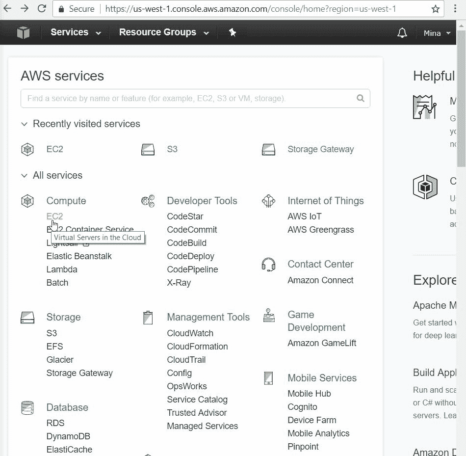

下一个屏幕将显示许多不同的选项来管理 EC2 实例。现在，我们需要做的是单击 LaunchInstance 按钮。您会注意到 AWS 区域如下所示：

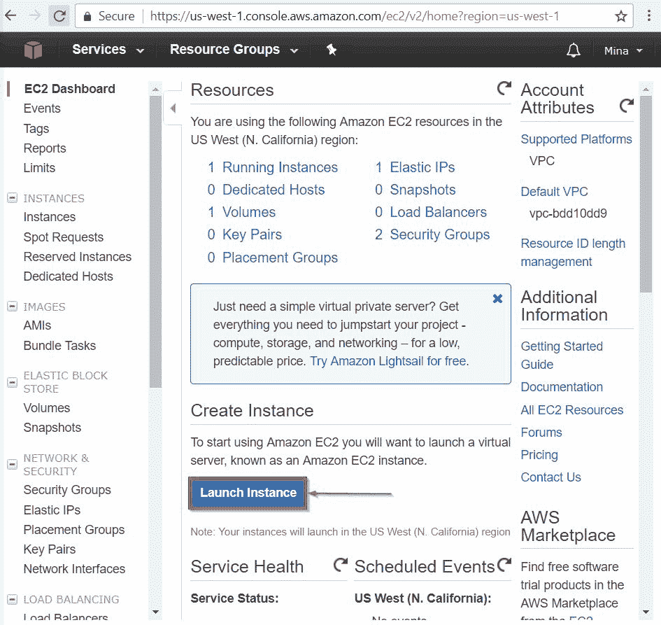

之后，我们将选择要用作云上虚拟服务器的映像。机器映像（**AMI**）上的**亚马逊****是一个首字母缩略词，用于描述亚马逊虚拟服务器映像及其需要启动的所有信息。AMI 包括一个模板，用于描述操作系统、虚拟服务器中的应用程序、指定哪个 AWS 帐户可以使用 AMI 启动虚拟服务器映像实例的启动权限，以及一个设备映射，用于指定实例启动后要附加到该实例的卷。Amazon 提供了许多我们可以立即使用的预制 AMI。但是，您也可以创建自己的。**

以下是 AWS 控制台中的 AMI 选择屏幕的外观：


从 AMI 描述中可以看出，AMI 定义了操作系统、命令行工具、编程语言环境，如 Python、Ruby 和 Pert

现在，让我们选择 AmazonLinuxAMI 选项继续下一步。在这一步中，我们将选择所需的服务器映像。在这里，您可以选择 CPU 内核的数量、内存和网络性能等。您会注意到术语 EBS 在实例存储下。**弹性块存储**（**EBS**），提供云托管存储卷，提供高可用性、可扩展性和耐久性。每个 EBS 在其可用性区域内进行复制。


接下来，我们可以单击 Review and Launch 按钮来启动 AMI，或者单击 Next:Configure Instance Details 按钮来深入查看实例的配置选项。更深层次的配置选项包括实例数、子网、网络地址等。

配置实例详细信息也是我们为 EC2 分配 IAM 角色（前面讨论过）的地方。我们在本章前面创建的 IAM 角色称为 EC2_S3_API_SQS_Dynamo，它将允许在此 EC2 实例上运行的应用程序访问 S3 服务、API 网关服务、SQS 服务和 Dynamo 数据库。以下是配置页面的外观：


在本章中，我们将单击 Review 和 Launch 来查看，然后启动实例。让我们看一下评论页面：


一旦我们对所有设置都感到满意，我们就可以继续并单击 Launch。这将显示一个请求公私密钥对的对话框。第三章详细讨论了公钥加密的概念。简而言之，我们可以将公钥-私钥加密描述为一种加密方法，在这种方法中，您可以与其他人共享公钥，以便他们在向您发送消息之前对消息进行加密。加密的消息只能通过只有您拥有的私钥解密。

对于 AWS，为了允许开发人员安全地连接到他们的服务，AWS 要求开发人员选择一个公私密钥对来确保访问的安全。公钥存储在 AWS 中，而私钥由开发人员存储

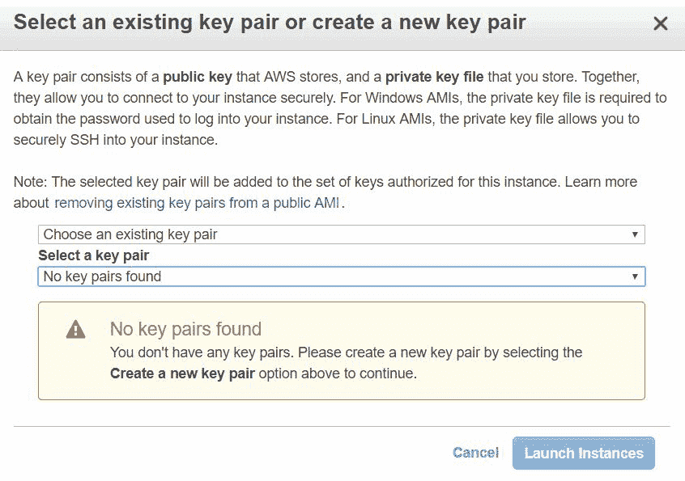

如果您还没有 AWS 的公私密钥对，这是我们可以创建一个的步骤。AWS 还允许您在不创建密钥的情况下继续操作，这显然会降低安全性，并且不建议在生产应用程序中使用。让我们看看当点击第一个列表框时，我们得到的三个选项：


如果选择创建新密钥对的选项，您将获得命名密钥对和下载私钥的选项。您必须下载私钥并将其存储在安全位置，以便以后使用：


最后，在下载私钥并准备启动实例后，我们可以单击启动实例按钮。这将启动启动实例的过程，并向我们显示一个状态，指示实例的启动状态。下面是下一个屏幕的典型外观：

>

完美的完成这一步后，我们就有了自己的 Linux 虚拟机在 Amazon 云中运行。让我们了解如何连接到它并探索它

# 访问 EC2 实例

为了访问我们已经创建的 EC2 实例，我们需要首先登录 AWS 控制台，然后像以前一样选择 EC2。这将使您能够访问 EC2 仪表板。从那里，我们需要单击实例，以便访问我们帐户下当前创建的 EC2 实例。


这将打开已创建的 EC2 实例列表。我们刚刚创建的实例是第一个；您将注意到，它的实例 ID 与我们之前创建实例时显示的实例 ID 相匹配。


前面的屏幕截图显示该实例当前正在 AWS 上运行。如果我们愿意，我们可以像任何远程服务器一样连接到它。让我们探讨一下如何做到这一点

第一步是选择有问题的实例，然后单击 Connect 按钮。这不会直接连接到您的实例；但是，它将提供如何建立到 EC2 实例的连接的有用说明列表。为了建立连接，您将需要利用 SSH 协议结合先前下载的私有加密密钥来远程登录 EC2 虚拟服务器。**Secure Shell**（**SSH**是一种主要用于用户安全登录远程计算机的协议。

调用 SSH 的方法可能因操作系统而异。例如，如果您使用的是 Windows 操作系统，那么您应该使用流行的 PuTTY 工具（位于[中）https://www.chiark.greenend.org.uk/~sgtatham/putty/latest.html](https://www.chiark.greenend.org.uk/~sgtatham/putty/latest.html)建立到 EC2 实例的 SSH 连接。如果您使用的是 macOS 或 Linux，那么可以直接使用 SSH 命令。

# 从 Linux 或 macOS 计算机访问 EC2 实例

为了从 Linux 或 macOS 机器访问 AWS 上创建的 EC2 实例，我们需要使用 SSH 命令。

第一步是确保我们在前面创建 EC2 实例时下载的连接私钥是安全的，外部各方无法访问。这通常通过在终端上执行以下命令来完成：

```go
chmod 400 my-super-secret-key-pair.pem
```

`my-super-secret-key-pair.pem`是包含私钥的文件的名称。显然，如果文件名不同，则需要确保命令的目标文件名正确。要使前面的命令起作用，我们需要从密钥所在的文件夹中运行它。否则，我们需要指定密钥的路径。

在确保密钥不受公共访问的保护后，我们需要使用 SSH 命令连接到我们的 EC2 实例。为此，我们需要三条信息：私钥文件名、EC2 映像用户名和连接的 DNS 名称。我们已经知道密钥文件名，这意味着我们现在需要计算出连接的用户名和 DNS 名称。用户名将取决于 EC2 实例操作系统。下表显示了操作系统到用户名的映射：

| **操作系统** | **用户名** |
| 亚马逊 Linux | `ec2-user` |
| RHEL（红帽企业 Linux） | `ec2-user`还是根 |
| Ubuntu | ubuntu 还是 root |
| 森托斯 | 森托斯 |
| 软呢帽 | `ec2-user` |
| 苏西 | `ec2-user`还是根 |

对于其他操作系统，如果`ec2-user`或 root 不工作，请向**Amazon 机器映像**（**AMI**供应商查询。

现在，我们需要的其余信息是到 EC2 实例的连接的 DNS 名称。我们只需查看状态页面上的 EC2 实例详细信息即可找到：


有了它，我们就有了执行 SSH 命令访问 EC2 实例所需的一切；该命令将如下所示：

```go
ssh -i "my-super-secret-key-pair.pem" ec2-user@ec2-54-193-5-28.us-west-1.compute.amazonaws.com
```

前面命令中的私钥名称为`my-super-secret-key-pair.pem`，用户名为`ec2-user`，而 DNS 为`ec2-54-193-5-28.us-west-1.compute.amazonaws.com`。

这个命令将允许我们访问刚刚创建的 EC2 实例；以下是屏幕的外观：

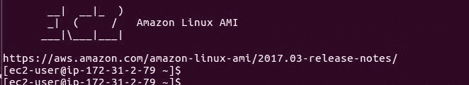

# 从 Windows 访问 EC2

要从 Windows 访问 EC2，我们可以使用上一节介绍的 SSH 工具的 Windows 版本，也可以使用 PuTTY。PuTTY 是一种非常流行的 SSH 和 telnet 客户端，可以在 Windows 或 Unix 上运行。要下载 PuTTY，我们需要访问[https://www.chiark.greenend.org.uk/~sgtatham/PuTTY/latest.html](https://www.chiark.greenend.org.uk/~sgtatham/putty/latest.html)。一旦我们下载 PuTTY，安装并运行它，主屏幕将如下所示：

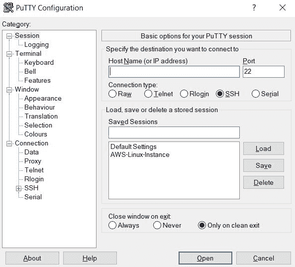

在使用 PuTTY 连接到 EC2 实例之前，我们需要将之前获得的私钥文件转换为 PuTTY 软件可以轻松使用的不同文件类型

要执行私钥转换，我们需要一个名为**PuTTYgen**的工具的帮助，该工具与 PuTTY 一起安装。PuTTYgen 可以在所有程序>PuTTY>PuTTYgen 下找到。以下是 PuTTYgen 启动后的样子：


在参数下，确保选择 RSA 作为加密算法，生成的密钥中的位数为 2048

要继续，让我们单击 Load 按钮，以便能够将 AWS 私钥加载到工具中。“加载”按钮将打开一个对话框，允许我们选择私钥文件。我们需要选择显示所有文件的选项，以便能够查看私钥文件：


然后，我们可以选择该键，然后单击 Open，以便将该键加载到 PuTTYgen 工具中。下一步是单击 Save Private Key 完成密钥转换。将显示一条警告，询问您是否确定要保存此密钥而不使用密码短语来保护它；点击 Yes。密码短语应该是一个额外的保护层；但是，它需要用户输入才能工作。因此，如果我们想要自动化到 EC2 实例的 SSH 连接，我们不应该启用密码短语。单击“是”后，我们可以选择转换文件的文件名；然后，单击 Save 创建并保存文件。PuTTY 私钥为`*.ppk`类型。


完美的我们现在有了一个 PuTTY 私钥，可以用于我们的用例。下一步是打开 PuTTY 工具，以便使用此密钥通过 SSH 连接到 EC2 实例。

打开 PuTTY 之后，我们需要转到 Connection 类别下的 SSH 选项，然后从那里导航到 Auth 选项。在 Auth 窗口中，我们将搜索加载我们先前创建的 PuTTY 私钥文件的选项

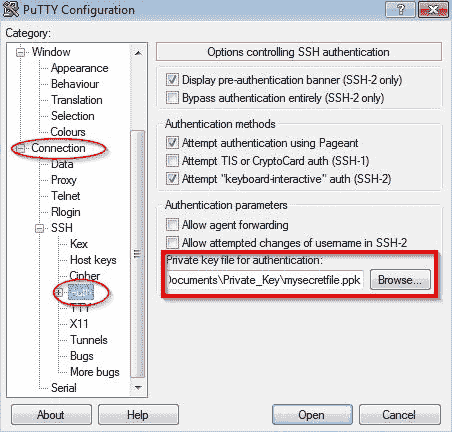

接下来，我们需要单击右侧的会话类别。然后，在右侧的主机名（或 IP 地址）字段下，我们需要以以下格式输入用户名和公共 DNS 地址：`username@DNS public`名称。在我们的例子中，它看起来是这样的：`ec2-user@ec2-54-193-5-28.us-west-1.compute.amazonaws.com`：

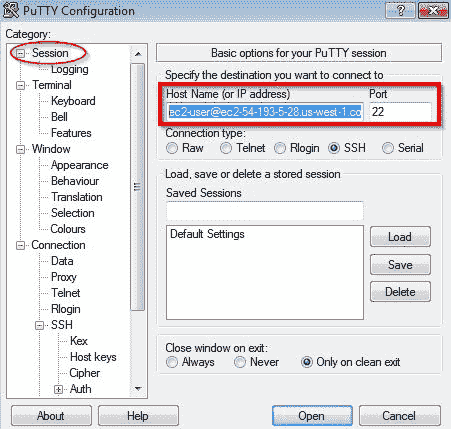

从那里，我们可以单击 Open 以打开到 EC2 实例的会话。第一次尝试打开会话时，我们将收到一条消息，询问我们是否信任尝试连接的服务器。如果我们信任它，我们需要单击 Yes，这将把服务器的主机密钥缓存到注册表中。


这将为我们的 EC2 实例打开一个安全会话；然后，我们可以随心所欲地使用它：

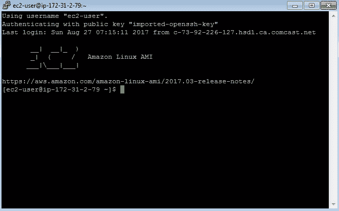

PuTTY 能够保存现有会话信息。完成配置后，我们可以选择一个名称，然后单击保存，如下图所示，以保存会话信息：


# 安全小组

伟大的这涵盖了有关如何在不同操作系统中配置和设置 EC2 实例的足够实用知识。现在，我们还需要讨论另一个主题，即安全组。您可以将安全组视为围绕 EC2 实例的防火墙规则的集合。例如，通过添加安全规则，您可以允许在 EC2 上运行的应用程序接受 HTTP 流量。您可以创建允许访问特定 TCP 或 UDP 端口的规则，以及更多

因为我们希望将 web 服务部署到我们的 EC2 实例，比如*事件微服务*。我们需要创建一个允许 HTTP 通信的安全组，然后将该组分配给我们的 EC2 实例

我们需要做的第一步是打开 EC2 仪表板，进入 AWS 控制台主屏幕，然后像以前一样选择 EC2。进入 EC2 仪表板后，我们可以单击左侧的安全组，该组将位于网络和安全类别下：


安全组仪表板将显示已创建的所有安全组的列表。仪表板允许我们创建新组或编辑现有组。因为在我们的例子中，我们正在创建一个新组，所以我们需要单击仪表板左上方的 CreateSecurityGroup。


一个表单窗口将显示我们需要填写的字段，以便创建我们的安全组。首先，我们需要提供安全组的名称、可选描述以及我们的安全组将应用的虚拟私有云的名称。虚拟私有云被简单地定义为 AWS 云中逻辑上隔离的部分；我们可以定义自己的。

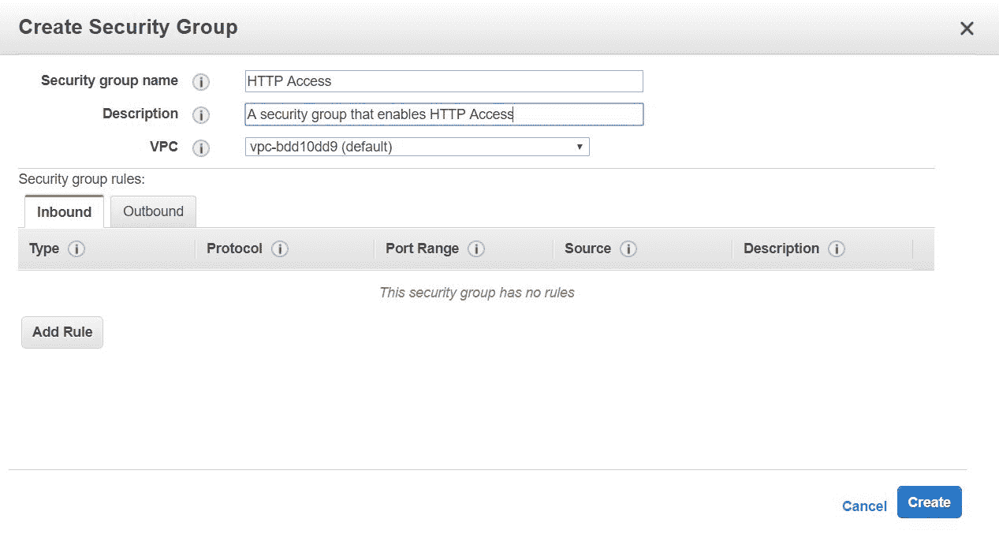

在前面的屏幕截图中，我们将我们的安全组命名为 HTTP Access；我们将其描述为启用 HTTP 访问的安全组，然后选择默认 VPC。

下一步是单击 AddRule 按钮，开始定义将组成安全组的规则。单击它之后，安全组规则部分中将出现一个新行。我们需要单击 Type 列下的列表框，然后选择 HTTP。结果如下所示：

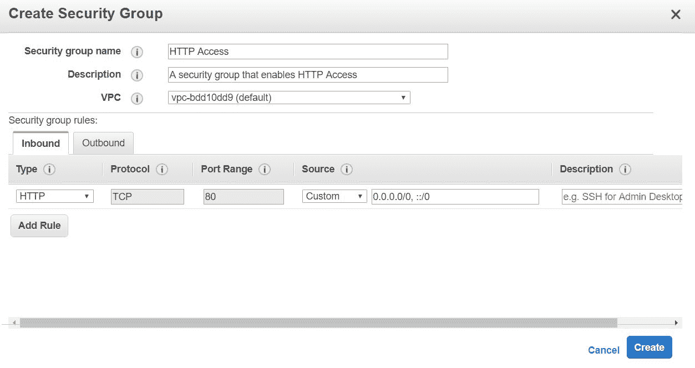

您将注意到，协议、端口范围和源字段将为您填充。TCP 是 HTTP 的底层协议，而端口 80 是 HTTP 端口

如果愿意，我们还可以添加 HTTPS 规则；我们将遵循相同的步骤，除了选择类型时，将选择 HTTPS 而不是 HTTP。您还可以研究其余选项，以发现在安全规则下可以创建哪些其他异常

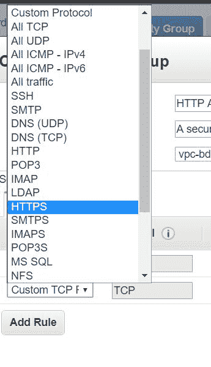

创建安全组后，我们将在安全组列表中找到它：


一旦创建了安全组，就可以将其附加到现有 EC2 实例。这是通过返回 EC2 仪表板，然后选择正在运行的实例，然后从 EC2 实例列表中选择感兴趣的实例来完成的。从那里，我们单击操作，然后单击网络，然后更改安全组：

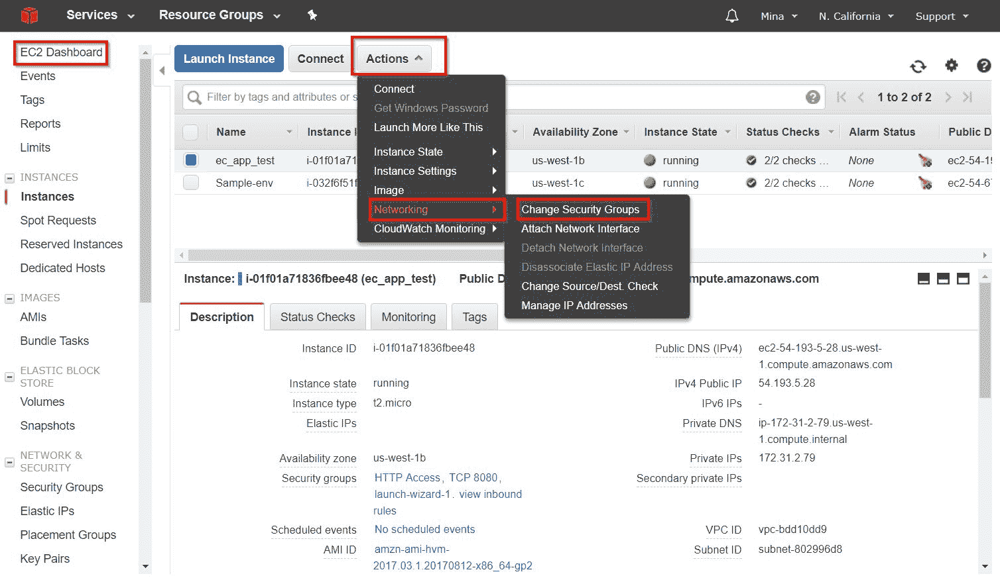

从中，我们可以选择要附加到实例的安全组：


完美的有了这个，我们的 EC2 实例现在允许 HTTP 访问运行在它内部的应用程序。

另一个重要的注意事项是，我们可以在创建 EC2 实例时将安全组分配给 EC2 实例。我们通过在创建新实例时单击“配置实例详细信息”，然后按照配置向导进入“配置安全组”选项来访问此选项。

# 总结

在本章中，我们通过学习如何配置 EC2 以及如何使用 AWS SDK for Go 开始介绍 AWS。在下一章中，我们将继续深入了解 AWS，学习一些关键的 AWS 服务以及如何编写能够正确使用它们的 Go 代码。*