# AWS II–S3、SQS、API 网关和 DynamoDB

在本章中，我们将继续讨论 AmazonWeb 服务这个庞大的主题。在本章中，我们将介绍 S3 服务、SQS 服务、AWSAPI 网关服务和 DynamoDB 服务。这些服务中的每一项都是构建部署在云上的生产应用程序的强大工具。

本章将介绍以下主题：

*   AWS S3 存储服务
*   SQS 消息队列服务
*   AWS API 网关服务
*   DynamoDB 数据库服务

# 简单存储服务（S3）

AmazonS3 是一个 AWS 服务，负责存储和分析数据。数据通常包括各种类型和形状的文件（包括音乐文件、照片、文本文件和视频文件）。例如，S3 可用于存储静态数据的代码文件。让我们来看看如何在 AWS 中使用 S3 服务。

# 配置 S3

S3 服务将文件存储在存储桶中。每个 bucket 可以直接保存文件，也可以包含多个文件夹，反过来，每个文件夹可以保存多个文件。

我们将使用 AWSWeb 控制台来配置 S3，类似于我们对 EC2 所做的。第一步是导航到 AWS web 控制台，然后选择 S3：


这将打开 AmazonS3 控制台；在那里，我们可以单击 Create bucket 创建一个新的 bucket 来存储数据文件夹：


这将启动一个向导，引导您完成正确创建 bucket 所需的不同步骤。这将使您能够设置 bucket 名称、启用版本控制或日志记录、设置标记和设置权限。完成后，将为您创建一个新的 bucket。bucket 名称必须是唯一的，这样它就不会与其他 AWS 用户使用的 bucket 发生冲突。

我创建了一个名为`mnandbucket`的 bucket；它将显示在我的 S3 主网页的存储桶列表中。如果您的存储桶数量超过页面显示的数量，则可以在搜索栏中搜索存储桶：


一旦我们输入一个 bucket，我们就可以创建文件夹并上传文件：

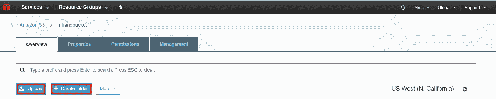

完美的有了这些，我们对 S3 有了一个实用的概念。

您可以从[下载此文件 https://www.packtpub.com/sites/default/files/downloads/CloudNativeprogrammingwithGolang_ColorImages.pdf](https://www.packtpub.com/sites/default/files/downloads/CloudNativeprogrammingwithGolang_ColorImages.pdf) 。
该书的代码包也托管在 GitHub 上的[https://github.com/PacktPublishing/Cloud-Native-Programming-with-Golang](https://github.com/PacktPublishing/Cloud-Native-programming-with-Golang) 。

S3 存储可用于存储我们的应用程序文件，以供以后使用。例如，假设我们构建了在 Linux 环境中运行的`events`微服务，应用程序的文件名就是`events`。然后，我们可以简单地将文件存储在 S3 文件夹中；然后，每当我们需要一个 EC2 实例来获取文件时，我们都可以使用 EC2 实例中的 AWS 命令行工具来实现这一点。

我们首先需要确保正确定义 AWS 角色，以允许 EC2 实例访问 S3 存储，正如前面所述。然后，要将文件从 S3 复制到 EC2 实例，我们需要从 EC2 实例发出以下命令：

```go
aws s3 cp s3://<my_bucket>/<my_folder>/events my_local_events_copy
```

前面的命令将从 S3 存储中检索`events`文件，然后将其复制到名为`my_local_events_copy`的新文件中，该文件将位于当前文件夹中。`<my_bucket>`和`<my_folder>`分别表示 S3 存储中事件文件所在的 bucket 和文件夹。

在我们将一个可执行文件复制到 EC2 之后，我们需要通过 Linux`chmod`命令授予它执行权限。这是通过使用以下命令实现的：

```go
chmod u+x <my_executable_file>
```

在前面的命令中，`<my_executable_file>`是我们希望在 EC2 实例中获得足够的访问权限以执行的文件。

# 简单队列服务（SQS）

如前所述，SQS 是 AWS 提供的消息队列。可以与 SQS 交互的应用程序可以在 AWS 生态系统中发送和接收消息

让我们从讨论如何从 Amazon 控制台配置 SQS 开始。通常，第一步是登录到 Amazon 控制台，然后从主仪表板选择我们的服务。在这种情况下，服务名称将称为简单队列服务：

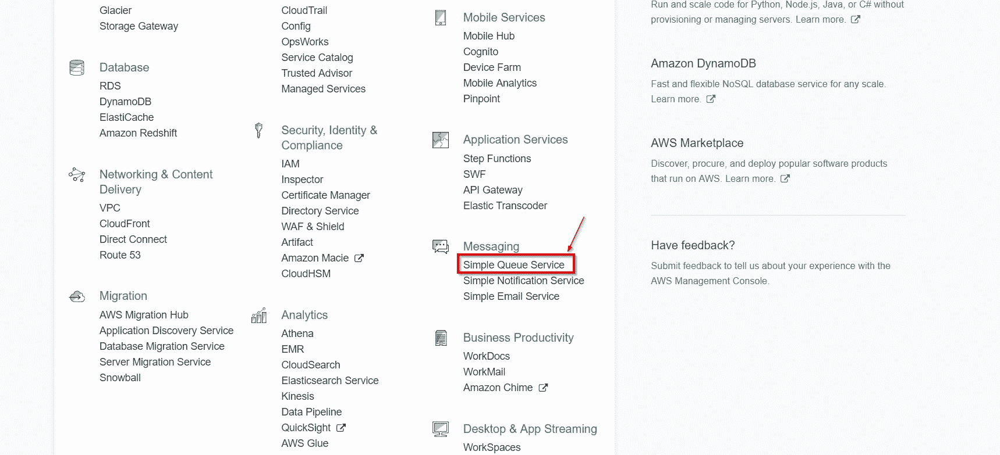

从这里开始，我们需要单击 Getting started（入门）或 Create New Queue（创建新队列）。队列创建页面将为我们提供配置新队列行为的功能。例如，我们可以设置允许的最大邮件大小、保留邮件的天数，甚至设置接收邮件的等待时间：


一旦您对设置感到满意，请单击创建队列-我选择了名称`eventqueue`。


这将创建一个新的 AWS SQS 队列，我们可以在代码中使用它。现在，是讨论如何编写代码与新队列交互的时候了。

完美的创建队列后，我们准备编写一些代码，通过新创建的 AWS SQS 队列发送和接收消息。让我们从探索发送数据所需编写的代码开始。

AWS SDK Go SQS 包的文档可在[找到 https://godoc.org/github.com/aws/aws-sdk-go/service/sqs](https://godoc.org/github.com/aws/aws-sdk-go/service/sqs) 。

与任何其他 AWS 服务一样，我们需要首先采取两个关键步骤：

*   获取或创建会话对象
*   为所需的 AWS 服务创建服务客户端

以下代码涵盖了上述步骤：

```go
 sess, err := session.NewSession(&aws.Config{
   Region: aws.String("us-west-1"),
 })
 if err != nil {
   log.Fatal(err)
 }
 sqsSvc := sqs.New(sess)
```

前面的代码在调用`NewSession()`构造函数时通过该代码设置区域；但是，我们可以选择使用共享配置，如前一章所述。我在这段代码中使用了`log.Fatal()`，因为它只是测试代码，所以如果出现任何失败，我希望退出并报告错误消息。

接下来，我们需要获取消息队列 URL。URL 很重要，因为它是 SDK 方法调用中消息队列的唯一标识符。我们可以从 AWS 控制台 SQS 页面获取 URL，在该页面中，当选择队列时，队列的 URL 将显示在详细信息选项卡中，或者通过代码，利用我们在创建队列时选择的队列名称。就我而言，我叫我的队列`eventqueue`；那么，让我们来看看如何通过代码获得那个名字的 URL：

```go
  QUResult, err := sqsSvc.GetQueueUrl(&sqs.GetQueueUrlInput{
    QueueName: aws.String("eventqueue"),
  })
  if err != nil {
    log.Fatal(err)
  }
```

`QUResult`对象属于`*GetQueueUrlOutput`类型，是指向结构的指针，该结构包含一个名为`*string`类型的`QueueUrl`字段。如果成功执行了`GetQueueUrl()`方法，则此字段应具有我们的队列 URL

完美的现在我们已经有了队列的 URL，可以通过消息队列发送一些数据了。然而，在我们这样做之前，我们需要涵盖一些重要的定义，以理解接下来的代码。

*   **消息体***：*消息体就是我们试图发送的核心消息。例如，如果我想通过 SQS 发送 hello 消息，那么消息体将是 hello。
*   **消息属性***：*消息属性是结构化元数据项的集合。您可以将它们简单地看作是一个键值对列表，您可以定义这些键值对并将其与消息一起发送。消息属性是可选的；然而，它们可能很强大，因为它们允许发送比文本更结构化、更复杂的消息。消息属性允许我们在开始处理消息体之前了解消息可能包含的内容。每个消息最多可以包含 10 个消息属性。消息属性支持三种主要数据类型：字符串、数字和二进制。二进制类型表示二进制数据，如压缩文件和图像。

现在，让我们回到示例代码；比如说，我们希望通过 SQS 为我们的活动应用程序发送一条消息，表示客户预订了一些音乐会；我们的邮件将具有以下属性：

*   **消息属性**：我们想要两个消息属性：
    *   `message_type`：在我们的案例中，我们试图发送的消息类型，该属性的值将为“RESERVATION”
    *   `Count`：此消息中包含的预订数量
*   **消息体**：需要 JSON 格式的预留数据。数据包括保留音乐会的客户名称和活动名称（本例中为音乐会）

下面是代码的外观：

```go
sendResult, err := sqsSvc.SendMessage(&sqs.SendMessageInput{
  MessageAttributes: map[string]*sqs.MessageAttributeValue{
    "message_type": &sqs.MessageAttributeValue{
      DataType: aws.String("String"),
      StringValue: aws.String("RESERVATION"),
    },
    "Count": &sqs.MessageAttributeValue{
      DataType: aws.String("Number"),
      StringValue: aws.String("2"),
    },
  },
  MessageBody: aws.String("[{customer:'Kevin S',event:'Pink Floyd Concert'},{customer:'Angela      T',event:'Cold Play Concert'}]"),
  QueueUrl: QUResult.QueueUrl,
})
```

前面的代码使用`SendMessage()`方法发送消息。`SendMessage()`采用`*SendMessageInput{}`类型的参数，在这里我们定义消息属性、消息体，并标识队列 URL

之后，我们可以检查是否发生了任何错误。我们可以通过以下代码获取我们创建的邮件的 ID：

```go
  if err != nil {
    log.Fatal(err)
  }
  log.Println("Message sent successfully", *sendResult.MessageId)
```

完美的通过这段示例代码，我们现在知道了如何通过 SQS 发送消息。现在，让我们学习如何接收它们

在开始研究消息接收代码之前，我们需要涵盖一些概念和回答一些问题。假设我们有一个微服务体系结构，其中多个微服务正在从 SQS 消息队列读取消息。需要回答的一个重要问题是，在我们的一个服务收到消息后，我们会做什么？是否应该允许其他服务在之后接收该消息？这两个问题的答案取决于上述信息的目的。如果消息应该被消费和处理一次，那么我们需要确保第一个正确接收该消息的服务应该将其从队列中删除

在 AWS SQS 中，在标准队列中接收消息时，不会从队列中删除消息。相反，我们需要在收到消息后从队列中显式删除消息，以确保消息消失，如果这是我们的意图的话。然而，还有另一个复杂问题。让我们假设 microservice A 收到一条消息并开始处理它。然而，在 microservice A 从队列中删除消息之前，microservice B 收到消息并开始处理它，这是我们不希望看到的。

为了避免这种情况，SQS 引入了一个称为**可见性超时**的概念。可视性超时只会使消息在一个使用者收到消息后的一段时间内不可见。这个超时给了我们一些时间来决定如何处理消息，然后其他消费者才能看到并处理它。

重要的一点是，并不总是保证不会收到两次消息。这是因为 SQS 队列通常分布在多个服务器之间。很少有情况下，删除请求无法到达服务器，因为它处于脱机状态，这意味着尽管有删除请求，消息可能仍然存在。

SQS 中的另一个重要概念是长轮询或等待时间。由于 SQS 是分布式的，有时可能会有一些延迟，因此一些消息接收速度可能会很慢。如果我们关心接收消息，即使它们很慢，那么我们在收听传入消息时也需要等待更长的时间。

以下是显示从队列接收消息的示例代码：

```go
  QUResult, err := sqsSvc.GetQueueUrl(&sqs.GetQueueUrlInput{
    QueueName: aws.String("eventqueue"),
  })
  if err != nil {
    log.Fatal(err)
  }
  recvMsgResult, err := sqsSvc.ReceiveMessage(&sqs.ReceiveMessageInput{
    AttributeNames: []*string{
      aws.String(sqs.MessageSystemAttributeNameSentTimestamp),
    },
    MessageAttributeNames: []*string{
      aws.String(sqs.QueueAttributeNameAll),
    },
    QueueUrl: QUResult.QueueUrl,
    MaxNumberOfMessages: aws.Int64(10),
    WaitTimeSeconds: aws.Int64(20),
  })
```

在前面的代码中，我们尝试侦听来自我们创建的 SQS 队列的传入消息。我们像以前一样使用`GetQueueURL()`方法来检索队列 URL，以便在`ReceiveMessage()`方法中使用。

`ReceiveMessage()`方法允许我们指定要捕获的消息属性（我们前面讨论过），以及一般的系统属性。系统属性是消息的一般属性，例如消息随附的时间戳。在前面的代码中，我们请求所有消息属性，但仅请求消息时间戳系统属性。

我们将单个呼叫中希望接收的最大消息数设置为 10。需要指出的是，这只是请求的最大消息数，因此接收较少的消息是很常见的。最后，我们将轮询时间设置为最长 20 秒。如果我们接收消息的速度超过 20 秒，则呼叫将返回捕获的消息，而无需等待。

现在，我们应该如何处理捕获的消息？为了展示代码，假设我们希望将消息体和消息属性打印到标准输出。然后，我们删除这些消息。下面是它的样子：

```go
for i, msg := range recvMsgResult.Messages {
    log.Println("Message:", i, *msg.Body)
    for key, value := range msg.MessageAttributes {
      log.Println("Message attribute:", key, aws.StringValue(value.StringValue))
    }

    for key, value := range msg.Attributes {
      log.Println("Attribute: ", key, *value)
    }

    log.Println("Deleting message...")
    resultDelete, err := sqsSvc.DeleteMessage(&sqs.DeleteMessageInput{
      QueueUrl: QUResult.QueueUrl,
      ReceiptHandle: msg.ReceiptHandle,
    })
    if err != nil {
      log.Fatal("Delete Error", err)
    }
    log.Println("Message deleted... ")
  }
```

请注意，在前面的代码中，我们在`DeleteMessage()`方法中使用了一个名为`msg.ReceiptHandle`的对象来标识我们要删除的消息。ReceiptHandle 是我们从队列接收消息时获得的对象；此对象的目的是允许我们删除后来收到的消息。每当收到消息时，都会创建一个 ReceiptHandle

此外，我们在前面的代码中收到了消息，然后对其进行了剖析：

*   我们调用`msg.Body`来检索我们的邮件正文
*   我们调用`msg.MessageAttributes`来获取我们消息的消息属性
*   我们调用`msg.Attributes`以获取消息附带的系统属性

有了这些，我们就有足够的知识为`events`应用程序实现 SQS 消息队列发射器和侦听器。在上一章中，我们创建了两个关键接口，需要为应用程序中的消息队列实现它们。其中之一是发射器接口，负责通过消息队列发送消息。另一个是侦听器接口，负责从消息队列接收消息

作为快速复习，发射器接口的外观如何：

```go
package msgqueue

// EventEmitter describes an interface for a class that emits events
type EventEmitter interface {
  Emit(e Event) error
}
```

此外，以下是侦听器界面的外观：

```go
package msgqueue

// EventListener describes an interface for a class that can listen to events.
type EventListener interface {
 Listen(events ...string) (<-chan Event, <-chan error, error)
 Mapper() EventMapper
}
```

`Listen`方法获取事件名称列表，然后返回通道中的事件，以及尝试通过消息队列接收事件时发生的任何错误。这称为通道生成器模式。

因此，为了使我们的应用程序支持 SQS 消息队列，我们需要实现这两个接口。让我们从`Emitter`接口开始。我们将在`./src/lib/msgqueue`中创建一个新文件夹；新文件夹名称将为`sqs`。在`sqs`文件夹中，我们创建了两个文件-`emitter.go`和`listener.go`。`emitter.go`是我们实现发射器接口的地方。

我们首先创建一个新对象来实现发射器接口，该对象称为`SQSEmitter`。它将包含 SQS 服务客户端对象以及队列的 URL：

```go
type SQSEmitter struct {
  sqsSvc *sqs.SQS
  QueueURL *string
}
```

然后，我们需要为发射器创建一个构造函数。在构造函数中，我们将从现有会话或新创建的会话创建 SQS 服务客户端。我们还将利用`GetQueueUrl`方法获取队列的 URL。下面是它的外观：

```go
func NewSQSEventEmitter(s *session.Session, queueName string) (emitter msgqueue.EventEmitter, err error) {
  if s == nil {
    s, err = session.NewSession()
    if err != nil {
      return
    }
  }
  svc := sqs.New(s)
  QUResult, err := svc.GetQueueUrl(&sqs.GetQueueUrlInput{
    QueueName: aws.String(queueName),
  })
  if err != nil {
    return
  }
  emitter = &SQSEmitter{
    sqsSvc: svc,
    QueueURL: QUResult.QueueUrl,
  }
  return
}
```

下一步是实现发射器接口的`Emit()`方法。我们将发出的消息应具有以下属性：

*   它将包含一个名为`event_name`的消息属性，它将保存我们试图发送的事件的名称。如前所述，在本书中，事件名称描述了应用程序试图处理的事件类型。我们有三个活动名称-`eventCreated`、`locationCreated`和`eventBooked`。请记住，`eventCreated`和`eventBooked`指的是正在创建或预订的应用程序事件（而不是消息队列事件），例如音乐会或马戏团表演。
*   它将包含一个消息体，它将保存事件数据。消息正文将采用 JSON 格式。

下面是代码的外观：

```go
func (sqsEmit *SQSEmitter) Emit(event msgqueue.Event) error {
  data, err := json.Marshal(event)
  if err != nil {
    return err
  }
  _, err = sqsEmit.sqsSvc.SendMessage(&sqs.SendMessageInput{
    MessageAttributes: map[string]*sqs.MessageAttributeValue{
      "event_name": &sqs.MessageAttributeValue{
        DataType: aws.String("string"),
        StringValue: aws.String(event.EventName()),
      },
    },
    MessageBody: aws.String(string(data)),
    QueueUrl: sqsEmit.QueueURL,
  })
  return err
}
```

这样，我们就为发射器接口实现了一个 SQS 消息队列。现在，让我们讨论一下侦听器接口。

监听器接口将在`./src/lib/msgqueue/listener.go`文件中实现。我们从实现接口的对象开始。对象名称为`SQSListener`。它将包含消息队列事件类型映射器、SQS 客户端服务对象、队列的 URL、从一个 API 调用接收的最大消息数、接收消息的等待时间以及可见性超时。下面是它的外观：

```go
type SQSListener struct {
  mapper msgqueue.EventMapper
  sqsSvc *sqs.SQS
  queueURL *string
  maxNumberOfMessages int64
  waitTime int64
  visibilityTimeOut int64
}
```

我们首先从构造器开始；代码将类似于我们为发射器构建的构造函数。我们将确保拥有一个 AWS 会话对象、一个服务客户端对象，并根据队列名称获取队列的 URL：

```go
func NewSQSListener(s *session.Session, queueName string, maxMsgs, wtTime, visTO int64) (listener msgqueue.EventListener, err error) {
  if s == nil {
    s, err = session.NewSession()
    if err != nil {
      return
    }
  }
  svc := sqs.New(s)
  QUResult, err := svc.GetQueueUrl(&sqs.GetQueueUrlInput{
    QueueName: aws.String(queueName),
  })
  if err != nil {
    return
  }
  listener = &SQSListener{
    sqsSvc: svc,
    queueURL: QUResult.QueueUrl,
    mapper: msgqueue.NewEventMapper(),
    maxNumberOfMessages: maxMsgs,
    waitTime: wtTime,
    visibilityTimeOut: visTO,
  }
  return
}
```

之后，我们需要实现`listener`接口的`Listen()`方法。该方法执行以下操作：

*   它将事件名称列表作为参数
*   它监听传入的消息
*   当它收到消息时，它会检查消息事件名称，并将其与作为参数传递的事件名称列表进行比较
*   如果收到的消息不属于请求的事件，它将被忽略
*   如果接收到属于已知事件的消息，它将通过“事件”类型的 a Go 通道传递给外部世界
*   被接受的邮件在通过 Go 频道后会被删除
*   发生的任何错误都会通过错误对象的另一个 Go 通道传递

让我们关注一下目前将侦听和接收消息的代码。我们将为此创建一个名为`receiveMessage()`的新方法。下面是它的分解方式：

1.  首先，我们接收消息并将任何错误传递到 Go 错误通道：

```go
func (sqsListener *SQSListener) receiveMessage(eventCh chan msgqueue.Event, errorCh chan error, events ...string) {
  recvMsgResult, err := sqsListener.sqsSvc.ReceiveMessage(&sqs.ReceiveMessageInput{
    MessageAttributeNames: []*string{
      aws.String(sqs.QueueAttributeNameAll),
    },
    QueueUrl: sqsListener.queueURL,
    MaxNumberOfMessages: aws.Int64(sqsListener.maxNumberOfMessages),
    WaitTimeSeconds: aws.Int64(sqsListener.waitTime),
    VisibilityTimeout: aws.Int64(sqsListener.visibilityTimeOut),
  })
  if err != nil {
    errorCh <- err
  }
```

2.  然后，我们逐个检查收到的消息并检查它们的消息属性。如果事件名称不属于请求的事件名称列表，我们将通过移动到下一条消息来忽略它：

```go
bContinue := false
for _, msg := range recvMsgResult.Messages {
  value, ok := msg.MessageAttributes["event_name"]
  if !ok {
    continue
  }
  eventName := aws.StringValue(value.StringValue)
  for _, event := range events {
    if strings.EqualFold(eventName, event) {
      bContinue = true
      break
    }
  }

  if !bContinue {
    continue
  }
```

3.  如果继续，我们将检索消息体，然后使用事件映射器对象将其转换为可以在外部代码中使用的事件类型。事件映射器对象是在[第 4 章](04.html)、*使用消息队列的异步微服务架构*中创建的；它只需要一个事件名和事件的二进制形式，然后向我们返回一个事件对象。之后，我们获取事件对象并将其传递给事件通道。如果检测到错误，则将错误传递到错误通道，然后转到下一条消息：

```go
message := aws.StringValue(msg.Body)
event, err := sqsListener.mapper.MapEvent(eventName, []byte(message))
if err != nil {
  errorCh <- err
  continue
}
eventCh <- event
```

4.  最后，如果我们到达这一点没有错误，那么我们知道我们成功地处理了消息。因此，下一步是删除该消息，以便其他人不会处理该消息：

```go
    _, err = sqsListener.sqsSvc.DeleteMessage(&sqs.DeleteMessageInput{
      QueueUrl: sqsListener.queueURL,
      ReceiptHandle: msg.ReceiptHandle,
    })

    if err != nil {
      errorCh <- err
    }
  }
}
```

这太棒了。然而，您可能会想，为什么我们没有将此代码直接放在`Listen()`方法中？答案很简单：我们这样做是为了清理我们的代码，避免一个庞大的方法。这是因为我们刚才讨论的代码段需要在循环中调用，以便我们不断地从消息队列接收消息

现在，让我们看看`Listen()`方法。该方法将需要在 goroutine 内的循环中调用`receiveMessage()`。需要 goroutine 的原因是，否则，`Listen()`方法将阻塞其调用线程。下面是它的外观：

```go
func (sqsListener *SQSListener) Listen(events ...string) (<-chan msgqueue.Event, <-chan error, error) {
  if sqsListener == nil {
    return nil, nil, errors.New("SQSListener: the Listen() method was called on a nil pointer")
  }
  eventCh := make(chan msgqueue.Event)
  errorCh := make(chan error)
  go func() {
    for {
      sqsListener.receiveMessage(eventCh, errorCh)
    }
  }()

  return eventCh, errorCh, nil
}
```

前面的代码首先确保`*SQSListener`对象不是 nil，然后创建事件和错误通道，用于将`receiveMessage()`方法的结果传达给外部世界。

# AWS API 网关

我们深入研究云本地应用程序的下一步是参观 AWSAPI 网关。如前所述，AWS API 网关是一种托管服务，允许开发人员为其应用程序构建灵活的 API。在本节中，我们将对该服务以及如何使用它进行实际介绍。

与我们到目前为止介绍的其他服务类似，我们将通过 AWS 控制台创建一个 API 网关。与往常一样，第一步是访问并登录 AWS 控制台[AWS.amazon.com](http://aws.amazon.com)。

第二步是转到主页，然后从应用程序服务下选择 API 网关：

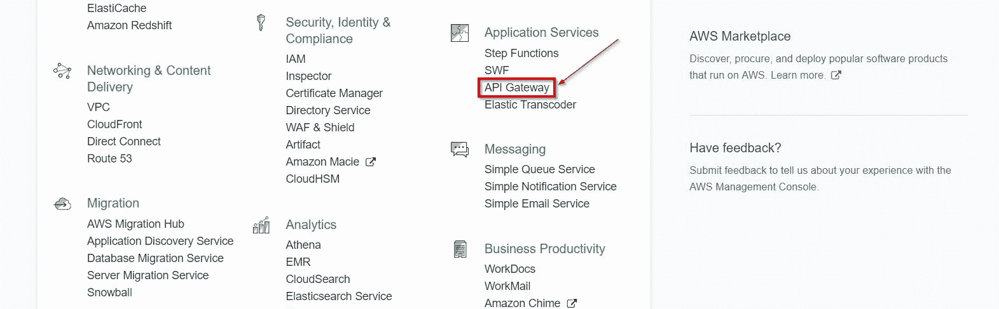

接下来，我们需要从左侧选择 API，然后单击 CreateAPI。这将启动创建用于我们的应用程序的新 API 的过程：

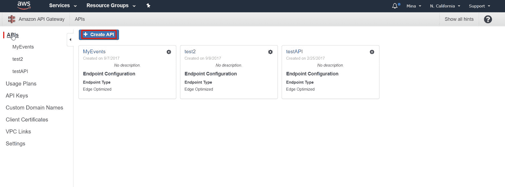

从这里，我们可以选择新 API 的名称，如下所示：

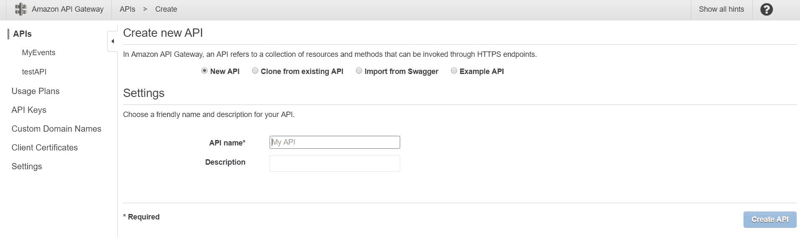

现在，在创建 API 之后，我们需要在 AWS API 网关和嵌入 MyEvents 应用程序中的 RESTful API 地址之间创建映射。MyEvents 应用程序包含多个微服务。其中一个微型服务是事件服务；它支持几个可以通过 RESTful API 激活的任务。作为复习，以下是 API 任务的快速摘要及其相对 URL 地址的示例：

1.  **搜索事件**：
    *   **ID**：相对 URL 为`/events/id/3434`，方法为`GET`，HTTP 正文中不需要数据
    *   **名称**：相对 URL 为`/events/name/jazz_concert`，方法为`GET`，HTTP 正文中不需要数据
2.  **一次检索所有事件**：相对 URL 为`/events`，方法为`GET`，HTTP 正文中不需要数据
3.  **创建新事件**：相对 URL 为`/events`，方法为`POST`，HTTP 正文中的预期数据需要是我们要添加的新事件的 JSON 表示。假设我们想添加将在美国播放的`opera aida`事件，那么 HTTP 主体将如下所示：

```go
{
    name: "opera aida",
    startdate: 768346784368,
    enddate: 43988943,
    duration: 120, //in minutes
    location:{
        id : 3 , //=>assign as an index
        name: "West Street Opera House",
        address: "11 west street, AZ 73646",
        country: "U.S.A",
        opentime: 7,
        clostime: 20
        Hall: {
            name : "Cesar hall",
            location : "second floor, room 2210",
            capacity: 10
        }
    }
}
```

让我们逐一探索 events microservice API 任务，并了解如何让 AWS API 网关充当应用程序的前门

根据前面的描述，我们有三个相对 URL：

*   `/events/id/{id}`，其中`{id}`为数字。我们支持带有该 URL 的`GET`HTTP 请求。
*   `/events/name/{name}`，其中`{name}`为字符串。我们支持使用该 URL 的`GET`HTTP 请求
*   `/events`，其中我们支持使用此 URL 的`GET`和`POST`请求。

为了在 AWS API 网关中用它们的方法表示这些相对 URL，我们需要执行以下操作：

1.  Create a new resource and call it `events`. We will first visit our newly created API page. Then, from there, we will create a new resource by clicking on Actions and selecting Create Resource:

    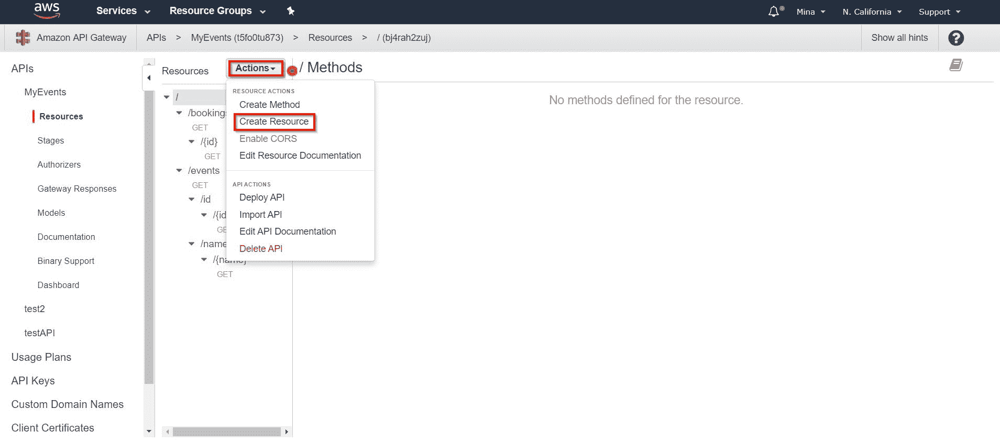

2.  确保在新资源上将名称和路径都设置为`events`：

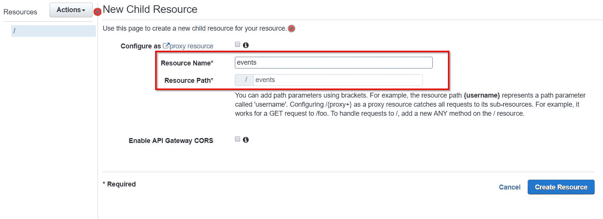

3.  Afterwards, select the newly created `events` resource and create a new resource called `id`. Select the `events` resource again, but this time, create a new resource called `name`. Here is what this will look like:

    

4.  Select the `id` resource, then create a new resource. This time, call the resource name `id` again; however, the resource path needs to be `{id}`. This is important because it indicates that `id` is a parameter that can accept other values. Meaning that this resource can represent a relative URL that looks like this `/events/id/3232`:

    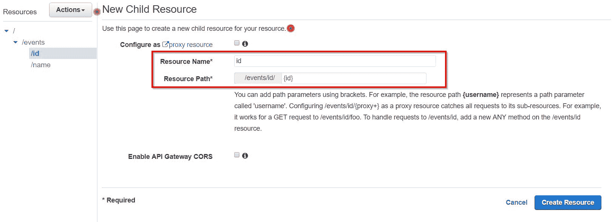

5.  Similar to step 4, we will select the `name` resource, then create another resource underneath, which will have the resource name as `name` and the resource path as `{name}`. Here is what this will end up looking like:

    

6.  Now, this should cover all our relative URLs. We need to attach the supported HTTP methods to their corresponding resources. First, we will go the `events` resource and then attach a `GET` method as well as a `POST` method to it. To do that, we need to click on s, then select Create Method:

    

7.  We can then select GET as the method type:

    

8.  We then select the integration type of HTTP. From there, we will need to set the endpoint URL. The endpoint URL needs to be the absolute path of the API endpoint that corresponds to this resource. In our case, since we are under the 'events' resource, the absolute address for the resource on the 'events' microservice would be `<EC2 DNS Address>/events`. Let's assume that the DNS is `http://ec2.myevents.com`; this will make the absolute path `http://ec2.myevents.com/events`. Here is what this configuration will look like:

    

9.  我们将重复前面的步骤；但是，这次我们将创建一个`POST`方法
10.  We select the `{id}` resource, then create a new `GET` method. The `EndPoint` URL needs to include the `{id}`; here is what this will look like:

    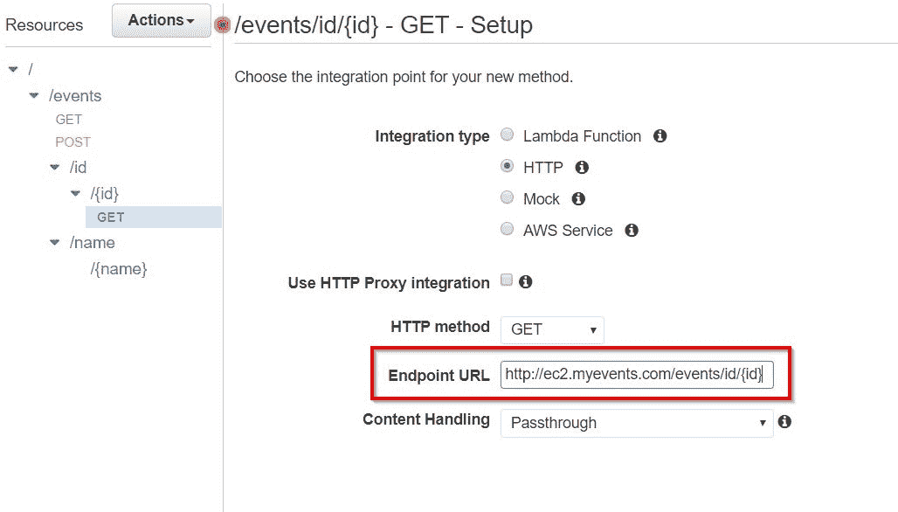

11.  我们将对`{name}`资源重复相同的步骤；以下是端点 URL 的外观：`http://ec2.myevents.com/events/name/{name}`。

完美的有了这些，我们创建了 AWS API 网关映射到我们的 events microservice API。我们可以使用相同的技术在 MyEvents API 中添加更多资源，这些资源将指向属于 MyEvents 应用程序的其他微服务。下一步是部署 API。我们需要做的第一件事是创造一个新的舞台。stage 是一种识别用户可调用的已部署 RESTful API 的方法。在部署 RESTful API 之前，我们需要创建一个阶段。要部署 API，我们需要单击操作，然后单击部署 API：

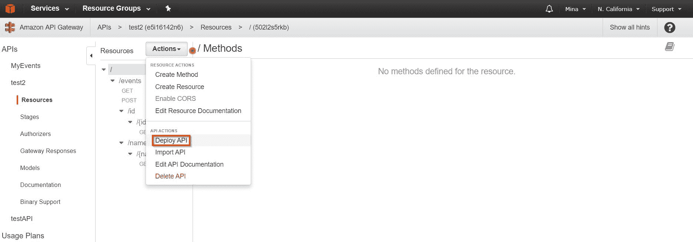

如果我们还没有阶段，我们需要选择[New stage]作为部署阶段，然后选择阶段名称，最后单击 Deploy。我将称我的舞台为`beta`：

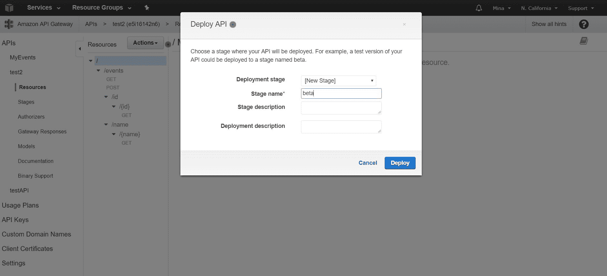

一旦我们将 RESTful API 资源部署到一个阶段，我们就可以开始使用它了。我们可以通过导航到 Stages，然后单击所需的资源进行浏览，找到我们的 AWS API 门户到我们的 events microservice 的 API URL，选择的资源 API URL 在这里定义为`Invoke URL`。在下图中，我们选择了事件资源，可以在右侧找到 API URL：

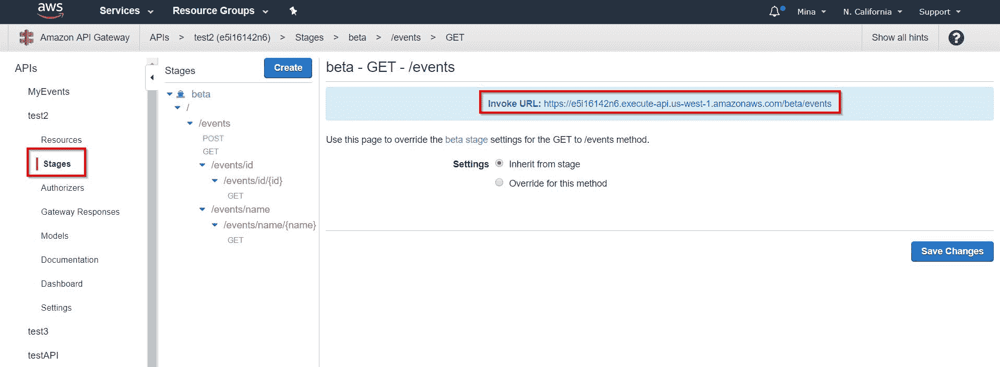

# 发电机

DynamoDB 是 AWS 生态系统中非常重要的一部分；它通常用作许多云本地应用程序的后端数据库。DynamoDB 是一个托管在云中的分布式高性能数据库，由 AWS 作为服务提供

# 发电机组件

在讨论如何编写与 DynamoDB 交互的代码之前，我们需要先介绍一些有关数据库的重要概念。DynamoDB 由以下部件组成：

*   **表***与典型的数据库引擎一样，DynamoDB 将数据存储在一组表中。例如，在 MyEvents 应用程序中，我们可以有一个`events`表来存储事件信息，如音乐会名称和开始日期。同样，我们也可以有一个`bookings`表来为我们的用户提供预订信息。我们还可以有一个`users`表来存储我们的用户信息。*
**   **项***：*项只不过是 DynamoDB 表的行。项目中的信息称为属性。如果我们以`events`表为例，一个项目将是该表中的单个事件。类似地，如果我们以`users`表为例，每个项目都是一个用户。表中的每个项都需要一个唯一的标识符，也称为主键，用于将该项与表中的所有其他项区分开来。*   **属性**：如前所述，属性表示项目内部的信息。每个项目由一个或多个属性组成。您可以将属性视为数据的持有者。每个属性由属性名称和属性值组成。以`events`表为例，每个`event`项都有一个`ID`属性来表示事件 ID，一个`name`属性来表示事件名称，一个`startdate`属性，一个`enddate`属性等等。*

 *项主键是项中唯一必须事先定义的属性。但是，项目中的任何其他属性都不需要预定义。这使得 DynamoDB 成为一个无模式的数据库，这意味着在用数据填充表之前不需要定义数据库表的结构

DynamoDB 中的大多数属性都是标量的。这意味着它们只能有一个值。标量属性的一个示例是字符串属性或数字属性。某些属性可以嵌套，其中一个属性可以承载另一个属性，依此类推。属性最多可以嵌套 32 层。

# 属性值数据类型

如前所述，每个 DynamoDB 属性由一个属性名和一个属性值组成。属性值又由两部分组成：值的数据类型名称和值数据。在本节中，我们将重点讨论数据类型。

有三种主要数据类型：

*   **标量类型***：*这是最简单的数据类型；它表示单个值。标量类型类别包含以下数据类型名称：
    *   `*S*`**这只是一个字符串类型；它使用 UTF-8 编码；字符串的长度必须介于 0 和 400 KB 之间。**
    ***   `N`**这是一种数字类型。它们可以是正的、负的，也可以是零。它们的精度可以高达 38 位。*****   `*B*`**二进制类型的属性。二进制数据包括压缩文本、加密数据或图像。长度需要介于 0 和 400 KB 之间。在将二进制数据值发送到 DynamoDB 之前，我们的应用程序必须以 base64 编码格式对其进行编码。*****   `*BOOL*`**：**布尔属性。它可以是真的也可以是假的。******
*****   **单据类型***：*单据类型是一个属性嵌套的复杂结构。此类别下有两种数据类型名称：
    *   `L`**类型列表的属性。此类型可以存储值的有序集合。对于可以存储在列表中的数据类型没有限制。**
    ***   **`*Map*`**映射类型将数据存储在无序的名称-值对集合中*************   **集合类型***：*集合类型可以表示多个标量值。集合类型中的所有项目必须为同一类型。此类别下有三个数据类型名称：
    *   `*NS*`**一组数字**
    ***   `SS`**一组字符串*****   `BS`**一组二进制值****************

 ******# 主键

如前所述，DynamoDB 表项中唯一需要事先定义的部分是主键。在本节中，我们将深入了解 DynamoDB 数据库引擎的主键。主键的主要任务是唯一地标识表中的每个项，以便两个项不能具有相同的键。

DynamoDB 支持两种不同类型的主键：

*   **分区密钥***：*这是一种简单的主键类型。它由一个称为分区键的属性组成。DynamoDB 将其数据存储在多个分区中。分区是 DynamoDB 表的存储层，由固态硬盘驱动器支持。分区键的值用作内部哈希函数的输入，内部哈希函数生成一个输出，该输出确定存储项的分区。
*   **复合密钥***：*这种类型的密钥由两个属性组成。第一个属性是我们前面讨论过的分区键，而第二个属性是所谓的“排序键”。如果使用复合键作为主键，则多个项可以共享同一分区键。具有相同分区键的项存储在一起。然后使用排序键对具有相同分区键的项目进行排序。每个项目的排序键必须是唯一的。

每个主键属性必须是标量，这意味着它只能保存一个值。主键属性允许三种数据类型：字符串、数字或二进制

# 二级索引

当我们通过主键查询表中的项时，DynamoDB 中的主键提供了对表中项的高效快速访问。但是，在很多情况下，我们可能希望通过主键以外的属性查询表中的项。DynamoDB 允许我们创建针对不同于主键属性的属性的二级索引。这些索引使我们能够对非主键项运行高效查询。

二级索引只不过是包含表中属性子集的数据结构。一个表允许有多个二级索引，这在查询表中的数据时提供了灵活性。

为了进一步理解二次查询，我们需要介绍一些基本定义：

*   **基表**：每个二级索引只属于一个表。索引所基于的表以及索引从中获取数据的表称为基表。
*   **投影属性***：*项目属性是从基表复制到索引中的属性。DynamoDB 将这些属性与基表的主键一起复制到索引的数据结构中。
*   **全局二级索引***：*具有分区键和排序键的索引，与基表上的索引不同。这种类型的索引被认为是`global`，因为对该索引执行的查询可以跨越基表中的所有数据。可以在创建表的同时或稍后创建全局二级索引。
*   **本地二级索引***：*与基表分区键相同，但排序键不同的索引。这种类型的索引是`local`，因为本地二级索引的每个分区都与具有相同分区键值的基表分区相关联。您只能在创建表的同时创建本地二级索引。

# 创建表

让我们利用 AWSWeb 控制台创建 DynamoDB 表，然后在代码的后面部分访问这些表。第一步是访问 AWS 管理控制台主仪表板，然后单击 DynamoDB：

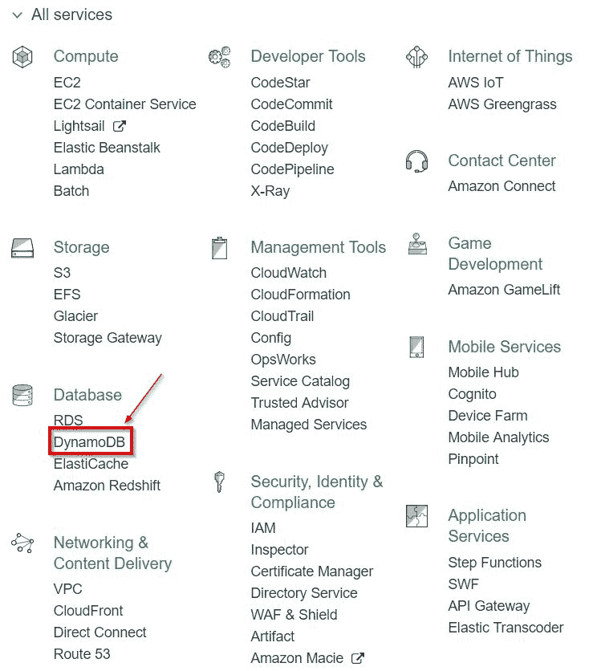

单击 DynamoDB 后，我们将移动到 DynamoDB 主仪表板，在那里我们可以创建一个新表：


下一步是选择表名和主键。如前所述，DynamoDB 中的主键最多可以由两个属性组成：分区键和排序键。假设我们正在创建一个名为`events`的表。让我们使用一个简单的主键，它只包含一个名为`ID`的分区键，该分区键属于`Binary`类型：

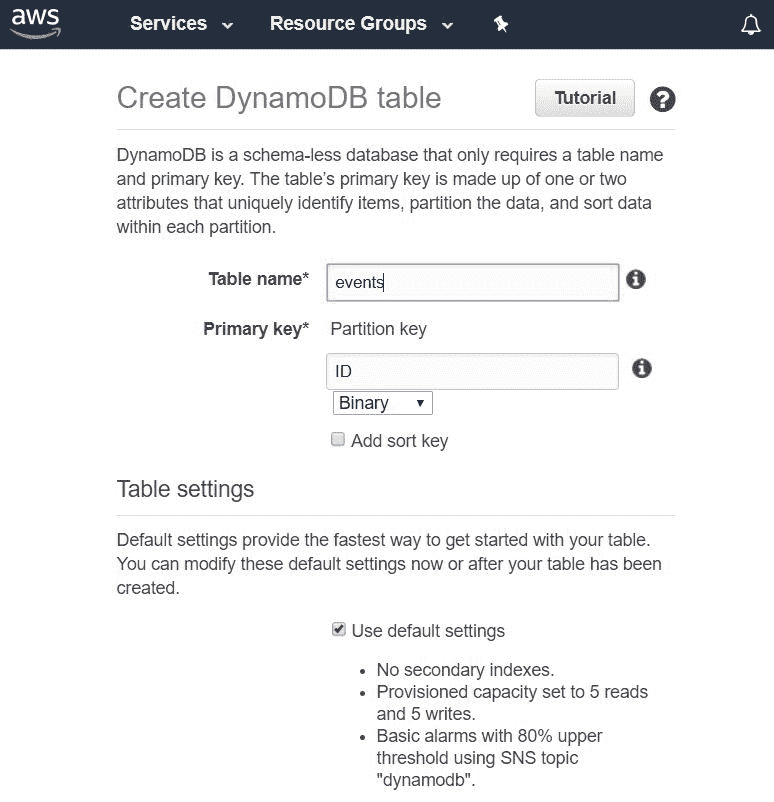

我们还将保留默认设置。稍后我们将重新讨论其中的一些设置，例如二级索引。配置完成后，我们需要单击 Create 来创建表。然后，我们将对要创建的所有其他表重复此过程：


一旦创建了一个表，我们现在就可以连接到它，编辑它，并通过代码读取它。然而，在我们开始讨论代码之前，我们需要创建一个二级索引。为此，我们需要首先通过选择左侧的 Tables 选项访问新创建的表。然后我们将从表格列表中选择`events`表格。之后，我们需要选择 Indexes 选项卡，然后单击 Create Index 创建新的二级索引：


二级索引名称必须是表中的属性名称，以便用作二级索引。在本例中，我们希望用于查询的属性是事件名称。此属性表示在按事件名称而不是 ID 查询事件时，运行有效查询所需的索引。下面是创建索引对话框的外观；让我们填写不同的字段，然后单击创建索引：

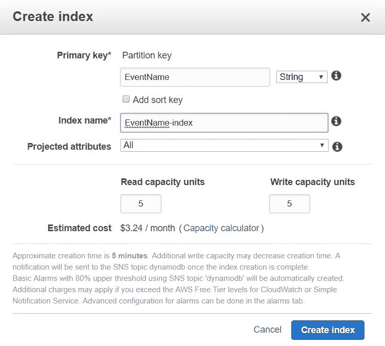

完美的通过这一步，我们现在已经为代码准备好了表。请注意，在上面的屏幕截图中，索引名称如何为`EventName-index`。稍后我们将在 Go 代码中使用该名称。

# 围棋语言与 DynamoDB

Amazon 为 Go 语言提供了强大的软件包，我们可以利用这些软件包构建能够与 DynamoDB 高效交互的应用程序。主包装可在[找到 https://docs.aws.amazon.com/sdk-for-go/api/service/dynamodb/](https://docs.aws.amazon.com/sdk-for-go/api/service/dynamodb/) 。

在我们开始跳入代码之前，让我们在《ToalT2A.第 2 章》中讨论一个更新的接口。此接口表示我们的微服务的数据库处理程序层，这是数据库访问代码所在的层。对于`events`服务，该接口支持四种方法。下面是它的样子：

```go
type DatabaseHandler interface {
  AddEvent(Event) ([]byte, error)
  FindEvent([]byte) (Event, error)
  FindEventByName(string) (Event, error)
  FindAllAvailableEvents() ([]Event, error)
}
```

在我们寻求对如何编写能够与 DynamoDB 一起工作的应用程序有实际理解的过程中，我们将实现前面的四种方法，以利用 DynamoDB 作为后端数据库。

与其他 AWS 服务类似，AWS Go SDK 提供了一个服务客户机对象，我们可以使用它与 DynamoDB 进行交互。此外，与其他 AWS 服务类似，我们需要首先获取会话对象，然后使用它创建 DynamoDB 服务客户机对象。下面是该代码的外观：

```go
  sess, err := session.NewSession(&aws.Config{
    Region: aws.String("us-west-1"),
  })
  if err != nil {
    //handler error, let's assume we log it then exit.
    log.Fatal(err)
  }
  dynamodbsvc := dynamodb.New(sess)
```

`dynamodbsvc`最终成为我们的服务客户机对象，我们可以使用它与 DynamoDB 进行交互

现在，我们需要创建一个名为 dynamolayer.go 的新文件，该文件将位于我们的应用程序下的相对文件夹`./lib/persistence/dynamolayer`下：

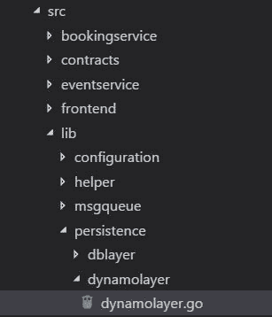

`dynamolayer.go`文件是我们的代码所在的位置。为了实现`databasehandler`接口，我们需要遵循的第一步是创建一个`struct`类型，它将实现接口方法。让我们把新的类型称为`DynamoDBLayer`；下面是代码的外观：

```go
type DynamoDBLayer struct {
  service *dynamodb.DynamoDB
}
```

`DynamoDBLayer`结构包含一个`*dynamodb.DynamoDB`类型的字段；这个 struct 字段表示 DynamoDB 的 AWS 服务客户机，这是我们将在代码中用于与 DynamoDB 交互的关键对象类型。

下一步是编写一些构造函数来初始化`DynamoDBLayer`结构。我们将创建两个构造函数，第一个构造函数假设我们在代码中没有现有的 AWS 会话对象。它将采用单个字符串参数，表示我们的 AWS 区域（例如，`us-west-1`）。然后，它将利用区域字符串创建一个针对该区域的会话对象。之后，会话对象将用于创建 DynamoDB 服务客户机对象，该对象可以分配给新的`DynamoDBLayer`对象。下面是第一个构造函数的外观：

```go
func NewDynamoDBLayerByRegion(region string) (persistence.DatabaseHandler, error) {
  sess, err := session.NewSession(&aws.Config{
    Region: aws.String(region),
  })
  if err != nil {
    return nil, err
  }
  return &DynamoDBLayer{
    service: dynamodb.New(sess),
  }, nil
}
```

第二个构造函数是我们在已有 AWS 会话对象的情况下使用的构造函数。它将 session 对象作为参数，然后使用它创建一个新的 DynamoDB 服务客户机，我们可以将其分配给一个新的`DynamoDBLayer`对象。下面是代码的外观：

```go
func NewDynamoDBLayerBySession(sess *session.Session) persistence.DatabaseHandler {
  return &DynamoDBLayer{
    service: dynamodb.New(sess),
  }
}
```

完美的现在，让构造函数退出，让我们实现`DatabaseHandler`接口方法。

在继续编写代码之前，我们需要首先介绍两个重要概念：

*   `*dynamoDB.AttributeValue`：这是 dynamodb Go 包中的结构类型。它表示 DynamoDB 项属性值
*   `dynamodbattribute`：这是 dynamodb 包下面的子包。此套餐的单据可在
    `https://docs.aws.amazon.com/sdk-for-go/api/service/dynamodb/dynamodbattribute/`找到。包负责在 Go 类型和`dynamoDB.AttributeValues.`之间进行转换，这提供了一种非常方便的方法，可以将应用程序中的 Go 类型转换为 dynamoDB 包方法可以理解的类型，反之亦然。`dynamodbattribute`可以利用封送和解封送方法将切片、映射、结构甚至标量值与`dynamoDB.AttributeValues`进行转换。

从现在起，我们将利用`dynamoDB.AttributeValue`类型以及`dynamodbattribute`包的强大功能来编写能够使用 DynamoDB 的代码

我们将介绍的第一个`DatabaseHandler`接口方法是`AddEvent()`方法。此方法接受一个`Event`类型的参数，然后将其作为一项添加到数据库中的 events 表中。在开始介绍该方法的代码之前，我们需要首先了解我们需要使用的 AWS SDK 组件：

*   `AddEvent()`将需要使用名为`PutItem()`的 AWS SDK 方法
*   `PutItem()`方法接受 PutItemInput 类型的参数
*   `PutItemInput`需要两条信息来满足我们的目的—表名和我们要添加的项
*   `PutItemInput`类型的表名字段为*字符串类型，而项目为`map[string]*AttributeValue`类型
*   为了将我们的 Go 类型事件转换为`map[string]*AttributeValue`，根据上一点，它是`PutItemInput`需要的项目字段类型，我们可以使用一种称为`dynamodbattribute.MarshalMap()`的方法

还有一个更重要的评论，我们需要涵盖；以下是我们的`Event`类型的外观：

```go
type Event struct {
  ID bson.ObjectId `bson:"_id"`
  Name string 
  Duration int
  StartDate int64
  EndDate int64
  Location Location
}
```

它包含了描述音乐会等活动通常需要的所有关键信息。但是，在使用 DynamoDB 时，`Event`类型存在一个问题，即关键字`Name`是 DynamoDB 世界中的保留关键字。这意味着如果我们像这样离开结构，我们将无法在查询中使用事件结构的`Name`字段。幸运的是，`dynamodbattribute`包支持名为`dynamodbav`的结构标记，它允许我们用另一个名称屏蔽结构字段名。这将允许我们在 Go 代码中使用 struct 字段名，但将其作为不同的名称公开给 DynamoDB。下面是添加 struct 字段后代码的外观：

```go
type Event struct {
  ID bson.ObjectId `bson:"_id"`
  Name string `dynamodbav:"EventName"`
  Duration int
  StartDate int64
  EndDate int64
  Location Location
}
```

在前面的代码中，我们在与 DynamoDB 接口时使用了`dynamodbav`struct 标记将`Name`struct 字段定义为`EventName`。

完美的现在，让我们看看`AddEvent()`方法代码：

```go
func (dynamoLayer *DynamoDBLayer) AddEvent(event persistence.Event) ([]byte, error) {
  av, err := dynamodbattribute.MarshalMap(event)
  if err != nil {
    return nil, err
  }
  _, err = dynamoLayer.service.PutItem(&dynamodb.PutItemInput{
    TableName: aws.String("events"),
    Item: av,
  })
  if err != nil {
    return nil, err
  }
  return []byte(event.ID), nil
}
```

前面代码中的第一步是将事件对象封送到`map[string]*AttributeValue`。下一步是调用`PutItem()`方法，它属于 DynamoDB 服务客户端。`PutItem`采用了前面讨论过的`PutItemInput`类型的参数，其中包含表名和我们要添加的封送项数据。最后，如果没有错误发生，我们将返回事件 ID 的字节表示形式

我们需要讨论的下一个`DatabaseHandler`接口方法是`FindEvent()`。此方法通过事件 ID 检索事件。请记住，当我们创建`events`表时，我们将 ID 属性设置为其键。以下是我们需要涵盖的一些要点，以理解传入的代码：

*   `FindEvent()`使用了一个名为`GetItem()`的 AWS SDK 方法。
*   `FindEvent()`接受一个`GetItemInput`类型的参数。
*   `GetItemInput`类型需要两条信息：表名和项键的值。
*   `GetItem()`方法返回一个名为`GetItemOutput`的结构类型，该结构类型有一个名为`Item`的字段。`Item`字段是我们检索到的数据库表项的托管位置。
*   从数据库中获取的项目将用`map[string]*AttributeValue`类型表示。然后我们可以使用`dynamodbattribute.UnmarshalMap()`函数将其转换为`Event`类型

下面是代码最后的样子：

```go
func (dynamoLayer *DynamoDBLayer) FindEvent(id []byte) (persistence.Event, error) {
  //create a GetItemInput object with the information we need to search for our event via it's ID attribute
  input := &dynamodb.GetItemInput{
    Key: map[string]*dynamodb.AttributeValue{
      "ID": {
        B: id,
      },
    },
    TableName: aws.String("events"),
  }
  //Get the item via the GetItem method
  result, err := dynamoLayer.service.GetItem(input)
  if err != nil {
    return persistence.Event{}, err
  }
  //Utilize dynamodbattribute.UnmarshalMap to unmarshal the data retrieved into an Event object
  event := persistence.Event{}
  err = dynamodbattribute.UnmarshalMap(result.Item, &event)
  return event, err
}
```

注意在前面的代码中，`GetItemInput`结构的`Key`字段是`map[string]*AttributeValue`类型。该映射的关键是属性名，在本例中为`ID`，而该映射的值为`*AttributeValue`类型，如下所示：

```go
{
  B: id,
}
```

前面代码中的`B`是`AttributeValue`中的结构字段，表示二进制类型，`id`只是传递给`FindEvent()`方法的字节片参数。之所以使用 binary 类型字段，是因为 events 表的 ID key 属性是 binary 类型。

现在让我们转到 events microservice 的第三个`DatabaseHandler`接口方法，即`FindEventByName()`方法。此方法通过事件名称检索事件。请记住，在前面创建`events`表时，我们将`EventName`属性设置为二级索引。之所以这样做，是因为我们希望能够通过事件名称从`events`表中查询项目。同样，在我们开始介绍代码之前，我们需要了解以下有关该方法的信息：

*   `FindEventByName()`使用 AWS SDK 方法`Query()`来查询数据库。
*   `Query()`方法采用`QueryInput`类型的参数，需要四条信息：
    *   我们想要执行的查询，在我们的例子中，查询只是`EventName = :n`。
    *   上述表达式中`:n`的值。这是一个参数，我们需要用试图查找的事件的名称填充它。
    *   我们希望用于查询的索引名。在我们的例子中，我们为 EventName 属性创建的二级索引被称为`EventName-index`
    *   要在其中运行查询的表名。
*   如果`Query()`方法成功，我们得到的结果项为地图切片；结果项将为`[]map[string]*AttributeValue`类型。因为我们只寻找一个项目，所以我们只能检索该地图切片的第一个项目。
*   `Query()`方法返回一个`QueryOutput`结构类型的对象，其中包含一个名为`Items`的字段。`Items`字段是我们的查询结果集的宿主
*   然后，我们需要利用`dynamodbattribute.UnmarshalMap()`函数将`map[string]*AttributeValue`类型的项转换为`Event`类型

下面是代码的外观：

```go
func (dynamoLayer *DynamoDBLayer) FindEventByName(name string) (persistence.Event, error) {
  //Create the QueryInput type with the information we need to execute the query
  input := &dynamodb.QueryInput{
    KeyConditionExpression: aws.String("EventName = :n"),
    ExpressionAttributeValues: map[string]*dynamodb.AttributeValue{
      ":n": {
        S: aws.String(name),
      },
    },
    IndexName: aws.String("EventName-index"),
    TableName: aws.String("events"),
  }
  // Execute the query
  result, err := dynamoLayer.service.Query(input)
  if err != nil {
    return persistence.Event{}, err
  }
  //Obtain the first item from the result
  event := persistence.Event{}
  if len(result.Items) > 0 {
    err = dynamodbattribute.UnmarshalMap(result.Items[0], &event)
  } else {
    err = errors.New("No results found")
  }
  return event, err
}
```

DynamoDB 中的查询是一个重要的主题。我建议您阅读 AWS 文档解释查询，可在[找到 http://docs.aws.amazon.com/amazondynamodb/latest/developerguide/Query.html](http://docs.aws.amazon.com/amazondynamodb/latest/developerguide/Query.html) 正确理解查询在 DynamoDB 中的工作方式

我们将在本章讨论的最后一种`DatabaseHandler`接口方法是`FindAllAvailableEvents()`方法。此方法检索 DynamoDB 中“events”表的所有项。在深入研究代码之前，我们需要了解以下内容：

*   `FindAllAvailableEvents()`需要使用一个名为`Scan()`的 AWS SDK 方法。此方法执行扫描操作。扫描操作可以简单地定义为通过表或辅助索引中的每一项进行读取。
*   `Scan()`方法需要一个类型为`ScanInput`结构的参数
*   `ScanInput`类型需要知道表名才能执行扫描操作。
*   `Scan()`方法返回一个`ScanOutput`结构类型的对象。`ScanOutput`结构包含一个名为`[]map[string]*AttributeValue`类型的字段`Items`。这就是扫描操作的结果。
*   `Items`结构字段可以通过`dynamodbattribute.UnmarshalListofMaps()`函数转换为`Event`类型的切片。

代码如下所示：

```go
func (dynamoLayer *DynamoDBLayer) FindAllAvailableEvents() ([]persistence.Event, error) {
  // Create the ScanInput object with the table name
  input := &dynamodb.ScanInput{
    TableName: aws.String("events"),
  }

  // Perform the scan operation
  result, err := dynamoLayer.service.Scan(input)
  if err != nil {
    return nil, err
  }

  // Obtain the results via the unmarshalListofMaps function
  events := []persistence.Event{}
  err = dynamodbattribute.UnmarshalListOfMaps(result.Items, &events)
  return events, err
}
```

关于扫描操作，需要注意的一点是，由于在生产环境中，扫描操作可能返回大量结果，因此有时建议在扫描时使用我们在前一章中提到的 AWS SDK 的分页功能。分页功能允许您的操作结果出现在多个页面中，然后您可以遍历这些页面。可通过`ScanPages()`方法进行扫描分页

# 总结

在本章中，我们深入了解了 AWS 世界上最流行的一些服务。到目前为止，我们已经掌握了足够的知识来构建能够利用 AWS 为云本地应用程序提供的一些关键功能的生产级 Go 应用程序。

在下一章中，我们将通过介绍持续交付的主题，进一步了解如何构建 Go-cloud 本机应用程序。*******