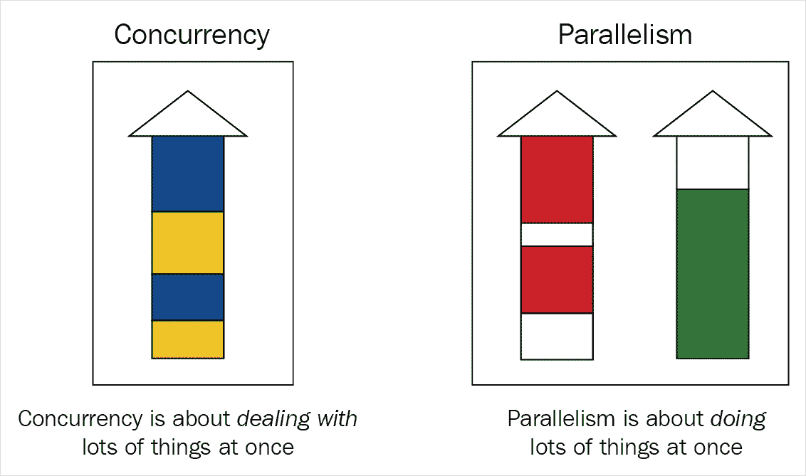
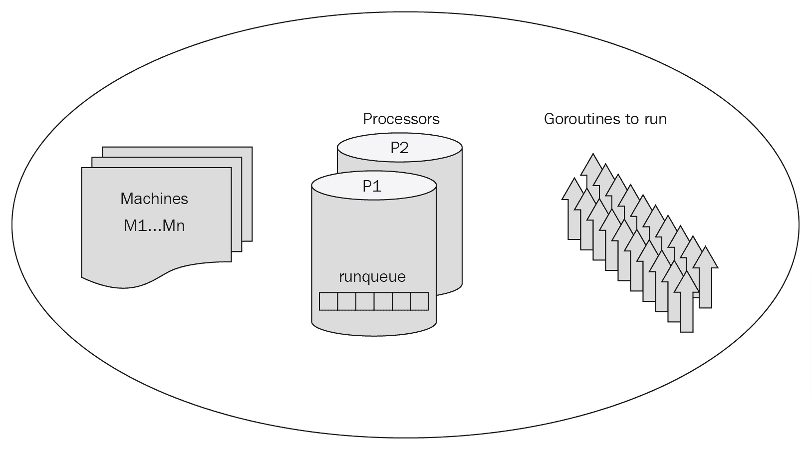
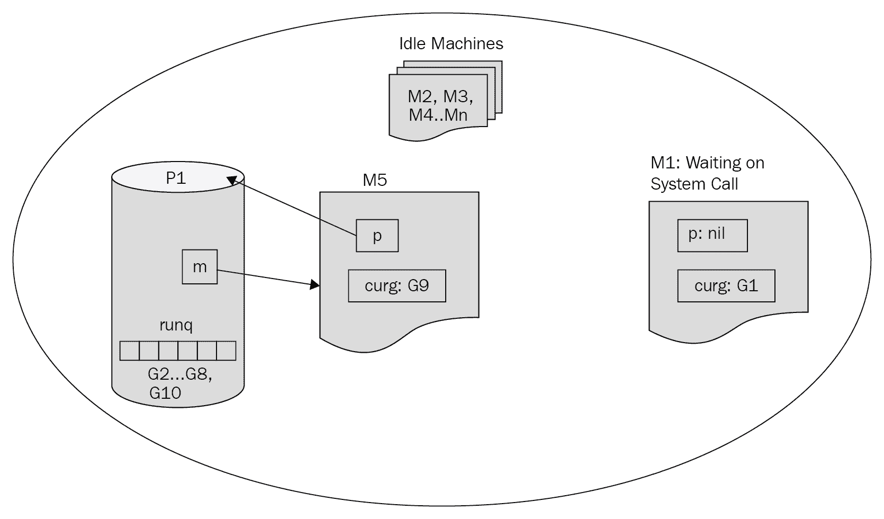
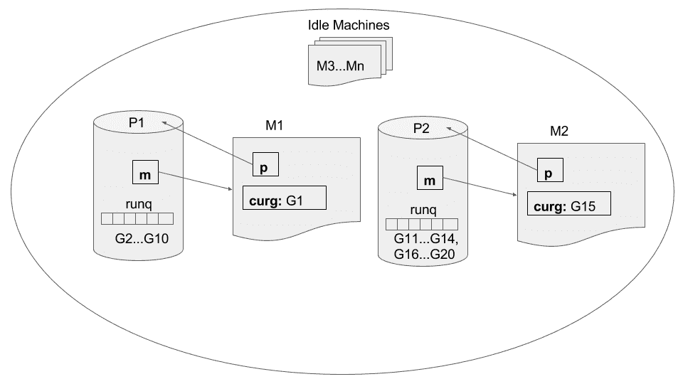
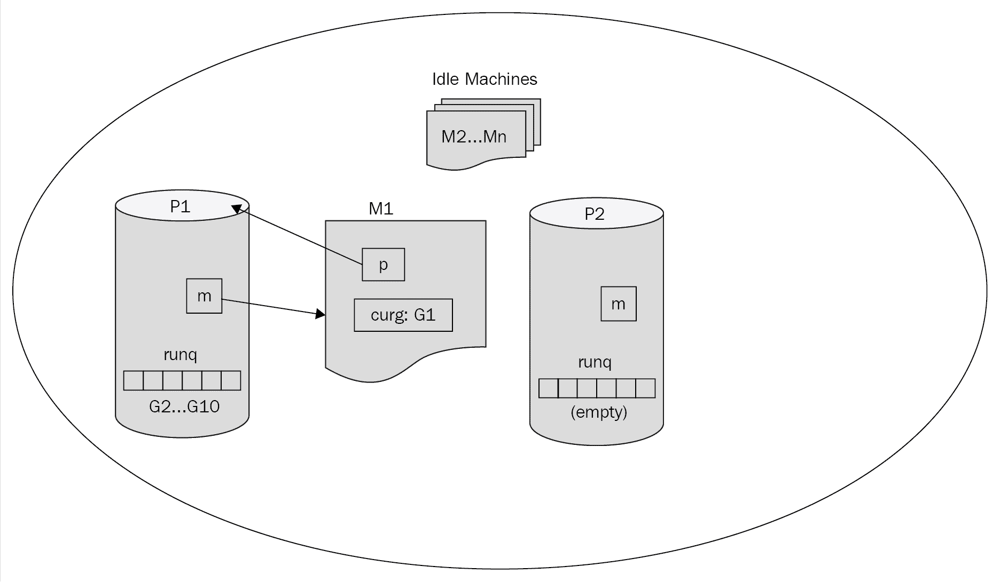

# 二、理解 Goroutines

在过去的十年里，软件开发和编程取得了很大的进步。许多以前被认为是学术性的和低效的概念开始在现代软件解决方案中找到一席之地。两个这样的概念是协同路由（Go 中的 goroutines）和通道。从概念上讲，它们随着时间的推移而不断发展，并且在每种编程语言中的实现方式也有所不同。在许多编程语言（如 Ruby 或 Clojure）中，它们是作为库实现的，但在 Go 中，它们是作为本机特性在语言中实现的。正如我们将看到的，这使该语言真正现代化、相当高效，并且是一种高级编程语言。

在本章中，我们将通过查看 goroutines 和以下主题来了解 Go：

*   并发与并行
*   Go 的运行时调度器
*   使用 goroutines 时遇到的问题

## 并发与并行

计算机和软件程序是有用的，因为它们可以快速地完成大量繁重的工作，也可以同时完成多项任务。我们希望我们的程序能够同时完成多项任务，即多任务，而编程语言的成功取决于编写和理解多任务程序的容易程度。

并发性和并行性是我们在研究多任务处理时经常遇到的两个术语，它们经常互换使用。然而，它们意味着两件截然不同的事情。

Go 博客上给出的标准定义（[https://blog.golang.org/concurrency-is-not-parallelism](https://blog.golang.org/concurrency-is-not-parallelism) 如下所示：

*   **并发***并发是指同时处理很多事情*。这意味着我们能够在给定的时间段内同时完成多项任务。然而，我们一次只做一件事。这通常发生在一个任务正在等待并且程序决定在空闲时间运行另一个任务的程序中。在下图中，这通过在蓝色任务的空闲期间运行黄色任务来表示。
*   **并行**：*并行是指同时做很多事情*。这意味着，即使我们有两个任务，它们也在不间断地工作。在图中，绿色任务独立运行且不受红色任务的任何影响，这一事实表明：



理解这两个术语之间的区别很重要。让我们看几个具体的例子来进一步阐述两者之间的区别。

### 并发性

让我们通过一个简单的例子来了解并发性的概念，其中包括一些日常任务以及执行这些任务的方式。

想象一下，你开始了一天，需要完成六件事：

*   预订酒店
*   预订机票
*   订一件衣服
*   支付信用卡账单
*   写一封电子邮件
*   听有声读物

完成的顺序并不重要，对于一些任务，比如写电子邮件或听有声读物，你不需要一次就完成。以下是完成任务的一种可能方法：

1.  订一条裙子。
2.  写三分之一的电子邮件。
3.  预订酒店。
4.  听 10 分钟的有声读物。
5.  支付信用卡账单。
6.  再写三分之一的电子邮件。
7.  预订机票。
8.  再听 20 分钟有声读物。
9.  完成电子邮件的写作。
10.  继续听有声读物直到你睡着。

在编程方面，我们已经同时执行了上述任务**。我们度过了完整的一天，我们从任务列表中选择了特定的任务，并开始着手完成它们。对于某些任务，我们甚至决定将它们分成若干部分，并在其他任务之间处理这些部分。**

 **我们最终将编写一个同时执行前面所有步骤的程序，但让我们一步一步地执行。让我们从构建一个按顺序执行任务的程序开始，然后逐步修改它，直到它完全是并发代码并使用 goroutine。该计划的进展将分为三个步骤：

1.  串行任务执行。
2.  使用 goroutines 执行串行任务。
3.  并发任务执行。

#### 代码概述

代码将由一组功能组成，这些功能在完成时打印出分配的任务。在写电子邮件或听有声读物的情况下，我们进一步将任务划分为更多功能。这可以看出如下几点：

*   `writeMail`、`continueWritingMail1`、`continueWritingMail2`
*   `listenToAudioBook`*`continueListeningToAudioBook`*

 *#### 串行任务执行

让我们首先实现一个程序，它将以线性方式执行所有任务。基于我们前面讨论的代码概述，以下代码应该简单明了：

```go
package main 

import ( 
    "fmt" 
) 

// Simple individual tasks 
func makeHotelReservation() { 
    fmt.Println("Done making hotel reservation.") 
} 
func bookFlightTickets() { 
    fmt.Println("Done booking flight tickets.") 
} 
func orderADress() { 
    fmt.Println("Done ordering a dress.") 
} 
func payCreditCardBills() { 
    fmt.Println("Done paying Credit Card bills.") 
} 

// Tasks that will be executed in parts 

// Writing Mail 
func writeAMail() { 
    fmt.Println("Wrote 1/3rd of the mail.") 
    continueWritingMail1() 
} 
func continueWritingMail1() { 
    fmt.Println("Wrote 2/3rds of the mail.") 
    continueWritingMail2() 
} 
func continueWritingMail2() { 
    fmt.Println("Done writing the mail.") 
} 

// Listening to Audio Book 
func listenToAudioBook() { 
    fmt.Println("Listened to 10 minutes of audio book.") 
    continueListeningToAudioBook() 
} 
func continueListeningToAudioBook() { 
    fmt.Println("Done listening to audio book.") 
} 

// All the tasks we want to complete in the day. 
// Note that we do not include the sub tasks here. 
var listOfTasks = []func(){ 
    makeHotelReservation, bookFlightTickets, orderADress, 
    payCreditCardBills, writeAMail, listenToAudioBook, 
} 

func main() { 
    for _, task := range listOfTasks { 
        task() 
    } 
} 
```

我们接受每个主要任务，并以简单的顺序开始执行它们。执行前面的代码应该会产生不出所料的输出，如下所示：

```go
Done making hotel reservation.
Done booking flight tickets.
Done ordering a dress.
Done paying Credit Card bills.
Wrote 1/3rd of the mail.
Wrote 2/3rds of the mail.
Done writing the mail.
Listened to 10 minutes of audio book.
Done listening to audio book.
```

#### 使用 goroutines 执行串行任务

我们得到了一个任务列表，并编写了一个程序，以线性和顺序的方式执行它们。但是，我们希望同时执行这些任务！让我们首先介绍分割任务的 goroutine，看看它是如何进行的。我们将在此处仅显示实际更改代码的代码段：

```go
/******************************************************************** 
  We start by making Writing Mail & Listening Audio Book concurrent. 
*********************************************************************/ 
// Tasks that will be executed in parts 

// Writing Mail 
func writeAMail() { 
    fmt.Println("Wrote 1/3rd of the mail.") 
    go continueWritingMail1()  // Notice the addition of 'go' keyword. 
} 
func continueWritingMail1() { 
    fmt.Println("Wrote 2/3rds of the mail.") 
    go continueWritingMail2()  // Notice the addition of 'go' keyword. 
} 
func continueWritingMail2() { 
    fmt.Println("Done writing the mail.") 
} 

// Listening to Audio Book 
func listenToAudioBook() { 
    fmt.Println("Listened to 10 minutes of audio book.") 
    go continueListeningToAudioBook()  // Notice the addition of 'go'   keyword. 
} 
func continueListeningToAudioBook() { 
    fmt.Println("Done listening to audio book.") 
} 
```

以下是可能的输出：

```go
Done making hotel reservation.
Done booking flight tickets.
Done ordering a dress.
Done paying Credit Card bills.
Wrote 1/3rd of the mail.
Listened to 10 minutes of audio book.
```

哎呀！这不是我们所期望的。`continueWritingMail1`、`continueWritingMail2`和`continueListeningToAudioBook`功能的输出缺失；原因是我们正在使用 goroutines。由于 goroutine 不被等待，`main`函数中的代码继续执行，一旦控制流到达`main`函数的末尾，程序结束。我们真正想做的是在`main`函数中等待，直到所有 goroutine 都完成执行。有两种方法可以使用频道或使用`WaitGroup`来实现这一点。因为我们有[第三章](03.html)、*频道和消息*专门针对频道，所以我们在本节中使用`WaitGroup`。

为了使用`WaitGroup`，我们必须记住以下几点：

*   使用`WaitGroup.Add(int)`来计算我们将运行多少 Goroutine，作为我们逻辑的一部分。
*   使用`WaitGroup.Done()`表示 goroutine 已完成其任务。
*   使用`WaitGroup.Wait()`等待所有 goroutine 完成。
*   将`WaitGroup`实例传递给 goroutine，以便它们可以调用`Done()`方法。

基于这些点，我们应该能够修改源代码以使用`WaitGroup`。以下是更新的代码：

```go
package main 

import ( 
    "fmt" 
    "sync" 
) 

// Simple individual tasks 
func makeHotelReservation(wg *sync.WaitGroup) { 
    fmt.Println("Done making hotel reservation.") 
    wg.Done()
} 
func bookFlightTickets(wg *sync.WaitGroup) { 
    fmt.Println("Done booking flight tickets.") 
    wg.Done() 
} 
func orderADress(wg *sync.WaitGroup) { 
    fmt.Println("Done ordering a dress.") 
    wg.Done() 
} 
func payCreditCardBills(wg *sync.WaitGroup) { 
    fmt.Println("Done paying Credit Card bills.") 
    wg.Done() 
} 

// Tasks that will be executed in parts 

// Writing Mail 
func writeAMail(wg *sync.WaitGroup) { 
    fmt.Println("Wrote 1/3rd of the mail.") 
    go continueWritingMail1(wg) 
} 
func continueWritingMail1(wg *sync.WaitGroup) { 
    fmt.Println("Wrote 2/3rds of the mail.") 
    go continueWritingMail2(wg) 
} 
func continueWritingMail2(wg *sync.WaitGroup) { 
    fmt.Println("Done writing the mail.") 
    wg.Done() 
} 

// Listening to Audio Book 
func listenToAudioBook(wg *sync.WaitGroup) { 
    fmt.Println("Listened to 10 minutes of audio book.") 
    go continueListeningToAudioBook(wg) 
} 
func continueListeningToAudioBook(wg *sync.WaitGroup) { 
    fmt.Println("Done listening to audio book.") 
    wg.Done() 
} 

// All the tasks we want to complete in the day. 
// Note that we do not include the sub tasks here. 
var listOfTasks = []func(*sync.WaitGroup){ 
    makeHotelReservation, bookFlightTickets, orderADress, 
    payCreditCardBills, writeAMail, listenToAudioBook, 
} 

func main() { 
    var waitGroup sync.WaitGroup 
    // Set number of effective goroutines we want to wait upon 
    waitGroup.Add(len(listOfTasks)) 

    for _, task := range listOfTasks{ 
        // Pass reference to WaitGroup instance 
        // Each of the tasks should call on WaitGroup.Done() 
        task(&waitGroup) 
    } 
    // Wait until all goroutines have completed execution. 
    waitGroup.Wait() 
}
```

这里是一个可能的输出顺序；注意在`listenToAudioBook`和`continueListeningToAudioBook`之后的末尾`continueWritingMail1`和`continueWritingMail2`是如何执行的：

```go
Done making hotel reservation.
Done booking flight tickets.
Done ordering a dress.
Done paying Credit Card bills.
Wrote 1/3rd of the mail.
Listened to 10 minutes of audio book.
Done listening to audio book.
Wrote 2/3rds of the mail.
Done writing the mail.
```

#### 并发任务执行

在上一节的最终输出中，我们可以看到，`listOfTasks`中的所有任务都是以串行顺序执行的，最大并发性的最后一步是让 Go 运行时确定顺序，而不是`listOfTasks`中的顺序。这听起来可能是一项艰巨的任务，但实际上很容易实现。我们只需要在`task(&waitGroup)`前面添加`go`关键字：

```go
func main() { 
    var waitGroup sync.WaitGroup 
    // Set number of effective goroutines we want to wait upon 
    waitGroup.Add(len(listOfTasks)) 

    for _, task := range listOfTasks { 
        // Pass reference to WaitGroup instance 
        // Each of the tasks should call on WaitGroup.Done() 
        go task(&waitGroup) // Achieving maximum concurrency 
    } 

    // Wait until all goroutines have completed execution. 
    waitGroup.Wait() 
```

以下是可能的输出：

```go
Listened to 10 minutes of audio book.
Done listening to audio book.
Done booking flight tickets.
Done ordering a dress.
Done paying Credit Card bills.
Wrote 1/3rd of the mail.
Wrote 2/3rds of the mail.
Done writing the mail.
Done making hotel reservation.
```

如果我们查看此可能的输出，则任务按以下顺序执行：

1.  听有声读物。
2.  预订机票。
3.  订一条裙子。
4.  支付信用卡账单。
5.  写一封电子邮件。
6.  预订旅馆。

现在我们已经对什么是并发以及如何使用`goroutines`和`WaitGroup`编写并发代码有了很好的了解，让我们深入研究并行性。

### 相似

想象一下，你不得不写几封电子邮件。这将是一个漫长而艰苦的过程，而保持娱乐的最佳方式是一边听音乐一边写，也就是说，一边听音乐一边写电子邮件。如果我们想编写一个模拟此场景的程序，下面是一个可能的实现：

```go
package main 

import ( 
    "fmt" 
    "sync" 
    "time" 
) 

func printTime(msg string) { 
    fmt.Println(msg, time.Now().Format("15:04:05")) 
} 

// Task that will be done over time 
func writeMail1(wg *sync.WaitGroup) { 
    printTime("Done writing mail #1.") 
    wg.Done() 
} 
func writeMail2(wg *sync.WaitGroup) { 
    printTime("Done writing mail #2.") 
    wg.Done() 
} 
func writeMail3(wg *sync.WaitGroup) { 
    printTime("Done writing mail #3.") 
    wg.Done() 
} 

// Task done in parallel 
func listenForever() { 
    for { 
        printTime("Listening...") 
    } 
} 

func main() { 
    var waitGroup sync.WaitGroup 
    waitGroup.Add(3) 

    go listenForever() 

    // Give some time for listenForever to start 
    time.Sleep(time.Nanosecond * 10) 

    // Let's start writing the mails 
    go writeMail1(&waitGroup) 
    go writeMail2(&waitGroup) 
    go writeMail3(&waitGroup) 

    waitGroup.Wait() 
} 
```

程序的输出可能如下所示：

```go
Done writing mail #3\. 19:32:57
Listening... 19:32:57
Listening... 19:32:57
Done writing mail #1\. 19:32:57
Listening... 19:32:57
Listening... 19:32:57
Done writing mail #2\. 19:32:57
```

这些数字以`Hour:Minutes:Seconds`表示时间，可以看出，它们是并行执行的。您可能已经注意到，并行性的代码看起来与最后一个并发性示例的代码几乎相同。然而，在函数`listenForever`中，我们正在无限循环中打印`Listening...`。如果前面的示例是在没有 goroutines 的情况下编写的，那么输出将继续打印`Listening...`，并且永远不会到达`writeMail`函数调用。

现在我们了解了 goroutine 是如何用来运行并发程序的，让我们看看 Go 是如何允许我们这样做的。接下来我们将研究 Go 运行时使用的调度器。

## Go 的运行时调度器

Go 程序和运行时一起在多个 OS 线程上管理和执行。运行时使用一种称为**M:N**调度器的调度器策略，它将在 N 个 OS 线程上调度 M 个 goroutine。因此，每当我们需要运行或切换到不同的 goroutine 时，上下文切换将非常快，这也使我们能够使用多个 CPU 内核进行并行计算。

对 Go 的运行时和调度器有深入的了解将是非常有趣和有用的，现在是详细了解它们的好时机。

从 Go scheduler 的角度来看，主要有三个实体：

*   戈罗廷（G）
*   操作系统线程或机器（M）
*   上下文或处理器（P）

让我们看看他们做了什么。我们还将查看这些实体的部分结构定义，以便更好地了解调度是如何实现的以及它是如何工作的。

### 戈罗廷

它是逻辑执行单元，包含程序/函数运行的实际指令。它还包含关于 goroutine 的其他重要信息，例如堆栈内存、它运行在哪台机器（M）上以及调用它的 Go 函数。以下是 goroutine 结构中的一些元素，这些元素可能会在本节中派上用场：

```go
// Denoted as G in runtime 
type g struct { 
    stack         stack // offset known to runtime/cgo 
    m               *m    // current m; offset known to arm liblink 
    goid           int64 
    waitsince   int64   // approx time when the g become blocked 
    waitreason string  // if status==Gwaiting 
    gopc          uintptr // pc of go statement that created this goroutine 
    startpc       uintptr // pc of goroutine function 
    timer         *timer  // cached timer for time.Sleep 

    // ... 
} 
```

一件有趣的事情是，当我们的 Go 程序启动时，一个名为 main goroutine 的 goroutine 首先启动，它负责在启动程序之前设置运行时空间。典型的运行时设置可能包括最大堆栈大小、启用垃圾收集器等内容。

### 操作系统线程或机器

最初，操作系统线程或机器由操作系统创建和管理。稍后，调度器可以请求创建或销毁更多操作系统线程或机器。它是执行 goroutine 的实际资源。它还维护有关主 goroutine、当前在其上运行的 G、**线程本地存储**（**tls**等的信息：

```go
// Denoted as M in runtime 
type m struct { 
    g0               *g         // goroutine with scheduling stack 
    tls               [6]uintptr // thread-local storage (for x86 extern register) 
    curg            *g         // current running goroutine 
    p                 puintptr   // attached p for executing go code (nil if not executing go code) 
    id                 int32 
    createstack [32]uintptr // stack that created this thread. 
    spinning      bool        // m is out of work and is actively looking for work 

    // ... 
} 
```

### 上下文或处理器

我们有一个全局调度程序，负责启动新的 M、注册 G 和处理系统调用。但是，它不处理 goroutine 的实际执行。这是由一个名为**处理器**的实体完成的，该实体有自己的内部调度程序和一个名为 runqueue（代码中为`runq`的队列），该队列由将在当前上下文中执行的 goroutine 组成。它还处理各种 goroutine 之间的切换，等等：

```go
// Denoted as P in runtime code 
type p struct { 
    id     int32 
    m     muintptr // back-link to associated m (nil if idle) 
    runq [256]guintptr 

    //... 
} 
```

从 Go 1.5 开始，Go 运行时可以在程序生命周期的任何给定点上运行最多数量的`GOMAXPROCS`Ps。当然，我们可以通过设置`GOMAXPROCS`环境变量或调用`GOMAXPROCS()`函数来更改此数字。

### 具有 G、M 和 P 的调度

当程序准备好开始执行时，运行时已经设置了机器和处理器。运行时将请求操作系统启动足够数量的机器（M），GomaxProc 将启动足够数量的处理器来执行 GoRoutine（G）。重要的是要理解 M 是实际执行单元，G 是逻辑执行单元。然而，它们要求 P 实际执行 G 而不是 M。让我们看一个可能的场景，以更好地解释调度过程。首先，让我们看看我们将在场景中使用的组件：

*   我们有一组 M 准备运行：M1…Mn
*   我们还有两个 Ps:P1 和 P2，分别带有 runqueues-runq1 和 runq2
*   最后但并非最不重要的是，我们还有 20 个 goroutine，G1…G20，我们希望将其作为程序的一部分执行

Go 的运行时和所有组件 M1…Mn、P1 和 P2 以及 G1…G20 如下图所示：



假设我们有两个处理器，全局调度器将理想地在两个处理器之间平均分配 goroutine。假设 P1 被分配在 G1…G10 上工作，并将它们放入其运行队列，同样，P2 将 G11…G20 放入其运行队列。接下来，P1 的调度程序从其运行队列中弹出一个 goroutine 来运行 G1，选择一台机器来运行 M1，类似地，P2 在 M2 上运行 G11。这可以通过下图来说明：


进程的内部调度程序还负责将当前 goroutine 切换到下一个要执行的 goroutine。如果一切顺利，调度程序将切换当前 goroutine，原因可能有三种：

*   当前执行的时间片已结束：进程将使用**schedtick**（每次调用调度程序时它都会递增）来跟踪当前 goroutine 已执行的时间，一旦达到某个时间限制，当前 goroutine 将被放回 runqueue 中，下一个 goroutine 将被拾取以执行。
*   通过执行完成：简单地说，goroutine 完成了所有指令的执行。在这种情况下，它将不会被放回运行队列。
*   等待系统调用：在某些情况下，goroutine 可能需要进行系统调用，因此，goroutine 将被阻止。考虑到我们只有少数几个处理器，阻止如此昂贵的资源是没有意义的。好消息是，在 Go 中，处理器不需要等待系统调用；相反，它可以离开等待的 M 和 G 组合，这将在系统调用后由全局调度器拾取。同时，处理器可以从可用机器中选择另一个 M，从其运行队列中选择另一个 goroutine，并开始执行它。以下图表对此进行了说明：


上图说明了处理器 P1 正在机器 M1 上运行 goroutine G1。G1 现在将开始进行系统调用。这可在下图中说明：



上一个图解释了处理器 P1 由于系统调用而从机器 M1 和 goroutine G1 分离。P1 选择一台新机器 M5 和一个新的 goroutine G9 执行：


在上图中，G1-M1 系统调用已完成。现在 G1 被放回 P1 运行队列，M1 被添加到空闲机器集合中。

在本节的最后一部分，我们将讨论调度器中实现的另一种策略，称为**工作窃取**。

假设处理器 P1 有 10 个 goroutine，而 P2 有 10 个 goroutine。然而，事实证明 P1 中的 goroutine 很快就完成了，现在 P1 的运行队列中没有 goroutine。如果 P1 空闲并等待全局调度器为其提供更多工作，这将是一个悲剧。在工作窃取策略的帮助下，P1 开始与其他处理器进行检查，如果另一个处理器的运行队列中有 goroutine，它将“窃取”其中的一半并开始执行它们。这确保了我们最大限度地提高程序的 CPU 使用率。让我们问两个有趣的问题：

*   如果处理器意识到它不能窃取更多的任务怎么办？procesor 将等待一段时间，等待新的 goroutine，如果没有创建 goroutine，则处理器将被终止。
*   处理器能否窃取运行队列的一半以上？即使我们有很多处理器在工作，工作窃取也会占据目标处理器运行队列的一半。

这可以用下图来说明：



上图显示了两个处理器 P1 和 P2，分别从两台机器上的运行队列执行一个 goroutine。让我们考虑处理器 P2 的任务在 P1 运行时完成。如下图所示：



处理器 P2 已耗尽其运行队列，并且没有更多的 goroutine 可执行。由于工作窃取策略，P2 已经从 P1 的运行队列中“窃取”了一半的 goroutine，并可以开始执行它们，如下图所示：


## 使用 goroutines 时遇到的问题

至此，我们应该对 goroutines 和调度器的工作原理有了很好的理解。现在让我们来看一些在使用 goroutines 时可能会让我们大吃一惊的事情。

### 单个 goroutine 停止整个程序

我们知道 goroutine 跨多个线程和多个内核运行。那么，当其中一个线程出现恐慌时会发生什么呢？下面是一个让我们模拟这种情况的示例。我们将创建许多类似的 goroutine，其唯一目的是获取一个数字，并在从分母中减去 10 后将其自身除以。除数字为`10`时外，这将适用于大多数情况。以下代码实现了所描述的功能：

```go
package main 

import ( 
    "fmt" 
    "sync" 
) 

func simpleFunc(index int, wg *sync.WaitGroup) { 
    // This line should fail with Divide By Zero when index = 10 
    fmt.Println("Attempting x/(x-10) where x = ", index, " answer is : ", index/(index-10)) 
    wg.Done() 
} 

func main() { 
    var wg sync.WaitGroup 
    wg.Add(40) 
    for i := 0; i < 40; i += 1 { 
        go func(j int) { 
            simpleFunc(j, &wg) 
        }(i) 
    } 

    wg.Wait() 
}
```

前面代码的输出可以如下所示：

```go
Attempting x/(x-10) where x = 39 answer is : 1 Attempting x/(x-10) where x = 20 answer is : 2... Attempting x/(x-10) where x = 37 answer is : 1 Attempting x/(x-10) where x = 11 answer is : 11 panic: runtime error: integer divide by zerogoroutine 15 [running]:main.simpleFunc(0xa, 0xc42000e280) ...exit status 2
```

本质上，许多 goroutine 被放入 runqueue 中，并且在以随机顺序执行时，它们的输出被打印到控制台。但是，一旦执行了索引为==10 的 goroutine，它就引发了函数无法处理的恐慌，这导致整个程序停止并退出，状态代码为`2`。这表明，即使是一个尚未处理的错误或恐慌，也会停止整个程序！

然而，让程序崩溃是没有意义的，因为我们面临着一种恐慌，我们本可以优雅地处理这种恐慌。Go 允许我们通过一个名为`recover`的函数从恐慌中恢复。让我们看看在前面的代码示例中如何使用`recover`：

```go
package main 

import ( 
    "fmt" 
    "sync" 
) 

func simpleFunc(index int, wg *sync.WaitGroup) { 
    // functions with defer keyword are executed at the end of the function 
    // regardless of whether the function was executed successfully or not. 
    defer func() { 
        if r := recover(); r != nil { 
            fmt.Println("Recovered from", r) 
        } 
    }() 

    // We have changed the order of when wg.Done is called because 
    // we should call upon wg.Done even if the following line fails. 
    // Whether a defer function exists or not is dependent on whether it is registered 
    // before or after the failing line of code. 
    defer wg.Done() 
    // This line should fail with Divide By Zero when index = 10 
    fmt.Println("Attempting x/(x-10) where x = ", index, " answer is : ", index/(index-10)) 
} 

func main() { 
    var wg sync.WaitGroup 
    wg.Add(40) 
    for i := 0; i < 40; i += 1 { 
        go func(j int) { 
            simpleFunc(j, &wg) 
        }(i) 
    } 

    wg.Wait() 
}
```

上述代码的输出可以如下所示：

```go
Attempting x/(x-10) where x = 39 answer is : 1 Attempting x/(x-10) where x = 14 answer is : 3 Recovered from runtime error: integer divide by zero Attempting x/(x-10) where x = 3 answer is : 0 ...Attempting x/(x-10) where x = 29 answer is : 1 Attempting x/(x-10) where x = 9 answer is : -9 
```

### 出游是不可预测的

在本章中，我们首先了解 Go 如何使我们能够编写并发的代码，并且在一定程度上是并行的。然后，我们接着讨论了如何在机器和处理器上调度 goroutines。我们可能能够推断出 goroutine 将如何分布在机器和处理器上，这反过来又可能让我们编写非标准或黑客围棋代码。

考虑一下从 Toe0T0-并行性 To1 T1 节中的代码，我们试图在写几封电子邮件的同时模拟听音乐。以下是代码的输出，以供快速参考：

```go
Done writing mail #3\. 19:32:57
Listening... 19:32:57
Listening... 19:32:57
Done writing mail #1\. 19:32:57
Listening... 19:32:57
Listening... 19:32:57
Done writing mail #2\. 19:32:57
```

我们现在可以很容易地推断出至少有两个 P，其中一个被 goroutine 打印`Listening...`使用，而另一个 P 处理与写电子邮件相关的 goroutine。

这一切都是好的，但是考虑到将 Ty0 T0 设置为 AUT1 T1 的情况，或者系统具有较低的硬件能力，这可能会导致更少的机器。这可能会导致 goroutine 打印`Listening...`永远运行，并且永远不会控制其他 goroutine。实际上，Go 编译器应该检测到这种情况，并相应地规划 goroutine 的调度。然而，最好规划我们的代码，这样我们就不必依赖 Go 的调度器及其当前实现。

## 总结

goroutine 是并发的，并且在一定程度上是并行的；然而，我们应该把它们看作是并行的。goroutine 的执行顺序是不可预测的，我们不应该依赖它们以任何特定的顺序执行。

我们还应该注意处理 goroutine 中的错误和恐慌，因为即使它们是并行执行的，一个 goroutine 中的恐慌也会使整个程序崩溃。最后，goroutines 可以阻止系统调用，但是这不会阻止程序的执行，也不会降低整个程序的性能。

我们研究了 Go 运行时调度器背后的一些设计概念，以了解为什么会发生所有这些情况。

你可能想知道为什么我们没有在本章中讨论频道。原因是，通过不依赖频道，我们可以看到最基本的 Goroutine。这使我们能够深入了解 goroutine 的概念和实现。

在下一章中，我们将研究频道以及它们如何进一步增强 goroutines。***