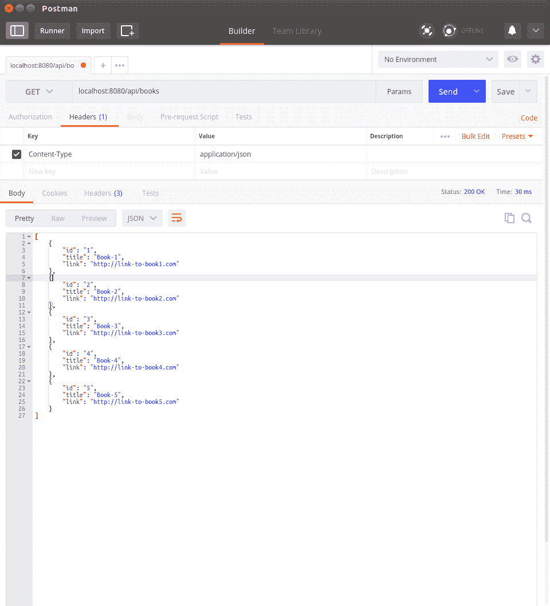

# RESTful Web

在前面的章节中，我们研究了 Go goroutines 和 Channel 的两个最重要的组件。在接下来的章节中，我们将使用 Go 构建一个分布式应用程序，了解如何为 internet 或 web 编写应用程序非常重要。在本章中，我们将介绍使用 REST web 协议构建 web 应用程序的一种特殊方法。我们还将研究如何与基于 REST 的 web 应用程序交互。我们将以以下方式对其进行报道：

*   HTTP 和会话简介
*   构建 REST 服务器的基础知识
*   设计一个简单的 REST 服务器
*   与 REST 服务器交互的工具

## HTTP 和会话

在本节中，我们将简要介绍 HTTP 协议以及它是如何随着时间的推移而发展的。还讨论服务器如何使用 HTTP 会话跟踪用户状态。当我们试图理解 REST 协议的工作原理时，这些知识将派上用场。

### HTTP 的简史

为了更好地理解 REST 协议的优点，让我们在 REST web 协议出现之前绕道了解一下 internet 是如何使用的。20 世纪 90 年代的互联网主要用于使用**HTTP**（**超文本传输协议**将文档作为标记文档进行存储和共享。在本章中，HTTP 可概括如下：

*   HTTP 是一种网络通信协议，以 HTTP 请求开始，以 HTTP 响应结束。
*   早期的 HTTP 响应由纯文本文档组成，但很快 HTML 格式获得了吸引力，因为它允许更多样式化的文档。
*   网络浏览器带来了互联网的新时代：仅仅显示具有不同字体权重的文本文档是不够的。CSS 和 JavaScript 脱颖而出，使这些文档更具可定制性和交互性。所有这些进步导致了我们现在所说的*网络*。
*   可以使用 URL 和 HTTP 方法与 web 服务器交互。有九种 HTTP 方法，但就本书而言，我们只对其中五种感兴趣：
    *   `GET`：发送简单 HTTP 请求时使用
    *   `POST`：当我们希望在发送 HTTP 请求时包含有价值的信息时，使用此选项
    *   `PUT`、`PATCH`、`DELETE`：技术上与`POST`方法相同，但功能不同

我们将在下一节中重新讨论这些 HTTP 方法，并更详细地探讨它们。

### HTTP 会话

HTTP 协议本身是无状态的；也就是说，它不知道什么是访问一个网页，谁可以发布到一个网页，等等。对于这一时期（1990 年代）的大多数 HTTP 服务器，它们可以被认为是文件服务器；也就是说，他们通过互联网提供静态文件。然而，现代网络体验更为广阔。考虑访问 Gmail 或脸谱网，网站知道我们是谁，我们展示了为我们动态生成的定制内容。它们保持着我们正在阅读的文章或正在撰写的邮件的“状态”。如果我们关闭浏览器并在一段时间后返回网站，它会让我们回到我们离开的地方。鉴于 HTTP 协议和 HTTP 服务器是无状态的，这些网站如何跟踪所有这些内容并将它们链接回正确的用户？答案是 HTTP 会话。

当我们从浏览器登录到一个网站时，我们会向它提供身份证明。服务器用同样由令牌组成的响应进行响应，令牌将用于在不久的将来识别我们。令牌可以是会话 ID、cookie、身份验证头等形式。web 服务器维护此类令牌和相应用户 ID 的表。在我们登录到一个网站后，浏览器总是在每次请求时将标题中相应的令牌发送到服务器。因此，web 服务器能够跟踪每个用户并向任何给定用户显示正确的内容。服务器是如何做到这一点的？它维护服务器端的所有状态信息！

## REST 协议

即使在 20 世纪 90 年代，计算机和互联网技术仍在快速发展，网络浏览器也在不断发展。这意味着 web 服务器本身可以开始将部分工作卸载到 web 客户端；也就是说，网络浏览器。慢慢地，这开始引导开发人员尝试不同的软件体系结构来开发 web 应用程序。到 2010 年，REST 协议成为设计现代 web 应用程序最流行的方式。

**REST**（**表示状态传输协议**由*Roy Fielding*在其开创性论文*架构风格和基于网络的软件架构设计*（[中首次描述 https://www.ics.uci.edu/~fielding/pubs/demission/fielding_demission.pdf](https://www.ics.uci.edu/~fielding/pubs/dissertation/fielding_dissertation.pdf)。这种设计 web 应用程序的方法有许多优点。它是实用的，在 CPU 使用率和网络负载方面效率高，在增加互联网流量方面具有更好的扩展性，等等。下面是使用 REST 软件体系结构的一些特性和好处。

### 服务器和客户端架构

在*HTTP 会话*一节中，我们描述了一个服务器，该服务器负责执行大部分工作，浏览器负责将用户输入转发到服务器，解析从服务器返回的 HTML 文档，并在浏览器中为用户呈现。REST 允许我们将应用程序拆分为服务器和客户端。服务器（后端）负责执行业务逻辑，客户端（前端）负责与服务器进行用户交互。听起来好像没什么变化；然而，REST 体系结构的其余属性将更加明显。

### 标准数据格式

REST 围绕使用标准数据格式的后端和前端之间的通信状态和数据展开。这导致了后端和前端的分离。这意味着我们不再局限于使用 web 浏览器与服务器通信，这反过来意味着我们的服务器现在能够用于与 web 应用程序、命令行应用程序等交互。REST 允许我们使用任何类型的数据格式进行通信，尽管 JSON 格式已经成为通过 REST 协议进行通信的通用语言。

### 资源

因为我们的前端和后端是分开的，所以我们需要在两者之间传递状态和数据。在前端，我们需要显示我们提供的服务的所有可用实体。这些实体称为**资源**。

考虑一个服务器，它提供了一个 REST 接口（REST API），它在我们的个人库中有一个书籍列表。在本例中，*书籍列表*是资源，我们可以从特定端点的后端请求关于每本书的信息。对于我们的示例，端点可以是`<URL>/api/books`。`/api`前缀是 REST 应用程序中常用的一种约定，表示我们正在和后端 URL 进行交互。资源通常可以看作是数据的集合，就像数据库表的行一样。

### 重用 HTTP 协议

我们在上一小节*资源*中定义了端点，但我们如何与它们交互？REST 构建在 HTTP 协议之上，它使用 HTTP 方法或 REST 中的动词与服务器交互。让我们以上一个例子中的端点`/api/books`为例，了解它是如何使用的。

#### 收到

REST 使用`GET`动词来检索特定资源类型的项。考虑到我们有很多项，可以检索特定的资源项和所有可用的资源项。对特定资源项的检索通常通过提供该项的 id 来完成。以下显示了用于检索的两种形式的`GET`：

*   `/api/books`：返回图书馆中所有书籍的列表
*   `/api/books/<id>`：返回图书馆中某本书的相关信息

#### 邮递

REST 使用`POST`动词创建特定资源类型的新项。创建资源可能需要额外的信息，这些信息在`POST`请求的正文中提供。作为主体的一部分提供的信息必须是 REST 服务器可以处理的数据格式。发布到`/api/books`表示我们想在图书馆的图书列表中添加一本新书。

#### 打补丁

其形式为`/api/books/<id>`。这些方法仅适用于已存在的资源。它们将使用请求正文中提供的数据或资源的新状态更新给定资源。`PUT`希望在完成时提供资源的新状态，包括未更改的字段。`PATCH`可以被认为是`PUT`的更宽松版本，因为我们不需要提供完整的新状态，只需要提供需要更新的字段。

#### 删去

REST 使用`DELETE`动词删除特定的资源项。其形式为`/api/resource/<id>`。基于`<id>`删除特定资源。REST 支持删除给定资源类型的所有项，尽管这没有意义，因为现在用户可能会意外删除该资源类型的所有项。由于这一点和许多其他原因，没有服务器真正实现此功能。

### 可升级组件

考虑需要对 UI 进行更改的情况，这不会影响服务器逻辑。如果一个网站没有按照客户端和服务器架构进行拆分，我们将不得不升级整个网站，这将是一项相当耗时的任务。由于前端和后端的分离，我们只能对所需的系统进行更改和升级。因此，我们可以确保将服务中断降至最低。

## REST 服务器的基本原理

现在我们已经了解了 REST 应用程序应该如何运行，让我们构建一个 REST 应用程序吧！我们将首先构建一个简单的 web 服务器，然后通过描述设计决策和 API 定义来设计 books REST 服务器，最后根据设计构建一个 REST 服务器。

### 一个简单的 web 服务器

Go 为我们提供了一个用于构建 web 服务器的内置库`net/http`。对于要在服务器上创建的每个端点，我们必须做两件事：

1.  为端点创建一个处理函数，该函数接受两个参数，一个用于写入响应，另一个用于处理传入请求。
2.  使用`net/http.HandleFunc`注册端点。

下面是一个简单的 web 服务器，它接受所有传入的请求，将它们登录到控制台，然后返回一条`Hello, World!`消息。

```go
// helloServer.go 

package main 

import ( 
    "fmt" 
    "log" 
    "net/http" 
) 

func helloWorldHandler(w http.ResponseWriter, r *http.Request) { 
    msg := fmt.Sprintf("Received request [%s] for path: [%s]", r.Method, r.URL.Path) 
    log.Println(msg) 

    response := fmt.Sprintf("Hello, World! at Path: %s", r.URL.Path) 
    fmt.Fprintf(w, response) 
} 

func main() { 
    http.HandleFunc("/", helloWorldHandler) // Catch all Path 

    log.Println("Starting server at port :8080...") 
    http.ListenAndServe(":8080", nil) 
} 
```

以下是在浏览器中请求 URL 时的一些示例请求和响应：

```go
http://localhost:8080/ --> Hello, World! at Path: / 
http://localhost:8080/asdf htt--> Hello, World! at Path: /asdf 
http://localhost:8080/some-path/123 --> Hello, World! at Path: /some-path/123 
```

以下是服务器输出：

```go
2017/10/03 13:35:46 Starting server at port :8080... 
2017/10/03 13:36:01 Received request [GET] for path: [/] 
2017/10/03 13:37:22 Received request [GET] for path: [/asdf] 
2017/10/03 13:37:40 Received request [GET] for path: [/some-path/123] 
```

请注意，尽管我们提供了多个路径，但它们都默认为`/`路径。

### 设计 restapi

我们已经了解了 HTTP 背后的历史和 REST 协议背后的核心概念。我们构建了一个简单的 web 服务器，以显示构建 REST 服务器所需的一些服务器端代码。现在是我们使用迄今为止所学的一切来设计和构建 REST 服务器的时候了。

我们将首先定义 RESTAPI 的数据格式，然后创建一个 web 服务器，该服务器将按照我们定义的 RESTAPI 规范工作。

#### 数据格式

在本节中，我们将描述图书资源的格式，然后开始定义每个 RESTAPI 交互以及这些交互的预期结果。

##### 图书资源

以下是图书资源的基本定义。它是一个 JSON 数组，格式为`"<key>": "<value-type>"`，但应用程序中使用的实际实体将由实际值组成：

```go
{ 
    "id": "string", 
    "title": "string", 
    "link": "string" 
} 
```

##### 获取/api/books

此 RESTAPI 调用将检索图书资源类型的所有项目的列表。在我们的示例中，响应的 JSON 格式由图书资源类型的数组组成。但是，这种返回格式并不是返回项目的唯一方式。另一种更流行的格式是 JSON 对象，其中包含键“data”，该键包含实际结果和服务器可能希望在响应中发回的任何其他键。

现在让我们看看我们将在示例中使用的简单格式：

```go
// Request 
GET "<URL>/api/books/" 

// Response 
[ 
  { 
     "id": "1", 
     "title": "book1", 
     "link": "http://link-to-book-1.com" 
   }, 
   { 
     "id": "2", 
     "title": "book2", 
     "link": "http://link-to-book-2.com" 
   } 
 ] 
```

##### GET/api/books/

这种形式的`GET`调用将根据提供的`<id>`检索单个图书资源项。一般来说，响应的 JSON 对象将是定义的资源类型，尽管服务器可能会根据服务的逻辑决定添加或删除某些字段。对于我们的 API，我们将返回资源类型中定义的所有字段。

让我们看一个示例，当我们尝试检索 id 为`"1"`的图书资源时：

```go
// Request 
GET "<URL>/api/books/1" 

// Response 
{ 
   "id": "1", 
   "title": "book1", 
   "link": "http://link-to-book-1.com" 
 } 
```

##### POST/api/books

此 REST API 调用将创建图书资源类型的新项。然而，为了创建一个新项目，我们需要提供所有必要的数据。可以有不需要任何额外信息的`POST`请求。但是在我们的例子中，我们需要将诸如`title`和`link`之类的信息作为请求的有效负载发送到图书。

在本例中，我们希望创建一个标题为`"book5"`和链接为`"http://link-to-book5.com"`的图书项目。请注意，由于我们的服务器已经有两个图书资源类型的项目，因此新项目的 id 为`"3"`；这是根据我们的服务器实现的。其他 REST 服务器的行为可能不同。

```go
// Request 
POST "<URL>/api/books" 

// payload 
{ 
   "title": "book5", 
   "link": "http://link-to-book-5.com" 
 } 

 // response 
 { 
    "id": "3", 
    "title": "book5", 
    "link": "http://link-to-book-5.com" 
  } 
```

##### PUT/api/books/

我们将在 RESTAPI 中使用`PUT`来更新特定的资源类型。我们 API 中定义的`PUT`严格要求接受不完整数据的有效载荷，即拒绝不完整的有效载荷。

在本例中，我们将修改新创建的图书`"3"`并将其链接更改为指向`"http://link-to-book-15.com"`：

```go
// Request 
PUT "<URL>/api/books/3" 

// payload 
{ 
   "title": "book5", 
   "link": "http://link-to-book-15.com" 
 } 

 // response 
 { 
    "id": "3", 
    "title": "book5", 
    "link": "http://link-to-book-15.com" 
  }
```

##### 删除/api/books/

这是用于删除特定图书资源的 RESTAPI 调用。这种请求不需要正文，只需要图书 id 作为 URL 的一部分，如下一个示例所示。

在本例中，我们将删除书籍`2`。请注意，我们不会返回任何响应；其他 REST 服务器可能会返回已删除的项目：

```go
  // Request 
  DELETE "<URL>/api/books/2" 

  // Response 
  [] 
```

##### 不成功的请求

我们可能会发送构造不良的请求、不可用实体上的请求或不完整的有效负载。对于所有此类实例，我们将发送相关的 HTTP 错误代码。根据服务器的实现，可能返回单个错误代码。一些服务器返回一个标准错误代码“404”，以增加安全性，不让恶意用户尝试查找他们不拥有的资源类型的项目。

#### 设计决策

我们已经定义了 RESTAPI，接下来我们要实现服务器。在编写任何代码之前，制定我们希望服务器完成的任务是很重要的。以下是服务器的一些规范：

*   我们需要为`PUT`、`DELETE`和单个资源`GET`请求提取`<id>`。
*   我们希望记录每个传入请求，类似于`helloWorldHandler`。
*   重复这么多的工作将是一种乏味而糟糕的编码实践。我们可以利用闭包和函数文本为我们创建新函数，这些函数将结合前面两点中的任务。
*   为了使示例保持简单，我们将使用`map[string]bookResource`来存储所有图书资源的状态。所有操作都将在此地图上完成。在现实世界的服务器中，我们通常使用数据库来存储这些资源。
*   Go 服务器可以处理并发请求，这意味着我们应该确保图书资源的映射不受竞争条件的影响。

让我们看看基于我们提出的设计的代码可能是什么样子。

#### 图书 API 的 REST 服务器

我们将我们的计划划分如下：

```go
$ tree 
. 
├── books-handler 
│ ├── actions.go 
│ ├── common.go 
│ └── handler.go 
└── main.go 

1 directory, 5 files 
```

现在让我们看看每个文件的源代码。

##### 梅因，加油

`main.go`源文件由主要负责组装和运行 web 服务器的代码组成。实际响应 HTTP 请求的逻辑分布在其他文件中：

```go
// restServer/main.go 

package main 

import ( 
    "fmt" 
    "log" 
    "net/http" 

    booksHandler "github.com/last-ent/distributed-go/chapter4/books-handler" 
) 

func main() { 
    // Get state (map) for books available on REST server. 
    books := booksHandler.GetBooks() 
    log.Println(fmt.Sprintf("%+v", books)) 

    actionCh := make(chan booksHandler.Action) 

    // Start goroutine responsible for handling interaction with the books map 
    go booksHandler.StartBooksManager(books, actionCh) 

    http.HandleFunc("/api/books/", booksHandler.MakeHandler(booksHandler.BookHandler, "/api/books/", actionCh)) 

    log.Println("Starting server at port 8080...") 
    http.ListenAndServe(":8080", nil) 
} 
```

##### 图书处理程序/common.go

此源文件中的代码是通用逻辑，可以跨多个请求共享：

通常，一个好的做法是识别未绑定到某个特定处理程序的逻辑，然后将其移动到`common.go`或类似的源文件中，因为这将使它们更容易找到并减少重复代码。

```go
// restServer/books-handler/common.go 

package booksHandler 

import ( 
    "encoding/json" 
    "fmt" 
    "log" 
    "net/http" 
) 

// bookResource is used to hold all data needed to represent a Book resource in the books map. 
type bookResource struct { 
    Id    string 'json:"id"' 
    Title string 'json:"title"' 
    Link  string 'json:"link"' 
} 

// requestPayload is used to parse request's Payload. We ignore Id field for simplicity. 
type requestPayload struct { 
    Title string 'json:"title"' 
    Link  string 'json:"link"' 
} 

// response struct consists of all the information required to create the correct HTTP response. 
type response struct { 
    StatusCode int 
    Books      []bookResource 
} 

// Action struct is used to send data to the goroutine managing the state (map) of books. 
// RetChan allows us to send data back to the Handler function so that we can complete the HTTP request. 
type Action struct { 
    Id      string 
    Type    string 
    Payload requestPayload 
    RetChan chan<- response 
} 

// GetBooks is used to get the initial state of books represented by a map. 
func GetBooks() map[string]bookResource { 
    books := map[string]bookResource{} 
    for i := 1; i < 6; i++ { 
        id := fmt.Sprintf("%d", i) 
        books[id] = bookResource{ 
            Id:    id, 
            Title: fmt.Sprintf("Book-%s", id), 
            Link:  fmt.Sprintf("http://link-to-book%s.com", id), 
        } 
    } 
    return books 
} 

// MakeHandler shows a common pattern used reduce duplicated code. 
func MakeHandler(fn func(http.ResponseWriter, *http.Request, string, string, chan<- Action), 
    endpoint string, actionCh chan<- Action) http.HandlerFunc { 

    return func(w http.ResponseWriter, r *http.Request) { 
        path := r.URL.Path 
        method := r.Method 

        msg := fmt.Sprintf("Received request [%s] for path: [%s]", method, path) 
        log.Println(msg) 

        id := path[len(endpoint):] 
        log.Println("ID is ", id) 
        fn(w, r, id, method, actionCh) 
    } 
} 

// writeResponse uses the pattern similar to MakeHandler. 
func writeResponse(w http.ResponseWriter, resp response) { 
    var err error 
    var serializedPayload []byte 

    if len(resp.Books) == 1 { 
        serializedPayload, err = json.Marshal(resp.Books[0]) 
    } else { 
        serializedPayload, err = json.Marshal(resp.Books) 
    } 

    if err != nil { 
        writeError(w, http.StatusInternalServerError) 
        fmt.Println("Error while serializing payload: ", err) 
    } else { 
        w.Header().Set("Content-Type", "application/json") 
        w.WriteHeader(resp.StatusCode) 
        w.Write(serializedPayload) 
    } 
} 

// writeError allows us to return error message in JSON format. 
func writeError(w http.ResponseWriter, statusCode int) { 
    jsonMsg := struct { 
        Msg  string 'json:"msg"' 
        Code int    'json:"code"' 
    }{ 
        Code: statusCode, 
        Msg:  http.StatusText(statusCode), 
    } 

    if serializedPayload, err := json.Marshal(jsonMsg); err != nil { 
        http.Error(w, http.StatusText(http.StatusInternalServerError), http.StatusInternalServerError) 
        fmt.Println("Error while serializing payload: ", err) 
    } else { 
        w.Header().Set("Content-Type", "application/json") 
        w.WriteHeader(statusCode) 
        w.Write(serializedPayload) 
    } 
} 
```

##### books handler/actions.go

此源文件由处理每个 HTTP 请求的方法调用的函数组成：

```go
// restServer/books-handler/actions.go 

package booksHandler 

import ( 
    "net/http" 
) 

// actOn{GET, POST, DELETE, PUT} functions return Response based on specific Request type. 

func actOnGET(books map[string]bookResource, act Action) { 
    // These initialized values cover the case: 
    // Request asked for an id that doesn't exist. 
    status := http.StatusNotFound 
    bookResult := []bookResource{} 

    if act.Id == "" { 

        // Request asked for all books. 
        status = http.StatusOK 
        for _, book := range books { 
            bookResult = append(bookResult, book) 
        } 
    } else if book, exists := books[act.Id]; exists { 

        // Request asked for a specific book and the id exists. 
        status = http.StatusOK 
        bookResult = []bookResource{book} 
    } 

    act.RetChan <- response{ 
        StatusCode: status, 
        Books:      bookResult, 
    } 
} 

func actOnDELETE(books map[string]bookResource, act Action) { 
    book, exists := books[act.Id] 
    delete(books, act.Id) 

    if !exists { 
        book = bookResource{} 
    } 

    // Return the deleted book if it exists else return an empty book. 
    act.RetChan <- response{ 
        StatusCode: http.StatusOK, 
        Books:      []bookResource{book}, 
    } 
} 

func actOnPUT(books map[string]bookResource, act Action) { 
    // These initialized values cover the case: 
    // Request asked for an id that doesn't exist. 
    status := http.StatusNotFound 
    bookResult := []bookResource{} 

    // If the id exists, update its values with the values from the payload. 
    if book, exists := books[act.Id]; exists { 
        book.Link = act.Payload.Link 
        book.Title = act.Payload.Title 
        books[act.Id] = book 

        status = http.StatusOK 
        bookResult = []bookResource{books[act.Id]} 
    } 

    // Return status and updated resource. 
    act.RetChan <- response{ 
        StatusCode: status, 
        Books:      bookResult, 
    } 

} 

func actOnPOST(books map[string]bookResource, act Action, newID string) { 
     // Add the new book to 'books'. 
     books[newID] = bookResource{ 
         Id:    newID, 
         Link:  act.Payload.Link, 
         Title: act.Payload.Title, 
    } 

    act.RetChan <- response{ 
        StatusCode: http.StatusCreated, 
        Books:      []bookResource{books[newID]}, 
    } 
} 
```

##### 图书处理程序/handler.go

`handler.go`源文件包含处理书籍请求所需的所有逻辑。请注意，除了包含处理 HTTP 请求的逻辑外，它还涉及维护服务器上书籍的状态：

```go
// restServer/books-handler/handler.go 

package booksHandler 

import ( 
    "encoding/json" 
    "fmt" 
    "io/ioutil" 
    "log" 
    "net/http" 
) 

// StartBooksManager starts a goroutine that changes the state of books (map). 
// Primary reason to use a goroutine instead of directly manipulating the books map is to ensure 
// that we do not have multiple requests changing books' state simultaneously. 
func StartBooksManager(books map[string]bookResource, actionCh <-chan Action) { 
    newID := len(books) 
    for { 
        select { 
        case act := <-actionCh: 
            switch act.Type { 
            case "GET": 
                actOnGET(books, act) 
            case "POST": 
                newID++ 
                newBookID := fmt.Sprintf("%d", newID) 
                actOnPOST(books, act, newBookID) 
            case "PUT": 
                actOnPUT(books, act) 
            case "DELETE": 
                actOnDELETE(books, act) 
            } 
        }  
    } 
} 

/* BookHandler is responsible for ensuring that we process only the valid HTTP Requests. 

 * GET -> id: Any 

 * POST -> id: No 
 *      -> payload: Required 

 * PUT -> id: Any 
 *     -> payload: Required 

 * DELETE -> id: Any 
*/ 
func BookHandler(w http.ResponseWriter, r *http.Request, id string, method string, actionCh chan<- Action) { 

     // Ensure that id is set only for valid requests 
     isGet := method == "GET"
     idIsSetForPost := method == "POST" && id != ""
     isPutOrPost := method == "PUT" || method == "POST"
     idIsSetForDelPut := (method == "DELETE" || method == "PUT") && id != ""
     if !isGet && !(idIsSetForPost || idIsSetForDelPut || isPutOrPost) {
         writeError(w, http.StatusMethodNotAllowed) 
         return 
     } 

     respCh := make(chan response) 
     act := Action{ 
         Id:      id, 
         Type:    method, 
         RetChan: respCh, 
     } 

     // PUT & POST require a properly formed JSON payload 
     if isPutOrPost { 
         var reqPayload requestPayload 
         body, _ := ioutil.ReadAll(r.Body) 
         defer r.Body.Close() 

         if err := json.Unmarshal(body, &reqPayload); err != nil { 
             writeError(w, http.StatusBadRequest) 
             return 
         } 

         act.Payload = reqPayload 
     } 

     // We have all the data required to process the Request. 
     // Time to update the state of books. 
     actionCh <- act 

     // Wait for respCh to return data after updating the state of books. 
     // For all successful Actions, the HTTP status code will either be 200 or 201\. 
     // Any other status code means that there was an issue with the request. 
     var resp response 
     if resp = <-respCh; resp.StatusCode > http.StatusCreated { 
         writeError(w, resp.StatusCode) 
         return 
     } 

     // We should only log the delete resource and not send it back to user 
     if method == "DELETE" { 
         log.Println(fmt.Sprintf("Resource ID %s deleted: %+v", id, resp.Books)) 
         resp = response{ 
             StatusCode: http.StatusOK, 
             Books:      []bookResource{}, 
         } 
     } 

     writeResponse(w, resp) 
 } 
```

尽管我们从头创建了一个 REST 服务器，但这并不是一个完整的 REST 服务器。为了使编写 REST 服务器成为可能，省略了许多重要的细节。但实际上，我们应该使用现有的库之一来帮助我们构建一个合适的 REST 服务器。

到目前为止还不错，但是我们如何与 REST 服务器交互，以及如何根据我们到目前为止看到的代码与服务器交互？让我们在下一节中了解这一点。

## 如何拨打 REST 电话

到目前为止，我们已经使用 web 浏览器发出 HTTP 请求。这适用于普通 HTTP 服务器或向 REST 服务器发出简单的`GET`请求。但是，浏览器将无法代表我们进行其他类型的 REST 调用。

大多数 web 应用程序使用 JavaScript、Ajax 和其他前端技术与 REST 服务器交互。然而，我们不必创建一个完整的 web 前端来与 REST 服务器交互；我们可以使用一些工具，也可以编写程序为我们调用 REST。

### 卷曲

cURL 是一个免费的命令行工具，用于通过计算机网络进行交互。它可以用于通过多种协议进行通信，包括 HTTP、HTTPS、FTP、SCP 等。让我们对上一节中创建的服务器进行 REST 调用。为了提高可读性，我们可以利用`jq`库。

#### 收到

现在让我们看一下用于发出 HTTP 请求的 cURL 命令。根据服务器的状态，发出`GET`请求时的输出可能不同：

```go
$ # List all books on server 
$ # Note that we use '-L' flag while using cURL. 
$ # This takes care of any http redirections that might be required. 
$ curl -L localhost:8080/api/books | jq # GET CALL 
 % Total % Received % Xferd Average Speed Time Time Time Current 
 Dload Upload Total Spent Left Speed 
100 46 100 46 0 0 9721 0 --:--:-- --:--:-- --:--:-- 11500 
100 311 100 311 0 0 59589 0 --:--:-- --:--:-- --:--:-- 59589 
[ 
 { 
 "id": "3", 
 "title": "Book-3", 
 "link": "http://link-to-book3.com" 
 }, 
 { 
 "id": "4", 
 "title": "Book-4", 
 "link": "http://link-to-book4.com" 
 }, 
 { 
 "id": "5", 
 "title": "Book-5", 
 "link": "http://link-to-book5.com" 
 }, 
 { 
 "id": "1", 
 "title": "Book-1", 
 "link": "http://link-to-book1.com" 
 }, 
 { 
 "id": "2", 
 "title": "Book-2", 
 "link": "http://link-to-book2.com" 
 } 
] 

$ curl localhost:8080/api/books/3 | jq # GET a single resource. 
 % Total % Received % Xferd Average Speed Time Time Time Current 
 Dload Upload Total Spent Left Speed 
100 61 100 61 0 0 13255 0 --:--:-- --:--:-- --:--:-- 15250 
{ 
 "id": "3", 
 "title": "Book-3", 
 "link": "http://link-to-book3.com" 
} 
```

#### 删去

假设我们有一本 id 为`"2"`的书，我们可以使用 cURL 删除它，如下所示：

```go
$ # We can make other method calls by providing -X flag with method name in caps. 
$ curl -LX DELETE localhost:8080/api/books/2 | jq # DELETE a resource. 
 % Total % Received % Xferd Average Speed Time Time Time Current 
 Dload Upload Total Spent Left Speed 
100 2 100 2 0 0 337 0 --:--:-- --:--:-- --:--:-- 400 
[] 
$ curl -L localhost:8080/api/books | jq # GET all books after resource deletion. 
 % Total % Received % Xferd Average Speed Time Time Time Current 
 Dload Upload Total Spent Left Speed 
100 46 100 46 0 0 21465 0 --:--:-- --:--:-- --:--:-- 46000 
100 249 100 249 0 0 91008 0 --:--:-- --:--:-- --:--:-- 91008 
[ 
 { 
 "id": "5", 
 "title": "Book-5", 
 "link": "http://link-to-book5.com" 
 }, 
 { 
 "id": "1", 
 "title": "Book-1", 
 "link": "http://link-to-book1.com" 
 }, 
 { 
 "id": "3", 
 "title": "Book-3", 
 "link": "http://link-to-book3.com" 
 }, 
 { 
 "id": "4", 
 "title": "Book-4", 
 "link": "http://link-to-book4.com" 
 } 
] 
```

#### 放

让我们用 id`"4"`更新现有图书资源：

```go
$ # We can use -d flag to provide payload in a Request 
$ curl -H "Content-Type: application/json" -LX PUT -d '{"title": "New Book Title", "link": "New Link"}' localhost:8080/api/books/4 | jq 
 % Total % Received % Xferd Average Speed Time Time Time Current 
 Dload Upload Total Spent Left Speed 
100 100 100 53 100 47 13289 11785 --:--:-- --:--:-- --:--:-- 17666 
{ 
 "id": "4", 
 "title": "New Book Title", 
 "link": "New Link" 
} 
$ curl -L localhost:8080/api/books | jq # GET all books after updating a resource 
 % Total % Received % Xferd Average Speed Time Time Time Current 
 Dload Upload Total Spent Left Speed 
100 46 100 46 0 0 9886 0 --:--:-- --:--:-- --:--:-- 11500 
100 241 100 241 0 0 47024 0 --:--:-- --:--:-- --:--:-- 47024 
[ 
 { 
 "id": "1", 
 "title": "Book-1", 
 "link": "http://link-to-book1.com" 
 }, 
 { 
 "id": "3", 
 "title": "Book-3", 
 "link": "http://link-to-book3.com" 
 }, 
 { 
 "id": "4", 
 "title": "New Book Title", 
 "link": "New Link" 
 }, 
 { 
 "id": "5", 
 "title": "Book-5", 
 "link": "http://link-to-book5.com" 
 } 
] 
```

#### 邮递

现在我们知道了如何使用 cURL 将有效负载发送到服务器，让我们创建一个新的图书资源项：

```go
$ curl -H "Content-Type: application/json" -LX POST -d '{"title":"Ultra New Book", "link": "Ultra New Link"}' localhost:8080/api/books/ | jq # POST ie., create a new resource. 
 % Total % Received % Xferd Average Speed Time Time Time Current 
 Dload Upload Total Spent Left Speed 
100 111 100 59 100 52 99k 89655 --:--:-- --:--:-- --:--:-- 59000 
{ 
 "id": "6", 
 "title": "Ultra New Book", 
 "link": "Ultra New Link" 
} 
 % Total % Received % Xferd Average Speed Time Time Time Current 
 Dload Upload Total Spent Left Speed 
100 46 100 46 0 0 8234 0 --:--:-- --:--:-- --:--:-- 9200 
100 301 100 301 0 0 46414 0 --:--:-- --:--:-- --:--:-- 46414 
[ 
 { 
 "id": "4", 
 "title": "New Book Title", 
 "link": "New Link" 
 }, 
 { 
 "id": "5", 
 "title": "Book-5", 
 "link": "http://link-to-book5.com" 
 }, 
 { 
 "id": "1", 
 "title": "Book-1", 
 "link": "http://link-to-book1.com" 
 }, 
 { 
 "id": "6", 
 "title": "Ultra New Book", 
 "link": "Ultra New Link" 
 }, 
 { 
 "id": "3", 
 "title": "Book-3", 
 "link": "http://link-to-book3.com" 
 } 
] 
```

以下是用于快速参考的命令：

*   `curl -L localhost:8080/api/books | jq # GET CALL`
*   `curl localhost:8080/api/books/3 | jq # GET a single resource.`
*   `curl -LX DELETE localhost:8080/api/books/2 | jq # DELETE a resource.`
*   `curl -H "Content-Type: application/json" -LX PUT -d '{"title": "New Book Title", "link": "New Link"}' localhost:8080/api/books/4 | jq`
*   `curl -H "Content-Type: application/json" -LX POST -d '{"title":"Ultra New Book", "link": "Ultra New Link"}' localhost:8080/api/books/ | jq # POST ie., create a new resource.`

以下是服务器的控制台输出：

```go
$ go run main.go 
2017/10/09 21:07:50 map[5:{Id:5 Title:Book-5 Link:http://link-to-book5.com} 1:{Id:1 Title:Book-1 Link:http://link-to-book1.com} 2:{Id:2 Title:Book-2 Link:http://link-to-book2.com} 3:{Id:3 Title:Book-3 Link:http://link-to-book3.com} 4:{Id:4 Title:Book-4 Link:http://link-to-book4.com}] 
2017/10/09 21:07:50 Starting server at port 8080... 
2017/10/09 21:07:56 Received request [GET] for path: [/api/books/] 
2017/10/09 21:07:56 ID is 
2017/10/09 21:09:18 Received request [GET] for path: [/api/books/3] 
2017/10/09 21:09:18 ID is 3 
2017/10/09 21:11:38 Received request [DELETE] for path: [/api/books/2] 
2017/10/09 21:11:38 ID is 2 
2017/10/09 21:11:38 Resource ID 2 deleted: [{Id:2 Title:Book-2 Link:http://link-to-book2.com}] 
2017/10/09 21:12:16 Received request [GET] for path: [/api/books/] 
2017/10/09 21:12:16 ID is 
2017/10/09 21:15:22 Received request [PUT] for path: [/api/books/4] 
2017/10/09 21:15:22 ID is 4 
2017/10/09 21:16:01 Received request [GET] for path: [/api/books/] 
2017/10/09 21:16:01 ID is 
2017/10/09 21:17:07 Received request [POST] for path: [/api/books/] 
2017/10/09 21:17:07 ID is 
2017/10/09 21:17:36 Received request [GET] for path: [/api/books/] 
2017/10/09 21:17:36 ID is 
```

需要记住的一点是，即使我们使用重定向标志`-L`，POST 请求也不会发送正文。我们需要确保将其发送到最终解决的端点。

这应该让我们了解如何使用 REST 客户机。

### 邮递员

现在我们来看一个基于 GUI 的工具，它可以用来拨打 REST 电话，名为**邮递员**（[https://www.getpostman.com/](https://www.getpostman.com/) ）。为了简洁起见，我们将看一看`GET`和`POST`调用。

下面的屏幕截图说明了如何使用 Postman 发出`GET`请求。请注意，Postman 如何允许我们以易于阅读的格式查看返回的 JSON：



获取/api/books

下面的屏幕截图显示了如何发出`POST`请求。请注意，我们可以很容易地为它提供 JSON 负载：


POST/api/books

希望前面的部分和这些截图足以理解如何使用 Postman。

### net/http

让我们看看如何通过编程方式从 Go 发送`GET`和`POST`：

```go
package main 

import ( 
    "bytes" 
    "encoding/json" 
    "fmt" 
    "io/ioutil" 
    "net/http" 
) 

type bookResource struct { 
    Id    string 'json:"id"' 
    Title string 'json:"title"' 
    Link  string 'json:"link"' 
} 

func main() { 
    // GET 
    fmt.Println("Making GET call.") 
    // It is possible that we might have error while making an HTTP request 
    // due to too many redirects or HTTP protocol error. We should check for this eventuality. 
    resp, err := http.Get("http://localhost:8080/api/books")
    if err != nil {
        fmt.Println("Error while making GET call.", err) 
        return 
    } 

    fmt.Printf("%+v\n\n", resp)

    // The response body is a data stream from the server we got the response back from. 
    // This data stream is not in a useable format yet. 
    // We need to read it from the server and convert it into a byte stream. 
    body, _ := ioutil.ReadAll(resp.Body) 
    defer resp.Body.Close() 

    var books []bookResource 
    json.Unmarshal(body, &books) 

    fmt.Println(books) 
    fmt.Println("\n") 

    // POST 
    payload, _ := json.Marshal(bookResource{ 
        Title: "New Book", 
        Link:  "http://new-book.com", 
    }) 

    fmt.Println("Making POST call.") 
    resp, err = http.Post( 
        "http://localhost:8080/api/books/", 
        "application/json", 
        bytes.NewBuffer(payload), 
    ) 
    if err != nil { 
        fmt.Println(err) 
    } 

    fmt.Printf("%+v\n\n", resp)

    body, _ = ioutil.ReadAll(resp.Body) 
    defer resp.Body.Close() 

    var book bookResource 
    json.Unmarshal(body, &book) 

    fmt.Println(book) 

    fmt.Println("\n") 
} 
```

以下是运行程序的控制台输出：

```go
$ go run main.go 

Making GET call. 
&{Status:200 OK StatusCode:200 Proto:HTTP/1.1 ProtoMajor:1 ProtoMinor:1 Header:map[Content-Type:[application/json] Date:[Mon, 09 Oct 2017 20:07:43 GMT] Content-Length:[488]] Body:0xc4200f0040 ContentLength:488 TransferEncoding:[] Close:false Uncompressed:false Trailer:map[] Request:0xc42000a900 TLS:<nil>} 

[{2 Book-2 http://link-to-book2.com} {3 Book-3 http://link-to-book3.com} {4 Book-4 http://link-to-book4.com} {5 Book-5 http://link-to-book5.com} {6 New Book http://new-book.com} {7 New Book http://new-book.com} {8 New Book http://new-book.com} {1 Book-1 http://link-to-book1.com}] 

Making POST call. 
&{Status:201 Created StatusCode:201 Proto:HTTP/1.1 ProtoMajor:1 ProtoMinor:1 Header:map[Content-Type:[application/json] Date:[Mon, 09 Oct 2017 20:07:43 GMT] Content-Length:[58]] Body:0xc4200f0140 ContentLength:58 TransferEncoding:[] Close:false Uncompressed:false Trailer:map[] Request:0xc4200fc100 TLS:<nil>} 

{9 New Book http://new-book.com} 
```

有关`net/http`图书馆的更多详细信息，请访问[https://golang.org/pkg/net/http/](https://golang.org/pkg/net/http/) 。

## 总结

在本章中，我们讨论了 HTTP 和会话的简要历史。接下来，我们看了 REST 协议设计用来解决的问题，以及它们是如何变得突出的。然后，我们深入了解了什么是 REST 协议，如何基于它设计应用程序，如何基于我们的设计构建 REST 服务器，最后我们研究了使用 cURL、Postman 和 Go 程序与 REST 服务器交互的不同方式。您可以自由使用任何您想要与 REST 服务器交互的工具。然而，在本书的其余部分，我们将看到使用 cURL 与 REST 服务器的交互。

现在，我们已经讨论了开发分布式和面向 web 的应用程序所必需的所有重要主题。在下一章[第 5 章](05.html)*介绍 Goophr*中，我们可以从概念层面开始讨论什么是分布式文档索引器，以及如何设计它、计划数据通信等等。