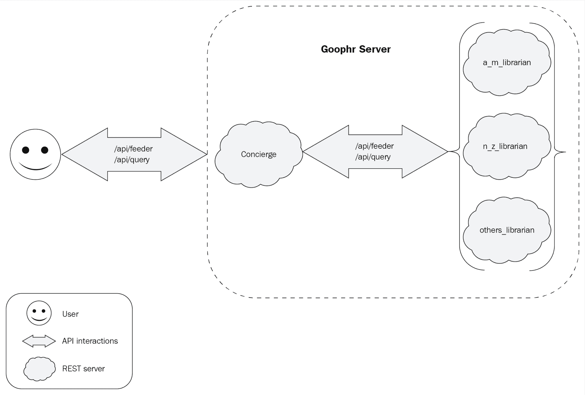

# 五、Goophr 简介

现在，我们已经对 Goroutine、Channel、REST 以及开发 Go 应用程序的一些工具有了深入的了解，让我们利用这些知识构建一个分布式 web 应用程序。此应用程序的目的是索引和搜索文档。在本章中，我们将阐述如何构建这样一个应用程序的设计，我们还将介绍一些我们将在项目中使用的剩余主题和工具。

本章大致可分为两部分：

*   设计概述
*   项目结构

## 什么是 Goophr？

我们将构建一个应用程序来索引和搜索文档。这是我们每次使用谷歌、必应或 DuckDuckGo 等搜索门户网站访问互联网时使用的一项功能。这也是一些网站借助搜索引擎提供的一项功能。

在接下来的几章中，我们将从 Google、Solr 搜索引擎和 goroutines 等现有技术中汲取灵感，构建一个搜索引擎应用程序。我们的应用程序的名称就是这三种技术的结合。

想象一下在任何搜索门户上搜索一个短语；在提交我们的查询时，我们会得到一个链接列表，其中包含包含搜索短语中术语的文本片段。很多时候，前几个链接往往是我们正在寻找的相关网页或文档。如何获得最相关文件的列表？谷歌或其他搜索引擎实现这一目标的方式相当复杂；他们有一个庞大的计算机科学家团队，不断对搜索引擎进行微调。

我们的目标不会是建造如此复杂的东西。通过一个谦虚而实用的目标，我们可以创建一个最小但可用的搜索引擎。但是，首先让我们定义应用程序的目的和标准。

## 设计概述

现在，我们已经简要介绍了我们想要构建的应用程序以及构建它的原因，让我们看看我们想要作为搜索引擎的一部分实现的功能列表：

*   它应该接受 POST 请求中提供的文档链接并下载它们
*   它应该处理和索引下载的文档
*   它应该处理搜索查询，并用包含搜索词的片段的文档列表进行响应
*   返回的文档列表应按文档中搜索词出现次数最多的顺序排列

虽然我们列出了四项功能，但我们可以将应用程序分为两个主要组件：

*   **Goophr Concierge**：这是负责索引和返回搜索查询文档列表的组件
*   **Goophr Library**：这是负责处理用户交互和与第一个组件交互的组件

这两个组件将作为两个 REST 服务器运行，所有交互都将遵循 REST 协议。让我们为我们的组件定义 API 定义吧！在[第 4 章](04.html)*RESTful Web*中，您注意到我们用于定义各种 API 端点和数据定义以通过 REST 协议进行通信的方法非常冗长和繁琐。如果我们有一种编写 API 定义的正式方法，不是更好吗？好消息是，随着 REST 协议的普及，有很多解决方案，其中一个解决方案是使用最广泛的行业标准 OpenAPI 格式。

## OpenAPI 规范

OpenAPI 允许我们以标准化的方式定义 RESTful API，并且可以在不受任何特定编程语言或框架约束的情况下定义它们。这为我们提供了一个强大的抽象来定义一个 API，该 API 可以用 Java 或 Python 实现 RESTful 服务器的初始实现；此外，我们还可以移植代码库，而服务的行为几乎没有变化。

让我们列出一个 OpenAPI 规范的一般结构，并用它来重新定义[第 4 章](04.html)、*RESTful Web*中描述的`Books API`。

如果我们看一下`Books API`标题，我们可以定义以下元素来描述 API：

*   指向我们服务器的 URL
*   关于 API 意图的基本信息
*   API 中可用的路径
*   API 中每个路径的可用方法
*   请求和响应的可能描述和示例有效负载
*   请求和响应有效负载的模式

考虑到这些要点，让我们看看`Books API`的 OpenAPI 规范：

```go
# openapi/books.yaml

openapi: 3.0.0
servers: 
  - url: /api 
info: 
  title: Books API 
  version: '1.0' 
  description: ; 
    API responsible for adding, reading and updating list of books. 
paths: 
  /books: 
    get: 
      description: | 
        Get list of all books 
      responses: 
        '200': 
          description: | 
            Request successfully returned list of all books 
          content: 
            application/json: 
              schema: 
                $ref: '#/components/schemas/response' 
  /books/{id}: 
    get: 
      description: | 
        Get a particular books with ID 'id' 
      responses: 
        '200': 
          description: | 
            Request was successfully completed. 
          content: 
            application/json: 
              schema: 
                $ref: '#/components/schemas/document' 
      parameters: 
        - in: query 
          name: id 
          schema: 
            type: integer 
          description: Book ID of the book to get. 
    post: 
      description: | 
        Get a particular books with ID 'id' 
      responses: 
        '200': 
          description: | 
            Request was successfully completed. 
          content: 
            application/json: 
              schema: 
                $ref: '#/components/schemas/payload' 
      requestBody: 
        content: 
          application/json: 
            schema: 
                $ref: '#/components/schemas/document' 
    put: 
      description: | 
        Update the data of a Book with ID 'id' with the payload sent in the request body. 
      responses: 
        '200': 
          description: | 
            Request was successfully completed. 
          content: 
            application/json: 
              schema: 
                $ref: '#/components/schemas/payload' 
      requestBody: 
        content: 
          application/json: 
            schema: 
                $ref: '#/components/schemas/document' 
    delete: 
      description: | 
        Get a particular books with ID 'id' 
      responses: 
        '200': 
          description: | 
            Request was successfully completed. 
      parameters: 
        - in: query 
          name: id 
          schema: 
            type: integer 
          description: Book ID of the book to get. 
components: 
  schemas: 
    response: 
      type: array 
      items: 
        $ref: '#/components/schemas/document' 

    document: 
      type: object 
      required: 
        - title 
        - link 
      properties: 
        id: 
          type: integer 
          description: Book ID 
        title: 
          type: string 
          description: Title of the book 
        link:  
          type: string 
          description: Link to the book 

    payload: 
      type: object 
      required: 
        - title 
        - link 
      properties: 
        title: 
          type: string 
          description: Title of the book 
        link:  
          type: string 
          description: Link to the book 
```

### Goophr 礼宾部 API 定义

Goophr Concierge 是面向用户的组件，它有两个职责：索引新文档和返回查询结果。非正式地，我们可以定义 API 如下

*   `/api/feeder`：用户上传文档的 API 端点
    *   如果有效负载完整且正确，POST 请求将添加新文档
*   `/api/query`：用户搜索针对此 API 端点查询的短语或术语
    *   POST 请求包含带有搜索词的有效负载，并将返回文档列表

这个简单的 API 描述供我们理解。现在，让我们看看如何使用 OpenAPI 规范来制定：

```go
# openapi/concierge.yaml

openapi: 3.0.0

servers: 
  - url: /api 
info: 
  title: Goophr Concierge API 
  version: '1.0' 
  description: > 
    API responsible for responding to user input and communicating with Goophr 
    Librarian. 
paths: 
  /feeder: 
    post: 
      description: | 
        Register new document to be indexed. 
      responses: 
        '200': 
          description: | 
            Request was successfully completed. 
          content: 
            application/json: 
              schema: 
                $ref: '#/components/schemas/response' 
        '400': 
          description: > 
            Request was not processed because payload was incomplete or 
            incorrect. 
          content: 
            application/json: 
              schema: 
                $ref: '#/components/schemas/response' 
      requestBody: 
        content: 
          application/json: 
            schema: 
              $ref: '#/components/schemas/document' 
        required: true 
  /query: 
    post: 
      description: | 
        Search query 
      responses: 
        '200': 
          description: | 
            Response consists of links to document 
          content: 
            application/json: 
              schema: 
                type: array 
                items: 
                  $ref: '#/components/schemas/document' 
      requestBody: 
        content: 
          application/json: 
            schema: 
              type: array 
              items: 
                type: string 
        required: true 
components: 
  schemas: 
    response: 
      type: object 
      properties: 
        code: 
          type: integer 
          description: Status code to send in response 
        msg: 
          type: string 
          description: Message to send in response 
    document: 
      type: object 
      required: 
        - title 
        - link 
      properties: 
        title: 
          type: string 
          description: Title of the document 
        link: 
          type: string 
          description: Link to the document
```

在 API 描述的帮助下，前面的 OpenAPI 定义应该是自解释的。有关 OpenAPI 规范的详细信息，请参见[https://swagger.io/specification/](https://swagger.io/specification/) 。我们可以使用 Swagger（[提供的工具 https://editor.swagger.io/](https://editor.swagger.io/) ）以获得更好的 API 定义的视觉表示。

以下是在 Swagger Editor 中查看的 Goophr Concierge OpenAPI 的屏幕截图：


在 Swagger 编辑器上查看 OpenAPI

#### Goophr 图书馆员 API 定义

Goophr Library 管理员是一组文档索引的实际维护者，其职责是向索引中添加术语，并根据索引中可用的术语返回搜索术语的查询结果。

非正式地说，我们可以如下定义 API：

*   `/api/index`**Goophr Concierge 调用此 API 端点，将术语添加到实际索引中

    *   POST 请求将术语添加到索引中** 
***   `/api/query`：Goophr Concierge 调用此端点查询用户提交的搜索词
    *   POST 请求返回搜索条件的结果**

 **以下是 Goophr Library 的 OpenAPI 定义：

```go
# openapi/librarian.yaml

openapi: 3.0.0
servers: 
  - url: /api 
info: 
  title: Goophr Librarian API 
  version: '1.0' 
  description: | 
    API responsible for indexing & communicating with Goophr Concierge. 
paths: 
  /index: 
    post: 
      description: | 
        Add terms to index. 
      responses: 
        '200': 
          description: | 
            Terms were successfully added to the index. 
        '400': 
          description: > 
            Request was not processed because payload was incomplete or 
            incorrect. 
          content: 
            application/json: 
              schema: 
                $ref: '#/components/schemas/error' 
      requestBody: 
        content: 
          application/json: 
            schema: 
              $ref: '#/components/schemas/terms' 
        description: | 
          List of terms to be added to the index. 
        required: true 
  /query: 
    post: 
      description: | 
        Search for all terms in the payload. 
      responses: 
        '200': 
          description: | 
            Returns a list of all the terms along with their frequency, 
            documents the terms appear in and link to the said documents. 
          content: 
            application/json: 
              schema: 
                $ref: '#/components/schemas/results' 
        '400': 
          description: > 
            Request was not processed because payload was incomplete or 
            incorrect. 
          content: 
            application/json: 
              schema: 
                $ref: '#/components/schemas/error' 
    parameters: [] 
components: 
  schemas: 
    error: 
      type: object 
      properties: 
        msg: 
          type: string 
    term: 
      type: object 
      required: 
        - title 
        - token 
        - doc_id 
        - line_index 
        - token_index 
      properties: 
        title: 
          description: | 
            Title of the document to which the term belongs. 
          type: string 
        token: 
          description: | 
            The term to be added to the index. 
          type: string 
        doc_id: 
          description: | 
            The unique hash for each document. 
          type: string 
        line_index: 
          description: | 
            Line index at which the term occurs in the document. 
          type: integer 
        token_index: 
          description: | 
            Position of the term in the document. 
          type: integer 
    terms: 
      type: object 
      properties: 
        code: 
          type: integer 
        data: 
          type: array 
          items: 
            $ref: '#/components/schemas/term' 
    results: 
      type: object 
      properties: 
        count: 
          type: integer 
        data: 
          type: array 
          items: 
            $ref: '#/components/schemas/result' 
    result: 
      type: object 
      properties: 
        doc_id: 
          type: string 
        score: 
          type: integer
```

这两个 API 规范描述了这两个组件将如何相互交互，以及如何与用户交互。然而，这并不是完整的情况，因为即使我们只展示了两个 API 定义，实际的实现将有三个 Library 实例！

用户通过`/api/feeder`和`/api/query`*与礼宾部互动，与 Goophr 互动。*礼宾部可通过`/api/index`和`/api/query`*与三位图书管理员实例进一步互动。*下图显示了应用程序的大致外观：



Goophr 应用程序的设计

考虑当我们需要构建一个将被多个用户使用的真实 Web 应用程序时；在这种情况下，我们希望运行多个服务实例，以便它们能够同时为所有用户提供服务。我们可能已经将应用程序拆分为多个 API，我们需要很好地理解如何设计系统来处理这种分布式工作负载。因此，为了了解如何处理这样一个系统，我们将使用三个图书馆员实例。

## 项目结构

根据前面的图表，我们设计的应用程序由一个 Goophr Concierge 实例和三个 Goophr Library 实例组成。为了保持代码的可管理性，我们将源代码分为两个主要实体和根级别的`docker-compose`文件：

*   `Concierge`
*   `Librarian`
*   `docker-compose.yaml`

在[第一章](01.html)*【Go 开发环境*中，我们讨论了如何创建和运行 docker 映像。`docker run ...`适用于单个图像，但当我们想要创建一个相互交互的 docker 图像网络时，它可能会变得复杂。为了简化设置，我们将使用`docker-compose`（[https://docs.docker.com/compose/overview/](https://docs.docker.com/compose/overview/) 。简言之，`docker-compose`需要一个**YAML**（**还有另一种标记语言**）文件，其中包含一些细节，如运行中的 docker 映像的名称、运行它们的端口以及用于构建这些 docker 映像的`Dockerfile`。

以下是我们将在项目中使用的`docker-compose.yaml`文件：

```go
version: '3' 

services: 
  concierge: 
    build: concierge/. 
    ports: 
      - "6060:9000" 
  a_m_librarian: 
    build: librarian/. 
    ports: 
      - "7070:9000" 
  n_z_librarian: 
      build: librarian/. 
      ports: 
        - "8080:9000" 
  others_librarian: 
      build: librarian/. 
      ports: 
        - "9090:9000"
```

请注意，`a_m_librarian`、`n_z_librarian`和`others_librarian`是从`librarian/Dockerfile`定义的同一个 docker 映像构建的。这比使用原始的`docker`命令来启动和配置多个实例更容易。

以下是我们将开始的项目结构：

```go
$ tree . ├── concierge │ ├── api │ │ ├── feeder.go │ │ └── query.go │ ├── common │ │ ├── helpers.go │ │ └── state.go │ ├── Dockerfile │ └── main.go ├── docker-compose.yaml └── librarian ├── api │ ├── index.go │ └── query.go ├── common │ ├── helpers.go │ └── state.go ├── Dockerfile └── main.go 
```

尽管我们已经建立了一个复杂的结构，但目前，仅有的具有有用代码的文件是`concierge/main.go`、`concierge/Dockerfile`、`librarian/main.go`和`librarian/Dockerfile`（为了方便起见，从这里开始，我们将使用速记符号`{concierge,librarian}`/`{main.go,Dockerfile}`来表示文件。此符号的灵感来自于 Bash。）

让我们看一看 TytT0.两个组件的这两个文件几乎相同。为了简洁起见，我们将对这两种类型的文件各显示一次，并显示差异所在。

让我们从`main.go`开始：

```go
// {concierge,librarian}/main.go 
package main 

import "fmt" 

func main() { 
    fmt.Println("Hello from Concierge!")  // Or, Hello from Librarian! 
} 
```

现在我们来看`Dockerfile`：

```go
# {concierge,librarian}/Dockerfile FROM golang:1.9.1 # In case of librarian, '/concierge' will be replaced with '/librarian' ADD . /go/src/github.com/last-ent/distributed-go/chapter5/goophr/concierge WORKDIR /go/src/github.com/last-ent/distributed-go/chapter5/goophr/concierge RUN go install github.com/last-ent/distributed-go/chapter5/goophr/concierge ENTRYPOINT /go/bin/concierge EXPOSE 9000 
```

如果我们运行完整的代码库，我们将看到类似于以下内容的输出：

```go
$ docker-compose up --build
# ...
Creating goophr_a_m_librarian_1 ... 
Creating goophr_concierge_1 ... 
Creating goophr_m_z_librarian_1 ... 
Creating goophr_others_librarian_1 ... 
Creating goophr_a_m_librarian_1 
Creating goophr_m_z_librarian_1 
Creating goophr_others_librarian_1 
Creating goophr_others_librarian_1 ... done 
Attaching to goophr_a_m_librarian_1, goophr_m_z_librarian_1, goophr_concierge_1, goophr_others_librarian_1 
a_m_librarian_1 | Hello from Librarian! 
m_z_librarian_1 | Hello from Librarian! 
others_librarian_1 | Hello from Librarian! 
concierge_1 | Hello from Concierge! 
goophr_a_m_librarian_1 exited with code 0 
goophr_m_z_librarian_1 exited with code 0 
goophr_concierge_1 exited with code 0 
goophr_others_librarian_1 exited with code 0 
```

## 总结

在本章中，我们首先描述了我们将在接下来的三章中构建的应用程序。然后，我们将应用程序分为两个主要组件：Goophr Concierge 和 Goophr Library。接下来，我们看了我们将用于应用程序的项目结构。我们还讨论了描述 RESTAPI 的行业标准 OpenAPI，并使用它定义了礼宾部和图书管理员的 API。最后，我们看了如何使用`docker-compose`运行分布式应用程序。

在下一章中，我们将介绍 Goophr Concierge，它将与用户交互以上载文档，并响应用户的搜索查询。**