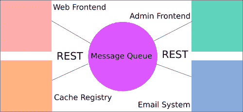

# 第 7 章微服务与通信

我们的应用程序现在开始变得更加真实。在上一章中，我们添加了一些 API 和客户端接口。

微服务在过去几年中变得非常热门，主要是因为它们减轻了大型或单片应用程序的开发和支持重量。通过分解这些巨石，微服务实现了更加敏捷和并行的开发。它们可以允许不同的团队在应用程序的不同部分上工作，而不必太担心冲突、向后兼容性问题，也不必去干涉应用程序的其他部分。

在本章中，我们将介绍微服务，并探索 Go 如何在其中工作，使它们能够工作，甚至驱动它们的中心机制。

综上所述，我们将涵盖以下几个方面：

*   介绍微服务方法
*   利用微服务的利弊
*   理解微服务的核心
*   微服务之间的通信
*   在电线上留言
*   阅读其他服务

# 引入微服务方式

如果你还没有遇到过“微服务”这个词，或者没有深入探讨它的含义，我们可以很快地解开它的神秘面纱。从本质上讲，微服务是整个应用程序的独立功能，可以通过一些众所周知的协议进行分离和访问。

微服务方法通常用于分离非常大的单片应用程序。

想象一下 2000 年代中期的标准 web 应用程序。当需要新功能时，比如说给新用户发送电子邮件的功能，它会直接添加到代码库中，并与应用程序的其余部分集成。

随着应用程序的增长，必要的测试覆盖率也随之增长。因此，它也增加了发生严重错误的可能性。在这种情况下，一个严重错误不仅会导致该组件（在本例中是电子邮件系统）停机；它会关闭整个应用程序。

跟踪、修补和重新部署这可能是一场噩梦，而这正是微服务设计要解决的噩梦类型。

如果应用程序的电子邮件部分被分离到它自己的应用程序中，那么它具有一定的隔离和隔离级别，这使得查找问题更加容易。这也意味着整个堆栈不会因为有人在整个应用程序的一小部分中引入了严重错误而崩溃，如下图所示：



考虑下面的基本示例架构，其中一个应用程序被分成四个独立的概念，这些概念代表它们在 MICROServices 框架中的应用程序。

曾经，每一块都存在于它自己的应用中；现在它们被分成更小、更易于管理的系统。应用程序之间的通信通过使用 RESTAPI 端点的消息队列进行。

# 使用微服务的利弊

如果微服务在这一点上似乎是灵丹妙药，那么我们还应该注意到，这种方法并非没有自身的一系列问题。权衡是否值得在很大程度上取决于整体组织方法。

正如前面提到的一样，稳定性和错误检测构成了微服务在生产层面上的巨大胜利。但如果你想到应用程序没有崩溃的另一面，这也可能意味着问题隐藏的时间比其他情况下更长。很难忽视整个网站都在关闭，但可能要过几个小时才会有人意识到电子邮件尚未发送，除非有非常可靠的日志记录。

但是，微服务还有其他大的优点。首先，使用外部标准通信协议（例如 REST）意味着您不会被锁定在单一语言中。

例如，如果应用程序的某些部分可以在 Node 中编写得比在 Go 中编写得更好，则无需重写整个应用程序。对于开发者来说，这是一个常见的诱惑：因为引入了新的闪亮的语言应用程序或功能，所以重写整个过程。微服务安全地支持这种行为，它允许开发人员或一组开发人员尝试一些东西，而无需深入到他们希望编写的特定功能之外。

这也带来了一个潜在的负面场景，因为应用程序组件是解耦的，所以可以将它们周围的机构知识解耦。很少有开发人员知道如何使服务保持理想的运行状态。小组中的其他成员可能缺乏语言知识，无法插手解决关键错误。

最后一个重要的考虑因素是，微服务体系结构通常意味着默认情况下的分布式环境。这就引出了最直接的警告，即这种情况几乎总是意味着最终的一致性是游戏的名称。

由于每条消息都必须依赖于多个外部服务，因此要实施更改，需要经历几层延迟。

# 了解微服务的核心

当你考虑这个系统来设计在国会工作的不和谐服务时，你可能会疑惑一件事：什么是交流平台？为了回答这个问题，我们会说有一个简单的答案和一个更复杂的答案。

简单的答案是休息。这是一个好消息，因为您可能非常熟悉 REST，或者您至少从[第 5 章](05.html "Chapter 5. Frontend Integration with RESTful APIs")、*前端与 RESTful API 的集成*中了解了 REST 的部分内容。在这里，我们描述了利用 RESTful、无状态协议和将 HTTP 谓词实现为操作的 API 通信的基础。

这让我们得到了更复杂的答案：并非大型或相关应用程序中的所有内容都可以单独在 REST 上运行。有些事情需要状态或至少某种程度的长期一致性。

对于后一个问题，大多数微服务体系结构都以消息队列为中心，作为信息共享和传播的平台。消息队列充当从一个服务接收 REST 请求的管道，并将其保持，直到另一个服务检索该请求以进行进一步处理。

# 微服务之间的通信

如前所述，微服务之间有许多通信方法；REST 端点为消息提供了一个很好的平台。您可能还记得前面的图形，它显示了作为服务之间的中心管道的消息队列。这是处理消息传递的最常用方法之一，我们将使用 RabbitMQ 来演示这一点。

在本例中，我们将显示新用户何时注册到电子邮件队列，以便在 RabbitMQ 安装中传递消息，然后通过电子邮件微服务接收消息。

### 注

您可以在这里阅读关于 RabbitMQ 的更多信息，RabbitMQ 使用**高级消息队列协议**（**AMQP**）：[https://www.rabbitmq.com/](https://www.rabbitmq.com/) 。

要为 Go 安装AMQP 客户端，我们推荐 Sean Treadway 的 AMQP 包。您可以使用`go get`命令安装它。您可以在[github.com/streadway/amqp](http://github.com/streadway/amqp)上获得

# 在电线上留言

有很多方法可以使用 RabbitMQ。例如，一种方法允许多个工人完成同一件事，作为在可用资源之间分配工作的方法。

毫无疑问，随着系统的发展，它很可能会使用这种方法。但在我们的小示例中，我们希望基于特定的通道来分离任务。当然，这与 Go 的并发通道不同，所以在阅读此方法时请记住这一点。

但是为了解释这种方法，我们可能有单独的交换来路由我们的消息。在我们的示例中，我们可能有一个日志队列，其中消息从所有服务聚合到单个日志位置，或者有一个缓存过期方法，该方法在缓存项从数据库中删除时从内存中删除缓存项。

不过，在本例中，我们将实现一个电子邮件队列，该队列可以接收来自任何其他服务的消息，并使用其内容发送电子邮件。这使所有电子邮件功能都处于核心和支持服务之外。

回想一下在[第 5 章](05.html "Chapter 5. Frontend Integration with RESTful APIs")中*前端与 RESTful API 的集成*中，我们添加了注册和登录方法。我们最感兴趣的是`RegisterPOST()`，我们允许用户注册到我们的网站，然后评论我们的帖子。

对于新注册的用户来说，收到一封确认身份或简单欢迎信息的电子邮件并不少见。我们将在这里做后者，但添加确认是微不足道的；这只是生成一个密钥，通过电子邮件发送，然后在点击链接后启用用户的问题。

因为我们使用的是外部包，所以我们需要做的第一件事就是导入它。

我们是这样做的：

```go
import (
  "bufio"
  "crypto/rand"
  "crypto/sha1"
  "database/sql"
  "encoding/base64"
  "encoding/json"
  "fmt"
  _ "github.com/go-sql-driver/mysql"
  "github.com/gorilla/mux"
  "github.com/gorilla/sessions"
  "github.com/streadway/amqp"
  "html/template"
  "io"
  "log"
  "net/http"
  "regexp"
  "text/template"
  "time"
)
```

请注意，这里我们已经包括了`text/template`，这不是严格必要的，因为我们有`html/template`，但我们在这里已经注意到，如果您希望在单独的流程中使用它。我们还包括了`bufio`，我们将使用它作为相同模板过程的一部分。

为了发送电子邮件，为电子邮件提供一条消息和一个标题会很有帮助，所以让我们声明这些。在生产环境中，我们可能会有一个单独的语言文件，但此时我们没有太多其他要显示的内容：

```go
var WelcomeTitle = "You've successfully registered!"
var WelcomeEmail = "Welcome to our CMS, {{Email}}!  We're glad you could join us."
```

这些只是表示成功注册时需要使用的电子邮件变量。

由于我们将消息放到网络上，并将应用程序逻辑的一些责任交给另一个服务，因此现在我们只需要确保 RabbitMQ 已接收到我们的消息。

接下来，我们需要连接到队列，我们可以通过引用传递队列，也可以重新连接每条消息。通常，您希望将连接保持在队列中很长一段时间，但您可以选择在每次测试时重新连接并关闭连接。

为此，我们将把 MQ 主机信息添加到常量中：

```go
const (
  DBHost  = "127.0.0.1"
  DBPort  = ":3306"
  DBUser  = "root"
  DBPass  = ""
  DBDbase = "cms"
  PORT    = ":8080"
  MQHost  = "127.0.0.1"
  MQPort  = ":5672"
)
```

当我们创建一个连接时，我们将使用有点熟悉的`TCP Dial()`方法，它返回一个 MQ 连接。以下是我们的连接功能：

```go
func MQConnect() (*amqp.Connection, *amqp.Channel, error) {
  url := "amqp://" + MQHost + MQPort
  conn, err := amqp.Dial(url)
  if err != nil {
    return nil, nil, err
  }
  channel, err := conn.Channel()
  if err != nil {
    return nil, nil, err
  }
  if _, err := channel.QueueDeclare("", false, true, false, false, nil); err != nil {
    return nil, nil, err
  }
  return conn, channel, nil
}
```

我们可以选择通过引用传递连接，或者将其作为一个全局连接进行维护，并在此处考虑所有适用的注意事项。

### 提示

您可以在[阅读更多关于 RabbitMQ 连接和检测中断连接的信息 https://www.rabbitmq.com/heartbeats.html](https://www.rabbitmq.com/heartbeats.html)

从技术上讲，任何生产者（在本例中是我们的应用程序）都不会将消息推送到队列中；相反，它将他们推到交易所。RabbitMQ 允许您使用`rabbitmqctl``list_exchanges`命令（而不是`list_queues`命令）查找交换。在这里，我们使用一个空的交换，这是完全有效的。队列和交换之间的区别非常重要；后者负责定义消息周围的规则，并将其发送到一个或多个队列。

在我们的`RegisterPOST()`中，当成功注册时，让我们发送一条 JSON 编码的消息。我们需要一个非常简单的`struct`来维护我们需要的数据：

```go
type RegistrationData struct {
  Email   string `json:"email"`
  Message string `json:"message"`
}
```

现在我们将创建一个新的`RegistrationData struct`如果且仅当注册过程成功：

```go
  res, err := database.Exec("INSERT INTO users SET user_name=?, user_guid=?, user_email=?, user_password=?", name, guid, email, password)

  if err != nil {
    fmt.Fprintln(w, err.Error)
  } else {
    Email := RegistrationData{Email: email, Message: ""}
    message, err := template.New("email").Parse(WelcomeEmail)
    var mbuf bytes.Buffer
    message.Execute(&mbuf, Email)
    MQPublish(json.Marshal(mbuf.String()))
    http.Redirect(w, r, "/page/"+pageGUID, 301)
  }
```

最后，我们将需要实际发送数据的函数`MQPublish()`：

```go
func MQPublish(message []byte) {
  err = channel.Publish(
    "email", // exchange
    "",      // routing key
    false,   // mandatory
    false,   // immediate
    amqp.Publishing{
      ContentType: "text/plain",
      Body:        []byte(message),
    })
}
```

# 从其他服务读取

现在我们已经在应用程序中向消息队列发送了一条消息，让我们使用另一个微服务从另一端的队列中提取该消息。

为了展示微服务设计的灵活性，我们的第二个服务将是一个 Python 脚本，它连接到 MQ 并在电子邮件队列中找到消息时侦听消息。它将解析消息并发送电子邮件。或者，它可以将状态消息发布回队列或将其记录，但我们暂时不会这样做：

```go
import pika
import json
import smtplib
from email.mime.text import MIMEText

connection = pika.BlockingConnection(pika.ConnectionParameters( host='localhost'))
channel = connection.channel()
channel.queue_declare(queue='email')

print ' [*] Waiting for messages. To exit press CTRL+C'

def callback(ch, method, properties, body):
    print " [x] Received %r" % (body,)
    parsed = json.loads(body)
    msg = MIMEText()
    msg['From'] = 'Me'
    msg['To'] = parsed['email']
    msg['Subject'] = parsed['message']
    s = smtplib.SMTP('localhost')
    s.sendmail('Me', parsed['email'], msg.as_string())
    s.quit()

channel.basic_consume(callback,
                      queue='email',
                      no_ack=True)

channel.start_consuming()
```

# 总结

在本章中，我们尝试利用微服务将应用程序分解为不同的责任域。在本例中，我们将应用程序的电子邮件方面委托给另一个用 Python 编写的服务。

我们这样做是为了将微服务或互连的较小应用程序的概念用作可调用的网络功能。这种风气最近在很大程度上推动了网络的发展，并且有无数的优点和缺点。

为此，我们实现了一个消息队列，它作为我们通信系统的主干，允许每个组件以可靠和可重复的方式相互通信。在本例中，我们使用 Python 应用程序读取从 Go 应用程序通过 RabbitMQ 发送的消息，并获取电子邮件数据并进行处理。

在[第 8 章](08.html "Chapter 8. Logging and Testing")、*日志记录和测试*中，我们将重点关注日志记录和测试，我们可以用它来扩展微服务的概念，以便我们能够从错误中恢复，并了解过程中可能出现的错误。