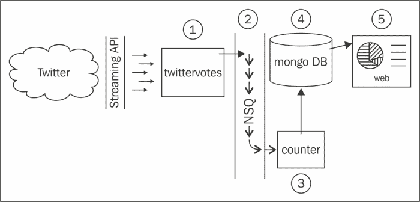

# 第五章：构建分布式系统和使用灵活的数据

在本章中，我们将探讨可转移的技能，这些技能允许我们使用无模式数据和分布式技术来解决大数据问题。我们将在本章中构建的系统将为我们的未来做好准备，在未来，民主选举当然都会在推特上在线进行。我们的解决方案将通过查询 Twitter 的流式 API 来收集和统计选票，以查找特定的 hashtag，并且每个组件都能够水平扩展以满足需求。我们的用例很有趣，但我们将学习的核心概念和我们将做出的具体技术选择是本章真正的重点。这里讨论的思想直接适用于任何需要真正规模能力的系统。

### 注

水平扩展是指向系统中添加节点（如物理机器），以提高其可用性、性能和/或容量。像谷歌这样的大数据公司可以通过添加价格合理且易于获得的硬件（通常称为商品硬件）来扩大规模，这是因为它们编写软件和构建解决方案的方式不同。垂直扩展等同于增加单个节点的可用资源，例如向机箱添加额外的 RAM 或具有更多内核的处理器。

在本章中，您将：

*   了解分布式 NoSQL 数据存储；特别是如何与 MongoDB 交互
*   了解分布式消息队列；特别是 Bit.ly 的 NSQ 以及如何使用`go-nsq`包轻松发布和订阅事件
*   通过 Twitter 的流式 API 流式传输实时推特数据，并管理长时间运行的网络连接
*   了解如何使用许多内部 goroutine 正确停止程序
*   了解如何使用低内存通道发送信号

# 系统设计

勾勒出一个基本设计通常是有用的，尤其是在分布式系统中，许多组件将以不同的方式相互通信。我们不想在这个阶段花费太长时间，因为我们的设计可能会随着细节的深入而不断发展，但我们会看一个高层次的大纲，这样我们就可以讨论组成部分以及它们是如何结合在一起的。



上图显示了我们将要构建的系统的基本概述：

*   推特是我们都知道和喜爱的社交媒体网络。
*   Twitter 的流式 API 允许长时间运行的连接，其中 tweet 数据以尽可能快的速度流式传输。
*   `twittervotes`是我们将编写的一个程序，用于读取推文并将投票推送到消息队列中。`twittervotes`提取相关推文数据，计算出投票对象（或者更确切地说，提到了哪些选项），并将投票推送到 NSQ。
*   NSQ是一个开源的实时分布式消息传递平台，旨在大规模运行，由 Bit.ly 构建和维护。NSQ 在其实例中传递该消息，使任何对投票数据感兴趣的人都可以使用该消息。
*   `counter`是我们将编写的一个程序，它监听消息队列上的投票，并定期将结果保存在 MongoDB 数据库中。`counter`接收来自 NSQ 的投票消息，并在内存中记录结果，定期推动更新以保存数据。
*   MongoDB是一个开源文档数据库，旨在大规模运行。
*   `web`是一个 web 服务器程序，它将公开我们将在下一章中编写的实时结果。

有人可能会说可以编写一个单独的 Go 程序来读取推文、计算选票并将其推送到用户界面，但这样的解决方案虽然是一个很好的概念证明，但其规模非常有限。在我们的设计中，任何一个组件都可以随着对特定功能需求的增加而水平扩展。如果我们的民意调查相对较少，但有很多人查看数据，我们可以将`twittervotes`和`counter`实例保留下来，并添加更多`web`和 MongoDB 节点，如果情况相反，则反之亦然。

我们设计的另一个关键优势是冗余；由于我们可以让多个组件实例同时工作，如果我们的一个盒子消失了（例如，由于系统崩溃或断电），其他盒子就可以填补空缺。现代建筑通常在地理范围内分布这样一个系统，以防止当地自然灾害。如果我们以这种方式构建解决方案，所有这些选项都可以使用。

我们之所以选择本章中的特定技术，是因为它们与 Go 的链接（例如，NSQ 完全是用 Go 编写的），以及经过良好测试的驱动程序和软件包的可用性。但是，从概念上讲，您可以根据自己的需要加入各种备选方案。

## 数据库设计

我们将调用我们的 MongoDB 数据库`ballots`。它将包含一个名为`polls`的集合，我们将在其中存储投票详细信息，例如标题、选项和结果（在单个 JSON 文档中）。投票的代码如下所示：

```go
{
  "_id": "???",
  "title": "Poll title",
  "options": ["one", "two", "three"],
  "results": {
    "one": 100,
    "two": 200,
    "three": 300
  }
}
```

`_id`字段由 MongoDB 自动生成，将作为我们识别每次投票的方式。`options`字段包含字符串选项数组；这些是我们将在 Twitter 上寻找的标签。`results`字段是一个映射，其中键表示选项，值表示每个项目的总投票数。

# 安装环境

我们在本章中编写的代码具有真正的外部依赖性，我们需要在开始构建系统之前进行设置。

### 提示

请务必在[查看章节注释 https://github.com/matryer/goblueprints](https://github.com/matryer/goblueprints) 如果您在安装任何依赖项时遇到困难。

在大多数情况下，必须先启动`mongod`和`nsqd`等服务，然后才能运行程序。因为我们正在编写分布式系统的组件，所以我们必须同时运行每个程序，这就像打开许多终端窗口一样简单。

## NSQ

NSQ是一个消息队列，它允许一个程序向另一个程序发送消息或事件，或向在同一台机器上本地运行或在网络连接的不同节点上运行的许多其他程序发送消息或事件。NSQ 保证消息的传递，这意味着它将缓存未传递的消息，直到所有相关方都收到它们。这意味着，即使我们停止`counter`计划，我们也不会错过任何投票。您可以将此功能与 fire and forget 消息队列进行对比，在这些队列中，信息被视为过期，因此，如果信息未及时传递，则会被遗忘，并且消息的发送者不关心消费者是否收到它们。

消息队列抽象允许系统的不同组件在不同的位置运行，前提是它们与队列具有网络连接。您的程序与其他程序分离；相反，您的设计开始关注专业微服务的输入和输出，而不是通过单一程序的数据流。

NSQ 传输原始字节，这意味着如何将数据编码到这些字节取决于我们。例如，我们可以根据需要将数据编码为 JSON 或二进制格式。在我们的例子中，我们将以字符串形式发送投票选项，而不使用任何额外的编码，因为我们只共享一个数据字段。

打开[http://nsq.io/deployment/installing.html 在浏览器中](http://nsq.io/deployment/installing.html)（或搜索`install nsq`，并按照您环境的说明进行操作。您可以下载预编译的二进制文件，也可以从源代码构建自己的二进制文件。如果您安装了自制软件，安装NSQ 只需键入以下内容：

```go
brew install nsq

```

一旦您安装了 NSQ，您需要将`bin`文件夹添加到`PATH`环境变量中，以便终端中可以使用这些工具。

为验证NSQ 安装正确，打开终端运行`nsqlookupd`；如果程序成功启动，您将看到一些类似于以下内容的输出：

```go
nsqlookupd v0.2.27 (built w/go1.3)
TCP: listening on [::]:4160
HTTP: listening on [::]:4161

```

我们将使用默认端口与 NSQ 交互，因此请注意输出中列出的 TCP 和 HTTP 端口，因为我们将在代码中引用它们。

按*Ctrl*+*C*暂时停止进程；我们稍后会正确启动它们。

我们将要使用的 NSQ 安装的关键工具是`nsqlookupd`和`nsqd`。`nsqlookupd`程序是管理分布式 NSQ 环境拓扑信息的守护进程；它跟踪特定主题的所有`nsqd`制作人，并为客户提供查询此类信息的接口。`nsqd`程序是一个守护进程，负责 NSQ 的繁重工作，如接收、排队和向相关方传递消息。有关 NSQ 的更多信息和背景，请访问[http://nsq.io/](http://nsq.io/) 。

### 围棋 NSQ 司机

NSQ 工具本身是用 Go 编写的，因此 Bit.ly 团队已经有了一个 Go 包，使得与 NSQ 的交互非常容易，这是合乎逻辑的。我们需要使用它，所以在终端中，使用`go get`获取它：

```go
go get github.com/bitly/go-nsq

```

## 蒙哥达

MongoDB是一个文档数据库，它基本上允许您存储和查询 JSON 文档以及其中的数据。每个文档进入一个集合，该集合可用于将文档分组在一起，而无需对其中的数据强制执行任何模式。与传统 RDBMS（如 Oracle、Microsoft SQL Server 或 MySQL）中的行不同，文档具有不同的形状是完全可以接受的。例如，`people`集合可以同时包含以下三个 JSON 文档：

```go
{"name":"Mat","lang":"en","points":57}
{"name":"Laurie","position":"Scrum Master"}
{"position":"Traditional Manager","exists":false}
```

这种灵活性允许具有不同结构的数据共存，而不会影响性能或浪费空间。如果您希望您的软件随着时间的推移而发展，这也是非常有用的，因为我们总是应该这样做的。

MongoDB 设计为可扩展，同时在单盒安装（如我们的开发机器）上仍然非常易于使用。当我们为生产托管我们的应用程序时，我们可能会安装一个更复杂的多分片复制系统，该系统分布在许多节点和位置上，但目前只需运行`mongod`即可。

前往[http://www.mongodb.org/downloads](http://www.mongodb.org/downloads) 到抓取最新版本的MongoDB 并安装，确保像往常一样用您的`PATH`环境变量注册`bin`文件夹。

要验证MongoDB 安装成功，请运行`mongod`命令，然后点击*Ctrl*+*C*暂时停止。

### Go 的 MongoDB 司机

Gustavo Niemeyer通过其`mgo`（发音为“mango”）软件包在[托管，在简化与 MongoDB 的交互方面做了大量工作 http://labix.org/mgo](http://labix.org/mgo) ，即*可获取的*，使用以下命令：

```go
go get gopkg.in/mgo.v2

```

## 启动环境

现在我们已经安装了所有需要的部件，我们需要启动我们的环境。在本节中，我们将：

*   启动`nsqlookupd`以便可以发现我们的`nsqd`实例
*   启动`nsqd`并告诉它使用哪个`nsqlookupd`
*   为数据服务启动`mongod`

这些守护进程中的每一个都应该在它们自己的终端窗口中运行，这使得我们只需点击*Ctrl*+*C*就可以轻松地阻止它们。

### 提示

请记住本节的页码，因为在阅读本章时，您可能会再次阅读几次。

在终端窗口中，运行：

```go
nsqlookupd

```

注意 TCP 端口，默认为`4160`，在另一个终端窗口中运行：

```go
nsqd --lookupd-tcp-address=localhost:4160

```

确保`--lookupd-tcp-address`标志中的端口号与`nsqlookupd`实例的 TCP 端口匹配。一旦启动`nsqd`，您会注意到一些输出从`nsqlookupd`和`nsqd`打印到终端；这表明这两个进程正在相互对话。

在另一个窗口或选项卡中，通过运行以下命令启动 MongoDB：

```go
mongod --dbpath ./db

```

`dbpath`标志告诉 MongoDB 在哪里存储数据库的数据文件。您可以选择任何您喜欢的位置，但您必须确保该文件夹存在，然后才能运行`mongod`。

### 提示

通过随时删除`dbpath`文件夹，您可以有效地擦除所有数据并重新开始。这在开发过程中特别有用。

现在我们的环境正在运行，我们已经准备好开始构建组件。

# 推特投票

在您的`$GOPATH/src`文件夹中，与其他项目一起，为本章创建一个名为`socialpoll`的新文件夹。此文件夹本身不是 Go 包或程序，但包含我们的三个组件程序。在`socialpoll`内部，创建一个名为`twittervotes`的新文件夹，并添加必需的`main.go`模板（这很重要，因为没有`main`功能的`main`包将无法编译）：

```go
package main
func main(){}
```

我们的`twittervotes`计划将：

*   使用`mgo`从 MongoDB 数据库加载所有轮询，并从每个文档中的`options`数组收集所有选项
*   打开并保持与 Twitter 流媒体 API 的连接，查找任何选项
*   对于每个与过滤器匹配的 tweet，找出提到的选项，并将该选项推送到 NSQ
*   如果与 Twitter 的连接在短时间延迟后断开（这在长时间运行的连接中很常见，因为它实际上是 Twitter 流式 API 规范的一部分）（因此我们不会用连接请求轰炸 Twitter），请重新连接并继续
*   定期重新查询 MongoDB 的最新民意调查，并刷新与 Twitter 的连接，以确保我们始终在寻找正确的选项
*   当用户点击*Ctrl*+*C*终止程序时，会优雅地自行停止

## 推特授权

在中，为了使用流式 API，我们需要 Twitter 的应用程序管理控制台提供身份验证凭据，这与我们在[第 3 章](13.html "Chapter 3. Three Ways to Implement Profile Pictures")中为 Gomniauth 服务提供商提供身份验证凭据的方式非常相似，*三种方式实现配置文件图片*。前往[https://apps.twitter.com](https://apps.twitter.com) 并创建一个名为`SocialPoll`的新应用程序（名称必须是唯一的，这样你可以在这里享受一些乐趣；名称的选择对代码都没有影响）。创建应用程序后，请访问**API 密钥**选项卡，找到**您的访问令牌**部分，您需要在该部分创建新的访问令牌。在短暂的延迟后，刷新页面并注意到您实际上拥有两组密钥和机密；API 密钥和密钥，以及访问令牌和相应的密钥。按照良好的编码实践，我们将把这些值设置为环境变量，这样我们的程序就可以访问它们，而不必在源文件中硬编码它们。

我们将在本章中使用的关键是：

*   `SP_TWITTER_KEY`
*   `SP_TWITTER_SECRET`
*   `SP_TWITTER_ACCESSTOKEN`
*   `SP_TWITTER_ACCESSSECRET`

您可以随意设置环境变量，但由于应用程序依赖这些变量才能工作，因此创建名为`setup.sh`（用于 bash Shell）或`setup.bat`（在 Windows 上）的新文件是一个好主意，因为您可以将这些文件签入源代码存储库。通过从 Twitter 应用程序页面复制适当的值，在`setup.sh`或`setup.bat`中插入以下代码：

```go
#!/bin/bash
export SP_TWITTER_KEY=yCwwKKnuBnUBrelyTN...
export SP_TWITTER_SECRET=6on0YRYniT1sI3f...
export SP_TWITTER_ACCESSTOKEN=2427-13677...
export SP_TWITTER_ACCESSSECRET=SpnZf336u...
```

使用 source 或 call 命令运行该文件以适当设置值，或者将它们添加到您的`.bashrc`或`C:\cmdauto.cmd`文件中，以保存您每次打开新的终端窗口时运行它们。

### 正在提取连接

Twitter 流 API支持长时间保持打开状态的 HTTP 连接，鉴于我们解决方案的设计，我们需要访问`net.Conn`对象，以便从发生请求的 goroutine 外部关闭它。我们可以通过为我们将要创建的`http.Transport`对象提供我们自己的`dial`方法来实现这一点。

在`twittervotes`内创建一个名为`twitter.go`的新文件（这是所有与 Twitter 相关的东西都将存在的地方），并插入以下代码：

```go
var conn net.Conn
func dial(netw, addr string) (net.Conn, error) {
  if conn != nil {
    conn.Close()
    conn = nil
  }
  netc, err := net.DialTimeout(netw, addr, 5*time.Second)
  if err != nil {
    return nil, err
  }
  conn = netc
  return netc, nil
}
```

我们的定制`dial`功能首先确保`conn`关闭，然后打开一个新连接，保持`conn`变量随当前连接更新。如果连接断开（Twitter 的 API 会时不时地这样做）或被我们关闭，我们可以重拨而不用担心僵尸连接。

我们将自己定期关闭连接并启动一个新的连接，因为我们希望定期从数据库重新加载选项。要做到这一点，我们需要一个函数来关闭连接，并关闭一个`io.ReadCloser`，我们将使用它来读取响应的主体。将以下代码添加到`twitter.go`：

```go
var reader io.ReadCloser
func closeConn() {
  if conn != nil {
    conn.Close()
  }
  if reader != nil {
    reader.Close()
  }
}
```

现在，我们可以随时拨打`closeConn`来中断与 Twitter 的持续连接并整理事情。在大多数情况下，我们的代码将再次从数据库加载选项并立即打开新连接，但如果我们关闭程序（响应*Ctrl*+*C*点击），那么我们可以在退出之前调用`closeConn`。

### 读取环境变量

接下来，我们将编写一个函数，该函数将读取环境变量并设置验证请求所需的`OAuth`对象。在`twitter.go`文件中添加以下代码：

```go
var (
  authClient *oauth.Client
  creds *oauth.Credentials
)
func setupTwitterAuth() {
  var ts struct {
    ConsumerKey    string `env:"SP_TWITTER_KEY,required"`
    ConsumerSecret string `env:"SP_TWITTER_SECRET,required"`
    AccessToken    string `env:"SP_TWITTER_ACCESSTOKEN,required"`
    AccessSecret   string `env:"SP_TWITTER_ACCESSSECRET,required"`
  }
  if err := envdecode.Decode(&ts); err != nil {
    log.Fatalln(err)
  }
  creds = &oauth.Credentials{
    Token:  ts.AccessToken,
    Secret: ts.AccessSecret,
  }
  authClient = &oauth.Client{
    Credentials: oauth.Credentials{
      Token:  ts.ConsumerKey,
      Secret: ts.ConsumerSecret,
    },
  }
}
```

这里我们定义了一个`struct`类型来存储我们需要通过 Twitter 验证的环境变量。因为我们不需要在其他地方使用该类型，所以我们内联定义它，并创建一个名为`ts`的匿名类型变量（这就是为什么我们有一些不寻常的`var ts struct…`代码）。然后，我们使用乔·肖（Joe Shaw）优雅的`envdecode`软件包为我们引入这些环境变量。您需要运行`go get github.com/joeshaw/envdecode`并导入`log`包。我们的程序将尝试为标记为`required`的所有字段加载适当的值，如果未能加载，则返回一个错误，这提醒人们，如果没有 Twitter 凭据，程序将无法工作。

`struct`中每个字段旁边的背面标记中的字符串称为标记，可通过反射接口使用，这就是`envdecode`知道要查找哪些变量的方式。Tyler Bunnell 和我向这个包中添加了必需的参数，这表明任何环境变量丢失（或为空）都是错误的。

一旦我们有了密钥，我们就用它们从 Gary Burd 的`go-oauth`包中创建`oauth.Credentials`和`oauth.Client`对象，这将允许我们通过 Twitter 授权请求。

现在我们已经能够控制底层连接和授权请求，我们已经准备好编写代码来实际构建授权请求，并返回响应。在`twitter.go`中，添加以下代码：

```go
var (
  authSetupOnce sync.Once
  httpClient    *http.Client
)
func makeRequest(req *http.Request, params url.Values) (*http.Response, error) {
  authSetupOnce.Do(func() {
    setupTwitterAuth()
    httpClient = &http.Client{
      Transport: &http.Transport{
        Dial: dial,
      },
    }
  })
  formEnc := params.Encode()
  req.Header.Set("Content-Type", "application/x-www-form-urlencoded")
  req.Header.Set("Content-Length", strconv.Itoa(len(formEnc)))
  req.Header.Set("Authorization", authClient.AuthorizationHeader(creds, "POST", req.URL, params))
  return httpClient.Do(req)
}
```

我们使用`sync.Once`来确保初始化代码只运行一次，不管调用`makeRequest`的次数如何。调用`setupTwitterAuth`方法后，我们使用使用自定义`dial`方法的`http.Transport`创建一个新的`http.Client`。然后，我们通过编码将包含我们查询的选项的指定`params`对象，设置 Twitter 授权所需的适当标头。

## 从 MongoDB 读取

为了加载民意测验，以及搜索 Twitter 的选项，我们需要连接并查询 MongoDB。在`main.go`中增加`dialdb`和`closedb`两个功能：

```go
var db *mgo.Session
func dialdb() error {
  var err error
  log.Println("dialing mongodb: localhost")
  db, err = mgo.Dial("localhost")
  return err
}
func closedb() {
  db.Close()
  log.Println("closed database connection")
}
```

这两个函数将使用`mgo`包连接和断开本地运行的 MongoDB 实例，并将`mgo.Session`（数据库连接对象）存储在名为`db`的全局变量中。

### 提示

作为一项附加任务，请查看是否可以找到一种优雅的方法来配置 MongoDB 实例的位置，这样就不需要在本地运行它。

假设 MongoDB 正在运行并且我们的代码能够连接，我们需要加载 poll 对象并从文档中提取所有选项，然后使用这些选项搜索 Twitter。在`main.go`中增加以下`Options`功能：

```go
type poll struct {
  Options []string
}
func loadOptions() ([]string, error) {
  var options []string
  iter := db.DB("ballots").C("polls").Find(nil).Iter()
  var p poll
  for iter.Next(&p) {
    options = append(options, p.Options...)
  }
  iter.Close()
  return options, iter.Err()
}
```

我们的民意测验文档包含的不仅仅是`Options`，但我们的程序不关心任何其他内容，因此我们没有必要膨胀我们的`poll`结构。我们使用`db`变量从`ballots`数据库中访问`polls`集合，并调用`mgo`包的 fluent`Find`方法，通过`nil`（表示无过滤）。

### 注

fluent 接口（最初由 Eric Evans 和 Martin Fowler 创造）指的是 API 设计，旨在通过允许将方法调用链接在一起，使代码更可读。这是通过每个方法返回上下文对象本身来实现的，这样之后就可以直接调用另一个方法。例如，`mgo`允许您编写如下查询：

```go
query := col.Find(q).Sort("field").Limit(10).Skip(10)
```

然后我们通过调用`Iter`方法得到一个迭代器，它允许我们逐个访问每个轮询。这是一种非常节省内存的读取轮询数据的方法，因为它只使用一个`poll`对象。如果我们改用`All`方法，我们将使用的内存量将取决于数据库中的轮询数量，这将是我们无法控制的。

当我们进行投票时，我们使用`append`方法建立选项切片。当然，数据库中有数百万的民意调查，这一部分也会变得庞大而笨拙。对于这种规模，我们可能会运行多个`twittervotes`程序，每个程序都专用于一部分民意调查数据。一种简单的方法是根据标题开头的字母将投票分为多个组，如 A-N 和 O-Z 组。更复杂的方法是在`poll`文档中添加一个字段，以更可控的方式将其分组，也许是基于其他组的统计数据，以便我们能够在许多`twittervotes`实例之间平衡负载。

### 提示

`append`内置函数实际上是一个`variadic`函数，这意味着您可以传递多个元素以进行附加。如果您有一个类型正确的切片，您可以在末尾添加`...`，这将模拟切片中每个项目作为不同参数的传递。

最后，我们关闭迭代器并清理所有已使用的内存，然后返回选项和迭代时发生的任何错误（通过调用`mgo.Iter`对象上的`Err`方法）。

## 从推特上阅读

现在我们可以加载选项并向 Twitter API 发出授权请求。因此，我们已经准备好编写启动连接的代码，并不断地从流中读取数据，直到调用`closeConn`方法，或者 Twitter 出于某种原因关闭连接。流中包含的结构是一个复杂的结构，它包含了关于推特的各种信息，这些信息是谁发的，何时发的，甚至是身体中出现了哪些用户链接或提及的内容（有关更多详细信息，请参阅推特的 API 文档）。然而，我们只对 tweet 文本本身感兴趣，因此您不必担心所有其他噪音；在`twitter.go`中增加以下结构：

```go
type tweet struct {
  Text string
}
```

### 提示

这可能让人觉得不完整，但想想看，这让其他可能看到我们代码的程序员明白了我们的意图：tweet 上有一些文本，这就是我们所关心的。

使用此新结构，在`twitter.go`中添加以下`readFromTwitter`函数，该函数采用一个名为`votes`的仅发送通道；这就是该功能如何通知我们程序的其余部分，它已注意到 twitter 上的投票：

```go
func readFromTwitter(votes chan<- string) {
  options, err := loadOptions()
  if err != nil {
    log.Println("failed to load options:", err)
    return
  }
  u, err := url.Parse("https://stream.twitter.com/1.1/statuses/filter.json")
  if err != nil {
    log.Println("creating filter request failed:", err)
    return
  }
  query := make(url.Values)
  query.Set("track", strings.Join(options, ","))
  req, err := http.NewRequest("POST", u.String(), strings.NewReader(query.Encode()))
  if err != nil {
    log.Println("creating filter request failed:", err)
    return
  }
  resp, err := makeRequest(req, query)
  if err != nil {
    log.Println("making request failed:", err)
    return
  }
  reader := resp.Body
  decoder := json.NewDecoder(reader)
  for {
    var tweet tweet
    if err := decoder.Decode(&tweet); err != nil {
      break
    }
    for _, option := range options {
      if strings.Contains(
        strings.ToLower(tweet.Text),
        strings.ToLower(option),
      ) {
        log.Println("vote:", option)
        votes <- option
      }
    }
  }
}
```

在前面的代码中，从所有轮询数据加载选项后（通过调用`loadOptions`函数），我们使用`url.Parse`在 Twitter 上创建一个`url.URL`对象来描述合适的端点。我们构建了一个名为`query`的`url.Values`对象，并将选项设置为逗号分隔的列表。根据 API，我们使用编码的`url.Values`对象作为主体发出一个新的`POST`请求，并将其与查询对象本身一起传递给`makeRequest`。如果一切正常，我们从请求主体创建一个新的`json.Decoder`，并通过调用`Decode`方法在无限`for`循环中继续读取。如果出现错误（可能是由于连接被关闭），我们只需中断循环并退出函数。如果有一条 tweet 要读取，它将被解码成`tweet`变量，这将允许我们访问`Text`属性（tweet 本身的 140 个字符）。然后，我们迭代所有可能的选项，如果 tweet 提到了它，我们将它发送到`votes`频道。这项技术还允许一条推特同时包含多张选票，你可以根据选举规则决定是否更改。

### 注

`votes`通道为**只发送**（即我们不能在其上接收），因为它属于`chan<- string`类型。想想这个小“箭头”告诉我们信息将以何种方式流动：要么流入渠道，要么流出渠道。这是表达意图的一个很好的方式。很明显，我们从未打算使用`readFromTwitter`函数读取投票；相反，我们将只通过该频道发送它们。

每当`Decode`返回错误时终止程序并不能提供非常可靠的解决方案。这是因为推特 API 文档指出，连接将不时下降，客户在消费服务时应该考虑这一点。记住，我们也会定期终止连接，所以我们需要考虑一种方法，一旦连接断开，就重新连接。

### 信号通道

Go 中通道的一个重要用途是在不同 Goroutine 中运行的代码之间发送事件信号。在编写下一个函数时，我们将看到一个真实的例子。

该函数的目的是启动一个 goroutine，该 goroutine 连续调用`readFromTwitter`函数（使用指定的`votes`通道接收投票），直到我们发出信号希望它停止。一旦停止，我们希望通过另一个信号通道得到通知。该功能的返回将是一个 `struct{}`通道；信号通道。

信号通道有一些有趣的特性，值得仔细研究。首先，通过通道发送的类型是空的`struct{}`，其实例实际上占用零字节，因为它没有字段。因此，`struct{}{}`是一个非常有效的内存选择，用于发送事件信号。有些人使用`bool`类型，这也很好，尽管`true`和`false`都占用了一个字节的内存。

### 注

前往[http://play.golang.org](http://play.golang.org) 自己试试看。

`bool`的大小为 1:

```go
fmt.Println(reflect.TypeOf(true).Size())
= 1
```

鉴于`struct{}{}`的尺寸为`0`：

```go
fmt.Println(reflect.TypeOf(struct{}{}).Size())
= 0
```

信号通道的缓冲区大小也为 1，这意味着在有东西从通道读取信号之前，执行不会阻塞。

我们将在代码中使用两个信号通道和，一个是我们传递给函数的，告诉我们的 goroutine 它应该停止，另一个是（由函数提供的），一旦停止就发出信号。

在`twitter.go`中增加以下功能：

```go
func startTwitterStream(stopchan <-chan struct{}, votes chan<- string) <-chan struct{} {
  stoppedchan := make(chan struct{}, 1)
  go func() {
    defer func() {
      stoppedchan <- struct{}{}
    }()
    for {
      select {
      case <-stopchan:
        log.Println("stopping Twitter...")
        return
      default:
        log.Println("Querying Twitter...")
        readFromTwitter(votes)
        log.Println("  (waiting)")
        time.Sleep(10 * time.Second) // wait before reconnecting
      }
    }
  }()
  return stoppedchan
}
```

在前面的代码中，第一个参数`stopchan`是`<-chan struct{}`类型的信道，一个**仅接收**信号信道。就是这个频道，在代码之外，会发出信号，告诉我们的 goroutine 停止。请记住，它只是在这个函数中接收，实际通道本身将能够发送。第二个参数是发送投票的`votes`通道。我们函数的返回类型也是一个类型为`<-chan struct{}`的信号通道；我们将用于指示已停止的仅接收通道。

这些通道是必需的，因为我们的函数会触发它自己的 goroutine，并立即返回，因此如果没有这些通道，调用代码将不知道生成的代码是否仍在运行。

我们在`startTwitterStream`函数中做的第一件事是使我们的`stoppedchan`，并推迟发送`struct{}{}`，以表明我们在函数退出时已经完成。请注意，`stoppedchan`是一个正常通道，因此即使它仅作为接收返回，我们也可以在此函数中发送。

然后，我们开始一个无限`for`循环，从两个通道中选择一个。第一个是`stopchan`（第一个参数），它表示是时候停止并返回了（从而触发`stoppedchan`上的延迟信号）。如果没有，我们将调用`readFromTwitter`（通过`votes`频道），它将从数据库中加载选项并打开与 Twitter 的连接。

当 Twitter 连接断开时，我们的代码将返回到这里，我们使用`time.Sleep`函数睡眠 10 秒钟。这是为了给 twitterapi 一个休息，以防它由于过度使用而关闭连接。休息后，我们重新进入循环并再次检查`stopchan`通道，看看调用代码是否希望我们停止。

为了弄清楚这个流程，我们正在注销关键语句，这些语句不仅可以帮助我们调试代码，还可以让我们窥探这个有点复杂的机制的内部工作原理。

## 向 NSQ 发布

一旦我们的代码成功地在 Twitter 上注意到投票并将其发送到`votes`频道，我们需要一种方法将其发布到 NSQ 主题中；毕竟，这就是`twittervotes`计划的要点。

我们将编写一个名为`publishVotes`的函数，该函数将接受`votes`通道，这次是类型`<-chan string`（仅接收通道），并发布从中接收到的每个字符串。

### 注

在我们之前的函数中，`votes`通道是`chan<- string`类型，但这次是`<-chan string`类型。你可能会认为这是一个错误，甚至意味着我们不能同时使用同一个频道，但你是错的。我们稍后创建的频道将使用`make(chan string)`创建，既不接收也不发送，并且可以在这两种情况下运行。在参数中对通道使用`<-`运算符的原因是为了明确该通道的用途；或者在返回类型的情况下，防止用户意外地在用于接收的频道上发送，反之亦然。如果编译器不正确地使用这样一个通道，它实际上会产生一个错误。

一旦`votes`通道关闭（这是外部代码告诉我们的函数停止工作的方式），我们将停止发布并向返回的停止信号通道发送信号。

将`publishVotes`功能添加到`main.go`：

```go
func publishVotes(votes <-chan string) <-chan struct{} {
  stopchan := make(chan struct{}, 1)
  pub, _ := nsq.NewProducer("localhost:4150", nsq.NewConfig())
  go func() {
    for vote := range votes {
      pub.Publish("votes", []byte(vote)) // publish vote
    }
    log.Println("Publisher: Stopping")
    pub.Stop()
    log.Println("Publisher: Stopped")
    stopchan <- struct{}{}
  }()
  return stopchan
}
```

同样，我们要做的第一件事情是创建`stopchan`，稍后返回，这次不是延迟信号，而是通过发送`struct{}{}`向下`stopchan`来进行内联操作。

### 注

不同之处在于展示了可供选择的选项：在一个代码库中，你应该选择你喜欢的样式并坚持下去，直到社区中出现一个标准；在这种情况下，我们都应该这样做。

然后，我们通过调用`NewProducer`并使用默认配置连接到`localhost`上的默认 NSQ 端口来创建 NSQ 生产者。我们启动一个 goroutine，它使用 Go 语言的另一个强大的内置功能，让我们只需对一个通道（在我们的例子中是`votes`通道）执行正常的`for…range`操作，就可以不断地从该通道中提取值。每当通道没有值时，执行将被阻止，直到一个值出现在行中。如果`votes`通道关闭，`for`回路将退出。

### 提示

要了解更多关于 Go 频道的力量，强烈建议您查找 John Graham Cumming 的博客文章和视频，特别是他在 Gophercon 2014 上发表的一篇题为*的频道简编*，其中包含频道的简要历史，包括其起源。（有趣的是，约翰也是成功地向英国政府请愿，为其对待艾伦·图灵的方式正式道歉的人。）

当退出环路时（在`votes`通道关闭后），发布器停止，随后发送`stopchan`信号。

## 优雅地启动和停止

当我们的程序终止时，我们想在实际退出之前做一些事情；即关闭我们与 Twitter 的连接并停止 NSQ 发布者（实际上取消了它对队列的兴趣）。要实现这一点，我们必须覆盖默认的*Ctrl+C*行为。

### 提示

接下来的代码块都在主函数中；它们是分开的，因此我们可以在继续之前讨论每个部分。

在`main`函数中添加以下代码：

```go
var stoplock sync.Mutex
stop := false
stopChan := make(chan struct{}, 1)
signalChan := make(chan os.Signal, 1)
go func() { 
  <-signalChan
  stoplock.Lock()
  stop = true
  stoplock.Unlock()
  log.Println("Stopping...")
  stopChan <- struct{}{}
  closeConn()
}()
signal.Notify(signalChan, syscall.SIGINT, syscall.SIGTERM)
```

在这里，我们创建了一个带有关联的`sync.Mutex`的站点`bool`，以便我们可以同时从多个 goroutine 访问它。然后，我们再创建两个信号通道`stopChan`和`signalChan`，当有人试图停止程序时（使用`SIGINT`中断或`SIGTERM`终止 POSIX 信号），使用`signal.Notify`请求 Go 将信号发送到`signalChan`。`stopChan`是我们表示希望流程终止的方式，我们稍后将其作为参数传递给`startTwitterStream`。

然后，我们运行一个 goroutine，通过尝试读取`signalChan`来阻止等待信号；这就是`<-`操作符在这种情况下所做的（它试图从通道中读取）。因为我们不关心信号的类型，所以不需要捕获通道上返回的对象。一旦收到信号，我们将`stop`设置为`true`，并关闭连接。只有当其中一个指定的信号被发送时，其余的 goroutine 代码才会运行，这就是我们在退出程序之前执行拆卸代码的方式。

添加以下代码（在主函数内）以打开和延迟关闭数据库连接：

```go
if err := dialdb(); err != nil {
  log.Fatalln("failed to dial MongoDB:", err)
}
defer closedb()
```

由于`readFromTwitter`方法每次都从数据库中重新加载选项，并且因为我们希望在不重新启动程序的情况下保持程序的更新，所以我们将引入最后一个 goroutine。这个 goroutine 只需每分钟调用一次`closeConn`，导致连接断开，并导致`readFromTwitter`再次被调用。在`main`函数底部插入以下代码以启动所有这些进程，然后等待它们正常停止：

```go
// start things
votes := make(chan string) // chan for votes
publisherStoppedChan := publishVotes(votes)
twitterStoppedChan := startTwitterStream(stopChan, votes)
go func() {
  for {
    time.Sleep(1 * time.Minute)
    closeConn()
    stoplock.Lock()
    if stop {
      stoplock.Unlock()
      break
    }
    stoplock.Unlock()
  }
}()
<-twitterStoppedChan
close(votes)
<-publisherStoppedChan
```

首先，我们制作本节一直在讨论的`votes`通道，这是一个简单的字符串通道。注意，它既不是发送（`chan<-`信道，也不是接收（`<-chan`信道；事实上，建立这样的渠道毫无意义。然后我们调用`publishVotes`，传入`votes`通道供其接收，并将返回的停止信号通道捕获为`publisherStoppedChan`。类似地，我们从`main`函数的开始调用`startTwitterStream`传入我们的`stopChan`，并调用`votes`通道，以便发送给它，同时将生成的停止信号通道捕获为`twitterStoppedChan`。

然后我们启动复习 goroutine，它会立即进入无限`for`循环，然后睡觉一分钟，并通过调用`closeConn`关闭连接。如果 stop`bool`设置为 true（在前面的 goroutine 中），我们将`break`循环并退出，否则我们将循环并等待一分钟，然后再次关闭连接。`stoplock`的使用很重要，因为我们有两个 goroutine，它们可能试图同时访问 stop 变量，但我们希望避免冲突。

一旦 goroutine 启动，我们就通过尝试读取`twitterStoppedChan`来阻止它。成功时（即信号在`stopChan`上发送），我们关闭`votes`通道，导致发布者的`for…range`环路退出，发布者自身停止，之后信号在`publisherStoppedChan`上发送，我们等待退出。

## 测试

为了确保程序正常运行，我们需要做两件事：首先，我们需要在数据库中创建一个轮询，其次，我们需要在消息队列中查看消息是否确实由`twittervotes`生成。

在终端中，运行`mongo`命令打开一个数据库外壳，允许我们与 MongoDB 交互。然后输入以下命令以添加测试轮询：

```go
> use ballots
switched to db ballots
> db.polls.insert({"title":"Test poll","options":["happy","sad","fail","win"]})

```

前面的命令向`ballots`数据库中的`polls`集合添加一个新项。我们正在使用一些常见的词语来表示可能被推特上的人提及的选项，这样我们就可以观察到真实的推特被翻译成消息。您可能会注意到我们的 poll 对象缺少`results`字段；这很好，因为我们处理的是非结构化数据，文档不必遵循严格的模式。我们将在下一节中编写的`counter`程序将在稍后为我们添加并维护`results`数据。

按*Ctrl+C*退出 MongoDB shell，并键入以下命令：

```go
nsq_tail --topic="votes" --lookupd-http-address=localhost:4161

```

`nsq_tail`工具连接到指定的消息队列主题，并输出它注意到的任何消息。在这里，我们将验证我们的`twittervotes`程序是否正在发送消息。

在一个单独的终端窗口中，让我们构建并运行`twittervotes`程序：

```go
go build –o twittervotes
./twittervotes

```

现在切换回运行`nsq_tail`的窗口，注意消息确实是响应实时 Twitter 活动而生成的。

### 提示

如果你没有看到太多的活动，试着在 Twitter 上查找趋势标签，并添加另一个包含这些选项的投票。

# 计票

我们将要实施的第二个项目是`counter`工具，它将负责关注 NSQ 中的选票，统计选票，并让 MongoDB 了解最新的数字。

在`twittervotes`旁边新建一个名为`counter`的文件夹，并将以下代码添加到新的`main.go`文件中：

```go
package main
import (
  "flag"
  "fmt"
  "os"
)
var fatalErr error
func fatal(e error) {
  fmt.Println(e)
  flag.PrintDefaults()
  fatalErr = e
}
func main() {
  defer func() {
    if fatalErr != nil {
      os.Exit(1)
    }
  }()
}
```

通常情况下，当在代码中遇到错误时，我们会使用类似`log.Fatal`或`os.Exit`的调用，这会立即终止程序。使用非零退出代码退出程序很重要，因为这是我们告诉操作系统出了问题，并且我们没有成功完成任务的方式。常规方法的问题是，我们计划的任何延迟函数（以及我们需要运行的任何分解代码）都没有机会执行。

前面代码片段中使用的模式允许我们调用`fatal`函数来记录发生的错误。请注意，只有当我们的主函数退出时，延迟函数才会运行，它反过来调用`os.Exit(1)`以退出程序，退出代码为`1`。因为延迟语句是按照后进先出的顺序运行的，所以我们延迟的第一个函数将是要执行的最后一个函数，这就是为什么我们在`main`函数中做的第一件事是延迟现有代码。这使我们能够确保我们延迟的其他函数将在程序退出之前被调用。我们将使用此功能确保数据库连接关闭，而不考虑任何错误。

## 连接到数据库

考虑清理资源（如数据库连接）的最佳时间是在成功获得资源后立即进行；Go 的`defer`关键字让这变得简单。在主函数的底部，添加以下代码：

```go
log.Println("Connecting to database...")
db, err := mgo.Dial("localhost")
if err != nil {
  fatal(err)
  return
}
defer func() {
  log.Println("Closing database connection...")
  db.Close()
}()
pollData := db.DB("ballots").C("polls")
```

此代码使用熟悉的`mgo.Dial`方法打开与本地运行 MongoDB 实例的会话，并立即延迟关闭会话的函数。我们可以确定，这段代码将在包含退出代码的先前延迟语句之前运行（因为延迟函数的运行顺序与调用它们的顺序相反）。因此，无论在我们的程序中发生什么，我们都知道数据库会话肯定会正确地关闭。

### 提示

log 语句是可选的，但可以帮助我们查看运行和退出程序时发生的情况。

在代码片段的最后，我们使用`mgo`fluent API 在`pollData`变量中保留`ballots.polls`数据收集的引用，稍后我们将使用该引用进行查询。

## 在 NSQ 中消费消息

为了计票，我们需要使用 NSQ 中`votes`主题的消息，并且我们需要一个存储它们的地方。将以下变量添加到`main`函数中：

```go
var counts map[string]int
var countsLock sync.Mutex
```

地图和锁（`sync.Mutex`）是 Go 中常见的组合，因为我们将有多个 Goroutine 尝试访问同一地图，我们需要通过尝试同时修改或读取来避免破坏它。

在`main`功能中添加以下代码：

```go
log.Println("Connecting to nsq...")
q, err := nsq.NewConsumer("votes", "counter", nsq.NewConfig())
if err != nil {
  fatal(err)
  return
}
```

`NewConsumer`函数允许我们设置一个对象来监听`votes`NSQ 主题，所以当`twittervotes`发布该主题的投票时，我们可以在这个程序中处理。如果`NewConsumer`返回错误，我们将使用`fatal`函数记录并返回。

接下来我们将添加处理来自 NSQ 的消息（投票）的代码：

```go
q.AddHandler(nsq.HandlerFunc(func(m *nsq.Message) error {
  countsLock.Lock()
  defer countsLock.Unlock()
  if counts == nil {
    counts = make(map[string]int)
  }
  vote := string(m.Body)
  counts[vote]++
  return nil
}))
```

我们在`nsq.Consumer`上调用`AddHandler`方法，并向其传递一个函数，该函数将针对`votes`主题上收到的每条消息进行调用。

当投票到来时，我们要做的第一件事就是锁定互斥锁。接下来，当函数退出时，我们推迟对互斥锁的解锁。这使我们能够确保在`NewConsumer`运行时，我们是唯一允许修改地图的人；其他人必须等到我们的函数退出后才能使用它。对`Lock`方法的调用会在锁定到位时阻止执行，并且只有在通过调用`Unlock`释放锁定时才会继续。这就是为什么每个`Lock`调用都有一个`Unlock`对应项是至关重要的，否则我们将使程序死锁。

每次我们收到投票时，我们都会检查`counts`是否为`nil`，如果是，我们会制作一个新的地图，因为一旦数据库更新了最新的结果，我们希望重置所有内容并从零开始。最后，我们将给定键的`int`值增加 1，并返回`nil`，表示没有错误。

尽管我们已经创建了 NSQ 使用者，并添加了处理程序函数，但我们仍然需要连接到 NSQ 服务，我们将通过添加以下代码来实现这一点：

```go
if err := q.ConnectToNSQLookupd("localhost:4161"); err != nil {
  fatal(err)
  return
}
```

需要注意的是，我们实际上是连接到`nsqlookupd`实例的 HTTP 端口，而不是 NSQ 实例；这种抽象意味着我们的程序不需要知道*消息来自何处才能使用它们。如果我们无法连接到服务器（例如，如果我们忘记启动它），我们将得到一个错误，我们会在立即返回之前向致命函数报告。*

## 保持数据库更新

我们的代码将监听投票结果，并在内存中保存结果图，但这些信息目前仍被困在我们的程序中。接下来，我们需要添加定期将结果推送到数据库的代码：

```go
log.Println("Waiting for votes on nsq...")
var updater *time.Timer
updater = time.AfterFunc(updateDuration, func() {
  countsLock.Lock()
  defer countsLock.Unlock()
  if len(counts) == 0 {
    log.Println("No new votes, skipping database update")
  } else {
    log.Println("Updating database...")
    log.Println(counts)
    ok := true
    for option, count := range counts {
      sel := bson.M{"options": bson.M{"$in": []string{option}}}
      up := bson.M{"$inc": bson.M{"results." + option: count}}
      if _, err := pollData.UpdateAll(sel, up); err != nil {
        log.Println("failed to update:", err)
        ok = false
      }
    }
    if ok {
      log.Println("Finished updating database...")
      counts = nil // reset counts
    }
  }
  updater.Reset(updateDuration)
})
```

`time.AfterFunc`函数在自己的 goroutine 中指定的持续时间后调用该函数。最后我们称之为`Reset`，它再次开始这个过程；这使我们能够计划定期运行更新代码。

当我们的更新功能运行时，我们要做的第一件事就是锁定`countsLock`，并延迟其解锁。然后检查计数映射中是否有任何值。如果没有，我们只需记录跳过更新并等待下一次。

如果有一些投票，我们在`counts`地图上迭代，拉出选项和投票数（自上次更新以来），并使用一些 MongoDB 魔术来更新结果。

### 注

MongoDB 在内部存储 BSON（二进制 JSON 的缩写）文档，这比普通 JSON 文档更容易遍历，这就是为什么`mgo`包附带`mgo/bson`编码包的原因。在使用`mgo`时，我们会经常使用`bson`类型，例如`bson.M`映射来描述 MongoDB 的概念。

我们首先使用`bson.M`快捷方式类型为更新操作创建选择器，这类似于创建`map[string]interface{}`类型。我们创建的选择器如下所示：

```go
{
  "options": {
    "$in": ["happy"]
  }
}
```

在 MongoDB 中，前面的 BSON 指定我们要选择轮询，其中`"happy"`是`options`数组中的项目之一。

接下来，我们使用相同的技术生成更新操作，它看起来像这样：

```go
{
  "$inc": {
    "results.happy": 3
  }
}
```

在 MongoDB 中，前面的 BSON 指定要将`results.happy`字段增加 3。如果轮询中没有`results`映射，则创建一个，如果`results`中没有`happy`键，则假设为`0`。

然后我们在`pollsData`查询中调用`UpdateAll`方法，向数据库发出命令，数据库将更新与选择器匹配的每个轮询（与`Update`方法相反，后者只更新一个轮询）。如果出现问题，我们将报告并将`ok`布尔值设置为 false。如果一切顺利，我们将`counts`映射设置为零，因为我们要重置计数器。

我们将在文件的顶部指定`updateDuration`作为一个常量，这将使我们在测试程序时易于更改。在`main`功能上方添加以下代码：

```go
const updateDuration = 1 * time.Second
```

## 响应 Ctrl+C

在我们的程序准备就绪之前，要做的最后一件事是确保我们的`main`功能在退出之前等待操作完成，就像我们在`twittervotes`程序中所做的那样。在`main`功能的末尾添加以下代码：

```go
termChan := make(chan os.Signal, 1)
signal.Notify(termChan, syscall.SIGINT, syscall.SIGTERM, syscall.SIGHUP)
for {
  select {
  case <-termChan:
    updater.Stop()
    q.Stop()
  case <-q.StopChan:
    // finished
    return
  }
}
```

在这里，我们采用了与以前稍有不同的策略。我们捕获终止事件，当我们点击*Ctrl+C*时，将导致信号下降`termChan`。接下来，我们开始一个无限循环，在这个循环中，我们使用 Go 的`select`结构，允许我们在`termChan`或消费者的`StopChan`上接收到某些内容时运行代码。

事实上，我们只会首先收到响应`Ctrl+C`键的`termChan`信号，此时我们停止`updater`计时器并要求消费者停止收听投票。然后执行重新进入循环并将阻塞，直到消费者通过其`StopChan`上的信号报告其确实已停止。当这种情况发生时，我们完成并退出，此时我们的延迟语句将运行，如果您还记得的话，这将整理数据库会话。

# 运行我们的解决方案

是时候看看我们的代码在起作用了。确保在单独的终端窗口中运行`nsqlookupd`、`nsqd`和`mongod`：

```go
nsqlookupd
nsqd --lookupd-tcp-address=127.0.0.1:4160
mongod --dbpath ./db

```

如果您还没有这样做，请确保`twittervotes`程序也在运行。然后在`counter`文件夹中，构建并运行我们的计数程序：

```go
go build -o counter
./counter

```

您应该看到描述`counter`正在做什么的周期性输出，例如：

```go
No new votes, skipping database update
Updating database...
map[win:2 happy:2 fail:1]
Finished updating database...
No new votes, skipping database update
Updating database...
map[win:3]
Finished updating database...

```

### 提示

输出当然会有所不同，因为我们实际上是在响应 Twitter 上的真实活动。

我们可以看到，我们的程序正在从 NSQ 接收投票数据，并报告将用结果更新数据库。我们可以通过打开 MongoDB shell 并查询轮询数据来确认这一点，以查看`results`映射是否正在更新。在另一个终端窗口中，打开 MongoDB 外壳：

```go
mongo

```

请其使用选票数据库：

```go
> use ballots
switched to db ballots

```

使用不带参数的 find方法获取所有轮询（将`pretty`方法添加到末尾以获取格式良好的 JSON）：

```go
> db.polls.find().pretty()
{
 "_id" : ObjectId("53e2a3afffbff195c2e09a02"),
 "options" : [
 "happy","sad","fail","win"
 ],
 "results" : {
 "fail" : 159, "win" : 711,
 "happy" : 233, "sad" : 166,
 },
 "title" : "Test poll"
}

```

`results`地图确实正在更新，并且在任何时间点都包含每个选项的总投票数。

# 总结

在这一章中，我们涉及了很多领域。我们学习了使用信号通道优雅地关闭程序的不同技术，当我们的代码在退出之前有一些工作要做时，这一点尤为重要。我们发现，在程序开始时推迟致命错误的报告可以让我们的其他延迟函数有机会在进程结束之前执行。

我们还发现使用`mgo`包与 MongoDB 交互是多么容易，以及在描述数据库概念时如何使用 BSON 类型。`map[string]interface{}`的`bson.M`替代方案有助于我们保持代码更加简洁，同时在处理非结构化或无模式数据时仍能提供所需的所有灵活性。

我们了解了消息队列，以及它们如何使我们能够将系统的组件分解为独立和专门的微服务。我们首先运行查找守护进程`nsqlookupd`，然后运行单个`nsqd`实例并通过 TCP 接口将它们连接在一起，从而启动了 NSQ 实例。然后，我们可以将投票发布到`twittervotes`中的队列，并连接到查找守护进程，以便为`counter`程序中发送的每个投票运行处理程序函数。

虽然我们的解决方案实际上执行了一项非常简单的任务，但我们在本章中构建的体系结构能够完成一些非常出色的任务。

*   我们不再需要我们的`twittervotes`和`counter`程序在同一台机器上运行，只要它们都可以连接到适当的 NSQ，它们将按预期运行，无论它们在哪里运行。
*   我们可以将我们的 MongoDB 和 NSQ 节点分布在许多物理机器上，这意味着我们的系统能够在资源开始不足时实现巨大的规模，我们可以添加新的盒子来满足需求。
*   当我们添加其他需要查询和读取民意测验结果的应用程序时，我们可以确保我们的数据库服务具有高可用性，并且能够提供。
*   我们可以将数据库分散到各个地理区域，复制数据进行备份，这样在灾难发生时我们就不会丢失任何东西。
*   我们可以构建一个多节点、容错的 NSQ 环境，这意味着当我们的`twittervotes`程序得知有趣的推文时，总会有地方发送数据。
*   我们可以编写更多的程序，从不同来源获得选票；唯一的要求是他们知道如何将消息放入 NSQ。
*   在下一章中，我们将构建自己的 RESTful 数据服务，通过该服务，我们将公开我们的社交投票应用程序的功能。我们还将构建一个 web 界面，允许用户创建自己的民意测验，并将结果可视化。