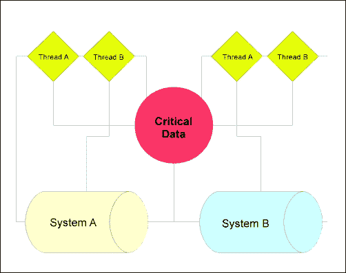
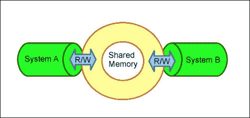
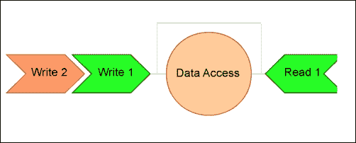
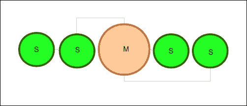
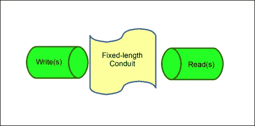
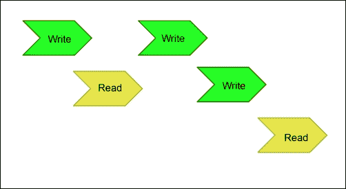

# 第 4 章应用程序中的数据完整性

到目前为止，您应该对 Go 的核心中提供的模型和工具感到满意，这些模型和工具主要提供无竞争的并发性。

我们现在可以轻松地创建 goroutine 和 channels，管理跨通道的基本通信，在没有竞争条件的情况下协调数据，并在出现这种情况时检测它们。

然而，我们既不能管理更大的分布式系统，也不能处理潜在的低级别一致性问题。我们已经使用了一个基本的和简单的互斥，但我们将看到一个更复杂和表达方式处理相互排斥。

到本章结束时，您应该能够使用大量的并发模型和其他语言的系统将上一章中的并发模式扩展到分布式系统。我们还将从更高的层次研究一些一致性模型，您可以利用这些模型进一步表达针对单一源和分布式应用程序的预编码策略。

# 通过互斥和同步进一步深化

在第 2 章第 2 章中，第 3 章了解并发模型 Ty4T.，我们介绍了 AuthT0A.以及如何在代码中调用互斥锁，但是对于包和互斥类型还有一些细微差别。

我们已经提到过在理想情况下，您应该能够通过单独使用 goroutines 在应用程序中保持同步。事实上，最好将其描述为 Go 中的规范方法，尽管`sync`包确实提供了一些其他实用程序，包括互斥锁。

只要有可能，我们将坚持使用 goroutine 和 channels 来管理一致性，但是互斥锁确实提供了一种更传统、更细粒度的方法来锁定和访问数据。如果您曾经管理过另一种并发语言（或一种语言中的包），很可能您有过互斥或哲学模拟的经验。在接下来的章节中，我们将研究扩展和利用互斥体的方法，以完成更多的开箱即用。

如果我们看一下包，就会发现有两种不同的互斥结构。

第一个是`sync.mutex`，我们已经探索过了，但另一个是`RWMutex`。`RWMutex`结构提供了一个多读取器、单写入器锁。如果您希望允许对资源进行读取，但在尝试写入时提供类似于互斥锁的锁，则这些功能非常有用。当您希望函数或子流程执行频繁读取但不频繁写入，但它仍然无法承受脏读取时，可以最好地利用它们。

让我们看一个示例，它每 10 秒更新一次日期/时间（获取锁），但每隔一秒输出一次当前值，如以下代码所示：

```go
package main

import (
  "fmt"
  "sync"
  "time"
)

type TimeStruct struct {
  totalChanges int
  currentTime time.Time
  rwLock sync.RWMutex
}

var TimeElement TimeStruct

func updateTime() {
  TimeElement.rwLock.Lock()
  defer TimeElement.rwLock.Unlock()
  TimeElement.currentTime = time.Now()
  TimeElement.totalChanges++
}

func main() {

  var wg sync.WaitGroup

  TimeElement.totalChanges = 0
  TimeElement.currentTime = time.Now()
  timer := time.NewTicker(1 * time.Second)
  writeTimer := time.NewTicker(10 * time.Second)
  endTimer := make(chan bool)

  wg.Add(1)
  go func() {

    for {
      select {
      case <-timer.C:
        fmt.Println(TimeElement.totalChanges, 
          TimeElement.currentTime.String())
      case <-writeTimer.C:
        updateTime()
      case <-endTimer:
        timer.Stop()
        return
      }

    }

  }()

  wg.Wait()
  fmt.Println(TimeElement.currentTime.String())
}
```

### 注

我们没有在`WaitGroup`结构上显式运行`Done()`，因此这将永久运行。

对`RWMutex`执行锁定/解锁有两种不同的方法：

*   `Lock()`：此将阻止读取和写入变量，直到调用`Unlock()`方法
*   `happenedRlock()`：此仅为读取锁定绑定变量

第二种方法是我们在本例中使用的方法，因为我们想要模拟真实世界的锁。净效应是`interval`函数，该函数输出当前时间，在`rwLock`释放`currentTime`变量上的读取锁之前，该时间将返回一次脏读。`Sleep()`方法的存在仅仅是为了让我们有时间见证锁的运动。`RWLock`结构可以由多个读者或单个编写者获取。

# goroutines 的成本

当你使用 goroutines 时，你可能会发现你正在繁殖数十甚至数百只 goroutines，并怀疑这是否会很昂贵。如果您以前的并发和/或并行编程经验主要是基于线程的，那么这一点尤其正确。人们普遍认为，维护线程及其各自的堆栈可能会使程序陷入性能问题。原因如下：

*   创建线程只需要内存
*   操作系统级别的上下文切换比进程内上下文切换更复杂、更昂贵
*   通常，一个线程是为一个非常小的进程生成的，而这个进程可以通过其他方式处理

正是由于这些原因，许多现代并发语言实现了类似于 goroutines 的东西（C#使用异步和等待机制，Python 有 greenlet/green 线程，等等），它们使用小规模上下文切换来模拟线程。

然而，值得一提的是，尽管 goroutine 比 OS 线程便宜（或者可以便宜），但它们并不是免费的。在很大程度上（也许是巨大的），即使是便宜和轻便的 goroutine 也会影响性能。在我们开始研究分布式系统时，这一点尤其重要，因为分布式系统通常规模更大，速度更快。

当然，直接运行函数和在 goroutine 中运行函数之间的区别可以忽略不计。但是，请记住，Go 的文档说明：

*在同一地址空间中创建数十万个 goroutine 是可行的。*

鉴于堆栈创建在每个 goroutine 中使用了几千字节，在现代环境中，很容易看出这是如何被视为非因素的。但是，当您开始谈论数千（或数百万）个正在运行的 goroutine 时，它可能会影响任何给定子流程或函数的性能。您可以通过将函数包装在任意数量的 goroutine 中，并对平均执行时间和更重要的内存使用情况进行基准测试来测试这一点。在每个 goroutine 大约 5KB 的情况下，您可能会发现内存可能成为一个因素，特别是在低 RAM 机器或实例上。如果您有一个应用程序在一台高性能机器上运行，想象一下它在一台或多台低性能机器上达到临界状态。考虑下面的例子：

```go
for i:= 0; i < 1000000000; i++ {
  go someFunction()
}
```

即使 goroutine 的开销很便宜，但如果有 1 亿个 goroutine 运行，或者我们这里有 10 亿个 goroutine 运行，会发生什么呢？

与往常一样，在使用多个内核的环境中执行此操作实际上会增加此应用程序的开销，这是由于操作系统线程和后续上下文切换的成本造成的。

这些问题几乎总是不可见的，除非应用程序开始扩展。在您的机器上运行是一回事，在分布式系统中大规模运行相当于低功耗的应用服务器是另一回事。

性能和数据一致性之间的关系非常重要，特别是当您开始使用大量具有互斥、锁或通道通信的 goroutine 时。

在处理外部、更永久的内存源时，这将成为一个更大的问题。

# 处理文件

文件是数据一致性问题（如竞争条件）可能导致更持久和灾难性问题的一个很好的例子。让我们看一段代码，它可能会不断尝试更新文件，以查看我们可能在哪里遇到竞争条件，而竞争条件又可能导致更大的问题，例如应用程序失败或丢失数据一致性：

```go
package main

import(
  "fmt"
  "io/ioutil"
  "strconv"
  "sync"
)

func writeFile(i int) {

  rwLock.RLock();
  ioutil.WriteFile("test.txt", 
    []byte(strconv.FormatInt(int64(i),10)), 0x777)
  rwLock.RUnlock();

  writer<-true

}

var writer chan bool
var rwLock sync.RWMutex

func main() {

  writer = make(chan bool)

  for i:=0;i<10;i++ {
    go writeFile(i)
  }

  <-writer
  fmt.Println("Done!")
}
```

涉及文件操作的代码在这类潜在问题上很常见，因为错误是明确的*而不是短暂的*，并且可以永远锁定在时间中。

如果我们的 goroutines 在某个关键点阻塞，或者应用程序中途失败，我们可能会得到一个包含无效数据的文件。在本例中，我们只是对一些数字进行迭代，但您也可以将这种情况应用到涉及数据库或数据存储写入的数据中—可能存在持久性坏数据，而不是临时性坏数据。

这不是一个只能通过渠道或相互排斥来解决的问题；相反，它需要在每一步进行某种健全性检查，以确保数据是您和应用程序在执行过程中每一步所期望的数据。任何涉及`io.Writer`的操作都依赖于原语，Go 的文档明确指出，我们不应该假设它们对于并行执行是安全的。在本例中，我们将文件写入包装在互斥对象中。

# 越来越低–实施 C

在过去的十年或二十年中，语言设计中最有趣的发展之一是希望通过 API 实现低级语言和语言特性。Java 允许您纯粹从外部执行此操作，Python 提供了一个 C 库，用于两种语言之间的交互。值得一提的是，这样做的原因各不相同，其中应用 Go 的并发特性作为遗留 C 代码的包装器，您可能需要处理一些与将非托管代码引入垃圾收集应用程序相关的内存管理。

Go 采用混合方法，允许您通过导入调用 C 接口，这需要前端编译器，如 GCC：

```go
import "C"
```

那么我们为什么要这样做呢？

在项目中直接实现 C 有好的原因，也有坏的原因。一个很好的理由是可以直接访问内联程序集，这可以在 C 中完成，但不能直接在 Go 中完成。一个不好的原因可能是任何在 Golang 本身固有的解决方案。

公平地说，如果您可靠地构建应用程序，即使是一个不好的理由也不坏，但它确实会给可能使用您的代码的任何其他人带来额外的复杂性。如果 Go 能够满足技术和性能要求，那么在单个项目中使用单一语言总是更好的。

C++和 C++中有一个著名的 C++创建者 Bjarne Stroustrup 的引用：

*C 可以很容易地射中自己的脚；C++使它变得更难，但当你这样做时，它会把你的整个腿都吹断。*

撇开玩笑不谈（Stroustrup 收集了大量这样的俏皮话和引语），最基本的理由是 C 语言的复杂性常常阻止人们意外地做一些灾难性的事情。

正如 Stroustrup 所说，C 语言很容易犯大错误，但由于语言设计的原因，其影响往往比高级语言小。处理安全性和稳定性的问题很容易用任何低级语言介绍。

通过简化语言，C++提供了抽象，使低级别操作更容易执行。考虑到 Go 语言在语法上的甜美性和对程序员的友好性，您可以看到这可能如何应用于在 Go 中直接使用 C。

也就是说，使用 C 可以突出内存、指针、死锁和一致性方面的一些潜在缺陷，因此我们将讨论一个简单的示例，如下所示：

```go
package main

// #include <stdio.h>
// #include <string.h>
//  int string_length (char* str) {
//    return strlen(str);
//  }
import "C"
import "fmt"
func main() {
  v := C.CString("Don't Forget My Memory Is Not Visible To Go!")
  x := C.string_length(v)
  fmt.Println("A C function has determined your string 
    is",x,"characters in length")
}
```

## cgo 中的触摸记忆

从前面的例子中最重要的一点是要记住，无论何时进入或退出 C，都需要手动管理内存（或者至少比单独使用 go 更直接）。如果您曾经在 C（或 C++）中工作过，您知道没有自动垃圾收集，所以如果您请求内存空间，您还必须释放它。从 Go 调用 C 并不排除这一点。

## cgo 的结构

正如您在前面的代码中可能注意到的那样，将 C 导入Go 将使您走上一条语法的小路。第一件明显不同的事情是应用程序中 C 代码的实际实现。

直接在`import "C"`指令上方的任何代码（在注释中以阻止 Go 的编译器失败）都将被解释为 C 代码。下面是在 Go 代码上面声明的 C 函数示例：

```go
/*
  int addition(int a, int b) {
    return a + b;
  }
```

请记住，Go 不会验证这一点，所以如果您在 C 代码中出错，可能会导致无声故障。

另一个相关警告是记住语法。虽然 Go 和 C 在语法上有很多重叠，但如果去掉一个大括号或分号，你很可能会发现自己处于一种无声的失败状态。或者，如果您在应用程序的 C 部分工作，并且返回到 go，您无疑会发现自己将循环表达式包装在括号中，并以分号结束行。

另外请记住，您经常需要处理 C 和 Go 之间没有一对一类比的类型转换。例如，C 没有内置的字符串类型（当然，您可以包含其他类型库），因此您可能需要在字符串和字符数组之间进行转换。类似地，`int`和`int64`可能需要一些非隐式转换，同样，您可能无法获得编译这些代码时所期望的调试反馈。

## 相反

在 Go 中使用 C 显然是一个潜在的强大工具，用于代码迁移、实现较低级别的代码和吸引其他开发人员，但反过来呢？正如您可以在 Go 中调用 C 一样，您也可以在嵌入式 C 中调用 Go 函数作为外部函数。

这里的最终目的是能够使用 C 语言并在 C 语言中工作，并在同一个应用程序中运行。到目前为止，处理这个问题最简单的方法是使用 gccgo，它是 GCC 的前端。这与内置的 Go 编译器不同；在没有 gccgo 的情况下，在 C 和 go 之间来回切换是可能的，但是使用它使这个过程更加简单。

**gopart.go**

以下是交互的 Go 部分的代码，C 部分将调用该代码作为外部函数：

```go
package main

func MyGoFunction(num C.int) int {

  squared := num * num
  fmt.Println(num,"squared is",squared)
  return squared
}
```

**cpart.c**

现在，对于 C部分，我们调用 Go 应用程序的导出函数`MyGoFunction`，如下面的代码片段所示：

```go
#include <stdio.h>

extern int square_it(int) __asm__ ("cross.main.MyGoFunction")

int main() {

  int output = square_it(5)
  printf("Output: %d",output)
  return 0;
}
```

**制作文件**

与在 Go 中直接使用 C 不同，目前，进行反向操作需要使用 makefile 进行 C编译。下面是一个可用于从前面的简单示例中获取可执行文件的示例：

```go
all: main

main: cpart.o cpart.c
    gcc cpart.o cpart.c -o main

gopart.o: gopart.go
    gccgo -c gopart.go -o gopart.o -fgo-prefix=cross

clean:
    rm -f main *.o
```

在这里运行 makefile 应该会生成一个可执行文件，从 C 中调用函数。

但是，更基本的是，cgo 允许您直接将函数定义为 C 的外部函数：

```go
package output

import "C"

//export MyGoFunction
func MyGoFunction(num int) int {

  squared := num * num
  return squared
}
```

接下来，您需要直接使用`cgo`工具为 C 生成头文件，如下代码行所示：

```go
go tool cgo goback.go
```

此时，Go 函数可用于 C 应用程序：

```go
#include <stdio.h>
#include "_obj/_cgo_export.h"

extern int MyGoFunction(int num);

int main() {

  int result = MyGoFunction(5);
  printf("Output: %d",result);
  return 0;

}
```

请注意，如果导出一个包含多个返回值的 Go 函数，它将作为 C 中的结构而不是函数可用，因为 C 不提供从函数返回的多个变量。

此时，您可能意识到，此功能的真正威力在于能够直接从现有的 C（甚至 C++）应用程序与 Go 应用程序接口。

虽然不一定是真正的 API，但您现在可以将 Go 应用程序视为 C 应用程序中的链接库，反之亦然。

关于使用`//export`指令的一个警告：如果您这样做，您的 C 代码必须将它们作为外部声明的函数引用。您可能知道，当 C 应用程序需要从另一个链接的 C 文件调用函数时，使用 extern。

当我们以这种方式构建 Go 代码时，cgo 会生成头文件`_cgo_export.h`，正如您前面看到的。如果您想查看该代码，它可以帮助您了解 Go 如何将编译后的应用程序转换为 C 头文件以供此类使用：

```go
/* Created by cgo - DO NOT EDIT. */
#include "_cgo_export.h"

extern void crosscall2(void (*fn)(void *, int), void *, int);

extern void _cgoexp_d133c8d0d35b_MyGoFunction(void *, int);

GoInt64 MyGoFunction(GoInt p0)
{
  struct {
    GoInt p0;
    GoInt64 r0;
  } __attribute__((packed)) a;
  a.p0 = p0;
  crosscall2(_cgoexp_d133c8d0d35b_MyGoFunction, &a, 16);
  return a.r0;
}
```

您还可能会遇到一种罕见的情况，即 C 代码与您期望的不完全一样，并且您无法说服编译器生成您期望的结果。在这种情况下，在编译 C 应用程序之前，您可以随时修改头文件，尽管有`DO NOT EDIT`警告。

### 越来越低–装配在 Go 中

如果你可以用 C 把脚踢开，你可以用 C++来踢掉你的腿，试想一下你可以用汇编来做什么。

不可能在 Go 中直接使用汇编，但由于 Go 提供了对 C 的直接访问，而 C 提供了调用内联汇编的能力，因此您可以在 Go 中间接使用它。

但再次，仅仅因为某事是可能的并不意味着它应该被完成如果你发现你需要在 GO 中装配，你应该考虑直接使用程序集和通过 API 连接。

在（C，然后在）Go 中进行汇编时，可能会遇到许多障碍，其中之一就是缺乏可移植性。编写内联 C 是代码在处理器指令集和操作系统之间相对可转移的一件事，但汇编显然需要很多特殊性。

尽管如此，无论你是否选择投篮，都最好选择射中自己的脚。在考虑是否需要在 Go 应用程序中直接使用 C 或汇编时，请格外小心。如果可以通过 API 或进程间管道在不协调的进程之间进行通信，请始终首先采用该路径。

在 Go 中使用汇编（或单独使用汇编或在 C 中使用汇编）的一个非常明显的缺点是，您将失去 Go 提供的交叉编译功能，因此您必须为每个目标 CPU 体系结构修改代码。由于这个原因，在 C 中使用 Go 的唯一实际时间是当应用程序应该在一个平台上运行时。

下面是一个示例，说明 ASM-in-C-in-Go 应用程序可能是什么样子。请记住，我们没有包含 ASM 代码，因为不同处理器类型的 ASM 代码各不相同。在以下`__asm__`部分中使用一些样板组件进行试验：

```go
package main

/*
#include <stdio.h>

void asmCall() {

__asm__( "" );
    printf("I come from a %s","C function with embedded asm\n");

}
*/
import "C"

func main() {

    C.asmCall()

}
```

如果没有别的，这可能会为深入研究 ASM 提供一条途径，即使您既不熟悉汇编，也不熟悉 C 本身。你认为 C 越高，你就越实用。

对于大多数应用来说，Go（当然还有 C）的级别很低，可以在不着陆的情况下挤出任何性能问题。再次值得注意的是，当调用 C 应用程序时，虽然您确实会在 Go 中失去一些对内存和指针的即时控制，但警告在汇编中适用十倍。Go 提供的所有这些漂亮的工具可能无法可靠地工作，或者根本无法工作。如果你想到 GO 竞赛探测器，考虑下面的应用：

```go
package main

/*
int increment(int i) {
  i++;
  return i;
}
*/
import "C"
import "fmt"

var myNumber int

func main() {
  fmt.Println(myNumber)

  for i:=0;i<100;i++ {
    myNumber = int( C.increment(C.int(myNumber)) )
    fmt.Println(myNumber)
  }

}
```

你可以看到，当你不能从程序中得到你所期望的东西时，在围棋和 C 之间乱扔你的指针可能会让你不知所措。

记住在 cgo 中使用 goroutines 有一个独特的、也许是意想不到的技巧；默认情况下，它们被视为阻塞。这并不是说您不能在 C 中管理并发，但默认情况下不会发生。相反，Go 可能会启动另一个系统线程。通过使用运行时功能`runtime.LockOSThread()`，您可以在一定程度上对其进行管理。使用`LockOSThread`告诉 Go 一个特定的 goroutine 应该留在当前线程中，并且在调用`runtime.UnlockOSThread()`之前，其他并发 goroutine 不能使用该线程。

这在很大程度上取决于直接调用 C 或 C 库的必要性；一些库在创建新线程时会玩得很开心，一些库可能会出错。

### 注

在 Go 代码中，另一个有用的运行时调用是`NumGcoCall()`。这将返回当前进程进行的 cgo 调用数。如果您需要锁定和解锁线程，您还可以使用它来构建内部队列报告，以检测和防止死锁。

如果你选择在 goroutines 中混合搭配 Go 和 C，所有这些都不排除比赛条件的可能性。

当然，C 本身也有一些可用的种族检测器工具。Go 的 race探测器本身基于`ThreadSanitizer`库。不用说，您可能不希望在单个项目中使用多个工具来完成相同的任务。

# 分布式围棋

到目前为止，我们已经讨论了很多关于在单台机器中管理数据的问题，尽管有一个或多个内核。这已经够复杂了。防止竞争条件和死锁可能很难开始，但当您在混合中引入更多机器（虚拟或真实）时会发生什么？

首先应该想到的是，您可以抛弃 Go 提供的许多固有工具，在很大程度上这是正确的。您基本上可以保证 Go 可以在其自身的单一 Goroutine 和通道中处理数据的内部锁定和解锁，但是运行的应用程序的一个或多个附加实例呢？考虑下面的模型：



在这里，我们可以看到，在任意给定点上，这两个进程中的任何一个线程都可以读取或写入**关键数据**。考虑到这一点，需要协调对该数据的访问。

在非常高的层次上，有两种直接的策略来处理这个问题，一种是分布式锁或一致性哈希表（一致性哈希）。

第一种策略是相互排斥的扩展，除了我们不能直接和共享访问相同的地址空间，所以我们需要创建一个抽象。换句话说，我们的工作就是设计一种对所有可用外部实体可见的锁机制。

第二种策略是专门为缓存和缓存验证/失效设计的模式，但它在这里也具有相关性，因为您可以使用它来管理数据在更全局的地址空间中的位置。

然而，当涉及到确保这些系统的一致性时，我们需要比这种一般的、高层次的方法更深入。

将这个模型从中间拆分，就变得容易了：通道将处理数据和数据结构的并发流，如果它们不处理，您可以使用互斥体或低级原子性来添加额外的保护。

但是，请向右看。现在，您有另一个 VM/实例或机器尝试使用相同的数据。我们如何确保不会遇到读写器问题？

# 一些常见的一致性模型

幸运的是，我们可以利用一些非核心 Go 解决方案和策略来提高控制数据一致性的能力。

让我们简要地看一下几个一致性模型，它们可以用来管理分布式系统中的数据。

## 分布式共享存储器

**分布式共享内存**（**DSM**系统本身并不能从本质上防止竞争条件，因为它只是多个系统共享实内存或分区内存的一种方法。

本质上，你可以想象两个拥有 1GB 内存的系统，每个系统将 500MB 分配给一个共享内存空间，每个系统都可以访问和写入。除非明确设计，否则脏读和竞争条件一样是可能的。下图显示了两个系统如何使用共享内存进行协调：



我们将在短期内查看一个丰富但简单的 DSM 示例，并使用一个可用的库进行试驾。

## 先进先出-婴儿车

**流水线 RAM**（**PRAM**一致性是先进先出方法的一种形式，其中数据可以按照排队的写入顺序读取。这意味着任何给定的、单独的进程读取的写操作可能不同。下图代表了这一概念：



## 看主从模式

主从一致性模型类似于我们稍后将要研究的领导者/追随者模型，不同的是，主服务器管理数据和广播的所有操作，而不是从服务器接收写操作。在这种情况下，复制是将数据更改从主机传输到从机的主要方法。在下图中，您将看到一个主服务器和四个从服务器的主从模式表示：



虽然我们可以简单地在 Go 中复制此模型，但我们有更优雅的解决方案。

## 生产者-消费者问题

在经典生产者-消费者问题中，生产者将数据块写入导管/缓冲区，而消费者读取数据块。缓冲区已满时会出现问题：如果生产者添加到堆栈中，则读取的数据将不是您想要的。为了避免这种情况，我们使用了带有等待和信号的通道。此模型看起来有点像下图：



如果您在中寻找 Go 中的信号量实现，则没有明确的信号量用法。然而，想想这里的语言，固定大小的频道，有等待和信号；听起来像是一个缓冲通道。事实上，通过在 Go 中提供缓冲通道，您可以在这里为导管指定一个明确的长度；通道机制为您提供等待和信号的通信。这被合并到 Go 的并发模型中。让我们快速看一看生产者-消费者模型，如下代码所示：

```go
package main

import(
  "fmt"
)

var comm = make(chan bool)
var done = make(chan bool)

func producer() {
  for i:=0; i< 10; i++ {
    comm <- true
  }
  done <- true
}
func consumer() {
  for {
    communication := <-comm
    fmt.Println("Communication from producer 
      received!",communication)
  }
}

func main() {
  go producer()
  go consumer()
  <- done
  fmt.Println("All Done!")
}
```

## 看主从模型

在先导/跟随者模型中，写入从单个源广播到任何跟随者。写入操作可以通过任意个跟随器传递，也可以限制为单个跟随器。所有完成的写入操作都会广播给跟随者。这可以直观地表示为下图：


我们也可以在 Go 中看到一个通道模拟。我们可以，而且已经利用单一频道处理与其他追随者之间的广播。

## 原子一致性/互斥性

我们已经对原子一致性做了很多研究。它确保了任何不在本质上同时创建和使用的内容都需要序列化以保证最强大的一致性。如果一个值或数据集本质上不是原子的，我们总是可以使用互斥来强制对该数据进行线性化。

串行或顺序一致性本质上很强，但也可能导致性能问题和并发性降低。

原子一致性通常被认为是确保一致性的最有力形式。

## 释放一致性

版本一致性模型是 DSM 的一个变体，它可以将写操作的修改延迟到首次从读卡器获取时。这就是所谓的延迟发布一致性。我们可以在以下序列化模型中可视化延迟发布一致性：



此模型以及渴望发布一致性模型都需要在满足某些条件时发布发布（顾名思义）。在渴望模型中，该条件要求所有读取进程以一致的方式读取写入。

在围棋中，有可供选择，但如果你有兴趣玩的话，也有软件包。

# 使用 memcached

如果您不熟悉 memcache（d），那么它是跨分布式系统管理数据的一种非常好而且似乎显而易见的方法。Go 的内置通道和 Goroutine 非常适合在一台机器的进程中管理通信和数据完整性，但它们都不是为现成的分布式系统而构建的。

顾名思义，Memcached 允许在多个实例或机器之间共享内存。最初，memcached 旨在存储数据以供快速检索。这对于缓存具有高周转率的系统（如 web 应用程序）的数据非常有用，但它也是跨多个服务器轻松共享数据和/或利用共享锁定机制的好方法。

在我们早期的模型中，memcached 属于 DSM。所有可用和调用的实例在各自的内存中共享一个公共镜像内存空间。

值得指出的是，在 memcached 中，竞争条件可以而且确实存在，而您仍然需要一种方法来处理这种情况。Memcached 提供了一种跨分布式系统共享数据的方法，但不能保证数据的原子性。相反，memcached 使用以下两种方法之一使缓存数据无效：

*   数据被显式地分配了一个最大年限（在此之后，它将从堆栈中删除）
*   或者，由于更新的数据正在使用所有可用内存，数据被从堆栈中推出

需要注意的是，memcache（d）中的存储显然是短暂的，不能抵抗故障，因此它应该只在数据应该在没有严重应用程序故障威胁的情况下传递的地方使用。

在满足上述任一条件时，数据将消失，对该数据的下一次调用将失败，这意味着需要重新生成数据。当然，您可以使用一些复杂的锁生成方法使 memcached 以一致的方式运行，尽管这不是 memcached 本身的标准内置功能。让我们来看一个使用 Brad Fitz 的 gomemcache 接口（[在 Go 中使用 memcached 的快速示例 https://github.com/bradfitz/gomemcache](https://github.com/bradfitz/gomemcache) ：

```go
package main

import (
  "github.com/bradfitz/gomemcache/memcache"
  "fmt"
)

func main() {
     mC := memcache.New("10.0.0.1:11211", "10.0.0.2:11211", 
       "10.0.0.3:11211", "10.0.0.4:11211")
     mC.Set(&memcache.Item{Key: "data", Value: []byte("30") })

     dataItem, err := mc.Get("data")
}
```

正如您可能从前面的示例中注意到的，如果这些 memcached 客户机中的任何一个同时写入共享内存，则竞争条件可能仍然存在。

密钥数据可以存在于连接了 memcached 并同时运行的任何客户端上。

任何客户端也可以随时取消设置或覆盖数据。

与许多实现不同，您可以通过 memcached 设置一些更复杂的类型，例如结构，假设它们是序列化的。这个警告意味着，我们可以直接共享的数据在某种程度上受到限制。显然，我们无法使用指针，因为内存位置会因客户机而异。

处理数据一致性的一个方法是设计一个主从系统，其中只有一个节点负责写入，其他客户端通过密钥的存在监听更改。

我们可以利用前面提到的任何其他模型来严格管理对该数据的锁定，尽管它可能变得特别复杂。在下一章中，我们将探讨一些构建分布式互斥系统的方法，但现在，我们将简要介绍另一种选择。

## 电路

Petar Maymounkov 的 Go’circuit 是最近出现的一个处理分布式并发的有趣的第三方库。Go’circuit 试图通过分配信道来监听一个或多个远程 GoRouting，从而促进分布式协同路由。

Go’circuit 最酷的部分是，只需包含该包，您的应用程序就可以监听和操作远程 Goroutine，并与它们关联的通道一起工作。

Tumblr 正在使用 Go’circuit，这证明了它作为大规模和相对成熟的解决方案平台具有一定的可行性。

### 注

Go'电路可在[找到 https://github.com/gocircuit/circuit](https://github.com/gocircuit/circuit) 。

安装 Go’circuit 并不简单，您无法在其上运行简单的`go get`，需要 Apache Zookeeper 并从头开始构建工具包。

一旦完成，让两台机器（如果在本地运行，则两个进程）运行 Go 代码来共享一个通道就相对简单了。与 goroutines 一样，这个系统中的每个 cog 都属于发送方或侦听方类别。鉴于我们在这里讨论的是网络资源，语法中有一些小的修改：

```go
homeChannel := make(chan bool)

circuit.Spawn("etphonehome.example.com",func() {
  homeChannel <- true
})

for {
  select {
    case response := <- homeChannel:
      fmt.Print("E.T. has phoned home with:",response)

  }
}
```

您可以看到，这可能会使使用相同数据的不同机器之间的通信更加干净，而我们主要使用 memcached 作为网络内存锁定系统。我们在这里直接处理原生 Go 代码；我们能够像在通道中一样使用电路，而不用担心引入新的数据管理或原子性问题。事实上，电路是建立在 goroutine 本身的基础上的。

当然，这仍然会带来一些额外的管理问题，主要是因为它涉及到了解哪些远程机器在那里，它们是否处于活动状态，更新机器的状态，等等。这些类型的问题最适合 ApacheZooKeeper 之类的套件来处理分布式资源的协调。值得注意的是，您应该能够从远程机器向主机产生一些反馈：电路通过无密码 SSH 运行。

这也意味着您可能需要确保用户权限已锁定，并且符合您可能制定的任何安全策略。

### 注

您可以在[找到 Apache Zookeeperhttp://zookeeper.apache.org/](http://zookeeper.apache.org/) 。

# 总结

现在配备了一些方法和模型，不仅可以跨单线程或多线程系统管理本地数据，还可以跨分布式系统管理本地数据，您应该开始对在并发和并行进程中保护数据的有效性感到非常满意。

我们已经研究了读锁和读/写锁的两种互斥形式，并开始将它们应用于分布式系统，以防止多个网络系统之间出现阻塞和争用情况。

在下一章中，我们将更深入地探讨这些排除和数据一致性概念，构建无阻塞的网络应用程序，学习处理超时，并更深入地了解通道并行性。

我们还将深入研究 sync 和 OS 包，特别是`sync.atomic`操作。