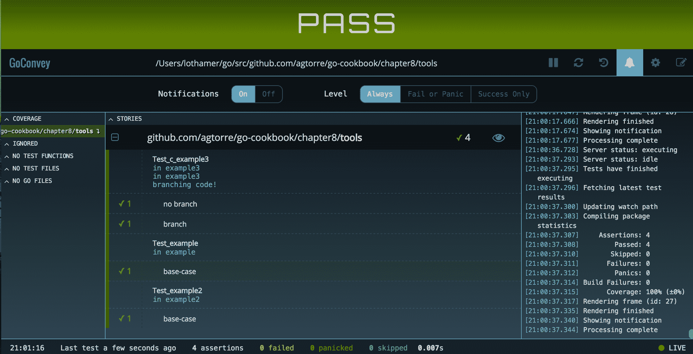

# 测试

在本章中，我们将介绍以下配方：

*   使用标准库进行模拟
*   使用 Mockgen 包
*   使用表驱动测试提高覆盖率
*   使用第三方测试工具
*   实用模糊
*   使用 Go 进行行为测试

# 介绍

本章与前几章不同；这将侧重于测试和测试方法。Go 提供了非常好的开箱即用的测试支持，但是，从更动态的语言中很难理解，因为在这些语言中，monkey 补丁和 mock 相对简单。

Go 测试鼓励为您的代码提供特定的结构，特别是，测试和模拟接口非常简单，并且得到了很好的支持。某些类型的代码可能更难测试。例如，测试使用包级全局变量、未抽象为接口的位置以及具有非导出变量或方法的结构的代码可能很困难。本章将分享一些测试 Go 代码的方法。

# 使用标准库进行模拟

在 Go 中，模拟通常意味着使用测试版本实现一个接口，该测试版本允许您通过测试控制运行时行为。它还可能涉及模拟函数和方法，为此，我们将在此配方中探索另一个技巧。此技巧使用在[定义的`Patch`和`Restore`函数 https://play.golang.org/p/oLF1XnRX3C](https://play.golang.org/p/oLF1XnRX3C) 。

一般来说，最好是编写代码，这样您就可以频繁使用接口，并且代码是在小的可测试块中。包含大量分支条件或深度嵌套逻辑的代码可能很难测试，并且测试最终往往更脆弱。这是因为开发人员需要在测试中跟踪更多的模拟对象、补丁、返回值和状态。

# 准备

根据以下步骤配置您的环境：

1.  从[下载并安装 Go-on 操作系统 https://golang.org/doc/install](https://golang.org/doc/install) 并配置您的`GOPATH`环境变量。
2.  打开终端/控制台应用程序。
3.  导航到您的`GOPATH/src`并创建一个项目目录，例如`$GOPATH/src/github.com/yourusername/customrepo`。

所有代码都将从此目录运行和修改。

4.  或者，使用`go get github.com/agtorre/go-cookbook/`命令安装最新测试版本的代码。

# 怎么做。。。

这些步骤包括编写和运行应用程序：

1.  从终端/控制台应用程序中，创建`chapter8/mocking`目录并导航到它。
2.  从[复制测试 https://github.com/agtorre/go-cookbook/tree/master/chapter8/mocking](https://github.com/agtorre/go-cookbook/tree/master/chapter8/mocking) 或者将此作为练习来编写您自己的代码。

3.  创建一个名为`mock.go`的文件，其内容如下：

```go
        package mocking

        // DoStuffer is a simple interface
        type DoStuffer interface {
            DoStuff(input string) error
        }

```

4.  创建一个名为`patch.go`的文件，其内容如下：

```go
        package mocking

        import "reflect"

        // Restorer holds a function that can be used
        // to restore some previous state.
        type Restorer func()

        // Restore restores some previous state.
        func (r Restorer) Restore() {
            r()
        }

        // Patch sets the value pointed to by the given destination to 
        // the given value, and returns a function to restore it to its 
        // original value. The value must be assignable to the element 
        //type of the destination.
        func Patch(dest, value interface{}) Restorer {
            destv := reflect.ValueOf(dest).Elem()
            oldv := reflect.New(destv.Type()).Elem()
            oldv.Set(destv)
            valuev := reflect.ValueOf(value)
            if !valuev.IsValid() {
                // This isn't quite right when the destination type is 
                // not nilable, but it's better than the complex 
                // alternative.
                valuev = reflect.Zero(destv.Type())
            }
            destv.Set(valuev)
            return func() {
                destv.Set(oldv)
            }
        }

```

5.  创建一个名为`exec.go`的文件，其内容如下：

```go
        package mocking

        import "errors"

        var ThrowError = func() error {
            return errors.New("always fails")
        }

        func DoSomeStuff(d DoStuffer) error {

            if err := d.DoStuff("test"); err != nil {
                return err
            }

            if err := ThrowError(); err != nil {
                return err
            }

            return nil
        }

```

6.  创建一个名为`mock_test.go`的文件，其内容如下：

```go
        package mocking

        type MockDoStuffer struct {
            // closure to assist with mocking
            MockDoStuff func(input string) error
        }

        func (m *MockDoStuffer) DoStuff(input string) error {
            if m.MockDoStuff != nil {
                return m.MockDoStuff(input)
            }
            // if we don't mock, return a common case
            return nil
        }

```

7.  创建一个名为`exec_test.go`的文件，其内容如下：

```go
        package mocking

        import (
            "errors"
            "testing"
        )

        func TestDoSomeStuff(t *testing.T) {
            tests := []struct {
                name       string
                DoStuff    error
                ThrowError error
                wantErr    bool
            }{
                {"base-case", nil, nil, false},
                {"DoStuff error", errors.New("failed"), nil, true},
                {"ThrowError error", nil, errors.New("failed"), true},
            }
            for _, tt := range tests {
                t.Run(tt.name, func(t *testing.T) {
                    // An example of mocking an interface
                    // with our mock struct
                    d := MockDoStuffer{}
                    d.MockDoStuff = func(string) error {
                    return tt.DoStuff }

                   // mocking a function that is declared as a variable
                   // will not work for func A(),
                   // must be var A = func()
                   defer Patch(&ThrowError, func() error { return 
                   tt.ThrowError }).Restore()

                  if err := DoSomeStuff(&d); (err != nil) != tt.wantErr 
                  {
                      t.Errorf("DoSomeStuff() error = %v, 
                      wantErr %v", err, tt.wantErr)
                  }
                })
            }
        }

```

8.  填写剩余功能的测试，上一个目录运行`go test`。确保所有测试均通过：

```go
 $go test
 PASS
 ok github.com/agtorre/go-cookbook/chapter8/mocking 0.006s

```

# 它是如何工作的。。。

此配方演示如何模拟已声明为变量的接口和函数。还有一些库可以直接在声明的函数上模拟此修补程序/恢复，但它们绕过了许多 Go 的类型安全性来完成这一壮举。如果需要从外部软件包修补函数，可以使用以下技巧：

```go
// whatever package you wanna patch
import "github.com/package" 

// this is patchable using the method described in this recipe
var packageDoSomething = package.DoSomething

```

对于这个配方，我们首先设置测试并使用表驱动测试。有很多关于这项技术的文献，我建议进一步探索。一旦设置了测试，我们就为模拟函数选择输出。为了模拟我们的接口，我们的模拟对象定义了可以在运行时重写的闭包。补丁/恢复技术用于更改全局函数，并在每次循环后恢复它。这要归功于`t.Run`，它为测试的每个循环设置了一个新函数。

# 使用 Mockgen 包

前面的示例使用了我们的自定义模拟对象。当您使用大量接口时，编写这些接口可能会变得繁琐且容易出错。在这里，生成代码非常有意义。幸运的是，有一个名为`github.com/golang/mock/gomock`的包，它提供了一代模拟对象，并为我们提供了一个非常有用的库，用于接口测试。

本食谱将探讨`gomock`的一些功能，并将涵盖在何处、何时以及如何使用和生成模拟对象方面的权衡。

# 准备

根据以下步骤配置您的环境：

1.  参考本章标准库配方*模拟的*准备*部分。*
2.  运行`go get github.com/golang/mock/`命令。

# 怎么做。。。

这些步骤包括编写和运行应用程序：

1.  从终端/控制台应用程序中，创建`chapter8/mockgen`目录并导航到它。
2.  从[复制测试 https://github.com/agtorre/go-cookbook/tree/master/chapter8/mockgen](https://github.com/agtorre/go-cookbook/tree/master/chapter8/mockgen) 或者将此作为练习，写一些你自己的。
3.  创建一个名为`interface.go`的文件，其内容如下：

```go
        package mockgen

        // GetSetter implements get a set of a
        // key value pair
        type GetSetter interface {
            Set(key, val string) error
            Get(key string) (string, error)
        }

```

4.  创建一个名为`internal`的目录。
5.  运行`mockgen -destination internal/mocks.go -package internal github.com/agtorre/go-cookbook/chapter8/mockgen GetSetter`命令：
    *   确保用本地版本替换包路径。
    *   这将创建一个名为`internal/mocks.go`的文件。
6.  创建一个名为`exec.go`的文件，其内容如下：

```go
        package mockgen

        // Controller is a struct demonstrating
        // one way to initialize interfaces
        type Controller struct {
            GetSetter
        }

        // GetThenSet checks if a value is set. If not
        // it sets it.
        func (c *Controller) GetThenSet(key, value string) error {
            val, err := c.Get(key)
            if err != nil {
                return err
            }

            if val != value {
                return c.Set(key, value)
            }
            return nil
        }

```

7.  创建一个名为`interface_test.go`的文件，其内容如下：

```go
        package mockgen

        import (
            "errors"
            "testing"

            "github.com/agtorre/go-cookbook/chapter8/mockgen/internal"
            "github.com/golang/mock/gomock"
        )

        func TestExample(t *testing.T) {
            ctrl := gomock.NewController(t)
            defer ctrl.Finish()

            mockGetSetter := internal.NewMockGetSetter(ctrl)

            var k string
            mockGetSetter.EXPECT().Get("we can put anything 
            here!").Do(func(key string) {
                k = key
            }).Return("", nil)

            customError := errors.New("failed this time")

            mockGetSetter.EXPECT().Get(gomock.Any()).Return("", 
            customError)

            if _, err := mockGetSetter.Get("we can put anything 
            here!"); err != nil {
                t.Errorf("got %#v; want %#v", err, nil)
            }
            if k != "we can put anything here!" {
                t.Errorf("bad key")
            }

            if _, err := mockGetSetter.Get("key"); err == nil {
                t.Errorf("got %#v; want %#v", err, customError)
            }
        }

```

8.  创建一个名为`exec_test.go`的文件，其内容如下：

```go
        package mockgen

        import (
            "errors"
            "testing"

            "github.com/agtorre/go-cookbook/chapter8/mockgen/internal"
            "github.com/golang/mock/gomock"
        )

        func TestController_Set(t *testing.T) {
            tests := []struct {
                name string
                getReturnVal string
                getReturnErr error
                setReturnErr error
                wantErr bool
            }{
                {"get error", "value", errors.New("failed"), nil, 
                true},
                {"value match", "value", nil, nil, false},
                {"no errors", "not set", nil, nil, false},
                {"set error", "not set", nil, errors.New("failed"),
                true},
            }
            for _, tt := range tests {
                t.Run(tt.name, func(t *testing.T) {
                    ctrl := gomock.NewController(t)
                    defer ctrl.Finish()

                    mockGetSetter := internal.NewMockGetSetter(ctrl)
                    mockGetSetter.EXPECT().Get("key").AnyTimes()
                    .Return(tt.getReturnVal, tt.getReturnErr)
                    mockGetSetter.EXPECT().Set("key", 
                    gomock.Any()).AnyTimes().Return(tt.setReturnErr)

                    c := &Controller{
                        GetSetter: mockGetSetter,
                    }
                    if err := c.GetThenSet("key", "value"); (err != 
                    nil) != tt.wantErr {
                        t.Errorf("Controller.Set() error = %v, wantErr 
                        %v", err, tt.wantErr)
                    }
                })
             }
        }

```

9.  填写剩余功能的测试，上一个目录，运行`go test`。确保所有测试都通过。

# 它是如何工作的。。。

生成的模拟对象允许测试指定预期的参数、调用函数的次数和返回的内容，并允许我们设置其他工件，例如，如果原始函数具有类似的工作流，我们可以直接写入通道。`interface_test.go`文件展示了一些使用模拟对象同时在线调用它们的示例。通常，测试看起来更像`exec_test.go`，我们希望截获由实际代码执行的接口函数调用，并在测试时更改它们的行为。

`exec_test.go`文件还展示了如何在表驱动的测试环境中使用模拟对象。`Any()`函数意味着模拟函数可以被调用零次或多次，这对于代码提前终止的情况非常好。

本配方中演示的最后一个技巧是将模拟对象粘贴到`internal`包中。当您需要模拟在自己的包之外的包中声明的函数时，这非常有用。这允许在`non _test.go`文件中定义这些方法，但不允许将它们导出到库的用户。通常，使用与您当前编写的测试相同的包名将模拟对象粘贴到`_test.go`文件中更容易。

# 使用表驱动测试提高覆盖率

此配方将演示编写表驱动测试、收集测试覆盖率并改进它的过程。它还将利用`github.com/cweill/gotests`包生成测试。如果您已经下载了其他章节的测试代码，这些应该看起来非常熟悉。结合使用此配方和前两种配方，您应该能够通过一些工作在所有情况下实现 100%的测试覆盖率。

# 准备

根据以下步骤配置您的环境：

1.  参考本章标准库配方*模拟的*准备*部分。*
2.  运行`go get github.com/cweill/gotests/`命令。

# 怎么做。。。

这些步骤包括编写和运行应用程序：

1.  从终端/控制台应用程序中，创建`chapter8/coverage`目录并导航到它。
2.  从[复制测试 https://github.com/agtorre/go-cookbook/tree/master/chapter8/coverage](https://github.com/agtorre/go-cookbook/tree/master/chapter8/coverage) 或者将此作为练习来编写您自己的代码。
3.  创建一个名为`coverage.go`的文件，其内容如下：

```go
        package main

        import "errors"

        // Coverage is a simple function with some branching conditions
        func Coverage(condition bool) error {
            if condition {
                return errors.New("condition was set")
            }
            return nil
        }

```

4.  运行`gotests -all -w`命令。
5.  这将生成一个名为`coverage_test.go`的文件，其内容如下：

```go
        package main

        import "testing"

        func TestCoverage(t *testing.T) {
            type args struct {
                condition bool
            }
            tests := []struct {
                name string
                args args
                wantErr bool
            }{
                // TODO: Add test cases.
            }
            for _, tt := range tests {
                t.Run(tt.name, func(t *testing.T) {
                    if err := Coverage(tt.args.condition); (err != nil) 
                    != tt.wantErr {
                        t.Errorf("Coverage() error = %v, wantErr %v", 
                        err, tt.wantErr)
                    }
                })
            }
        }

```

6.  在`TODO`部分填写以下内容：

```go
        {"no condition", args{true}, true},

```

7.  运行`go test -cover`命令，您将看到以下输出：

```go
 go test -cover 
 PASS
 coverage: 66.7% of statements
 ok github.com/agtorre/go-cookbook/chapter8/coverage 0.007s

```

8.  在`TODO`部分添加另一项：

```go
        {"condition", args{false}, false},

```

9.  运行`go test -cover`命令，您将看到以下输出：

```go
 go test -cover 
 PASS
 coverage: 100.0% of statements
 ok github.com/agtorre/go-cookbook/chapter8/coverage 0.007s

```

10.  运行以下命令：

```go
 go test -coverprofile=cover.out 
 go tool cover -html=cover.out -o coverage.html

```

11.  在浏览器中打开`coverage.html`文件以查看图形覆盖率报告。

# 它是如何工作的。。。

`go test -cover`命令附带了一个基本的 Go 安装。它可用于收集 Go 应用程序的覆盖率报告。此外，它还能够输出覆盖率指标和 HTML 覆盖率报告。此工具通常由其他工具包装，这将在下一个配方中介绍。这些表驱动测试样式在[中有介绍 https://github.com/golang/go/wiki/TableDrivenTests](https://github.com/golang/go/wiki/TableDrivenTests) 和是一种很好的方法，可以在不编写大量额外代码的情况下进行干净的测试。

这个方法首先自动生成测试代码，然后根据需要填写测试用例，以帮助创建更多的覆盖率。只有在调用非变量函数或方法时，这一点才特别棘手。例如，让`gob.Encode()`返回一个错误以增加测试覆盖率可能会很棘手。使用本章标准库配方的*模拟中描述的方法，并使用`var gobEncode = gob.Encode`允许修补，这似乎也很奇怪。因此，很难鼓吹 100%的测试覆盖率，转而主张广泛地测试外部接口，也就是说，测试输入和输出的许多变化。在某些情况下，正如我们将在本章的*使用 Go*方法的行为测试中看到的，模糊化可能会变得有用。*

# 使用第三方测试工具

Go 测试有很多有用的工具。可以更容易地了解每个函数级别的代码覆盖率的工具，可以进行断言以减少代码测试行的工具，以及测试运行程序。本配方将涵盖`github.com/axw/gocov`和`github.com/smartystreets/goconvey`包，以演示部分功能。根据您的需要，还有许多其他值得注意的测试框架。`github.com/smartystreets/goconvey`包支持这两种断言，并且是一个测试运行程序。过去，在 Go 1.7 之前标记子测试是最干净的方法。

# 准备

根据以下步骤配置您的环境：

1.  使用本章标准库
    配方，参考*模拟的*准备*部分。*
2.  运行`go get github.com/axw/gocov`命令。
3.  运行`go get github.com/smartystreets/goconvey/`命令。

# 怎么做。。。

这些步骤包括编写和运行应用程序：

1.  从终端/控制台应用程序中，创建`chapter8/tools`目录并导航到它。
2.  从[复制测试 https://github.com/agtorre/go-cookbook/tree/master/chapter8/tools](https://github.com/agtorre/go-cookbook/tree/master/chapter8/tools) 或者将此作为练习来编写您自己的代码。
3.  创建一个名为`funcs.go`的文件，其内容如下：

```go
        package tools

        import (
            "fmt"
        )

        func example() error {
            fmt.Println("in example")
            return nil
        }

        var example2 = func() int {
            fmt.Println("in example2")
            return 10
        }

```

4.  创建一个名为`structs.go`的文件，其内容如下：

```go
        package tools

        import (
            "errors"
            "fmt"
        )

        type c struct {
            Branch bool
        }

        func (c *c) example3() error {
            fmt.Println("in example3")
            if c.Branch {
                fmt.Println("branching code!")
                return errors.New("bad branch")
            }
            return nil
        }

```

5.  创建一个名为`funcs_test.go`的文件，其内容如下：

```go
        package tools

        import (
            "testing"

            . "github.com/smartystreets/goconvey/convey"
        )

        func Test_example(t *testing.T) {
            tests := []struct {
                name string
            }{
                {"base-case"},
            }
            for _, tt := range tests {
                Convey(tt.name, t, func() {
                    res := example()
                    So(res, ShouldBeNil)
                })
            }
        }

        func Test_example2(t *testing.T) {
            tests := []struct {
                name string
            }{
                {"base-case"},
            }
            for _, tt := range tests {
                Convey(tt.name, t, func() {
                    res := example2()
                    So(res, ShouldBeGreaterThanOrEqualTo, 1)
                })
            }
        }

```

6.  创建一个名为`structs_test.go`的文件，其内容如下：

```go
        package tools

        import (
            "testing"

            . "github.com/smartystreets/goconvey/convey"
        )

        func Test_c_example3(t *testing.T) {
            type fields struct {
                Branch bool
            }
            tests := []struct {
                name string
                fields fields
                wantErr bool
            }{
                {"no branch", fields{false}, false},
                {"branch", fields{true}, true},
            }
            for _, tt := range tests {
                Convey(tt.name, t, func() {
                    c := &c{
                        Branch: tt.fields.Branch,
                    }
                    So((c.example3() != nil), ShouldEqual, tt.wantErr)
                })
            }
        }

```

7.  运行`gocov test | gocov report`命令，您将看到以下输出：

```go
 $ gocov test | gocov report
 ok github.com/agtorre/go-cookbook/chapter8/tools 0.006s 
      coverage: 100.0% of statements

 github.com/agtorre/go-cookbook/chapter8/tools/struct.go 
      c.example3 100.00% (5/5)
 github.com/agtorre/go-cookbook/chapter8/tools/funcs.go example 
      100.00% (2/2)
 github.com/agtorre/go-cookbook/chapter8/tools/funcs.go @12:16 
      100.00% (2/2)
 github.com/agtorre/go-cookbook/chapter8/tools ---------- 
      100.00% (9/9)

 Total Coverage: 100.00% (9/9)

```

8.  运行`goconvey`命令，它将打开一个浏览器，如下所示：



9.  确保所有测试都通过。

# 它是如何工作的。。。

此配方演示如何将`goconvey`命令连接到测试中。`Convey`关键字基本上取代了`t.Run`并在`goconvey`web UI 中添加了额外的标签，但其行为略有不同。如果有嵌套的传送块，则它们总是按顺序重新执行，即如下所示：

```go
Convey("Outer loop", t, func(){
    a := 1
    Convey("Inner loop", t, func() {
        a = 2
    })
    Convey ("Inner loop2", t, func(){
        fmt.Println(a)
     })
})

```

前面的代码使用`goconvey`命令打印`1`。如果我们使用内置的`t.Run`，它会打印`2`。换句话说，Go`t.Run`测试是按顺序运行的，从不重复。这种行为对于将设置代码放在外部块中很有用，但是如果必须同时使用这两个块，记住这种区别是很重要的。

当使用 Transfer 断言时，在 UI 和其他统计信息中有一个成功的复选标记。它还可以将 if 检查的大小减少到一行，甚至可以创建自定义断言。

如果您关闭`goconvey`web 界面并打开通知，则在保存代码时，测试将自动运行，您将收到覆盖率增加或减少以及构建失败时的通知。

所有三个工具断言、测试运行器和 web UI 都可以单独使用，也可以一起使用。

当致力于更高的测试覆盖率时，`gocov`工具可能很有用。它可以快速识别缺少覆盖范围的功能，并帮助您深入了解覆盖范围报告。此外，`gocov`可用于生成备用 HTML 报告，该报告通过使用`github.com/matm/gocov-html`包随 Go 代码一起提供。

# 实用模糊

本食谱将探讨模糊化以及如何使用模糊化来帮助验证函数。在[第 3 章](03.html)、*数据转换和组合*的*货币转换和浮动 64 注意事项*配方中，我们创建了一个函数，该函数将十进制美元货币作为字符串，并返回表示美分的 int64 版本。我们将修改该函数，并演示如何使用模糊查找恐慌。

# 准备

根据以下步骤配置您的环境：

1.  参考本章标准库配方*模拟的*准备*部分。*
2.  运行`go get github.com/dvyukov/go-fuzz/go-fuzz`命令。
3.  运行`go get github.com/dvyukov/go-fuzz/go-fuzz-build`命令。

# 怎么做。。。

这些步骤包括编写和运行应用程序：

1.  从终端/控制台应用程序中，创建`chapter8/fuzz`目录并导航到它。
2.  从[复制测试 https://github.com/agtorre/go-cookbook/tree/master/chapter8/fuzz](https://github.com/agtorre/go-cookbook/tree/master/chapter8/fuzz) 或者将此作为练习来编写您自己的代码。
3.  创建一个名为`dollars.go`的文件，其内容如下：

```go
        package fuzz

        import (
            "errors"
            "strconv"
            "strings"
        )

        // ConvertStringDollarsToPennies takes a dollar amount
        // as a string, i.e. 1.00, 55.12 etc and converts it
        // into an int64
        func ConvertStringDollarsToPennies(amount string) (int64, 
        error) {
            // check if amount can convert to a valid float
            val, err := strconv.ParseFloat(amount, 64)
            if err != nil {
                return 0, err
            }

            if val > 1000 && val < 1100 {
                panic("invalid range")
            }

            // split the value on "."
            groups := strings.Split(amount, ".")

            // if there is no . result will still be
            // captured here
            result := groups[0]

            // base string
            r := ""

            // handle the data after the "."
            if len(groups) == 2 {
                if len(groups[1]) != 2 {
                    return 0, errors.New("invalid cents")
                }
                r = groups[1]
                if len(r) > 2 {
                    r = r[:2]
                }
            }

            // pad with 0, this will be
            // 2 0's if there was no .
            for len(r) < 2 {
                r += "0"
            }

            result += r

            // convert it to an int
            return strconv.ParseInt(result, 10, 64)
        }

```

4.  创建一个名为`fuzz.go`的文件，其内容如下：

```go
        package fuzz

        // Fuzz is the interface required to use gofuzz
        func Fuzz(data []byte) int {
            amount := string(data)

            _, err := ConvertStringDollarsToPennies(amount)
            if err != nil {
                return 0
            }
            return 1
        }

```

5.  运行`go-fuzz-build github.com/agtorre/go-cookbook/chapter8/fuzz`命令或更改路径以匹配您自己的代码。
6.  运行以下命令：

```go
 mkdir -p output/corpus

 echo "0.01" > output/corpus/a
 echo "-0.01" > output/corpus/b
 echo "0.10" > output/corpus/c
 echo "1.00" > output/corpus/d
 echo "-1.00" > output/corpus/e
 echo "1.11" > output/corpus/f
 echo "1" > output/corpus/g
 echo "2" > output/corpus/h
 echo "999.99" > output/corpus/i

```

7.  运行`go-fuzz -bin=./fuzz-fuzz.zip -workdir=output`命令，您将看到以下输出：

```go
 go-fuzz -bin=./fuzz-fuzz.zip -workdir=output

 .
 .
 .
 2017/04/02 10:58:43 slaves: 4, corpus: 91 (11s ago), crashers: 
      1, restarts: 1/7064, execs: 204856 (13630/sec), cover: 453, 
      uptime: 15s
 2017/04/02 10:58:46 slaves: 4, corpus: 91 (14s ago), crashers: 
      1, restarts: 1/7244, execs: 253555 (14086/sec), cover: 453, 
      uptime: 18s

```

8.  运行几次迭代后，按*Ctrl*+*C*退出。
9.  填写剩余功能的测试，上一个目录，运行`go test`。确保所有测试都通过。

# 它是如何工作的。。。

`github.com/dvyukov/go-fuzz`包使用进化算法构建输入语料库，以测试 Go 代码。在我们的案例中，我们引入了故意恐慌，以演示在发现碰撞时的行为。模糊化是发现意外恐慌的一种实用方法，尤其是在处理数组边界或任意输入的编程时。

对应用程序进行模糊化时，最困难的部分之一是编写适当的模糊函数。`go-fuzz`应用程序将根据此功能的响应进行调整。如果 fuzz 函数返回`1`，则认为输入成功。如果返回`-1`，则该项目不包含在语料库中；如果返回`0`，则该项目的优先级较低。我们可以将步骤 4 中的 fuzz 函数更改为返回`-1`而不是`0`，以便找到被接受但可能不是预期的有趣输入。例如，`+1`是此功能的可能输入。

我们还通过向语料库推荐一些项目来帮助模糊者。这些项目取自我们的单元测试，代表已知的良好值。这对于帮助模糊收敛到相关输入非常重要，例如，如果您的函数将一系列整数作为输入，那么测试非整数输入可能需要很多时间。

# 使用 Go 进行行为测试

行为测试或集成测试是执行端到端黑盒测试的好方法。这类测试的一个流行框架是 cucumber（[https://cucumber.io/](https://cucumber.io/) ），它使用小黄瓜语言用英语描述测试步骤，然后用代码实现这些步骤。Go 也有一个黄瓜图书馆（`github.com/DATA-DOG/godog`。本食谱将探索使用`godog`包编写行为测试。

# 准备

根据以下步骤配置您的环境：

1.  使用本章标准库
    配方，参考*模拟的*准备*部分。*
2.  运行`go get github.com/DATA-DOG/godog`命令。
3.  运行`go get github.com/DATA-DOG/godog/cmd/godog`命令。

# 怎么做。。。

这些步骤包括编写和运行应用程序：

1.  从终端/控制台应用程序中，创建`chapter8/bdd`目录并导航到它。
2.  从[复制测试 https://github.com/agtorre/go-cookbook/tree/master/chapter8/bdd](https://github.com/agtorre/go-cookbook/tree/master/chapter8/bdd) 或者将此作为练习来编写您自己的代码。
3.  创建一个名为`handler.go`的文件，其内容如下：

```go
        package bdd

        import (
            "encoding/json"
            "fmt"
            "net/http"
        )

        // HandlerRequest will be json decoded
        // into by Handler
        type HandlerRequest struct {
            Name string `json:"name"`
        }

        // Handler takes a request and renders a response
        func Handler(w http.ResponseWriter, r *http.Request) {
            w.Header().Set("Content-Type", "text/plain; charset=utf-8")
            if r.Method != http.MethodPost {
                w.WriteHeader(http.StatusMethodNotAllowed)
                return
            }

            dec := json.NewDecoder(r.Body)
            var req HandlerRequest
            if err := dec.Decode(&req); err != nil {
                w.WriteHeader(http.StatusBadRequest)
                return
            }

            w.WriteHeader(http.StatusOK)
            w.Write([]byte(fmt.Sprintf("BDD testing %s", req.Name)))
        }

```

4.  创建一个名为`features`的新目录，并创建一个名为`features/handler.go`的文件，其内容如下：

```go
        Feature: Bad Method
         Scenario: Good request
         Given we create a HandlerRequest payload with:
            | reader |
            | coder |
            | other |
         And we POST the HandlerRequest to /hello
         Then the response code should be 200
         And the response body should be:
            | BDD testing reader |
            | BDD testing coder |
            | BDD testing other |

```

5.  运行`godog`命令，您将看到以下输出：

```go
 $ godog
 .
 1 scenarios (1 undefined)
 4 steps (4 undefined)
 89.062µs
 .

```

6.  这将为您提供一个框架来实现我们在功能文件中编写的测试；复制到`handler_test.go`中，执行前两步：

```go
        package bdd

        import (
            "bytes"
            "encoding/json"
            "fmt"
            "net/http/httptest"

            "github.com/DATA-DOG/godog"
            "github.com/DATA-DOG/godog/gherkin"
        )

        var payloads []HandlerRequest
        var resps []*httptest.ResponseRecorder

        func weCreateAHandlerRequestPayloadWith(arg1 
        *gherkin.DataTable) error {
            for _, row := range arg1.Rows {
                h := HandlerRequest{
                    Name: row.Cells[0].Value,
                }
                payloads = append(payloads, h)
            }
            return nil
        }

        func wePOSTTheHandlerRequestToHello() error {
            for _, p := range payloads {
                v, err := json.Marshal(p)
                if err != nil {
                    return err
                }
                w := httptest.NewRecorder()
                r := httptest.NewRequest("POST", "/hello", 
                bytes.NewBuffer(v))

                Handler(w, r)
                resps = append(resps, w)
            }
            return nil
        }

```

7.  运行`godog`命令，您将看到以下输出：

```go
 $ godog
 .
 1 scenarios (1 pending)
 4 steps (2 passed, 1 pending, 1 skipped)
 .

```

8.  填写剩下的两个步骤：

```go
        func theResponseCodeShouldBe(arg1 int) error {
            for _, r := range resps {
                if got, want := r.Code, arg1; got != want {
                    return fmt.Errorf("got: %d; want %d", got, want)
                }
            }
            return nil
        }

        func theResponseBodyShouldBe(arg1 *gherkin.DataTable) error {
            for c, row := range arg1.Rows {
                b := bytes.Buffer{}
                b.ReadFrom(resps[c].Body)
                if got, want := b.String(), row.Cells[0].Value;
                got != want 
                {
                    return fmt.Errorf("got: %s; want %s", got, want)
                }
            }
            return nil
        }

        func FeatureContext(s *godog.Suite) {
            s.Step(`^we create a HandlerRequest payload with:$`, 
            weCreateAHandlerRequestPayloadWith)
            s.Step(`^we POST the HandlerRequest to /hello$`, 
            wePOSTTheHandlerRequestToHello)
            s.Step(`^the response code should be (d+)$`, 
            theResponseCodeShouldBe)
            s.Step(`^the response body should be:$`, 
            theResponseBodyShouldBe)
        }

```

9.  运行`godog`命令，您将看到以下输出：

```go
 $ godog 
 .
 1 scenarios (1 passed)
 4 steps (4 passed)
 552.605µs
 .

```

# 它是如何工作的。。。

Cucumber 框架非常适用于结对编程、端到端测试以及任何类型的测试，这些测试最好通过书面指令进行沟通，并且对于非技术人员来说是可以理解的。一旦实现了一个步骤，通常可以在需要的地方重用它。如果您想测试服务之间的集成，可以编写测试以使用实际的 HTTP 客户端，前提是您首先确保您的环境设置为接收 HTTP 连接。
BDD 的 datadog 实现缺少一些您在使用其他 Cucumber 框架时可能会想到的功能，包括缺少示例、在函数之间传递上下文以及许多其他关键字。然而，这是一个很好的开始，通过使用本配方中的一些技巧，例如全局跟踪状态（并确保在场景之间清理这些全局），可以构建一组相当健壮的测试。datadog 测试包还使用第三方测试运行程序，因此无法将其与`gocov`或`go test -cover`等包组合在一起。