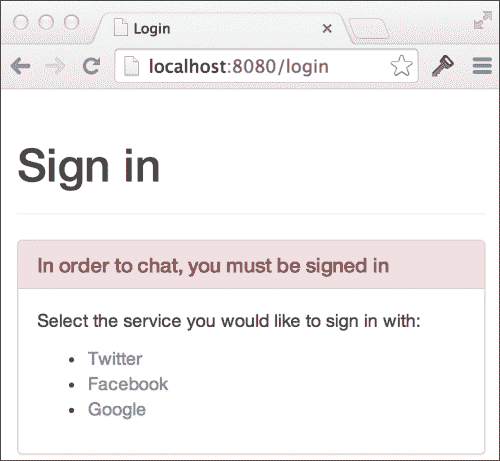

# 二、增加认证

我们在上一章中构建的聊天应用程序专注于从客户端到服务器再到服务器的高性能消息传输，但是我们的用户无法知道他们在和谁说话。这个问题的一个解决方案是建立某种注册和登录功能，让我们的用户在打开聊天页面之前创建帐户并进行身份验证。

每当我们准备从头开始构建某个东西时，我们必须问问自己，以前其他人是如何解决这个问题的（很少会遇到真正的原始问题），以及是否已经存在任何我们可以利用的开放解决方案或标准。授权和身份验证并不是什么新问题，尤其是在网络世界中，有许多不同的协议可供选择。那么，我们如何决定追求的最佳选择呢？一如既往，我们必须从用户的角度来看待这个问题。

现在很多网站都允许您使用各种社交媒体或社区网站上的现有帐户登录。这样，用户就不用在决定试用不同的产品和服务时一遍又一遍地输入所有帐户信息了。这对新站点的转换率也有积极影响。

在本章中，我们将增强聊天代码库以添加身份验证，这将允许我们的用户使用 Google、Facebook 或 GitHub 登录，您将看到添加其他登录门户是多么容易。为了加入聊天，用户必须首先登录。接下来，我们将使用授权数据来增强我们的用户体验，这样每个人都知道谁在房间里，谁说了什么。

在本章中，您将学习：

*   使用 decorator 模式包装`http.Handler`类型以向处理程序添加附加功能
*   使用动态路径为 HTTP 端点提供服务
*   使用 Gomniauth 开源项目访问身份验证服务
*   使用`http`包获取并设置 cookies
*   将对象编码为 Base64 并再次恢复正常
*   通过 web 套接字发送和接收 JSON 数据
*   为模板提供不同类型的数据
*   使用您自己类型的频道

# 一路下来

对于我们的聊天应用程序，我们实现了自己的`http.Handler`类型，以便轻松地编译、执行 HTML 内容并将其交付给浏览器。由于这是一个非常简单但功能强大的接口，因此在向 HTTP 处理添加功能时，我们将尽可能继续使用它。

为了确定用户是否经过身份验证，我们将创建一个执行检查的身份验证包装处理程序，并且仅当用户经过身份验证时才将执行传递给内部处理程序。

我们的包装处理程序将满足与其中的对象相同的`http.Handler`接口，允许我们包装任何有效的处理程序。事实上，即使是我们即将编写的身份验证处理程序，如果需要，也可以稍后封装在类似的包装器中。


应用于 HTTP 处理程序时的链接模式图

前面的图显示了如何在更复杂的 HTTP 处理程序场景中应用此模式。每个对象都实现了`http.Handler`接口，这意味着该对象可以被传递到`http.Handle`方法中直接处理一个请求，也可以被提供给另一个对象，这增加了一些额外的功能。`Logging`处理程序可能会在内部处理程序上调用`ServeHTTP`方法前后写入日志文件。因为内部处理程序只是另一个`http.Handler`，所以任何其他处理程序都可以用`Logging`处理程序包装（或装饰）。

对象包含决定应该执行哪个内部处理程序的逻辑也是很常见的。例如，我们的身份验证处理程序要么将执行传递给包装处理程序，要么通过向浏览器发出重定向来处理请求本身。

这是目前大量的理论；让我们编写一些代码。在`chat`文件夹中创建一个名为`auth.go`的新文件：

```go
package main
import (
  "net/http"
)
type authHandler struct {
  next http.Handler
}
func (h *authHandler) ServeHTTP(w http.ResponseWriter, r *http.Request) {
  if _, err := r.Cookie("auth"); err == http.ErrNoCookie {
    // not authenticated
    w.Header().Set("Location", "/login")
    w.WriteHeader(http.StatusTemporaryRedirect)
  } else if err != nil {
    // some other error
    panic(err.Error())
  } else {
    // success - call the next handler
    h.next.ServeHTTP(w, r)
  }
}
func MustAuth(handler http.Handler) http.Handler {
  return &authHandler{next: handler}
}
```

`authHandler`类型不仅实现`ServeHTTP`方法（满足`http.Handler`接口），而且在下一个字段中存储（包装）`http.Handler`。我们的`MustAuth`助手函数只是创建了`authHandler`来包装任何其他`http.Handler`。让我们调整以下根映射线：

```go
http.Handle("/", &templateHandler{filename: "chat.html"})
```

让我们更改第一个参数，使其明确表示用于聊天的页面。接下来，让我们使用`MustAuth`函数为第二个参数包装`templateHandler`：

```go
http.Handle("/chat", MustAuth(&templateHandler{filename: "chat.html"}))
```

使用`MustAuth`函数包装`templateHandler`将导致执行首先通过我们的`authHandler`运行，并且只有在请求经过身份验证的情况下才会运行到`templateHandler`。

我们的`authHandler`中的`ServeHTTP`方法将查找一个名为`auth`的特殊 cookie，如果 cookie 丢失，则使用`http.ResponseWriter`上的`Header`和`WriteHeader`方法将用户重定向到登录页面。

构建并运行聊天应用程序，并尝试点击`http://localhost:8080/chat`：

```go
go build -o chat
./chat -host=":8080"

```

### 提示

您需要删除 cookie 以清除以前的身份验证令牌，或者从通过 localhost 服务的其他开发项目中遗留下来的任何其他 cookie。

如果您在浏览器的地址栏中查看，您会注意到您会立即重定向到`/login`页面。由于我们还无法处理该路径，您将得到一个**404 页面未找到**错误。

# 在页面上做一个漂亮的社交登录

到目前为止，我们还没有把注意力放在让我们的应用程序看起来漂亮上，毕竟这本书是关于 Go 而不是用户界面开发的。然而，没有理由构建丑陋的应用程序，因此我们将构建一个既美观又实用的社交登录页面。

Bootstrap是一个前端框架，用于在 Web 上开发响应性项目。它提供了 CSS 和 JavaScript 代码，以一致和美观的方式解决了许多用户界面问题。虽然使用 Bootstrap 构建的站点看起来都一样（尽管有很多方法可以定制 UI），但对于早期版本的应用程序，或者对于无法接触设计师的开发人员来说，它是一个不错的选择。

### 提示

如果您使用 Bootstrap 规定的语义标准构建应用程序，那么为您的站点或应用程序创建一个 Bootstrap 主题就变得很容易了，并且您知道它将直接插入到您的代码中。

我们将使用托管在 CDN 上的 Bootstrap 版本，因此我们不必担心通过聊天应用程序下载和提供我们自己的版本。这意味着为了正确呈现页面，我们需要一个活跃的互联网连接，即使在开发过程中也是如此。

### 注

如果您喜欢下载并托管自己的引导副本，您可以这样做。将文件保存在`assets`文件夹中，并向您的`main`函数添加以下调用（它使用`http.Handle`通过您的应用程序为资产提供服务）：

```go
http.Handle("/img/", http.StripPrefix("/assets", http.FileServer(http.Dir("/path/to/img/"))))
```

注意`http.StripPrefix`和`http.FileServer`函数如何按照我们用`MustAuth`助手函数实现的装饰器模式返回满足`http.Handler`接口的对象。

在`main.go`中，我们为登录页面添加端点：

```go
http.Handle("/chat", MustAuth(&templateHandler{filename: "chat.html"}))
http.Handle("/login", &templateHandler{filename: "login.html"})
http.Handle("/room", r)
```

显然，我们不想在登录页面上使用`MustAuth`方法，因为它会导致无限重定向循环。

在我们的`templates`文件夹中创建一个名为`login.html`的新文件，并插入以下 HTML 代码：

```go
<html>
  <head>
    <title>Login</title>
    <link rel="stylesheet"
      href="//netdna.bootstrapcdn.com/bootstrap/3.1.1/css/bootstrap.min.css">
  </head>
  <body>
    <div class="container">
      <div class="page-header">
        <h1>Sign in</h1>
      </div>
      <div class="panel panel-danger">
        <div class="panel-heading">
          <h3 class="panel-title">In order to chat, you must be signed in</h3>
        </div>
        <div class="panel-body">
          <p>Select the service you would like to sign in with:</p>
          <ul>
            <li>
              <a href="/auth/login/facebook">Facebook</a>
            </li>
            <li>
              <a href="/auth/login/github">GitHub</a>
            </li>
            <li>
              <a href="/auth/login/google">Google</a>
            </li>
          </ul>
        </div>
      </div>
    </div>
  </body>
</html>
```

重新启动web服务器并导航至`http://localhost:8080/login`。您会注意到，它现在显示我们的登录页面：



# 具有动态路径的端点

Go 标准库中`http`包的模式匹配并不是最全面、功能最齐全的实现。例如，Ruby on Rails 使在路径中包含动态段变得更加容易：

```go
"auth/:action/:provider_name"
```

然后提供一个数据映射（或字典），其中包含框架从匹配路径自动提取的值。所以如果你访问`auth/login/google`，那么`params[:provider_name]`将等于`google`，而`params[:action]`将等于`login`。

`http`包允许我们默认指定的最大值是路径前缀，我们可以通过在模式的末尾留下一个尾随斜杠来实现：

```go
"auth/"
```

然后我们将必须手动解析剩余的片段以提取适当的数据。这对于相对简单的情况是可以接受的，这适合我们目前的需要，因为我们只需要处理几个不同的路径，例如：

*   `/auth/login/google`
*   `/auth/login/facebook`
*   `/auth/callback/google`
*   `/auth/callback/facebook`

### 提示

如果您需要处理更高级的路由情况，您可能需要考虑使用专用包，如 Goweb、Pat、路由或 MUX。对于像我们这样极其简单的情况，内置功能就可以了。

我们将创建一个新的处理程序来支持我们的登录过程。在`auth.go`中增加以下`loginHandler`代码：

```go
// loginHandler handles the third-party login process.
// format: /auth/{action}/{provider}
func loginHandler(w http.ResponseWriter, r *http.Request) {
  segs := strings.Split(r.URL.Path, "/")
  action := segs[2]
  provider := segs[3]
  switch action {
  case "login":
    log.Println("TODO handle login for", provider)
  default:
     w.WriteHeader(http.StatusNotFound)
     fmt.Fprintf(w, "Auth action %s not supported", action)
  }
}
```

在前面的代码中，我们先使用`strings.Split`将路径分成若干段，然后再提取`action`和`provider`的值。如果动作值已知，我们将运行特定代码；否则，我们将写出一条错误消息并返回一个`http.StatusNotFound`状态代码（在 HTTP 状态代码的语言中，它是一个`404`代码）。

### 注

我们现在不会防弹我们的代码，但值得注意的是，如果有人用太少的片段点击`loginHandler`，我们的代码会恐慌，因为它期望`segs[2]`和`segs[3]`存在。

要获得额外的积分，请查看您是否可以对此进行保护，并在有人点击`/auth/nonsense`时返回一条漂亮的错误消息，而不是惊慌失措。

我们的`loginHandler`只是一个函数，而不是实现`http.Handler`接口的对象。这是因为，与其他处理程序不同，我们不需要它来存储任何状态。Go 标准库支持这一点，因此我们可以使用`http.HandleFunc`函数以类似于我们之前使用`http.Handle`的方式对其进行映射。在`main.go`中，更新处理程序：

```go
http.Handle("/chat", MustAuth(&templateHandler{filename: "chat.html"}))
http.Handle("/login", &templateHandler{filename: "login.html"})
http.HandleFunc("/auth/", loginHandler)
http.Handle("/room", r)
```

重建并运行聊天应用程序：

```go
go build –o chat
./chat –host=":8080"

```

点击以下 URL 并注意终端中记录的输出：

*   `http://localhost:8080/auth/login/google`输出`TODO handle login for google`
*   `http://localhost:8080/auth/login/facebook`输出`TODO handle login for facebook`

我们已经成功地实现了一个动态路径匹配机制，到目前为止，它只打印出待办事项消息；接下来，我们需要编写与身份验证服务集成的代码。

# OAuth2

OAuth2是一个开放的身份验证和授权标准，设计用于允许资源所有者通过访问令牌交换握手向客户端授予对私有数据（如墙贴或 tweet）的委托访问权。即使您不希望访问私有数据，OAuth2 也是一个很好的选项，它允许用户使用其现有凭据登录，而无需将这些凭据公开给第三方站点。在本例中，我们是第三方，希望允许用户使用支持 OAuth2 的服务登录。

从用户的角度来看，OAuth2 流是：

1.  用户选择要与之登录客户端应用的提供商。
2.  用户将被重定向到提供商的网站（带有包含客户端应用程序 ID 的 URL），在那里他们将被要求授予对客户端应用程序的权限。
3.  用户从 OAuth2 服务提供商登录，并接受第三方应用程序请求的权限。
4.  用户被重定向回带有请求代码的客户端应用程序。
5.  在后台，客户端应用程序将授权代码发送给提供商，提供商将发回一个身份验证令牌。
6.  客户端应用程序使用访问令牌向提供商发出授权请求，例如获取用户信息或墙柱。

为了避免重蹈覆辙，我们将看一些已经为我们解决了这个问题的开源项目。

## 开源 OAuth2 包

Andrew Gerrand从 2010 年 2 月开始就一直致力于核心 Go 团队，距离 Go 1.0 正式发布还有两年时间。他的`goauth2`包（见[https://code.google.com/p/goauth2/](https://code.google.com/p/goauth2/) 是完全用 Go 编写的 OAuth2 协议的优雅实现。

安德鲁的项目启发了 Gomniauth（见[https://github.com/stretchr/gomniauth](https://github.com/stretchr/gomniauth) ）。Gomniauth 是 Ruby`omniauth`项目的开源 Go 替代方案，它提供了一个统一的解决方案来访问不同的 OAuth2 服务。在未来，当 OAuth3（或任何下一代身份验证协议）问世时，理论上，Gomniauth 可能会承担实现细节的痛苦，而用户代码则不会受到影响。

对于我们的应用程序，我们将使用 Gomniauth 访问由 Google、Facebook 和 GitHub 提供的 OAuth 服务，因此通过运行以下命令确保已安装该应用程序：

```go
go get github.com/stretchr/gomniauth

```

### 提示

Gomniauth 的一些项目依赖项保存在 Bazaar 存储库中，因此您需要转到[http://wiki.bazaar.canonical.com](http://wiki.bazaar.canonical.com) 下载。

# 告知认证提供商您的应用程序

在我们请求身份验证提供商帮助我们的用户登录之前，我们必须告诉他们我们的应用程序。大多数提供商都有某种 web 工具或控制台，您可以在其中创建应用程序来启动流程。这里有一个来自谷歌：


为了识别客户端应用程序，我们需要创建一个客户端 ID 和密码。尽管 OAuth2 是一个开放标准，但每个提供程序都有自己的语言和机制来进行设置，因此在每种情况下，您很可能都需要使用用户界面或文档来解决问题。

撰写本文时，在**谷歌开发者控制台**中，您导航到**API&认证****凭证**并点击**创建新客户端 ID**按钮。

在大多数情况下，为了增加安全性，必须明确请求来自的主机 URL。现在，由于我们在`localhost:8080`本地托管我们的应用程序，您应该使用它。您还需要一个重定向 URI，该 URI 是聊天应用程序中的端点，用户成功登录后将重定向到该 URI。回调将是我们`loginHandler`上的另一个操作，因此 Google 客户端的重定向 URL 将是`http://localhost:8080/auth/callback/google`。

一旦您完成您想要支持的提供商的身份验证过程，您将获得每个提供商的客户端 ID 和密码。记下这些，因为我们在聊天应用程序中设置提供商时需要它们。

### 注

如果我们在真实的域上托管应用程序，我们必须创建新的客户端 ID 和机密，或者更新身份验证提供商上的适当 URL 字段，以确保它们指向正确的位置。无论哪种方式，使用不同的开发和生产密钥集来实现安全性都是不错的做法。

# 实现外部登录

为了利用我们在认证提供商网站上创建的项目、客户或帐户，我们必须告诉 Gomniauth 我们要使用哪些提供商，以及我们将如何与他们互动。我们通过调用主 Gomniauth 包上的`WithProviders`函数来实现这一点。将以下代码段添加到`main.go`（就在`main`函数顶部的`flag.Parse()`行下方）：

```go
// set up gomniauth
gomniauth.SetSecurityKey("some long key")
gomniauth.WithProviders(
  facebook.New("key", "secret",
    "http://localhost:8080/auth/callback/facebook"),
  github.New("key", "secret",
    "http://localhost:8080/auth/callback/github"),
  google.New("key", "secret",
    "http://localhost:8080/auth/callback/google"),
)
```

您应该用前面记录的实际值替换`key`和`secret`占位符。第三个参数表示回调 URL，该 URL 应与您在提供商网站上创建客户端时提供的相匹配。注意第二个路径段为`callback`；虽然我们还没有实现这一点，但这是我们处理来自身份验证过程的响应的地方。

与往常一样，您需要确保导入所有适当的软件包：

```go
import (
  "github.com/stretchr/gomniauth/providers/facebook"
  "github.com/stretchr/gomniauth/providers/github"
  "github.com/stretchr/gomniauth/providers/google"
)
```

### 注

Gomniauth 需要`SetSecurityKey`调用，因为它在客户端和服务器之间发送状态数据以及签名校验和，以确保在传输时状态值没有被篡改。在创建散列时使用安全密钥，在不知道确切的安全密钥的情况下几乎不可能重新创建相同的散列。您应该将`some long key`替换为您选择的安全哈希或短语。

## 登录

既然我们已经配置了 Gomniauth，那么当用户登陆我们的`/auth/login/{provider}`路径时，我们需要将他们重定向到提供商的身份验证页面。我们只需更新`auth.go`中的`loginHandler`功能：

```go
func loginHandler(w http.ResponseWriter, r *http.Request) {
  segs := strings.Split(r.URL.Path, "/")
  action := segs[2]
  provider := segs[3]
  switch action {
  case "login":
    provider, err := gomniauth.Provider(provider)
    if err != nil {
      log.Fatalln("Error when trying to get provider", provider, "-", err)
    }
    loginUrl, err := provider.GetBeginAuthURL(nil, nil)
    if err != nil {
      log.Fatalln("Error when trying to GetBeginAuthURL for", provider, "-", err)
    }
    w.Header.Set("Location",loginUrl)
    w.WriteHeader(http.StatusTemporaryRedirect)
  default:
    w.WriteHeader(http.StatusNotFound)
    fmt.Fprintf(w, "Auth action %s not supported", action)
  }
}
```

我们在这里做两件主要的事情。首先，我们使用`gomniauth.Provider`函数获取与 URL 中指定的对象相匹配的提供者对象（例如`google`或`github`。然后，我们使用`GetBeginAuthURL`方法获取必须发送用户的位置，以便启动身份验证过程。

### 注

`GetBeginAuthURL(nil, nil)`参数分别用于状态和选项，我们不会在聊天应用程序中使用它们。

第一个参数是经过编码、签名并发送到身份验证提供程序的数据的状态映射。提供程序对状态不做任何处理，只是将其发送回回调端点。例如，如果我们希望将用户重定向回他们在身份验证过程干预之前试图访问的原始页面，这将非常有用。出于我们的目的，我们只有`/chat`端点，所以我们不需要担心发送任何状态。

第二个参数是将发送给身份验证提供程序的附加选项的映射，它以某种方式修改身份验证过程的行为。例如，您可以指定自己的`scope`参数，该参数允许您向提供者请求访问其他信息的权限。有关可用选项的更多信息，请在 Internet 上搜索 OAuth2 或阅读每个提供程序的文档，因为这些值因服务而异。

如果我们的代码没有从`GetBeginAuthURL`调用中得到错误，我们只需将用户的浏览器重定向到返回的 URL。

重建并运行聊天应用程序：

```go
go build -o chat
./chat -host=":8080"

```

通过访问`http://localhost:8080/chat`打开聊天主页面。由于我们还没有登录，我们被重定向到登录页面。点击 Google 选项使用您的 Google帐户登录，您会注意到，您会看到一个特定于 Google 的登录页面（如果您尚未登录 Google）。登录后，您将看到一个页面，要求您在查看有关您帐户的基本信息之前授予我们聊天应用程序的权限：


这与我们聊天应用程序的用户登录时体验的流程相同。

点击**接受**，您会注意到您被重定向回我们的申请代码，但出现错误`Auth action callback not supported`。这是因为我们还没有在`loginHandler`中实现回调功能。

## 处理提供者的响应

一旦用户点击提供商网站上的**接受**（或者如果他们点击了等价的**取消**，他们将被重定向回我们应用程序中的回调端点。

快速浏览一下返回的完整 URL，我们就会看到提供商提供给我们的授权代码。

```go
http://localhost:8080/auth/callback/google?code=4/Q92xJ-BQfoX6PHhzkjhgtyfLc0Ylm.QqV4u9AbA9sYguyfbjFEsNoJKMOjQI

```

我们不必担心如何处理这段代码，因为 Gomniauth 将为我们处理 OAuth URL 参数（通过将授权代码发送到 Google 服务器，并根据 OAuth 规范将其交换为访问令牌），因此我们可以直接实现回调处理程序。然而，值得一提的是，身份验证提供者将此代码交换为允许我们访问私有用户数据的令牌。为了增加安全性，这一附加步骤发生在后台，从服务器到服务器，而不是在浏览器中。

在`auth.go`中，我们准备向动作路径段添加另一个切换案例。在默认案例上方插入以下代码：

```go
case "callback":

  provider, err := gomniauth.Provider(provider)
  if err != nil {
    log.Fatalln("Error when trying to get provider", provider, "-", err)
  }

  creds, err := provider.CompleteAuth(objx.MustFromURLQuery(r.URL.RawQuery))
  if err != nil {
    log.Fatalln("Error when trying to complete auth for", provider, "-", err)
  }

  user, err := provider.GetUser(creds)
  if err != nil {
    log.Fatalln("Error when trying to get user from", provider, "-", err)
  }

  authCookieValue := objx.New(map[string]interface{}{
 "name": user.Name(),
 }).MustBase64()
 http.SetCookie(w, &http.Cookie{
 Name:  "auth",
 Value: authCookieValue,
 Path:  "/"})

  w.Header()["Location"] = []string{"/chat"}
  w.WriteHeader(http.StatusTemporaryRedirect)
```

当身份验证提供程序在用户授予权限后重定向回用户时，URL 指定这是一个回调操作。我们像以前一样查找身份验证提供者，并调用其`CompleteAuth`方法。我们将`RawQuery`从`http.Request`（用户浏览器正在发出的`GET`请求）解析为`objx.Map`（Gomniauth 使用的多用途映射类型），`CompleteAuth`方法使用 URL 查询参数值完成与提供商的认证握手。如果一切顺利，我们将获得一些授权凭证，用于访问用户的基本数据。然后，我们对提供者使用`GetUser`方法，Gomniauth 使用指定的凭证访问有关用户的一些基本信息。

一旦我们有了用户数据，我们就对 JSON 对象中的`Name`字段进行 Base64 编码，并将其作为值存储到我们的`auth`cookie 中，以供以后使用。

### 提示

数据的 Base64 编码确保它不会包含任何特殊或不可预测的字符，如在 URL 中传递数据或将数据存储在 cookie 中。请记住，尽管 Base64 编码的数据看起来是加密的，但这并不意味着您可以轻松地将 Base64 编码的数据解码回原始文本。有一些在线工具可以帮你做到这一点。

设置 cookie 后，我们将用户重定向到聊天页面，我们可以安全地假定该页面是原始目的地。

一旦您再次构建并运行代码并点击`/chat`页面，您将注意到注册流工作正常，我们最终被允许返回聊天页面。大多数浏览器都有一个检查器或控制台，该工具允许您查看服务器发送给您的 cookie，您可以使用该工具查看`auth`cookie 是否已出现：

```go
go build –o chat
./chat –host=":8080"

```

在我们的例子中，cookie 值是`eyJuYW1lIjoiTWF0IFJ5ZXIifQ==,`，它是`{"name":"Mat Ryer"}`的 Base64 编码版本。记住，我们从来没有在聊天应用程序中输入过名字；相反，当我们选择登录谷歌时，Gomniauth 向谷歌索要了一个名字。像这样存储未签名的 cookie 对于诸如用户名之类的附带信息来说是不错的，但是，您应该避免使用未签名的 cookie 存储任何敏感信息，因为人们很容易访问和更改数据。

## 呈现用户数据

将用户数据放在 cookie 中是一个良好的开端，但非技术人员甚至永远不会知道它在那里，因此我们必须将数据放在首位。我们将通过增强我们的`templateHandler`方法来实现这一点，该方法首先将用户数据传递到模板的`Execute`方法中；这允许我们在 HTML 中使用模板注释向用户显示用户数据。

更新`main.go`中我们`templateHandler`的`ServeHTTP`方法：

```go
func (t *templateHandler) ServeHTTP(w http.ResponseWriter, r *http.Request) {
  t.once.Do(func() {
    t.templ = template.Must(template.ParseFiles(filepath.Join("templates", t.filename)))
  })
  data := map[string]interface{}{
 "Host": r.Host,
 }
 if authCookie, err := r.Cookie("auth"); err == nil {
 data["UserData"] = objx.MustFromBase64(authCookie.Value)
 }

  t.templ.Execute(w, data)
}
```

我们不只是将整个`http.Request`对象作为数据传递给我们的模板，而是为一个可能有两个字段的数据对象创建一个新的`map[string]interface{}`定义：`Host`和`UserData`（后者仅在`auth`cookie 存在时才会出现）。通过指定紧跟着花括号的映射类型，我们可以在制作映射的同时添加`Host`条目。然后，我们将这个新的`data`对象作为第二个参数传递给模板上的`Execute`方法。

现在，我们向模板源添加一个HTML 文件以显示名称。更新`chat.html`中的`chatbox`表格：

```go
<form id="chatbox">
  {{.UserData.name}}:<br/>
  <textarea></textarea>
  <input type="submit" value="Send" />
</form>
```

`{{.UserData.name}}`注释告诉模板引擎在`textarea`控件之前插入我们的用户名。

### 提示

因为我们使用的是`objx`包，所以不要忘记运行`go get`[http://github.com/stretchr/objx](http://github.com/stretchr/objx) ，并导入。

重新构建并再次运行聊天应用程序，您会注意到在聊天框前添加了您的姓名：

```go
go build -o chat
./chat –host=":8080"

```

## 用附加数据扩充消息

到目前为止，我们的聊天应用程序只在客户端和服务器之间以字节片或`[]byte`类型传输消息；因此，我们房间的前向通道为`chan []byte`型。除了消息本身之外，为了发送数据（例如谁发送的数据以及何时发送的数据），我们还增强了转发通道，以及如何在两端与 web 套接字交互。

通过在`chat`文件夹中创建一个名为`message.go`的新文件，定义一个新类型来替换`[]byte`切片：

```go
package main
import (
  "time"
)
// message represents a single message
type message struct {
  Name    string
  Message string
  When    time.Time
}
```

`message`类型将封装消息字符串本身，但我们还添加了`Name`和`When`字段，分别保存用户名和消息发送时间戳。

由于`client`类型负责与浏览器的通信，因此需要发送和接收的不仅仅是单个消息字符串。当我们与 JavaScript 应用程序（即在浏览器中运行的聊天客户端）交谈时，Go 标准库有一个很棒的 JSON 实现，这似乎是在消息中编码附加信息的完美选择。我们将改变`client.go`中的`read`和`write`方法，在插座上使用`ReadJSON`和`WriteJSON`方法，并对我们新的`message`类型进行编码和解码：

```go
func (c *client) read() {
  for {
    var msg *message
 if err := c.socket.ReadJSON(&msg); err == nil {
 msg.When = time.Now()
 msg.Name = c.userData["name"].(string)
 c.room.forward <- msg
    } else {
      break
    }
  }
  c.socket.Close()
}
func (c *client) write() {
  for msg := range c.send {
    if err := c.socket.WriteJSON(msg); err != nil {
      break
    }
  }
  c.socket.Close()
}
```

当我们收到来自浏览器的消息时，我们希望只填充`Message`字段，这就是我们在前面的代码中自己设置`When`和`Name`字段的原因。

您会注意到，当您试图构建前面的代码时，它会抱怨一些事情。主要原因是我们正试图通过`forward`和`send chan []byte`通道发送`*message`对象。这是不允许的，直到我们更改通道的类型。在`room.go`中，将`forward`字段更改为`chan *message`类型，并对`client.go`中的`send chan`类型执行相同操作。

我们必须更新初始化频道的代码，因为类型现在已经改变了。或者，您可以等待编译器提出这些问题，并在运行时修复它们。在`room.go`中，您需要进行以下更改：

*   将`forward: make(chan []byte)`更改为`forward: make(chan *message)`
*   将`r.tracer.Trace("Message received: ", string(msg))`更改为`r.tracer.Trace("Message received: ", msg.Message)`
*   将`send: make(chan []byte, messageBufferSize)`更改为`send: make(chan *message, messageBufferSize)`

编译器还将抱怨客户端上缺少用户数据，这是一个公平点，因为`client`类型不知道我们添加到 cookie 中的新用户数据。更新`client`结构以包含一个名为`userData`的新`map[string]interface{}`：

```go
// client represents a single chatting user.
type client struct {
  // socket is the web socket for this client.
  socket *websocket.Conn
  // send is a channel on which messages are sent.
  send chan *message
  // room is the room this client is chatting in.
  room *room
  // userData holds information about the user
  userData map[string]interface{}
}
```

用户数据来自我们通过`http.Request`对象的`Cookie`方法访问的客户端 cookie。在`room.go`中，更新`ServeHTTP`并进行以下更改：

```go
func (r *room) ServeHTTP(w http.ResponseWriter, req *http.Request) {
  socket, err := upgrader.Upgrade(w, req, nil)
  if err != nil {
    log.Fatal("ServeHTTP:", err)
    return
  }

  authCookie, err := req.Cookie("auth")
 if err != nil {
 log.Fatal("Failed to get auth cookie:", err)
 return
 }
 client := &client{
 socket:   socket,
 send:     make(chan *message, messageBufferSize),
 room:     r,
 userData: objx.MustFromBase64(authCookie.Value),
 }
  r.join <- client
  defer func() { r.leave <- client }()
  go client.write()
  client.read()
}
```

我们在`http.Request`类型上使用`Cookie`方法来获取我们的用户数据，然后再将其传递给客户端。我们正在使用`objx.MustFromBase64`方法将编码的 cookie 值转换回可用的 map 对象。

现在，我们已经将套接字上发送和接收的类型从`[]byte`更改为`*message`，我们必须告诉 JavaScript 客户端，我们正在发送 JSON，而不仅仅是一个普通字符串。我们还必须要求它在用户提交消息时将 JSON 发送回服务器。在`chat.html`中，首先更新`socket.send`呼叫：

```go
socket.send(JSON.stringify({"Message": msgBox.val()}));
```

我们使用`JSON.stringify`将指定的 JSON 对象（仅包含`Message`字段）序列化为字符串，然后发送到服务器。我们的 Go 代码将把 JSON 字符串解码（或解组）成一个`message`对象，将来自客户端 JSON 对象的字段名与`message`类型的字段名相匹配。

最后，将`socket.onmessage`回调函数更新为 JSON，并在页面中添加发送方名称：

```go
socket.onmessage = function(e) {
  var msg = eval("("+e.data+")");
  messages.append(
    $("<li>").append(
      $("<strong>").text(msg.Name + ": "),
      $("<span>").text(msg.Message)
    )
  );
}
```

在前面的代码片段中，我们使用 JavaScript 的`eval`函数将 JSON 字符串转换为 JavaScript 对象，然后访问字段以构建正确显示它们所需的元素。

构建并运行应用程序，如果可以，使用两个不同浏览器中的两个不同帐户登录（或邀请朋友帮助您测试）：

```go
go build -o chat
./chat -host=":8080"

```

以下屏幕截图显示聊天应用程序的浏览器聊天屏幕：


# 总结

在本章中，我们向聊天应用程序添加了一个有用且必要的功能，即在允许用户加入对话之前，要求用户使用 OAuth2 服务提供商对自己进行身份验证。我们使用了几个开源软件包，如`Objx`和`Gomniauth`，这大大降低了我们需要处理的多服务器复杂性。

我们在包装`http.Handler`类型时实现了一个模式，允许我们轻松指定哪些路径需要用户进行身份验证，哪些路径即使没有`auth`cookie 也可用。我们的`MustAuth`helper 函数允许我们以流畅而简单的方式生成包装类型，而不会给代码增加混乱和混乱。

我们了解了如何使用 Cookie 和 Base64 编码在浏览器中安全（尽管不安全）存储特定用户的状态，以及如何通过正常连接和 web 套接字使用这些数据。为了向 UI 提供用户名称，我们对模板可用的数据进行了更多的控制，并了解了如何仅在特定条件下提供某些数据。

由于我们需要通过 web 套接字发送和接收附加信息，因此我们了解了将本机类型的频道更改为与我们自己的类型（如我们的`message`类型）一起工作的频道是多么容易。我们还学习了如何通过套接字传输 JSON 对象，而不仅仅是字节片。由于 Go 的类型安全性，以及为通道指定类型的能力，编译器有助于确保我们不会通过`chan *message`发送除`message`对象以外的任何内容。尝试这样做会导致编译器错误，立即提醒我们这一事实。

查看聊天者的姓名是我们在上一章中构建的应用程序在可用性方面的一个重大飞跃，但它非常正式，可能不会吸引网络的现代用户，因为他们已经习惯了更多的视觉体验。我们缺少了人们聊天的图片，在下一章中，我们将探索不同的方法，让用户在我们的应用程序中更好地表现自己。

作为一个额外的任务，看看您是否可以利用我们输入到`message`类型中的`time.Time`字段来告诉用户消息何时发送。