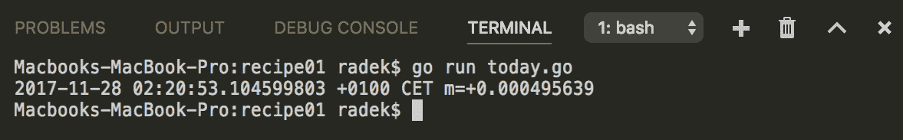
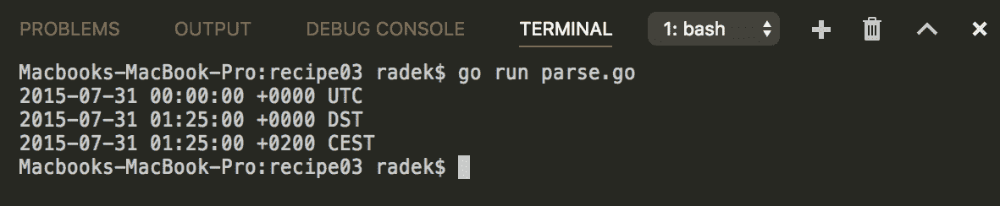

# 四、很久以前

本章中的配方包括：

*   查找今天的日期
*   将日期格式化为字符串
*   将字符串解析为日期
*   将日期转换为历元，反之亦然
*   从日期检索时间单位
*   日期算术
*   找出两个日期之间的差异
*   时区转换
*   定期运行代码块
*   等待一定时间
*   长时间运行操作超时
*   序列化时间和日期

# 介绍

本章介绍与时间相关的任务和操作。Go 将所有这些都集中在名为`time`的标准包中。有了这个软件包，您可以获取当前的时间和日期，将日期格式化为字符串，转换时区，创建计时器，以及创建计时器。请记住，实现和设计功能的方法很多，本章仅介绍其中的一些方法。

验证 Go 是否正确安装。如有任何问题，请参见[第一章](01.html)*与环境互动*中的*检索戈朗版本*配方，并按照*准备*部分的步骤进行操作。

# 查找今天的日期

获取当前日期对于任何系统或应用程序来说都是一项非常常见的任务。让我们看看这是如何在 Go 的标准库的帮助下完成的。

# 怎么做。。。

1.  打开控制台，创建文件夹`chapter04/recipe01`。
2.  导航到该目录。
3.  创建具有以下内容的`today.go`文件：

```go
        package main

        import (
          "fmt"
          "time"
        )

        func main() {
          today := time.Now()
          fmt.Println(today)
        }
```

4.  在主终端运行`go run today.go`执行代码。
5.  您将看到以下输出：



# 它是如何工作的。。。

内置包`time`包含函数`Now`，提供初始化为当前本地时间和日期的`Time`实例。

`Time`类型是以纳秒为单位的时间瞬间。`Time`的零值为第一年 1 月 1 日 00:00:00.000000000 UTC。

不应使用指向`Time`类型的指针。如果只使用该值（而不是指向变量的指针），则认为跨多个 goroutine 使用`Time`实例是安全的。唯一的例外是序列化。

# 另见

有关`Time`类型的更多信息，请参见[上的`time`包文档 https://golang.org/pkg/time](https://golang.org/pkg/time) 。

# 将日期格式化为字符串

如果需要时间值的文本表示，通常需要某些格式。`time`包的`Time`类型提供了以给定格式创建`string`输出的能力。关于如何做到这一点，有一些规则，我们将介绍一些有用的规则。

# 怎么做。。。

1.  打开控制台，创建文件夹`chapter04/recipe02`。
2.  导航到该目录。
3.  创建具有以下内容的`format.go`文件：

```go
        package main

        import (
          "fmt"
          "time"
        )

        func main() {
          tTime := time.Date(2017, time.March, 5, 8, 5, 2, 0, time.Local)

          // The formatting is done
          // with use of reference value
          // Jan 2 15:04:05 2006 MST
          fmt.Printf("tTime is: %s\n", tTime.Format("2006/1/2"))

          fmt.Printf("The time is: %s\n", tTime.Format("15:04"))

          //The predefined formats could
          // be used
          fmt.Printf("The time is: %s\n", tTime.Format(time.RFC1123))

          // The formatting supports space padding
          //only for days in Go version 1.9.2
          fmt.Printf("tTime is: %s\n", tTime.Format("2006/1/_2"))

          // The zero padding is done by adding 0
          fmt.Printf("tTime is: %s\n", tTime.Format("2006/01/02"))

          //The fraction with leading zeros use 0s
          fmt.Printf("tTime is: %s\n", tTime.Format("15:04:05.00"))

          //The fraction without leading zeros use 9s
          fmt.Printf("tTime is: %s\n", tTime.Format("15:04:05.999"))

          // Append format appends the formatted time to given
          // buffer
          fmt.Println(string(tTime.AppendFormat([]byte("The time 
                             is up: "), "03:04PM")))
        }
```

4.  在主终端运行`go run format.go`执行代码。
5.  您将看到以下输出：


# 它是如何工作的。。。

`time`包的`Time`类型提供格式化输出字符串的`Format`方法。

Go 使用参考时间值`Jan 2 15:04:05 2006 MST`定义格式化布局。有关填充选项，请参见代码示例。

参考日期的备忘录是，当以数字形式给出时，它表示为 1,2,3,4,5,6，-7。-7 值表示 MST 时区比 UTC 晚 7 小时。

时间包包括一些预定义的格式（例如，`time.Kitchen`；您可以在包常量的文档中找到这些。（[https://golang.org/pkg/time/#pkg-常数](https://golang.org/pkg/time/#pkg-constants)）

# 另见

有关所有预定义的格式和格式选项，请参阅`time`包的文档，网址为：[https://golang.org/pkg/time](https://golang.org/pkg/time) 。

# 将字符串解析为日期

日期解析也使用了与日期格式中使用的相同的概念。可以使用相同的参考日期和布局原则。此配方将向您展示如何将字符串输入转换为`Time`实例。

# 怎么做。。。

1.  打开控制台，创建文件夹`chapter04/recipe03`。
2.  导航到该目录。
3.  创建具有以下内容的`parse.go`文件：

```go
        package main

        import (
          "fmt"
          "time"
        )

        func main() {

          // If timezone is not defined
          // than Parse function returns
          // the time in UTC timezone.
          t, err := time.Parse("2/1/2006", "31/7/2015")
          if err != nil {
            panic(err)
          }
          fmt.Println(t)

          // If timezone is given than it is parsed
          // in given timezone
          t, err = time.Parse("2/1/2006 3:04 PM MST", 
                              "31/7/2015 1:25 AM DST")
          if err != nil {
            panic(err)
          }
          fmt.Println(t)

          // Note that the ParseInLocation
          // parses the time in given location, if the
          // string does not contain time zone definition
          t, err = time.ParseInLocation("2/1/2006 3:04 PM ", 
                        "31/7/2015 1:25 AM ", time.Local)
          if err != nil {
            panic(err)
          }
          fmt.Println(t)

        }
```

4.  在主终端运行`go run parse.go`执行代码。
5.  您将看到以下输出：



# 它是如何工作的。。。

`time`包包含用于解析带有时间信息的字符串的`Parse`函数。

传入日期字符串的格式由引用日期给定，格式为匹配格式。请记住，参考时间为`Jan 2 15:04:05 2006 MST`。

如果给定的时间字符串不包含时区信息，`Parse`函数的结果将始终在`UTC`中。

如果提供了时区信息，则时间始终是所提供时区中的时间瞬间

`ParseInLocation`函数接受第三个参数，即位置。如果时间字符串不包含任何时区信息，则将时间解析到给定位置的`Time`实例。

# 将日期转换为历元，反之亦然

纪元是描述时间点的通用系统。大纪元时间的开始定义为`00:00:00 1 Jan 1970 UTC`。epoch 的值是自时间戳起的秒数减去自时间戳起的闰秒数。

`time`包和`Time`类型为您提供了操作和查找 UNIX 时间的能力。

# 怎么做。。。

1.  打开控制台，创建文件夹`chapter04/recipe04`。
2.  导航到该目录。
3.  创建具有以下内容的`epoch.go`文件：

```go
        package main

        import (
          "fmt"
          "time"
        )

        func main() {

          // Set the epoch from int64
          t := time.Unix(0, 0)
          fmt.Println(t)

          // Get the epoch
          // from Time instance
          epoch := t.Unix()
          fmt.Println(epoch)

          // Current epoch time
          apochNow := time.Now().Unix()
          fmt.Printf("Epoch time in seconds: %d\n", apochNow)

          apochNano := time.Now().UnixNano()
          fmt.Printf("Epoch time in nano-seconds: %d\n", apochNano)

        }
```

4.  在主终端运行`go run epoch.go`执行代码。
5.  您将看到以下输出：


# 它是如何工作的。。。

`time`包包含`Unix`函数，该函数接受两个`int64`参数，以及纪元时间的秒和纳秒。这样就可以从历元值中得到`Time`实例。

要从`Time`实例获取历元值，可以调用与从历元创建`Time`同名的方法`Unix`。还有一个名为`UnixNano`的方法，它返回毫秒计数，而不是秒数。

# 从日期检索时间单位

`Time`类型还提供了从实例检索时间单位的 API。这意味着您可以找出实例代表的是一个月中的哪一天或一天中的哪一小时。此配方显示了如何获得此类单位。

# 怎么做。。。

1.  打开控制台，创建文件夹`chapter04/recipe05`。
2.  导航到该目录。
3.  创建具有以下内容的`units.go`文件：

```go
        package main

        import (
          "fmt"
          "time"
        )

        func main() {
          t := time.Date(2017, 11, 29, 21, 0, 0, 0, time.Local)
          fmt.Printf("Extracting units from: %v\n", t)

          dOfMonth := t.Day()
          weekDay := t.Weekday()
          month := t.Month()

          fmt.Printf("The %dth day of %v is %v\n", dOfMonth,
                     month, weekDay)

        }
```

4.  在主终端运行`go run units.go`执行代码。
5.  您将看到以下输出：


# 它是如何工作的。。。

`Time`类型提供了提取时间单位的方法。前面的示例显示了提取工作日、月份和月份的日期。类似地，可以提取小时、秒和其他单位。

当然，API 未直接提供的单元需要从现有单元派生。

# 日期算术

`time`包的`Time`类型还允许您在给定的日期和时间执行基本算法。这样，您就可以找出过去和未来的日期。

# 怎么做。。。

1.  打开控制台，创建文件夹`chapter04/recipe06`。
2.  导航到该目录。
3.  创建具有以下内容的`arithmetics.go`文件：

```go
        package main

        import (
          "fmt"
          "time"
        )

        func main() {

          l, err := time.LoadLocation("Europe/Vienna")
          if err != nil {
            panic(err)
          }
          t := time.Date(2017, 11, 30, 11, 10, 20, 0, l)
          fmt.Printf("Default date is: %v\n", t)

          // Add 3 days
          r1 := t.Add(72 * time.Hour)
          fmt.Printf("Default date +3HRS is: %v\n", r1)

          // Subtract 3 days
          r1 = t.Add(-72 * time.Hour)
          fmt.Printf("Default date -3HRS is: %v\n", r1)

          // More comfortable api
          // to add days/months/years
          r1 = t.AddDate(1, 3, 2)
          fmt.Printf("Default date +1YR +3MTH +2D is: %v\n", r1)

        }
```

4.  在主终端运行`go run arithmetics.go`执行代码。
5.  您将看到以下输出：


# 它是如何工作的。。。

`time`包的`Time`类型提供了两种基本的日期和时间操作方法。

第一种方法`Add`接受`time.Duration`和`AddDate`。通过`Add`方法，你可以用正号将时间移向未来，只需加上负号就可以将时间向后移动。

第二种方法`AddDate`使用`int64`参数作为年、月和日，并添加较大的时间量。

注意，`AddDate`会规范化结果，与`time.Date`函数相同。正常化意味着将月份添加到 8 月 31 日将导致 10 月 1 日，因为下一个月只包含 30 天（9 月 31 日不存在）。

# 找出两个日期之间的差异

找出两个日期之间的差异并不是一项不寻常的任务。对于该操作，Go 标准包`time`（分别为`Time`类型）提供了支持方法。

# 怎么做。。。

1.  打开控制台，创建文件夹`chapter04/recipe07`。
2.  导航到该目录。
3.  创建具有以下内容的`diff.go`文件：

```go
        package main

        import (
          "fmt"
          "time"
        )

        func main() {

          l, err := time.LoadLocation("Europe/Vienna")
          if err != nil {
            panic(err)
          }
          t := time.Date(2000, 1, 1, 0, 0, 0, 0, l)
          t2 := time.Date(2000, 1, 3, 0, 0, 0, 0, l)
          fmt.Printf("First Default date is %v\n", t)
          fmt.Printf("Second Default date is %v\n", t2)

          dur := t2.Sub(t)
          fmt.Printf("The duration between t and t2 is %v\n", dur)

          dur = time.Since(t)
          fmt.Printf("The duration between now and t is %v\n", dur)

          dur = time.Until(t)
          fmt.Printf("The duration between t and now is %v\n", dur)

        }
```

4.  在主终端运行`go run diff.go`执行代码。
5.  您将看到以下输出：


# 它是如何工作的。。。

`Time`实例的`Sub`方法是找出两个日期之间差异的通用方法。结果是`time.Duration`，表示这些日期之间的纳秒计数。

请注意，如果差值超过最大/最小值`time.Duration`的限制，则返回最大值或最小值。

函数`Since`和`Until`只是计算现在和给定日期之间差异的一种较短方法。它们的名称提示它们工作。`Since`函数返回与`time.Now().Sub(t)`相同的结果；类似地，`Until`返回与`t.Sub(time.Now())`相同的结果。

`Sub`方法自然也适用于时区。因此，返回每个`Time`实例位置的差异。

# 时区转换

处理时区问题很难。处理不同时区的一个好方法是在系统中保留一个时区作为参考，并在需要时转换其他时区。这个食谱告诉你如何在时区之间转换时间。

# 怎么做。。。

1.  打开控制台，创建文件夹`chapter04/recipe08`。
2.  导航到该目录。
3.  创建具有以下内容的`timezones.go`文件：

```go
        package main

        import (
          "fmt"
          "time"
        )

        func main() {
          eur, err := time.LoadLocation("Europe/Vienna")
          if err != nil {
            panic(err)
          }

          t := time.Date(2000, 1, 1, 0, 0, 0, 0, eur)
          fmt.Printf("Original Time: %v\n", t)

          phx, err := time.LoadLocation("America/Phoenix")
          if err != nil {
            panic(err)
          }

          t2 := t.In(phx)
          fmt.Printf("Converted Time: %v\n", t2)

        }
```

4.  在主终端运行`go run timezones.go`执行代码。
5.  您将看到以下输出：


# 它是如何工作的。。。

`Time`类型提供使用指向`time.Location`的指针的`In`方法。返回的`Time`是转换到给定时区的原始`Time`。请注意，`Time`实例被认为是不可变的，因此更改实例的方法将生成一个新的`Time`实例。

`time`包引用*IANA 时区*数据库作为位置来源。`LoadLocation`函数从`ZONEINFO`环境变量中查找目录或 ZIP 文件。如果未找到，将搜索 UNIX 系统上的已知安装位置。最后，它出现在`$GOROOT/lib/time/zoneinfo.zip`中。

# 定期运行代码块

除了日期和时间操作，`time`包还提供对定期和延迟代码执行的支持。通常，应用程序运行状况检查、活动检查或任何定期作业都可以通过这种方式实现。

# 怎么做。。。

1.  打开控制台，创建文件夹`chapter04/recipe09`。
2.  导航到该目录。
3.  创建具有以下内容的`ticker.go`文件：

```go
        package main

        import (
          "fmt"
          "os"
          "os/signal"
          "time"
       )

       func main() {

         c := make(chan os.Signal, 1)
         signal.Notify(c)

         ticker := time.NewTicker(time.Second)
         stop := make(chan bool)

         go func() {
           defer func() { stop <- true }()
           for {
             select {
               case <-ticker.C:
                 fmt.Println("Tick")
               case <-stop:
                 fmt.Println("Goroutine closing")
                 return
             }
           }
         }()

         // Block until
         // the signal is received
         <-c
         ticker.Stop()

         // Stop the goroutine
         stop <- true
         // Wait until the
         <-stop
         fmt.Println("Application stopped")
       }
```

4.  在主终端运行`go run ticker.go`执行代码。
5.  等待几秒钟，然后按*Ctrl*+*C*发送`SIGINT`信号。
6.  您将看到以下输出：


# 它是如何工作的。。。

`Ticker`持有`C`通道，用于发送周期性滴答声。实例的创建间隔是给定的。间隔由`time.Duration`值定义

计划定期执行的代码在 goroutine 中以无限循环执行。来自`Ticker`通道的读数会阻塞环路，直到发出滴答声。

请注意，一旦通过调用`Stop`方法停止`Ticker`，则`C`通道不会关闭，它只是停止发送滴答声。因此，前面的代码包含停止通道可以传递停止信号的`select`结构。通过这种方式，可以实现优雅的关机。

# 等待一定时间

前面的配方描述了如何定期执行代码。此配方将向您展示如何延迟执行代码。

# 怎么做。。。

1.  打开控制台，创建文件夹`chapter04/recipe10`。
2.  导航到该目录。
3.  创建具有以下内容的`delay.go`文件：

```go
        package main

        import (
          "fmt"
          "sync"
          "time"
        )

        func main() {

          t := time.NewTimer(3 * time.Second)

          fmt.Printf("Start waiting at %v\n", 
                     time.Now().Format(time.UnixDate))
          <-t.C
          fmt.Printf("Code executed at %v\n", 
                     time.Now().Format(time.UnixDate))

          wg := &sync.WaitGroup{}
          wg.Add(1)
          fmt.Printf("Start waiting for AfterFunc at %v\n", 
                     time.Now().Format(time.UnixDate))
          time.AfterFunc(3*time.Second, func() {
          fmt.Printf("Code executed for AfterFunc at %v\n", 
                     time.Now().Format(time.UnixDate))
          wg.Done()
        })

        wg.Wait()

        fmt.Printf("Waiting on time.After at %v\n", 
                   time.Now().Format(time.UnixDate))
        <-time.After(3 * time.Second)
        fmt.Printf("Code resumed at %v\n", 
                   time.Now().Format(time.UnixDate))

        }
```

4.  在主终端运行`go run delay.go`执行代码。
5.  您将看到以下输出：


# 它是如何工作的。。。

为了只执行一次延迟的代码，可以使用`time`包中的`Timer`。其工作原理与前面配方中描述的相同，*定期运行代码块*。

`Timer`包含`C`通道，该通道在给定时间后发送蜱虫，之后，不会通过该通道发送其他蜱虫。

相同的功能提供了`time`包的`AfterFunc`功能。它只是简化了使用。请注意，不需要通道。示例代码使用`sync.WaitGroup`等待，直到执行给定的函数。

`time.After`是上例中的最后一个选项。该函数返回一个通道，该通道在给定时间段后发送滴答声。注意`Timer`和`After`函数之间的差异。`Timer`为可复用结构（提供`Stop`和`Reset`方法）。另一方面，`After`功能只能使用一次，因为它不提供任何重置选项。

# 长时间运行操作超时

前面的方法描述了延迟执行代码的概念。对于长时间运行的操作，可以使用相同的概念来实现超时。这个食谱将说明如何做到这一点。

# 怎么做。。。

1.  打开控制台，创建文件夹`chapter04/recipe11`。
2.  导航到该目录。
3.  创建具有以下内容的`timeout.go`文件：

```go
        package main

        import (
          "fmt"
          "time"
        )

        func main() {

          to := time.After(3 * time.Second)
          list := make([]string, 0)
          done := make(chan bool, 1)

          fmt.Println("Starting to insert items")
          go func() {
            defer fmt.Println("Exiting goroutine")
            for {
              select {
                case <-to:
                  fmt.Println("The time is up")
                  done <- true
                  return
                default:
                  list = append(list, time.Now().String())
              }
            }
          }()

          <-done
          fmt.Printf("Managed to insert %d items\n", len(list))
        }
```

4.  在主终端运行`go run timeout.go`执行代码。
5.  您将看到以下输出：


# 它是如何工作的。。。

前面代码中长时间运行操作的超时是通过使用`time.After`功能实现的，该功能提供在给定时间段后发送勾号的通道。

操作本身被包装为选择一条语句，该语句在`time.After`通道和执行操作的默认选项之间进行选择。

请注意，您需要允许代码定期从`time.After`通道读取，以确定是否超过超时。否则，如果默认代码分支完全阻止执行，则无法确定超时是否已过

# 还有更多。。。

示例实现使用了`time.After`函数，但`Timer`函数也可以以相同的方式使用。内置库还使用`context.WithTimeout`实现超时功能。

# 序列化时间和日期

序列化日期和时间信息时，必须选择适当的格式。此配方将说明`time`包如何帮助选择一个并正确执行序列化。

# 怎么做。。。

1.  打开控制台，创建文件夹`chapter04/recipe12`。
2.  导航到该目录。
3.  创建具有以下内容的`serialize.go`文件：

```go
        package main

        import (
          "encoding/json"
          "fmt"
          "time"
        )

        func main() {

          eur, err := time.LoadLocation("Europe/Vienna")
          if err != nil {
            panic(err)
          }
          t := time.Date(2017, 11, 20, 11, 20, 10, 0, eur)

          // json.Marshaler interface
          b, err := t.MarshalJSON()
          if err != nil {
            panic(err)
          }
          fmt.Println("Serialized as RFC 3339:", string(b))
          t2 := time.Time{}
          t2.UnmarshalJSON(b)
          fmt.Println("Deserialized from RFC 3339:", t2)

          // Serialize as epoch
          epoch := t.Unix()
          fmt.Println("Serialized as Epoch:", epoch)

          // Deserialize epoch
          jsonStr := fmt.Sprintf("{ \"created\":%d }", epoch)
          data := struct {
            Created int64 `json:"created"`
          }{}
          json.Unmarshal([]byte(jsonStr), &data)
          deserialized := time.Unix(data.Created, 0)
          fmt.Println("Deserialized from Epoch:", deserialized)

        }
```

4.  在主终端运行`go run serialize.go`执行代码。
5.  您将看到以下输出：

>

# 它是如何工作的。。。

`Time`函数实现二进制、Gob 和 JSON 序列化的接口。JSON 格式被认为是非常通用的，因此显示了如何将值序列化为 JSON 的示例。注意，`Time`函数以 RFC 3339（[的方式序列化该值 https://www.ietf.org/rfc/rfc3339.txt](https://www.ietf.org/rfc/rfc3339.txt) ），提出了一种所谓的互联网日期/时间格式

另一种非常通用的序列化/保存时间的方法是使用纪元时间。历元时间与时区无关，因为它由自绝对时间点起经过的秒/纳秒来定义。最后，它表示为一个数字，因此没有理由序列化和反序列化该值。