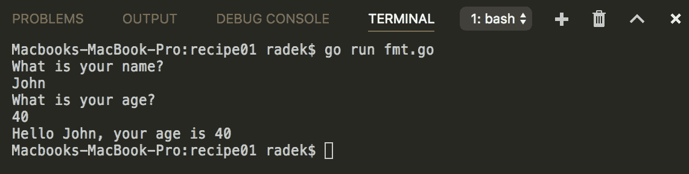
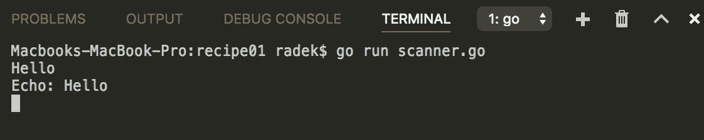
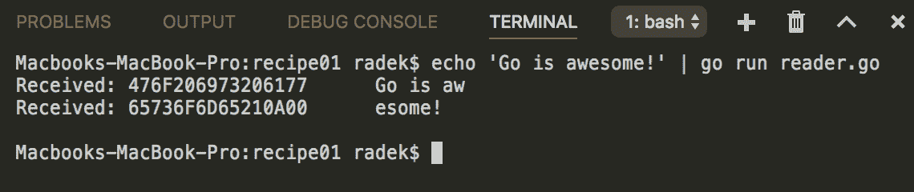
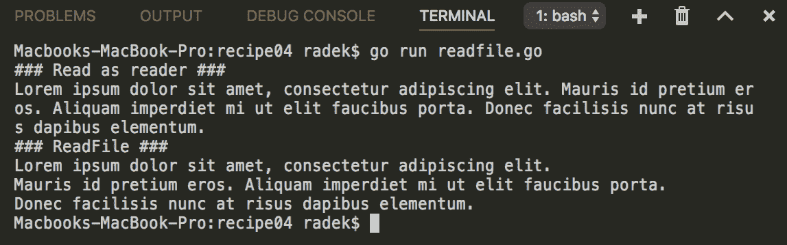
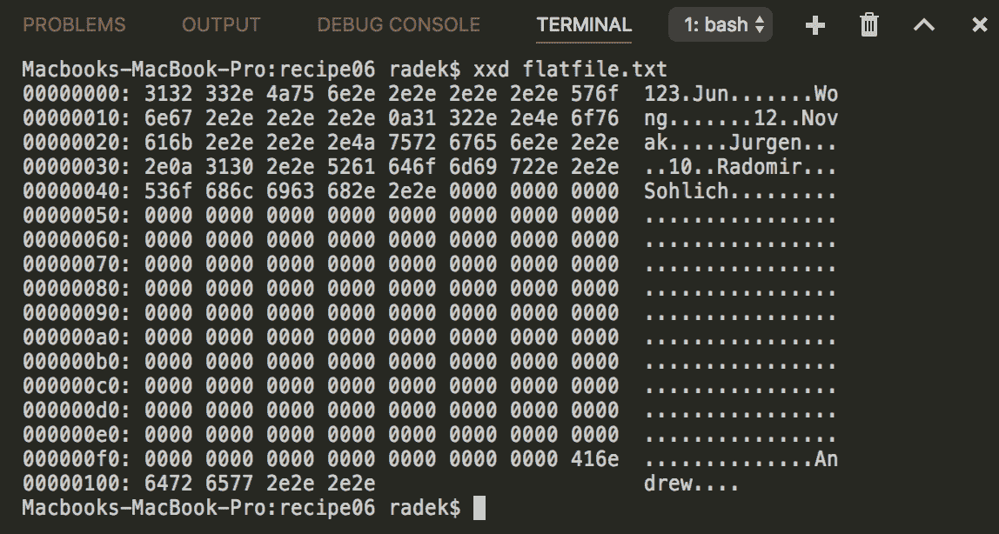
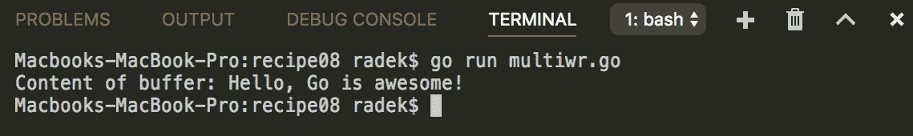
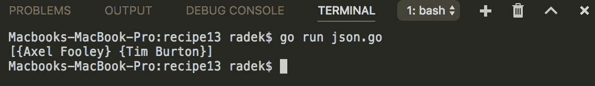

# 五、进进出出

本章包含以下配方：

*   读取标准输入
*   编写标准输出和错误
*   按名称打开文件
*   将文件读入字符串
*   读取/写入不同的字符集
*   在文件中寻找位置
*   读写二进制数据
*   同时向多个作者写信
*   编写者和读者之间的管道
*   将对象序列化为二进制格式
*   读取和写入 ZIP 文件
*   有效地解析大型 XML 文件
*   从不完整的 JSON 数组中提取数据

# 介绍

本章将介绍典型的 I/O 操作和相关任务，以及各种输入源的编写和读取。我们将经历 XML 处理、解压缩压缩文件和使用随机访问文件。

检查 Go 是否正确安装。*检索[第一章](01.html)中的*准备*部分*与环境互动*将对您有所帮助。*

# 读取标准输入

每个进程都有其标准的输入、输出和错误文件描述符。`stdin`作为流程的输入。本配方描述了如何从`stdin`读取数据。

# 怎么做。。。

1.  打开控制台，创建文件夹`chapter05/recipe01`。
2.  导航到该目录。
3.  创建具有以下内容的`fmt.go`文件：

```go
        package main

        import (
          "fmt"
        )

        func main() {

          var name string
          fmt.Println("What is your name?")
          fmt.Scanf("%s\n", &name)

          var age int
          fmt.Println("What is your age?")
          fmt.Scanf("%d\n", &age)

          fmt.Printf("Hello %s, your age is %d\n", name, age)

       }
```

4.  使用`go run fmt.go`执行代码。
5.  输入`John`并按*输入*。
6.  输入`40`并按*输入*。

7.  您将看到以下输出：



8.  创建具有以下内容的文件`scanner.go`：

```go
        package main

        import (
          "bufio"
          "fmt"
          "os"
        )

        func main() {

          // The Scanner is able to
          // scan input by lines
          sc := bufio.NewScanner(os.Stdin)

          for sc.Scan() {
            txt := sc.Text()
            fmt.Printf("Echo: %s\n", txt)
          }

        }
```

9.  使用`go run scanner.go`执行代码。
10.  输入`Hello`并按*输入*。
11.  按*CTRL*+*C*发送`SIGINT`。

12.  请参见输出：



13.  创建具有以下内容的文件`reader.go`：

```go
        package main

        import (
          "fmt"
          "os"
        )

        func main() {

         for {
           data := make([]byte, 8)
           n, err := os.Stdin.Read(data)
           if err == nil && n > 0 {
             process(data)
           } else {
             break
           }
         }

       }

       func process(data []byte) {
         fmt.Printf("Received: %X %s\n", data, string(data))
       }
```

14.  使用管道输入`echo 'Go is awesome!' | go run reader.go`执行代码。

15.  请参见输出：



# 它是如何工作的。。。

Go 流程的`stdin`可以通过`os`包的`Stdin`进行检索。实际上，它是一个实现`Reader`接口的`File`类型。阅读`Reader`是很容易的。前面的代码显示了三种非常常见的方式来读取`Stdin`。

第一个选项说明了`fmt`包的使用，它提供了功能`Scan`、`Scanf`和`Scanln`。`Scanf`函数将输入读取到给定变量中。`Scanf`的优点是您可以确定扫描值的格式。`Scan`函数只是将输入读取到变量中（没有预定义的格式），`Scanln,`顾名思义，读取以换行符结尾的输入。

示例代码中显示的第二个选项`Scanner`，提供了一种扫描较大输入的方便方法。`Scanner`包含可以定义自定义拆分函数的函数`Split`。例如，要扫描`stdin`中的单词，可以使用`bufio.ScanWords`预定义的`SplitFunc`。

最后介绍的方法是通过`Reader`API 进行读取。这为您提供了对如何读取输入的更多控制。

# 编写标准输出和错误

如前一配方所述，每个过程都有`stdin`、一个`stdout`和`stderr`文件描述符。标准方法是使用`stdout`作为过程输出，`stderr`作为过程误差输出。因为这些是文件描述符，所以写入数据的目的地可以是任何东西，从控制台到套接字。本食谱将向您展示如何书写`stdout`和`stderr`。

# 怎么做。。。

1.  打开控制台，创建文件夹`chapter05/recipe02`。
2.  导航到该目录。
3.  创建具有以下内容的`stdouterr.go`文件：

```go
        package main

        import (
          "fmt"
          "io"
          "os"
         )

         func main() {

           // Simply write string
           io.WriteString(os.Stdout,
           "This is string to standard output.\n")

           io.WriteString(os.Stderr,
           "This is string to standard error output.\n")

           // Stdout/err implements
           // writer interface
           buf := []byte{0xAF, 0xFF, 0xFE}
           for i := 0; i < 200; i++ {
             if _, e := os.Stdout.Write(buf); e != nil {
               panic(e)
             }
           }

           // The fmt package
           // could be used too
           fmt.Fprintln(os.Stdout, "\n")
         }
```

4.  使用`go run stdouterr.go`执行代码。

5.  请参见输出：


# 它是如何工作的。。。

与前面配方中的`Stdin`一样，`Stdout`和`Stderr`是文件描述符。所以他们正在实现`Writer`接口。

前面的示例展示了如何通过`io.WriteString`函数，使用`Writer`API，通过`fmt`包和`FprintXX`函数写入这些文件的几种方法。

# 按名称打开文件

文件访问是用于存储或读取数据的一种非常常见的操作。此配方说明了如何使用标准库按文件名和路径打开文件。

# 怎么做。。。

1.  打开控制台，创建文件夹`chapter05/recipe03`。
2.  导航到该目录。
3.  创建目录`temp`并在其中创建文件`file.txt`。

4.  编辑`file.txt`文件并将`This file content`写入该文件。
5.  创建具有以下内容的`openfile.go`文件：

```go
        package main

        import (
          "fmt"
          "io"
          "io/ioutil"
          "os"
        )

        func main() {

          f, err := os.Open("temp/file.txt")
          if err != nil {
            panic(err)
          }

          c, err := ioutil.ReadAll(f)
          if err != nil {
            panic(err)
          }

          fmt.Printf("### File content ###\n%s\n", string(c))
          f.Close()

          f, err = os.OpenFile("temp/test.txt", os.O_CREATE|os.O_RDWR,
                               os.ModePerm)
          if err != nil {
            panic(err)
          }
          io.WriteString(f, "Test string")
          f.Close()

        }
```

6.  文件结构应如下所示：


7.  使用`go run openfile.go`执行代码。
8.  参见输出，`temp`文件夹中还应有一个新文件`test.txt`：


# 它是如何工作的。。。

`os`包提供了一种打开文件的简单方法。函数`Open`以只读模式按路径打开文件。另一个功能，`OpenFile,`更强大，它使用文件路径、标志和权限

标记常量在`os`包中定义，您可以将它们与二进制或运算符`|`组合使用。权限由`os`包常量（例如`os.ModePerm`）或数字符号（例如`0777`）设置（权限：`-rwxrwxrwx`）。

# 将文件读入字符串

在前面的食谱中，我们看到了`Stdin`的读数和文件的打开。在本食谱中，我们将结合这两种方法，并展示如何将文件读入字符串。

# 怎么做。。。

1.  打开控制台，创建文件夹`chapter05/recipe04`。
2.  导航到该目录。
3.  创建目录`temp`并在其中创建文件`file.txt`。
4.  编辑`file.txt`文件并在文件中写入多行。

5.  创建具有以下内容的`readfile.go`文件：

```go
        package main

        import "os"
        import "bufio"

        import "bytes"
        import "fmt"
        import "io/ioutil"

        func main() {

          fmt.Println("### Read as reader ###")
          f, err := os.Open("temp/file.txt")
          if err != nil {
            panic(err)
          }
          defer f.Close()

          // Read the
          // file with reader
          wr := bytes.Buffer{}
          sc := bufio.NewScanner(f)
          for sc.Scan() {
            wr.WriteString(sc.Text())
          }
          fmt.Println(wr.String())

          fmt.Println("### ReadFile ###")
          // for smaller files
          fContent, err := ioutil.ReadFile("temp/file.txt")
          if err != nil {
            panic(err)
          }
          fmt.Println(string(fContent))

        }
```

6.  使用`go run readfile.go`执行代码。
7.  请参见输出：



# 它是如何工作的。。。

由于`File`类型同时实现`Reader`和`Writer`接口，因此从文件中读取非常简单。这样，适用于`Reader`接口的所有功能和方法都适用于`File`类型。前面的示例显示了如何使用`Scanner`读取文件并将内容写入字节缓冲区（这比字符串串联更有效）。这样，您就可以控制从文件中读取的内容量。

使用`ioutil.ReadFile`的第二种方法更简单，但应小心使用，因为它读取整个文件。请记住，该文件可能非常庞大，可能会威胁应用程序的稳定性。

# 读取/写入不同的字符集

不同来源的输入可以有不同的字符集，这也不例外。请注意，许多系统使用 Windows 操作系统，但也有其他系统。默认情况下，Go 希望程序中使用的字符串基于 UTF-8。如果不是，则必须从给定的字符集进行解码才能使用字符串。此配方将以 UTF-8 以外的字符集显示文件的读取和写入。

# 怎么做。。。

1.  打开控制台，创建文件夹`chapter05/recipe05`。
2.  导航到该目录。
3.  创建具有以下内容的`charset.go`文件：

```go
        package main

        import (
          "fmt"
          "io/ioutil"
          "os"

          "golang.org/x/text/encoding/charmap"
        )

        func main() {

          // Write the string
          // encoded to Windows-1252
          encoder := charmap.Windows1252.NewEncoder()
          s, e := encoder.String("This is sample text with runes Š")
          if e != nil {
            panic(e)
          }
          ioutil.WriteFile("example.txt", []byte(s), os.ModePerm)

          // Decode to UTF-8
          f, e := os.Open("example.txt")
          if e != nil {
            panic(e)
          }
          defer f.Close()
          decoder := charmap.Windows1252.NewDecoder()
          reader := decoder.Reader(f)
          b, err := ioutil.ReadAll(reader)
          if err != nil {
            panic(err)
          }
          fmt.Println(string(b))
        }
```

4.  使用`go run charset.go`执行代码。
5.  请参见输出：


# 它是如何工作的。。。

`golang.org/x/text/encoding/charmap`包包含代表广泛使用的字符集的`Charmap`类型指针常量。`Charmap`类型提供了为给定字符集创建编码器和解码器的方法。`Encoder`创建编码`Writer`，将写入的字节编码到所选字符集中。类似地，`Decoder`可以创建解码`Reader`，解码来自所选字符集的所有读取数据。

# 另见

[第 2 章](02.html)、*字符串和其他内容*还包含*从非 Unicode 字符集*解码字符串的配方，用于将字符串编码/解码为另一个字符集。

# 在文件中寻找位置

在某些情况下，您需要读取或写入文件中的特定位置，例如索引文件。配方将向您展示如何在平面文件操作的上下文中使用位置搜索。

# 怎么做。。。

1.  打开控制台，创建文件夹`chapter05/recipe06`。
2.  导航到该目录。

3.  创建具有以下内容的文件`flatfile.txt`：

```go
 123.Jun.......Wong......
 12..Novak.....Jurgen....
 10..Thomas....Sohlich...
```

4.  创建具有以下内容的`fileseek.go`文件：

```go
        package main

        import (
          "errors"
          "fmt"
          "os"
        )

        const lineLegth = 25

        func main() {

          f, e := os.OpenFile("flatfile.txt", os.O_RDWR|os.O_CREATE,
                              os.ModePerm)
          if e != nil {
            panic(e)
          }
          defer f.Close()

          fmt.Println(readRecords(2, "last", f))
          if err := writeRecord(2, "first", "Radomir", f); err != nil {
            panic(err)
          }
          fmt.Println(readRecords(2, "first", f))
          if err := writeRecord(10, "first", "Andrew", f); err != nil {
            panic(err)
          }
          fmt.Println(readRecords(10, "first", f))
          fmt.Println(readLine(2, f))
        }

        func readLine(line int, f *os.File) (string, error) {
          lineBuffer := make([]byte, 24)
          f.Seek(int64(line*lineLegth), 0)
          _, err := f.Read(lineBuffer)
          return string(lineBuffer), err
        }

        func writeRecord(line int, column, dataStr string, f *os.File) 
        error {
          definedLen := 10
          position := int64(line * lineLegth)
          switch column {
            case "id":
              definedLen = 4
            case "first":
              position += 4
            case "last":
              position += 14
           default:
             return errors.New("Column not defined")
          }

          if len([]byte(dataStr)) > definedLen {
            return fmt.Errorf("Maximum length for '%s' is %d", 
                              column, definedLen)
          }

          data := make([]byte, definedLen)
          for i := range data {
            data[i] = '.'
          }
          copy(data, []byte(dataStr))
          _, err := f.WriteAt(data, position)
          return err
        }

        func readRecords(line int, column string, f *os.File) 
                        (string, error) {
          lineBuffer := make([]byte, 24)
          f.ReadAt(lineBuffer, int64(line*lineLegth))
          var retVal string
          switch column {
            case "id":
              return string(lineBuffer[:3]), nil
            case "first":
              return string(lineBuffer[4:13]), nil
            case "last":
              return string(lineBuffer[14:23]), nil
          }

          return retVal, errors.New("Column not defined")
        }
```

5.  使用`go run fileseek.go`执行代码。
6.  请参见输出：


7.  以十六进制`xxd flatfile.txt`显示文件。



# 它是如何工作的。。。

前面的示例使用`flatfile`作为如何在文件中的位置查找、读取和写入的说明。一般情况下，移动`File`中当前指针的位置可以使用`Seek`方法。它有两个参数，它们是位置和如何计算位置，`0 - relative to file origin, 1 - relative to current position, 2 - relative to the end of file`。这样，您就可以在文件中移动光标。前面代码中的`readLine`函数的实现使用了`Seek`方法。

`flatfile`是如何存储数据的最基本形式。记录结构具有固定长度，记录部分的长度相同。示例中平面文件的结构为：`ID`-4 个字符、`FirstName`-10 个字符、`LastName`-10 个字符。整个记录长达 24 个字符，以第 25 个<sup xmlns:epub="http://www.idpf.org/2007/ops">字符的换行符结束。</sup>

`os.File`还包含`ReadAt`和`WriteAt`方法。这些方法消耗要写入/读取的字节和开始的偏移量。这些简化了文件中某个位置的写入和读取。

请注意，该示例假设每个符文只有一个字节，对于特殊字符不必为 true，依此类推。

# 读写二进制数据

此配方描述如何以二进制形式写入和读取任何类型。

# 怎么做。。。

1.  打开控制台，创建文件夹`chapter05/recipe07`。
2.  导航到该目录。
3.  创建具有以下内容的`rwbinary.go`文件：

```go
        package main

        import (
          "bytes"
          "encoding/binary"
          "fmt"
        )

        func main() {
          // Writing binary values
          buf := bytes.NewBuffer([]byte{})
          if err := binary.Write(buf, binary.BigEndian, 1.004); 
          err != nil {
            panic(err)
          }
          if err := binary.Write(buf, binary.BigEndian,
                   []byte("Hello")); err != nil {
            panic(err)
          }

          // Reading the written values
          var num float64
          if err := binary.Read(buf, binary.BigEndian, &num); 
          err != nil {
            panic(err)
          }
          fmt.Printf("float64: %.3f\n", num)
          greeting := make([]byte, 5)
          if err := binary.Read(buf, binary.BigEndian, &greeting);
          err != nil {
            panic(err)
          }
          fmt.Printf("string: %s\n", string(greeting))
        }
```

4.  通过`go run rwbinary.go`执行代码。
5.  请参见输出：


# 它是如何工作的。。。

二进制数据可以使用`encoding/binary`包写入。函数`Write`消耗写入数据的`Writer`，字节顺序（`BigEndian`/`LittleEndian`，最后是写入`Writer`的值。

为了模拟读取二进制数据，可以使用`Read`函数。请注意，从二进制源读取数据没有什么神奇之处。您需要确定从`Reader`获取的数据是什么。如果没有，则可以将数据提取到适合其大小的任何类型。

# 同时向多个作者写信

当您需要将相同的输出写入多个目标时，内置包中提供了帮助。这个方法展示了如何实现同时写入多个目标。

# 怎么做。。。

1.  打开控制台，创建文件夹`chapter05/recipe08`。
2.  导航到该目录。
3.  创建具有以下内容的`multiwr.go`文件：

```go
        package main

        import "io"
        import "bytes"
        import "os"
        import "fmt"

        func main() {

          buf := bytes.NewBuffer([]byte{})
          f, err := os.OpenFile("sample.txt", os.O_CREATE|os.O_RDWR,
                                os.ModePerm)
          if err != nil {
            panic(err)
          }
          wr := io.MultiWriter(buf, f)
          _, err = io.WriteString(wr, "Hello, Go is awesome!")
          if err != nil {
            panic(err)
          }

          fmt.Println("Content of buffer: " + buf.String())
        }
```

4.  通过`go run multiwr.go`执行代码。

5.  请参见输出：



6.  检查所创建文件的内容：

```go
 Hello, Go is awesome!
```

# 它是如何工作的。。。

`io`包包含`MultiWriter`函数，可变参数为`Writers`，当调用`Writer`上的`Write`方法时，数据会写入所有底层`Writers`。

# 编写者和读者之间的管道

进程之间的管道是将第一个进程的输出用作其他进程的输入的简单方法。同样的概念也可以在 Go 中实现，例如，将数据从一个套接字传输到另一个套接字，以创建隧道连接。此配方将向您展示如何使用 Go 内置库创建管道。

# 怎么做。。。

1.  打开控制台，创建文件夹`chapter05/recipe09`。
2.  导航到该目录。
3.  创建具有以下内容的`pipe.go`文件：

```go
        package main

        import (
          "io"
          "log"
          "os"
          "os/exec"
        )

        func main() {
          pReader, pWriter := io.Pipe()

          cmd := exec.Command("echo", "Hello Go!\nThis is example")
          cmd.Stdout = pWriter

          go func() {
            defer pReader.Close()
            if _, err := io.Copy(os.Stdout, pReader); err != nil {
              log.Fatal(err)
            }
          }()

          if err := cmd.Run(); err != nil {
            log.Fatal(err)
          }

        }
```

4.  通过`go run pipe.go`执行代码。
5.  请参见输出：


# 它是如何工作的。。。

`io.Pipe`函数创建内存管道并返回管道的两端，`PipeReader`在一侧，而`PipeWriter`在另一侧。每个`Write`到`PipeWriter`都被阻塞，直到被另一端的`Read`消耗。

该示例显示了从已执行命令到父程序标准输出的管道输出。通过将`pWriter`分配给`cmd.Stdout`，子进程的标准输出被写入管道，`goroutine`中的`io.Copy`通过将数据复制到`os.Stdout.`来消耗写入的数据

# 将对象序列化为二进制格式

除了众所周知的 JSON 和 XML 之外，Go 还提供二进制格式`gob`。本食谱介绍了如何使用`gob`软件包的基本概念。

# 怎么做。。。

1.  打开控制台，创建文件夹`chapter05/recipe10`。
2.  导航到该目录。
3.  创建具有以下内容的`gob.go`文件：

```go
        package main

        import (
          "bytes"
          "encoding/gob"
          "fmt"
        )

        type User struct {
          FirstName string
          LastName string
          Age int
          Active bool
        }

        func (u User) String() string {
          return fmt.Sprintf(`{"FirstName":%s,"LastName":%s,
                               "Age":%d,"Active":%v }`,
          u.FirstName, u.LastName, u.Age, u.Active)
        }

        type SimpleUser struct {
          FirstName string
          LastName string
        }

        func (u SimpleUser) String() string {
          return fmt.Sprintf(`{"FirstName":%s,"LastName":%s}`,
          u.FirstName, u.LastName)
        }

        func main() {

          var buff bytes.Buffer

          // Encode value
          enc := gob.NewEncoder(&buff)
          user := User{
            "Radomir",
            "Sohlich",
            30,
            true,
          }
          enc.Encode(user)
          fmt.Printf("%X\n", buff.Bytes())

          // Decode value
          out := User{}
          dec := gob.NewDecoder(&buff)
          dec.Decode(&out)
          fmt.Println(out.String())

          enc.Encode(user)
          out2 := SimpleUser{}
          dec.Decode(&out2)
          fmt.Println(out2.String())

        }
```

4.  通过`go run gob.go`执行代码。
5.  请参见输出：


# 它是如何工作的。。。

`gob`序列化和反序列化需要编码器和解码器。`gob.NewEncoder`函数使用基础`Writer`创建`Encoder`。`Encode`方法的每次调用都会将对象序列化为`gob`格式。gob 格式本身是自描述二进制格式。这意味着每个序列化结构前面都有其描述。

要解码序列化表单中的数据，`Decoder`必须通过调用基础`Reader`的`gob.NewDecoder`来创建。然后，`Decode`接受指向应该反序列化数据的结构的指针

请注意，gob 格式不需要源和目标类型来精确匹配。有关规则，请参阅`encoding`/`gob`包。

# 读取和写入 ZIP 文件

ZIP 压缩是一种广泛使用的压缩格式。应用程序通常使用 ZIP 格式上载文件集，或者另一方面，将压缩文件导出为输出。此配方将向您展示如何使用标准库以编程方式处理 ZIP 文件。

# 怎么做。。。

1.  打开控制台，创建文件夹`chapter05/recipe11`。
2.  导航到该目录。
3.  创建具有以下内容的`zip.go`文件：

```go
        package main

        import (
          "archive/zip"
          "bytes"
          "fmt"
          "io"
          "io/ioutil"
          "log"
          "os"
        )

        func main() {

          var buff bytes.Buffer

          // Compress content
          zipW := zip.NewWriter(&buff)
          f, err := zipW.Create("newfile.txt")
          if err != nil {
            panic(err)
          }
          _, err = f.Write([]byte("This is my file content"))
          if err != nil {
            panic(err)
          }
          err = zipW.Close()
          if err != nil {
            panic(err)
          }

          //Write output to file
          err = ioutil.WriteFile("data.zip", buff.Bytes(), os.ModePerm)
          if err != nil {
            panic(err)
          }

          // Decompress the content
          zipR, err := zip.OpenReader("data.zip")
          if err != nil {
            panic(err)
          }

          for _, file := range zipR.File {
            fmt.Println("File " + file.Name + " contains:")
            r, err := file.Open()
            if err != nil {
              log.Fatal(err)
            }
            _, err = io.Copy(os.Stdout, r)
            if err != nil {
              panic(err)
            }
            err = r.Close()
            if err != nil {
              panic(err)
            }
            fmt.Println()
          }

        }
```

4.  通过`go run zip.go`执行代码。
5.  请参见输出：


# 它是如何工作的。。。

内置包`zip`包含`NewWriter`和`NewReader`函数，用于创建`zip.Writer`压缩，以及`zip.Reader`解压压缩内容。

ZIP 文件的每条记录都是使用创建的`zip.Writer`的`Create`方法创建的。返回的`Writer`用于编写内容体。

要解压缩文件，`OpenReader`函数用于创建压缩文件中记录的`ReadCloser`。创建的`ReaderCloser`的`File`字段是`zip.File`指针的切片。通过调用`Open`方法并读取返回的`ReadCloser`获取文件内容。

在`Create`方法中，只需在文件名上添加斜杠即可创建文件夹。一个例子可以是`folder/newfile.txt`。

# 有效地解析大型 XML 文件

XML 是一种非常常见的数据交换格式。Go 库支持以与 JSON 相同的方式解析 XML 文件。通常，使用与 XML 方案对应的结构，并在该帮助下，立即解析 XML 内容。问题是 XML 文件太大，无法放入内存，因此需要分块解析文件。此配方将揭示如何处理大型 XML 文件并解析所需信息。

# 怎么做。。。

1.  打开控制台，创建文件夹`chapter05/recipe11`。
2.  导航到该目录。
3.  创建具有以下 XML 内容的`data.xml`文件：

```go
        <?xml version="1.0"?>
        <catalog>
          <book id="bk101">
            <author>Gambardella, Matthew</author>
            <title>XML Developer's Guide</title>
            <genre>Computer</genre>
            <price>44.95</price>
            <publish_date>2000-10-01</publish_date>
            <description>An in-depth look at creating applications 
             with XML.</description>
          </book>
          <book id="bk112">
            <author>Galos, Mike</author>
            <title>Visual Studio 7: A Comprehensive Guide</title>
            <genre>Computer</genre>
            <price>49.95</price>
            <publish_date>2001-04-16</publish_date>
            <description>Microsoft Visual Studio 7 is explored
             in depth, looking at how Visual Basic, Visual C++, C#,
             and ASP+ are integrated into a comprehensive development
             environment.</description>
          </book>
        </catalog>
```

4.  创建具有以下内容的`xml.go`文件：

```go
        package main

        import (
          "encoding/xml"
          "fmt"
          "os"
        )

        type Book struct {
          Title string `xml:"title"`
          Author string `xml:"author"`
        }

        func main() {

          f, err := os.Open("data.xml")
          if err != nil {
            panic(err)
          }
          defer f.Close()
          decoder := xml.NewDecoder(f)

          // Read the book one by one
          books := make([]Book, 0)
          for {
            tok, _ := decoder.Token()
            if tok == nil {
              break
            }
            switch tp := tok.(type) {
              case xml.StartElement:
                if tp.Name.Local == "book" {
                  // Decode the element to struct
                  var b Book
                  decoder.DecodeElement(&b, &tp)
                  books = append(books, b)
                }
            }
          }
          fmt.Println(books)
        }
```

5.  通过`go run xml.go`执行代码。
6.  请参见输出：


# 它是如何工作的。。。

通过`xml`包的`NewDecoder`功能，创建 XML 内容的`Decoder`

通过调用`Decoder,`上的`Token`方法接收`xml.Token`。`xml.Token`是保存令牌类型的接口。可以根据类型定义代码的行为。示例代码测试解析的`xml.StartElement`是否为`book`元素之一。然后，它将部分数据解析为一个`Book`结构。通过这种方式，`Decoder`中基础`Reader`中指针的位置被结构数据移动，解析可以继续。

# 从不完整的 JSON 数组中提取数据

此配方包含一个非常具体的用例，其中您的程序使用来自不可靠源的 JSON，JSON 包含一个对象数组，该数组具有开始标记`[`，但数组中的项目数量非常大，JSON 的结尾可能会损坏。

# 怎么做。。。

1.  打开控制台，创建文件夹`chapter05/recipe13`。
2.  导航到该目录。

3.  创建具有以下内容的`json.go`文件：

```go
        package main

        import (
          "encoding/json"
          "fmt"
          "strings"
        )

        const js = `
          [
            {
              "name":"Axel",
              "lastname":"Fooley"
            },
            {
              "name":"Tim",
              "lastname":"Burton"
            },
            {
              "name":"Tim",
              "lastname":"Burton"
        `

        type User struct {
          Name string `json:"name"`
          LastName string `json:"lastname"`
        }

        func main() {

          userSlice := make([]User, 0)
          r := strings.NewReader(js)
          dec := json.NewDecoder(r)
          for {
            tok, err := dec.Token()
            if err != nil {
              break
            }
            if tok == nil {
              break
            }
            switch tp := tok.(type) {
              case json.Delim:
                str := tp.String()
                if str == "[" || str == "{" {
                  for dec.More() {
                    u := User{}
                    err := dec.Decode(&u)
                    if err == nil {
                      userSlice = append(userSlice, u)
                    } else {
                      break
                    }
                  }
                }
              }
            }

            fmt.Println(userSlice)
          }
```

4.  通过`go run json.go`执行代码。
5.  请参见输出：



# 它是如何工作的。。。

除了`Unmarshall`函数外，`json`包还包含`Decoder`API。有了`NewDecoder`，就可以创建`Decoder`。通过调用解码器上的`Token`方法，读取底层`Reader`并返回`Token`接口。这可能包含多个值。

其中之一是`Delim`类型，这是一个包含`{`、`[`、`]`、`}`字符之一的符文。在此基础上，检测 JSON 数组的开头。通过解码器上的`More`方法，可以检测到更多要解码的对象。