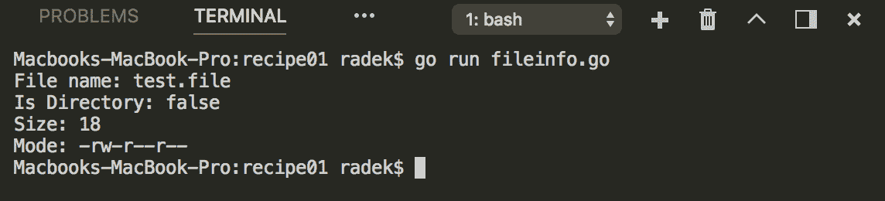
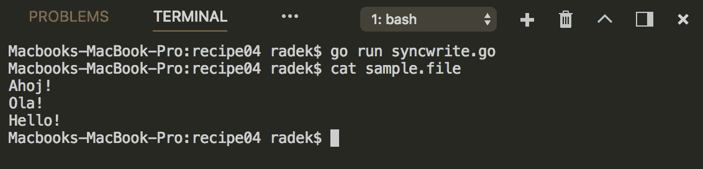
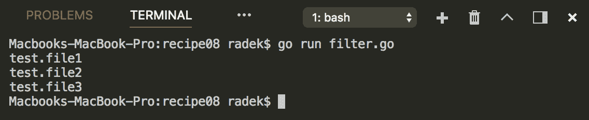
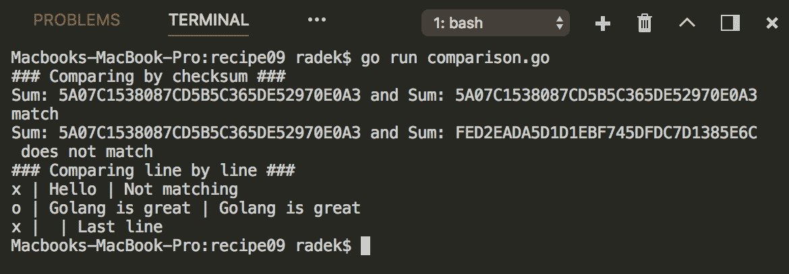

# 发现文件系统

本章包含以下配方：

*   获取文件信息
*   创建临时文件
*   写入文件
*   从多个 goroutine 写入文件
*   列出目录
*   更改文件权限
*   创建文件和目录
*   筛选文件列表
*   比较两个文件
*   解析用户主目录

# 介绍

本章将引导您完成文件和目录中的典型操作。我们还将讨论如何获取用户主目录并为其创建临时文件。

检查 Go 是否正确安装。[第一章](01.html)*与环境互动*的*检索戈朗版*配方中的*准备*部分将帮助您。

# 获取文件信息

如果您需要发现有关所访问文件的基本信息，Go 的标准库提供了一种方法来实现这一点。此配方显示了如何访问此信息。

# 怎么做。。。

1.  打开控制台，创建文件夹`chapter06/recipe01`。
2.  导航到该目录。
3.  创建内容为`This is test file`的样本`test.file`。
4.  创建具有以下内容的`fileinfo.go`文件：

```go
        package main

        import (
          "fmt"
          "os"
        )

        func main() {

          f, err := os.Open("test.file")
          if err != nil {
            panic(err)
          }
          fi, err := f.Stat()
          if err != nil {
            panic(err)
          }

          fmt.Printf("File name: %v\n", fi.Name())
          fmt.Printf("Is Directory: %t\n", fi.IsDir())
          fmt.Printf("Size: %d\n", fi.Size())
          fmt.Printf("Mode: %v\n", fi.Mode())

        }
```

5.  在主终端运行`go run fileinfo.go`执行代码。
6.  您将看到以下输出：



# 它是如何工作的。。。

`os.File`类型通过`Stat`方法提供对`FileInfo`类型的访问。`FileInfo`结构包含文件的所有基本信息。

# 创建临时文件

临时文件通常在运行测试用例时使用，或者如果您的应用程序需要一个位置来存储短期内容，例如用户数据上传和当前处理的数据。此配方将提供创建此类文件或目录的最简单方法。

# 怎么做。。。

1.  打开控制台，创建文件夹`chapter06/recipe02`。
2.  导航到该目录。
3.  创建具有以下内容的`tempfile.go`文件：

```go
        package main

        import "io/ioutil"
        import "os"
        import "fmt"

        func main() {
          tFile, err := ioutil.TempFile("", "gostdcookbook")
          if err != nil {
            panic(err)
          }
          // The called is responsible for handling
          // the clean up.
          defer os.Remove(tFile.Name())

          fmt.Println(tFile.Name())

          // TempDir returns
          // the path in string.
          tDir, err := ioutil.TempDir("", "gostdcookbookdir")
          if err != nil {
            panic(err)
          }
          defer os.Remove(tDir)
          fmt.Println(tDir)

        }
```

4.  在主终端运行`go run tempfile.go`执行代码。
5.  您将看到以下输出：


# 它是如何工作的。。。

`ioutil`包包含功能`TempFile`和`TempDir`。`TempFile`函数使用目录和文件前缀。返回包含基础临时文件的`os.File`。请注意，调用者负责清除文件。前面的示例使用`os.Remove`函数来实现这一点。

`TempDir`功能的工作方式相同。不同之处在于返回了带有目录路径的`string`。

temp`file`/`dir`名称由前缀和随机后缀组成。使用相同参数调用`TempFile`/`Dir`函数的多个程序不会得到相同的结果。

# 写入文件

编写文件是每个程序员的基本任务；Go 支持多种方法来实现这一点。这个食谱将展示其中的一些。

# 怎么做。。。

1.  打开控制台，创建文件夹`chapter06/recipe03`。
2.  导航到该目录。
3.  创建具有以下内容的`writefile.go`文件：

```go
        package main

        import (
          "io"
          "os"
          "strings"
        )

        func main() {

          f, err := os.Create("sample.file")
          if err != nil {
            panic(err)
          }
          defer f.Close()

          _, err = f.WriteString("Go is awesome!\n")
          if err != nil {
            panic(err)
          }

          _, err = io.Copy(f, strings.NewReader("Yeah! Go 
                           is great.\n"))
          if err != nil {
            panic(err)
          }
        }
```

4.  在主终端运行`go run writefile.go`执行代码。
5.  检查创建的`sample.file`的内容：


# 它是如何工作的。。。

`os.File`类型实现`Writer`接口，因此可以通过使用`Writer`接口的任何选项写入文件。前面的示例使用了`os.File`类型的`WriteString`方法。`io.WriteString`方法也可在一般情况下使用。

# 从多个 goroutine 写入文件

此配方将向您展示如何从多个 goroutine 安全地写入文件。

# 怎么做。。。

1.  打开控制台，创建文件夹`chapter06/recipe04`。
2.  导航到该目录。
3.  创建具有以下内容的`syncwrite.go`文件：

```go
        package main

        import (
          "fmt"
          "io"
          "os"
          "sync"
        )

        type SyncWriter struct {
          m sync.Mutex
          Writer io.Writer
        }

        func (w *SyncWriter) Write(b []byte) (n int, err error) {
          w.m.Lock()
          defer w.m.Unlock()
          return w.Writer.Write(b)
        }

        var data = []string{
          "Hello!",
          "Ola!",
          "Ahoj!",
        }

        func main() {

          f, err := os.Create("sample.file")
          if err != nil {
            panic(err)
          }

          wr := &SyncWriter{sync.Mutex{}, f}
          wg := sync.WaitGroup{}
          for _, val := range data {
            wg.Add(1)
            go func(greetings string) {
              fmt.Fprintln(wr, greetings)
              wg.Done()
            }(val)
          }

          wg.Wait()
        }
```

4.  在主终端运行`go run syncwrite.go`执行代码。
5.  检查创建的`sample.file`的内容：



# 它是如何工作的。。。

并发写入文件是一个问题，最终可能导致文件内容不一致。最好使用`Mutex`或任何其他同步原语同步写入文件。这样，您可以确保一次只有一个 goroutine 能够写入文件

前面的代码创建了一个带有`Mutex`的`Writer`，其中嵌入了`Writer`（本例中为`os.File`），并且对于每个`Write`调用，内部锁定`Mutex`以提供独占性。写入操作完成后，`Mutex`原语自然解锁。

# 列出目录

此配方将向您展示如何列出目录内容。

# 怎么做。。。

1.  打开控制台，创建文件夹`chapter06/recipe05`。
2.  导航到该目录。
3.  创建一个名为`folder`的目录。
4.  创建具有以下内容的`listdir.go`文件：

```go
        package main

        import (
          "fmt"
          "io/ioutil"
          "os"
          "path/filepath"
        )

        func main() {

          fmt.Println("List by ReadDir")
          listDirByReadDir(".")
          fmt.Println()
          fmt.Println("List by Walk")
          listDirByWalk(".")
        }

        func listDirByWalk(path string) {
          filepath.Walk(path, func(wPath string, info os.FileInfo,
                                   err error) error {

          // Walk the given dir
          // without printing out.
          if wPath == path {
            return nil
          }

          // If given path is folder
          // stop list recursively and print as folder.
          if info.IsDir() {
            fmt.Printf("[%s]\n", wPath)
            return filepath.SkipDir
          }

          // Print file name
          if wPath != path {
            fmt.Println(wPath)
          }
          return nil
        })
        }

        func listDirByReadDir(path string) {
          lst, err := ioutil.ReadDir(path)
          if err != nil {
            panic(err)
          }
          for _, val := range lst {
            if val.IsDir() {
              fmt.Printf("[%s]\n", val.Name())
            } else {
              fmt.Println(val.Name())
            }
          }
        }
```

5.  在主终端运行`go run listdir.go`执行代码。
6.  您将看到以下输出：


# 它是如何工作的。。。

上面示例中列出的文件夹使用两种方法。第一个更简单的方法是使用`listDirByReadDir`函数实现，并使用`ioutil`包中的`ReadDir`函数。此函数返回表示实际目录内容的`FileInfo`结构的切片。请注意，`ReadDir`函数不会递归读取文件夹。实际上，`ReadDir`函数内部使用`os`包中`File`类型的`Readdir`方法。

另一方面，更复杂的`listDirByWalk`使用`filepath.Walk`函数，该函数消耗要行走的路径，并具有处理任何给定路径中的每个文件或文件夹的函数。主要区别在于`Walk`函数递归读取目录。这种方法的核心部分是`WalkFunc`类型，其功能是使用列表的结果。请注意，该函数通过返回`filepath.SkipDir`错误来阻止对底层文件夹的递归调用。`Walk`函数也会首先处理被调用的路径，因此您也需要处理它（在本例中，我们跳过打印并返回 nil，因为我们需要递归处理此文件夹）。

# 更改文件权限

此配方说明了如何以编程方式更改文件权限

# 怎么做。。。

1.  打开控制台，创建文件夹`chapter06/recipe06`。
2.  导航到该目录。
3.  创建具有以下内容的`filechmod.go`文件：

```go
        package main

        import (
          "fmt"
          "os"
        )

        func main() {

          f, err := os.Create("test.file")
          if err != nil {
            panic(err)
          }
          defer f.Close()

          // Obtain current permissions
          fi, err := f.Stat()
          if err != nil {
            panic(err)
          }
          fmt.Printf("File permissions %v\n", fi.Mode())

          // Change permissions
          err = f.Chmod(0777)
          if err != nil {
            panic(err)
          }
          fi, err = f.Stat()
          if err != nil {
            panic(err)
          }
          fmt.Printf("File permissions %v\n", fi.Mode())

        }
```

4.  在主终端运行`go run filechmod.go`执行代码。
5.  您将看到以下输出：


# 它是如何工作的。。。

可以使用`os`包中`File`类型的`Chmod`方法更改文件权限。前面的示例只是创建文件并将权限更改为`0777`。

只需注意，`fi.Mode()`被调用了两次，因为它提取了文件当前状态的权限（`os.FileMode`。

更改权限的最短方法是使用`os.Chmod`函数，该函数也会更改权限，但您不需要在代码中获取`File`类型。

# 创建文件和目录

这个配方描述了一些在代码中创建文件和目录的一般方法。

# 怎么做。。。

1.  打开控制台，创建文件夹`chapter06/recipe07`。
2.  导航到该目录。
3.  创建具有以下内容的`create.go`文件：

```go
        package main

        import (
          "os"
        )

        func main() {

          f, err := os.Create("created.file")
          if err != nil {
            panic(err)
          }
          f.Close()

          f, err = os.OpenFile("created.byopen", os.O_CREATE|os.O_APPEND,
                               os.ModePerm)
          if err != nil {
            panic(err)
          }
          f.Close()

          err = os.Mkdir("createdDir", 0777)
          if err != nil {
            panic(err)
          }

          err = os.MkdirAll("sampleDir/path1/path2", 0777)
          if err != nil {
            panic(err)
          }

        }
```

4.  在主终端运行`go run create.go`执行代码。
5.  列出`chapter06/recipe07`目录的内容：


# 它是如何工作的。。。

前面的示例表示创建文件或目录的四种方法。`os.Create`函数是创建文件的最简单方法。使用此功能，您将创建具有`0666`等权限的文件。

如果您需要创建具有任何其他权限配置的文件，则需要使用`os`包的`OpenFile`功能。

可以使用`os`包的`Mkdir`功能创建目录。这样，将创建具有给定权限的目录。第二个选项是使用`MkdirAll`功能。此函数还创建目录，但如果给定路径包含不存在的目录，则会创建路径中的所有目录（其工作原理与 Unix 的`mkdir`实用程序的`-p`选项相同）。

# 筛选文件列表

此配方向您展示了如何列出与给定模式匹配的文件路径。列表不必来自同一文件夹。

# 怎么做。。。

1.  打开控制台，创建文件夹`chapter06/recipe08`。
2.  导航到该目录。
3.  创建具有以下内容的`filter.go`文件：

```go
        package main

        import (
          "fmt"
          "os"
          "path/filepath"
        )

        func main() {

          for i := 1; i <= 6; i++ {
            _, err := os.Create(fmt.Sprintf("./test.file%d", i))
            if err != nil {
              fmt.Println(err)
            }
          }

          m, err := filepath.Glob("./test.file[1-3]")
          if err != nil {
            panic(err)
          }

          for _, val := range m {
            fmt.Println(val)
          }

          // Cleanup
          for i := 1; i <= 6; i++ {
            err := os.Remove(fmt.Sprintf("./test.file%d", i))
            if err != nil {
              fmt.Println(err)
            }
          }
        }
```

4.  在主终端运行`go run filter.go`执行代码。
5.  您将看到以下输出：



# 它是如何工作的。。。

要获得与给定模式对应的过滤文件列表，可以使用`filepath`包中的`Glob`函数。模式语法参见`filepath.Match`函数（[的文档 https://golang.org/pkg/path/filepath/#Match](https://golang.org/pkg/path/filepath/#Match) ）。

注意，`filepath.Glob`的返回结果是具有匹配路径的字符串切片。

# 另见

本章的*列出了一个目录*配方，它展示了一种更通用的方法，`filepath.Walk`函数也可以用来列出和过滤路径。

# 比较两个文件

此配方为您提供了如何比较两个文件的提示。配方将向您展示如何快速确定文件是否相同。食谱还将为您提供一种发现两者差异的方法。

# 怎么做。。。

1.  打开控制台，创建文件夹`chapter06/recipe09`。
2.  导航到该目录。
3.  创建具有以下内容的`comparison.go`文件：

```go
        package main

        import (
          "bufio"
          "crypto/md5"
          "fmt"
          "io"
          "os"
        )

        var data = []struct {
          name string
          cont string
          perm os.FileMode
        }{
          {"test1.file", "Hello\nGolang is great", 0666},
          {"test2.file", "Hello\nGolang is great", 0666},
          {"test3.file", "Not matching\nGolang is great\nLast line",
           0666},
        }

        func main() {

          files := []*os.File{}
          for _, fData := range data {
            f, err := os.Create(fData.name)
            if err != nil {
              panic(err)
            }
            defer f.Close()
            _, err = io.WriteString(f, fData.cont)
            if err != nil {
              panic(err)
            }
            files = append(files, f)
          }

          // Compare by checksum
          checksums := []string{}
          for _, f := range files {
            f.Seek(0, 0) // reset to beginning of file
            sum, err := getMD5SumString(f)
            if err != nil {
              panic(err)
            }
            checksums = append(checksums, sum)
          }

          fmt.Println("### Comparing by checksum ###")
          compareCheckSum(checksums[0], checksums[1])
          compareCheckSum(checksums[0], checksums[2])

          fmt.Println("### Comparing line by line ###")
          files[0].Seek(0, 0)
          files[2].Seek(0, 0)
          compareFileByLine(files[0], files[2])

          // Cleanup
          for _, val := range data {
            os.Remove(val.name)
          }

        }

        func getMD5SumString(f *os.File) (string, error) {
          file1Sum := md5.New()
          _, err := io.Copy(file1Sum, f)
          if err != nil {
            return "", err
          }
          return fmt.Sprintf("%X", file1Sum.Sum(nil)), nil
        }

        func compareCheckSum(sum1, sum2 string) {
          match := "match"
          if sum1 != sum2 {
            match = " does not match"
          }
          fmt.Printf("Sum: %s and Sum: %s %s\n", sum1, sum2, match)
        }

        func compareLines(line1, line2 string) {
          sign := "o"
          if line1 != line2 {
            sign = "x"
          }
          fmt.Printf("%s | %s | %s \n", sign, line1, line2)
        }

        func compareFileByLine(f1, f2 *os.File) {
          sc1 := bufio.NewScanner(f1)
          sc2 := bufio.NewScanner(f2)

          for {
            sc1Bool := sc1.Scan()
            sc2Bool := sc2.Scan()
            if !sc1Bool && !sc2Bool {
              break
            }
            compareLines(sc1.Text(), sc2.Text())
          }
        }
```

4.  在主终端运行`go run comparison.go`执行代码。
5.  您将看到以下输出：



# 它是如何工作的。。。

两个文件的比较可以通过几种方式完成。这个配方描述了两个基本的配方。第一种方法是通过创建文件的校验和来比较整个文件

[第三章](03.html)*处理数字*的*生成校验和*配方展示了如何创建文件的校验和。通过这种方式，`getMD5SumString`函数生成校验和字符串，它是 MD5 字节结果的十六进制表示。然后比较字符串。

第二种方法是逐行比较文件（在本例中为字符串内容）。如果线不匹配，则包含`x`符号。这与比较二进制内容的方法相同，但需要按字节块（字节片）扫描文件。

# 解析用户主目录

例如，当您需要存储自定义用户配置或与用户相关的任何其他数据时，了解用户的主目录对程序可能是有益的。此配方将描述如何找到当前用户的主目录。

# 怎么做。。。

1.  打开控制台，创建文件夹`chapter06/recipe10`。
2.  导航到该目录。
3.  创建具有以下内容的`home.go`文件：

```go
        package main

        import (
          "fmt"
          "log"
          "os/user"
        )

        func main() {
          usr, err := user.Current()
          if err != nil {
            log.Fatal(err)
          }
          fmt.Println("The user home directory: " + usr.HomeDir)
        }
```

4.  在主终端运行`go run home.go`执行代码。
5.  您将看到以下输出：


# 它是如何工作的。。。

`os/user`包包含`Current`函数，该函数提供`os.User`类型指针。`User`包含`HomeDir`属性，该属性包含当前用户主目录的路径

请注意，这对交叉编译的代码不起作用，因为实现依赖于本机代码。