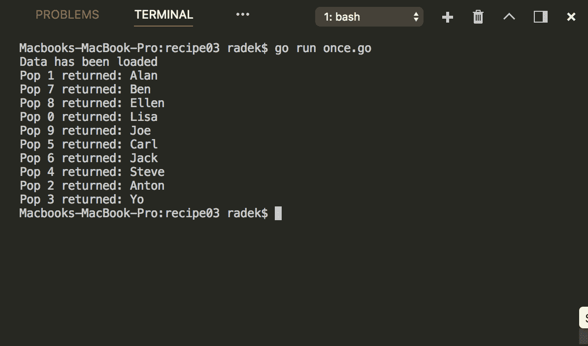

# 十、并发性带来的乐趣

本章包含以下配方：

*   使用互斥同步对资源的访问
*   为并发访问创建映射
*   只运行一次代码块
*   跨多个 goroutine 共享资源
*   将 goroutines 与 WaitGroup 同步
*   从多个来源获得最快的结果
*   使用 errgroup 传播错误

# 介绍

并发行为的编程总是很困难的。Go 有很好的机制来管理通道形式的并发性。除了作为同步机制的通道外，Go 标准库还提供了处理更传统核心方式的并发部分的包。本章介绍如何利用同步包来实现常见的同步任务。最终配方将显示一组 goroutine 的错误传播的简化。

检查 Go 是否正确安装。*[第一章](01.html)**与环境互动*中*取回戈朗版*配方中的*准备*部分将帮助您。

确保端口`8080`和`7070`未被其他应用程序使用。

# 使用互斥同步对资源的访问

如果代码使用对任何被认为不安全的资源的并发访问，则有必要实现同步机制以确保访问的安全。除了通道使用之外，还可以利用互斥来实现这一目的。这个食谱会告诉你怎么做。

# 怎么做。。。

1.  打开控制台，创建文件夹`chapter10/recipe01`。
2.  导航到该目录。
3.  创建具有以下内容的文件`mutex.go`：

```go
        package main

        import (
          "fmt"
          "sync"
        )

        var names = []string{"Alan", "Joe", "Jack", "Ben",
                             "Ellen", "Lisa", "Carl", "Steve",
                             "Anton", "Yo"}

        type SyncList struct {
          m sync.Mutex
          slice []interface{}
        }

        func NewSyncList(cap int) *SyncList {
          return &SyncList{
            sync.Mutex{},
            make([]interface{}, cap),
          }
        }

        func (l *SyncList) Load(i int) interface{} {
          l.m.Lock()
          defer l.m.Unlock()
          return l.slice[i]
        }

        func (l *SyncList) Append(val interface{}) {
          l.m.Lock()
          defer l.m.Unlock()
          l.slice = append(l.slice, val)
        }

        func (l *SyncList) Store(i int, val interface{}) {
          l.m.Lock()
          defer l.m.Unlock()
          l.slice[i] = val
        }

        func main() {

          l := NewSyncList(0)
          wg := &sync.WaitGroup{}
          wg.Add(10)
          for i := 0; i < 10; i++ {
            go func(idx int) {
              l.Append(names[idx])
              wg.Done()
            }(i)
          }
          wg.Wait()

          for i := 0; i < 10; i++ {
            fmt.Printf("Val: %v stored at idx: %d\n", l.Load(i), i)
          }

        }
```

4.  通过`go run mutex.go`执行代码。

5.  请参见输出：


# 它是如何工作的。。。

同步原语`Mutex`由包`sync`提供。`Mutex`在安全区域或资源上方起到锁的作用。一旦`goroutine`调用`Mutex`上的`Lock`且`Mutex`处于解锁状态，则`Mutex`将被锁定，`goroutine`将以独占方式访问关键区段。如果`Mutex`处于锁定状态，`goroutine`调用`Lock`方法。此`goroutine`被阻止，需要等待`Mutex`再次解锁

请注意，在本例中，我们使用`Mutex`来同步对切片原语的访问，这对于并发使用是不安全的。

重要的事实是`Mutex`在首次使用后无法复制。

# 为并发访问创建映射

应将 Golang 中的 map 原语视为不安全的并发访问。在前面的方法中，我们描述了如何使用互斥来同步对资源的访问，互斥也可以通过访问 map 原语来利用。但是 Go 标准库也提供了为并发访问而设计的映射结构。这个食谱将说明如何使用它。

# 怎么做。。。

1.  打开控制台，创建文件夹`chapter10/recipe02`。
2.  导航到该目录。
3.  创建具有以下内容的文件`map.go`：

```go
        package main

        import (
          "fmt"
          "sync"
        )

        var names = []string{"Alan", "Joe", "Jack", "Ben",
                             "Ellen", "Lisa", "Carl", "Steve",
                             "Anton", "Yo"}

        func main() {

          m := sync.Map{}
          wg := &sync.WaitGroup{}
          wg.Add(10)
          for i := 0; i < 10; i++ {
            go func(idx int) {
              m.Store(fmt.Sprintf("%d", idx), names[idx])
              wg.Done()
            }(i)
          }
          wg.Wait()

          v, ok := m.Load("1")
          if ok {
            fmt.Printf("For Load key: 1 got %v\n", v)
          }

          v, ok = m.LoadOrStore("11", "Tim")
          if !ok {
            fmt.Printf("Key 11 missing stored val: %v\n", v)
          }

          m.Range(func(k, v interface{}) bool {
            key, _ := k.(string)
            t, _ := v.(string)
            fmt.Printf("For index %v got %v\n", key, t)
```

```go
            return true
          })

        }
```

4.  通过`go run map.go`执行代码。
5.  请参见输出：


# 它是如何工作的。。。

包`sync`包含结构`Map`，设计用于从多个 Go 例程同时使用。`Map`结构及其方法模拟贴图原语的行为。`Store`方法等同于`m[key] = val`语句。`Load`方法等于`val, ok := m[key]`，而`Range`方法提供了遍历地图的能力。请注意，`Range`功能在`Map`的当前状态下工作，因此，如果在运行`Range`方法的过程中更改了值，则会反映这些更改，但前提是尚未访问该键。`Range`功能只访问其按键一次。

# 只运行一次代码块

当多个 goroutine 运行相同的代码并且有一个代码块初始化（例如，共享资源）时，Go 标准库提供了解决方案，这将进一步描述。

# 怎么做。。。

1.  打开控制台，创建文件夹`chapter10/recipe03`。
2.  导航到该目录。
3.  创建具有以下内容的文件`once.go`：

```go
        package main

        import (
          "fmt"
          "sync"
        )

        var names = []interface{}{"Alan", "Joe", "Jack", "Ben",
                                  "Ellen", "Lisa", "Carl", "Steve",
                                  "Anton", "Yo"}

        type Source struct {
          m *sync.Mutex
          o *sync.Once
          data []interface{}
        }

        func (s *Source) Pop() (interface{}, error) {
          s.m.Lock()
          defer s.m.Unlock()
          s.o.Do(func() {
            s.data = names
            fmt.Println("Data has been loaded.")
          })
          if len(s.data) > 0 {
            res := s.data[0]
            s.data = s.data[1:]
            return res, nil
          }
          return nil, fmt.Errorf("No data available")
        }

        func main() {

          s := &Source{&sync.Mutex{}, &sync.Once{}, nil}
          wg := &sync.WaitGroup{}
          wg.Add(10)
          for i := 0; i < 10; i++ {
            go func(idx int) {
              // This code block is done only once
              if val, err := s.Pop(); err == nil {
                fmt.Printf("Pop %d returned: %s\n", idx, val)
              }
              wg.Done()
            }(i)
          }
          wg.Wait()
        }
```

4.  通过`go run once.go`执行代码。
5.  请参见输出：



# 它是如何工作的。。。

示例代码说明了访问容器结构时数据的延迟加载。由于数据只需加载一次，所以在方法`Pop`中使用同步包中的`Once`结构。`Once`只实现了一个名为`Do`的方法，该方法使用`func`而不带任何参数，并且在执行过程中，每个`Once`实例只执行一次函数。

`Do`方法调用块，直到第一次运行完成。这一事实与`Once`拟用于初始化的事实相符。

# 跨多个 goroutine 共享资源

资源池是提高性能和节省资源的传统方法。通常，通过昂贵的初始化来集中资源是值得的。Go 标准库为资源池提供了框架结构，对于多个 Goroutine 访问来说，资源池被认为是安全的。这个食谱描述了如何使用它。

# 怎么做。。。

1.  打开控制台，创建文件夹`chapter10/recipe04`。
2.  导航到该目录。
3.  创建具有以下内容的文件`pool.go`：

```go
        package main

        import "sync"
        import "fmt"
        import "time"

        type Worker struct {
          id string
        }

        func (w *Worker) String() string {
          return w.id
        }

        var globalCounter = 0

        var pool = sync.Pool{
          New: func() interface{} {
            res := &Worker{fmt.Sprintf("%d", globalCounter)}
            globalCounter++
            return res
          },
        }

        func main() {
          wg := &sync.WaitGroup{}
          wg.Add(10)
          for i := 0; i < 10; i++ {
            go func(idx int) {
              // This code block is done only once
              w := pool.Get().(*Worker)
              fmt.Println("Got worker ID: " + w.String())
              time.Sleep(time.Second)
              pool.Put(w)
              wg.Done()
            }(i)
          }
          wg.Wait()
        }
```

4.  通过`go run pool.go`执行代码。
5.  请参见输出：


# 它是如何工作的。。。

`sync`包包含用于共享资源的结构。`Pool`结构具有`Get`和`Put`方法来检索资源并将其放回池中。`Pool`结构被认为是并发访问的安全结构。

创建`Pool`结构时，需要设置`New`字段。`New`字段是一个无参数函数，应该返回指向池项目的指针。如果池中的新对象需要初始化，则调用此函数。

从前面示例的日志中注意，`Worker`在返回池时被重用。重要的事实是，对于`Get`检索到的项目和`Put`方法返回的项目，不应该有任何假设（就像我刚才将三个对象放入池中，所以至少有三个可用）。这主要是因为`Pool`中的闲置项目可以随时自动移除。

如果资源初始化成本很高，那么资源池通常是值得的。尽管如此，资源管理还是带来了一些额外的成本。

# 将 goroutines 与 WaitGroup 同步

在处理并发运行的代码分支时，程序在某些时候需要等待代码的部分并发运行，这也不例外。此食谱提供了如何使用`WaitGroup`等待运行 goroutines 的详细信息

# 怎么做。。。

1.  打开控制台，创建文件夹`chapter10/recipe05`。
2.  导航到该目录。
3.  创建具有以下内容的文件`syncgroup.go`：

```go
        package main

        import "sync"
        import "fmt"

        func main() {
          wg := &sync.WaitGroup{}
          for i := 0; i < 10; i++ {
            wg.Add(1)
            go func(idx int) {
              // Do some work
              defer wg.Done()
              fmt.Printf("Exiting %d\n", idx)
            }(i)
          }
          wg.Wait()
          fmt.Println("All done.")
        }
```

4.  通过`go run syncgroup.go`执行代码。
5.  请参见输出：


# 它是如何工作的。。。

借助于`sync`包中的`WaitGroup`结构，程序运行可以等待有限数量的 goroutine 完成。`WaitGroup`结构实现了`Add`方法来添加要等待的 goroutine 数量。然后在 goroutine 完成后，应该调用`Done`方法来减少要等待的 goroutine 的数量。方法`Wait`作为块调用，直到完成给定数量的`Done`调用为止（通常在`goroutine`末尾）。`WaitGroup`的使用方式应与同步包中的所有同步原语相同。创建对象后，不应复制结构。

# 从多个来源获得最快的结果

例如，在某些情况下，当集成来自多个源的信息检索时，您只需要第一个结果，最快的一个，而其他结果在这之后是不相关的。现实世界的一个例子可能是提取货币汇率来计算价格。您有多个第三方服务，因为您需要尽快显示价格，所以您只需要从任何服务收到的第一流服务。本食谱将展示如何实现此类行为的模式。

# 怎么做。。。

1.  打开控制台，创建文件夹`chapter10/recipe06`。
2.  导航到该目录。
3.  创建具有以下内容的文件`first.go`：

```go
        package main

        import (
          "context"
          "fmt"
          "sync"
          "time"
        )

        type SearchSrc struct {
          ID string
          Delay int
        }

        func (s *SearchSrc) Search(ctx context.Context) <-chan string {
          out := make(chan string)
          go func() {
            time.Sleep(time.Duration(s.Delay) * time.Second)
            select {
              case out <- "Result " + s.ID:
              case <-ctx.Done():
              fmt.Println("Search received Done()")
            }
            close(out)
            fmt.Println("Search finished for ID: " + s.ID)
          }()
          return out
        }

        func main() {

          ctx, cancel := context.WithCancel(context.Background())

          src1 := &SearchSrc{"1", 2}
          src2 := &SearchSrc{"2", 6}

          r1 := src1.Search(ctx)
          r2 := src2.Search(ctx)

          out := merge(ctx, r1, r2)

          for firstResult := range out {
            cancel()
            fmt.Println("First result is: " + firstResult)
          }
        }

        func merge(ctx context.Context, results ...<-chan string)
                   <-chan string {
          wg := sync.WaitGroup{}
          out := make(chan string)

          output := func(c <-chan string) {
            defer wg.Done()
            select {
              case <-ctx.Done():
                fmt.Println("Received ctx.Done()")
              case res := <-c:
              out <- res
            }
          }

          wg.Add(len(results))
          for _, c := range results {
            go output(c)
          }

          go func() {
            wg.Wait()
            close(out)
          }()
          return out
        }
```

4.  通过`go run first.go`执行代码。
5.  请参见输出：


# 它是如何工作的。。。

前面的代码提出了执行多个任务并输出一些结果的解决方案，我们只需要第一个最快的任务。一旦获得第一个结果，该解决方案使用带有 cancel 函数的`Context`调用 cancel。`SearchSrc`结构提供了`Search`方法，该方法产生一个写入结果的通道。注意，`Search`方法通过`time.Sleep`功能模拟延迟。对于`Search`方法中的每个通道，合并功能触发写入`main`方法中读取的最终输出通道的`goroutine`。当从`merge`函数产生的输出通道接收第一个结果时，调用存储在变量`cancel`中的`CancelFunc`以取消其余的处理

注意`Search`方法仍然需要结束，即使其结果不会被处理；因此，需要对此进行处理，以避免`goroutine`和通道泄漏。

# 使用 errgroup 传播错误

此配方将演示如何轻松使用 errgroup 扩展包在一个公共任务中检测运行子任务的 goroutine 组中的错误。

# 怎么做。。。

1.  打开控制台，创建文件夹`chapter10/recipe07`。
2.  导航到该目录。
3.  创建具有以下内容的文件`lines.go`：

```go
        package main

        import (
          "bufio"
          "context"
          "fmt"
          "log"
          "strings"

          "golang.org/x/sync/errgroup"
        )

        const data = `line one
        line two with more words
        error: This is erroneous line`

        func main() {
          log.Printf("Application %s starting.", "Error Detection")
          scanner := bufio.NewScanner(strings.NewReader(data))
          scanner.Split(bufio.ScanLines)

          // For each line fire a goroutine
          g, _ := errgroup.WithContext(context.Background())
          for scanner.Scan() {
            row := scanner.Text()
            g.Go(func() error {
              return func(s string) error {
                if strings.Contains(s, "error:") {
                  return fmt.Errorf(s)
                }
                return nil
              }(row)
            })
          }

          // Wait until the goroutines finish
          if err := g.Wait(); err != nil {
```

```go
            fmt.Println("Error while waiting: " + err.Error())
          }

        }
```

4.  通过`go run lines.go`执行代码。
5.  请参见输出：


# 它是如何工作的。。。

`golang.org/x/sync/errgroup`包有助于简化 goroutine 组的错误传播和上下文取消。`Group`包含使用返回`error`的 no arg 函数的 Go 方法。此功能应包含执行的`goroutine`应完成的任务。来自`errgroup`的`Group`的`Wait`方法等待 Go 方法执行的所有任务完成，如果其中任何任务返回`err`，则返回第一个非零错误。通过这种方式，可以简单地从正在运行的 goroutine 组传播错误。

注意，`Group`也是使用上下文创建的。如果发生错误，`Context`作为取消其他任务的机制。`goroutine`函数返回`error`后，内部实现取消上下文，因此可能是正在运行的任务。