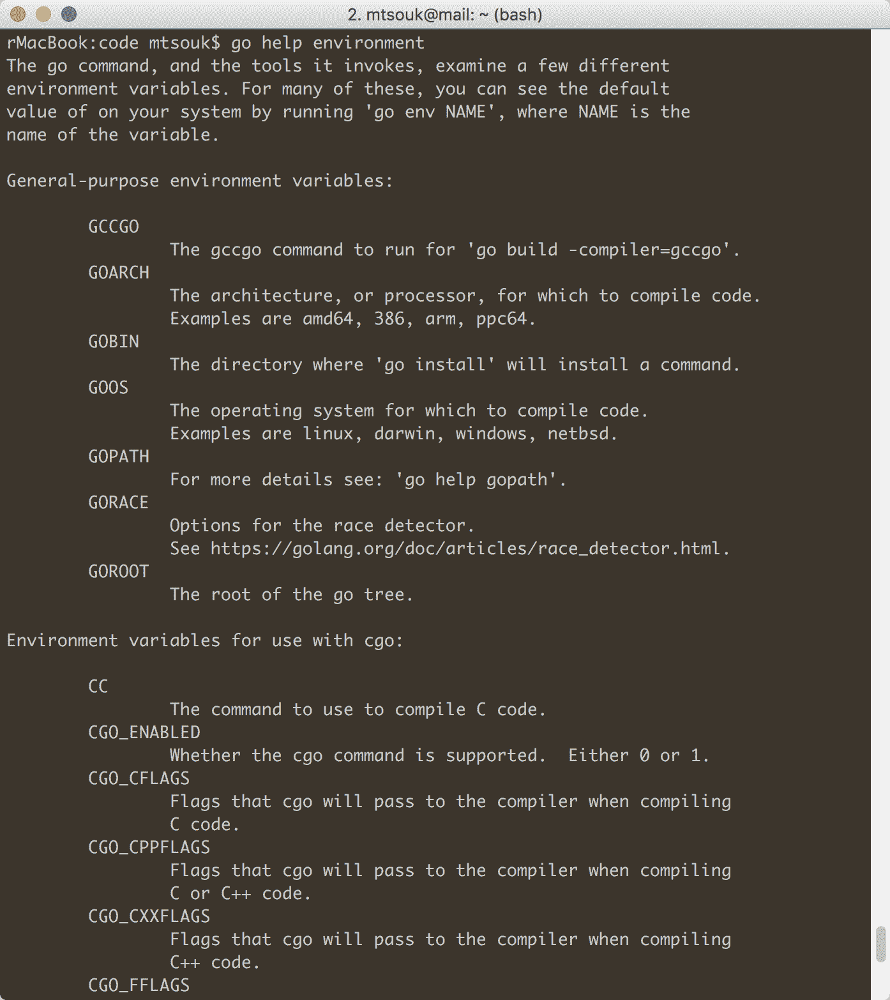

# 用 Go 编写程序

本章将讨论许多重要、有趣和方便的主题，这些主题将帮助您提高工作效率。我认为从编译和运行上一章中`hw.go`程序的 Go 代码开始本章是个好主意。然后，您将学习如何处理 Go 可以使用的环境变量，如何处理 Go 程序的命令行参数，以及如何在屏幕上打印输出并从用户处获取输入。最后，您将看到如何在 Go 中定义函数，了解极其重要的`defer`关键字，查看 Go 附带的数据结构，并在检查生成随机数的代码之前了解 Go 接口。

因此，在本章中，您将熟悉许多围棋概念，包括以下内容：

*   编译围棋程序
*   围棋环境变量
*   使用给定给 Go 程序的命令行参数
*   获取用户输入并在屏幕上打印输出
*   Go 函数和`defer`关键字
*   Go 数据结构和接口
*   创建随机数

# 编译 Go 代码

Go 不关心自治程序的源文件名，只要包名为`main`且其中有`main()`函数即可。这是因为`main()`函数是程序开始执行的地方。这也意味着在单个项目的文件中不能有多个`main()`函数。

运行围棋程序有两种方法：

*   第一个，`go run`只执行 Go 代码，不生成任何新文件，只生成一些临时文件，这些文件随后被删除
*   第二种方式，`go build`编译代码，生成可执行文件，并等待您运行可执行文件

本书是在苹果 Mac OS Sierra 系统上使用自制软件（[编写的 https://brew.sh/](https://brew.sh/) Go 版本。但是，如果您有一个相对较新的 Go 版本，那么在大多数 Linux 和 FreeBSD 系统上编译和运行所提供的 Go 代码应该不会有任何困难。

因此，第一种方法如下：

```go
$ go run hw.go
Hello World!  
```

上述方法允许 Go 用作脚本语言。以下是第二种方式：

```go
$ go build hw.go
$ file hw
hw: Mach-O 64-bit executable x86_64
```

生成的可执行文件以 Go 源文件的名称命名，这比 C 编译器生成的可执行文件的默认文件名`a.out`要好得多。

如果代码中存在错误，例如调用 Go 函数时 Go 程序包名称拼写错误，则会收到以下类型的错误消息：

```go
$ go run hw.go
# command-line-arguments
./hw.go:3: imported and not used: "fmt"
./hw.go:7: undefined: mt in mt.Println
```

如果您意外拼错了`main()`函数，您将收到以下错误消息，因为自动 Go 程序的执行从`main()`函数开始：

```go
$ go run hw.go
# command-line-arguments
runtime.main_main f: relocation target main.main not defined
runtime.main_main f: undefined: "main.main"
```

最后，我想向您展示一条错误消息，让您了解 Go 的格式规则：

```go
$ cat hw.gocat 
package main

import "fmt"

func main()
{
      fmt.Println("Hello World!")
}
$ go run hw.go
# command-line-arguments
./hw.go:6: syntax error: unexpected semicolon or newline before {

```

前面的错误信息告诉我们，GO 更喜欢用某种方式来放置大括号，而大多数编程语言（如 Perl、C 和 C++）则不是这样。这在一开始看起来可能令人沮丧，但它节省了额外的一行代码，并使您的程序更具可读性。请注意，前面的代码使用了*Allman 格式样式*，Go 不接受该样式。

对此错误的官方解释是，Go 要求在许多上下文中使用分号作为语句终止符，并且编译器在认为必要时自动插入所需的分号，在本例中，分号位于非空行的末尾。因此，将大括号（`{`）放在自己的行上会使 Go 编译器在前一行的末尾放一个分号，从而产生错误消息。

如果您认为`gofmt`工具可以避免类似错误，您会失望：

```go
$ gofmt hw.go
hw.go:6:1: expected declaration, found '{'

```

Go 编译器还有另一条规则，如您在以下输出中所见：

```go
$ go run afile.go
# command-line-arguments
./afile.go:4: imported and not used: "net"
```

这意味着您不应该在没有在程序中实际使用包的情况下导入包。虽然这可能是一条无害的警告消息，但您的 Go 程序不会被编译。请记住，类似的警告和错误消息很好地表明您遗漏了某些内容，您应该尝试更正它们。如果您将警告和错误视为相同的，那么您将创建更高质量的代码。

# 检查可执行文件的大小

因此，在成功编译`hw.go`之后，您可能需要检查生成的可执行文件的大小：

```go
$ ls -l hw
-rwxr-xr-x  1 mtsouk  staff  1628192 Feb  9 22:29 hw
$ file hw
hw: Mach-O 64-bit executable x86_64  
```

在 Linux 机器上编译相同的 Go 程序将创建以下文件：

```go
$ go versiongo 
go version go1.3.3 linux/amd64
$ go build hw.go
$ ls -l hw
-rwxr-xr-x 1 mtsouk mtsouk 1823712 Feb 18 17:35 hw
$ file hw
hw: ELF 64-bit LSB executable, x86-64, version 1 (SYSV), statically linked, not stripped

```

为了更好地理解 GO 可执行文件的大小，请考虑用 C 编写的同一程序的可执行文件大约是 8432 字节！

所以，您可能会问，为什么这么大的可执行文件适用于这么小的程序？主要原因是 Go 可执行文件是静态构建的，这意味着它们不需要外部库来运行。使用`strip(1)`命令可以使生成的可执行文件变小一点，但不要期待奇迹：

```go
$ strip hw
$ ls -l hw
-rwxr-xr-x  1 mtsouk  staff  1540096 Feb 18 17:41 hw
```

前面的过程与 Go 本身无关，因为`strip(1)`是一个 Unix 命令，用于删除或修改文件的符号表，从而减小其大小。Go 可以自行执行`strip(1)`命令的工作，并创建较小的可执行文件，但这种方法并不总是有效：

```go
$ ls -l hw
-rwxr-xr-x 1 mtsouk mtsouk 1823712 Feb 18 17:35 hw
$ CGO_ENABLED=0 go build -ldflags "-s" -a hw.go
$ ls -l hw
-rwxr-xr-x 1 mtsouk mtsouk 1328032 Feb 18 17:44 hw
$ file hw
hw: ELF 64-bit LSB executable, x86-64, version 1 (SYSV), statically linked, stripped
```

前面的输出来自 Linux 机器；在 macOS 机器上使用相同的编译命令时，对可执行文件的大小没有影响。

# 围棋环境变量

`go tool`可以使用许多专门用于 Go 的 Unix shell 环境变量，包括`GOROOT`、`GOHOME`、`GOBIN`和`GOPATH`。最重要的 Go 环境变量是`GOPATH`，它指定了工作区的位置。通常，这是开发 Go 代码时需要定义的唯一环境变量；这与项目文件的组织方式有关。这意味着每个项目将被组织成三个主要目录，分别命名为`src`、`pkg`和`bin`。然而，包括我在内的许多人不喜欢使用`GOPATH`手动组织他们的项目文件。

因此，如果您非常喜欢 shell 变量，您可以将所有这些类型的定义放在`.bashrc`或`.profile`中，这意味着每次登录到 Unix 机器时，这些环境变量都将处于活动状态。如果您没有使用 bashshell，这是默认的 Linux 和 macoshell，那么您可能需要使用另一个启动文件。查看您最喜欢的 Unix shell 的文档，以了解要使用的文件。

接下来的屏幕截图显示了以下命令的部分输出，其中显示了 Go 使用的所有环境变量：

```go
$ go help environment
```



“go help environment”命令的输出

通过执行下一个命令并用您感兴趣的环境变量替换`NAME`，您可以找到有关特定环境变量的其他信息：

```go
$ go env NAME  
```

所有这些环境变量与实际的 Go 代码或程序的执行无关，但它们可能会影响开发环境；因此，如果您在尝试编译 Go 程序时碰巧看到任何奇怪的行为，请检查您正在使用的环境变量。

# 使用命令行参数

命令行参数允许程序获取输入，例如要处理的文件的名称，而无需编写不同版本的程序。因此，如果无法处理传递给它的命令行参数，则无法创建任何有用的系统软件。

下面是一个名为`cla.go`的简单 Go 程序，它打印所有命令行参数，包括可执行文件的名称：

```go
package main 

import "fmt" 
import "os" 

func main() { 
   arguments := os.Args 
   for i := 0; i < len(arguments); i++ { 
         fmt.Println(arguments[i]) 
   } 
} 
```

如您所见，Go 需要一个名为`os`的额外包来读取存储在`os.Args`数组中的程序的命令行参数。如果您不喜欢有多条导入语句，可以将这两条导入语句重写如下，我发现这更容易阅读：

```go
import ( 
   "fmt" 
   "os" 
)
```

当您使用单个导入块导入所有包时，`gofmt`实用程序按字母顺序放置包名。

`cla.go`的 Go 代码很简单，因为它将所有命令行参数存储在一个数组中，并使用`for`循环来打印它们。正如您将在接下来的章节中看到的，`os`包可以做更多的事情。如果您熟悉 C，您应该知道，在 C 中，命令行参数会自动传递给程序，并且不需要包含任何额外的头文件来读取它们。Go 使用了一种不同的方法，它提供了更多的控制，但需要更多的代码。

首先在构建之后执行`cla.go`将创建以下类型的输出：

```go
$ ./cla 1 2 three
./cla
1
2
three
```

# 查找命令行参数的总和

现在，让我们尝试一些不同且棘手的方法：您将尝试查找给定给 Go 程序的命令行参数的摘要。因此，您将把命令行参数视为数字。尽管主要思想保持不变，但实现完全不同，因为您必须将命令行参数转换为数字。Go 程序的名称为`addCLA.go`，可分为两部分。

第一部分是该计划的序言：

```go
package main 

import ( 
   "fmt" 
   "os" 
   "strconv" 
) 
```

您需要用于打印输出的`fmt`包和用于读取命令行参数的`os`包。由于命令行参数存储为字符串，您还需要`srtconv`包将它们转换为整数。

第二部分是`main()`功能的实现：

```go
func main() { 
   arguments := os.Args 
   sum := 0 
   for i := 1; i < len(arguments); i++ { 
         temp, _ := strconv.Atoi(arguments[i]) 
         sum = sum + temp 
   } 
   fmt.Println("Sum:", sum) 
} 
```

`strconv.Atoi()`函数返回两个值：第一个是整数，前提是转换成功，第二个是错误变量。

请注意，大多数 Go 函数都返回一个错误变量，应始终检查该变量，尤其是在生产软件上。

如果不使用`strconv.Atoi()`功能，则会出现两个问题：

*   首先，程序将尝试使用字符串执行加法，这是一种数学运算
*   第二个问题是，您无法判断命令行参数是否为有效整数，这可以通过检查返回值`strconv.Atoi()`来完成

因此，`strconv.Atoi()`不仅可以完成所需的工作，还可以告诉我们给定的参数是否为有效整数，这一点同样重要，因为它允许我们以不同的方式处理不适当的参数。

在`addCLA.go`中发现的另一个关键 Go 代码是使用模式匹配忽略`strconv.Atoi()`函数中错误变量值的代码。`_`字符在 Go 模式匹配术语中表示“匹配所有内容”，但不保存在任何变量中。

Go 支持四种不同大小的有符号和无符号整数，分别命名为 int8、int16、int32、int64、uint8、uint16、uint32 和 uint64。然而，Go 还有`int`和`uint`，它们是当前平台中最有效的有符号和无符号整数。因此，如有疑问，请使用`int`或`uint`。

使用正确类型的命令行参数执行`addCLA.go`将创建以下输出：

```go
$ go run addCLA.go 1 2 -1 -3
Sum: -1
$ go run addCLA.go
Sum: 0
```

好的是，`addCLA.go`在没有任何争论的情况下不会崩溃，而不需要你去处理。然而，更有趣的是，看看程序如何处理错误输入，因为您永远无法假设您将获得正确类型的输入：

```go
$ go run addCLA.go !
Sum: 0
$ go run addCLA.go ! -@
Sum: 0
$ go run addCLA.go ! -@ 1 2
Sum: 3
```

如您所见，如果程序得到错误类型的输入，它不会崩溃，也不会在计算中包含错误的输入。这里的一个主要问题是`addCLA.go`没有打印任何警告消息，让用户知道他们的一些输入被忽略了。这种危险的代码会创建不稳定的可执行文件，当输入类型错误时，可能会产生安全问题。因此，这里的一般建议是，您永远不要期望或依赖 Go 编译器，或任何其他编译器或程序来处理这些事情，因为这是您的工作。

[第 3 章](03.html)、*高级围棋功能*将更详细地讨论围棋中的错误处理，并将呈现先前程序的更好、更安全的版本。现在，我们都应该很高兴，我们可以证明我们的程序不会因为任何输入而崩溃。

虽然这不是一个完美的情况，但如果您知道您的程序在某些给定类型的输入中不能按预期工作，也不是那么糟糕。糟糕的是，开发人员不知道存在某些类型的输入会导致程序失败，因为您无法纠正您不相信或不认识到的错误。

尽管处理命令行参数看起来很简单，但如果您的命令行实用程序支持大量选项和参数，它可能会变得相当复杂。[第 5 章](05.html)*文件和目录*将详细介绍如何使用`flag`标准 Go 包处理命令行选项、参数和参数。

# 用户输入和输出

根据 Unix 原理，当程序成功完成其工作时，它不会生成任何输出。然而，由于许多原因，并非所有程序都能成功完成，它们需要通过打印适当的消息来通知用户它们的问题。此外，一些系统工具需要从用户那里获得输入，以便决定如何处理可能出现的情况。

Go user input and output 的主角是`fmt`包，本节将从最简单的任务开始，向您展示如何执行这两项任务。

了解更多关于`fmt`软件包的信息最好的地方是它的文档页面，可以在[上找到 https://golang.org/pkg/fmt/](https://golang.org/pkg/fmt/) 。

# 获取用户输入

除了使用命令行参数获取用户输入（这是系统编程中的首选方法）之外，还有一些方法可以请求用户输入。

当与`-i`选项一起使用时，`rm(1)`和`mv(1)`命令就是两个这样的例子：

```go
$ touch aFile
$ rm -i aFile
remove aFile? y
$ touch aFile
$ touch ../aFile
$ mv -i ../aFile .
overwrite ./aFile? (y/n [n]) y
```

因此，本节将向您展示如何通过让您的程序理解`-i`参数，而不实际实现`rm(1)`或`mv(1)`的功能，来模拟 Go 代码中以前的行为。

获取用户输入的最简单的函数称为`fmt.Scanln()`并读取整行。获取用户输入的其他功能包括`fmt.Scan()`、`fmt.Scanf()`、`fmt.Sscanf()`、`fmt.Sscanln()`和`fmt.Sscan()`。

然而，在围棋中有一种更先进的方式来获取用户的输入；它涉及到`bufio`包的使用。然而，使用`bufio`包从用户那里获得简单的响应有点过分了。

`parameter.go`的 Go 代码如下：

```go
package main 

import ( 
   "fmt" 
   "os" 
   "strings" 
) 

func main() { 
   arguments := os.Args 
   minusI := false 
   for i := 0; i < len(arguments); i++ { 
         if strings.Compare(arguments[i], "-i") == 0 { 
               minusI = true 
               break 
         } 
   } 

   if minusI { 
         fmt.Println("Got the -i parameter!") 
         fmt.Print("y/n: ") 
         var answer string 
         fmt.Scanln(&answer) 
         fmt.Println("You entered:", answer) 
   } else { 
         fmt.Println("The -i parameter is not set") 
   } 
} 
```

给出的代码并不特别聪明。它只是使用`for`循环访问所有命令行参数，并检查当前参数是否等于`-i`字符串。一旦在`strings.Compare()`函数的帮助下找到匹配项，它会将`minusI`变量的值从 false 更改为 true。然后，由于不需要进一步查看，它使用一个`break`语句退出`for`循环。如果给出了`-i`参数，`if`语句块要求用户使用`fmt.Scanln()`功能输入`y`或`n`。

注意，`fmt.Scanln()`函数使用指向`answer`变量的指针。由于 Go 通过值传递其变量，因此我们必须在此处使用指针引用，以便将用户输入保存到`answer`变量。一般来说，从用户处读取数据的函数往往以这种方式工作。

执行`parameter.go`创建以下类型的输出：

```go
$ go run parameter.go
The -i parameter is not set
$ go run parameter.go -i
Got the -i parameter!
y/n: y
You entered: y
```

# 打印输出

在 Go 中打印内容的最简单方法是使用`fmt.Println()`和`fmt.Printf()`函数。`fmt.Printf()`函数与 C`printf(3)`函数有许多相似之处。您也可以使用`fmt.Print()`功能代替`fmt.Println()`。

`fmt.Print()`和`fmt.Println()`之间的主要区别在于，后者在每次调用时自动打印一个换行符。`fmt.Println()`和`fmt.Printf()`之间最大的区别在于后者需要一个格式说明符，用于打印所有内容，就像 C`printf(3)`函数一样。这意味着您可以更好地控制您正在做的事情，但您必须编写更多的代码。Go 调用这些说明符**动词**，您可以在[找到更多关于受支持动词的信息 https://golang.org/pkg/fmt/](https://golang.org/pkg/fmt/) 。

# 围棋功能

函数是每种编程语言的一个重要元素，因为它们允许您将大型程序分解为更小、更易于管理的部分，但它们必须尽可能相互独立，并且必须完成一项工作，而且只能完成一项工作。因此，如果您发现自己编写的函数可以做多个事情，那么您可能需要考虑编写多个函数。然而，Go 不会拒绝编译长、复杂或做多种事情的函数。

当您发现自己在程序中多次使用相同的 Go 代码时，您需要创建一个新函数。类似地，当您发现自己在大多数程序中始终使用相同的函数时，您需要将一些函数放入模块中的安全指示。

唯一最流行的围棋功能是`main()`，它可以在每个自主围棋程序中找到。如果您查看`main()`函数的定义，您很快就会意识到 Go 中的函数声明是以`func`关键字开头的。

根据经验，您必须尝试编写少于 20-30 行 Go 代码的函数。使用较小的函数的一个好的副作用是，它们可以更容易地进行优化，因为您可以清楚地找到瓶颈所在。

# 命名 Go 函数的返回值

与 C 不同，Go 允许您命名 Go 函数的返回值。此外，当此类函数具有不带任何参数的 return 语句时，该函数将自动返回每个命名返回值的当前值。请注意，此类函数按照在函数定义中声明的顺序返回其值。

命名返回值是一个非常方便的 Go 功能，它可以帮助您避免各种类型的 bug，所以请使用它。

我个人的建议是：命名函数的返回值，除非有很好的理由不这样做。

# 匿名函数

匿名函数可以在线定义，不需要名称，它们通常用于实现需要少量代码的事情。在 Go 中，函数可以返回匿名函数或将匿名函数作为其参数之一。此外，匿名函数可以附加到 Go 变量。

对于匿名函数来说，一个小的实现和本地使用被认为是一个很好的实践。如果匿名函数没有本地使用，那么您可能需要考虑使其成为常规函数。

当一个匿名函数适合一项工作时，它会非常方便，让你的生活更轻松；只是在没有充分理由的情况下，不要在程序中使用太多匿名函数。

# 演示 Go 函数

本小节将展示使用`functions.go`程序 Go 代码的先前类型函数的示例。程序的第一部分包含预期的序言和`unnamedMinMax()`功能的实现：

```go
package main 

import ( 
   "fmt" 
) 

func unnamedMinMax(x, y int) (int, int) { 
   if x > y { 
         min := y 
         max := x 
         return min, max 
   } else { 
         min := x 
         max := y 
         return min, max 
   } 
} 
```

`unnamedMinMax()`函数是一个正则函数，它以两个整数作为输入，分别命名为`x`和`y`。它使用`return`语句返回两个整数作为输出。

`functions.go`的下一部分定义了另一个函数，但这次使用命名的返回值，称为`min`和`max`：

```go
func minMax(x, y int) (min, max int) { 
   if x > y { 
         min = y 
         max = x 
   } else { 
         min = x 
         max = y 
   } 
   return min, max 
} 
```

下一个函数是`minMax()`的改进版本，因为您不必显式定义 return 语句的返回变量：

```go
func namedMinMax(x, y int) (min, max int) { 
   if x > y { 
         min = y 
         max = x 
   } else { 
         min = x 
         max = y 
   } 
   return 
} 
```

但是，通过查看`namedMinMax()`函数的定义，您可以很容易地发现将返回哪些值。`namedMinMax()`函数将按该顺序返回`min`和`max`的当前值。

下一个函数显示如何在不使用临时变量的情况下对两个整数进行排序：

```go
func sort(x, y int) (int, int) { 
   if x > y { 
         return x, y 
   } else { 
         return y, x 
   } 
} 
```

前面的代码还显示了 Go 函数可以返回多个值是多么方便。`functions.go`的最后一部分包含`main()`功能；这可以从两个部分来解释。

第一部分涉及匿名函数：

```go
 func main() {
   y := 4 
   square := func(s int) int { 
         return s * s 
   } 
   fmt.Println("The square of", y, "is", square(y)) 

   square = func(s int) int { 
         return s + s 
   } 
   fmt.Println("The square of", y, "is", square(y)) 
```

这里，您定义了两个匿名函数：第一个计算给定整数的平方，而第二个将给定整数加倍。这里重要的是，它们都被分配到同一个变量，这是完全错误的，也是一种危险的做法。因此，不恰当地使用匿名函数可能会产生令人讨厌的 bug，因此请格外小心，不要将同一变量分配给不同的匿名函数。

请注意，即使将函数分配给变量，它仍然被视为匿名函数。

`main()`的第二部分使用了一些已定义的函数：

```go
   fmt.Println(minMax(15, 6)) 
   fmt.Println(namedMinMax(15, 6)) 
   min, max := namedMinMax(12, -1) 
   fmt.Println(min, max) 
} 
```

这里有趣的是，您可以使用两个变量，在一条语句中获得`namedMinMax()`函数的两个返回值。

执行`functions.go`生成以下输出：

```go
$ go run functions.go
The square of 4 is 16
The square of 4 is 8
6 15
6 15
-1 12
```

下一节将展示更多结合了`defer`关键字的匿名函数示例。

# defer 关键字

`defer`关键字延迟函数的执行，直到周围函数返回，广泛用于文件 I/O 操作。这是因为它使您不必记住何时关闭打开的文件。

带有说明`defer`用法的 Go 代码的文件称为`defer.go`，它有四个主要部分。

第一部分是预期的序言以及`a1()`功能的定义：

```go
package main 

import ( 
   "fmt" 
) 

func a1() { 
   for i := 0; i < 3; i++ { 
         defer fmt.Print(i, " ") 
   } 
} 
```

在前面的示例中，`defer`关键字与简单的`fmt.Print()`语句一起使用。

第二部分是`a2()`功能的定义：

```go
func a2() { 
   for i := 0; i < 3; i++ { 
         defer func() { fmt.Print(i, " ") }() 
   } 
} 
```

在`defer`关键字之后，有一个匿名函数没有附加到变量，这意味着`for`循环结束后，匿名函数将自动消失。提供的匿名函数不接受任何参数，但在`fmt.Print()`语句中使用`i`局部变量。

下一部分定义了`a3()`函数，其 Go 代码如下：

```go
func a3() { 
   for i := 0; i < 3; i++ { 
         defer func(n int) { fmt.Print(n, " ") }(i) 
   } 
} 
```

这一次，匿名函数需要一个名为`n`的整数参数，该参数的值取自`i`变量。

`defer.go`的最后一部分是`main()`功能的实现：

```go
func main() { 
   a1() 
   fmt.Println() 
   a2() 
   fmt.Println() 
   a3() 
   fmt.Println() 
} 
```

执行`defer.go`将打印以下内容，这可能会让您一开始感到惊讶：

```go
$ go run defer.go
2 1 0
3 3 3
2 1 0
```

因此，现在是时候通过检查`a1()`、`a2()`和`a3()`执行代码的方式来解释`defer.go`的输出了。输出的第一行验证在返回周围函数后，是否以**后进先出**（**后进先出**顺序执行延迟函数。`a1()`中的`for`循环延迟使用`i`变量当前值的单个函数调用。因此，所有数字都按相反顺序打印，因为`i`最后使用的值是`2`。`a2()`函数是一个棘手的函数，因为由于`defer`的原因，函数体在`for`循环结束后进行求值，而函数体仍然引用局部`i`变量，在当时，对于函数体的所有求值都等于`3`。因此，`a2()`将数字`3`打印三次。简单地说，有三个函数调用使用变量的最后一个值，因为这是传递给函数的内容。然而，`a3()`函数的情况并非如此，因为`i`的当前值作为参数传递给延迟函数，这是由于`a3()`函数定义末尾的`(i)`代码造成的。因此，每次执行延迟函数时，它都有一个不同的`i`值要处理。

由于使用`defer`可能很复杂，您应该编写自己的示例，并在执行实际的 Go 代码之前尝试猜测它们的输出，以确保您的程序按预期运行。试着告诉我们何时计算函数参数，何时实际执行函数体。

您将在[第 6 章](06.html)、*文件输入和输出*中再次看到`defer`关键字的作用。

# 在函数中使用指针变量

**指针**是内存地址，可以提高速度，以换取难以调试的代码和讨厌的 bug。C 程序员对此了解得更多。`pointers.go`文件中说明了 Go 函数中指针变量的使用，该文件可分为两个主要部分。第一部分包含两个函数的定义和一个名为`complex`的新结构：

```go
func withPointer(x *int) { 
   *x = *x * *x 
} 

type complex struct { 
   x, y int 
} 

func newComplex(x, y int) *complex { 
   return &complex{x, y} 
} 
```

第二部分说明了前面的定义在`main()`函数中的用法：

```go
func main() { 
   x := -2 
   withPointer(&x) 
   fmt.Println(x) 

   w := newComplex(4, -5) 
   fmt.Println(*w) 
   fmt.Println(w) 
} 
```

由于`withPointer()`函数使用指针变量，因此不需要返回任何值，因为传递给函数的变量的任何更改都会自动存储在传递的变量中。请注意，您需要将`&`放在变量名前面，以将其作为指针而不是值传递。`complex`结构有两个成员，分别是`x`和`y`，都是整数变量。

另一方面，`newComplex()`函数返回指向`pointers.go`中定义的`complex`结构的指针，该结构需要存储在变量中。为了打印`newComplex()`函数返回的复变量的内容，您需要在其前面加一个`*`字符。

执行`pointers.go`生成以下输出：

```go
$ go run pointers.go
4
{4 -5}
&{4 -5} 
```

我不建议在您使用的库要求之外使用指向业余程序员的指针，因为它们可能会导致问题。但是，随着您经验的增加，您可能希望尝试使用指针，并根据您试图解决的问题决定是否使用它们。

# Go 数据结构

Go 附带了许多方便的**数据结构**，可以帮助您存储自己的数据，包括数组、切片和地图。您应该能够对任何数据结构执行的最重要的任务是以某种方式访问其所有元素。第二个重要任务是，一旦知道某个元素的索引或键，就可以直接访问该元素。最后两个同样重要的任务是插入元素和从数据结构中删除元素。一旦您知道如何执行这四项任务，您就可以完全控制数据结构。

# 阵列

由于其速度快，阵列是最流行的数据结构，几乎所有编程语言都支持阵列。您可以在 Go 中声明数组，如下所示：

```go
myArray := [4]int{1, 2, 4, -4} 
```

如果要声明二维或三维数组，可以使用以下符号：

```go
twoD := [3][3]int{{1, 2, 3}, {4, 5, 6}, {7, 8, 9}} 
threeD := [2][2][2]int{{{1, 2}, {3, 4}}, {{5, 6}, {7, 8}}} 
```

数组每个维度的第一个元素的索引为 0，每个维度的第二个元素的索引为 1，依此类推。访问、分配或打印前三个数组之一的单个元素也很容易：

```go
myArray[0] 
twoD[1][2] = 15 
threeD[0][1][1] = -1

```

访问数组中所有元素的最常见方法是使用`len()`函数查找其大小，然后使用`for`循环。然而，有更酷的方法可以访问数组的所有元素，这些方法涉及到在`for`循环中使用`range`关键字，并允许您绕过`len()`函数的使用，这在处理二维或多维数组时非常方便。

本小节中的所有代码都保存为`arrays.go`，您应该自己查看。运行`arrays.go`创建以下输出：

```go
$ go run arrays.go
1 2 4 -4
0 2 -2 6 7 8
1 2 3 4 5 15 7 8 9
[[1 2] [3 -1]] [[5 6] [7 8]]
```

现在，让我们尝试通过使用以下名为`breakMe.go`的 Go 程序访问一些奇怪的数组元素来打破这种局面，例如索引号不存在的元素或索引号为负的元素：

```go
package main 

import "fmt" 

func main() { 
   myArray := [4]int{1, 2, 4, -4} 
   threeD := [2][2][2]int{{{1, 2}, {3, 4}}, {{5, 6}, {7, 8}}} 
   fmt.Println("myArray[-1]:", myArray[-1])
   fmt.Println("myArray[10]:", myArray[10]) 
   fmt.Println("threeD[-1][20][0]:", threeD[-1][20][0]) 
} 
```

执行`breakMe.go`将生成以下输出：

```go
$ go run breakMe.go
# command-line-arguments
./breakMe.go:8: invalid array index -1 (index must be non-negative)
./breakMe.go:9: invalid array index 10 (out of bounds for 4-element array)
./breakMe.go:10: invalid array index -1 (index must be non-negative)
./breakMe.go:10: invalid array index 20 (out of bounds for 2-element array)
```

Go 考虑可检测为编译器错误的编译器问题，因为这有助于开发工作流程，这也是打印`breakMe.go`的所有越界数组访问错误的原因。

尝试打破现状是一个非常有教育意义的过程，你应该一直尝试。简单地说，知道什么时候不起作用与知道什么时候起作用同样有用。

尽管 Go 阵列非常简单，但它有许多严重的缺点：

*   首先，一旦定义了数组，就不能更改其大小，这意味着 Go 数组不是动态的。简单地说，如果要在没有空间的现有数组中包含一个附加元素，则需要创建一个更大的数组，并将所有元素从旧数组复制到新数组中。
*   其次，当您将数组传递给函数时，实际上是传递了数组的副本，这意味着您对函数内数组所做的任何更改都将在函数完成后丢失。
*   最后，将大型数组传递给函数可能非常慢，主要是因为 Go 必须创建数组的第二个副本。解决所有这些问题的办法是使用切片。

# 片

在许多编程语言中都找不到**切片**的概念，尽管它既聪明又方便。切片与数组有许多相似之处，它允许您克服数组的缺点。

切片具有容量和长度属性，但它们并不总是相同的。切片的长度与具有相同元素数的数组的长度相同，可以使用`len()`函数找到。切片的容量是为该特定切片分配的当前房间，可以通过`cap()`功能找到。由于切片的大小是动态的，如果切片的空间不足，Go 会自动将其当前长度加倍，以便为更多元素腾出空间。

由于切片是通过引用传递给函数的，因此在函数结束后，对函数内部切片所做的任何修改都不会丢失。此外，向函数传递一个大片段要比传递同一数组快得多，因为 Go 不必复制片段；它将只传递 slice 变量的内存地址。

本小节代码保存在`slices.go`中，可分为三个主要部分。

第一部分是前言，以及以`slice`作为输入的两个函数的定义：

```go
package main 

import ( 
   "fmt" 
) 

func change(x []int) { 
   x[3] = -2 
} 

func printSlice(x []int) { 
   for _, number := range x {

         fmt.Printf("%d ", number) 
   } 
   fmt.Println() 
} 
```

请注意，当您在一个切片上使用`range`时，在其迭代中会得到一对值。第一个是索引号，第二个是元素的值。当您只对存储的元素感兴趣时，您可以忽略索引号，就像使用`printSlice()`函数一样。

`change()`函数只是更改输入切片的第四个元素，而`printSlice()`是一个实用函数，用于打印其切片输入变量的内容。在这里，您还可以看到使用`fmt.Printf()`函数打印整数。

第二部分创建一个名为`aSlice`的新切片，并借助您在第一部分中看到的`change()`函数对其进行更改：

```go
func main() { 
   aSlice := []int{-1, 4, 5, 0, 7, 9} 
   fmt.Printf("Before change: ") 
   printSlice(aSlice) 
   change(aSlice) 
   fmt.Printf("After change: ") 
   printSlice(aSlice) 
```

尽管定义填充切片的方式与定义数组的方式有一些相似之处，但最大的区别在于不必声明切片将具有的元素数。

最后一部分说明了 Go 切片的容量属性以及`make()`函数：

```go
   fmt.Printf("Before. Cap: %d, length: %d\n", cap(aSlice), len(aSlice)) 
   aSlice = append(aSlice, -100) 
   fmt.Printf("After. Cap: %d, length: %d\n", cap(aSlice), len(aSlice)) 
   printSlice(aSlice) 
   anotherSlice := make([]int, 4) 
   fmt.Printf("A new slice with 4 elements: ") 
   printSlice(anotherSlice) 
} 
```

`make()`函数会自动将切片的元素初始化为该类型的零值，这可以通过`printSlice`（`anotherSlice`语句的输出进行验证。请注意，使用`make()`函数创建切片时，需要指定切片的元素数。

执行`slices.go`生成以下输出：

```go
$ go run slices.go 
Before change: -1 4 5 0 7 9 
After change: -1 4 5 -2 7 9 
Before. Cap: 6, length: 6 
After. Cap: 12, length: 7 
-1 4 5 -2 7 9 -100 
A new slice with 4 elements: 0 0 0 0 
```

从输出的第三行可以看到，切片的容量和长度在定义时是相同的。然而，在使用`append()`向切片添加新元素后，其长度从`6`到`7`，但其容量加倍，从`6`到`12`。将片容量增加一倍的主要好处是性能更好，因为 Go 不必一直分配内存空间。

您可以从现有数组的元素创建一个切片，并且可以使用`copy()`函数将现有切片复制到另一个切片。这两种操作都有一些棘手的地方，您应该尝试一下。

[第 6 章](06.html)*文件输入和输出*将讨论一种特殊类型的切片，称为字节切片，可用于文件 I/O 操作。

# 地图

Go 中的 Map 数据类型相当于其他编程语言中众所周知的哈希表。maps 的主要优点是，它们几乎可以使用任何数据类型作为索引，在本例中称为**键**。对于要用作键的数据类型，它必须具有可比性。

因此，让我们来看一个示例 GO 程序，名为“EndoT0}”，它将用于说明目的。`maps.go`的第一部分包含您期望的前导 Go 代码：

```go
package main 

import ( 
   "fmt" 
) 

func main() { 

```

然后，您可以定义一个新的空映射，该映射的键为字符串，值为整数，如下所示：

```go
   aMap := make(map[string]int) 
```

在此之后，您可以向`aMap`地图添加新的键和值对，如下所示：

```go
   aMap["Mon"] = 0 
   aMap["Tue"] = 1 
   aMap["Wed"] = 2 
   aMap["Thu"] = 3 
   aMap["Fri"] = 4 
   aMap["Sat"] = 5 
   aMap["Sun"] = 6 
```

然后，可以获取现有密钥的值：

```go
   fmt.Printf("Sunday is the %dth day of the week.\n", aMap["Sun"]) 

```

但是，您可以在现有的`map`上执行的最重要的一个操作在以下 Go 代码中进行了说明：

```go
   _, ok := aMap["Tuesday"] 
   if ok { 
         fmt.Printf("The Tuesday key exists!\n") 
   } else { 
         fmt.Printf("The Tuesday key does not exist!\n") 
   } 
```

前面提到的 Go 代码所做的是使用 Go 的错误处理功能，以便在尝试获取其值之前验证映射的键是否已经存在。这是获取`map`键值的正确且安全的方法，因为请求没有`key`的值将导致返回零。这使您无法确定结果是否为零，因为您请求的`key`不在那里，或者因为具有相应键的元素实际具有零值。

以下 Go 代码显示了如何迭代现有映射的所有键：

```go
   count := 0 
   for key, _ := range aMap { 
         count++ 
         fmt.Printf("%s ", key) 
   } 
   fmt.Printf("\n") 
   fmt.Printf("The aMap has %d elements\n", count) 
```

如果您对访问映射的键和值不感兴趣，只想对其进行计数，那么您可以使用上一个`for`循环的下一个更简单的变体：

```go
   count = 0 
   delete(aMap, "Fri") 
   for _, _ = range aMap { 
         count++ 
   } 
   fmt.Printf("The aMap has now %d elements\n", count) 
```

`main()`函数的最后一部分包含以下 Go 代码，说明了同时定义和初始化映射的替代方法：

```go
   anotherMap := map[string]int{ 
         "One":   1, 
         "Two":   2, 
         "Three": 3, 
         "Four":  4, 
   } 
   anotherMap["Five"] = 5 
   count = 0 
   for _, _ = range anotherMap { 
         count++ 
   } 
   fmt.Printf("anotherMap has %d elements\n", count) 
} 
```

然而，除了不同的初始化之外，所有其他的`map`操作都是完全相同的。执行`maps.go`生成以下输出：

```go
$ go run maps.go
Sunday is the 6th day of the week.
The Tuesday key does not exist!
Wed Thu Fri Sat Sun Mon Tue
The aMap has 7 elements
The aMap has now 6 elements
anotherMap has 5 elements
```

地图是一种非常方便的数据结构，在开发系统软件时很有可能需要它们。

# 将数组转换为映射

本小节将执行一个实际操作，即在事先不知道`array`的大小的情况下将数组转换为地图。`array2map.go`的 Go 代码可分为三个主要部分。第一部分是标准 Go 代码，包括所需的包和`main()`功能的开始：

```go
package main 

import ( 
   "fmt" 
   "strconv" 
) 

func main() { 
```

第二部分实现核心功能，如下所示：

```go
anArray := [4]int{1, -2, 14, 0} 
aMap := make(map[string]int) 

length := len(anArray) 
for i := 0; i < length; i++ { 
   fmt.Printf("%s ", strconv.Itoa(i)) 
   aMap[strconv.Itoa(i)] = anArray[i] 
} 
```

首先定义要使用的`array`变量和`map`变量。`for`循环用于访问所有数组元素并将它们添加到`map`中。`strconv.Itoa()`函数将`array`的索引号转换为字符串。

记住，如果你知道地图的所有键都是连续的正整数，你可以考虑使用数组或片而不是地图阿纳尔 T0。事实上，即使键不是连续的，数组和切片的数据结构也比映射便宜，因此最终可能会得到稀疏矩阵。

最后一部分仅用于打印生成地图的内容，使用了`for`循环的预期范围形式：

```go
for key, value := range aMap {
    fmt.Printf("%s: %d\n", key, value) 
   } 
} 
```

正如您很容易猜到的，开发逆运算并不总是可能的，因为`map`是比`array`更丰富的数据结构。但是，为更强大的数据结构付出的代价是时间，因为阵列操作通常更快。

# 结构

尽管数组、切片和贴图都非常有用，但它们不能在同一位置保存多个值。当您需要对各种类型的变量进行分组并创建一个新的方便类型时，您可以使用一个结构——结构的各种元素称为字段。

本小节代码另存为`dataStructures.go`，可分为三部分。第一部分包含序言和名为`message`的新结构的定义：

```go
package main 

import ( 
   "fmt" 
   "reflect" 
) 

func main() { 

   type message struct {
         X     int 
         Y     int 
         Label string 
   } 
```

消息结构有三个字段，分别为`X`、`Y`和`Label`。请注意，结构通常在程序的开头和`main()`函数之外定义。

第二部分使用消息结构定义了两个新的消息变量，名为`p1`和`p2`。然后，它使用反射来获取关于消息结构的`p1`和`p2`变量的信息：

```go
   p1 := message{23, 12, "A Message"} 
   p2 := message{} 
   p2.Label = "Message 2" 

   s1 := reflect.ValueOf(&p1).Elem() 
   s2 := reflect.ValueOf(&p2).Elem() 
   fmt.Println("S2= ", s2) 
```

最后一部分展示了如何使用`for`循环和`Type()`函数在不知道名称的情况下打印结构的所有字段：

```go
   typeOfT := s1.Type() 
   fmt.Println("P1=", p1) 
   fmt.Println("P2=", p2) 

   for i := 0; i < s1.NumField(); i++ {
         f := s1.Field(i)

         fmt.Printf("%d: %s ", i, typeOfT.Field(i).Name) 
         fmt.Printf("%s = %v\n", f.Type(), f.Interface()) 
   } 

} 
```

运行`dataStructures.go`将产生以下类型的输出：

```go
$ go run dataStructures.go
S2=  {0 0 Message 2}
P1= {23 12 A Message}
P2= {0 0 Message 2}
0: X int = 23
1: Y int = 12
2: Label string = A Message
```

如果`struct`定义的字段名称以小写字母（`x`而不是`X`开头），则上一个程序将失败，并显示以下错误消息：

```go
panic: reflect.Value.Interface: cannot return value obtained from unexported field or method

```

这是因为不会导出小写字段；因此，它们不能被`reflect.Value.Interface()`方法使用。您将在下一章中了解更多关于`reflection`。

# 接口

接口是一种高级 Go 功能，这意味着如果您对 Go 不太满意，您可能不想在程序中使用它们。然而，在开发大型 Go 程序时，接口可能非常实用，这也是本书讨论接口的主要原因。

但首先，我将讨论方法，它们是具有特殊接收器参数的函数。将方法声明为普通函数，并在函数名前显示一个附加参数。此特定参数将函数连接到该额外参数的类型。因此，该参数被称为方法的接收者。稍后您将看到这些函数。

简单地说，接口是抽象类型，它定义了一组需要实现的函数，以便将类型视为接口的实例。当这种情况发生时，我们说类型满足这个接口。因此，接口是两件事——一组方法和一个类型——它用于定义类型的行为。

让我们用一个例子来描述接口的主要优点。假设您有一个名为 ATYPE 的类型和 ATYPE 类型的接口。任何接受 ATYPE 变量的函数都可以接受实现 ATYPE 接口的任何其他变量。

`interfaces.go`的 Go 代码可分为三部分。第一部分内容如下：

```go
package main 

import ( 
   "fmt" 
) 

type coordinates interface { 
   xaxis() int 
   yaxis() int 
} 

type point2D struct { 
   X int 
   Y int 
} 
```

在本部分中，您定义了一个名为坐标的接口和一个名为`point2D`的新结构。该接口有两个功能，分别为`xaxis()`和`yaxis()`。坐标接口的定义是，如果要转换为坐标接口，必须实现这两个函数。

需要注意的是，除了接口本身之外，接口没有声明任何其他特定类型。另一方面，接口的两个函数应说明其返回值的类型。

第二部分具有以下 Go 代码：

```go
func (s point2D) xaxis() int { 
   return s.X 
} 

func (s point2D) yaxis() int { 
   return s.Y 
} 

func findCoordinates(a coordinates) { 
   fmt.Println("X:", a.xaxis(), "Y:", a.yaxis()) 
} 

type coordinate int 

func (s coordinate) xaxis() int { 
   return int(s) 
} 

func (s coordinate) yaxis() int { 
   return 0 
} 
```

在第二部分中，首先为`point2D`类型实现坐标接口的两个功能。然后开发一个名为`findCoordinates()`的函数，该函数接受一个实现坐标接口的变量。`findCoordinates()`函数只需使用一个简单的`fmt.Println()`函数调用打印一个点的两个坐标。然后，定义一个名为“坐标”的新类型，用于属于*x*轴的点。最后，实现坐标类型的坐标接口。

在为`interfaces.go`编写代码的时候，我认为`coordinates`和`coordinate`的名字都很好。在写了上一段之后，我意识到为了更好的可读性，`coordinate`类型可以被重命名为`xpoint`。我留下了名称`coordinates`和`coordinate`以指出每个人都会犯错误，并且必须明智地选择您使用的变量和类型名称。

最后一部分具有以下 Go 代码：

```go
func main() { 

   x := point2D{X: -1, Y: 12}
   fmt.Println(x) 
   findCoordinates(x) 

   y := coordinate(10) 
   findCoordinates(y) 
} 
```

在本部分中，首先创建一个`point2D`变量，并使用`findCoordinates()`函数打印其坐标，然后创建一个名为`y`的坐标变量，该变量保存一个坐标值。最后，使用与打印`point2D`变量相同的`findCoordinates()`函数打印`y`变量。

虽然 Go 不是一种面向对象的编程语言，但在这里我将使用一些面向对象的术语。因此，在面向对象的术语中，这意味着`point2D`和`coordinate`类型都是坐标对象。然而，它们都不是*唯一的*一个`coordinate`对象。

执行`interfaces.go`创建以下输出：

```go
$ go run interfaces.go
{-1 12}
X: -1 Y: 12
X: 10 Y: 0
```

我相信在开发系统软件时，Go 接口是不必要的，但它们是一种方便的 Go 功能，可以使系统应用程序的开发更加可读和简单，因此请毫不犹豫地使用它们。

# 创建随机数

作为一个实际的编程示例，本节将讨论如何在 Go 中创建随机数。随机数有很多用途，包括生成好的密码，以及创建包含随机数据的文件，这些数据可用于测试其他应用程序。但是，请记住，通常编程语言生成的伪随机数近似于真实随机数生成器的属性。

Go 使用`math/rand`包生成随机数，需要种子才能开始生成随机数。种子用于初始化整个过程，这一点非常重要，因为如果总是从同一个种子开始，则始终会得到相同的随机数序列。

`random.go`程序有三个主要部分。第一部分是该计划的序言：

```go
package main 

import ( 
   "fmt" 
   "math/rand" 
   "os" 
   "strconv" 
   "time" 
) 
```

第二部分是`random()`函数的定义，该函数使用`rand.Intn()`Go 函数在每次调用时返回一个随机数：

```go
func random(min, max int) int { 
   return rand.Intn(max-min) + min 
} 
```

`random()`函数的两个参数定义生成的随机数的下限和上限。`random.go`的最后一部分是`main()`函数的实现，主要用于调用`random()`函数：

```go
func main() { 
   MIN := 0 
   MAX := 0 
   TOTAL := 0 
   if len(os.Args) > 3 { 
         MIN, _ = strconv.Atoi(os.Args[1]) 
         MAX, _ = strconv.Atoi(os.Args[2]) 
         TOTAL, _ = strconv.Atoi(os.Args[3]) 
   } else { 
         fmt.Println("Usage:", os.Args[0], "MIX MAX TOTAL") 
         os.Exit(-1) 
   } 

   rand.Seed(time.Now().Unix()) 
   for i := 0; i < TOTAL; i++ { 
         myrand := random(MIN, MAX) 
         fmt.Print(myrand) 
         fmt.Print(" ") 
   } 
   fmt.Println() 
} 
```

`main()`函数的很大一部分涉及将命令行参数读取为整数，并在没有获得正确数量的命令行参数时打印描述性错误消息。这是我们将在本书中遵循的标准实践。`random.go`程序通过调用`time.Now().Unix()`函数，使用 Unix 历元时间作为随机数生成器的种子。重要的是要记住，你不必多次打电话给`rand.Seed()`。最后，`random.go`没有检查`strconv.Atoi()`返回的错误变量以节省书本空间，这不是因为它不是必需的。

执行`random.go`生成以下类型的输出：

```go
$ go run random.go 12 32 20
29 27 20 23 22 28 13 16 22 26 12 29 22 30 15 19 26 24 20 29

```

如果您希望在 Go 中生成更安全的随机数，您应该使用`crypto/rand`包，它实现了一个加密安全的伪随机数生成器。您可以通过访问`crypto/rand`软件包的文档页面[找到更多关于`crypto/rand`软件包的信息 https://golang.org/pkg/crypto/rand/](https://golang.org/pkg/crypto/rand/) 。

如果你真的喜欢随机数，那么唐纳德·克努特的《计算机编程艺术》第二卷就是对随机数理论的明确引用。

# 练习

1.  浏览 Go 文档网站：[https://golang.org/doc/](https://golang.org/doc/) 。
2.  编写一个 Go 程序，不断读取整数，直到输入数字 0，然后在输入中打印最小和最大整数。
3.  编写与前面相同的 Go 程序，但这次，您将使用命令行参数获取输入。你认为哪个版本更好？为什么？
4.  编写一个 Go 程序，使用 if 语句以随机顺序支持两个命令行选项（`-i`和`-k`。现在将程序更改为支持三个命令行参数。正如您将看到的，后一个程序的复杂性太大，无法使用 if 语句处理。
5.  如果地图的索引是自然数，那么使用地图而不是数组是否明智而有效？
6.  尝试将`array2map.go`的功能放在单独的功能中。
7.  尝试在 Go 中开发自己的随机数生成器，它仍然使用当前时间作为种子，而不是`math/rand`包。
8.  了解如何从现有阵列创建切片。对切片进行更改时会发生什么情况？
9.  使用`copy()`功能复制现有切片。当目标切片小于源切片时会发生什么情况？当目标切片大于源切片时会发生什么情况？
10.  尝试为 3D 空间中的支撑点编写接口。然后，使用此界面支持位于 x 轴上的点。

# 总结

在本章中，您学习了许多内容，包括获取用户输入和处理命令行参数。您熟悉了基本的围棋结构，并创建了一个生成随机数的围棋程序。试着做提供的练习，如果你在某些练习中失败了，不要气馁。

下一章将讨论许多高级 Go 特性，包括错误处理、模式匹配、正则表达式、反射、不安全代码、从 Go 调用 C 代码以及`strace(1)`命令行实用程序。为了避免一些常见的围棋陷阱，我将把围棋与其他编程语言进行比较，并给出一些实用的建议。