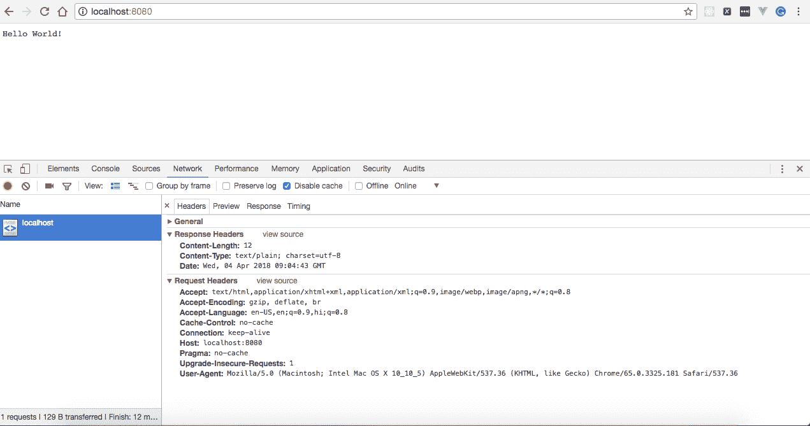
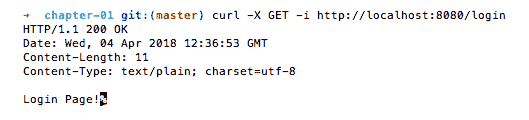
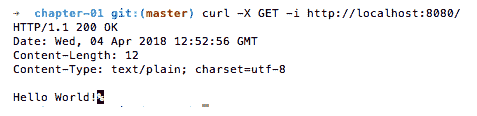
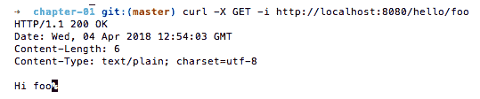

# 创建 Go 中的第一台服务器

在本章中，我们将介绍以下配方：

*   创建一个简单的 HTTP 服务器
*   在简单 HTTP 服务器上实现基本身份验证
*   使用 GZIP 压缩优化 HTTP 服务器响应
*   创建简单的 TCP 服务器
*   从 TCP 连接读取数据
*   将数据写入 TCP 连接
*   实现 HTTP 请求路由
*   使用 Gorilla Mux 实现 HTTP 请求路由
*   记录 HTTP 请求

# 介绍

Go 的创建是为了解决新的多核处理器体系结构带来的问题，创建高性能网络，为数百万请求和计算密集型工作提供服务。Go 背后的想法是通过实现快速原型、减少编译和构建时间以及实现更好的依赖关系管理来提高生产率。

与大多数其他编程语言不同，Go 提供了`net/http`包，这在创建 HTTP 客户端和服务器时就足够了。本章将介绍如何在 Go 中创建 HTTP 和 TCP 服务器。

我们将从创建 HTTP 和 TCP 服务器的一些简单方法开始，并逐步转向更复杂的方法，在这些方法中，我们实现基本身份验证、优化服务器响应、定义多个路由和记录 HTTP 请求。我们还将介绍 Go 处理程序、Goroutines 和 Gorilla（Go 的 web 工具包）等概念和关键字。

# 创建一个简单的 HTTP 服务器

作为一名程序员，如果您必须创建一个简单的 HTTP 服务器，那么您可以使用 Go 的`net/http`包轻松编写它，我们将在本食谱中介绍它。

# 怎么做…

在这个配方中，我们将创建一个简单的 HTTP 服务器，它将呈现 Hello World！当我们从命令行浏览`http://localhost:8080`或执行`curl``http://localhost:8080`时。执行以下步骤：

1.  创建`http-server.go`并复制以下内容：

```go
package main
import 
(
  "fmt"
  "log"
  "net/http"
)
const 
(
  CONN_HOST = "localhost"
  CONN_PORT = "8080"
)
func helloWorld(w http.ResponseWriter, r *http.Request) 
{
  fmt.Fprintf(w, "Hello World!")
}
func main() 
{
  http.HandleFunc("/", helloWorld)
  err := http.ListenAndServe(CONN_HOST+":"+CONN_PORT, nil)
  if err != nil 
  {
    log.Fatal("error starting http server : ", err)
    return
  }
}
```

2.  使用以下命令运行程序：

```go
$ go run http-server.go
```

# 它是如何工作的…

一旦我们运行该程序，HTTP 服务器将在端口`8080`上开始本地侦听。在浏览器中打开`http://localhost:8080`将显示 Hello World！从服务器，如以下屏幕截图所示：



你好，世界！

让我们了解程序中每一行的含义：

*   `package main`：定义程序的包名。
*   `import ( "fmt" "log" "net/http" )`：这是一个预处理器命令，告诉 Go 编译器包含来自`fmt`、`log`和`net/http`包的所有文件。

*   `const ( CONN_HOST = "localhost" CONN_PORT = "8080" )`：我们使用`const`关键字在 Go 程序中声明常量。这里我们声明了两个常量，一个是以 localhost 为值的`CONN_HOST`，另一个是以`8080`为值的`CONN_PORT`。
*   `func helloWorld(w http.ResponseWriter, r *http.Request) { fmt.Fprintf(w, "Hello World!") }`：这是一个 Go 函数，以`ResponseWriter`和`Request`为输入，将`Hello World!`写入 HTTP 响应流。

接下来，我们声明了程序执行开始的`main()`方法，因为这个方法做了很多事情。让我们逐行理解：

*   `http.HandleFunc("/", helloWorld)`：在这里，我们使用`net/http`包的`HandleFunc`使用`/`URL 模式注册`helloWorld`函数，这意味着只要我们使用模式`/`访问 HTTP URL，就会执行`helloWorld`，将`(http.ResponseWriter`、`*http.Request)`作为参数传递给它。
*   `err := http.ListenAndServe(CONN_HOST+":"+CONN_PORT, nil)`：在这里，我们调用`http.ListenAndServe`为 HTTP 请求提供服务，这些请求在单独的 Goroutine 中处理每个传入连接。`ListenAndServe`接受服务器地址和处理程序两个参数。在这里，我们将服务器地址传递为`localhost:8080`，将处理程序传递为`nil`，这意味着我们要求服务器使用`DefaultServeMux`作为处理程序。
*   `if err != nil { log.Fatal("error starting http server : ", err) return}`：在这里，我们检查服务器启动是否有问题。如果有，则记录错误并使用状态代码`1`退出。

# 在简单 HTTP 服务器上实现基本身份验证

创建 HTTP 服务器后，您可能希望限制特定用户（如应用程序管理员）访问资源。如果是这样，那么您可以在 HTTP 服务器上实现基本身份验证，我们将在本配方中介绍这一点。

# 准备

因为我们已经在前面的方法中创建了 HTTP 服务器，所以我们将扩展它以合并基本身份验证。

# 怎么做…

在这个配方中，我们将通过添加一个`BasicAuth`函数并修改`HandleFunc`以调用它来更新我们在前面配方中创建的 HTTP 服务器。执行以下步骤：

1.  创建`http-server-basic-authentication.go`并复制以下内容：

```go
package main
import 
(
  "crypto/subtle"
  "fmt"
  "log"
  "net/http"
)
const 
(
  CONN_HOST = "localhost"
  CONN_PORT = "8080"
  ADMIN_USER = "admin"
  ADMIN_PASSWORD = "admin"
)
func helloWorld(w http.ResponseWriter, r *http.Request) 
{
  fmt.Fprintf(w, "Hello World!")
}
func BasicAuth(handler http.HandlerFunc, realm string) http.HandlerFunc {
  return func(w http.ResponseWriter, r *http.Request) 
  {
    user, pass, ok := r.BasicAuth()
    if !ok || subtle.ConstantTimeCompare([]byte(user),
    []byte(ADMIN_USER)) != 1||subtle.ConstantTimeCompare([]byte(pass), 
    []byte(ADMIN_PASSWORD)) != 1 
    {
      w.Header().Set("WWW-Authenticate", `Basic realm="`+realm+`"`)
      w.WriteHeader(401)
      w.Write([]byte("You are Unauthorized to access the
      application.\n"))
      return
    }
    handler(w, r)
  }
}
func main() 
{
  http.HandleFunc("/", BasicAuth(helloWorld, "Please enter your
  username and password"))
  err := http.ListenAndServe(CONN_HOST+":"+CONN_PORT, nil)
  if err != nil 
  {
    log.Fatal("error starting http server : ", err)
    return
  }
}
```

2.  使用以下命令运行程序：

```go
$ go run http-server-basic-authentication.go
```

# 它是如何工作的…

一旦我们运行程序，HTTP 服务器将在端口`8080`上开始本地侦听。

一旦服务器启动，在浏览器中访问`http://localhost:8080`将提示您输入用户名和密码。分别提供为`admin`、`admin`将呈现 Hello World！在屏幕上，对于用户名和密码的每一个其他组合，它将使您无权访问应用程序。

要从命令行访问服务器，我们必须提供`--user`标志作为`curl`命令的一部分，如下所示：

```go
$ curl --user admin:admin http://localhost:8080/
Hello World!
```

我们也可以使用`username:password`的`base64`编码令牌访问服务器，我们可以从任何网站获取，如`https://www.base64encode.org/`，并在`curl`命令中将其作为授权头传递，如下所示：

```go
$ curl -i -H 'Authorization:Basic YWRtaW46YWRtaW4=' http://localhost:8080/

HTTP/1.1 200 OK
Date: Sat, 12 Aug 2017 12:02:51 GMT
Content-Length: 12
Content-Type: text/plain; charset=utf-8
Hello World!
```

让我们了解一下作为本配方一部分引入的变化：

*   `import`函数添加了一个额外的包`crypto/subtle`，我们将使用它来比较用户输入的凭证中的用户名和密码。
*   使用`const`函数，我们定义了两个额外的常量`ADMIN_USER`和`ADMIN_PASSWORD`，我们将在验证用户时使用它们。
*   接下来，我们声明了一个`BasicAuth()`方法，该方法接受两个输入参数，一个是处理程序，在用户成功通过身份验证后执行，另一个是 realm，返回`HandlerFunc`，如下所示：

```go
func BasicAuth(handler http.HandlerFunc, realm string) http.HandlerFunc 
{
  return func(w http.ResponseWriter, r *http.Request)
  {
    user, pass, ok := r.BasicAuth()
    if !ok || subtle.ConstantTimeCompare([]byte(user),
    []byte(ADMIN_USER)) != 1||subtle.ConstantTimeCompare
    ([]byte(pass),
    []byte(ADMIN_PASSWORD)) != 1
    {
      w.Header().Set("WWW-Authenticate", `Basic realm="`+realm+`"`)
      w.WriteHeader(401)
      w.Write([]byte("Unauthorized.\n"))
      return
    }
    handler(w, r)
  }
}
```

在前面的处理程序中，我们首先使用`r.BasicAuth()`获取请求授权头中提供的用户名和密码，然后将其与程序中声明的常量进行比较。如果凭证匹配，则返回处理程序，否则设置`WWW-Authenticate`和状态码`401`并在 HTTP 响应流上写入`You are Unauthorized to access the application`。

最后，我们在`main()`方法中引入了一个从`HandleFunc`调用`BasicAuth`的变更，如下所示：

```go
http.HandleFunc("/", BasicAuth(helloWorld, "Please enter your username and password"))
```

我们只是传递一个`BasicAuth`处理程序，而不是`nil`或`DefaultServeMux`来处理 URL 模式为`/`的所有传入请求。

# 使用 GZIP 压缩优化 HTTP 服务器响应

GZIP 压缩意味着以`.gzip`格式从服务器向客户机发送响应，而不是发送普通响应。如果客户机/浏览器支持，发送压缩响应通常是一种好的做法。

通过发送压缩响应，我们节省了网络带宽和下载时间，最终加快了页面渲染速度。GZIP 压缩中发生的情况是浏览器发送一个请求头，告诉服务器它接受压缩内容（`.gzip`和`.deflate`），如果服务器能够以压缩形式发送响应，则发送它。如果服务器支持压缩，那么它会将`Content-Encoding: gzip`设置为响应头，否则它会向客户端发送一个普通响应，这显然意味着请求压缩响应只是浏览器的请求，而不是请求。我们将使用 Gorilla 的 handlers 包在这个配方中实现它。

# 怎么做…

在这个配方中，我们将创建一个带有单个处理程序的 HTTP 服务器，它将编写 Hello World！在 HTTP 响应流上，使用 Gorilla`CompressHandler`以`.gzip`格式将所有响应发送回客户端。执行以下步骤：

1.  要使用 Gorilla 处理程序，首先我们需要使用`go get`命令安装软件包，或者手动将其复制到`$GOPATH/src`或`$GOPATH`，如下所示：

```go
$ go get github.com/gorilla/handlers
```

2.  创建`http-server-mux.go`并复制以下内容：

```go
package main
import 
(
  "io"
  "net/http"
  "github.com/gorilla/handlers"
)
const 
(
  CONN_HOST = "localhost"
  CONN_PORT = "8080"
)
func helloWorld(w http.ResponseWriter, r *http.Request) 
{
  io.WriteString(w, "Hello World!")
}
func main() 
{
  mux := http.NewServeMux()
  mux.HandleFunc("/", helloWorld)
  err := http.ListenAndServe(CONN_HOST+":"+CONN_PORT,
  handlers.CompressHandler(mux))
  if err != nil 
  {
    log.Fatal("error starting http server : ", err)
    return
  }
}
```

3.  使用以下命令运行程序：

```go
$ go run http-server-mux.go
```

# 它是如何工作的…

一旦我们运行程序，HTTP 服务器将在端口`8080`上开始本地侦听。

在浏览器中打开`http://localhost:8080`将显示 Hello World！从具有内容编码响应头值 gzip 的服务器，如以下屏幕截图所示：


你好，世界！

让我们了解程序中每一行的含义：

*   `package main`：定义程序的包名。
*   `import ( "io" "net/http" "github.com/gorilla/handlers" )`：这是一个预处理器命令，告诉 Go 编译器包含来自`io`、`net/http`和`github.com/gorilla/handlers`包的所有文件。
*   `const ( CONN_HOST = "localhost" CONN_PORT = "8080" )`：我们使用 const 关键字在 Go 程序中声明常量。这里，我们声明了两个常量，一个是值为 localhost 的`CONN_HOST`，另一个是值为 8080 的`CONN_PORT`。

*   `func helloWorld(w http.ResponseWriter, r *http.Request) { io.WriteString(w, "Hello World!")}`：这是一个 Go 函数，以`ResponseWriter`和`Request`为输入参数，将`Hello World!`写入 HTTP 响应流。

接下来，我们声明了程序执行开始的`main()`方法。由于这种方法可以做很多事情，让我们逐行理解它：

*   `mux := http.NewServeMux()`：分配并返回一个新的 HTTP 请求多路复用器（`ServeMux`），该多路复用器根据注册模式列表匹配每个传入请求的 URL，并调用与 URL 最接近的模式的处理程序。使用它的一个好处是，程序可以完全控制服务器使用的处理程序，尽管在`DefaultServeMux`中注册的任何处理程序都会被忽略。
*   `http.HandleFunc("/", helloWorld)`：在这里，我们使用`net/http`包的`HandleFunc`使用`/`URL 模式注册`helloWorld`函数，这意味着执行`helloWorld`，每当我们使用`/`模式访问 HTTP URL 时，将`(http.ResponseWriter`、`*http.Request)`作为参数传递给它。
*   `err := http.ListenAndServe(CONN_HOST+":"+CONN_PORT, handlers.CompressHandler(mux))`：在这里，我们调用`http.ListenAndServe`为 HTTP 请求提供服务，这些请求在单独的 Goroutine 中为我们处理每个传入连接。`ListenAndServe`接受服务器地址和处理程序两个参数。在这里，我们将服务器地址传递为`localhost:8080`，处理程序传递为`CompressHandler`，它用`.gzip`处理程序包装我们的服务器，以`.gzip`格式压缩所有响应。
*   `if err != nil { log.Fatal("error starting http server: ", err) return}`：在这里，我们检查服务器启动是否有问题。如果存在，则记录错误并以状态代码 1 退出。

# 创建简单的 TCP 服务器

每当您必须构建高性能的面向系统时，编写 TCP 服务器总是优于 HTTP 服务器的最佳选择，因为 TCP 套接字没有 HTTP 那么大。Go 支持并提供了一种使用`net`包编写 TCP 服务器的便捷方法，我们将在本配方中介绍。

# 怎么做…

在这个配方中，我们将创建一个简单的 TCP 服务器，它将接受`localhost:8080`上的连接。执行以下步骤：

1.  创建`tcp-server.go`并复制以下内容：

```go
package main
import 
(
  "log"
  "net"
)
const 
(
  CONN_HOST = "localhost"
  CONN_PORT = "8080"
  CONN_TYPE = "tcp"
)
func main() 
{
  listener, err := net.Listen(CONN_TYPE, CONN_HOST+":"+CONN_PORT)
  if err != nil 
  {
    log.Fatal("Error starting tcp server : ", err)
  }
  defer listener.Close()
  log.Println("Listening on " + CONN_HOST + ":" + CONN_PORT)
  for 
  {
    conn, err := listener.Accept()
    if err != nil 
    {
      log.Fatal("Error accepting: ", err.Error())
    }
    log.Println(conn)
  }
}
```

2.  使用以下命令运行程序：

```go
$ go run tcp-server.go
```

# 它是如何工作的…

一旦我们运行程序，TCP 服务器将在端口`8080`上开始本地侦听。

让我们了解程序中每一行的含义：

*   `package main`：定义程序的包名。
*   `import ( "log" "net")`：这是一个预处理器命令，告诉 Go 编译器包含`log`和`net`包中的所有文件。
*   `const ( CONN_HOST = "localhost" CONN_PORT = "8080" CONN_TYPE = "tcp" )`：我们使用 const 关键字在 Go 程序中声明常量。这里，我们声明三个常量，一个是`CONN_HOST`，值为`localhost`，另一个是`CONN_PORT`，值为`8080`，最后一个是`CONN_TYPE`，值为`tcp`。

接下来，我们声明了程序执行开始的`main()`方法。由于这种方法可以做很多事情，让我们逐行理解它：

*   `listener, err := net.Listen(CONN_TYPE, CONN_HOST+":"+CONN_PORT)`：这将在端口`8080`的本地主机上创建一个运行的 TCP 服务器。
*   `if err != nil { log.Fatal("Error starting tcp server: ", err) }`：在这里，我们检查启动 TCP 服务器是否有问题。如果存在，则记录错误并以状态代码 1 退出。
*   `defer listener.Close()`：此延迟语句在应用程序关闭时关闭 TCP 套接字侦听器。

接下来，我们在一个恒定的循环中接受 TCP 服务器的传入请求，如果在接受请求时有任何错误，那么我们记录并退出；否则，我们只需在服务器控制台上打印 connection 对象，如下所示：

```go
for 
{
  conn, err := listener.Accept()
  if err != nil 
  {
    log.Fatal("Error accepting: ", err.Error())
  }
  log.Println(conn)
}
```

# 从 TCP 连接读取数据

任何应用程序中最常见的场景之一是客户端与服务器交互。TCP 是用于这种交互的最广泛使用的协议之一。Go 提供了一种通过`bufio`实现缓冲`Input/Output`读取传入连接数据的方便方法，我们将在本配方中介绍。

# 准备好了…

由于我们已经在前面的方法中创建了一个 TCP 服务器，我们将更新它以从传入连接读取数据。

# 怎么做…

在这个配方中，我们将更新`main()`方法，以调用传递 connection 对象的`handleRequest`方法来读取和打印服务器控制台上的数据。执行以下步骤：

1.  创建`tcp-server-read-data.go`并复制以下内容：

```go
package main
import 
(
  "bufio"
  "fmt"
  "log"
  "net"
)
const 
(
  CONN_HOST = "localhost"
  CONN_PORT = "8080"
  CONN_TYPE = "tcp"
)
func main() 
{
  listener, err := net.Listen(CONN_TYPE, CONN_HOST+":"+CONN_PORT)
  if err != nil 
  {
    log.Fatal("Error starting tcp server : ", err)
  }
  defer listener.Close()
  log.Println("Listening on " + CONN_HOST + ":" + CONN_PORT)
  for 
  {
    conn, err := listener.Accept()
    if err != nil 
    {
      log.Fatal("Error accepting: ", err.Error())
    }
    go handleRequest(conn)
  }
}
func handleRequest(conn net.Conn) 
{
  message, err := bufio.NewReader(conn).ReadString('\n')
  if err != nil 
  {
    fmt.Println("Error reading:", err.Error())
  }
  fmt.Print("Message Received from the client: ", string(message))
  conn.Close()
}
```

2.  使用以下命令运行程序：

```go
$ go run tcp-server-read-data.go
```

# 它是如何工作的…

一旦我们运行程序，TCP 服务器将在端口`8080`上开始本地侦听。从命令行执行如下的`echo`命令将向 TCP 服务器发送一条消息：

```go
$ echo -n "Hello to TCP server\n" | nc localhost 8080
```

这显然会将其记录到服务器控制台，如以下屏幕截图所示：


让我们了解一下我们在这个配方中引入的变化：

1.  首先，我们使用`go`关键字从`main()`方法调用`handleRequest`，这意味着我们正在调用 Goroutine 中的函数，如下所示：

```go
func main() 
{
  ...
  go handleRequest(conn)
  ...
}
```

2.  接下来，我们定义了`handleRequest`函数，该函数将传入连接读入缓冲区，直到第一次出现`\n`为止，并在控制台上打印消息。如果在读取消息时出现任何错误，则会将错误消息与错误对象一起打印，并最终关闭连接，如下所示：

```go
func handleRequest(conn net.Conn) 
{
  message, err := bufio.NewReader(conn).ReadString('\n')
  if err != nil 
  {
    fmt.Println("Error reading:", err.Error())
  }
  fmt.Print("Message Received: ", string(message))
  conn.Close()
}
```

# 将数据写入 TCP 连接

任何 web 应用程序中的另一个常见也是重要的场景是将数据发送回客户端或响应客户端。Go 提供了一种在连接上以字节形式编写消息的便捷方法，我们将在本食谱中介绍。

# 准备好了…

由于我们已经创建了一个 TCP 服务器，用于读取前面配方中的传入连接数据，因此我们将只更新它以将消息写回客户端。

# 怎么做…

在此配方中，我们将更新程序中的`handleRequest`方法，以便将数据写回客户端。执行以下步骤：

1.  创建`tcp-server-write-data.go`并复制以下内容：

```go
package main
import 
(
  "bufio"
  "fmt"
  "log"
  "net"
)
const 
(
  CONN_HOST = "localhost"
  CONN_PORT = "8080"
  CONN_TYPE = "tcp"
)
func main() 
{
  listener, err := net.Listen(CONN_TYPE, CONN_HOST+":"+CONN_PORT)
  if err != nil 
  {
    log.Fatal("Error starting tcp server : ", err)
  }
  defer listener.Close()
  log.Println("Listening on " + CONN_HOST + ":" + CONN_PORT)
  for 
  {
    conn, err := listener.Accept()
    if err != nil 
    {
      log.Fatal("Error accepting: ", err.Error())
    }
    go handleRequest(conn)
  }
}
func handleRequest(conn net.Conn) 
{
  message, err := bufio.NewReader(conn).ReadString('\n')
  if err != nil 
  {
    fmt.Println("Error reading: ", err.Error())
  }
  fmt.Print("Message Received:", string(message))
  conn.Write([]byte(message + "\n"))
  conn.Close()
}
```

2.  使用以下命令运行程序：

```go
$ go run tcp-server-write-data.go
```

# 它是如何工作的…

一旦我们运行程序，TCP 服务器将在端口`8080`上开始本地侦听。从命令行执行一个`echo`命令，如下所示：

```go
$ echo -n "Hello to TCP server\n" | nc localhost 8080
```

这将为我们提供来自服务器的以下响应：

```go
Hello to TCP server
```

让我们看看我们在这个配方中引入的将数据写入客户端的更改。`handleRequest`中的所有内容都与前面的配方完全相同，只是我们引入了一个新行，将数据作为字节数组写入连接，如下所示：

```go
func handleRequest(conn net.Conn) 
{
  ...
  conn.Write([]byte(message + "\n"))
  ...
}
```

# 实现 HTTP 请求路由

大多数情况下，您必须在 web 应用程序中定义多个 URL 路由，这涉及到将 URL 路径映射到处理程序或资源。在本食谱中，我们将学习如何在围棋中实现它。

# 怎么做…

在这个配方中，我们将定义三条路线，例如`/`、`/login`和`/logout`以及它们的处理程序。执行以下步骤：

1.  创建`http-server-basic-routing.go`并复制以下内容：

```go
package main
import 
(
  "fmt"
  "log"
  "net/http"
)
const 
(
  CONN_HOST = "localhost"
  CONN_PORT = "8080"
)
func helloWorld(w http.ResponseWriter, r *http.Request) 
{
  fmt.Fprintf(w, "Hello World!")
}
func login(w http.ResponseWriter, r *http.Request) 
{
  fmt.Fprintf(w, "Login Page!")
}
func logout(w http.ResponseWriter, r *http.Request) 
{
  fmt.Fprintf(w, "Logout Page!")
}
func main() 
{
  http.HandleFunc("/", helloWorld)
  http.HandleFunc("/login", login)
  http.HandleFunc("/logout", logout)
  err := http.ListenAndServe(CONN_HOST+":"+CONN_PORT, nil)
  if err != nil 
  {
    log.Fatal("error starting http server : ", err)
    return
  }
}
```

2.  使用以下命令运行程序：

```go
$ go run http-server-basic-routing.go
```

# 它是如何工作的…

一旦我们运行程序，HTTP 服务器将开始在端口`8080`上进行本地监听，并从浏览器或命令行访问`http://localhost:8080/`、`http://localhost:8080/login`和`http://localhost:8080/logout`将呈现相应处理程序定义中定义的消息。例如，从命令行执行`http://localhost:8080/`，如下所示：

```go
$ curl -X GET -i http://localhost:8080/
```

这将为我们提供来自服务器的以下响应：


我们也可以从命令行执行`http://localhost:8080/login`，如下所示：

```go
$ curl -X GET -i http://localhost:8080/login
```

这将为我们提供来自服务器的以下响应：



让我们了解一下我们编写的程序：

1.  我们首先定义了三个处理程序或 web 资源，例如：

```go
func helloWorld(w http.ResponseWriter, r *http.Request) 
{
  fmt.Fprintf(w, "Hello World!")
}
func login(w http.ResponseWriter, r *http.Request) 
{
  fmt.Fprintf(w, "Login Page!")
}
func logout(w http.ResponseWriter, r *http.Request) 
{
  fmt.Fprintf(w, "Logout Page!")
}
```

这里，`helloWorld`处理程序在 HTTP 响应流上写入`Hello World!`。以类似的方式，登录和注销处理程序在 HTTP 响应流上写入`Login Page!`和`Logout Page!`。

2.  接下来，我们使用`http.HandleFunc()`向`DefaultServeMux`注册了三个 URL 路径—`/`、`/login`和`/logout`。如果传入请求 URL 模式与其中一个注册路径匹配，则相应的处理程序被称为传递`(http.ResponseWriter`、`*http.Request)`作为参数，如下所示：

```go
func main() 
{
  http.HandleFunc("/", helloWorld)
  http.HandleFunc("/login", login)
  http.HandleFunc("/logout", logout)
  err := http.ListenAndServe(CONN_HOST+":"+CONN_PORT, nil)
  if err != nil 
  {
    log.Fatal("error starting http server : ", err)
    return
  }
}
```

# 使用 Gorilla Mux 实现 HTTP 请求路由

Go 的`net/http`包为 HTTP 请求的 URL 路由提供了许多功能。它做得不太好的一件事是动态 URL 路由。幸运的是，我们可以通过`gorilla/mux`包实现这一点，我们将在本配方中介绍。

# 怎么做…

在这个配方中，我们将使用`gorilla/mux`定义一些路线，就像我们在上一个配方中所做的那样，以及它们的处理程序或资源。正如我们在前面的一个方法中已经看到的，要使用外部软件包，首先我们必须使用`go get`命令安装软件包，或者我们必须手动将其复制到`$GOPATH/src`或`$GOPATH`。我们在食谱中也会这样做。执行以下步骤：

1.  使用`go get`命令安装`github.com/gorilla/mux`，如下所示：

```go
$ go get github.com/gorilla/mux
```

2.  创建`http-server-gorilla-mux-routing.go`并复制以下内容：

```go
package main
import 
(
  "net/http"
  "github.com/gorilla/mux"
)
const 
(
  CONN_HOST = "localhost"
  CONN_PORT = "8080"
)
var GetRequestHandler = http.HandlerFunc
(
  func(w http.ResponseWriter, r *http.Request) 
  {
    w.Write([]byte("Hello World!"))
  }
)
var PostRequestHandler = http.HandlerFunc
(
  func(w http.ResponseWriter, r *http.Request) 
  {
    w.Write([]byte("It's a Post Request!"))
  }
)
var PathVariableHandler = http.HandlerFunc
(
  func(w http.ResponseWriter, r *http.Request) 
  {
    vars := mux.Vars(r)
    name := vars["name"]
    w.Write([]byte("Hi " + name))
  }
)
func main() 
{
  router := mux.NewRouter()
  router.Handle("/", GetRequestHandler).Methods("GET")
  router.Handle("/post", PostRequestHandler).Methods("POST")
  router.Handle("/hello/{name}", 
  PathVariableHandler).Methods("GET", "PUT")
  http.ListenAndServe(CONN_HOST+":"+CONN_PORT, router)
}
```

3.  使用以下命令运行程序：

```go
$ go run http-server-gorilla-mux-routing.go
```

# 它是如何工作的…

一旦我们运行该程序，HTTP 服务器将在端口`8080`上开始本地监听，并且从浏览器或命令行访问`http://localhost:8080/`、`http://localhost:8080/post`和`http://localhost:8080/hello/foo`将产生相应处理程序定义中定义的消息。例如，从命令行执行`http://localhost:8080/`，如下所示：

```go
$ curl -X GET -i http://localhost:8080/
```

这将为我们提供来自服务器的以下响应：



我们也可以从命令行执行`http://localhost:8080/hello/foo`，如下所示：

```go
$ curl -X GET -i http://localhost:8080/hello/foo
```

这将为我们提供来自服务器的以下响应：



让我们了解一下我们在此配方中所做的代码更改：

1.  首先，我们定义了`GetRequestHandler`和`PostRequestHandler`，它们只是在 HTTP 响应流上写消息，如下所示：

```go
var GetRequestHandler = http.HandlerFunc
(
  func(w http.ResponseWriter, r *http.Request) 
  {
    w.Write([]byte("Hello World!"))
  }
)
var PostRequestHandler = http.HandlerFunc
(
  func(w http.ResponseWriter, r *http.Request) 
  {
    w.Write([]byte("It's a Post Request!"))
  }
)
```

2.  接下来，我们定义了`PathVariableHandler`，它提取请求路径变量，获取值，并将其写入 HTTP 响应流，如下所示：

```go
var PathVariableHandler = http.HandlerFunc
(
  func(w http.ResponseWriter, r *http.Request) 
  {
    vars := mux.Vars(r)
    name := vars["name"]
    w.Write([]byte("Hi " + name))
  }
)
```

3.  然后，我们将所有这些处理程序注册到`gorilla/mux`路由器并实例化，调用 mux 路由器的`NewRouter()`处理程序，如下所示：

```go
func main() 
{
  router := mux.NewRouter()
  router.Handle("/", GetRequestHandler).Methods("GET")
  router.Handle("/post", PostCallHandler).Methods("POST")
  router.Handle("/hello/{name}", PathVariableHandler).
  Methods("GET", "PUT")
  http.ListenAndServe(CONN_HOST+":"+CONN_PORT, router)
}
```

# 记录 HTTP 请求

在对 web 应用程序进行故障排除时，记录 HTTP 请求总是很有用的，因此最好使用适当的消息和记录级别记录请求/响应。Go 提供了`log`包，可以帮助我们实现应用程序的登录。然而，在这个配方中，我们将使用 Gorilla 日志处理程序来实现它，因为该库提供了更多功能，如使用 Apache 组合日志格式和 Apache 通用日志格式进行日志记录，而 Go`log`包尚不支持这些功能。

# 准备好了…

由于我们已经在前面的配方中创建了 HTTP 服务器并使用 Gorilla Mux 定义了路由，我们将对其进行更新，以合并 Gorilla 日志处理程序。

# 怎么做…

让我们使用 Gorilla 处理程序实现日志记录。执行以下步骤：

1.  使用`go get`命令安装`github.com/gorilla/handler`和`github.com/gorilla/mux`包，如下所示：

```go
$ go get github.com/gorilla/handlers
$ go get github.com/gorilla/mux
```

2.  创建`http-server-request-logging.go`并复制以下内容：

```go
package main
import 
(
  "net/http"
  "os"
  "github.com/gorilla/handlers"
  "github.com/gorilla/mux"
)
const 
(
  CONN_HOST = "localhost"
  CONN_PORT = "8080"
)
var GetRequestHandler = http.HandlerFunc
(
  func(w http.ResponseWriter, r *http.Request) 
  {
    w.Write([]byte("Hello World!"))
  }
)
var PostRequestHandler = http.HandlerFunc
(
  func(w http.ResponseWriter, r *http.Request) 
  {
    w.Write([]byte("It's a Post Request!"))
  }
)
var PathVariableHandler = http.HandlerFunc
(
  func(w http.ResponseWriter, r *http.Request) 
  {
    vars := mux.Vars(r)
    name := vars["name"]
    w.Write([]byte("Hi " + name))
  }
)
func main() 
{
  router := mux.NewRouter()
  router.Handle("/", handlers.LoggingHandler(os.Stdout,
  http.HandlerFunc(GetRequestHandler))).Methods("GET")
  logFile, err := os.OpenFile("server.log",
  os.O_WRONLY|os.O_CREATE|os.O_APPEND, 0666)
  if err != nil 
  {
    log.Fatal("error starting http server : ", err)
    return
  }
  router.Handle("/post", handlers.LoggingHandler(logFile,
  PostRequestHandler)).Methods("POST")
  router.Handle("/hello/{name}",
  handlers.CombinedLoggingHandler(logFile,
  PathVariableHandler)).Methods("GET")
  http.ListenAndServe(CONN_HOST+":"+CONN_PORT, router)
}
```

3.  使用以下命令运行程序：

```go
$ go run http-server-request-logging.go
```

# 它是如何工作的…

一旦我们运行程序，HTTP 服务器将在端口`8080`上开始本地侦听。

从命令行执行一个`GET`请求，如下所示：

```go
$ curl -X GET -i http://localhost:8080/
```

这将以 Apache 通用日志格式在服务器日志中记录请求详细信息，如以下屏幕截图所示：


我们也可以从命令行执行`http://localhost:8080/hello/foo`，如下所示：

```go
$ curl -X GET -i http://localhost:8080/hello/foo
```

这将以 Apache 组合日志格式将请求详细信息记录在`server.log`中，如以下屏幕截图所示：


让我们了解一下我们在这个食谱中做了什么：

1.  首先，我们导入了两个额外的包，一个是`os`，用于打开文件。另一个是`github.com/gorilla/handlers`，我们使用它导入日志处理程序来记录 HTTP 请求，如下所示：

```go
import ( "net/http" "os" "github.com/gorilla/handlers" "github.com/gorilla/mux" )
```

2.  接下来，我们修改了`main()`方法。使用`router.Handle("/", handlers.LoggingHandler(os.Stdout,`
    `http.HandlerFunc(GetRequestHandler))).Methods("GET")`，我们用一个 Gorilla 日志处理程序包装`GetRequestHandler`，并将一个标准输出流作为写入程序传递给它，这意味着我们只是要求在控制台上以 Apache 通用日志格式用 URL 路径`/`记录每个请求。
3.  接下来，我们以只写模式创建一个名为`server.log`的新文件，或者打开它（如果它已经存在）。如果有任何错误，则记录并退出，状态代码为 1，如下所示：

```go
logFile, err := os.OpenFile("server.log", os.O_WRONLY|os.O_CREATE|os.O_APPEND, 0666)
if err != nil 
{
  log.Fatal("error starting http server : ", err)
  return
}
```

4.  使用`router.Handle("/post", handlers.LoggingHandler(logFile, PostRequestHandler)).Methods("POST")`，我们用一个 Gorilla 日志处理程序包装`GetRequestHandler`并将该文件作为写入程序传递给它，这意味着我们只是要求将每个请求用 URL 路径`/post`以 Apache 通用日志格式记录在名为`/hello/{name}`的文件中。
5.  使用`router.Handle("/hello/{name}", handlers.CombinedLoggingHandler(logFile, PathVariableHandler)).Methods("GET")`，我们用一个 Gorilla 日志处理程序包装`GetRequestHandler`并将该文件作为写入程序传递给它，这意味着我们只是要求将每个请求以 URL 路径`/hello/{name}`记录在一个名为`server.log`的文件中，该文件采用 Apache 组合日志格式。