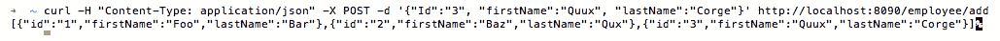
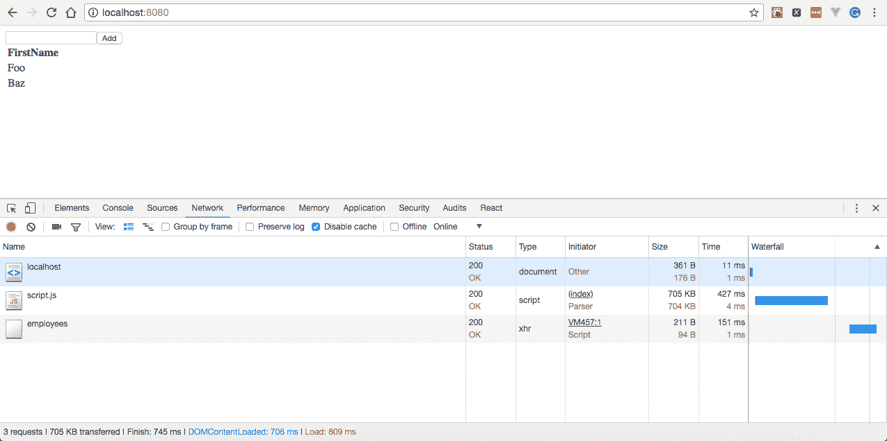
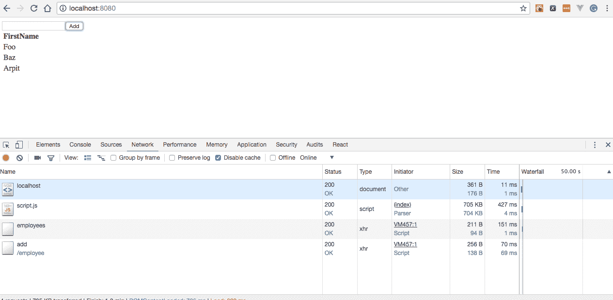
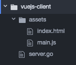

# 在 Go 中编写和使用 RESTful Web 服务

在本章中，我们将介绍以下配方：

*   创建第一个 HTTP GET 方法
*   创建第一个 HTTP POST 方法
*   创建第一个 HTTP PUT 方法
*   创建第一个 HTTP 删除方法
*   对 RESTAPI 进行版本控制
*   创建第一个 REST 客户机
*   创建第一个 AngularJS 客户端
*   创建您的第一个 JS 客户端
*   创建第一个 VueJS 客户端

# 介绍

每当我们构建一个封装了对其他相关应用程序有帮助的逻辑的 web 应用程序时，我们通常也会编写和使用 web 服务。这是因为它们通过网络公开功能，而网络可以通过 HTTP 协议访问，从而使应用程序成为唯一的真实来源。

在本章中，我们将编写一个支持`GET`、`POST`、`PUT`和`DELETE`HTTP 方法的 REST 式 API，然后我们将学习如何对 REST API 进行版本化，这在我们创建公开使用的 API 时非常有用。最后，我们将编写 REST 客户机来使用它们。

# 创建第一个 HTTP GET 方法

在编写 web 应用程序时，我们通常必须向客户机或 UI 公开我们的服务，以便他们能够使用在不同系统上运行的代码。可以使用 HTTP 协议方法公开服务。在众多 HTTP 方法中，我们将学习在本配方中实现 HTTP`GET`方法。

# 怎么做…

1.  使用`go get`命令安装`github.com/gorilla/mux`包，如下所示：

```go
$ go get github.com/gorilla/mux
```

2.  创建`http-rest-get.go`，我们将在其中定义两条路由-`/employees`和`/employee/{id}`以及它们的处理程序。前者写入员工的静态数组，后者将所提供 ID 的员工详细信息写入 HTTP 响应流，如下所示：

```go
package main
import 
(
  "encoding/json"
  "log"
  "net/http"
  "github.com/gorilla/mux"
)
const 
(
  CONN_HOST = "localhost"
  CONN_PORT = "8080"
)
type Route struct 
{
  Name string
  Method string
  Pattern string
  HandlerFunc http.HandlerFunc
}
type Routes []Route
var routes = Routes
{
  Route
  {
    "getEmployees",
    "GET",
    "/employees",
    getEmployees,
  },
  Route
  {
    "getEmployee",
    "GET",
    "/employee/{id}",
    getEmployee,
  },
}
type Employee struct 
{
  Id string `json:"id"`
  FirstName string `json:"firstName"`
  LastName string `json:"lastName"`
}
type Employees []Employee
var employees []Employee
func init() 
{
  employees = Employees
  {
    Employee{Id: "1", FirstName: "Foo", LastName: "Bar"},
    Employee{Id: "2", FirstName: "Baz", LastName: "Qux"},
  }
}
func getEmployees(w http.ResponseWriter, r *http.Request) 
{
  json.NewEncoder(w).Encode(employees)
}
func getEmployee(w http.ResponseWriter, r *http.Request) 
{
  vars := mux.Vars(r)
  id := vars["id"]
  for _, employee := range employees 
  {
    if employee.Id == id 
    {
      if err := json.NewEncoder(w).Encode(employee); err != nil 
      {
        log.Print("error getting requested employee :: ", err)
      }
    }
  }
}
func AddRoutes(router *mux.Router) *mux.Router 
{
  for _, route := range routes 
  {
    router.
    Methods(route.Method).
    Path(route.Pattern).
    Name(route.Name).
    Handler(route.HandlerFunc)
  }
  return router
}
func main() 
{
  muxRouter := mux.NewRouter().StrictSlash(true)
  router := AddRoutes(muxRouter)
  err := http.ListenAndServe(CONN_HOST+":"+CONN_PORT, router)
  if err != nil 
  {
    log.Fatal("error starting http server :: ", err)
    return
  }
}
```

3.  使用以下命令运行程序：

```go
$ go run http-rest-get.go
```

# 它是如何工作的…

一旦我们运行程序，HTTP 服务器将在端口`8080`上开始本地侦听。

接下来，从命令行执行一个`GET`请求，如下所示，将为您提供所有员工的列表：

```go
$ curl -X GET http://localhost:8080/employees
[{"id":"1","firstName":"Foo","lastName":"Bar"},{"id":"2","firstName":"Baz","lastName":"Qux"}]
```

在这里，从命令行执行对特定员工 ID 的`GET`请求，如下所示，将为您提供相应 ID 的员工详细信息：

```go
$ curl -X GET http://localhost:8080/employee/1
 {"id":"1","firstName":"Foo","lastName":"Bar"}
```

让我们了解一下我们编写的程序：

1.  我们使用了`import ("encoding/json" "log" "net/http" "strconv" "github.com/gorilla/mux")`。在这里，我们导入了`github.com/gorilla/mux`来创建一个`Gorilla Mux Router`。
2.  接下来，我们声明了具有四个字段的`Route`结构类型—`Name`、`Method`、`Pattern`和`HandlerFunc`，其中`Name`表示 HTTP 方法的名称，`Method`表示 HTTP 方法类型，可以是`GET`、`POST`、`PUT`、`DELETE`等等，`Pattern`表示 URL 路径，`HandlerFunc`表示 HTTP 处理程序。
3.  接下来，我们为`GET`请求定义了两条路由，如下所示：

```go
var routes = Routes
{
  Route
  {
    "getEmployees",
    "GET",
    "/employees",
    getEmployees,
  },
  Route
  {
    "getEmployee",
    "GET",
    "/employee/{id}",
    getEmployee,
  },
}
```

4.  接下来，我们定义了一个静态`Employees`数组，如下所示：

```go
func init() 
{
  employees = Employees 
  {
    Employee{Id: "1", FirstName: "Foo", LastName: "Bar"},
    Employee{Id: "2", FirstName: "Baz", LastName: "Qux"},
  }
}
```

5.  然后，我们定义了两个处理程序-`getEmployees`和`getEmployee`，前者只是封送一个静态员工数组并将其写入 HTTP 响应流，后者从 HTTP 请求变量中获取员工 ID，从数组中获取对应 ID 的员工，封送对象，并将其写入 HTTP 响应流。
6.  在处理程序之后，我们定义了一个`AddRoutes`函数，该函数迭代我们定义的 routes 数组，将其添加到`gorilla/mux`路由器，并返回`Router`对象。
7.  最后，我们定义了`main()`，其中我们使用`NewRouter()`处理程序创建了一个`gorilla/mux`路由器实例，新路由的尾部斜杠行为为 true，这意味着应用程序将始终看到路由中指定的路径。例如，如果路由路径为`/path/`，则访问`/path`将重定向到前者，反之亦然。

# 创建第一个 HTTP POST 方法

每当我们必须通过异步调用或 HTML 表单向服务器发送数据时，我们都会使用 HTTP`POST`方法实现，我们将在本配方中介绍。

# 怎么做…

1.  使用`go get`命令安装`github.com/gorilla/mux`包，如下所示：

```go
$ go get github.com/gorilla/mux
```

2.  创建`http-rest-post.go`，其中我们将定义一个支持 HTTP`POST`方法的额外路由和一个处理程序，该处理程序将员工添加到初始静态员工数组中，并将更新后的列表写入 HTTP 响应流，如下所示：

```go
package main
import 
(
  "encoding/json"
  "log"
  "net/http"
  "github.com/gorilla/mux"
)
const 
(
  CONN_HOST = "localhost"
  CONN_PORT = "8080"
)
type Route struct 
{
  Name string
  Method string
  Pattern string
  HandlerFunc http.HandlerFunc
}
type Routes []Route
var routes = Routes
{
  Route
  {
    "getEmployees",
    "GET",
    "/employees",
    getEmployees,
  },
  Route
  {
    "addEmployee",
    "POST",
    "/employee/add",
    addEmployee,
  },
}
type Employee struct 
{
  Id string `json:"id"`
  FirstName string `json:"firstName"`
  LastName string `json:"lastName"`
}
type Employees []Employee
var employees []Employee
func init() 
{
  employees = Employees
  {
    Employee{Id: "1", FirstName: "Foo", LastName: "Bar"},
    Employee{Id: "2", FirstName: "Baz", LastName: "Qux"},
  }
}
func getEmployees(w http.ResponseWriter, r *http.Request) 
{
  json.NewEncoder(w).Encode(employees)
}
func addEmployee(w http.ResponseWriter, r *http.Request) 
{
  employee := Employee{}
  err := json.NewDecoder(r.Body).Decode(&employee)
  if err != nil 
  {
    log.Print("error occurred while decoding employee 
    data :: ", err)
    return
  }
  log.Printf("adding employee id :: %s with firstName 
  as :: %s and lastName as :: %s ", employee.Id, 
  employee.FirstName, employee.LastName)
  employees = append(employees, Employee{Id: employee.Id, 
  FirstName: employee.FirstName, LastName: employee.LastName})
  json.NewEncoder(w).Encode(employees)
}
func AddRoutes(router *mux.Router) *mux.Router 
{
  for _, route := range routes 
  {
    router.
    Methods(route.Method).
    Path(route.Pattern).
    Name(route.Name).
    Handler(route.HandlerFunc)
  }
  return router
}
func main() 
{
  muxRouter := mux.NewRouter().StrictSlash(true)
  router := AddRoutes(muxRouter)
  err := http.ListenAndServe(CONN_HOST+":"+CONN_PORT, router)
  if err != nil 
  {
    log.Fatal("error starting http server :: ", err)
    return
  }
}
```

3.  使用以下命令运行程序：

```go
$ go run http-rest-post.go
```

# 它是如何工作的…

一旦我们运行程序，HTTP 服务器将在端口`8080`上开始本地侦听。

接下来，从命令行执行一个`POST`请求，如下所示，将员工添加到列表中`ID`为`3`，并返回员工列表作为响应：

```go
$ curl -H "Content-Type: application/json" -X POST -d '{"Id":"3", "firstName":"Quux", "lastName":"Corge"}' http://localhost:8080/employee/add
```

这显示在以下屏幕截图中：


让我们了解一下我们在这个配方中引入的变化：

1.  首先，我们添加了另一个名为`addEmployee`的路由，它对 URL 模式`/employee/add`的每个`POST`请求执行`addEmployee`处理程序。
2.  然后，我们定义了一个`addEmployee`处理程序，它基本上使用 Go 内置`encoding/json`包的`NewDecoder`处理程序解码`POST`请求中的员工数据，将其附加到员工的初始静态数组中，并将其写入 HTTP 响应流。

# 创建第一个 HTTP PUT 方法

每当我们想要更新我们之前创建的记录，或者想要创建一个新的记录（如果它不存在的话），通常称为**Upsert，**，那么我们就使用 HTTP`PUT`方法实现，我们将在本配方中介绍。

# 怎么做…

1.  使用`go get`命令安装`github.com/gorilla/mux`包，如下所示：

```go
$ go get github.com/gorilla/mux
```

2.  创建`http-rest-put.go`，在这里我们将定义一个支持 HTTP`PUT`方法的额外路由和一个处理程序，该处理程序为提供的 ID 更新员工详细信息，或者将员工添加到初始静态员工数组中；如果 ID 不存在，则将其封送到 JSON，并将其写入 HTTP 响应流，如下所示：

```go
package main
import 
(
  "encoding/json"
  "log"
  "net/http"
  "github.com/gorilla/mux"
)
const 
(
  CONN_HOST = "localhost"
  CONN_PORT = "8080"
)
type Route struct 
{
  Name string
  Method string
  Pattern string
  HandlerFunc http.HandlerFunc
}
type Routes []Route
var routes = Routes
{
  Route
  {
    "getEmployees",
    "GET",
    "/employees",
    getEmployees,
  },
  Route
  {
    "addEmployee",
    "POST",
    "/employee/add",
    addEmployee,
  },
  Route
  {
    "updateEmployee",
    "PUT",
    "/employee/update",
    updateEmployee,
  },
}
type Employee struct 
{
  Id string `json:"id"`
  FirstName string `json:"firstName"`
  LastName string `json:"lastName"`
}
type Employees []Employee
var employees []Employee
func init() 
{
  employees = Employees
  {
    Employee{Id: "1", FirstName: "Foo", LastName: "Bar"},
    Employee{Id: "2", FirstName: "Baz", LastName: "Qux"},
  }
}
func getEmployees(w http.ResponseWriter, r *http.Request) 
{
  json.NewEncoder(w).Encode(employees)
}
func updateEmployee(w http.ResponseWriter, r *http.Request) 
{
  employee := Employee{}
  err := json.NewDecoder(r.Body).Decode(&employee)
  if err != nil 
  {
    log.Print("error occurred while decoding employee 
    data :: ", err)
    return
  }
  var isUpsert = true
  for idx, emp := range employees 
  {
    if emp.Id == employee.Id 
    {
      isUpsert = false
      log.Printf("updating employee id :: %s with 
      firstName as :: %s and lastName as:: %s ", 
      employee.Id, employee.FirstName, employee.LastName)
      employees[idx].FirstName = employee.FirstName
      employees[idx].LastName = employee.LastName
      break
    }
  }
  if isUpsert 
  {
    log.Printf("upserting employee id :: %s with 
    firstName as :: %s and lastName as:: %s ", 
    employee.Id, employee.FirstName, employee.LastName)
    employees = append(employees, Employee{Id: employee.Id,
    FirstName: employee.FirstName, LastName: employee.LastName})
  }
  json.NewEncoder(w).Encode(employees)
}
func addEmployee(w http.ResponseWriter, r *http.Request) 
{
  employee := Employee{}
  err := json.NewDecoder(r.Body).Decode(&employee)
  if err != nil 
  {
    log.Print("error occurred while decoding employee 
    data :: ", err)
    return
  }
  log.Printf("adding employee id :: %s with firstName 
  as :: %s and lastName as :: %s ", employee.Id, 
  employee.FirstName, employee.LastName)
  employees = append(employees, Employee{Id: employee.Id, 
  FirstName: employee.FirstName, LastName: employee.LastName})
  json.NewEncoder(w).Encode(employees)
}
func AddRoutes(router *mux.Router) *mux.Router 
{
  for _, route := range routes 
  {
    router.
    Methods(route.Method).
    Path(route.Pattern).
    Name(route.Name).
    Handler(route.HandlerFunc)
  }
  return router
}
func main() 
{
  muxRouter := mux.NewRouter().StrictSlash(true)
  router := AddRoutes(muxRouter)
  err := http.ListenAndServe(CONN_HOST+":"+CONN_PORT, router)
  if err != nil 
  {
    log.Fatal("error starting http server :: ", err)
    return
  }
}
```

3.  使用以下命令运行程序：

```go
$ go run http-rest-put.go
```

# 它是如何工作的…

一旦我们运行程序，HTTP 服务器将在端口`8080`上开始本地侦听。

接下来，从命令行执行如下的`PUT`请求，将更新 ID 为`1`的员工的`firstName`和`lastName`：

```go
$ curl -H "Content-Type: application/json" -X PUT -d '{"Id":"1", "firstName":"Grault", "lastName":"Garply"}' http://localhost:8080/employee/update
```

这可以在以下屏幕截图中看到：


如果我们从下面的命令行对 ID 为`3`的员工执行`PUT`请求，它会将另一名员工添加到数组中，因为没有 ID 为 3 的员工，这说明了 upsert 场景：

```go
$ curl -H "Content-Type: application/json" -X PUT -d '{"Id":"3", "firstName":"Quux", "lastName":"Corge"}' http://localhost:8080/employee/update
```

这可以在以下屏幕截图中看到：


让我们了解一下我们在这个配方中引入的变化：

1.  首先，我们添加了另一个名为`updateEmployee`的路由，它对 URL 模式`/employee/update`的每个`PUT`请求执行`updateEmployee`处理程序。
2.  然后，我们定义了一个`updateEmployee`处理程序，它基本上使用 Go 内置`encoding/json`包的`NewDecoder`处理程序对`PUT`请求中的员工数据进行解码，迭代员工数组，以了解请求的员工 ID 是否存在于员工的初始静态数组中，我们也可以将其称为更新或升级场景，执行所需的操作，并将响应写入 HTTP 响应流。

# 创建第一个 HTTP 删除方法

每当我们想要删除不再需要的记录时，我们就使用 HTTP`DELETE`方法实现，我们将在本配方中介绍。

# 怎么做…

1.  使用`go get`命令安装`github.com/gorilla/mux`包，如下所示：

```go
$ go get github.com/gorilla/mux
```

2.  创建`http-rest-delete.go`，其中我们将定义一个支持 HTTP`DELETE`方法的路由和一个处理程序，该处理程序从员工的静态数组中删除所提供 ID 的员工详细信息，将该数组封送到 JSON，并将其写入 HTTP 响应流，如下所示：

```go
package main
import 
(
  "encoding/json"
  "log"
  "net/http"
  "github.com/gorilla/mux"
)
const 
(
  CONN_HOST = "localhost"
  CONN_PORT = "8080"
)
type Route struct 
{
  Name string
  Method string
  Pattern string
  HandlerFunc http.HandlerFunc
}
type Routes []Route
var routes = Routes
{
  Route
  {
    "getEmployees",
    "GET",
    "/employees",
    getEmployees,
  },
  Route
  {
    "addEmployee",
    "POST",
    "/employee/add/",
    addEmployee,
  },
  Route
  {
    "deleteEmployee",
    "DELETE",
    "/employee/delete",
    deleteEmployee,
  },
}
type Employee struct 
{
  Id string `json:"id"`
  FirstName string `json:"firstName"`
  LastName string `json:"lastName"`
}
type Employees []Employee
var employees []Employee
func init() 
{
  employees = Employees
  {
    Employee{Id: "1", FirstName: "Foo", LastName: "Bar"},
    Employee{Id: "2", FirstName: "Baz", LastName: "Qux"},
  }
}
func getEmployees(w http.ResponseWriter, r *http.Request) 
{
  json.NewEncoder(w).Encode(employees)
}
func deleteEmployee(w http.ResponseWriter, r *http.Request) 
{
  employee := Employee{}
  err := json.NewDecoder(r.Body).Decode(&employee)
  if err != nil 
  {
    log.Print("error occurred while decoding employee 
    data :: ", err)
    return
  }
  log.Printf("deleting employee id :: %s with firstName 
  as :: %s and lastName as :: %s ", employee.Id, 
  employee.FirstName, employee.LastName)
  index := GetIndex(employee.Id)
  employees = append(employees[:index], employees[index+1:]...)
  json.NewEncoder(w).Encode(employees)
}
func GetIndex(id string) int 
{
  for i := 0; i < len(employees); i++ 
  {
    if employees[i].Id == id 
    {
      return i
    }
  }
  return -1
}
func addEmployee(w http.ResponseWriter, r *http.Request) 
{
  employee := Employee{}
  err := json.NewDecoder(r.Body).Decode(&employee)
  if err != nil 
  {
    log.Print("error occurred while decoding employee 
    data :: ", err)
    return
  }
  log.Printf("adding employee id :: %s with firstName 
  as :: %s and lastName as :: %s ", employee.Id, 
  employee.FirstName, employee.LastName)
  employees = append(employees, Employee{Id: employee.Id, 
  FirstName: employee.FirstName, LastName: employee.LastName})
  json.NewEncoder(w).Encode(employees)
}
func AddRoutes(router *mux.Router) *mux.Router 
{
  for _, route := range routes 
  {
    router.
    Methods(route.Method).
    Path(route.Pattern).
    Name(route.Name).
    Handler(route.HandlerFunc)
  }
  return router
}
func main() 
{
  muxRouter := mux.NewRouter().StrictSlash(true)
  router := AddRoutes(muxRouter)
  err := http.ListenAndServe(CONN_HOST+":"+CONN_PORT, router)
  if err != nil 
  {
    log.Fatal("error starting http server :: ", err)
    return
  }
}
```

3.  使用以下命令运行程序：

```go
$ go run http-rest-delete.go
```

# 它是如何工作的…

一旦我们运行程序，HTTP 服务器将在端口`8080`上开始本地侦听

接下来，从命令行执行一个`DELETE`请求，如下所示，将删除 ID 为 1 的员工，并向我们提供更新后的员工列表：

```go
$ curl -H "Content-Type: application/json" -X DELETE -d '{"Id":"1", "firstName": "Foo", "lastName": "Bar"}' http://localhost:8080/employee/delete
```

这可以在以下屏幕截图中看到：


让我们了解一下我们在这个配方中引入的变化：

1.  首先，我们添加了另一个名为`deleteEmployee`的路由，它对 URL 模式`/employee/delete`的每个`DELETE`请求执行`deleteEmployee`处理程序。
2.  然后，我们定义了一个`deleteEmployee`处理程序，它基本上使用 Go 内置`encoding/json`包的`NewDecoder`处理程序对`DELETE`请求中的员工数据进行解码，使用`GetIndex`助手函数获取被请求员工的索引，删除员工，并将更新后的数组作为 JSON 写入 HTTP 响应流。

# 对 RESTAPI 进行版本控制

当您创建一个 RESTful API 来为内部客户机服务时，您可能不必担心 API 的版本控制问题。更进一步说，如果您可以控制访问您的 API 的所有客户端，那么情况可能也是如此。

但是，如果您有一个公共 API，或者您无法控制使用它的每个客户机，则可能需要对您的 API 进行版本控制，因为业务需要发展，我们将在本配方中介绍这一点。

# 怎么做…

1.  使用`go get`命令安装`github.com/gorilla/mux`包，如下所示：

```go
$ go get github.com/gorilla/mux
```

2.  创建`http-rest-versioning.go`，我们将定义两个版本的相同 URL 路径，支持 HTTP`GET`方法，其中一个以`v1`为前缀，另一个以`v2`为前缀，在路由中，如下所示：

```go
package main
import 
(
  "encoding/json"
  "log"
  "net/http"
  "strings"
  "github.com/gorilla/mux"
)
const 
(
  CONN_HOST = "localhost"
  CONN_PORT = "8080"
)
type Route struct 
{
  Name string
  Method string
  Pattern string
  HandlerFunc http.HandlerFunc
}
type Routes []Route
var routes = Routes
{
  Route
  {
    "getEmployees",
    "GET",
    "/employees",
    getEmployees,
  },
}
type Employee struct 
{
  Id string `json:"id"`
  FirstName string `json:"firstName"`
  LastName string `json:"lastName"`
}
type Employees []Employee
var employees []Employee
var employeesV1 []Employee
var employeesV2 []Employee
func init() 
{
  employees = Employees
  {
    Employee{Id: "1", FirstName: "Foo", LastName: "Bar"},
  }
  employeesV1 = Employees
  {
    Employee{Id: "1", FirstName: "Foo", LastName: "Bar"},
    Employee{Id: "2", FirstName: "Baz", LastName: "Qux"},
  }
  employeesV2 = Employees
  {
    Employee{Id: "1", FirstName: "Baz", LastName: "Qux"},
    Employee{Id: "2", FirstName: "Quux", LastName: "Quuz"},
  }
}
func getEmployees(w http.ResponseWriter, r *http.Request) 
{
  if strings.HasPrefix(r.URL.Path, "/v1") 
  {
    json.NewEncoder(w).Encode(employeesV1)
  } 
  else if strings.HasPrefix(r.URL.Path, "/v2") 
  {
    json.NewEncoder(w).Encode(employeesV2)
  } 
  else 
  {
    json.NewEncoder(w).Encode(employees)
  }
}
func AddRoutes(router *mux.Router) *mux.Router 
{
  for _, route := range routes 
  {
    router.
    Methods(route.Method).
    Path(route.Pattern).
    Name(route.Name).
    Handler(route.HandlerFunc)
  }
  return router
}
func main() 
{
  muxRouter := mux.NewRouter().StrictSlash(true)
  router := AddRoutes(muxRouter)
  // v1
  AddRoutes(muxRouter.PathPrefix("/v1").Subrouter())
  // v2
  AddRoutes(muxRouter.PathPrefix("/v2").Subrouter())
  err := http.ListenAndServe(CONN_HOST+":"+CONN_PORT, router)
  if err != nil 
  {
    log.Fatal("error starting http server :: ", err)
    return
  }
}
```

3.  使用以下命令运行程序：

```go
$ go run http-rest-versioning.go
```

# 它是如何工作的…

一旦我们运行程序，HTTP 服务器将在端口`8080`上开始本地侦听。

接下来，从命令行执行路径前缀为`/v1`的`GET`请求，如下所示，将为您提供一组员工的列表：

```go
$ curl -X GET http://localhost:8080/v1/employees
[{"id":"1","firstName":"Foo","lastName":"Bar"},{"id":"2","firstName":"Baz","lastName":"Qux"}]
```

在这里，执行路径前缀为`/v2`的`GET`请求将为您提供另一组员工的列表，如下所示：

```go
$ curl -X GET http://localhost:8080/v2/employees
 [{"id":"1","firstName":"Baz","lastName":"Qux"},{"id":"2","firstName":"Quux","lastName":"Quuz"}]
```

有时，在设计 RESTURL 时，如果客户端查询端点而不在 URL 路径中指定版本，我们更愿意返回默认数据。为了合并它，我们修改了`getEmployees`处理程序，以检查 URL 中的前缀，并采取相应的行动。因此，从命令行执行不带路径前缀的`GET`请求，如下所示，将为您提供一个包含单个记录的列表，我们可以将其称为 REST 端点的默认或初始响应：

```go
$ curl -X GET http://localhost:8080/employees
 [{"id":"1","firstName":"Foo","lastName":"Bar"}]
```

让我们了解一下我们在这个配方中引入的变化：

1.  首先，我们定义了一个名为`getEmployees`的单一路由，它对 URL 模式`/employees`的每个`GET`请求执行一个`getEmployees`处理程序。
2.  然后，我们创建了三个数组，即`employees`、`employeesV1`和`employeesV2`，它们分别作为对 URL 模式`/employees`、`/v1/employees`和`/v2/employees`的 HTTP`GET`调用的响应返回。
3.  接下来，我们定义了一个`getEmployees`处理程序，在这里我们检查 URL 路径中的前缀，并基于它执行操作。
4.  然后，我们定义了一个`AddRoutes`帮助函数，它迭代我们定义的 routes 数组，将其添加到`gorilla/mux`路由器，并返回`Router`对象。
5.  最后，我们定义了`main()`，其中我们使用`NewRouter()`处理程序创建了一个`gorilla/mux`路由器实例，新路由的尾随斜杠行为为 true，并通过调用`AddRoutes`助手函数将路由添加到该实例中，该函数传递默认路由器和两个子程序，一个前缀为`v1`，另一个前缀为`v2`。

# 创建第一个 REST 客户机

今天，大多数与服务器通信的应用程序都使用 RESTful 服务。根据我们的需要，我们通过 JavaScript、jQuery 或 REST 客户机使用这些服务。

在这个配方中，我们将使用`https://gopkg.in/resty.v1`包编写一个 REST 客户机，它本身就是受 Ruby REST 客户机启发来使用 RESTful 服务的。

# 准备好了…

在单独的终端上运行`http-rest-get.go`，执行以下命令，这是我们在之前的一个配方中创建的：

```go
$ go run http-rest-get.go
```

请参见*创建您的第一个 HTTP GET 方法*配方。

通过执行以下命令验证`/employees`服务是否在端口`8080`上本地运行：

```go
$ curl -X GET http://localhost:8080/employees
```

这将返回以下响应：

```go
[{"id":"1","firstName":"Foo","lastName":"Bar"},{"id":"2","firstName":"Baz","lastName":"Qux"}]
```

# 怎么做…

1.  使用`go get`命令安装`github.com/gorilla/mux`和`gopkg.in/resty.v1`包，如下所示：

```go
$ go get github.com/gorilla/mux
$ go get -u gopkg.in/resty.v1
```

2.  创建`http-rest-client.go`，我们将在其中定义调用`resty`处理程序的处理程序，如`GET`、`POST`、`PUT`、`DELETE`，从 REST 服务获取响应，并将其写入 HTTP 响应流，如下所示：

```go
package main
import 
(
  "encoding/json"
  "fmt"
  "log"
  "net/http"
  "github.com/gorilla/mux"
  resty "gopkg.in/resty.v1"
)
const 
(
  CONN_HOST = "localhost"
  CONN_PORT = "8090"
)
const WEB_SERVICE_HOST string = "http://localhost:8080"
type Employee struct 
{
  Id string `json:"id"`
  FirstName string `json:"firstName"`
  LastName string `json:"lastName"`
}
func getEmployees(w http.ResponseWriter, r *http.Request) 
{
  response, err := resty.R().Get(WEB_SERVICE_HOST + 
  "/employees")
  if err != nil 
  {
    log.Print("error getting data from the web service :: ", err)
    return
  }
  printOutput(response, err)
  fmt.Fprintf(w, response.String())
}
func addEmployee(w http.ResponseWriter, r *http.Request) 
{
  employee := Employee{}
  decodingErr := json.NewDecoder(r.Body).Decode(&employee)
  if decodingErr != nil 
  {
    log.Print("error occurred while decoding employee 
    data :: ", decodingErr)
    return
  }
  log.Printf("adding employee id :: %s with firstName 
  as :: %s and lastName as :: %s ", employee.Id, 
  employee.FirstName, employee.LastName)
  response, err := resty.R().
  SetHeader("Content-Type", "application/json").
  SetBody(Employee{Id: employee.Id, FirstName: 
  employee.FirstName, LastName: employee.LastName}).
  Post(WEB_SERVICE_HOST + "/employee/add")
  if err != nil 
  {
    log.Print("error occurred while adding employee :: ", err)
    return
  }
  printOutput(response, err)
  fmt.Fprintf(w, response.String())
}
func updateEmployee(w http.ResponseWriter, r *http.Request) 
{
  employee := Employee{}
  decodingErr := json.NewDecoder(r.Body).Decode(&employee)
  if decodingErr != nil 
  {
    log.Print("error occurred while decoding employee 
    data :: ", decodingErr)
    return
  }
  log.Printf("updating employee id :: %s with firstName 
  as :: %s and lastName as :: %s ", employee.Id, 
  employee.FirstName, employee.LastName)
  response, err := resty.R().
  SetBody(Employee{Id: employee.Id, FirstName: 
  employee.FirstName, LastName: employee.LastName}).
  Put(WEB_SERVICE_HOST + "/employee/update")
  if err != nil 
  {
    log.Print("error occurred while updating employee :: ", err)
    return
  }
  printOutput(response, err)
  fmt.Fprintf(w, response.String())
}
func deleteEmployee(w http.ResponseWriter, r *http.Request) 
{
  employee := Employee{}
  decodingErr := json.NewDecoder(r.Body).Decode(&employee)
  if decodingErr != nil 
  {
    log.Print("error occurred while decoding employee 
    data :: ", decodingErr)
    return
  }
  log.Printf("deleting employee id :: %s with firstName 
  as :: %s and lastName as :: %s ", employee.Id, 
  employee.FirstName, employee.LastName)
  response, err := resty.R().
  SetBody(Employee{Id: employee.Id, FirstName: 
  employee.FirstName, LastName: employee.LastName}).
  Delete(WEB_SERVICE_HOST + "/employee/delete")
  if err != nil 
  {
    log.Print("error occurred while deleting employee :: ", err)
    return
  }
  printOutput(response, err)
  fmt.Fprintf(w, response.String())
}
func printOutput(resp *resty.Response, err error) 
{
  log.Println(resp, err)
}
func main() 
{
  router := mux.NewRouter().StrictSlash(false)
  router.HandleFunc("/employees", getEmployees).Methods("GET")
  employee := router.PathPrefix("/employee").Subrouter()
  employee.HandleFunc("/add", addEmployee).Methods("POST")
  employee.HandleFunc("/update", updateEmployee).Methods("PUT")
  employee.HandleFunc("/delete", deleteEmployee).Methods("DELETE")
  err := http.ListenAndServe(CONN_HOST+":"+CONN_PORT, router)
  if err != nil 
  {
    log.Fatal("error starting http server : ", err)
    return
  }
}
```

3.  使用以下命令运行程序：

```go
$ go run http-rest-client.go
```

# 它是如何工作的…

一旦我们运行程序，HTTP 服务器将在端口`8090`上开始本地侦听。

接下来，从命令行向 REST 客户端执行一个`GET`请求，如下所示，将为您提供服务中所有员工的列表：

```go
$ curl -X GET http://localhost:8090/employees
 [{"id":"1","firstName":"Foo","lastName":"Bar"},{"id":"2","firstName":"Baz","lastName":"Qux"}]
```

类似地，通过执行以下命令，在单独的终端中运行`http-rest-post.go`，这是我们在之前的一个配方中创建的：

```go
$ go run http-rest-post.go
```

从命令行向 REST 客户端执行`POST`请求，如下所示：

```go
$ curl -H "Content-Type: application/json" -X POST -d '{"Id":"3", "firstName":"Quux", "lastName":"Corge"}' http://localhost:8090/employee/add [{"id":"1","firstName":"Foo","lastName":"Bar"},{"id":"2","firstName":"Baz","lastName":"Qux"},{"id":"3","firstName":"Quux","lastName":"Corge"}]
```

这将向初始静态列表中添加一名员工，并返回更新后的员工列表，如以下屏幕截图所示：



让我们了解一下我们编写的程序：

1.  我们使用`import ("encoding/json" "fmt" "log" "net/http" "github.com/gorilla/mux" resty “gopkg.in/resty.v1")`导入`github.com/gorilla/mux`创建了一个`Gorilla Mux Router`和`gopkg.in/resty.v1`，包别名为`resty`，是 Go 的 REST 客户端，有各种处理程序使用 RESTful web 服务。
2.  使用`const WEB_SERVICE_HOST string = "http://localhost:8080"`，我们声明了 RESTful web 服务主机的完整 URL。

根据项目大小，您可以将`WEB_SERVICE_HOST`字符串移动到常量文件或属性文件，以帮助您在运行时覆盖其值。

3.  接下来，我们定义了一个`getEmployees`处理程序，其中我们创建了一个新的`resty`请求对象，调用其`R()`处理程序，调用`Get`方法，该方法执行 HTTP`GET`请求，获取响应，并将其写入 HTTP 响应。
4.  类似地，我们定义了另外三个处理程序，分别对 RESTful 服务执行`POST`、`PUT`和`DELETE`请求，并在`main()`中创建`gorilla/mux`路由器实例，并将`/employees`URL 路径注册到`getEmployees`处理程序和`/employee/add`、`/employee/update`、`/employee/delete`以及`addEmployee`、`updateEmployee`和`deleteEmployee`处理程序。

# 创建第一个 AngularJS 客户端

AngularJS 是一个开源 JavaScript 模型视图（MVW）框架，它允许我们构建结构良好、易于测试和维护的基于浏览器的应用程序。

在此配方中，我们将学习使用 TypeScript 2 客户端创建 AngularJS，以向本地运行的 HTTP 服务器发送`POST`请求。

# 准备好了…

由于我们已经创建了一个 HTTP 服务器，它在我们之前的一个方法中同时接受`GET`和`POST`请求，因此我们将使用与 HTTP 服务器相同的代码库。

此外，此配方假定您的计算机上安装了 Angular2 CLI。如果没有，请执行以下命令进行安装：

```go
$ npm install -g @angular/cli
```

请参见*创建您的第一个 HTTP POST 方法*配方。

# 怎么做…

1.  通过执行以下命令创建新的项目和框架应用程序：

```go
$ ng new angularjs-client
```

2.  移动到`angularjs-client`目录，执行以下命令创建`server.go`：

```go
$ cd angularjs-client && touch server.go
```

3.  将以下代码复制到`server.go`：

```go
package main
import 
(
  "encoding/json"
  "log"
  "net/http"
  "github.com/gorilla/mux"
)
const 
(
  CONN_HOST = "localhost"
  CONN_PORT = "8080"
)
type Route struct 
{
  Name string
  Method string
  Pattern string
  HandlerFunc http.HandlerFunc
}
type Routes []Route
var routes = Routes
{
  Route
  {
    "getEmployees",
    "GET",
    "/employees",
    getEmployees,
  },
  Route
  {
    "addEmployee",
    "POST",
    "/employee/add",
    addEmployee,
  },
}
type Employee struct 
{
  Id string `json:"id"`
  FirstName string `json:"firstName"`
  LastName string `json:"lastName"`
}
type Employees []Employee
var employees []Employee
func init() 
{
  employees = Employees
  {
    Employee{Id: "1", FirstName: "Foo", LastName: "Bar"},
    Employee{Id: "2", FirstName: "Baz", LastName: "Qux"},
  }
}
func getEmployees(w http.ResponseWriter, r *http.Request) 
{
  json.NewEncoder(w).Encode(employees)
}
func addEmployee(w http.ResponseWriter, r *http.Request) 
{
  employee := Employee{}
  err := json.NewDecoder(r.Body).Decode(&employee)
  if err != nil 
  {
    log.Print("error occurred while decoding employee 
    data :: ", err)
    return
  }
  log.Printf("adding employee id :: %s with firstName 
  as :: %s and lastName as :: %s ", employee.Id, 
  employee.FirstName, employee.LastName)
  employees = append(employees, Employee{Id: employee.Id, 
  FirstName: employee.FirstName, LastName: employee.LastName})
  json.NewEncoder(w).Encode(employees)
}
func AddRoutes(router *mux.Router) *mux.Router 
{
  for _, route := range routes 
  {
    router.
    Methods(route.Method).
    Path(route.Pattern).
    Name(route.Name).
    Handler(route.HandlerFunc)
  }
  return router
}
func main() 
{
  muxRouter := mux.NewRouter().StrictSlash(true)
  router := AddRoutes(muxRouter)
  router.PathPrefix("/").Handler(http.FileServer
  (http.Dir("./dist/")))
  err := http.ListenAndServe(CONN_HOST+":"+CONN_PORT, router)
  if err != nil 
  {
    log.Fatal("error starting http server :: ", err)
    return
  }
}
```

4.  移动到`angularjs-client`目录，通过执行以下命令创建`models/employee.ts`和`service/employee.service.ts`：

```go
$ cd src/app/ && mkdir models && mkdir services && cd models && touch employee.ts && cd ../services && touch employee.service.ts
```

5.  将以下代码复制到`angularjs-client/src/app/models/employee.ts`：

```go
export class Employee 
{
  constructor
  (
    public id: string,
    public firstName: string,
    public lastName: string
  ) {}
}
```

6.  将以下代码复制到`angularjs-client/src/app/services
    /employee.service.ts`：

```go
import { Injectable } from '@angular/core';
import { Http, Response, Headers, RequestOptions } from '@angular/http';
import { Observable } from 'rxjs/Rx';
import { Employee } from "app/models/employee";

@Injectable()
export class EmployeeService 
{
  constructor(private http: Http) { }
  getEmployees(): Observable<Employee[]> 
  {
    return this.http.get("http://localhost:8080/employees")
    .map((res: Response) => res.json())
    .catch((error: any) => Observable.throw(error.json().
    error || 'Server error'));
  }
  addEmployee(employee: Employee): Observable<Employee> 
  {
    let headers = new Headers({ 'Content-Type': 
    'application/json' });
    let options = new RequestOptions({ headers: headers });
    return this.http.post("http://localhost:8080/employee
    /add", employee, options)
    .map(this.extractData)
    .catch(this.handleErrorObservable);
  }
  private extractData(res: Response) 
  {
    let body = res.json();
    return body || {};
  }
  private handleErrorObservable(error: Response | any) 
  {
    console.error(error.message || error);
    return Observable.throw(error.message || error);
  }
}
```

7.  将`angularjs-client/src/app/app.component.html`代码替换为以下代码：

```go
<div class = "container" style="padding:5px">
  <form>
    <div class = "form-group">
      <label for = "id">ID</label>
      <input type = "text" class = "form-control" id = "id" 
      required [(ngModel)] = "employee.id" name = "id">
    </div>
    <div class = "form-group">
      <label for = "firstName">FirstName</label>
      <input type = "text" class = "form-control" id = 
      "firstName" [(ngModel)] = "employee.firstName" name =
      "firstName">
    </div>
    <div class = "form-group">
      <label for = "lastName">LastName</label>
      <input type = "text" class = "form-control" id = 
      "lastName" [(ngModel)] = "employee.lastName" name =
      "lastName">
    </div>
    <div>
      <button (click)="addEmployee()">Add</button>
    </div>
  </form>
</div>
<table>
  <thead>
    <th>ID</th>
    <th>FirstName</th>
    <th>LastName</th>
  </thead>
  <tbody>
    <tr *ngFor="let employee of employees">
      <td>{{employee.id}}</td>
      <td>{{employee.firstName}}</td>
      <td>{{employee.lastName}}</td>
    </tr>
  </tbody>
</table>
```

8.  将`angularjs-client/src/app/app.component.ts`代码替换为以下代码：

```go
import { Component, OnInit } from '@angular/core';
import { EmployeeService } from "app/services/employee.service";
import { Employee } from './models/employee';

@Component
({
  selector: 'app-root',
  templateUrl: './app.component.html',
  styleUrls: ['./app.component.css'],
})
export class AppComponent implements OnInit 
{
  title = 'app';
  employee = new Employee('', '', '');
  employees;
  constructor(private employeeService: EmployeeService) { }
  ngOnInit(): void 
  {
    this.getEmployees();
  }
  getEmployees(): void 
  {
    this.employeeService.getEmployees()
    .subscribe(employees => this.employees = employees);
  }
  addEmployee(): void 
  {
    this.employeeService.addEmployee(this.employee)
    .subscribe
    (
      employee => 
      {
        this.getEmployees();
        this.reset();
      }
    );
  }
  private reset() 
  {
    this.employee.id = null;
    this.employee.firstName = null;
    this.employee.lastName = null;
  }
}
```

9.  将`angularjs-client/src/app/app.module.ts`代码替换为以下代码：

```go
import { BrowserModule } from '@angular/platform-browser';
import { NgModule } from '@angular/core';
import { HttpModule } from '@angular/http';
import { AppComponent } from './app.component';
import { EmployeeService } from "app/services/employee.service";
import { FormsModule } from '@angular/forms';

@NgModule
({
 declarations: 
 [
   AppComponent
 ],
 imports: 
 [
   BrowserModule, HttpModule, FormsModule
 ],
 providers: [EmployeeService],
 bootstrap: [AppComponent]
})
export class AppModule { }
```

一切就绪后，目录结构应如下所示：


10.  移动到`angularjs-client`目录并执行以下命令以构建项目工件并运行程序：

```go
$ ng build
$ go run server.go
```

# 它是如何工作的…

一旦我们运行程序，HTTP 服务器将在端口`8080`上开始本地侦听。

浏览`http://localhost:8080`将显示 AngularJS 客户端页面，该页面包含一个带有 Id、FirstName 和 LastName 字段的 HTML 表单，如以下屏幕截图所示：


填写表单后点击 Add 按钮将向运行在端口`8080`上的 HTTP 服务器发送`POST`请求。服务器处理请求后，将返回所有静态员工的列表以及新添加的员工，并将其显示在浏览器中，如以下屏幕截图所示：


所有静态员工的列表以及新添加的员工

# 创建您的第一个 JS 客户端

ReactJS 是一个声明式 JavaScript 库，有助于高效地构建用户界面。因为它基于虚拟 DOM 的概念，所以可以提高应用程序的性能，因为 JavaScript 虚拟 DOM 比常规 DOM 更快。

在这个配方中，我们将学习创建一个 ReactJS 客户端，向本地运行的 HTTP 服务器发送一个`POST`请求。

# 准备好了…

由于我们已经创建了一个 HTTP 服务器，它在前面的方法中同时接受`GET`和`POST`HTTP 请求，因此我们将使用与 HTTP 服务器相同的代码库

此外，本配方假设您的机器上安装了`npm`，并且您具备`npm`和`webpack`的基本知识，这是一个 JavaScript 模块绑定器。

请参见*创建您的第一个 HTTP POST 方法*配方。

# 怎么做…

1.  创建一个`reactjs-client`目录，我们将在其中保存所有 ReactJS 源文件和 HTTP 服务器，如下所示：

```go
$ mkdir reactjs-client && cd reactjs-client && touch server.go
```

2.  将以下代码复制到`server.go`：

```go
package main
import 
(
  "encoding/json"
  "log"
  "net/http"
  "github.com/gorilla/mux"
)
const 
(
  CONN_HOST = "localhost"
  CONN_PORT = "8080"
)
type Route struct 
{
  Name string
  Method string
  Pattern string
  HandlerFunc http.HandlerFunc
}
type Routes []Route
var routes = Routes
{
  Route
  {
    "getEmployees",
    "GET",
    "/employees",
    getEmployees,
  },
  Route
  {
    "addEmployee",
    "POST",
    "/employee/add",
    addEmployee,
  },
}
type Employee struct 
{
  Id string `json:"id"`
  FirstName string `json:"firstName"`
  LastName string `json:"lastName"`
}
type Employees []Employee
var employees []Employee
func init() 
{
  employees = Employees
  {
    Employee{Id: "1", FirstName: "Foo", LastName: "Bar"},
    Employee{Id: "2", FirstName: "Baz", LastName: "Qux"},
  }
}
func getEmployees(w http.ResponseWriter, r *http.Request) 
{
  json.NewEncoder(w).Encode(employees)
}
func addEmployee(w http.ResponseWriter, r *http.Request) 
{
  employee := Employee{}
  err := json.NewDecoder(r.Body).Decode(&employee)
  if err != nil 
  {
    log.Print("error occurred while decoding employee 
    data :: ", err)
    return
  }
  log.Printf("adding employee id :: %s with firstName 
  as :: %s and lastName as :: %s ", employee.Id, 
  employee.FirstName, employee.LastName)
  employees = append(employees, Employee{Id: employee.Id, 
  FirstName: employee.FirstName, LastName: employee.LastName})
  json.NewEncoder(w).Encode(employees)
}
func AddRoutes(router *mux.Router) *mux.Router 
{
  for _, route := range routes 
  {
    router.
    Methods(route.Method).
    Path(route.Pattern).
    Name(route.Name).
    Handler(route.HandlerFunc)
  }
  return router
}
func main() 
{
  muxRouter := mux.NewRouter().StrictSlash(true)
  router := AddRoutes(muxRouter)
  router.PathPrefix("/").Handler(http.FileServer
  (http.Dir("./img/")))
  err := http.ListenAndServe(CONN_HOST+":"+CONN_PORT, router)
  if err != nil 
  {
    log.Fatal("error starting http server :: ", err)
    return
  }
}
```

3.  创建另一个名为`assets`的目录，保存我们所有的前端代码文件，如`.html`、`.js`、`.css`、`images`，如下所示：

```go
$ mkdir assets && cd assets && touch index.html
```

4.  将以下内容复制到`index.html`：

```go
<html>
  <head lang="en">
    <meta charset="UTF-8" />
    <title>ReactJS Client</title>
  </head> 
  <body>
    <div id="react"></div>
    <script src="/script.js"></script>
```

```go
  </body>
</html>
```

5.  移动到`reactjs-client`目录，执行`npm init`创建`package.json`，我们在其中指定构建 react 客户端所需的所有依赖项，如`React`、`React DOM`、`Webpack`、`Babel Loader`、`Babel Core`、`Babel Preset: ES2015`和`Babel Preset: React`，如下所示：

```go
$ cd reactjs-client && touch npm init
```

将`package.json`的内容替换为以下内容：

```go
{
  "name": "reactjs-client",
  "version": "1.0.0",
  "description": "ReactJs Client",
  "keywords": 
  [
    "react"
  ],
  "author": "Arpit Aggarwal",
  "dependencies": 
  {
    "axios": "^0.18.0",
    "react": "^16.2.0",
    "react-dom": "^16.2.0",
    "react-router-dom": "^4.2.2",
    "webpack": "^4.2.0",
    "webpack-cli": "^2.0.9",
    "lodash": "^4.17.5"
  },
  "scripts": 
  {
    "build": "webpack",
    "watch": "webpack --watch -d"
  },
  "devDependencies": 
  {
    "babel-core": "^6.18.2",
    "babel-loader": "^7.1.4",
    "babel-polyfill": "^6.16.0",
    "babel-preset-es2015": "^6.18.0",
    "babel-preset-react": "^6.16.0"
  }
}
```

6.  创建`webpack.config.js`，我们将在其中配置`webpack`，如下所示：

```go
$ cd reactjs-client && touch webpack.config.js
```

将以下内容复制到`webpack.config.js`：

```go
var path = require('path');
module.exports = 
{
  resolve: 
  {
    extensions: ['.js', '.jsx']
  },
  mode: 'development',
  entry: './app/main.js',
  cache: true,
  output: 
  {
    path: __dirname,
    filename: './img/script.js'
  },
  module: 
  {
    rules: 
    [
      {
        test: path.join(__dirname, '.'),
        exclude: /(node_modules)/,
        loader: 'babel-loader',
        query: 
        {
          cacheDirectory: true,
          presets: ['es2015', 'react']
        }
      }
    ]
  }
};
```

7.  通过执行以下命令，为`webpack`创建一个入口点，即`reactjs-client/app/main.js`：

```go
$ cd reactjs-client && mkdir app && cd app && touch main.js
```

将以下内容复制到`main.js`：

```go
'use strict';
const React = require('react');
const ReactDOM = require('react-dom')
import EmployeeApp from './components/employee-app.jsx'
ReactDOM.render
(
  <EmployeeApp />,
  document.getElementById('react')
)
```

8.  通过执行以下命令定义`ReactApp`及其子组件：

```go
$ cd reactjs-client && mkdir components && cd components && touch react-app.jsx employee-list.jsx employee.jsx add-employee.jsx
```

将以下内容复制到`reactjs-client/app/components/employee-app.jsx`：

```go
'use strict';
const React = require('react');
var axios = require('axios');
import EmployeeList from './employee-list.jsx'
import AddEmployee from './add-employee.jsx'
export default class EmployeeApp extends React.Component 
{
  constructor(props) 
  {
    super(props);
    this.state = {employees: []};
    this.addEmployee = this.addEmployee.bind(this);
    this.Axios = axios.create
    (
      {
        headers: {'content-type': 'application/json'}
      }
    );
  }
  componentDidMount() 
  {
    let _this = this;
    this.Axios.get('/employees')
    .then
    (
      function (response) 
      {
        _this.setState({employees: response.data});
      }
    )
    .catch(function (error) { });
  }
  addEmployee(employeeName)
  {
    let _this = this;
    this.Axios.post
    (
      '/employee/add', 
      {
        firstName: employeeName
      }
    )
    .then
    (
      function (response) 
      {
        _this.setState({employees: response.data});
      }
    )
    .catch(function (error) { });
    }
    render() 
    {
      return 
      (
        <div>
          <AddEmployee addEmployee={this.addEmployee}/>
          <EmployeeList employees={this.state.employees}/>
        </div>
      )
   }
}
```

将以下内容复制到`reactjs-client/app/components/employee.jsx`：

```go
const React = require('react');
export default class Employee extends React.Component
{
  render() 
  {
    return 
    (
      <tr>
        <td>{this.props.employee.firstName}</td>
      </tr>
    )
  }
}

```

将以下内容复制到`reactjs-client/app/components/employee-list.jsx`：

```go
const React = require('react');
import Employee from './employee.jsx'
export default class EmployeeList extends React.Component
{
  render() 
  {
    var employees = this.props.employees.map
    (
      (employee, i) =>
      <Employee key={i} employee={employee}/>
    );
    return 
    (
      <table>
        <tbody>
          <tr>
            <th>FirstName</th>
          </tr>
          {employees}
        </tbody>
      </table>
    )
  }
}
```

将以下内容复制到`reactjs-client/app/components/add-employee.jsx`**：**

```go
import React, { Component, PropTypes } from 'react'
export default class AddEmployee extends React.Component 
{
  render()
  {
    return 
    (
      <div>
        <input type = 'text' ref = 'input' />
        <button onClick = {(e) => this.handleClick(e)}>
          Add
        </button>
      </div>
    )
  }
  handleClick(e) 
  {
    const node = this.refs.input
    const text = node.value.trim()
    this.props.addEmployee(text)
    node.value = ''
  }
}
```

一切就绪后，目录结构应如下所示：


目录结构

9.  移动到`reactjs-client`目录，执行以下命令安装`node modules`并构建`webpack`：

```go
$ npm install
$ npm run build
```

10.  使用以下命令运行程序：

```go
$ go run server.go
```

# 它是如何工作的…

一旦我们运行程序，HTTP 服务器将在端口`8080`上开始本地侦听。 

浏览`http://localhost:8080`将显示 ReactJS 客户端页面，如下图所示：



ReactJS 客户端页面

填写文本框后点击 Add 按钮将向运行在端口`8080`上的 HTTP 服务器发送`POST`请求：



填写文本框后，单击添加按钮

接下来，从命令行执行一个`GET`请求，如下所示，将为您提供所有静态员工的列表：

```go
$ curl -X GET http://localhost:8080/employees
```

这将与新添加的一个一起，如下所示：

```go
[{"id":"1","firstName":"Foo","lastName":"Bar"},{"id":"2","firstName":"Baz","lastName":"Qux"},{"id":"","firstName":"Arpit","lastName":""}]
```

# 创建第一个 VueJS 客户端

VueJS 是一种开源的、渐进式的 JavaScript 框架，公司正在采用这种框架为 web 构建前端或面向客户端的用户界面。

在这个方法中，我们将学习在 VueJS 中创建一个客户机，它添加了一个向本地运行的 HTTP 服务器发送 HTTP`POST`请求的员工。

# 准备好了…

由于我们已经创建了一个 HTTP 服务器，它在我们之前的一个方法中同时接受`GET`和`POST`请求，因此我们将使用与 HTTP 服务器相同的代码库。

请参见*创建您的第一个 HTTP POST 方法*配方。

# 怎么做…

1.  创建一个`vuejs-client`目录，我们将在其中保存所有 VueJS 源文件和 HTTP 服务器，如下所示：

```go
$ mkdir vuejs-client && cd vuejs-client && touch server.go
```

2.  将以下代码复制到`server.go`：

```go
package main
import 
(
  "encoding/json"
  "log"
  "net/http"
  "github.com/gorilla/mux"
)
const 
(
  CONN_HOST = "localhost"
  CONN_PORT = "8080"
)
type Route struct 
{
  Name string
  Method string
  Pattern string
  HandlerFunc http.HandlerFunc
}
type Routes []Route
var routes = Routes
{
  Route
  {
    "getEmployees",
    "GET",
    "/employees",
    getEmployees,
  },
  Route
  {
    "addEmployee",
    "POST",
    "/employee/add",
    addEmployee,
  },
}
type Employee struct 
{
  Id string `json:"id"`
  FirstName string `json:"firstName"`
  LastName string `json:"lastName"`
}
type Employees []Employee
var employees []Employee
func init() 
{
  employees = Employees
  {
    Employee{Id: "1", FirstName: "Foo", LastName: "Bar"},
    Employee{Id: "2", FirstName: "Baz", LastName: "Qux"},
  }
}
func getEmployees(w http.ResponseWriter, r *http.Request) 
{
  json.NewEncoder(w).Encode(employees)
}
func addEmployee(w http.ResponseWriter, r *http.Request) 
{
  employee := Employee{}
  err := json.NewDecoder(r.Body).Decode(&employee)
  if err != nil 
  {
    log.Print("error occurred while decoding employee 
    data :: ", err)
    return
  }
  log.Printf("adding employee id :: %s with firstName 
  as :: %s and lastName as :: %s ", employee.Id, 
  employee.FirstName, employee.LastName)
  employees = append(employees, Employee{Id: employee.Id, 
  FirstName: employee.FirstName, LastName: employee.LastName})
  json.NewEncoder(w).Encode(employees)
}
func AddRoutes(router *mux.Router) *mux.Router 
{
  for _, route := range routes 
  {
    router.
    Methods(route.Method).
    Path(route.Pattern).
    Name(route.Name).
    Handler(route.HandlerFunc)
  }
  return router
}
func main() 
{
  muxRouter := mux.NewRouter().StrictSlash(true)
  router := AddRoutes(muxRouter)
  router.PathPrefix("/").Handler(http.FileServer
  (http.Dir("./img/")))
  err := http.ListenAndServe(CONN_HOST+":"+CONN_PORT, router)
  if err != nil 
  {
    log.Fatal("error starting http server :: ", err)
    return
  }
}
```

3.  创建另一个名为`assets`的目录，保存我们所有的前端代码文件，如`.html`、`.js`、`.css`、`images`，如下所示：

```go
$ mkdir assets && cd assets && touch index.html && touch main.js
```

4.  将以下内容复制到`index.html`：

```go
<html>
  <head>
    <title>VueJs Client</title>
    <script type = "text/javascript" src = "https://cdnjs.
    cloudflare.com/ajax/libs/vue/2.4.0/vue.js"></script>
    <script type = "text/javascript" src="https://cdn.
    jsdelivr.net/npm/vue-resource@1.5.0"></script>
  </head>
  <body>
    <div id = "form">
      <h1>{{ message }}</h1>
      <table>
        <tr>
          <td><label for="id">Id</label></td>
          <td><input type="text" value="" v-model="id"/></td>
        </tr>
        <tr>
          <td><label for="firstName">FirstName</label></td>
          <td><input type="text" value="" v-model="firstName"/>
          <td>
        </tr>
        <tr>
          <td><label for="lastName">LastName</label></td>
          <td> <input type="text" value="" v-model="lastName" />
          </td>
        </tr>
        <tr>
          <td><a href="#" class="btn" @click="addEmployee">Add
          </a></td>
        </tr>
      </table>
    </div>
    <script type = "text/javascript" src = "main.js"></script>
  </body>
</html>
```

5.  将以下内容复制到`main.js`：

```go
var vue_det = new Vue
({
 el: '#form',
 data: 
 {
   message: 'Employee Dashboard',
   id: '',
   firstName:'',
   lastName:''
 },
 methods: 
 {
   addEmployee: function() 
   {
     this.$http.post
     (
       '/employee/add', 
       {
         id: this.id,
         firstName:this.firstName,
         lastName:this.lastName
       }
     )
     .then
     (
       response => 
       {
         console.log(response);
       }, 
       error => 
       {
         console.error(error);
       }
     );
   }
 }
});
```

一切就绪后，目录结构应如下所示：



目录结构

6.  使用以下命令运行程序：

```go
$ go run server.go
```

# 它是如何工作的…

一旦我们运行程序，HTTP 服务器将在端口`8080`上开始本地侦听。 

浏览到`http://localhost:8080`将向我们显示 VueJS 客户端页面，该页面具有一个带有 Id、FirstName 和 LastName 字段的 HTML 表单，如以下屏幕截图所示：


VueJS 客户端页面

填写表单后点击 Add 按钮，会向`8080`端口上运行的 HTTP 服务器发送`POST`请求，如下图所示：


填写表单后，单击“添加”按钮

接下来，从命令行执行一个`GET`请求，如下所示，将为您提供所有静态员工的列表：

```go
$ curl -X GET http://localhost:8080/employees
```

这将与新添加的一项并列，如下所示：

```go
[{"id":"1","firstName":"Foo","lastName":"Bar"},{"id":"2","firstName":"Baz","lastName":"Qux"},{"id":"5","firstName":"Arpit","lastName":"Aggarwal"}]
```