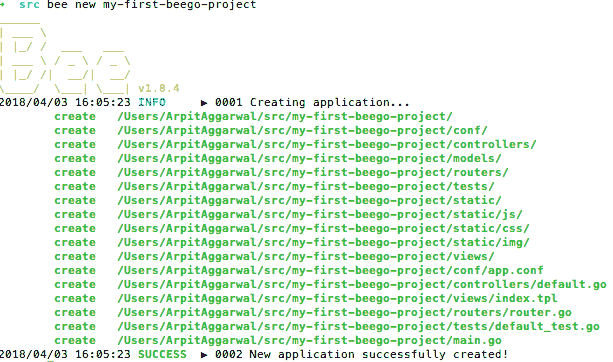
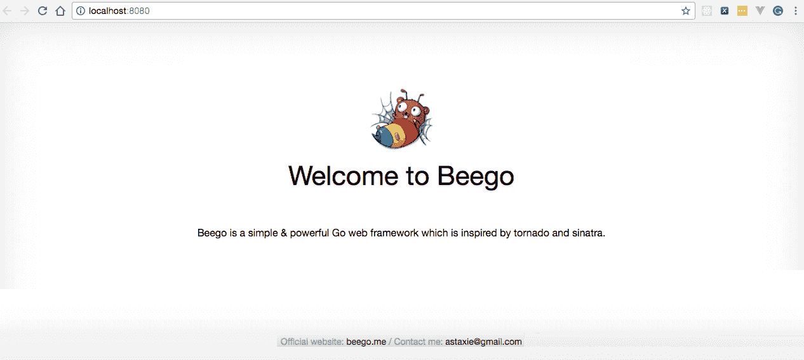
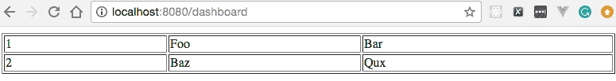
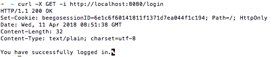
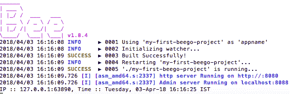
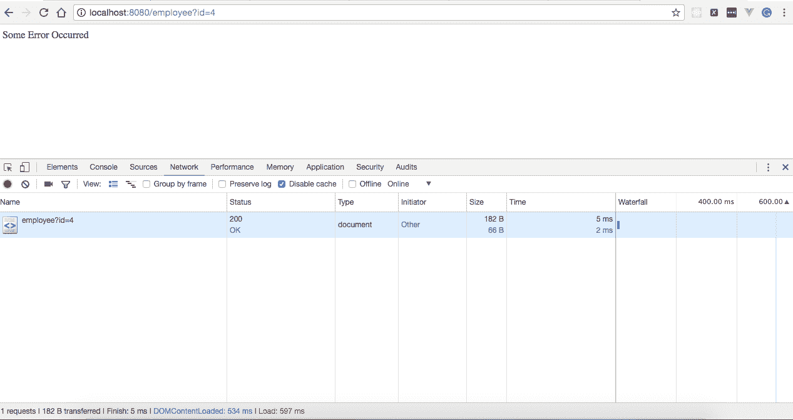
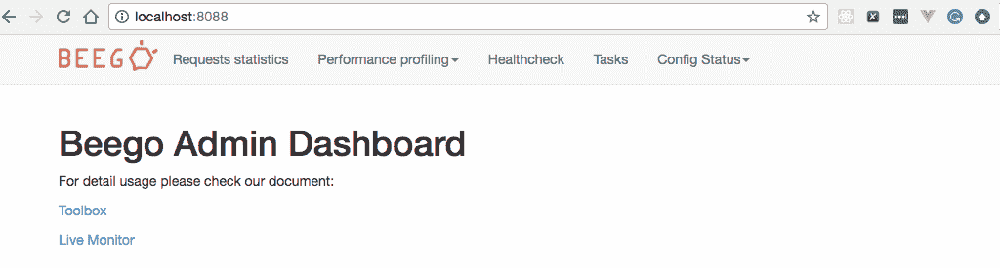

# 八、使用 Go Web 应用框架——Beego

在本章中，我们将介绍以下配方：

*   使用 Beego 创建第一个项目
*   创建第一个控制器和路由器
*   创建第一个视图
*   创建第一个会话变量
*   创建第一个过滤器
*   在 Beego 中处理 HTTP 错误
*   在 Beego 中实现缓存
*   监视 Beego 应用
*   在本地计算机上部署 Beego 应用
*   使用 Nginx 部署 Beego 应用

# 介绍

无论何时开发应用，web 应用框架都是必须的，因为它通过消除编写大量重复代码的需要并提供模型、API 和其他元素等功能，大大加快和简化了我们的工作。使用应用框架，我们可以享受其架构模式的好处，并促进应用的开发。

一种流行的 web 应用框架是**模型-视图-控制器**（**MVC**），Go 有很多 MVC 框架，如 Revel、Utron 和 Beego。

在本章中，我们将了解 Beego，它是最流行和最常用的 web MVC 框架之一。我们将从创建项目开始，然后继续创建控制器、视图和过滤器。我们还将介绍如何实现缓存、监视和部署应用

# 使用 Beego 创建第一个项目

我们启动一个项目首先要做的就是建立它的基本架构。在 Beego 中，可以使用名为`bee`的工具轻松实现这一点，我们将在本配方中介绍该工具。

# 怎么做…

1.  使用`go get`命令安装`github.com/beego/bee`包，如下所示：

```go
$ go get github.com/beego/bee
```

2.  打开一个终端到您的`$GOPATH/src`目录，并使用`bee new`命令创建一个项目，如下所示：

```go
$ cd $GOPATH/src
$ bee new my-first-beego-project
```

命令成功执行后，将创建一个新的 Beego 项目，控制台上的创建步骤将如以下屏幕截图所示：



3.  进入新建项目的路径，输入`bee run`编译并运行项目，如下所示：

```go
$ cd $GOPATH/src/my-first-beego-project
$ bee run
```

一旦命令执行成功，`bee`将构建项目并启动应用，如下图所示：


# 它是如何工作的…

命令成功执行后，web 应用将在默认的 Beego 端口`8080`上运行，浏览`http://localhost:8080/`将呈现应用的欢迎页面，如下图所示：



# 创建第一个控制器和路由器

web 应用的主要组件之一是控制器，它充当视图和模型之间的协调器，并处理用户的请求，这些请求可以是按钮单击、菜单选择或 HTTP`GET`和`POST`请求。在本食谱中，我们将学习如何在 Beego 中创建控制器。

# 怎么做…

1.  移动到`$GOPATH/src/my-first-beego-project/controllers`并创建`firstcontroller.go`，如下所示：

```go
package controllers
import "github.com/astaxie/beego"
type FirstController struct 
{
  beego.Controller
}
type Employee struct 
{
  Id int `json:"id"`
  FirstName string `json:"firstName"`
  LastName string `json:"lastName"`
}
type Employees []Employee
var employees []Employee
func init() 
{
  employees = Employees
  {
    Employee{Id: 1, FirstName: "Foo", LastName: "Bar"},
    Employee{Id: 2, FirstName: "Baz", LastName: "Qux"},
  }
}
func (this *FirstController) GetEmployees() 
{
  this.Ctx.ResponseWriter.WriteHeader(200)
  this.Data["json"] = employees
  this.ServeJSON()
}
```

2.  移动到`$GOPATH/src/my-first-beego-project/routers`编辑`router.go`增加`GET`映射`/employees`，由`FirstController`中定义的`GetEmployees`处理程序处理，如下：

```go
package routers
import 
(
  "my-first-beego-project/controllers"
  "github.com/astaxie/beego"
)
func init() 
{
  beego.Router("/", &controllers.MainController{})
  beego.Router("/employees", &controllers.FirstController{},
  "get:GetEmployees")
}
```

3.  使用以下命令运行项目：

```go
$ bee run
```

# 它是如何工作的…

一旦命令成功执行，web 应用将在默认的 Beego 端口`8080`上运行。

接下来，从命令行执行`GET`请求将为您提供所有员工的列表：

```go
$ curl -X GET http://localhost:8080/employees
[
 {
 "id": 1,
 "firstName": "Foo",
 "lastName": "Bar"
 },
 {
 "id": 2,
 "firstName": "Baz",
 "lastName": "Qux"
 }
]
```

让我们了解一下我们编写的程序：

*   `import “github.com/astaxie/beego"`：这里我们进口比戈。
*   `type FirstController struct { beego.Controller }`：这里我们定义了`FirstController`结构类型，它包含一个`beego.Controller`类型的匿名结构字段，因此`FirstController`自动获取`beego.Controller`的所有方法。
*   `func (this *FirstController) GetEmployees() { this.Ctx.ResponseWriter.WriteHeader(200) this.Data["json"] = employees this.ServeJSON() }`：这里我们定义了`GetEmployees`处理程序，该处理程序将对 URL 模式`/employees`的每个`GET`请求执行。

在 Go 中，以大写字母开头的函数或处理程序是导出函数，这意味着它们是公共的，可以在程序之外使用。这就是我们在程序中使用大写字母而不是驼峰字母定义所有函数的原因。

# 创建第一个视图

视图是模型的可视表示形式。它通过模型访问数据，并指定数据的显示方式。当模型发生更改时，它保持其表示的一致性，可以通过推送模型（视图向模型注册以进行更改通知），也可以通过拉式模型（视图负责在需要检索最新数据时调用模型）。在本食谱中，我们将学习如何创建第一个视图来呈现员工列表。

# 怎么做…

1.  移动到`$GOPATH/src/my-first-beego-project/views`并创建`dashboard.tpl`并复制以下内容：

```go
<!DOCTYPE html>
<html>
  <body>
    <table border= "1" style="width:100%;">
      {{range .employees}}
      <tr>
        <td>{{.Id}}</td>
        <td>{{.FirstName}}</td>
        <td>{{.LastName}}</td>
      </tr>
      {{end}}
    </table>
  </body>
</html>
```

2.  移动到`$GOPATH/src/my-first-beego-project/controllers`并编辑`firstcontroller.go`以添加`Dashboard`处理程序，如下所示：

```go
package controllers
import "github.com/astaxie/beego"
type FirstController struct 
{
  beego.Controller
}
type Employee struct 
{
  Id int `json:"id"`
  FirstName string `json:"firstName"`
  LastName string `json:"lastName"`
}
type Employees []Employee
var employees []Employee
func init() 
{
  employees = Employees
  {
    Employee{Id: 1, FirstName: "Foo", LastName: "Bar"},
    Employee{Id: 2, FirstName: "Baz", LastName: "Qux"},
  }
}
...
func (this *FirstController) Dashbaord() 
{
  this.Data["employees"] = employees
  this.TplName = "dashboard.tpl"
}
```

3.  移动到`$GOPATH/src/my-first-beego-project/routers`编辑`router.go`添加`GET`映射`/dashboard`，将由`FirstController`中定义的`Dashboard`处理程序进行处理，如下所示：

```go
package routers
import 
(
  "my-first-beego-project/controllers"
  "github.com/astaxie/beego"
)
func init() 
{
  beego.Router("/", &controllers.MainController{})
  beego.Router("/employees", &controllers.FirstController{},
  "get:GetEmployees")
  beego.Router("/dashboard", &controllers.FirstController{},
  "get:Dashbaord")
}

```

4.  使用以下命令运行项目：

```go
$ bee run
```

# 它是如何工作的…

一旦命令成功执行，web 应用将在默认的 Beego 端口`8080`上运行。

浏览`http://localhost:8080/dashboard`会弹出员工仪表板，如下图所示：



# 创建第一个会话变量

当我们需要将用户数据从一个 HTTP 请求传递到另一个 HTTP 请求时，我们可以使用 HTTP 会话，我们将在本配方中介绍。

# 准备好了…

此配方假设您已在端口`6379`上安装并在本地运行`Redis`。

# 怎么做…

1.  使用`go get`命令安装`github.com/astaxie/beego/session/redis`包，如下所示：

```go
$ go get -u github.com/astaxie/beego/session/redis
```

2.  移动到`$GOPATH/src/my-first-beego-project/controllers`并创建`sessioncontroller.go`，在这里我们将定义处理程序，确保只有经过身份验证的用户才能查看主页，如下所示：

```go
package controllers 
import "github.com/astaxie/beego"
type SessionController struct 
{
  beego.Controller
}
func (this *SessionController) Home() 
{
  isAuthenticated := this.GetSession("authenticated")
  if isAuthenticated == nil || isAuthenticated == false 
  {
    this.Ctx.WriteString("You are unauthorized to 
    view the page.")
    return
  }
  this.Ctx.ResponseWriter.WriteHeader(200)
  this.Ctx.WriteString("Home Page")
}
func (this *SessionController) Login() 
{
  this.SetSession("authenticated", true)
  this.Ctx.ResponseWriter.WriteHeader(200)
  this.Ctx.WriteString("You have successfully logged in.")
}
func (this *SessionController) Logout() 
{
  this.SetSession("authenticated", false)
  this.Ctx.ResponseWriter.WriteHeader(200)
  this.Ctx.WriteString("You have successfully logged out.")
}
```

3.  移动到`$GOPATH/src/my-first-beego-project/routers`编辑`router.go`添加`GET`映射`/home`、`/login`和`/logout`，分别由`FirstController`中定义的`Home`、`Login`和`Logout`处理程序处理，如下所示：

```go
package routers
import 
(
  "my-first-beego-project/controllers"
  "github.com/astaxie/beego"
)
func init() 
{
  beego.Router("/", &controllers.MainController{})
  beego.Router("/employees", &controllers.FirstController{},
  "get:GetEmployees")
  beego.Router("/dashboard", &controllers.FirstController{}, 
  "get:Dashbaord")
  beego.Router("/home", &controllers.SessionController{},
  "get:Home")
  beego.Router("/login", &controllers.SessionController{}, 
  "get:Login")
  beego.Router("/logout", &controllers.SessionController{}, 
  "get:Logout")
}
```

4.  移动到`$GOPATH/src/my-first-beego-project`编辑`main.go`导入`github.com/astaxie/beego/session/redis`，如下：

```go
package main
import 
(
  _ "my-first-beego-project/routers"
  "github.com/astaxie/beego"
  _ "github.com/astaxie/beego/session/redis"
)
func main() 
{
  beego.BConfig.WebConfig.DirectoryIndex = true
  beego.BConfig.WebConfig.StaticDir["/swagger"] = "swagger"
  beego.Run()
}
```

5.  打开`$GOPATH/src/my-first-beego-project/conf/app.conf`中的`session`用法，如下所示：

```go
SessionOn = true
SessionProvider = "redis"
SessionProviderConfig = "127.0.0.1:6379"
```

6.  使用以下命令运行程序：

```go
$ bee run 
```

# 它是如何工作的…

一旦命令成功执行，web 应用将在默认的 Beego 端口`8080`上运行。

接下来，我们将执行几个命令来查看会话是如何工作的。首先，我们将通过执行以下命令来访问`/home`：

```go
$ curl -X GET http://localhost:8080/home 
```

这将给我们一条未经授权的访问消息，作为服务器的响应：

```go
You are unauthorized to view the page.
```

显然，我们无法访问它，因为我们必须先登录应用，这将创建一个`beegosessionID`。现在，让我们通过执行以下命令登录到应用：

```go
$ curl -X GET -i http://localhost:8080/login
```

这将导致服务器做出以下响应：



现在我们将使用作为`/login`请求的一部分创建的 cookie`beegosessionID`来访问`/home`，如下所示：

```go
$ curl --cookie "beegosessionID=6e1c6f60141811f1371d7ea044f1c194" http://localhost:8080/home Home Page
```

# 创建第一个过滤器

有时，我们可能希望在调用操作方法之前或在操作方法运行之后执行逻辑。在这种情况下，我们使用过滤器，这将在本配方中介绍。

过滤器基本上是封装公共功能或横切关注点的处理程序。我们只需定义它们一次，然后将它们应用于不同的控制器和操作方法。

# 怎么做…

1.  使用`go get`命令安装`github.com/astaxie/beego/context`包，如下所示：

```go
$ go get github.com/astaxie/beego/context
```

2.  移动到`$GOPATH/src/my-first-beego-project/filters`并创建`firstfilter.go`，在`Controller`之前运行，并记录 IP 地址和当前时间戳，如下所示：

```go
package filters 
import 
(
  "fmt"
  "time"
  "github.com/astaxie/beego/context"
)
var LogManager = func(ctx *context.Context) 
{ 
  fmt.Println("IP :: " + ctx.Request.RemoteAddr + ", 
  Time :: " + time.Now().Format(time.RFC850))
}
```

3.  移动到`$GOPATH/src/my-first-beego-project/routers`编辑`router.go`添加`GET`映射`/*`，由`LogManager`过滤器处理，如下：

```go
package routers 
import 
(
  "my-first-beego-project/controllers"
  "my-first-beego-project/filters"
  "github.com/astaxie/beego"
)
func init() 
{
  beego.Router("/", &controllers.MainController{})
  ...
  beego.InsertFilter("/*", beego.BeforeRouter, 
  filters.LogManager)
}
```

4.  使用以下命令运行程序：

```go
$ bee run
```

# 它是如何工作的…

一旦命令成功执行，web 应用将在默认的 Beego 端口`8080`上运行

接下来，我们将执行一个请求，通过执行以下命令获取所有员工：

```go
$ curl -X GET http://localhost:8080/employees
[
 {
 "id": 1,
 "firstName": "Foo",
 "lastName": "Bar"
 },
 {
 "id": 2,
 "firstName": "Baz",
 "lastName": "Qux"
 }
]
```

命令成功执行后，我们可以在控制台上的应用日志中看到打印的 IP 和时间戳，如下所示：



使用`beego.InsertFilter("/*", beego.BeforeRouter, filters.LogManager) `，我们在应用中插入了一个过滤器，该过滤器在找到路由器之前针对 URL 模式`/*`执行，并由`LogManager`处理。与`beego.BeforeRouter`类似，我们可以在其他四个位置放置过滤器：`beego**.**BeforeStatic`、`beego.BeforeExec`、`beego.AfterExec`和`beego.FinishRouter`。

# 在 Beego 中处理 HTTP 错误

错误处理是 web 应用设计中最重要的方面之一，因为它有两种帮助。首先，它以相对友好的方式让应用用户知道出现了问题，他们应该联系技术支持部门或通知技术支持人员。其次，它允许程序员添加一些细节来帮助调试问题。在这个配方中，我们将学习如何在 Beego 中实现错误处理。

# 怎么做…

1.  移动到`$GOPATH/src/my-first-beego-project/controllers`并创建`errorcontroller.go`，在这里我们将定义处理`404`和`500`HTTP 错误的处理程序，以及处理应用中任何一般错误的处理程序，如下所示：

```go
package controllers
import "github.com/astaxie/beego"
type ErrorController struct 
{
  beego.Controller
}
func (c *ErrorController) Error404() 
{
  c.Data["content"] = "Page Not Found"
  c.TplName = "404.tpl"
}
func (c *ErrorController) Error500() 
{
  c.Data["content"] = "Internal Server Error"
  c.TplName = "500.tpl"
}
func (c *ErrorController) ErrorGeneric() 
{
  c.Data["content"] = "Some Error Occurred"
  c.TplName = "genericerror.tpl"
}
```

2.  移动到`$GOPATH/src/my-first-beego-project/controllers`并编辑`firstcontroller.go`添加`GetEmployee`处理程序，该处理程序将从 HTTP 请求参数中获取 ID，从静态员工数组中获取员工详细信息，并将其作为响应返回，如果请求的 ID 不存在，则抛出一般错误，如下所示：

```go
package controllers
import "github.com/astaxie/beego"
type FirstController struct 
{
  beego.Controller
}
type Employee struct 
{
  Id int `json:"id"`
  FirstName string `json:"firstName"`
  LastName string `json:"lastName"`
}
type Employees []Employee
var employees []Employee
func init() 
{
  employees = Employees
  {
    Employee{Id: 1, FirstName: "Foo", LastName: "Bar"},
    Employee{Id: 2, FirstName: "Baz", LastName: "Qux"},
  }
}
...
func (this *FirstController) GetEmployee() 
{
  var id int
  this.Ctx.Input.Bind(&id, "id")
  var isEmployeeExist bool
  var emps []Employee
  for _, employee := range employees 
  {
    if employee.Id == id 
    {
      emps = append(emps, Employee{Id: employee.Id, 
      FirstName: employee.FirstName, LastName: 
      employee.LastName})
      isEmployeeExist = true
      break
    }
  }
  if !isEmployeeExist 
  {
    this.Abort("Generic")
  } 
  else 
  {
    this.Data["employees"] = emps
    this.TplName = "dashboard.tpl"
  }
}
```

3.  移动到`$GOPATH/src/my-first-beego-project/views`并创建具有以下内容的`genericerror.tpl`：

```go
<!DOCTYPE html>
<html>
  <body>
    {{.content}}
  </body>
</html>
```

4.  使用以下命令运行程序：

```go
$ bee run 
```

# 它是如何工作的…

一旦命令成功执行，web 应用将在默认的 Beego 端口`8080`上运行

接下来，浏览`http://localhost:8080/employee?id=2`会给出员工的详细信息，如下图所示：


鉴于浏览`http://localhost:8080/employee?id=4`如下：



当发生错误时，它将向您提供错误消息。这是因为我们询问了 ID 为`4`的员工的详细信息，该员工在静态员工数组中不存在，因此从服务器抛出一般错误，该错误由`errorcontroller.go`中定义的`ErrorGeneric`处理程序处理。

# 在 Beego 中实现缓存

在 web 应用中缓存数据有时是必要的，以避免一次又一次地从数据库或外部服务请求静态数据。在本教程中，我们将学习如何在 Beego 应用中实现缓存。

Beego 支持四个缓存提供程序：`file`、`Memcache`、`memory`和`Redis`。在此配方中，我们将使用框架默认缓存提供程序，它是一个`memory`缓存提供程序。

# 怎么做…

1.  使用`go get`命令安装`github.com/astaxie/beego/cache`包，如下所示：

```go
$ go get github.com/astaxie/beego/cache
```

2.  移动到`$GOPATH/src/my-first-beego-project/controllers`并创建`cachecontroller.go`，在这里我们将定义`GetFromCache`处理程序，它将从缓存中获取密钥的值并将其写入 HTTP 响应，如下所示：

```go
package controllers
import 
(
  "fmt"
  "time"
  "github.com/astaxie/beego"
  "github.com/astaxie/beego/cache"
)
type CacheController struct 
{
  beego.Controller
}
var beegoCache cache.Cache
var err error
func init() 
{
  beegoCache, err = cache.NewCache("memory",
  `{"interval":60}`)
  beegoCache.Put("foo", "bar", 100000*time.Second)
}
func (this *CacheController) GetFromCache() 
{
  foo := beegoCache.Get("foo")
  this.Ctx.WriteString("Hello " + fmt.Sprintf("%v", foo))
}
```

3.  移动到`$GOPATH/src/my-first-beego-project/routers`编辑`router.go`添加`GET`映射`/getFromCache`，该映射将由`CacheController`中定义的`GetFromCache`处理程序进行处理，如下所示：

```go
package routers
import 
(
  "my-first-beego-project/controllers"
  "my-first-beego-project/filters"
  "github.com/astaxie/beego"
)
func init() 
{
  beego.Router("/", &controllers.MainController{})
  ... 
  beego.Router("/getFromCache", &controllers.
  CacheController{}, "get:GetFromCache")
}
```

4.  使用以下命令运行程序：

```go
$ bee run
```

# 它是如何工作的…

一旦命令成功执行，web 应用将在默认的 Beego 端口`8080`上运行

在应用启动时，名为`foo`且值为`bar`的密钥将添加到缓存中。接下来，浏览`http://localhost:8080/getFromCache`会从缓存中读取一个`foo`键值，将其追加到 Hello 中，并显示在浏览器**上，如下图所示：**

 **

# 监视 Beego 应用

Beego 应用启动并运行后，我们可以通过其管理仪表板轻松监控应用请求统计信息、性能、运行状况检查、任务和配置状态。我们将在本食谱中学习如何做到这一点。

# 怎么做…

1.  通过在`$GOPATH/src/my-first-beego-project/conf/app.conf`中添加`EnableAdmin = true`来启用应用实时监视器，如下所示：

```go
appname = my-first-beego-project
...
EnableAdmin = true
..
```

（可选）通过在`$GOPATH/src/my-first-beego-project/conf/app.conf`中添加字段来更改其侦听的端口：

```go
AdminAddr = "localhost"
AdminPort = 8088
```

2.  使用以下命令运行程序：

```go
$ bee run
```

# 它是如何工作的…

一旦命令成功执行，web 应用将在默认的 Beego 端口`8080`上运行，浏览`http://localhost:8088/`将呈现管理仪表板，如以下屏幕截图所示：



浏览`http://localhost:8088/qps`会显示一个应用的请求统计信息，如下图所示：


# 在本地计算机上部署 Beego 应用

一旦应用开发结束，我们就必须部署它，使其可供最终用户使用，这可以在本地或远程完成。在本教程中，我们将学习如何在本地机器上部署 Beego 应用

# 怎么做…

1.  由于`bee`创建的应用默认处于开发模式，在面向公众的服务器上以生产模式运行应用始终是最佳实践，因此我们必须将`$GOPATH/src/my-first-beego-project/conf/app.conf`中的`RunMode`更改为`prod`，如下所示：

```go
beego.RunMode = "prod"
```

2.  通过执行以下命令，将静态文件、配置文件和模板作为 Beego 应用字节码文件的一部分包含在单独的目录中：

```go
$ mkdir $GOPATH/my-first-beego-app-deployment
$ cp my-first-beego-project $GOPATH/my-first-beego-app-deployment
$ cp -fr views $GOPATH/my-first-beego-app-deployment
$ cp -fr static $GOPATH/my-first-beego-app-deployment
$ cp -fr conf $GOPATH/my-first-beego-app-deployment
```

3.  移动到`$GOPATH/my-first-beego-app-deployment`并使用`nohup`命令将应用作为后端进程运行，如下所示：

```go
$ cd $GOPATH/my-first-beego-app-deployment
$ nohup ./my-first-beego-project &
```

# 它是如何工作的…

命令执行成功后，web 应用将在默认的 Beego 端口`8080`上运行，浏览`http://localhost:8080/`将呈现应用的欢迎页面，如下图所示：


# 使用 Nginx 部署 Beego 应用

在前面的配方中，我们了解了如何在本地运行 Beego 应用。在此配方中，我们将使用`Nginx`部署相同的应用。

# 准备好了…

本配方假设您已在端口`80`上安装并运行`Nginx`。对我来说，它安装在`/Users/ArpitAggarwal/nginx`。

# 怎么做…

1.  在`/Users/ArpitAggarwal/nginx/conf/nginx.conf`打开 Nginx 配置文件，将`server`下的`location`块替换为以下内容：

```go
location / 
{
 # root html;
 # index index.html index.htm;
 proxy_pass http://localhost:8080/;
}
```

2.  通过执行以下命令启动 Nginx：

```go
$ cd /Users/ArpitAggarwal/nginx/sbin
$ ./nginx
```

3.  通过执行以下命令运行 Beego 应用：

```go
$ bee run
```

# 它是如何工作的…

命令执行成功后，浏览`http://localhost:80/`将呈现应用的欢迎页面，如下图所示：

**