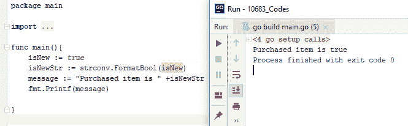
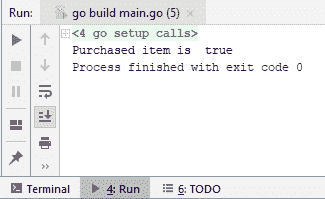
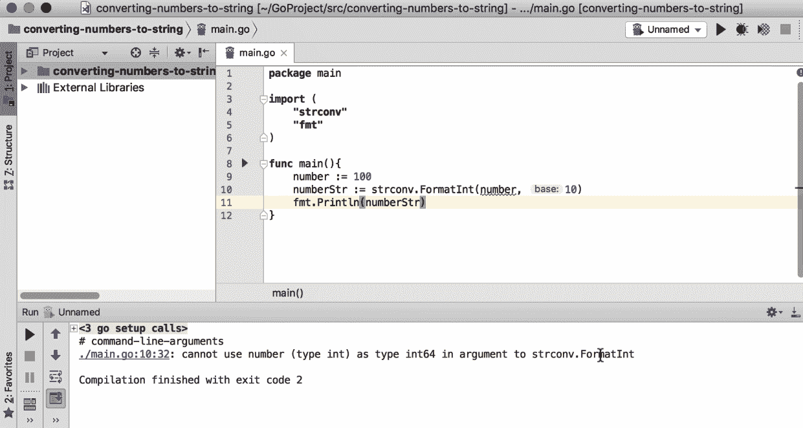
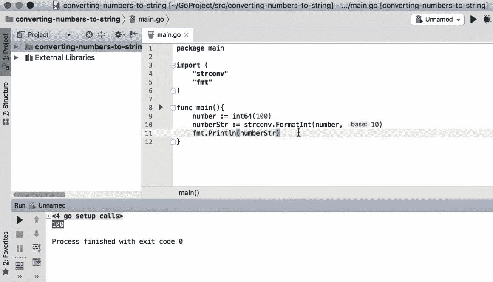
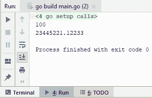
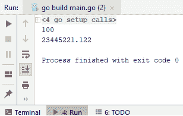
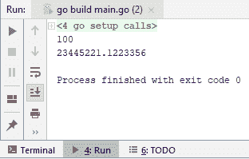
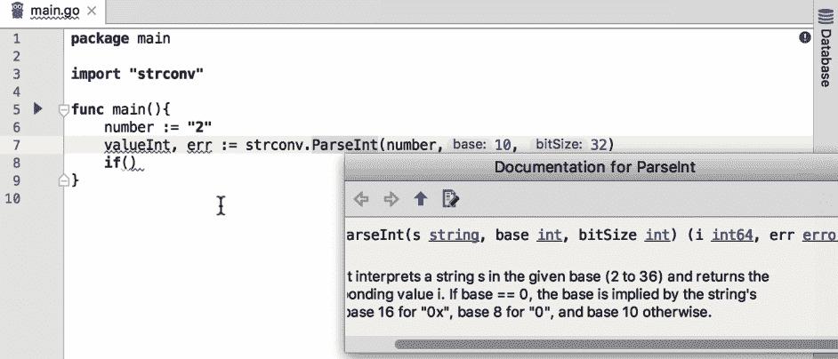
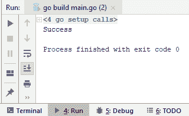
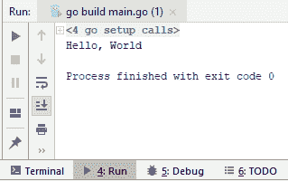

# 类型转换


在日常编程活动中，将类型从一种转换为另一种是一种非常常见的操作，因此了解如何进行转换非常重要。在本章中，我们将通过一些实际示例来学习如何轻松地将一种类型转换为另一种类型。

本章将介绍以下主题：

*   从字符串的开头和结尾修剪空格
*   从字符串值中提取子字符串
*   替换字符串的各个部分
*   字符串中的转义字符
*   大写字符串值


# 将布尔值转换为字符串


我们将从学习如何将`Boolean`值转换为`String`值开始：

1.  在我们的编辑器中，在创建一个新的文件，Enter T0T，和 OutT1 函数之后，我们总是考虑一个名为 Ont2 的变量，这是一个布尔值。因此，该值将为`true`。

2.  所以，假设我们想将它打印到控制台，并显示一条消息。检查以下屏幕截图：


如您所见，我们遇到了编译时错误。因此，您无法使用`+`运算符和我们需要将`isNew`布尔值转换为其字符串表示形式。

3.  让我们使用se`stringconvert`包，它有各种字符串转换函数，其中我们将使用`FormatBool`。
4.  取一个`Boolean`值返回它的每个字符串表示形式，在本例中，它是`isNew`。如果查看签名，您将看到它根据传递的布尔值返回 true 或 false:[T3]


5.  因此，让添加`isNewStr`，运行它并检查输出：



还有另一种方式将这些值打印到控制台，称为`Printf`。它实际上可以将各种类型格式化到控制台。例如，我们可以使用前面讨论过的特殊字符。

Note that we won't use `isNewStr` for `Printf` because now we can use any type and it will find a default representation to string.

6.  Moreo版本，Go 不接受未使用的变量和未使用的包，因此，我们将注释`isNewStr := strconv.FormatBool(isNew)`并删除`isNewStr`。现在，我们可以运行以下代码：

```go
package main
import (
  "fmt"
)
func main(){
  isNew := true
  // isNewStr := strconv.FormatBool(isNew)
  message := "Purchased item is "
  fmt.Printf("%s %v", message, isNew)
}
```

7.  获得以下下降输出：



8.  现在，我们得到了与之前相同的消息，这就是如何轻松地将`Boolean`类型转换为`String`。

在下一节中，我们将看到如何将整数值和浮点值转换为字符串。


# 将整数值和浮点值转换为字符串


在本节中，我们将学习如何将整数值和浮点值转换为字符串值。起初，这可能看起来有点复杂，但在本节之后，您将能够轻松地处理这些转换。那么，让我们回到我们的编辑器，看看我们如何做到这一点。


# 将整数值转换为字符串值


让我们从将整数值转换为字符串值开始：

1.  在字符串转换包`strconv`下，我们有一系列函数可以用于这些转换；其中一个功能是`FormatInt`。
2.  那么让我们继续使用 10 号基数。可以有不同的基数，例如 16、10 和 24。
3.  如果您查看签名，您将看到它返回一个字符串。
4.  现在，代码将不能完全按照我们想要的方式工作，但我们将看到原因，并将修复它。运行前面描述的代码时，将获得以下输出：



5.  现在，我们知道它接受整数类型 64；让我们修改代码并再次运行，以获得如下输出：



6.  我们将[T0]作为字符串值返回控制台。您可能不想一直这样做，因此可以运行以下代码：

```go
package main
import (
  "strconv"
  "fmt"
)
func main(){
  number := 100
  numberStr := strconv.Itoa(number)
  fmt.Println(numberStr)
}
```

7.  我们使用了一个不同的函数，可以自动将整数转换为 ASCII。在运行代码时，我们获得以下输出：


# 将浮点值转换为字符串值


让我们转到第二个转换，它将浮点值转换为字符串值：

1.  在此，我们将为`numberFloat`提供另一个数字，例如`23445221.1223`，我们将学习将其转换为收缩值。
2.  我们将考虑另一个函数，这是一个函数。
3.  那么，让我们继续看签名：


4.  它希望我们做的第一件事是传递一个 float`64`（我们还有 float`32`；它们是`bitSizes`，代表浮动的大小。我们有可以使用各种字母的格式（`fmt`），如*E*、*F*或*G；*例如，*G*代表大指数，*F*代表无指数。我们有精度，它基本上告诉我们使用点后的数字要走多远，位大小是 float`32`或 float`64`。我们可以根据情况的需要添加所有这些实体。因此，您可以运行以下代码：

```go
package main
import (
 "strconv"
 "fmt"
)
func main(){
 number := 100
 numberStr := strconv.Itoa(number)
 fmt.Println(numberStr)
 numberFloat := 23445221.1223356
 numberFloatStr := strconv.FormatFloat(numberFloat, 'f', 5, 64 )
 fmt.Println(numberFloatStr)
}
```

5.  上述代码的输出如下所示：



6.  让我们再精确一点；如果我们将其更改为`3`，您将获得以下输出：



7.  输出仅在点后显示三个字符或三个数字。如果您不知道点后需要多少位数字，可以将精度设置为`-1`，输出显示点后所有数字；例如，检查以下代码：

```go
package main
import (
  "strconv"
  "fmt"
)
func main(){
  number := 100
  numberStr := strconv.Itoa(number)
  fmt.Println(numberStr)
  numberFloat := 23445221.1223356
  numberFloatStr := strconv.FormatFloat(numberFloat, 'f',-1,64 )
  fmt.Println(numberFloatStr)
}
```

8.  前面的代码将为我们提供以下输出：



9.  所以，这就是为什么当你想显示所有内容但不知道点后的确切数字时，你可能想要使用`-1`的精度。

这就是如何在 Go 中将整数值和浮点值转换为字符串值的方法。在下一节中，我们将看到如何将字符串值解析为布尔值。


# 将字符串值解析为布尔值


在本节中，我们将了解如何将字符串值转换为布尔值：

1.  所以，在我们的编辑器中，我们将有一个变量名`isNew`，这将是一个字符串值，也是一个真值。我们将使用一个名为`strconv`的包，它有`ParseBool`。它返回两个值：一个是布尔值，另一个是错误。那么，让我们检查以下代码：

```go
package main
import (
  "strconv"
  "fmt"
)
```

```go
func main(){
  isNew := "true"
  isNewBool, err := strconv.ParseBool(isNew)
  if(err != nil){
    fmt.Println("failed")
  }else{
    if(isNewBool){
      fmt.Print("IsNew")
    }else{
      fmt.Println("Not new")
    }
  }
}
```

2.  您应该检查错误是否为零。这意味着发生了错误，我们将不得不处理它。例如，我们只是要输出一些失败消息，即，[T0]。
3.  如果在其他语言中不是 nil，但这里是 nil，那么我们必须检查[T0]布尔值。如果看起来不错，我们将向输出写入[T1]，或者写入[T2]。
4.  运行代码时，您将获得以下输出：


5.  如您所见，它通过了，没有抛出异常。如果将`true`更改为`false`，我们将获得`Not new`的输出。当然，`ParseBool`方法足够灵活，可以接受各种字符串值

6.  如果您查看以下屏幕截图中的签名，您将看到`T`、`TRUE`、`true`等等：


7.  如果我们输入`1`而不是`true`，输出仍然是`IsNew`；如果我们输入`0`、`F`或`f`，它将转换为`false`，并输出`Not new`。
8.  让我们看看如果我们通过`J`会发生什么：

```go
package main
import (
  "strconv"
  "fmt"
)
func main(){
  isNew := "j"
  isNewBool, err := strconv.ParseBool(isNew)
  if(err != nil){
    fmt.Println("failed")
  }else{
    if(isNewBool){
      fmt.Print("IsNew")
    }else{
      fmt.Println("Not new")
    }
  }
}
```

9.  代码将输出以下内容：


10.  如您所见，输出将为`failed`。

在下一节中，我们将向您展示如何将字符串值解析为整数和浮点类型。


# 将字符串值解析为整数和浮点类型


在本节中，我们将看到如何将字符串值解析为整型和浮点型。


# 将字符串值解析为整数类型


让我们假设我们有一个名为`number`的变量，它以`2`作为字符串。我们将使用`strconv.ParseInt`，它返回两个变量：第一个是我们期望的实际整数，另一个是在转换过程中出现任何错误时产生的返回变量。

如果您查看签名，您将看到它返回整数[T0]和一个错误：



因此，我们可以做的第一件事是检查转换过程中是否发生任何错误；如果不是 nil，我们可以理解发生了什么，我们将键入[T0]。

There's no `try...catch` in Go, so you always have to do error checking if you want to write resilient code.

现在，对于`if`检查，如果数字是`2`，我们可以给出`Success`作为输出。现在，让我们运行下面描述的代码：

```go
package main
import (
  "strconv"
  "fmt"
)
func main(){

  number := "2"
  valueInt, err := strconv.ParseInt(number, 10, 32)
  if err != nil {
    fmt.Print("Error happened.")
  } else {
    if valueInt == 2{
      fmt.Println("Success")
    }
  }
}
```

代码的输出如下所示：



转换是成功的。您也可以尝试 64 位，这会给出相同的结果。好吧这是从字符串到整数的转换。


# 将字符串值解析为浮点数


现在，让我们检查一下将字符串值解析为浮点数的过程。首先，我们将使用与解析字符串值以浮点数相同的代码，只需稍加修改。修改后的代码如下：

```go
package main
import (
  "strconv"
  "fmt"
)
func main(){

  numberFloat := "2.2"
  valueFloat, errFloat := strconv.ParseFloat(numberFloat, 64)
  if errFloat != nil {
    fmt.Print("Error happened.")
  } else {
    if valueFloat == 2.2 {
      fmt.Println("Success")
```

```go
    }
  }
}
```

在运行代码时，它返回一条`Success`消息。这意味着我们的转换是成功的，我们成功地从我们的`ParseFloat`方法中获得了`2.2`。

在下一节中，我们将学习如何将字节数组转换为字符串。


# 将字节数组转换为字符串


在本节中，我们将学习如何将字节数组转换为字符串：

The most important thing you need to know about this tutorial is that in Go, string variables are just a slice of bytes. Therefore, it is really easy to convert a byte array into a string value and a string value into a byte array.

1.  让我们看看如何开始。假设你有一个`helloWorldByte`数组；目前，它是一个文本字节数组，但您可以从任何流（如网络或文件）派生它：

```go
package main

import "fmt"

func main(){
  helloWorldByte := []byte{72, 101, 108, 108, 111, 44, 32, 87, 111, 114, 108, 100}
  fmt.Println(string(helloWorldByte))
}
```

2.  我们还有字符串构造，这使得将字节数组转换为它的字符串表示非常容易。我们将使用`fmt.Println`作为这个`helloWorldByte`的字符串表示，并运行代码。
3.  那么，让我们运行代码并检查输出：



4.  如您所见，我们非常简单地将整个字节数组转换为字符串表示形式。如果要将字符串转换为字节数组，也可以使用字节。让我们真的很快地做。检查以下代码：

```go
package main
import "fmt"
func main(){
  helloWorld := "Hello, World"
  fmt.Println([]byte(helloWorld))
}
```

5.  运行代码后，我们得到如下输出：


将字节数组转换为字符串包括[第 3 章](03.html)、*类型转换*。


# 总结


在本章中，我们介绍了从字符串的开头和结尾修剪空格、从字符串值中提取子字符串、替换字符串的某些部分、对字符串中的字符进行转义以及将字符串值大写。在[第 4 章](04.html)*日期和时间*中，我们将了解日期和时间的配方，我们将从学习如何找出今天的日期和时间开始。


