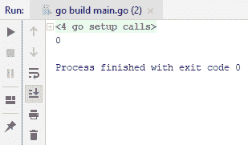
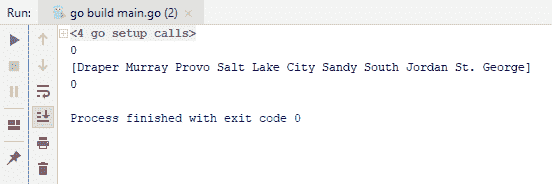
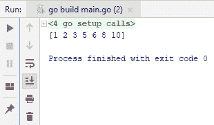
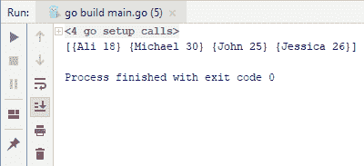
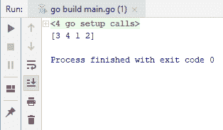
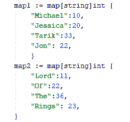
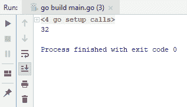
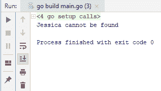

# 地图和阵列


在本章中，您将学习如何在 Go 中使用地图和数组。您将看到操作和迭代数组、合并数组和映射以及测试映射中是否存在键的实际示例。在本章中，我们将介绍以下配方：

*   从列表中提取唯一元素
*   从数组中查找元素
*   还原数组
*   在数组上迭代
*   将地图转换为键和值数组
*   合并数组
*   合并地图
*   测试地图中是否存在密钥


# 从数组中提取唯一元素


首先，我们将学习如何从列表中提取唯一的元素。首先，假设我们有一个切片，其中包含重复的元素。

现在，假设我们想要提取唯一的元素。因为我们在 Go 中没有内置的构造，所以我们将创建自己的函数来进行提取。所以我们有`uniqueIntSlice`功能，它接受`intSlice`或者`intarray`。我们独特的函数将接受`intSlice`并返回另一个片段。

所以，这个函数的思想是在一个单独的列表中跟踪重复的元素，如果一个元素重新出现在我们给定的列表中，那么我们不会将该元素添加到我们的新列表中。现在，检查以下代码：

```go
package main
import "fmt"
func main(){
  intSlice := []int{1,5,5,5,5,7,8,6,6, 6}
  fmt.Println(intSlice)
  uniqueIntSlice := unique(intSlice)
  fmt.Println(uniqueIntSlice)
}
func unique(intSlice []int) []int{
  keys := make(map[int]bool)
  uniqueElements := []int{}
  for _,entry := range intSlice {
    if _, value := keys[entry]; !value{
      keys[entry] =true
      uniqueElements = append(uniqueElements, entry)
    }
  }
  return uniqueElements
}
```

所以，我们将有`keys`，它基本上是一个地图，在其他语言中被称为字典。我们将有另一个片段来保存我们的[T1]，我们将做一个[T2]循环来迭代每个元素，并将其添加到新列表中，如果它不是重复的。我们基本上通过传递一个`entry`来获得我们的价值；如果值为`false`，那么我们将该条目添加到我们的键或映射中，并将其值设置为`true`，以便我们可以查看该元素是否已经出现在列表中。我们还有一个内置`append`函数，它接受一个切片，并将条目附加到切片的末尾，这将返回另一个切片。运行代码时，应获得以下输出：


如果你看第一个数组，有重复的元素：`6`和`5`的多个实例。在我们的新数组或切片中，没有任何重复项，这就是我们如何从列表中提取唯一元素的方法。

在下一节中，我们将学习如何从 Go 中的数组中查找元素。


# 从数组中查找元素


在本节中，我们将学习如何从数组或切片中查找元素。有很多方法可以做到这一点，但我们将在本章中介绍其中两种方法。假设我们有一个保存字符串片段的变量。在这个片段中搜索特定字符串的第一种方法是使用`for`循环：

```go
package main
import (
 "fmt"
 "sort"
)
func main() {
 str := []string{"Sandy","Provo","St. George","Salt Lake City","Draper","South Jordan","Murray"}
 for i,v := range str{
 if v == "Sandy" {
 fmt.Println(i)
 }
 }
}
```

在运行前面的代码时，我们在索引`0`处找到了单词`Sandy`：



另一种方法是使用排序，我们可以先对切片进行排序，然后再搜索特定的项目。为此，Go 提供了一个`sort`包。为了能够对切片进行排序，切片需要实现`sort`包需要的各种方法。`sort`包提供了一个名为`sort.stringslice`的类型，我们可以做的是将我们的`stringslice`转换为`sort`提供的`StringSlice`类型。这里，`sortedList`没有排序，所以我们必须显式地对它进行排序。现在，检查以下代码：

```go
package main
import (
  "fmt"
  "sort"
)
func main() {
  str := []string{"Sandy","Provo","St. George","Salt Lake City","Draper","South Jordan","Murray"}
  for i,v := range str{
    if v == "Sandy" {
      fmt.Println(i)
    }
  }
  sortedList := sort.StringSlice(str)
  sortedList.Sort()
  fmt.Println(sortedList)
}
```

代码将给出以下输出：


您可以看到，`Draper`在前面，然后是`Murray`，基本上是按升序排序的。现在，要在此处搜索特定项目，例如`Sandy`，只需在`main`函数中添加以下代码行：

```go
index := sortedList.Search("Sandy")
fmt.Println(index)
```

运行整个代码后获得以下输出：



输出`4`，即`Sandy`的位置。这就是在数组中查找元素的方式。同样的道理也适用于数字；例如，如果您查看`sort`包，您也会发现`IntSlice`。使用整数切片确实简化了数字的所有排序和搜索操作。在下一节中，我们将看到如何还原数组。


# 还原数组


在本节中，我们将学习如何对数组进行反向排序。我们将有一个变量，它保存一部分数字。由于您现在已经熟悉了 Go 中的`sort`包，您将知道`sort`包提供了许多功能，我们可以使用这些功能对数组和切片进行排序。如果您查看`sort`包，您将看到许多类型和函数

现在我们需要`sort`函数，它接受一个接口，这个接口在`sort`包中定义；因此，我们可以称之为`Sort`接口。我们将把我们的编号的切片转换成一个接口。查看以下代码：

```go
package main
import (
  "sort"
  "fmt"
)
func main() {
  numbers := []int{1, 5, 3, 6, 2, 10, 8}
  tobeSorted := sort.IntSlice(numbers)
  sort.Sort(tobeSorted)
  fmt.Println(tobeSorted)
}
```

此代码将为您提供以下输出：



如果您查看输出，您将看到我们已按升序对数字进行了排序。如果我们想按降序排列呢？为了能够做到这一点，我们有另一种称为`Reverse`的类型，它实现不同的函数以降序排序。请查看以下代码：

```go
package main
import (
  "sort"
  "fmt"
)
func main() {
  numbers := []int{1, 5, 3, 6, 2, 10, 8}
  tobeSorted := sort.IntSlice(numbers)
  sort.Sort(sort.Reverse(tobeSorted))
  fmt.Println(tobeSorted)
}
```

在运行代码时，我们获得以下输出，您将看到数字按降序排列：


在下一节中，我们将看到如何迭代数组。


# 在数组上迭代


在本节中，我们将学习如何迭代数组。对数组进行迭代是 Go 编程中最基本和最常见的操作之一。让我们去找我们的编辑，看看如何轻松地

```go
package main

import "fmt"

func main(){
  numbers := []int{1, 5, 3, 6, 2, 10, 8}

  for index,value := range numbers{
     fmt.Printf("Index: %v and Value: %v\n", index, value)
  }
}
```

我们从前面的代码中获得以下输出：


这就是迭代各种类型的切片的容易程度，包括字符串切片、字节切片或字节数组。

有时候，你不需要`index`。在这种情况下，您可以使用下划线（`_`忽略它）。这意味着你只对价值感兴趣。要执行此操作，可以键入以下代码：

```go
package main

import "fmt"

func main(){
  numbers := []int{1, 5, 3, 6, 2, 10, 8}
  for _,value := range numbers{
    // fmt.Printf("Index: %v and Value: %v\n", index, value)
    fmt.Println(value)
  }
}
```

此代码的输出如下所示：


这就是如何轻松迭代各种类型的切片。在下一节中，我们将看到如何将映射转换为键和值数组。


# 将地图转换为键和值数组


在本节中，我们将了解如何将映射转换为键和值数组。让我们想象一个名为`nameAges`的变量，它有`map`，如下面的代码块所示，我们将字符串值映射为整数值。还有名字和年龄。

我们需要添加一个名为`NameAge`的新结构，它将`Name`作为字符串，`Age`作为整数。我们现在将迭代我们的`nameAges`地图。我们将使用一个`for`循环，当您在映射类型上使用范围操作符时，它将返回两个内容，一个键和值。那么，让我们编写以下代码：

```go
package main
import "fmt"
type NameAge struct{
  Name string
  Age int
}
func main(){
  var nameAgeSlice []NameAge
  nameAges := map[string]int{
    "Michael": 30,
    "John": 25,
    "Jessica": 26,
    "Ali": 18,
  }
  for key, value := range nameAges{
    nameAgeSlice = append(nameAgeSlice, NameAge {key, value})
  }

  fmt.Println(nameAgeSlice)

}
```

运行上述代码时，您将获得以下输出：



这就是如何轻松地将贴图转换为数组。在下一节中，我们将学习如何在 Go 中合并数组。


# 合并数组


在本节中，我们将了解如何在 Go 中轻松合并两个数组。考虑我们有两个数组，我们将合并它们。如果您在前面使用了`append`，您将知道它可以根据需要接受任意多的参数。让我们检查以下代码：

```go
package main
import "fmt"
func main(){
  items1 := []int{3,4}
  items2 := []int{1,2}
  result := append(items1, items2...)
  fmt.Println(result)
}
```

运行以下代码时，您将获得以下输出：



现在，我们可以在输出中看到`[3 4 1 2]`。可以向数组中添加更多值，但仍可以合并它们。这就是我们如何在 Go 中轻松合并两个数组的方法。在下一节中，我们将看到这次如何合并贴图。


# 合并地图


在本节中，我们将学习如何合并地图。查看以下屏幕截图中的两个地图：



如您所见，共有四项，映射基本上是将字符串映射为整数。

If you don't use a comma, as shown after `22` in the preceding screenshot, you'll get a compile-time exception. This is because of the automatic addition of a semicolon in Go, which is not appropriate in this code.

好的，让我们继续合并这两张地图。不幸的是，没有内置的方法来实现这一点，所以我们所要做的只是迭代这两个映射，然后将它们合并在一起。请查看以下代码：

```go
package main
import "fmt"
func main(){
  map1 := map[string]int {
   "Michael":10,
   "Jessica":20,
   "Tarik":33,
   "Jon": 22,
  }
  fmt.Println(map1)

  map2 := map[string]int {
    "Lord":11,
    "Of":22,
    "The":36,
    "Rings": 23,
  }
  for key, value := range map2{
    map1[key] = value
  }
  fmt.Println(map1)
}
```

上述代码的输出如下所示：


好的，第一行，如你所见，只有我们使用的初始元素，第二行基本上包含所有内容，也就是说，从`map2`开始的所有项目。所以，这就是如何将两个贴图快速合并为一个。在下一节中，我们将学习如何测试地图中是否存在键。


# 测试地图中是否存在密钥


在本节中，我们将了解如何检查给定映射中是否存在密钥。所以我们有一张地图，`nameAges`，它基本上把名字和年龄对应起来。请查看以下代码：

```go
package main
import "fmt"
func main() {
  nameAges := map[string]int{
    "Tarik": 32,
    "Michael": 30,
    "Jon": 25,
  }

  fmt.Println(nameAges["Tarik"])
}
```

从下面的屏幕截图可以看出，我们基本上是从`Tarik`键中获取值的。因此，它只返回一个值，即`32`：



但是，还有另一种使用此映射的方法返回两件事：第一件是值，第二件是键是否存在。例如，请查看以下代码：

```go
package main
import "fmt"
func main() {
  nameAges := map[string]int{
    "Tarik": 32,
    "Michael": 30,
    "Jon": 25,
  }

  value, exists := nameAges["Tarik"]
  fmt.Println(value)
  fmt.Println(exists)
}
```

输出结果如下：


如您所见，代码返回`true`，因为地图中的`Tarik`存在于`nameAges`中。现在，如果我们键入一个地图中不存在的名称怎么办？如果我们在`nameAges`中用`Jessica`替换`Tarik`，则代码返回`0`和`false`，而不是之前获得的`32`和`true`。

此外，您还可以使用 Go 的`if`条件，这是一种条件检查。请查看以下代码：

```go
package main
import "fmt"
func main() {
  nameAges := map[string]int{
    "Tarik": 32,
    "Michael": 30,
    "Jon": 25,
  }
  if _, exists := nameAges["Jessica"]; exists{
    fmt.Println("Jessica has found")
  }else {
    fmt.Println("Jessica cannot be found")
  }
}
```

如果您查看以下输出，您可以看到我们得到了`Jessica cannot be found`：



这意味着它不存在。现在，如果我将`Jessica`添加到地图并运行以下代码，会怎么样

```go
package main
import "fmt"
func main() {
  nameAges := map[string]int{
    "Tarik": 32,
    "Michael": 30,
    "Jon": 25,
    "Jessica" : 20,
  }
  if _, exists := nameAges["Jessica"]; exists{
    fmt.Println("Jessica can be found")
  }else {
    fmt.Println("Jessica cannot be found")
  }
}
```

从前面代码的输出可以看出，代码返回`Jessica can be found`：


事实上，我们甚至可以在`if`之后添加一个`value`，正如我们之前看到的，并使用以下代码打印`value`：

```go
package main
import "fmt"
func main() {
  nameAges := map[string]int{
    "Tarik": 32,
    "Michael": 30,
    "Jon": 25,
    "Jessica" : 20,
  }
  if value, exists := nameAges["Jessica"]; exists{
    fmt.Println(value)
  }else {
    fmt.Println("Jessica cannot be found")
  }
}
```

我们将获得以下输出：


这就是您可以简单地查看给定映射中是否存在键的方式。


# 总结


本章介绍了许多主题，例如从列表中提取唯一元素、从数组中查找元素、还原数组、将映射转换为键和值数组、合并数组、合并映射以及测试映射中是否存在键。在[第 6 章](06.html)、*错误和记录*中，我们将看到错误和记录的方法，我们将从在 Go 中创建自定义错误类型开始。


