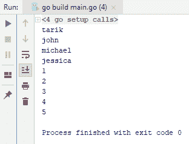
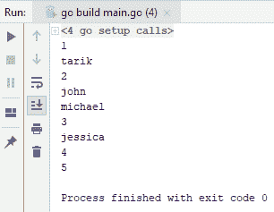
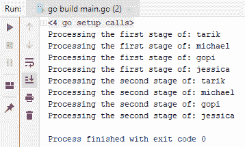
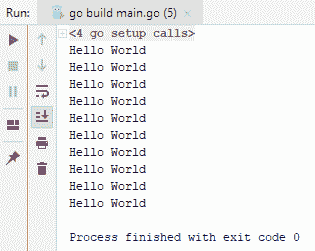
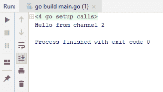

# 八、并发性


Go 最强大的功能之一是它与 API 的并发性。在本章中，您将学习如何在 Go 语言中使用并发结构。本章将介绍以下主题：

*   同时运行多个函数
*   在并发运行的函数之间传递数据
*   等待所有并发函数完成
*   选择并发函数的结果


# 同时运行多个函数


让我们从同时运行多个函数开始。

请查看以下代码块中的代码：

```go
import (
  "fmt"
  "time"
)

func main() {

  names := []string{"tarik", "john", "michael", "jessica"}

  for _, name := range names {
   time.Sleep(1 * time.Second)
   fmt.Println(name)
  }
```

```go
ages := []int{1, 2, 3, 4, 5}
  for _, age:= range ages {
    time.Sleep(1 * time.Second)
    fmt.Println(age)
  }
}
```

您可以从前面的代码中看到有两个不同的列表；每个列表都有至少需要一秒钟才能完成的项目，但出于练习目的，我们不会有任何实际代码，只会有`fmt.Println`。我们在每次迭代中添加了`time.Sleep`一秒钟。如前面代码所示，我们首先处理名称，然后处理年龄。你可以注意到的一件事是，他们并不是真的相互依赖；它们实际上是两个不同的作品。那么，让我们继续运行这个，看看它在我们的控制台上是什么样子的：



如果您观察输出过程，您将看到每一行输出在交付下一行之前等待一秒钟。您将看到它们实际上是连续的代码片段，即使它们彼此不依赖。我们必须等待循环完成，然后才能继续第二个`for`循环。

通过使用并发模式，我们可以使这个过程更具可伸缩性和效率。为此，我们将在 Go 中使用 Go 例程。Go 例程比线程更轻量级，并且与线程不同，它们主动而非先发制人地返回控制。随着我们的深入，你会更加了解我的确切意思。检查以下代码：

```go
package main

import (
  "fmt"
  "time"
)
```

```go
func main() {

  go func() {
    names := []string{"tarik", "john", "michael", "jessica"}

    for _, name := range names {
      time.Sleep(1 * time.Second)
      fmt.Println(name)
    }
  }()

  go func(){
    ages := []int{1, 2, 3, 4, 5}
    for _, age:= range ages {
      time.Sleep(1 * time.Second)
      fmt.Println(age)
    }
  }()
  time.Sleep(10*time.Second)
}
```

如您所见，我们使用 Go 关键字和匿名函数将代码转换为独立的功能片段，并将其转换为 Go 例程。多年来我们也做过同样的事情。运行代码时，您将获得以下输出：



正如您所看到的，输出不再像以前那样按顺序显示，而是随机显示。这意味着两个循环都是并行处理的。

If we remove `time.Sleep` (comment it out using `//`), we will not see any result on the console. This is because the main application is also run under a Go routine and that means we have three Go routines: the two that we typed and one that is the entire main application. The problem, as mentioned before, is that Go routines give control back to other Go routines voluntarily instead of preemptively. This means that when you use `time.Sleep`, the control will be given to other Go routines and our system will work properly.

现在，如果我们使用`1`秒而不是`10`秒，会发生什么，如我们上一个代码截图所示？您将无法获得任何输出。这是因为`1`秒不足以让所有 Go 例程完成任务。O 一旦主 Go 例程完成其进程，它将关闭整个应用程序，并且没有足够的时间让其他 Go 例程完成。有一种处理这种情况的方法，我们有另一种称为通道的构造。因此，为了简单起见，我们将删除第二个 Go 例程并立即使用通道。检查以下代码：

```go
package main

import (
    "time"
  "fmt"
)

func main() {

  nameChannel := make(chan string)

  go func() {
    names := []string{"tarik", "john", "michael", "jessica"}

    for _, name := range names {
    time.Sleep(1 * time.Second)
      //fmt.Println(name)
    nameChannel <- name
    }
  }()

  for data:= range nameChannel{
    fmt.Println(data)
  }
}
```

运行上述代码时，将出现如下异常：


出现此异常的原因是，当您使用完一个通道后，需要将其关闭，否则`for`循环将一直等待。但是，由于 Go 例程已使用该通道完成，因此循环将进入死锁并停止应用程序。因此，关闭通道的一种方法是添加以下高亮显示的代码行：

```go
package main

import (
    "time"
  "fmt"
)

func main() {

  nameChannel := make(chan string)

  go func() {
    names := []string{"tarik", "john", "michael", "jessica"}

    for _, name := range names {
    time.Sleep(1 * time.Second)
      //fmt.Println(name)
    nameChannel <- name
    }
    close(nameChannel)
    //nameChannel <- ""
  }()

  for data:= range nameChannel{
    fmt.Println(data)

    }

  //<-nameChannel
}
```

当通道闭合时，环路将终止。那么，让我们继续运行并检查输出：


正如你所看到的，我们在这里没有任何例外，一切看起来都很好。如果您不关心结果，并且希望使用我们的第一种方法，则可以使用以下代码：

```go
package main

import (
  "fmt"
  "time"
)

func main() {
  nameChannel := make(chan string)
  go func() {
    names := []string{"tarik", "john", "michael", "jessica"}
    for _, name := range names {
      time.Sleep(1 * time.Second)
      fmt.Println(name)
    }
    nameChannel <- ""
  }()
  <-nameChannel
}
```

我们所做的是将所有内容写入控制台，一旦循环完成，它就会设置`nameChannel`。此外，在这个场景中，我们等待从名称通道获得一些数据，因此我们不会终止应用程序。一旦我们从名称通道中获得了一些数据，我们就会读取它，而不会真正将它分配给任何东西。当`main`Go 例程进入下一行时，那里没有代码，因此退出`main`功能。因此，我们的应用程序已关闭。您将获得以下输出：


这就是如何使用通道和函数执行并发操作的方法。在结束之前，让我们重申关于渠道的一点。如果一个频道是空的，您尝试读取它，它将阻止它的 Go 例程。一旦它被填满，我们就可以从中读到一些东西；我们读取数据并继续。无法退出[T0]Go 例程的原因是因为我们以前没有向它发送任何值，这比使用计时器更有效，就像我们在前面的示例中所做的那样。

在下一节中，我们将看到如何在并发运行的函数之间传递数据。


# 在并发运行的函数之间传递数据


在本节中，我们将了解如何在 Go 例程之间传递数据。假设我们有两个 Go 例程，第一个 Go 例程对数据执行一些操作，然后将数据交给另一个 Go 例程，后者对该数据执行第二个处理阶段。现在，我们需要一种在第一个 Go 例程和第二个 Go 例程之间传递数据的方法。正如您所看到的，我们可能需要在两个 Go 例程之间进行一些同步，因为第二个 Go 例程必须等待，直到第二个 Go 例程向其提供一些数据。

首先，我们将使用以下代码：

```go
package main
import "fmt"
func main(){
  nameChannel := make(chan string)
  done := make(chan string)
  go func(){
    names := []string {"tarik", "michael", "gopi", "jessica"}
    for _, name := range names {
      // doing some operation
      fmt.Println("Processing the first stage of: " + name)
      nameChannel <- name
    }
    close(nameChannel)
  }()
  go func(){
    for name := range nameChannel{
      fmt.Println("Processing the second stage of: " + name)
    }
    done <- ""
  }()
  <-done
}
```

如果您查看代码，您可以看到我们再次使用了一个频道：`nameChannel`。因为我们需要从两个 Go 例程访问`nameChannel`，所以我们必须在`main`函数中声明它。在 first Go 例程中，我们将向`nameChannel`传递一些数据，即`name`。`name`变量是字符串数组，它包含一些数据，并且来自 first Go 例程。在第二个 Go 例程中，我们将使用`nameChannel`，并在填充时读取它。此外，我们必须使用另一个 Go 例程向主 Go 例程发送信号，以指示所有 Go 例程都已完成（`done := make(chan string)`。我们还必须使用`close`函数终止应用程序以避免任何死锁。当通道关闭时，`for`循环将终止，Go 例程将向`done`变量发送一些数据。然后，我们的主 Go 例程将读取它并进入下一行，退出`main`功能，我们的应用程序将完成。这是无缓冲通道；也就是说，在向其中发送更多数据之前，您可以发送必须读取和清空的单个数据，否则它将被阻止。

另一种方法是使用缓冲通道来提高性能。对前面的代码稍加修改将对我们有所帮助。我们将要添加整数`5`，这意味着您可以在不等待的情况下将五条数据发送到`nameChannel`。检查修改后的代码：

```go
package main
import "fmt"
func main(){
  nameChannel := make(chan string, 5)
  done := make(chan string)
  go func(){
    names := []string {"tarik", "michael", "gopi", "jessica"}
    for _, name := range names {
      // doing some operation
      fmt.Println("Processing the first stage of: " + name)
      nameChannel <- name
    }
    close(nameChannel)
  }()
  go func(){
    for name := range nameChannel{
      fmt.Println("Processing the second stage of: " + name)
    }
    done <- ""
  }()
  <-done
}
```

例如，它会发送一些数据，不会等待，因为还有四个位置。因此，它将进入第二次迭代，并向其中发送一些数据，直到计数变为`5`。好的一面是，当我们向名称通道发送数据时，我们也从中读取数据。以下是输出：



这就是如何在多个 Go 例程之间传递数据。在下一节中，我们将看到如何等待所有并发函数完成。


# 等待所有并发函数完成


在本节中，我们将了解如何等待所有并发函数完成。考虑到我们有一段代码，如下：

```go
package main

import (
  "fmt"
  )

func main() {
  for i := 0; i < 10; i++ {
    go func(){
      fmt.Println("Hello World")
    }()
  }
}
```

假设我们想要在一个循环中创建多个 Go 例程。在这种情况下，假设我们希望有 10 个 Go 例程加上主 Go 例程，因此总共有 11 个 Go 例程。如果您运行上一个屏幕截图中显示的代码，您将找不到任何输出。

等待所有这些 Go 例程完成以便向控制台显示某些内容的一种方法是使用`time.Sleep`，如以下代码所示：

```go
package main

import (
  "fmt"
  "time"
)

func main() {
  for i := 0; i < 10; i++ {
   go func(){
      fmt.Println("Hello World")
    }()
  }

  time.Sleep(10*time.Second)
}

```

运行上述代码时，您将获得以下输出：



现在，您已经获得了一个输出，但是这种方法的问题是，您通常不知道完成所有 Go 例程需要多少时间；因此，你无法真正预测时间。所以我们能做的就是使用 Go 库本身提供的东西，那就是`sync.WaitGroup`。顾名思义，它基本上是一组等待，可以用来等待所有 Go 例程完成。检查以下代码：

```go
package main
import (
  "fmt"
  "sync"
)

func main() {
  var wg sync.WaitGroup
  for i := 0; i < 10; i++ {
    wg.Add(1)
    go func(){
      fmt.Println("Hello World")
      wg.Done()
    }()
  }
  wg.Wait()
}
```

因此，在这里，对于每个迭代，我们可以向我们的等待组添加一个新项目，在本例中为`1`。因此，我们基本上会将[T1]中的等待次数增加[T2]。当一个 Go 例程完成时，将使用`wg.Done()`发出信号，这将基本上减少组中等待的次数`1`。此外，`wg.Wait`将阻止我们的主要 Go 程序，直到所有 Go 程序完成。在运行代码时，我们将获得以下输出：


这就是您可以简单地等待所有 Go 例程在应用程序中正确完成的方式。在下一节中，我们将看到如何选择返回的并发函数的结果。


# 选择并发函数的结果


在本节中，我们将看到如何在并发秩函数返回时选择它们的结果。考虑我们在我们的 To0t0 函数中有两个 GO 例程，它们基本上设置它们自己的通道：OutT1 和 Ty2 T2。让我们假设我们想阅读任何首先出现的内容，然后继续阅读下一行。为此，Go 提供了一个名为`select`的内置构造，`select`基本上等待一个通道被填充，看起来像一个`switch`语句。那么，让我们继续，看看它现在是什么样子：

```go
package main
import (
  "time"
  "fmt"
)
func main() {
  channel1 := make(chan string)
  channel2 := make(chan string)
  go func(){
    time.Sleep(1*time.Second)
    channel1 <- "Hello from channel1"
  }()
  go func(){
    time.Sleep(1 * time.Second)
    channel2 <- "Hello from channel2"
  }()
  var result string
  select {
  case result = <-channel1:
    fmt.Println(result)
  case result = <-channel2:
    fmt.Println(result)
  }
}
```

所以，你只需说`select`就可以了，比如说`channel1`，当`channel1`准备好后，我们将创建一个`string`类型的`result`变量。因此，在这里，我将把`channel1`的值分配给`result`变量，该变量将使用`Println`打印到控制台。在第二种情况下，如果准备读取的不是`channel1`而是`channel2`，那么我们将把它读入我们的`result`变量中。`select`语句在这里不会同时使用这两种情况；因此，例如，如果`channel1`和`channel2`同时就绪，`select`语句将随机选择其中一个。

因为`channel1`已经准备好了，所以我们从`channel1`得到`Hello`作为输出。如果我们再次运行代码，我们会得到`channel2`，您可以从以下屏幕截图中看到：



因此，您可以很容易地看到所提供的输出中的随机性。这就是它的工作原理。

现在，在某些情况下，您可能需要等待多次。在这种情况下，可以使用循环：

```go
package main
import (
 "time"
 "fmt"
)
func main() {
 channel1 := make(chan string)
 channel2 := make(chan string)
go func(){
 time.Sleep(1*time.Second)
 channel1 <- "Hello from channel1"
 }()
go func(){
 time.Sleep(1 * time.Second)
 channel2 <- "Hello from channel2"
 }()
var result string
 for {
 select {
 case result = <-channel1:
 fmt.Println(result)
 case result = <-channel2:
 fmt.Println(result)
 }
 case <-quit:
 return
 }
}
```

想象一下，您正在编写一些需要不断等待一些传入数据的内容，当数据传入时，您希望将其写入控制台。或者，您可能想对这些进行一些操作。在这种情况下，您可以在无限循环中等待它们。如果你想脱离这个循环，你可以阅读另一个频道，比如`quit`。如果`quit`已经存在，那么您可以中断这个循环，或者如果它是一个函数，您可以使用 return，这也将`return`退出函数。

因此，这就是如何轻松读取来自 Go 中多个函数的数据。我们的并发章节到此结束。


# 总结


在本章中，您学习了如何在 Go 语言中使用并发结构。在下一章中，我们将学习系统编程，我们将从捕捉信号开始。您还将学习如何使用 Go 处理命令行参数。


