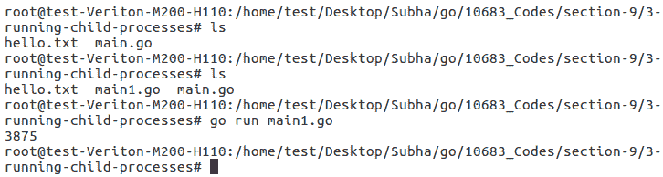
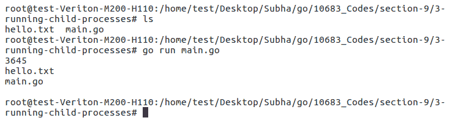
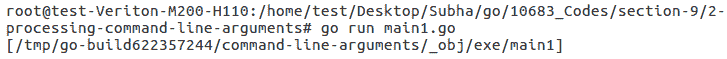
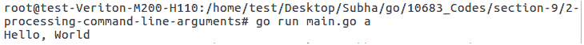

# 九、系统编程


系统编程允许您处理系统消息和运行处理任务。在本章中，您将学习如何使用 Go 处理命令行参数。本章将介绍以下主题：

*   捕捉信号
*   运行子进程
*   处理命令行参数


# 捕捉信号


在我们深入了解捕捉信号之前，让我们先了解什么是信号以及如何使用它们。信号是进程间通信的一种有限形式，通常在 Unix 和类 Unix 操作系统中使用。信号是一种异步通知，发送给同一进程或另一个目标进程中的特定威胁，以通知其事件发生。你可以因为各种原因捕捉信号；例如，您可以捕获另一个进程向您的进程发出的终止信号，以便在应用程序中执行某些终止清理操作。当涉及到 Go 时，Go 信号通知通过在我们的通道上发送`os.signal`值来工作。现在，让我们继续，看看它在 Go 应用程序中是什么样子。

首先，我们将创建一个名为 signals 的新通道，并在此处使用`os.signal`。如果要捕获多个信号，可以使用缓冲通道并键入 3 或 4 作为整数。为了一次只捕获一个信号，我们可以键入 1，或者您只需传递它，默认值将自动为 1。我们还需要一些其他渠道来通知我们已经完成了信号处理，以便我们可以终止应用程序或执行其他操作。在我们的`signal`包中，我们有一个名为`Notify()`的方法，所以让我们继续看文档，文档中说*Notify 导致包信号将传入信号中继到通道*。Go 会自动监听信号，并将这些信号与我们将要提供的第一个参数的通道相关联。现在，检查以下代码：

```go
package main
import (
  "os"
  "os/signal"
  "syscall"
  "fmt"
)
func main(){
  signals := make (chan os.Signal, 1)
  done := make(chan bool)
  signal.Notify(signals, syscall.SIGINT, syscall.SIGTERM)
  go func (){
    sig := <- signals
    fmt.Println(sig)
    fmt.Println("Signal captured and processed...")
    done <- true
  }()
  fmt.Println("Waiting for signal")
  <-done
  fmt.Println("Exiting the application...")
}
```

有一些参数可以过滤您想要收听的信号，即[T0]和[T1]。此外，我们将创建一个 Go 例程，该例程将简单地侦听该信号并执行操作。此外，我们将读取值并将信号内容写入控制台。我们将添加一个说明`Signal captured and processed...`的`print`语句。此外，`done <- true`将帮助我们处理信号。最后，我们将键入`print`语句`Waiting for signal`，然后完成信号捕获和处理。让我们继续运行代码以获得输出。我们现在将运行`main.go`应用程序，它将打印`Waiting for signal`：


现在，我们可以使用*Ctrl*+*C*命令发送一个关闭应用程序的信号，并且，正如您在下面的屏幕截图中所看到的，会发生中断。我们的中断被捕获并处理，现在我们退出应用程序，这也可以在下面的屏幕截图中看到：


这就是如何在 Go 应用程序中简单地捕获流程和使用信号的方法。在下一节中，我们将看到如何从 Go 应用程序运行子进程。


# 运行子进程


在本视频中，我们将了解如何在应用程序中运行子进程。在我们的应用程序中，我们将运行一个名为`ls`（Linux）和`dir`（Windows）的命令。`ls`和`dir`命令是一个简单列出给定目录中所有文件的应用程序。因此，从我们当前的目录中，它将为我们提供`hello.txt`和`main.go`文件。我们将在应用程序中运行此`ls`实用程序应用程序。因此，我们要做的第一件事是使用`exec`包，它提供命令。我们将使用[T8]命令，现在不传递任何参数。这将返回命令本身。您将发现两个函数；一个是`start`，另一个是`run`。

The difference between `start` and `r` is, if you look at the documentation, you'll see that `run` starts the specified command and waits for it to complete. Based on your requirements, you can choose `start` or `run`.

我们还有`PID`，它是进程 ID，我们将把它输出到控制台。那么，让我们继续运行代码。您可以看到以下内容：

```go
package main

import (
  "os/exec"
  "fmt"
  )

func main() {
  lsCommand := exec.Command("ls")
  lsCommand.Start()
  fmt.Println(lsCommand.Process.Pid)
}
```

您将获得以下输出：



正如您所看到的，我们获得了进程 ID，但是我们还没有看到目录中的文件。现在，让我们试试`run`。我们希望读取来自`ls`命令的任何内容，然后将其打印到控制台。我们将使用[T2]，它返回一个字节数组和一个错误，但是我们现在将忽略这个错误。可以现在让我们检查一下所描述的代码：

```go
package main
import (
  "os/exec"
  "fmt"
)
func main() {
  lsCommand := exec.Command("ls")
  output,_ := lsCommand.Output()
  lsCommand.Run()
  fmt.Println(lsCommand.Process.Pid)
  fmt.Println(string(output))
}
```

我们还将清除端子，然后检查输出：



如您所见，它为我们提供了两个文件名和进程 ID。这就是您可以从 Go 应用程序中运行进程的方式。当然，有更多的方法可以做到这一点。您可以运行其他类型的进程，例如 Google Chrome 或 Firefox，或者您开发的其他应用程序。因此，当您需要从应用程序内部启动流程时，它是一个非常强大的工具。在下一节中，我们将看到如何处理命令行参数。


# 处理命令行参数


在本节中，我们将了解如何处理命令行参数。命令行参数的典型示例是[T0]。这里，`a`是传递给上一个命令的命令行参数，`ls`是位于操作系统中的程序。根据传递给`ls`命令的参数，它的行为有所不同。

例如，如果我们键入`ls`，它将显示所有可见的文件。如果我们输入[T1]，那么它会显示该目录下的所有内容，包括不可见的项目，可以在下面的屏幕截图中看到：


所以，我们将对我们的程序做同样的事情。您可以使用`os.Args`读取传递给应用程序的参数。我们将把这些参数读写到控制台，看看在我们将一些参数传递给应用程序后控制台是什么样子。我们必须首先清除终端并键入`go run main.go`。因为，最初，我们不会传递任何参数，所以我们只能看到一个参数，这就是可执行文件的路径。但是，因为我们使用`go run`，所以它只会创建一个临时的可执行文件并为我们运行，所以这就是`temp`位置：



如果我们输入`go run main.go -someArgument`，我们将得到第二项，即`- someArgument`：


如果我们不关心第一个参数，我们可以使用`realArgs`：

```go
package main
import (
  "os"
  "fmt"
)

func main(){
  realArgs := os.Args[1:]
  fmt.Println(realArgs)
}
```

您将获得以下输出：


让我们继续检查一个真实的示例。让我们假设我们只期望传递一个参数。检查以下代码：

```go
package main
import (
  "os"
  "fmt"
)
func main(){
  realArgs := os.Args[1:]
  if len(realArgs) == 0{
    fmt.Println("Please pass an argument.")
    return
  }
  if realArgs[0] == "a"{
    writeHelloWorld()
  }else if realArgs[0] == "b"{
    writeHelloMars()
  }else{
    fmt.Println("Please pass a valid argument.")
  }
}
func writeHelloWorld(){
  fmt.Println("Hello, World")
}
func writeHelloMars(){
  fmt.Println("Hello, Mars")
}
```

正如您在前面的代码中所看到的，我们已经输入了`realArgs[0] == "a"`，它将运行一个名为`writeHelloWorld()`的函数；如果是`realArgs[0] == "b"`，那么它将运行`writeHelloMars()`，对于任何默认设置，我们将打印一条警告`Please pass a valid argument`。现在，我们将添加`writeHelloWorld()`和`writeHelloMars()`功能。此外，我们将使用一个内置函数获取`realArgs`的长度，如果是`0`，我们将打印`Please pass an argument`，完成后，我们需要添加`return`语句并退出。

运行代码时，您将获得以下输出：


如你所见，我们收到了第一条信息。如果我们输入`go run main.go a`，控制台上会打印`Hello, World`，如下图所示：



如果我们输入`go run main.go b`，控制台上会打印`Hello, Mars`，如下图所示：


这就是如何在 Go 应用程序中执行命令行参数处理。本章到此结束。


# 总结


在本章中，您学习了捕获信号、运行子进程和处理命令行参数。在下一章中，您将学习如何从 internet 下载网页和文件。您还将看到如何创建文件和 web 服务器，以及如何处理 HTTP 请求和响应。


