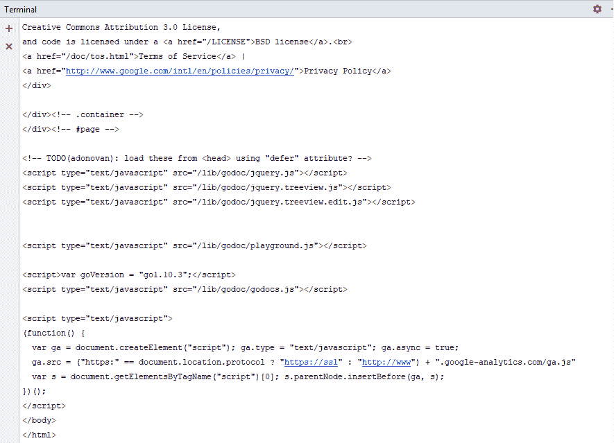
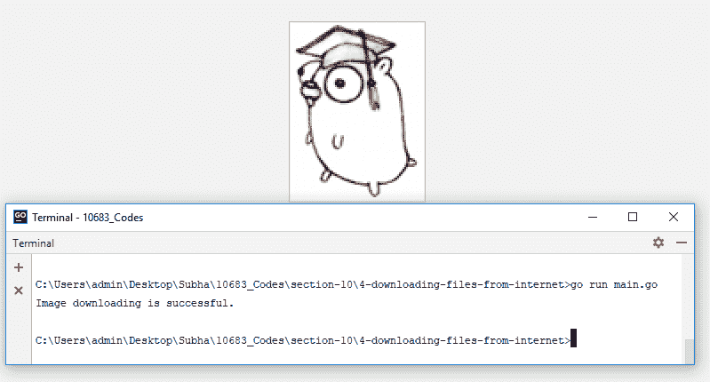
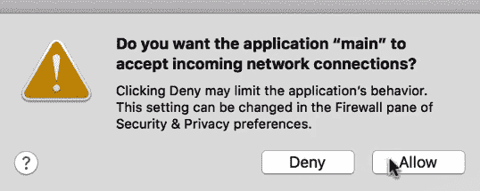
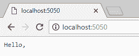
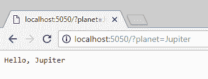

# 网络编程


在本章中，我们将看到与 internet 交互的有效方法，例如下载网页、创建我们自己的示例 web 服务器以及处理 HTTP 请求。本章将介绍以下主题：

*   从 internet 下载网页
*   从互联网下载文件
*   创建简单的 web 服务器
*   创建简单的文件服务器


# 从 internet 下载网页


让我们从如何从 internet 下载网页开始。我们将从定义我们的 URL 开始，它将是`golang.org`，我们将使用`net/http`包获取此 URL 的内容。这将返回两个内容：`response`和`error`。

如果您快速查看此处的文档，您会发现它发出一个`get`请求来指定 URL，并且它还根据响应返回一些 HTTP 代码：


检查以下代码：

```go
package main
import (
  "net/http"
  "io/ioutil"
  "fmt"
)
func main(){
  url := "http://golang.org"
  response, err := http.Get(url)
  if err != nil{
   panic(err)
  }
  defer response.Body.Close()
  html, err2 := ioutil.ReadAll(response.Body)
  if err2 != nil{
    panic(err)
  }
  fmt.Println(html)
}
```

如果发生一个`err`，我们将调用`panic`，因此我们输入`panic (err)`，在其中我们提供`err`作为其参数。当一切都完成后，我们将不得不关闭尸体。让我们继续并在终端中运行此代码，以获得以下内容：


如您所能，它是一个字节数组，我们将其更改为`string`：

```go
package main
import (
  "net/http"
  "io/ioutil"
  "fmt"
)
func main(){
  url := "http://golang.org"
  response, err := http.Get(url)
  if err != nil{
    panic(err)
  }
  defer response.Body.Close()
  html, err2 := ioutil.ReadAll(response.Body)
  if err2 != nil{
    panic(err)
  }
  fmt.Println(string(html))
}
```

如果现在运行代码，我们将获得以下输出：



现在，我们已经将这些 HTML 源代码打印到了控制台上，这就是您可以使用 Go 从 internet 下载网页的方式。在下一节中，我们将了解如何从 internet 下载文件。


# 从互联网下载文件


在本节中，我们将了解如何从 internet 下载文件。为此，我们将以下载图像为例。我们将键入图像的 URL，其中包含 Go 的徽标。检查以下代码：

```go
package main
import (
  "net/http"
  "os"
  "io"
  "fmt"
)
func main(){
  imageUrl := "https://golang.org/doc/gopher/doc.png"
  response, err := http.Get(imageUrl)
  if err != nil{
    panic(err)
  }
  defer response.Body.Close()
  file, err2 := os.Create("gopher.png")
  if err2 != nil{
    panic(err2)
  }
  _, err3 := io.Copy(file, response.Body)
  if err3 != nil{
    panic(err3)
  }
  file.Close()
  fmt.Println("Image downloading is successful.")
}
```

如您所见，我们在这里使用了`http.Get()`方法。如果我们的`err`不是`nil`，我们已经输入了`panic(err)`，我们将退出`defer response.Body.Close()`函数。在函数退出之前，我们将关闭`out`响应的主体。因此，我们要做的第一件事是创建一个新文件，以便我们可以将图像的内容复制到该文件中。如果错误不再是`nil`，我们将惊慌失措，并将使用`io.Copy()`。我们要写的是，图像下载到控制台成功。

让我们继续运行代码以检查输出：



瞧！下载成功。这就是使用 Golang 从互联网下载图像或任何类型文件的方式。在下一节中，我们将看到如何创建一个简单的 web 服务器。


# 创建简单的 web 服务器


在本节中，我们将了解如何在 Go 中创建一个简单的 web 服务器。由于内置了API，在 Go 中创建一个简单的 web 服务器非常容易。首先，我们将使用软件包。`net/http`包有`HandleFunc()`方法，这意味着它将接受两件事。第一个是 URL 的路径，第二个是处理传入请求的函数。检查以下代码：

```go
package main
import "net/http"
func sayHello(w http.ResponseWriter, r *http.Request){
  w.Write([]byte("Hello, world"))
}
func main(){
  http.HandleFunc("/", sayHello)
  err := http.ListenAndServe(":5050", nil)
  if(err != nil){
    panic(err)
  }
}
```

只要您的方法签名满足`func sayHello(w http.ResponseWriter, r *http.Request){}`类型的方法，我们的`HandleFunc()`将接受您的方法签名。我们将使用`sayHello`作为我们的函数，它将返回两件事，第一件事是`http.ResponseWriter`，第二件事是请求本身作为指针。因为它将是一个 hello 服务器，我们只需要将一些数据写回我们的响应，为此，我们将使用我们的响应编写器。因为我们要监听一个特定的端口，所以我们要使用`http.ListenAndServe.`而且我们已经使用了`5050`；您可以选择任何可用的端口。我们还向函数中添加了`nil`，如果发生意外情况，它将返回一个错误，如果错误不是`nil`，我们将陷入恐慌。让我们继续运行代码，并尝试使用浏览器访问路径。我们必须先运行我们的`main.go`文件并允许它，这样我们才能访问它：



完成后，我们必须打开浏览器选项卡并尝试访问`http://localhost:5050/`：


您将清楚地看到`Hello, world`。现在，让我们用查询字符串或 URL 参数再做一个快速示例。我们将修改这个方法，这样我们就可以决定我们要对哪个行星说“你好”。检查以下代码：

```go
package main
import "net/http"
func sayHello(w http.ResponseWriter, r *http.Request){
  planet := r.URL.Query().Get("planet")
  w.Write([]byte("Hello, " + planet))
}
func main(){
  http.HandleFunc("/", sayHello)
  err := http.ListenAndServe(":5050", nil)
  if(err != nil){
    panic(err)
  }
}
```

我们有一个具有查询功能的 URL。我们将读取查询字符串，也称为 URL 参数`planet`，并将其值分配给一个变量。我们必须停止当前服务器并再次运行它。打开`http://localhost:5050/`后，我们没有看到任何行星的名称：



因此，您可以将 URL 更改为`http://localhost:5050/?planet=World`并重试：


瞧！现在，让我们对行星`Jupiter`进行同样的尝试



这就是我们如何在 Go 中快速创建您自己的 web 服务器的方法。

在下一节中，我们将看到如何创建一个简单的文件服务器。


# 创建简单的文件服务器


在本节中，我们将了解如何创建一个简单的文件服务器。文件服务器背后的主要思想是提供静态文件，如图像、CSS 文件或 JavaScript 文件，在我们的代码中，我们将看到如何做到这一点。检查以下代码：

```go
package main

import "net/http"

func main() {
  http.Handle("/", http.FileServer(http.Dir("./images")))
  http.ListenAndServe(":5050", nil)
}
```

如您所见，我们使用了 HTTP 句柄，这个`Handle`与`handleFunc`不同，它接受处理程序接口作为第二个参数；第一个参数是`pattern`。我们将使用一个名为`FileServer`的特殊 API，它将在这里作为文件服务器工作；我们将在服务器中添加一个位置（图像目录，[T4]）来为静态文件提供服务。

因此，将要发生的是，当请求到达路由路径时，文件服务器将为请求提供服务，并在位置`http.Dir("./images"`下提供静态文件。我们将使用`http.ListenAndServe(":5050", nil)`，如前一节所述。此外，如前一节所述，我们将运行服务器，允许权限，并在浏览器中键入`localhost:5050`：


您可以在该位置看到我们的文件列表，如果我们单击gopher_aviator.png，它将为我们提供该位置的图像：


如果我们返回并单击另一个（gopher.png，它将显示以下图像：


或者，您可以从前面的代码中注释掉`http.Handle("/", http.FileServer(http.Dir("./images")))`并将`nil`替换为位置。如果您按照与我们之前相同的步骤检查浏览器，它仍然会正确地为我们提供这两个图像，这就是您如何在 Go 中创建简单的文件服务器。


# 总结


在本章中，您学习了从 internet 下载网页、从 internet 下载文件、创建简单 web 服务器和创建简单文件服务器。下一章将介绍如何使用 Go 读取、更新、删除和创建关系数据库上的数据。


