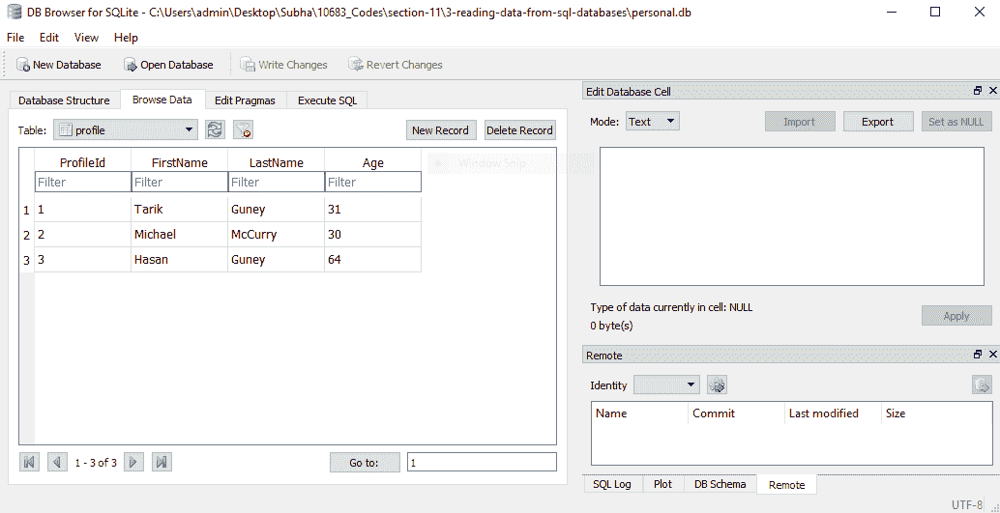
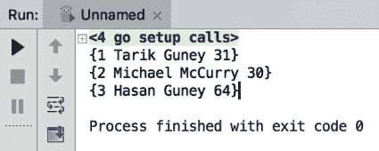
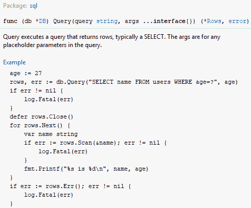
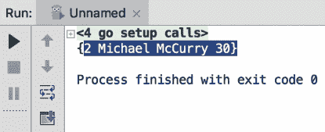
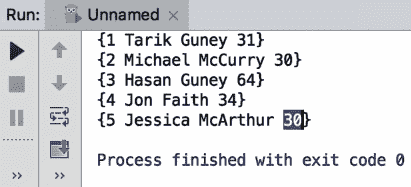
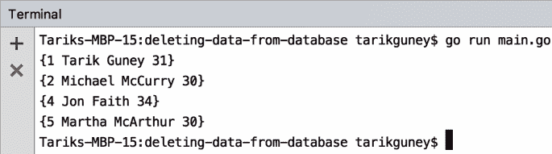

# 关系数据库


Go 可以使用各种关系数据库，包括 SQLServer、MySQL、PostgresSQL 和 SQLite。在本章中，我们将使用 SQLite。与其他更高级的数据库引擎相比，SQLite 可能稍微有限一些，但对于我们的示例来说，它已经足够了。在本节中，您将学习如何使用 Go 读取、更新、删除和创建关系数据库中的数据。

本章将介绍以下主题：

*   从数据库读取数据
*   将数据插入数据库
*   更新数据库中的数据
*   从数据库中删除数据


# 从数据库读取数据


让我们从学习如何从 SQL 数据库读取数据开始。在开始之前，我们必须创建一个名为`personal.db`的数据库。我们将使用 SQLite 的 DB 浏览器，它允许我们创建新的 SQLite 数据库，编辑它们，添加新记录，等等。您可以从[找到更多关于该工具的信息并下载 http://sqlitebrowser.org/](http://sqlitebrowser.org/) 。它是一个免费工具，可与 Windows、macOS 和 Linux 配合使用。让我们从一个例子开始。查看以下屏幕截图：



在这里，我们只有一张桌子，叫做`profile`。使用这个表就足以让我们了解如何与 SQLite 数据库交互，然后您可以使用相同的技术与 MySQL 或 SQL Server 交互。如果您查看屏幕截图，您可以看到我们有三条记录和四列：`ProfileId`、`FirstName`、`LastName`和`Age`。`FirstName`和`LastName`列是字符串或文本，`Age`列是数字，`ProfileId`是我们的主键；它是也是一个整数列。那么，让我们继续创建我们自己的结构和代码：

```go
package main
import (_ "github.com/mattn/go-sqlite3"
  "database/sql"
  "fmt"
)

type Profile struct{
  ProfileId int
  FirstName string
  LastName string
  Age int
}
func main(){
  db, err := sql.Open("sqlite3", "./personal.db")
  checkError(err)
  var profile Profile
  rows, err := db.Query("select ProfileId, FirstName, LastName, Age from Profile")
  checkError(err)
  for rows.Next(){
    err := rows.Scan(&profile.ProfileId, &profile.FirstName, &profile.LastName, &profile.Age)
    checkError(err)
    fmt.Println(profile)
  }
  rows.Close()
  db.Close()
}
func checkError(err error) {
  if (err != nil) {
    panic(err)
  }
}
```

现在，让我们看一下代码的解释。我们使用 struct 类型将来自 SQL 数据库的数据映射到内存中的对象。我们需要导入两个包：第一个是 SQL数据库，第二个是`go-sqlite3`。我们将执行空或空导入，这将自动删除[T7][T8]SQL[T9][T10]数据库导入，但这没关系，因为我们稍后将再次导入它。我们执行空白导入的原因是，如果这个包中有初始化代码，它仍然会被执行。这个包本身注册为底层 SQL 驱动程序，因此我们仍将使用 SQL 数据库包作为 API，但该 API 将在后台使用`go-sqlite3`包与我们的数据库进行交互，正如您将看到的，Go 中的数据库交互非常简单。所以，我们要做的第一件事就是打开数据库。当我们使用 SQL 包时，您将看到它自动导入我们的 SQL 数据库。

此外，我们将使用 SQLite 驱动程序，即 SQLite 版本 3，并且我们还将指定数据库的位置。根据您使用的数据库类型，数据源名称可能会更改；它可能是一个 URL，但在我们的例子中，它是一个文件，因为 SQLite 处理数据文件。因此，我们将键入[T0]。我们还添加了错误检查实用程序功能，因此我们不必一直检查错误。我们只需说`checkError`就可以检查错误。我们将使用一个 DB 查询来查询数据库，它返回两个结果：一个是行，另一个是错误。数据库查询在这里基本上接受 SQL 查询。我们还将使用一个`for`循环`rows.next`，迭代每一行和每一行。扫描以获得每一行的值。尊重列的顺序很重要，因为它们来自配置文件数据库；如果您需要不同的订单，可以在此处显示的`*`中指定：`"select * from Profile"`。我通常建议显式指定每一行，而不是使用通配符（`*`）。

运行此代码时，您将获得以下输出：



如您所见，我们能够捕获表中的数据库记录（`ProfileId`、`FirstName`、`LastName`和`Age`。

现在，让我们快速了解如何执行过滤。因此，我们将使用`where`子句，如果您知道 SQL，`where`子句用于过滤。我们将通过`ProfileId`进行过滤。请看一下此方法的签名：



签名中的第二个参数是占位符的参数，因为它是一个非常复杂的函数，所以只要有匹配的占位符，就可以提供尽可能多的参数。我们将添加`2`，如您在下面的代码片段中所见；您还可以使用变量名：

```go
var profile Profile
rows, err := db.Query("select ProfileId, FirstName, LastName, Age from Profile where ProfileID = ?", 2)
checkError(err)
```

现在，让我们继续运行修改后的代码：

```go
package main
import (_ "github.com/mattn/go-sqlite3"
  "database/sql"
  "fmt"
)
type Profile struct{
  ProfileId int
  FirstName string
  LastName string
  Age int
}
func main(){
  db, err := sql.Open("sqlite3", "./personal.db")
  checkError(err)
  var profile Profile
  rows, err := db.Query("select ProfileId, FirstName, LastName, Age from Profile where ProfileID = ?", 2)
  checkError(err)
  for rows.Next(){
    err := rows.Scan(&profile.ProfileId, &profile.FirstName, &profile.LastName, &profile.Age)
    checkError(err)
    fmt.Println(profile)
  }
  rows.Close()
  db.Close()
}
func checkError(err error) {
  if (err != nil) {
    panic(err)
  }
}
```

运行上述代码时，您将获得以下输出：



因此，我们从数据库中获取第二条记录。您还可以执行多个`where`子句，如下代码所示：

```go
package main
import (_ "github.com/mattn/go-sqlite3"
  "database/sql"
  "fmt"
)
type Profile struct{
  ProfileId int
  FirstName string
  LastName string
  Age int
}
func main(){
  db, err := sql.Open("sqlite3", "./personal.db")
  checkError(err)
  var profile Profile
  rows, err := db.Query("select ProfileId, FirstName, LastName, Age from Profile where FirstName = ? and LastName = ?","Tarik", "Guney")
  checkError(err)
  for rows.Next(){
    err := rows.Scan(&profile.ProfileId,   &profile.FirstName, &profile.LastName, &profile.Age)
    checkError(err)
    fmt.Println(profile)
  }
  rows.Close()
  db.Close()
}
func checkError(err error) {
  if (err != nil) {
    panic(err)
  }
}
```

您将获得以下输出：


完美的这是我们期待的记录。这就是在 Go 中轻松查询 SQL 数据库的方法。

在下一节中，我们将看到如何将数据插入 SQLite 数据库。


# 将数据插入数据库


在本节中，我们将了解如何将数据插入数据库。我们将使用上一节中开发的代码，并添加一段新代码，将数据插入`personal.db`数据库。我们将添加`statement`和`err`，并使用`insert`语句将名称添加到我们的`Profile`表中。我们将指定要将数据插入到哪些列中，但我们不会指定`ProfileId`，因为它是表的主键。我们将键入`FirstName`、`LastName`、`Age`、，值将仅作为占位符。我们还将使用`statement.Exec`并提供占位符的值，例如`Jessica`、`McArthur`、和`30`。代码如下：

```go

package main
import (_ "github.com/mattn/go-sqlite3"
  "database/sql"
  "fmt"
)
type Profile struct{
  ProfileId int
  FirstName string
  LastName string
  Age int
}
func main(){
  db, err := sql.Open("sqlite3", "./personal.db")
  checkError(err)
  statement, err := db.Prepare("insert into Profile (FirstName, LastName, Age) values(?,?,?)")
  checkError(err)
  statement.Exec("Jessica", "McArthur", 30)
  var profile Profile
  rows, err := db.Query("select ProfileId, FirstName, LastName, Age from Profile")
  checkError(err)
  for rows.Next(){
    err := rows.Scan(&profile.ProfileId, &profile.FirstName, &profile.LastName, &profile.Age)
    checkError(err)
    fmt.Println(profile)
  }
  rows.Close()
  db.Close()
}

func checkError(err error) {
  if (err != nil) {
    panic(err)
  }
}
```

以下是前面代码的输出：



如您所见，我们的 ID 是`5`，名字是`Jessica`，姓氏是`McArthur`，年龄是`30`。这就是使用 Go 将数据插入数据库的方法。

在下一节中，我们将了解如何更新数据库中的现有数据。


# 更新数据库中的数据


在本节中，我们将了解如何更新数据库中的现有数据。我们将使用上一节中开发的相同代码，但我们将更改一些字段。

我们将在 SQL 中使用[T0]语句。因此，将更改以下字段：

```go
statement, err := db.Prepare("update Profile set FirstName = ? where ProfileId = ?")
checkError(err)

statement.Exec("Martha", 5)
```

更新概要文件记录后，我们将列出`profile`表中的所有记录。如果您还记得上一节，最后一条记录的配置文件 ID 为`5`，我们将对此进行更改。上一节中输出的最后一行是`{5 Jessica McArthur 30}`，我们现在要更改更新代码的名字：

```go
package main
import (_ "github.com/mattn/go-sqlite3"
  "database/sql"
  "fmt"
)
type Profile struct{
  ProfileId int
  FirstName string
  LastName string
  Age int
}
func main(){
  db, err := sql.Open("sqlite3", "./personal.db")
  checkError(err)
  statement, err := db.Prepare("update Profile set FirstName = ? where ProfileId = ?")
  checkError(err)
  statement.Exec("Martha", 5)
  var profile Profile
  rows, err := db.Query("select ProfileId, FirstName, LastName, Age from Profile")
  checkError(err)
  for rows.Next(){
    err := rows.Scan(&profile.ProfileId, &profile.FirstName, &profile.LastName, &profile.Age)
    checkError(err)
    fmt.Println(profile)
  }
  rows.Close()
  db.Close()
}
func checkError(err error) {
  if (err != nil) {
    panic(err)
  }
}
```

如果运行代码，您将发现以下输出：


您可以看到，我们已经成功地将名称`Jessica`更改为`Martha`。这就是如何在 Go 中简单地进行更新。

在下一节中，我们将看到如何从数据库中删除数据。


# 从数据库中删除数据


在本节中，我们将了解如何从数据库中删除数据。我们仍将使用上一节中开发的旧代码，并对其进行一些小的更改。查看以下代码：

```go
package main
import (
  _ "github.com/mattn/go-sqlite3"
  "database/sql"
  "fmt"
)
type Profile struct{
  ProfileId int
  FirstName string
  LastName string
  Age int
}
func main(){
  db, err := sql.Open("sqlite3", "./personal.db")
  checkError(err)

  var profile Profile
  rows, err := db.Query("select ProfileId, FirstName, LastName, Age from Profile")
  checkError(err)
  for rows.Next(){
    err := rows.Scan(&profile.ProfileId, &profile.FirstName, &profile.LastName, &profile.Age)
    checkError(err)
    fmt.Println(profile)
  }
  rows.Close()
  db.Close()
}
func checkError(err error) {
  if (err != nil) {
    panic(err)
  }
}
```

上述代码的输出如下所示：


现在，要删除数据，比如说第`3`行。在本例中，您必须对代码进行某些更改。我们将使用`statement`、`err`和`statement.Exec`对代码进行微小修改。

因此，为了实现我们想要的，我们将使用以下修改后的代码：

```go
package main
import (
  _ "github.com/mattn/go-sqlite3"
  "database/sql"
  "fmt"
)
type Profile struct{
  ProfileId int
  FirstName string
  LastName string
  Age int
}
func main(){
  db, err := sql.Open("sqlite3", "./personal.db")
  checkError(err)
  statement ,err := db.Prepare("delete from Profile where  ProfileId = ?")
  checkError(err)
  statement.Exec(3)

  var profile Profile
  rows, err := db.Query("select ProfileId, FirstName, LastName, Age from Profile")
  checkError(err)
  for rows.Next(){
    err := rows.Scan(&profile.ProfileId, &profile.FirstName, &profile.LastName, &profile.Age)
    checkError(err)
    fmt.Println(profile)
  }
  rows.Close()
  db.Close()
}
func checkError(err error) {
  if (err != nil) {
    panic(err)
  }
}
```

您可以看到我们使用了`db.Prepareand`。我们提供了来自`profile`的线索，其中`ProfileId`是占位符。我们还使用了[T3]，它将与参数一起执行；参数的数量与您在代码中放置的占位符的数量相匹配是很重要的。让我们运行代码并检查输出：



因此，如果您比较两个输出，您可以看到我们已经成功删除了第三个条目，现在我们只有`4`条目，第三个条目已经被删除。这就是如何简单地从数据库中删除数据。


# 总结


我们的书差不多到此为止。您将学到很多关于围棋的知识，现在您可以在各种场景中有效地使用这些知识。您现在可以通过遵循本书中包含的简明和简单的方法来克服开发人员面临的最常见的挑战。祝你一切顺利！


