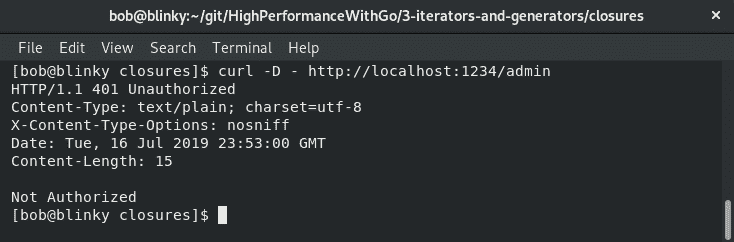
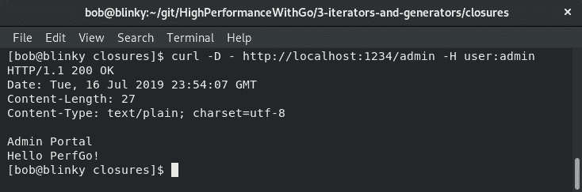
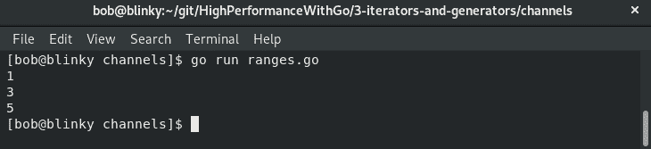
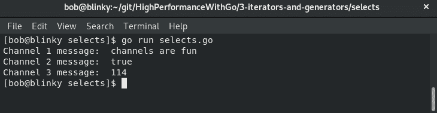
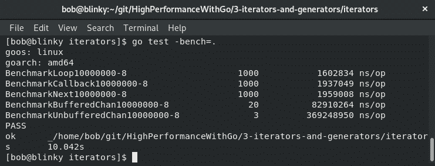

# 三、理解并发性

迭代器和生成器是 Go 所必需的。利用通道和 goroutines 实现并行性和并发性在 Go 中是惯用的，也是用该语言编写高性能可读代码的最佳方法之一。我们将首先讨论一些基本 Go 结构，以便能够理解如何在 Go 的上下文中使用迭代器和生成器，然后深入研究该语言的可用迭代器和生成器的结构

在本章中，我们将介绍以下主题：

*   闭包
*   戈罗季斯
*   渠道
*   信号量
*   等待组
*   遍历器
*   发电机

能够理解 Go 语言的基本结构以及何时何地使用适当的迭代器和生成器对于编写 PerformantGO 至关重要

# 理解闭包

Go 最重要的部分之一是它是一种支持一流函数的语言。第一类函数是能够作为变量传递给其他函数的函数。它们也可以从其他函数返回。这一点很重要，因为我们可以将它们用作闭包。

闭包很有帮助，因为它们是保持代码干燥以及隔离数据的好方法。到目前为止，保持数据集小一直是本书的核心原则，这在本章（或任何后续章节）中都没有改变。能够隔离您希望操作的数据可以帮助您继续编写性能代码。

闭包保留一个局部作用域，可以访问外部函数的作用域和参数以及全局变量。闭包是引用其主体外部变量的函数。这些函数能够为引用的变量赋值并访问这些值，因此，我们可以在函数之间传递闭包。

# 匿名函数

理解 Go 中的闭包的第一步是理解匿名函数。匿名函数是使用变量创建的，用于函数的起始。它们也是没有名称或标识符的函数，因此命名为*匿名函数*。

将`Hello Go`打印到屏幕的正常函数调用如下代码块所示：

```go
func HelloGo(){
  fmt.Println("Hello Go")
}
```

接下来，我们可以调用`HelloGo()`，函数将打印一个`Hello Go`字符串。

如果我们想将我们的`HelloGo()`函数实例化为匿名函数，我们将调用以下代码块中引用的函数：

```go
// Note the trailing () for this anonymous function invocation
func() { 
    fmt.Println("Hello Go")
}()
```

我们前面的匿名函数和`HelloGo()`函数在词汇上相似。

我们还可以将函数存储为变量，以供以后使用，如以下代码块中所述：

```go
    fmt.Println("Hello Go from an Anonymous Function Assigned to a Variable")
}
```

这三个函数，`HelloGo()`函数、匿名函数和分配给`hello`变量的函数在词汇上是相似的。

在我们分配了这个`hello`变量之后，我们可以使用`hello()`的简单调用调用这个函数，在这里调用我们前面定义的匿名函数，并且`Hello Go`将以与在我们之前称为匿名函数中打印相同的方式打印到屏幕上。

我们可以在下面的代码块中看到其中每一项是如何工作的：

```go
package main

import "fmt"

func helloGo() {
    fmt.Println("Hello Go from a Function")

} 

func main() {   
    helloGo() 
    func() { fmt.Println("Hello Go from an Anonymous Function") }()
    var hello func() = func() { fmt.Println("Hello Go from an Anonymous Function Variable") }
    hello()
} 
```

该程序的输出显示了三条打印语句，它们都是相似的，但在打印上有一些小的差异，以显示它们是如何在以下屏幕截图中返回的：


匿名函数是 Go 的一个强大方面。当我们继续本章时，我们将看到如何在它们的基础上做出一些非常有用的东西。

# 关于闭包的匿名函数

此时，您可能想知道为什么使用匿名函数是明智的，以及它们与闭包的关系。一旦我们有了匿名函数，我们就可以利用闭包来引用在其自身定义之外声明的变量。我们可以在下面的代码块中看到这一点：

```go
package main 
import "fmt" 
func incrementCounter() func() int {
 var initializedNumber = 0
 return func() int {
 initializedNumber++
 return initializedNumber
 } 
} 

func main() {
 n1 := incrementCounter() 
 fmt.Println("n1 increment counter #1: ", n1()) // First invocation of n1
 fmt.Println("n1 increment counter #2: ", n1()) // Notice the second invocation; n1 is called twice, so n1 == 2
 n2 := incrementCounter() // New instance of initializedNumber
 fmt.Println("n2 increment counter #1: ", n2()) // n2 is only called once, so n2 == 1
 fmt.Println("n1 increment counter #3: ", n1()) // state of n1 is not changed with the n2 calls
}
```

执行此代码时，我们将收到以下结果输出：


在这个代码示例中，我们可以看到闭包如何帮助数据隔离。使用`incrementCounter()`函数初始化`n1`变量。此匿名函数将`initializedNumber`设置为`0`，并返回一个整数，该整数是`initializedNumber`变量的递增计数。

当我们创建`n2`变量时，同样的过程再次发生。调用一个新的`incrementCounter`匿名函数并返回一个新的`initializedNumber`变量。在我们的主要功能中，我们可以注意到`n1`和`n2`具有单独的维护状态。我们可以看到，即使在第三次调用`n1()`函数调用之后。能够在函数调用之间持久化这些数据，同时将数据与另一个调用隔离，这是拥有匿名函数的一个强大部分。

# 嵌套和延迟工作的闭包

闭包通常也是嵌套和延迟工作的好方法。在下面的示例中，我们可以看到一个函数闭包，它允许我们嵌套工作：

```go
package main
import (
 "fmt"
 "sort"
) 

func main() {
 input := []string{"foo", "bar", "baz"}
 var result []string
 // closure callback
 func() {
 result = append(input, "abc") // Append to the array
 result = append(result, "def") // Append to the array again
 sort.Sort(sort.StringSlice(result)) // Sort the larger array
 }() 
 fmt.Print(result)
}
```

在这个例子中，我们可以看到我们向字符串切片追加了两次，并对结果进行排序。稍后我们将看到如何在 goroutine 中嵌套匿名函数以帮助提高性能。

# 带闭包的 HTTP 处理程序

闭包也常用作 Go HTTP 调用中的中间件。您可以将普通 HTTP 函数调用封装在闭包中，以便在需要时向调用中添加附加信息，并为不同的函数重用中间件。

在我们的示例中，我们将使用四个单独的路由设置 HTTP 服务器：

*   `/`：其服务如下：
    *   带有 HTTP 418 状态代码的 HTTP 响应（源自`newStatusCode`中间件）。
    *   一个`Foo:Bar`头（来自`addHeader`中间件）。
    *   一个`Hello PerfGo!`响应（来自`writeResponse`中间件）。
*   `/onlyHeader`：提供仅添加`Foo:Bar`头的 HTTP 响应。
*   `/onlyStatus`：仅在状态代码更改的情况下提供 HTTP 响应。

*   `/admin`：检查是否存在用户：`admin`头。如果存在，它会将管理门户信息与所有正常的相关值一起打印。如果不存在，则返回未经授权的响应。

之所以使用这些例子，是因为它们很容易理解。对 Go-in HTTP 处理程序使用闭包也很方便，因为它们可以执行以下操作：

*   从数据库调用中隔离数据库信息
*   执行授权请求
*   使用隔离数据包装其他函数（例如，定时信息）
*   以可接受的超时时间与其他第三方服务进行透明通信

Go*编写 Web 应用程序*文档，位于[[https://golang.org/doc/articles/wiki/](https://golang.org/doc/articles/wiki/) ]，给出了一系列其他设置模板、能够实时编辑页面、验证用户输入等的主要示例。让我们看看我们的示例代码，它显示了在下面的代码块中的 HTTP 处理程序中的闭包。首先，我们初始化我们的包并创建一个`adminCheck`函数，它帮助我们确定用户是否有权使用系统：

```go
package main

import (
 "fmt"
 "net/http"
) 

// Checks for a "user:admin" header, proper credentials for the admin path
func adminCheck(h http.Handler) http.HandlerFunc {
 return http.HandlerFunc(func(w http.ResponseWriter, r *http.Request) {
 if r.Header.Get("user") != "admin" {
 http.Error(w, "Not Authorized", 401)
 return
 }
 fmt.Fprintln(w, "Admin Portal")
 h.ServeHTTP(w, r)
 }) 
} 
```

接下来，我们将设置一些其他示例，例如提供 HTTP 418（状态代码`I'm a teapot`）、添加`foo:bar`HTTP 头并设置特定的 HTTP 响应：

```go
// Sets a HTTP 418 (I'm a Teapot) status code for the response
func newStatusCode(h http.Handler) http.HandlerFunc {
 return http.HandlerFunc(func(w http.ResponseWriter, r *http.Request) {
 w.WriteHeader(http.StatusTeapot)
 h.ServeHTTP(w, r)
 })
}

// Adds a header, Foo:Bar
func addHeader(h http.Handler) http.HandlerFunc {
 return http.HandlerFunc(func(w http.ResponseWriter, r *http.Request) {
 w.Header().Add("Foo", "Bar")
 h.ServeHTTP(w, r)
 })
}

// Writes a HTTP Response
func writeResponse(w http.ResponseWriter, r *http.Request) {
 fmt.Fprintln(w, "Hello PerfGo!")
} 
```

最后，我们用一个 HTTP 处理程序将其包装在一起：

```go
// Wrap the middleware together
func main() {
 handler := http.HandlerFunc(writeResponse)
 http.Handle("/", addHeader(newStatusCode(handler)))
 http.Handle("/onlyHeader", addHeader(handler)) 
 http.Handle("/onlyStatus", newStatusCode(handler))
 http.Handle("/admin", adminCheck(handler))
 http.ListenAndServe(":1234", nil)
}
```

我们的路由器测试示例如下。以下是标题修改和 HTTP 状态代码修改的输出：


以下是仅修改标题的输出：


以下是仅修改状态的输出：


以下是未经授权的管理员输出：



以下是授权的管理员输出：



能够添加带有匿名函数的中间件有助于快速迭代，同时保持低代码复杂度。

# 探路

Go 是一种考虑并发性的语言。并发是执行独立进程的能力。Goroutines 是 Go 中的一个构造，可以帮助实现并发性。它们通常被称为*轻量级线程*——这是有充分理由的。在其他语言中，线程由操作系统处理。这反过来又会使用较大的调用堆栈，并且通常在给定内存堆栈大小的情况下处理较少的并发性。goroutine 是在 Go 运行时内并发运行的函数或方法，不连接到底层操作系统。Go 语言中的调度程序管理 Goroutine 的生命周期。系统的调度程序也有很多开销，因此限制正在使用的线程数有助于提高性能。

# Go 调度程序

Go 运行时调度器对 goroutine 生命周期的管理涉及到两个不同的部分。Go 调度器在其第二次迭代中进行了更改，该迭代源自 Dmitry Vyukov 编写的设计文档，发布于 Go 1.1。在本设计文件中，Vyukov 讨论了初始 Go 调度器以及如何实现工作共享和工作窃取调度器，正如 Robert D.Blumofe 博士和 Charles E.Leiserson 博士在麻省理工学院题为《通过工作窃取调度多线程计算》的论文中最初所述。本文背后的基本概念是确保动态、多线程计算，以确保在保持内存需求的同时高效利用处理器。

Goroutines 在 inception 上的堆栈大小仅为 2 KB。这就是为什么在很多并发编程中优先使用 goroutine 的原因之一，因为在一个程序中有几十个或几十万个 goroutine 要容易得多。其他语言中的线程可能会占用兆字节的空间，使它们的灵活性大大降低。如果需要更多内存，Go 的函数可以在可用内存空间的另一个位置分配更多内存，以帮助 goroutine 空间增长。默认情况下，运行时为新堆栈提供两倍的内存量。

Goroutines 仅在系统调用时阻止正在运行的线程。发生这种情况时，运行时从调度程序结构中获取另一个线程。这些用于等待执行的其他 goroutine。

工作共享是调度程序将新线程迁移到其他处理器以进行工作分配的过程。工作窃取执行类似的操作，但未充分利用的处理器从其他处理器窃取线程。遵循 Go 中的工作窃取模式有助于使 Go 调度程序更加高效，从而为运行在内核调度程序之上的 Goroutine 提供更高的吞吐量。最后，Go 调度程序实现线程旋转。线程旋转将利用额外的 CPU 周期而不是抢占线程。线程以三种不同的方式旋转：

*   当线程未连接到处理器时。
*   当 goroutine 就绪时，将解锁空闲处理器上的 OS 线程。
*   当一个线程正在运行但没有连接到它的 goroutine 时。此空闲线程将继续搜索要执行的可运行 goroutine。

# Go 调度程序 goroutine 内部

GO 调度程序有三个关键结构来处理 GOODUTIN 的工作：M 结构、P 结构和 G 结构。这三个结构一起工作，以便以高效的方式处理 GOODUTIN。如果您想查看这些的源代码，请访问[https://github.com/golang/go/blob/master/src/runtime/runtime2.go/](https://github.com/golang/go/blob/master/src/runtime/runtime2.go/) 。

# M 结构

对于**机器**，M 结构标记为**M**。M 结构是 OS 线程的表示形式。它包含一个指向可运行 goroutine 全局队列（由 P 结构定义）的指针。M 从 P 结构中检索其工作。M 包含准备执行的空闲和等待 goroutine。一些值得注意的 M 结构参数如下：

*   包含调度堆栈（go）的 goroutine
*   **线程本地存储**（**tls**）
*   用于执行 Go 代码（P）的 P 结构

# P 结构

此结构标记为**处理器**的**P**。P 结构表示一个逻辑处理器。这由`GOMAXPROCS`设置（应等于 Go 版本 1.5 后可用的芯数）。P 维护所有 goroutine（由 G 结构定义）的队列。当您使用 Go 执行器调用一个新的 goroutine 时，这个新的 goroutine 将被插入到 P 的队列中。如果 P 没有关联的 M 结构，它将分配一个新的 M。一些值得注意的 P 结构参数如下：

*   P 结构 ID（ID）
*   到关联的 M 结构的反向链接（如果适用）（M）
*   可用的延迟结构池（延迟池）
*   可运行 goroutine 的队列（runq）
*   可用 Gs 的结构（gFree）

# G 结构

此结构标记为**goroutine**的**G**。G 结构表示单个 goroutine 的堆栈参数。它包括对 goroutine 很重要的几个不同参数的信息。为每个新的 goroutine 以及运行时的 goroutine 创建 G 结构。一些值得注意的 G 结构参数如下：

*   堆栈指针的当前值（`stack.lo`和`stack.hi`）
*   Go 和 C 堆栈增长序言的当前值（`stackguard0`和`stackguard1`）
*   M 结构的当前值（M）

# 行动中的 Goroutines

现在我们已经对 Goroutine 的基本原理有了基本的了解，我们可以在实际操作中检查它们。在下面的代码块中，我们将看到如何使用`go`调用调用 goroutine：

```go
package main

import (
 "fmt"
 "time"
) 

func printSleep(s string) {
 for index, stringVal := range s {
 fmt.Printf("%#U at index %d\n", stringVal, index)
 time.Sleep(1 * time.Millisecond) // printSleep sleep timer
 } 
} 

func main() {
 const t time.Duration = 9 
 go printSleep("HELLO GOPHERS")
 time.Sleep(t * time.Millisecond) // Main sleep timer
 fmt.Println("sleep complete")
} 
```

在执行此函数的过程中，在主睡眠计时器完成之前，我们只得到 goroutine 调用中包装的`printSleep()`函数的部分返回（打印`HELLO GOPHERS`。为什么会这样？如果`main()`goroutine 完成，它将关闭，程序终止，剩余的 goroutine 将不会运行。我们能够得到返回的前九个字符，因为这些 goroutine 在主函数完成执行之前就完成了。如果我们将`const t`持续时间更改为`14`，我们将收到整个`HELLO GOPHERS`字符串。这背后的原因是`main`函数在`go printSleep()`周围生成的所有 goroutine 都被执行之前无法完成。goroutines 只有在正确使用的情况下才是强大的。

另一个有助于管理并发 goroutine 的 Go 内置功能是 Go 通道，这是我们将在下一节介绍的主题。

# 介绍渠道

通道是允许发送和接收值的机制。通道通常与 goroutine 一起使用，以便跨 goroutine 并发地传递传输对象。Go 中有两种主要的信道分类：无缓冲信道和缓冲信道。

# 通道内部构件

使用内置的`make()`Golang 调用通道，其中创建了一个`hchan`结构。`hchan`结构包含队列中的数据计数、队列大小、缓冲区的数组指针、发送和接收索引和等待器以及互斥锁。以下代码块说明了这一点：

```go
type hchan struct {
    qcount   uint           // total data in the queue
    dataqsiz uint           // size of the circular queue
    buf      unsafe.Pointer // points to an array of dataqsiz elements
    elemsize uint16
    closed   uint32
    elemtype *_type // element type
    sendx    uint   // send index
    recvx    uint   // receive index
    recvq    waitq  // list of recv waiters
    sendq    waitq  // list of send waiters
    // lock protects all fields in hchan, as well as several
    // fields in sudogs blocked on this channel.
    //  
    // Do not change another G's status while holding this lock
    // (in particular, do not ready a G), as this can deadlock
    // with stack shrinking.
    lock mutex
}
```

此代码块引用自[https://golang.org/src/runtime/chan.go#L32](https://golang.org/src/runtime/chan.go#L32) 。

# 缓冲通道

缓冲通道是具有有界大小的通道。它们通常比它们的无界对手更具性能。它们对于从已启动的显式数量的 goroutine 中检索值非常有用。因为它们是**FIFO**（**先进先出**）的排队机制，所以它们可以有效地用作固定大小的排队机制，我们可以按照请求进入的顺序处理请求。通过调用`make()`函数，在使用通道之前创建通道。一旦创建了缓冲通道，它就可以使用了。如果通道中仍有空间，缓冲通道不会阻止传入写入。请务必记住，数据在通道内按箭头方向流动。在我们的示例（以下代码块）中，我们执行以下操作：

*   给我们的`buffered_channel`写`foo`和`bar`
*   检查通道的长度。长度为`2`，因为我们添加了两个字符串
*   在频道外弹出`foo`和`bar`
*   检查通道的长度。长度为`0`，因为我们已经移除了两个字符串
*   添加`baz`到我们的频道
*   将`baz`从通道弹出到变量`out`上
*   打印生成的`out`变量，即`baz`（我们添加到通道的最后一个元素）
*   关闭缓冲通道，表示不再有数据通过该通道

让我们看看下面的代码块：

```go
package main
import "fmt"
 func main() {
 buffered_channel := make(chan string, 2)
 buffered_channel <- "foo"
 buffered_channel <- "bar"

 // Length of channel is 2 because both elements added to channel
 fmt.Println("Channel Length After Add: ", len(buffered_channel))

 // Pop foo and bar off the stack
 fmt.Println(<-buffered_channel)
 fmt.Println(<-buffered_channel)

 // Length of channel is 0 because both elements removed from channel
 fmt.Println("Channel Length After Pop: ", len(buffered_channel)) 

 // Push baz to the stack
 buffered_channel <- "baz"

 // Store baz as a variable, out
 out := <-buffered_channel
 fmt.Println(out)
 close(buffered_channel)
}
```

此代码可在[中找到 https://github.com/bobstrecansky/HighPerformanceWithGo/blob/master/3-iterators-and-generators/channels/buffered_channel.go](https://github.com/bobstrecansky/HighPerformanceWithGo/blob/master/3-iterators-and-generators/channels/buffered_channel.go) 。

正如我们在代码块示例中所看到的，我们能够将数据推送到堆栈中，并从堆栈中弹出数据。还需要注意的是，`len()`内置函数返回通道缓冲区内未读（或排队）的元素数。除了内置的`len()`之外，我们还可以使用内置的`cap()`来推断缓冲区的总容量。这两个结合使用的内置组件通常可用于了解频道的当前状态，尤其是当频道的运行方式与预期不符时。养成关闭频道的习惯也很好。当您关闭一个通道时，您让 Go 调度程序知道将不再通过该通道发送值。还需要注意的是，如果您试图写入一个关闭的通道或队列中没有空间的通道，您的程序将死机。

以下节目令人恐慌：

```go
package main
 func main() {
 ch := make(chan string, 1) 
 close(ch)
 ch <- "foo"
}
```

我们将获得以下屏幕截图中显示的错误消息：


这是因为我们试图将数据（`foo`字符串）传递给已经关闭的通道（`ch`。

以下节目也引起恐慌：

```go
package main 
 func main() {
 ch := make(chan string, 1)
ch <- "foo"
ch <- "bar"
}
```

我们将看到以下错误消息：


由于 goroutine 将阻塞并等待，程序会出现恐慌。然后运行时检测到该错误，程序退出。

# 信道范围

您可能想知道缓冲通道中存在的所有值。我们可以通过调用我们想要检查的通道上的`range`内置程序来实现这一点。下面代码块中的示例向通道添加三个元素，关闭通道，然后使用`fmt`写入通道中的所有元素：

```go
package main

import "fmt"

func main() {

    bufferedChannel := make(chan int, 3)
    bufferedChannel <- 1
    bufferedChannel <- 3
    bufferedChannel <- 5
    close(bufferedChannel)                                                                                                                  
    for i := range bufferedChannel {
        fmt.Println(i)
    }   
} 

```

结果输出显示了缓冲通道中的所有值：



提醒确保您关闭频道。如果我们移除前面的`close(bufferedChannel)`函数，就会出现死锁。

# 无缓冲信道

无缓冲通道是 Go 中的默认通道配置。无缓冲通道是灵活的，因为它们不需要有限的通道大小定义。当来自通道的数据的接收器比数据通道的发送者慢时，通常最好使用它们。由于它们是同步的，所以它们在读写时都会阻塞。发送方将阻塞通道，直到接收方收到该值。它们通常与 goroutine 一起使用，以确保项目按照预期的顺序进行处理。

在下面的示例代码块中，我们执行以下操作：

*   创建布尔通道以保持状态
*   创建未排序的切片
*   使用`sortInts()`函数对切片进行排序
*   对我们的频道做出真实的响应，以便我们可以进入函数的下一部分
*   在切片中搜索给定的整数
*   对我们的渠道作出真实响应，以便我们在渠道上进行的交易完成
*   返回通道值，以便完成 Go 功能

首先，我们导入我们的包并创建一个函数，该函数可以跨通道对整数进行排序：

```go
package main
import (
    "fmt"
    "sort"
)
func sortInts(intArray[] int, done chan bool) {
    sort.Ints(intArray)
    fmt.Printf("Sorted Array: %v\n", intArray)
    done < -true
}
```

接下来，我们创建一个`searchInts`函数，用于搜索通道中的整数：

```go
func searchInts(intArray []int, searchNumber int, done chan bool) {
    sorted := sort.SearchInts(intArray, searchNumber)
    if sorted < len(intArray) {
        fmt.Printf("Found element %d at array position %d\n", searchNumber, sorted)
    } else {
        fmt.Printf("Element %d not found in array %v\n", searchNumber, intArray)
    }       
    done <- true
}        
```

最后，我们在`main`功能中将它们联系在一起：

```go
func main() {
    ch := make(chan bool)
    go func() {
        s := []int{2, 11, 3, 34, 5, 0, 16} // unsorted
        fmt.Println("Unsorted Array: ", s)
        searchNumber := 16
        sortInts(s, ch)
        searchInts(s, searchNumber, ch)
    }()
    <-ch
}             
```

我们可以在以下屏幕截图中看到此程序的输出：


这是一种同时使用通道执行操作的好方法。

# 挑选

选择是一种结构，允许您以有意义的方式组合 goroutine 和 channels。我们可以多路复用 Go 函数，以便能够执行 goroutine 运行时发生的情况。在我们的示例中，我们创建了三个单独的通道：一个`string`通道、一个`bool`通道和一个`rune`通道。接下来，我们在以下代码块中运行一些匿名函数，以填充这些通道中的数据，并使用 select 内置函数从通道返回值。

1.  首先，我们初始化包并设置三个单独的通道：

```go
package main

import (
    "fmt"
    "time"
) 

func main() {

    // Make 3 channels
    ch1 := make(chan string)
    ch2 := make(chan bool)
    ch3 := make(chan rune)
```

2.  接下来，我们通过匿名函数将适当的变量传递给每个通道：

```go
    // string anonymous function to ch1
    go func() {
        ch1 <- "channels are fun"
    }() 

    // bool anonymous function to ch2
    go func() {
        ch2 <- true
    }() 

    // rune anonymous function to ch3 with 1 second sleep
    go func() {
        time.Sleep(1 * time.Second)
        ch3 <- 'r' 
    }() 
```

3.  最后，我们通过我们的`select`声明来传递这些信息：

```go

    // select builtin to return values from channels                                                                                        
    for i := 0; i < 3; i++ {
        select {
        case msg1 := <-ch1:
            fmt.Println("Channel 1 message: ", msg1)
        case msg2 := <-ch2:
            fmt.Println("Channel 2 message: ", msg2)
        case msg3 := <-ch3:
            fmt.Println("Channel 3 message: ", msg3)
        }   
    }   
}       
```

此程序的结果输出可在以下屏幕截图中看到：



您会注意到，`rune`匿名函数在这里最后返回。这是由于在匿名函数中插入了睡眠。`select`语句将返回随机传递到通道中的值（如果多个已准备就绪），并在 goroutine 结果准备就绪时依次返回

在下一节中，我们将了解什么是信号量。

# 引入信号量

信号量是控制 goroutine 如何执行并行任务的另一种方法。信号量很方便，因为它们使我们能够使用工作池模式，但我们不需要在工作完成且工作人员空闲后关闭工作人员。在 Go 语言中使用加权信号量的想法相对较新；信号量的同步包实现于 2017 年初实现，因此它是最新的并行任务构造之一。

如果我们以以下代码块中的简单循环为例，向请求添加 100 毫秒的延迟，并向阵列添加一项，我们可以很快看到，随着这些任务在一系列中运行，所需的时间会增加：

```go
package main

import (
    "fmt"
    "time"
)       

func main() {
    var out = make([]string, 5)                                                                                                             
    for i := 0; i < 5; i++ {
        time.Sleep(100 * time.Millisecond)
        out[i] = "This loop is slow\n"
    }   
    fmt.Println(out)
}       
```

我们可以使用相同的构造创建加权信号量实现。我们可以在以下代码块中看到：

1.  首先，我们初始化程序并设置信号量变量：

```go
package main

import (
 "context"
 "fmt"
 "runtime"
 "time"

 "golang.org/x/sync/semaphore"
)

func main() {
    ctx := context.Background()
    var (
        sem    = semaphore.NewWeighted(int64(runtime.GOMAXPROCS(0)))
        result = make([]string, 5)
    )   
```

2.  然后，我们运行信号灯代码：

```go

    for i := range result {
        if err := sem.Acquire(ctx, 1); err != nil {
            break
        }
        go func(i int) {
            defer sem.Release(1)
            time.Sleep(100 * time.Millisecond)
            result[i] = "Semaphores are Cool \n"
        }(i)
    }   
    if err := sem.Acquire(ctx, int64(runtime.GOMAXPROCS(0))); err != nil {
        fmt.Println("Error acquiring semaphore")
    }   
    fmt.Println(result)
}    
```

这两个函数之间的执行时间差异非常明显，可以从以下输出中看出：


信号量实现的运行速度是原来的两倍多，如以下屏幕截图所示：


信号量实现的运行速度是原来的两倍多。这是因为只有五个 100 毫秒阻塞睡眠。随着规模的不断扩大，能够并行处理事情变得越来越重要

在下一节中，我们将讨论 WaitGroup。

# 理解 waitgroup

WaitGroups 通常用于验证多个 goroutine 已经完成的事实。我们这样做是为了确保我们已经完成了预期要完成的所有并发工作。

在下面代码块中的示例中，我们使用`WaitGroup`向四个网站发出请求。此`WaitGroup`将等待我们所有的请求完成，并且只有在返回所有`WaitGroup`值后才会完成`main`功能：

1.  首先，我们初始化包并设置检索功能：

```go
package main

import (
    "fmt"
    "net/http"
    "sync"
    "time"
) 

func retrieve(url string, wg *sync.WaitGroup) {
    // WaitGroup Counter-- when goroutine is finished
    defer wg.Done() 
    start := time.Now()
    res, err := http.Get(url)
    end := time.Since(start)
    if err != nil {
        panic(err)
    } 
    // print the status code from the response
    fmt.Println(url, res.StatusCode, end) 

} 
```

2.  在我们的`main`函数中，我们接下来使用 WaitGroups 在 goroutine 中使用检索函数：

```go
func main() {
    var wg sync.WaitGroup
    var urls = []string{"https://godoc.org", "https://www.packtpub.com", "https://kubernetes.io/"}
    for i := range urls {
        // WaitGroup Counter++ when new goroutine is called
        wg.Add(1) 
        go retrieve(urls[i], &wg)
    }
    // Wait for the collection of goroutines to finish 
    wg.Wait()
} 
```

正如您从以下输出中看到的，我们接收 web 请求的所有度量值、它们的响应代码以及它们各自的计时：


很多时候，我们期望我们所有的狂欢都能结束。WaitGroup 可以帮助我们解决这个问题

在下一节中，我们将讨论迭代过程。

# 迭代器与迭代过程

迭代是通过查看一组数据（通常是一个列表）的方法，以便从所述列表中检索信息。Go 有一系列不同的迭代器模式，它们各有优缺点：

| **迭代器** | **利益** | **退税** |
| `for`回路 | 最简单的实现 | 没有默认并发。 |
| 带回调的迭代器函数 | 简单实现 | Go的非传统造型；难以阅读。 |
| 渠道 | 简单实现 | 在计算上比其他一些迭代器更昂贵（具有边际成本差异）。唯一一个自然并发的迭代器。 |
| 有状态迭代器 | 执行困难 | 一个很好的调用接口。适用于复杂迭代器（常用于标准库）。 |

重要的是，要将所有这些指标相互比较，以验证关于每个指标所需时间的假设。在下面的测试中，我们取`0`到`n`的和，并对它们运行基准测试

下面的代码块有一个简单的`for`循环迭代器：

```go
package iterators

var sumLoops int
func simpleLoop(n int) int {
    for i: = 0; i < n; i++ {
        sumLoops += i
    }
    return sumLoops
}
```

以下代码块具有回调迭代器：

```go
package iterators

var sumCallback int

func CallbackLoop(top int) {
    err: = callbackLoopIterator(top, func(n int) error {
        sumCallback += n
        return nil
    })
    if err != nil {
        panic(err)
    }
}

func callbackLoopIterator(top int, callback func(n int) error) error {
    for i: = 0; i < top; i++{
        err: = callback(i)
        if err != nil {
            return err
        }
    }
    return nil
}
```

以下代码块将显示`Next()`咒语。让我们一步一步来看看：

1.  首先初始化包变量和结构，然后创建一个`CounterIterator`：

```go
package iterators

var sumNext int

type CounterStruct struct {
    err error
    max int
    cur int
}

func NewCounterIterator(top int) * CounterStruct {
    var err error
    return &CounterStruct {
        err: err,
        max: top,
        cur: 0,
    }
}
```

2.  然后是一个`Next()`函数、一个`Value()`函数和一个`NextLoop()`函数：

```go
func(i * CounterStruct) Next() bool {
    if i.err != nil {
        return false
    }
    i.cur++
        return i.cur <= i.max
}
func(i * CounterStruct) Value() int {
    if i.err != nil || i.cur > i.max {
        panic("Value is not valid after iterator finished")
    }
    return i.cur
}
func NextLoop(top int) {
    nextIterator: = NewCounterIterator(top)
    for nextIterator.Next() {
        fmt.Print(nextIterator.Value())
    }
}
```

3.  下一个代码块具有缓冲通道实现：

```go
package iterators

var sumBufferedChan int

func BufferedChanLoop(n int) int {

    ch: = make(chan int, n)

        go func() {
        defer close(ch)
        for i: = 0;
        i < n;
        i++{
            ch < -i
        }
    }()

    for j: = range ch {
        sumBufferedChan += j
    }
    return sumBufferedChan
}
```

4.  下一个代码块具有无缓冲通道实现：

```go
package iterators

var sumUnbufferedChan int

func UnbufferedChanLoop(n int) int {
    ch: = make(chan int)

        go func() {
        defer close(ch)
        for i: = 0;
        i < n;
        i++{
            ch < -i
        }
    }()

    for j: = range ch {
        sumUnbufferedChan += j
    }
    return sumUnbufferedChan
}
```

5.  在我们将这些都编译在一起之后，我们可以制作一个测试基准。该基准可以在以下代码块中找到。让我们一步一步再看一遍。
6.  首先，我们初始化包并设置一个简单的回调循环基准：

```go
package iterators

import "testing"

func benchmarkLoop(i int, b *testing.B) {
    for n := 0; n < b.N; n++ {
        simpleLoop(i)
    } 
}

func benchmarkCallback(i int, b *testing.B) {
    b.ResetTimer()
    for n := 0; n < b.N; n++ {
        CallbackLoop(i)
    } 
}
```

7.  接下来是下一个缓冲通道基准测试：

```go
func benchmarkNext(i int, b *testing.B) {
    b.ResetTimer()
    for n := 0; n < b.N; n++ {
        NextLoop(i)
    } 
}

func benchmarkBufferedChan(i int, b *testing.B) {
    b.ResetTimer()
    for n := 0; n < b.N; n++ {
        BufferedChanLoop(i)
    } 
}
```

8.  最后，我们设置无缓冲通道基准，并为每个基准创建循环函数：

```go
func benchmarkUnbufferedChan(i int, b *testing.B) {
    b.ResetTimer()
    for n := 0; n < b.N; n++ {
        UnbufferedChanLoop(i)
    }   
}

func BenchmarkLoop10000000(b *testing.B)           { benchmarkLoop(1000000, b) }
func BenchmarkCallback10000000(b *testing.B)       { benchmarkCallback(1000000, b) }
func BenchmarkNext10000000(b *testing.B)           { benchmarkNext(1000000, b) }
func BenchmarkBufferedChan10000000(b *testing.B)   { benchmarkBufferedChan(1000000, b) }
func BenchmarkUnbufferedChan10000000(b *testing.B) { benchmarkUnbufferedChan(1000000, b) }   
```

基准测试的结果可在以下屏幕截图中找到：



这些迭代器测试的上下文非常重要。因为我们在这些测试中进行简单的加法，所以一个简单的迭代构造是关键。如果我们在每个调用中添加延迟，并发通道迭代器的性能会更好。并发是一个强大的东西，特别是在正确的上下文中

在下一节中，我们将讨论生成器。

# 发电机简介

生成器是在循环构造中返回下一个顺序值的例程。生成器通常用于实现迭代器并引入并行性。Go 中使用 Goroutines 来实现生成器。为了在 Go 中实现并行性，我们可以使用与使用者并行运行的生成器来生成值。它们通常在循环构造中使用。发电机本身也可以并联。这通常是在生成输出成本很高且可以按任何顺序生成输出时完成的。 

# 总结

在本章中，我们了解了 Go 中用于迭代器和生成器的许多基本构造。了解匿名函数和闭包有助于我们建立关于这些函数如何工作的基础知识。然后，我们学习了 Goroutine 和 Channel 如何工作，以及如何有效地实现它们。我们还学习了信号量和 waitgroup，以及它们在语言中的作用。了解这些技能将有助于我们以更有效的方式解析计算机程序中的信息，从而允许更多的并发数据操作。在[第四章](04.html)中，我们将学习 Go 中的*STL 算法等价物**标准模板库**（**STL**在 Go 中的实际实现。*