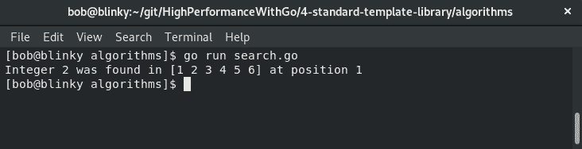
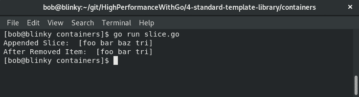
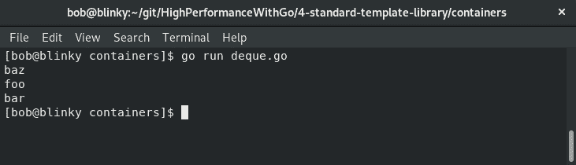
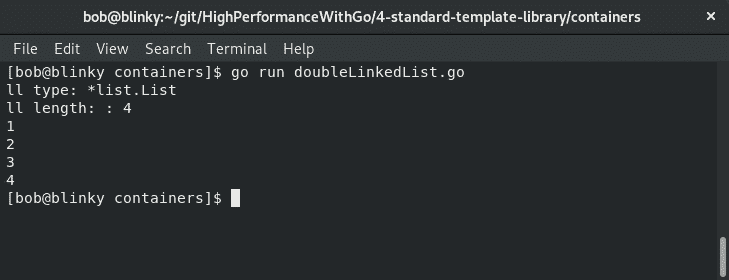
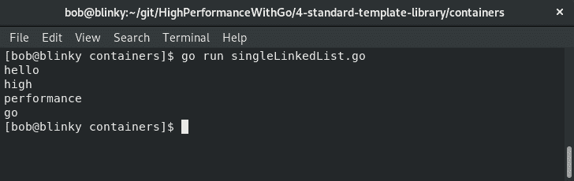
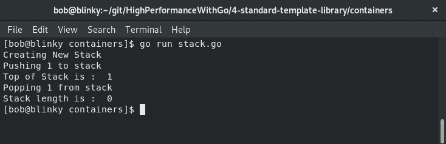
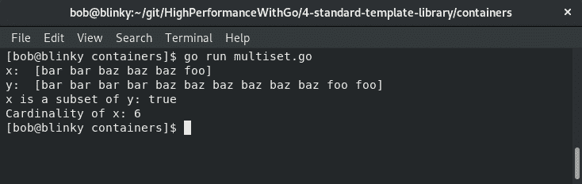
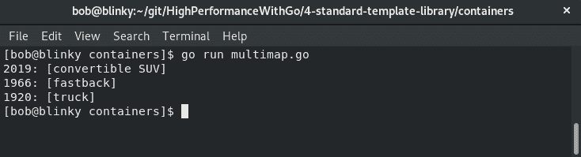

# 四、Go 中的 STL 算法

许多来自其他高性能编程语言的程序员，特别是 C++，理解了 To.T0.标准模板库的概念 Ty1 T1。该库提供对通用库的通用编程数据结构和函数访问，以便快速迭代和大规模编写性能代码。Go 没有内置的 STL。本章将重点介绍如何在 Go 中利用一些最常见的 STL 实践。STL 有四个常用的引用组件：

*   算法
*   容器
*   函子
*   遍历器

熟悉这些主题将帮助您利用常用的实现和优化模式，更快、更有效地编写 Go 代码。在本章中，我们将学习以下内容：

*   如何在 Go 中使用 STL 实践
*   如何利用标准编程算法进行Go
*   容器如何存储数据
*   Go 中的函数如何工作
*   如何正确使用迭代器

记住，所有这些片段仍然是我们性能难题的一部分。了解何时使用正确的算法、容器或函子将有助于编写性能更好的代码。

# 理解 STL 中的算法

STL 中的算法执行排序和搜索以及操作和计数数据等功能。这些是由 C++中的 Type T0p 标头调用的，并用于元素的范围。修改的对象组不会影响与其关联的容器的结构。这里每个副标题中概述的模式都使用 Go 的语言结构来实现这些算法。本章本节将解释以下类型的算法：

*   分类
*   颠倒
*   最小和最大元素
*   二进制搜索

当您需要使用这些技术来使用算法操纵数据结构时，能够理解所有这些算法是如何工作的将有助于您生成性能良好的代码。

# 分类

**排序**算法将数组按升序排序。排序不需要创建、销毁或复制新容器。排序算法对容器中的所有元素进行排序。我们可以使用标准的库排序来完成这项工作。Go 的标准库排序具有针对不同数据类型（`IntsAreSorted`、`Float64sAreSorted`、`StringsAreSorted`的帮助函数，用于对各自的数据类型进行排序。我们可以实现如下代码所示的排序算法：

```go
package main
import (
    "fmt"
    "sort"
)
func main() {
    intData := []int{3, 1, 2, 5, 6, 4}
    stringData := []string{"foo", "bar", "baz"}
    floatData := []float64{1.5, 3.6, 2.5, 10.6}
```

这段代码用值实例化简单的数据结构。之后，我们使用内置的`sort`函数对这些数据结构进行排序，如下所示：

```go

    sort.Ints(intData)
    sort.Strings(stringData)
    sort.Float64s(floatData)
    fmt.Println("Sorted Integers: ", intData, "\nSorted Strings:
      ", stringData, "\nSorted Floats: ", floatData)
}
```

执行此操作时，我们可以看到所有切片都已按顺序排序，如以下屏幕截图所示：


整数从低到高排序，字符串按字母顺序排序，浮点数从低到高排序。这些是`sort`包中的默认排序方法。

# 颠倒

**反转**算法获取数据集并反转集合的值。Go 标准`sort`包没有内置的反转切片的方法。我们可以编写一个简单的`reverse`函数来反转数据集的顺序，如下所示：

```go
package main

import (
  "fmt"
)

func reverse(s []string) []string {
  for x, y := 0, len(s)-1; x < y; x, y = x+1, y-1 {
    s[x], s[y] = s[y], s[x]
  }
  return s
}
func main() {
  s := []string{"foo", "bar", "baz", "go", "stop"}
  reversedS := reverse(s)
  fmt.Println(reversedS)
}
```

此函数迭代切片，递增和递减`x`和`y`直到它们收敛，并交换切片中的元素，如下面的屏幕截图所示：


正如我们所看到的，我们的切片是使用`reverse()`函数反转的。使用标准库使手工编写的函数变得简单、简洁且可重用。

# 最小元素和最大元素

我们可以分别使用`min_element`和`max_element`算法在数据集中找到最小值和最大值。我们可以使用一个简单的迭代器在 Go 中实现`min_element`和`max_element`：

1.  首先，我们将编写一个函数来查找切片中的最小整数：

```go
package main

import "fmt"

func findMinInt(a []int) int {
  var minInt int = a[0]
  for _, i := range a {
    if minInt > i {
      minInt = i
    }
  }
  return minInt

}
```

2.  接下来，我们将遵循相同的过程，但将尝试查找切片中的最大整数：

```go
func findMaxInt(b []int) int {
  var max int = b[0]
  for _, i := range b {
    if max < i {
      max = i
    }
  }
  return max
}
```

3.  最后，我们将使用这些函数打印得到的最小值和最大值：

```go
func main() {
  intData := []int{3, 1, 2, 5, 6, 4}
  minResult := findMinInt(intData)
  maxResult := findMaxInt(intData)
  fmt.Println("Minimum value in array: ", minResult)
  fmt.Println("Maximum value in array: ", maxResult)
}
```

这些函数遍历整数切片，并在切片中查找最小值和最大值，如以下屏幕截图所示：


从我们的执行中可以看到，找到了最小值和最大值。

我们还在 Go`math`包中定义了`math.Min`和`math.Max`。这些仅用于比较`float64`数据类型。浮点比较不是一件容易的事情，所以 Go 设计师决定使用默认的`Min`和`Max`签名；在`math`库中，您应该使用浮动。如果 Go 有泛型，我们上面写的主函数可能适用于不同的类型。这是 Go 语言设计的一部分，保持简单和统一。

# 二进制搜索

**二进制搜索**是一种算法，用于查找排序数组中特定元素的位置。它首先以数组中的中间元素为目标。如果不存在匹配项，则算法接下来将获取可能包含该项的数组的一半，并使用中间值来查找目标。正如我们在[第 2 章](02.html)、*数据结构和算法*中了解到的，二进制搜索在*O*（log*n*处是一种有效的算法。Go 标准库`sort`包具有内置的二进制搜索功能。我们可以这样使用它：

```go
package main

import (
  "fmt"
  "sort"
)

func main() {
  data := []int{1, 2, 3, 4, 5, 6}
  findInt := 2
  out := sort.Search(len(data), func(i int) bool { return data[i]
     >= findInt })
  fmt.Printf("Integer %d was found in %d at position %d\n",
     findInt, data, out)
}
```

二进制搜索算法在预期位置（零索引切片中的位置`1`处）正确查找我们正在搜索的整数`2`的值。我们可以在下面的屏幕截图中看到二进制搜索的执行：



作为结论，STL 中的算法都可以很好地进行转换。Go 的默认函数和迭代器使编写简单、可重用的算法变得容易。在下一节中，我们将学习容器。

# 理解容器

集装箱在 STL 中分为三类：

*   序列容器
*   序列容器适配器
*   关联容器

我们将在以下章节中介绍这三种类型的容器。

# 序列容器

序列容器存储特定类型的数据元素。序列容器的当前实现有五种：`array`、`vector`、`deque`、`list`和`forward_list`。这些序列容器使以序列方式引用数据变得容易。能够利用这些序列容器是编写有效代码和重用标准库模块位的一条捷径。我们将在以下小节中探讨这些问题。

# 大堆

GO 中的阿纳尔数组 Ty1 T1。Go 的数组结构是在编译时静态定义的，不可调整大小。阵列以以下方式在 Go 中实现：

```go
arrayExample := [5]string{"foo", "bar", "baz", "go", "rules"}
```

此数组保存`arrayExample`变量中定义的字符串值，该变量定义为数组。

# 矢量

Go 最初有一个**向量**实现，但在语言开发的早期（2011 年 10 月 11 日），它就被删除了。人们认为切片更好（就像 pull 请求的标题一样），切片成为 Go 中事实上的向量实现。我们可以实现一个切片，如下所示：

```go
sliceExample := []string{"slices", "are", "cool", "in", "go"}
```

切片是有益的，因为与 STL 中的向量一样，它们可以根据添加或删除而增长或收缩。在我们的示例中，我们创建一个切片，向切片添加一个值，然后从切片中删除一个值，如以下代码所示：

```go
package main

import "fmt"

// Remove i indexed item in slice
func remove(s []string, i int) []string {
  copy(s[i:], s[i+1:])
  return s[:len(s)-1]
}

func main() {
  slice := []string{"foo", "bar", "baz"} // create a slice
  slice = append(slice, "tri") // append a slice
  fmt.Println("Appended Slice: ", slice) // print slice [foo, bar baz, tri]
  slice = remove(slice, 2) // remove slice item #2 (baz)
  fmt.Println("After Removed Item: ", slice) // print slice [foo, bar, tri]
}
```

在执行我们的向量示例时，我们可以看到附加和删除操作，如以下屏幕截图所示：



我们可以看到，`tri`元素被附加到了我们切片的末尾，我们还可以看到，`baz`元素（切片中的元素编号 3）是根据我们的`remove()`函数调用删除的。

# 德克

**deque**或双端队列是可以扩展的容器。这些膨胀可以发生在容器的前部或后部。当需要频繁引用队列的顶部或后部时，通常使用 DEQUE。以下代码块是 deque 的简单实现：

```go
package main

import (
    "fmt"

    "gopkg.in/karalabe/cookiejar.v1/collections/deque"
)

func main() {
    d := deque.New()
    elements := []string{"foo", "bar", "baz"}
    for i := range elements {
        d.PushLeft(elements[i])
    }
    fmt.Println(d.PopLeft())  // queue => ["foo", "bar"]
    fmt.Println(d.PopRight()) // queue => ["bar"]
    fmt.Println(d.PopLeft())  // queue => empty
}
```

`deque`包获取一片元素，并使用`PushLeft`函数将它们推送到队列中。接下来，我们可以弹出 deque 左侧和右侧的元素，直到队列为空。我们可以在下面的屏幕截图中看到 deque 逻辑的执行情况：



我们的结果显示了 deque 操作的输出，以及我们如何从队列的两端提取内容。能够从队列的两端提取数据在数据操作方面是有利的，这就是为什么 deque 是一种流行的数据结构选择。

# 列表

**列表**是 Go 对双链表的实现。它内置于标准库中的容器/列表包中。我们可以使用通用双链表的实现执行许多操作，如下代码所示：

```go
package main

import (
    "container/list"
    "fmt"
)

func main() {
    ll := list.New()
    three := ll.PushBack(3)           // stack representation -> [3]
    four := ll.InsertBefore(4, three) // stack representation -> [4 3]
    ll.InsertBefore(2, three)         // stack representation ->
                                      //  [4 2 3]
    ll.MoveToBack(four)               // stack representation ->
                                      // [2 3 4]
    ll.PushFront(1)                   // stack representation ->
                                      //  [1 2 3 4]
    listLength := ll.Len()
    fmt.Printf("ll type: %T\n", ll)
    fmt.Println("ll length: :", listLength)
    for e := ll.Front(); e != nil; e = e.Next() {
        fmt.Println(e.Value)
    }
}
```

双链接列表类似于 deque 容器，但它允许在必要时从堆栈中间插入和删除。双链表在实践中使用得更为频繁。我们可以在下面的屏幕截图中看到双链表代码的执行情况：



我们可以看到，所有元素都是按照程序输出中堆栈上的协调顺序排列的。链表是编程的精髓，因为它们是当今计算机科学的基础算法。

# 转发列表

**转发列表**是单链表的实现。单链接列表通常比双链接列表具有更小的内存占用；然而，通过单链表进行迭代并没有那么好，尤其是在相反的方向上。让我们看看如何实现转发列表：

1.  首先，我们初始化程序并定义结构：

```go
package main

import "fmt"

type SinglyLinkedList struct {
    head *LinkedListNode
}

type LinkedListNode struct {
    data string
    next *LinkedListNode
}
```

2.  然后我们创建`Append`函数并将其应用于`main`函数：

```go

func (ll *SinglyLinkedList) Append(node *LinkedListNode) {
    if ll.head == nil {
        ll.head = node
        return
    }

    currentNode := ll.head
    for currentNode.next != nil {
        currentNode = currentNode.next
    }
    currentNode.next = node
}

func main() {
    ll := &SinglyLinkedList{}
    ll.Append(&LinkedListNode{data: "hello"})
    ll.Append(&LinkedListNode{data: "high"})
    ll.Append(&LinkedListNode{data: "performance"})
    ll.Append(&LinkedListNode{data: "go"})

    for e := ll.head; e != nil; e = e.next {
        fmt.Println(e.data)
    }
}
```

正如我们在下面的屏幕截图中看到的，我们附加到单链表中的所有数据都可以访问：



此数据结构的初始元素按在代码块中添加的顺序放入列表中。这是意料之中的，因为通常使用单链表来保持数据结构中的数据顺序。

# 容器适配器

**容器适配器**采用顺序容器并调整其使用方式，以使原始顺序容器以其预期方式运行。在研究这些容器适配器的过程中，我们将从实践的角度了解如何创建所有容器适配器以及如何使用它们。

# 队列

**队列**是遵循**先进先出**排队方式或**先进先出**的容器。这意味着我们可以将东西添加到容器中，并将它们从容器的另一端拉出。我们可以通过从一个片中追加和退出队列来生成最简单的队列形式，如下代码所示：

```go
package main

import "fmt"

func main() {

    var simpleQueue []string
    simpleQueue = append(simpleQueue, "Performance ")
    simpleQueue = append(simpleQueue, "Go")

    for len(simpleQueue) > 0 {
        fmt.Println(simpleQueue[0])   // First element
        simpleQueue = simpleQueue[1:] // Dequeue
    }
    fmt.Println(simpleQueue) //All items are dequeued so result should be []
}
```

在我们的示例中，我们将字符串附加到我们的`simpleQueue`中，然后通过删除切片的第一个元素将其出列：


在我们的输出中，我们可以看到我们正确地将元素添加到队列中并删除了它们。

# 优先级队列

**优先级队列**是一个容器，它使用堆来保存容器中元素的优先级列表。优先级队列很有用，因为您可以按优先级对结果集排序。优先级队列通常用于许多实际应用，从负载平衡 web 请求到数据压缩，再到 Dijkstra 算法。

在我们的优先级队列示例中，我们创建了一个新的优先级队列，并插入了两种具有给定优先级的不同编程语言。我们从 Java 作为第一优先级开始，然后 Go 成为第一优先级。PHP 被添加，Java 的优先级被降低到 3。以下代码是优先级队列的示例。在这里，我们实例化必要的需求，创建一个新的优先级队列，将元素插入优先级队列，更改这些项目的优先级，并从堆栈中弹出项目：

```go
package main

import (
    "fmt"

    pq "github.com/jupp0r/go-priority-queue"
)

func main() {
    priorityQueue := pq.New()
    priorityQueue.Insert("java", 1)
    priorityQueue.Insert("golang", 1)
    priorityQueue.Insert("php", 2)
    priorityQueue.UpdatePriority("java", 3)
    for priorityQueue.Len() > 0 {
        val, err := priorityQueue.Pop()
        if err != nil {
            panic(err)
        }
        fmt.Println(val)
    }
}
```

执行此示例代码后，我们可以看到基于我们设置的优先级队列值的语言的正确顺序，如下面的代码所示：


优先级队列是一种常用的重要数据结构。使用它们是为了首先处理数据结构中最重要的元素，并且能够使用 STL 等价物实现这一点有助于我们节省时间和精力，同时能够对传入的请求进行优先级排序。

# 堆栈

**堆栈**用于数据分组，使用`push`和`pop`从容器中添加和删除元素。堆栈通常有一个**LIFO**（缩写为**后进先出**）操作顺序，`Peek`操作通常可以让您看到堆栈顶部的内容，而无需将其从堆栈中移除。堆栈对于内存有限的东西来说非常方便，因为它们可以有效地利用分配的内存。以下代码是堆栈的简单实现：

```go
package main

import (
    "fmt"

    stack "github.com/golang-collections/collections/stack"
)

func main() {
    // Create a new stack
    fmt.Println("Creating New Stack")
    exstack := stack.New()
    fmt.Println("Pushing 1 to stack")
    exstack.Push(1) // push 1 to stack
    fmt.Println("Top of Stack is : ", exstack.Peek())
    fmt.Println("Popping 1 from stack")
    exstack.Pop() // remove 1 from stack
    fmt.Println("Stack length is : ", exstack.Len())
}
```

我们可以看到程序的输出如下：



我们可以看到堆栈操作按预期执行。能够使用堆栈操作在计算机科学中很重要，因为这是执行多少低级编程技术的原因。

# 关联容器

**关联容器**是实现关联数组的容器。这些数组是有序的，只在算法对每个元素施加的约束上有所不同。STL 引用关联容器，即集合、映射、多集合和多映射。我们将在以下部分中探讨这些问题。

# 设置

**集合**仅用于存储钥匙。Go 没有集合类型，因此经常使用类型为布尔值的`map`来构建集合。以下代码块是 STL 等效集的实现：

```go
package main

import "fmt"

func main() {
    s := make(map[int]bool)

    for i := 0; i < 5; i++ {
        s[i] = true
    }

    delete(s, 4)

    if s[2] {
        fmt.Println("s[2] is set")
    }
    if !s[4] {
        fmt.Println("s[4] was deleted")
    }
}
```

结果输出表明，我们能够相应地设置和删除值：


我们可以从我们的输出中看到，我们的代码可以正确地操作一个集合，这对于常见的键-值配对至关重要。

# 多集

**多集**是无序集，每个元素都有一个计数。有许多方便的操作可用于多集，例如取差、缩放集或检查集的基数。

在我们的示例中，我们构建了一个多集`x`，通过`2`将其缩放为多集`y`，验证`x`是`y`的子集，并检查`x`的基数。我们可以在以下代码中看到 multiset 的示例实现：

```go
package main

import (
    "fmt"

    "github.com/soniakeys/multiset"
)

func main() {
    x := multiset.Multiset{"foo": 1, "bar": 2, "baz": 3}
    fmt.Println("x: ", x)
    // Create a scaled version of x
    y := multiset.Scale(x, 2)
    fmt.Println("y: ", y)
    fmt.Print("x is a subset of y: ")
    fmt.Println(multiset.Subset(x, y))

    fmt.Print("Cardinality of x: ")
    fmt.Println(x.Cardinality())
}
```

当我们执行此代码时，我们可以看到`x`、`x`、`y`的缩放版本、`x`作为`y`子集的验证以及`x`的基数计算。以下是执行我们的 multiset 代码片段的输出：



多集合对于集合操作非常有用，并且非常方便，因为每个元素可以有多个实例。多集的一个很好的实用示例是购物车。您可以向购物车中添加许多项目，并且可以在购物车中对同一项目进行多次计数。

# 地图

**映射**是一种用于存储键值对的容器。Go 的内置`map`类型使用哈希表存储键及其相关值。

在 Go 中，实例化地图很简单，如以下代码所示：

```go
package main

import "fmt"

func main() {
    m := make(map[int]string)
    m[1] = "car"
    m[2] = "train"
    m[3] = "plane"
    fmt.Println("Full Map:\t ", m)
    fmt.Println("m[3] value:\t ", m[3])
    fmt.Println("Length of map:\t ", len(m))
}
```

现在让我们看看输出：


在前面的执行结果中，我们可以看到我们可以创建一个映射，使用其键引用映射中的值，并使用`Len()`内置类型查找映射中的元素数。

# 多重映射

**多映射**是一个映射，其中一个或多个值可以通过键返回。多重映射的一个实际应用是 web 查询字符串。查询字符串可以有多个值分配给同一个键，正如我们可以从以下示例 URL 中看到的：`https://www.example.com/?foo=bar&foo=baz&a=b`。

在我们的示例中，我们将创建汽车的多重地图。我们的`car`结构有一年，每辆车都有一种风格。我们将能够将这些不同的类型聚合在一起。以下代码段是多重映射的实现：

```go
package main

import (
    "fmt"

    "github.com/jwangsadinata/go-multimap/slicemultimap"
)

type cars []struct {
    year  int
    style string
}

func main() {

    newCars := cars{{2019, "convertible"}, {1966, "fastback"}, {2019, "SUV"}, {1920, "truck"}}
    multimap := slicemultimap.New()

    for _, car := range newCars {
        multimap.Put(car.year, car.style)
    }

    for _, style := range multimap.KeySet() {
        color, _ := multimap.Get(style)
        fmt.Printf("%v: %v\n", style, color)
    }
}
```

我们有多个版本的车，车型年为`2019`（敞篷车和`SUV`。在结果输出中，我们可以看到这些值聚合在一起：



当您想要在地图中捕获一对多关联时，多重地图非常有用。在下一节中，我们将介绍函数对象。

# 理解函数对象

**函数对象**也称为**函子**，用于生成、测试和操作数据。如果将对象声明为函子，则可以像使用函数调用一样使用该对象。通常，STL 中的算法需要一个参数来执行指定的任务。函子往往是帮助执行这些任务的有用方法。在本节中，我们将了解以下内容：

*   函子
*   内部和外部迭代器
*   发电机
*   隐式迭代器

# 函子

**函子**是一种函数式编程范例，其中在保留结构的同时对结构执行转换。

在我们的示例中，我们获取一个整数切片`intSlice`，并将该切片提升为函子。`IntSliceFunctor`是一个包括以下内容的接口：

*   `fmt.Stringer`，定义值的字符串格式及其表示形式。
*   `Map(fn func(int int) IntSliceFunctor`-此映射将`fn`应用于我们切片中的每个元素。
*   一个方便的函数`Ints() []int`，它允许您获取函子持有的`int`切片。

在获得提升的切片后，我们可以对新创建的函子执行操作。在我们的示例中，我们执行平方运算和模三运算。以下是函子的示例实现：

```go
package main                                                                                                                                

import (
    "fmt"

    "github.com/go-functional/core/functor"
)

func main() {
    intSlice := []int{1, 3, 5, 7}
    fmt.Println("Int Slice:\t", intSlice)
    intFunctor := functor.LiftIntSlice(intSlice)
    fmt.Println("Lifted Slice:\t", intFunctor)

    // Apply a square to our given functor
    squareFunc := func(i int) int {
        return i * i 
    }   

    // Apply a mod 3 to our given functor
    modThreeFunc := func(i int) int {
        return i % 3 
    }   

    squared := intFunctor.Map(squareFunc)
    fmt.Println("Squared: \t", squared)

    modded := squared.Map(modThreeFunc)
    fmt.Println("Modded: \t", modded)
}
```

在执行这段代码的过程中，我们可以看到我们对函子的函数操作按预期工作。我们取初始值`intSlice`，将其提升为函子，用`squareFunc`对每个值应用平方，用`modThreeFunc`对每个值应用`%3`：


函子是一种非常强大的语言构造。函子以易于修改的方式抽象容器。它还允许分离关注点，例如，您可以将迭代逻辑与计算逻辑分离，函子可以更简单地参数化，函子也可以是有状态的。

# 遍历器

我们在[第 3 章](03.html)、*理解并发*中讨论了迭代器。迭代器是允许遍历列表和其他容器的对象。迭代器通常作为容器接口的一部分实现，这对于程序员来说是一种重要的方法。这些通常分为以下几类：

*   内部迭代器
*   外部迭代器
*   发电机
*   隐式迭代器

我们将在以下章节中更详细地介绍这些类别。

# 内部迭代器

**内部****迭代器**表示为高阶函数（通常使用匿名函数，如[第 3 章](03.html)、*理解并发*所示）。高阶函数将函数作为参数，将返回函数作为输出。匿名函数是不绑定到标识符的函数。

内部迭代器通常将自己映射为将函数应用于容器中的每个元素。这可以由变量标识符表示，也可以匿名表示。该语言的作者提到，在 Go 中可以使用 apply/reduce，但不应该使用（这是因为在 Go 中更倾向于使用`for`循环）。这种模式遵循 Go 的座右铭*简单胜于聪明*。

# 外部迭代器

**外部迭代器**用于访问对象中的元素并指向对象中的下一个元素（分别称为元素访问和遍历）。Go 大量使用`for`循环迭代器。`for`循环是 Go 唯一的自然循环构造，大大简化了程序构造。`for`循环如下所示：

```go
package main

import "fmt"

func main() {
    for i := 0; i < 5; i++ {
        fmt.Println("Hi Gophers!")
    }
}
```

我们可以看到我们的输出如下：


我们的`for`循环迭代器很简单，但有时它证明了一个优点，对于困难的问题集，简单性是可以预期的。

# 发电机

**生成器**在调用函数时按顺序返回后续值。正如您在以下代码块中所看到的，匿名函数可用于在 Go 中实现生成器迭代器模式：

```go
package main

import "fmt"

func incrementCounter() func() int {
    initializedNumber := 0
    return func() int {
        initializedNumber++
        return initializedNumber
    }   
}

func main() {
    n1 := incrementCounter()
    fmt.Println("n1 increment counter #1: ", n1())
    fmt.Println("n1 increment counter #2: ", n1())
    n2 := incrementCounter()
    fmt.Println("n2 increment counter #1: ", n2())
    fmt.Println("n1 increment counter #3: ", n1())
}
```

调用`incrementCounter()`时，函数中表示的整数递增。能够以这种方式同时使用匿名函数对许多来自其他语言的程序员来说是一个巨大的吸引力。它给出了一种利用语言并发性的简洁方法。

# 隐式迭代器

**隐式迭代器**为程序员提供了一种简单的方法来迭代存储在容器中的元素。这通常是通过 Go 中的内置范围创建的。内置范围允许您遍历容器。以下是实现隐式迭代器的代码段：

```go
package main

import "fmt"

func main() {
    stringExample := []string{"foo", "bar", "baz"}
    for i, out := range stringExample {
        fmt.Println(i, out)
    }
}
```

我们可以看到结果输出如下：


这个输出显示了我们在`stringExample`变量范围内的迭代。`range`函数是一个非常强大的结构，简洁易读。

# 总结

在本章中，我们学习了如何在 Go 中使用 STL 实践。我们还学习了如何使用标准的 Go 编程算法，学习了容器如何存储数据，学习了函数如何在 Go 中工作，并研究了如何正确使用迭代器。当我们继续我们的 Go 性能之旅时，我们应该始终保留这些算法、容器、函子，迭代器是我们编写代码的首选。这样做将有助于我们快速、简洁地编写习惯用语 Go。选择这些 STL 习惯用法的适当组合将有助于我们更快、更有效地处理手中的数据。在下一章中，我们将学习如何在 Go 中计算向量和矩阵。