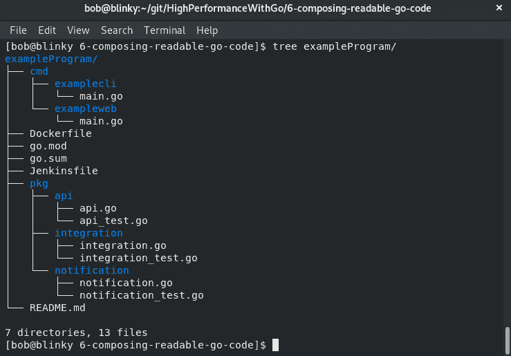
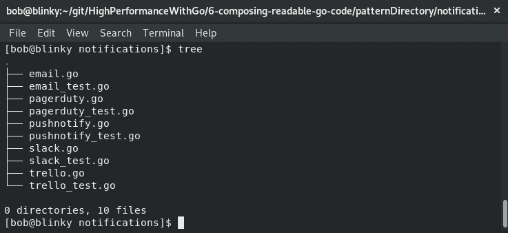
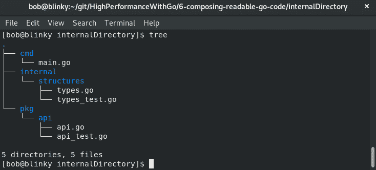
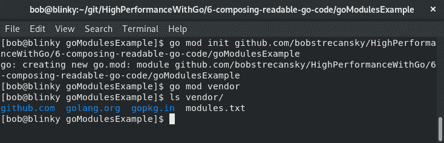
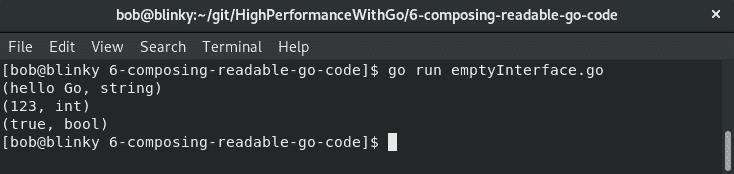
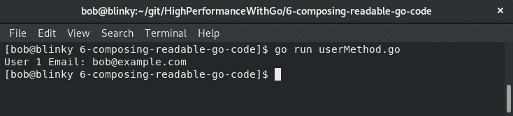
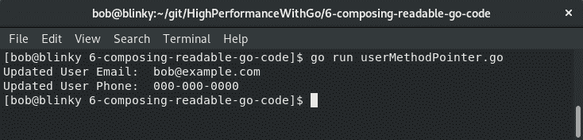
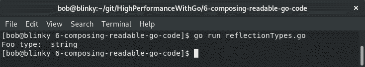

# 编写可读的 Go 代码

学习如何编写可读的 Go 代码是该语言的重要组成部分。语言开发人员在编写其他语言时使用他们以前的经验来创建一种他们认为清晰简洁的语言。描述用这种语言书写的正确方式的常用短语是*惯用语 Go*。此短语用于描述 Go 中的*正确*编程方式。风格通常是主观的，但 Go 团队一直在努力以一种自以为是的方式编写语言，并促进开发人员的速度、可读性和协作。在本章中，我们将讨论如何维护该语言的一些核心原则：

*   简单
*   可读性
*   包装材料
*   命名
*   格式化
*   接口
*   方法
*   遗产
*   反射

理解这些模式和习惯用法将有助于您编写更易于在团队之间阅读和操作的 Go 代码。能够编写惯用的 Go 将有助于提高代码质量，并帮助项目保持速度。

# 在 Go 中保持简单性

开箱即用，Go 不遵循其他编程语言使用的特定模式。为了保持语言的简洁和清晰，作者选择了不同的习语作为下面的一些语言结构。保持语言的简单性对于语言开发人员来说是一项困难的任务。拥有工具、库、快速执行和快速编译，同时保持简单性，一直是该语言发展的前沿。Go 的语言开发人员一直在跟踪这些决策，采用共识设计模型，就向语言添加内容达成共识，确保以对语言开发非常重要的方式添加内容

语言维护人员在 GitHub 问题页面上非常活跃，如果您有请求，他们会非常乐意查看请求。从使用该语言编写的其他人那里获得反馈，使语言维护人员能够在保持可读性和简单性的同时，就向该语言添加新特性和功能做出明智的决定。

以下部分将向我们展示 Go 语言的下一个基本方面：可读性。

# 在 Go 中保持可读性

可读性是 Go 的另一个核心宗旨。能够快速探索新的代码库并理解其中的一些细微差别是任何编程语言的重要组成部分。随着分布式系统的不断发展，供应商提供的库和 API 变得越来越普遍，能够轻松地阅读包含的代码并理解它有助于向前发展。这也使得损坏的代码更容易修复。

拥有具体的数据类型、接口、包、并发性、函数和方法有助于继续前进。可读性是能够在较长时间内维护大型代码库的最重要参数之一，这也是 sets 区别于竞争对手的最重要的因素之一。作为一等公民，这种语言的可读性很强

Go 有许多看起来很复杂的语言内部部分，但它们实际上一点也不复杂。简单定义的常量、接口、包、垃圾收集和易于实现的并发性等都是复杂的，但对最终用户来说是透明的。这些结构可用有助于使 Go 作为一种语言蓬勃发展。

让我们在下一节中了解围棋中的打包意味着什么。

# 探索围棋中的包装

包装是围棋语言的基本组成部分。每个围棋程序的第一行都必须有一个包定义。这有助于可读性、可维护性、引用和组织。

Go 程序中的`main`包使用主声明。此主声明调用程序的`main`函数。发生这种情况后，`main`函数中有其他导入，可用于导入程序中的其他包。为了模块化程序中的所有依赖项，我们应该尽量保持主包的小型化。接下来我们将讨论包命名。

# 包命名

在命名包时，开发人员应遵守以下规则：

*   包不应该有下划线、连字符或混合大写字母
*   包不应使用通用命名方案命名，例如 common、util、base 或 helper
*   包命名应该与包正在执行的功能相关
*   包装应保持适当的尺寸范围；包中的所有元素都应该有相似的目标
*   利用内部包可以帮助您在新包与公共 API 对齐之前检查它们

# 包装布局

当我们讨论围棋项目的布局时，我们应该遵循两个不同的流程。常见的惯例是将主程序保存在名为`cmd`的文件夹中。您构建的要从`main`函数执行的其他包应该位于`pkg`目录中。这种分离有助于鼓励包的重用。在下面的示例中，如果我们希望为 CLI 和 web 主程序重用通知包，我们可以通过一次导入轻松地做到这一点。以下屏幕截图显示了这种分离：



Go 的反模式是使用一对一文件进行包映射。我们应该遵循在特定的目录结构中一起驱动通用用例的想法。例如，我们可以为每个文件创建一个目录，并按如下方式进行测试：


但是，我们应该按照以下方式创建包：



所有这些不同的通知策略都有一个共同的做法。我们应该尝试将类似的功能耦合在同一个包中。这将帮助其他人了解通知包具有类似功能的任何上下文。

# 内包装

许多 Go 程序使用内部包的概念来表示尚未准备好供外部使用的 API。内部包的概念首先在 Go 1.4 中引入，以在程序中的组件周围添加边界。无法从存储这些内部包的子树外部导入这些内部包。如果您希望维护内部软件包，并且不将其公开给程序的其余部分，这将非常有用。以您认为合适的方式检查内部包后，可以更改文件夹名称并公开以前的内部包。

让我们看一个例子：



在前面的示例中，我们可以看到我们有一个内部目录。这只能从该项目中访问。但是，可以从其他项目访问`pkg`和`cmd`目录。这一点很重要，因为我们将继续开发新产品和功能，而这些产品和功能不应在其他项目中提供。

# 供应商目录

供应商目录的概念起源于 Go 1.5 的发布。`vendor`文件夹用于将外部和内部源的已编译分组存储到项目内的目录中。这意味着代码生成器不再需要将依赖包中的代码复制到源代码树中。当`GOPATH`查找依赖项时，将搜索`vendor`文件夹。这是好的，原因有很多：

*   我们可以保留项目外部依赖项的本地副本。如果我们希望在外部网络连接有限或没有外部网络连接的网络上执行程序，这将非常有用。
*   这使得 Go 程序的编译速度更快。将所有这些供应商依赖项存储在本地意味着我们不需要在构建时提取依赖项。
*   如果您希望使用第三方代码，但已经针对特定用例对其进行了调整，那么您可以提供该代码并将其更改为内部版本。

# 围棋模块

Go 模块在 Go 1.11 中引入。它们提供了跟踪 Go 代码库中版本依赖关系的能力。它们是 Go 包的集合，作为一个内聚单元存储在项目目录中的`go.mod`文件中。

我们将执行以下步骤来初始化新模块：

1.  我们首先执行`go mod init repository`：

```go
go mod init github.com/bobstrecansky/HighPerformanceWithGo
go: creating new go.mod: module github.com/bobstrecansky/HighPerformanceWithGo
```

2.  在初始化这个新模块之后，您可以构建 Go 包并像平常一样执行它。从项目中导入的任何模块都将保存在项目目录中的`go.mod`文件中。

例如，如果我们希望能够使用 Gin 框架[[创建一个简单的 web 服务器 https://github.com/gin-gonic/gin](https://github.com/gin-gonic/gin) ，我们将在我们的项目结构中为此创建一个目录，如下所示：`/home/bob/git/HighPerformanceWithGo/6-composing-readable-go-code/goModulesExample`。

3.  接下来，我们将创建一个简单的 web 服务器，该服务器返回对`/foo`请求的`bar`响应：

```go
package main
import "github.com/gin-gonic/gin"
func main() {
  server := gin.Default()
  server.GET("/foo", func(c *gin.Context) {
    c.JSON(200, gin.H{
      "response": "bar",
    })
  })
  server.Run()
}
```

4.  之后，我们可以在新创建的目录中创建一个新的 Go 模块：


5.  接下来，我们可以执行 Go 程序；必要时将引入适当的依赖项：


现在我们可以看到，我们对简单 web 服务器的依赖关系存储在目录中的`go.sum`文件中（我使用`head`命令将列表截断为前 10 个条目）：


Go 模块有助于保持 Go 存储库中的供应商项目干净一致。如果我们希望将所有依赖项保持在项目的本地，我们也可以使用供应商存储库。

在您的存储库中，对供应商依赖关系的看法往往差异很大。有些人喜欢使用供应商存储库，因为它减少了构建时间，并限制了无法从外部存储库提取包的风险。另一些人认为，出售可能会阻碍软件包更新和安全补丁。您是否选择在程序中使用供应商目录取决于您，但 Go 模块在语言中包含此功能这一事实很方便。以下输出说明了这一点：



能够使用内置的编译工具创建供应商目录使设置和配置变得容易

在下一节中，我们将讨论在 Go 中命名事物。

# 理解围棋中的命名

为了保持代码的可读性和可维护性，程序员喜欢保留许多一致的行为。Go 命名方案往往是一致、准确和简短的。我们希望在创建名称时牢记以下习惯用法：

*   迭代器的局部变量应该简短：
    *   `i`表示迭代器；`i`和`j`如果你有一个二维迭代器
    *   `r`对于读者而言
    *   `w`作为一名作家
    *   `ch`频道

*   全局变量名称应简短且具有描述性：
    *   `RateLimit`
    *   `Log`
    *   `Pool`

*   缩略语应遵循使用所有大写字母的惯例：
    *   `FooJSON`
    *   `FooHTTP`

*   避免在使用包名称时口吃：
    *   `log.Error()`代替`log.LogError()`

*   与一种方法的接口应遵循方法名称加上`-er`后缀：
    *   `Stringer`
    *   `Reader`
    *   `Writer`
    *   `Logger`
*   Go 中的名称应遵循 Pascal 或 mixedCaps 大小写方法：
    *   `var ThingOne`
    *   `var thingTwo`

重要的是要记住，如果名称的首字母大写，则会导出该名称并可用于其他函数。记住这一点，同时提出自己的命名方案。

遵循其中一些命名约定可以使您拥有可读的、可消费的、可重用的代码。另一个好的做法是使用一致的命名样式。如果要实例化相同类型的参数，请确保它遵循一致的命名约定。这使得新用户更容易遵循您编写的代码

在下一节中，我们将讨论 Go 代码的格式。

# 理解围棋中的格式

如[第 1 章](01.html)、*Go 性能简介*中所述，`gofmt`是 Go 代码的一种固执己见的格式化程序。它按照语言维护人员希望阅读的方式缩进和对齐代码。当今许多最流行的代码编辑器在保存文件时都可以执行`gofmt`。这样做，以及让您的持续集成软件进行验证，可以避免您必须关注正在编写的代码的格式，因为语言在输出中将是规定性的。使用此工具将使 Go 代码更易于阅读、编写和维护，并具有多个贡献者。它还消除了语言中相当多的争议，因为空格、制表符和大括号是自动定位的。

我们还可以向我们的 Git 存储库（在`.git/hooks/pre-commit`中）添加一个预提交钩子，以证实提交到存储库的所有代码都按照预期的格式进行了格式化。以下代码块说明了这一点：

```go
#!/bin/bash
FILES=$(/usr/bin/git diff --cached --name-only --diff-filter=dr | grep '\.go$')
[ -z "$FILES" ] && exit 0
FORMAT=$(gofmt -l $FILES)
[ -z "$FORMAT" ] && exit 0

echo >&2 "gofmt should be used on your source code. Please execute:"
  for gofile in $FORMAT; do
      echo >&2 " gofmt -w $PWD/$gofile"
  done
  exit 1
```

在我们添加了这个预提交钩子之后，我们可以通过向存储库中的文件添加一些错误的间距来确认事情是否按预期进行。在我们这样做和`git commit`我们的代码之后，我们将看到一条警告消息，如下所示：

```go
git commit -m "test"
//gofmt should be used on your source code. Please execute:
gofmt -w /home/bob/go/example/badformat.go
```

`gofmt`还有一个鲜为人知但非常有用的简化方法，它将尽可能执行源代码转换。这将获取一些复合、切片和范围复合文本，并缩短它们。“简化格式”命令将采用以下代码：

```go
package main
import "fmt"
func main() {
    var tmp = []int{1, 2, 3}
    b := tmp[1:len(tmp)]
    fmt.Println(b)
    for i, _ := range tmp {
       fmt.Println(tmp[i])
    }
}
```

这将简化为以下代码：`gofmt -s gofmtSimplify.go`。

此`gofmt`代码段的输出如下：

```go
package main
import "fmt"
func main() {
    var tmp = []int{1, 2, 3}
    b := tmp[1:]
    fmt.Println(b)
    for i := range tmp {
       fmt.Println(tmp[i]) 
    }
}
```

请注意，前面代码片段中的变量`b`有一个简单的定义，范围定义中的空变量已被`gofmt`工具删除。此工具可以帮助您在存储库中定义更清晰的代码。它也可用作编写代码的机制，编写者可以思考问题，但从`gofmt`生成的代码可以以紧密结合的方式存储在共享存储库中

在下一节中，我们将讨论 Go 中的接口。

# 围棋界面简介

Go 的接口系统不同于其他语言的接口系统。它们是命名的方法集合。接口在编写可读的 Go 代码时非常重要，因为它们使代码具有可伸缩性和灵活性。接口还使我们能够在 Go 中使用多态性（为不同类型的项目提供单一接口）。接口的另一个积极方面是它们是隐式实现的，编译器检查特定类型是否实现了特定接口

我们可以如下定义一个接口：

```go
type example interface {
foo() int
bar() float64
}
```

如果我们想要实现一个接口，我们需要做的就是实现接口中引用的方法。编译器将验证接口的方法，这样您就不必执行此操作。

我们还可以定义一个空接口，这个接口有零个方法，用`interface{}`表示。空接口在 Go 中是有价值和实用的，因为我们可以将任意值传递给它们，如以下代码块所示：

```go
package main
import "fmt"
func main() {
    var x interface{}
    x = "hello Go"
    fmt.Printf("(%v, %T)\n", x, x)
    x = 123
    fmt.Printf("(%v, %T)\n", x, x)
    x = true
    fmt.Printf("(%v, %T)\n", x, x)
}
```

当我们执行空接口示例时，我们可以看到 x 接口的类型和值随着我们更改（最初）空接口的定义而改变：



空的、可变的接口很方便，因为它们使我们能够灵活地以代码编写器认为有意义的方式操作数据

在下一节中，我们将讨论围棋中的理解方法。

# 围棋的理解方法

Go 中的方法是具有特殊类型的函数，称为`receiver`，位于`function`关键字和与关键字关联的方法名称之间。Go 不像其他编程语言那样有类。结构通常与方法结合使用，以便以类似于其他语言中构造类的方式捆绑数据及其相应的方法。当我们实例化一个新方法时，我们可以添加结构值以丰富函数调用。

我们可以按如下方式实例化结构和方法：

```go
package main
import "fmt"
type User struct {
    uid int
    name string
    email string
    phone string
}

func (u User) displayEmail() {
    fmt.Printf("User %d Email: %s\n", u.uid, u.email)
}
```

完成此操作后，我们可以使用此结构和方法显示有关用户的信息，如下所示：

```go
func main() {
    userExample := User{
       uid: 1,
       name: "bob",
       email: "bob@example.com",
       phone: "123-456-7890",
    }

    userExample.displayEmail()
}
```

这将返回来自`userExample.displayEmail()`的结果，该结果将结构的相关部分打印为方法调用的一部分，如下所示：



因为我们有更大的数据结构，所以我们能够轻松有效地引用存储在这些结构中的数据。如果我们决定编写一个方法来查找最终用户的电话号码，那么使用我们现有的数据类型并编写一个类似于`displayEmail`方法的方法来返回最终用户的电话号码就很简单了。

到目前为止，我们所研究的方法只有价值接受者。方法也可以有指针接收器。当您希望就地更新数据并使结果可供调用方函数使用时，指针接收器非常有用。

考虑一下我们前面的例子，并进行了一些修改。我们将有两种方法来更新用户的电子邮件地址和电话号码。电子邮件地址更新将使用值接收器，而电话更新将使用指针接收器。

我们在以下代码块中创建这些函数，以便能够轻松更新最终用户的信息：

```go
package main 
import "fmt"

type User struct {
    uid int
    name string
    email string
    phone string
} 

func (u User) updateEmail(newEmail string) {
    u.email = newEmail
} 

func (u *User) updatePhone(newPhone string) {
    u.phone = newPhone
} 
```

我们接下来在`main`中创建我们的示例最终用户，如下代码块所示：

```go
func main() {
      userExample := User{ 
        uid: 1, 
        name: "bob",
        email: "bob@example.com",
        phone: "123-456-7890",
    } 
```

然后，我们在以下代码块中更新最终用户的电子邮件和电话号码：

```go
userExample.updateEmail("bob.strecansky@example.com") 
    (userExample).updatePhone("000-000-0000")
    fmt.Println("Updated User Email: ", userExample.email)
    fmt.Println("Updated User Phone: ", userExample.phone)
}     
```

在我们的结果输出中，我们可以看到，从接收者的角度来看，用户电子邮件尚未更新，但用户的电话号码已：



当试图从方法调用中改变状态时，记住这一点很重要。方法在处理 Go 程序中的数据时非常有用。

现在是时候看看围棋中的继承是怎么回事了。

# 理解围棋中的继承

Go 没有继承权。组合用于将项目（主要是结构）嵌入到另一个项目中。当您有一个用于许多不同函数的基线结构，以及在初始结构之上构建的其他结构时，这非常方便。

我们可以描述一下我厨房里的一些东西来展示继承是如何工作的。

我们可以初始化程序，如下面的代码块所示。在此块中，我们创建两个结构：

`Utensils`：厨房抽屉里的餐具

`Appliances`：我厨房里的电器

```go
package main
import "fmt" 

func main() {
    type Utensils struct {
        fork string
        spoon string
        knife string
    } 

    type Appliances struct {
        stove string
        dishwasher string
        oven string
    } 
```

接下来，我可以使用 Go 的嵌套结构创建一个`Kitchen`结构，该结构包含所有器具和用具，如下所示：

```go
    type Kitchen struct {
        Utensils
        Appliances
    } 
```

然后，我可以用我拥有的餐具和用具填满我的厨房：

```go
    bobKitchen := new(Kitchen)
    bobKitchen.Utensils.fork = "3 prong"
    bobKitchen.Utensils.knife = "dull"
    bobKitchen.Utensils.spoon = "deep"
    bobKitchen.Appliances.stove = "6 burner"
    bobKitchen.Appliances.dishwasher = "3 rack"
    bobKitchen.Appliances.oven = "self cleaning"
    fmt.Printf("%+v\n", bobKitchen) 
}                 
```

一旦所有这些东西都进入，我们就可以看到结果输出，其中我的厨房项目（T0 和 T1）被组织在我的 T2 结构中。我的`Kitchen`结构随后可以在其他方法中轻松引用。

嵌套结构对于将来的扩展非常实用。如果我决定在我的房子中添加其他元素到这个结构中，我可以制作一个`House`结构并将我的`Kitchen`结构嵌套在`House`结构中。我还可以为我房子里的其他房间组合结构，并将它们添加到房子结构中

在下一节中，我们将探讨 Go 中的反射。

# 探索围棋中的反思

Go 中的反射是元编程的一种形式。在 Go 中使用反射可以让程序理解自己的结构。有时，您希望在运行时使用程序编写时不存在的变量。我们使用反射来检查存储在接口变量中的键和值对。反射通常不清楚，所以要小心使用，必要时应在特殊情况下使用反射。它只有运行时检查（而不是编译检查），因此我们需要根据常识使用反射。

记住 Go 的变量是静态类型的，这一点很重要。我们可以在 Go 中使用许多不同的变量类型-`rune`、`int`、`string`等等。我们可以按如下方式声明特定类型：

```go
Type foo int
var x int
var y foo
```

两个变量`x`和`y`都是 int 类型的变量

有三个重要的反射用于查找信息：

*   类型
*   种类
*   价值观

这三个不同的部分一起工作，可以推断出您可能需要知道的与接口相关的信息。让我们来看看每一个单独的，看看他们如何网格在一起。

# 类型

能够辨别变量的类型在 Go 中很重要。在我们的示例中，我们可以验证字符串类型实际上是字符串这一事实，如以下代码块所示：

```go
package main

import (
    "fmt"
    "reflect"
)

func main() {
    var foo string = "Hi Go!"
    fooType := reflect.TypeOf(foo)
    fmt.Println("Foo type: ", fooType)
}
```

我们程序的输出将向我们表明，反射类型将准确地导出`foo string`类型：



虽然这个例子很简单，但理解基本原理很重要：如果我们不是验证字符串，而是查看传入的网络调用或外部库调用的返回，或者尝试构建一个可以处理不同类型的程序，那么反射库的`TypeOf`定义可以帮助我们正确识别这些类型。

# 种类

种类用作占位符，用于定义特定类型表示的类型。它用来表示类型是由什么组成的。这对于确定已定义的结构类型非常有用。让我们看一个例子：

```go
package main
import (
    "fmt"
    "reflect"
)

func main() {
    i := []string{"foo", "bar", "baz"}
    ti := reflect.TypeOf(i)
    fmt.Println(ti.Kind())
}
```

在我们的示例中，我们可以看到我们已经创建了一段字符串—`foo`、`bar`和`baz`。从这里，我们可以使用反射来查找`i`的类型，我们可以使用`Kind()`函数来确定该类型是由什么组成的，在我们的例子中，一个切片如下所示：


如果我们想推断特定接口的类型，这可能很有用。

# 价值观

反射中的值有助于读取、设置和存储特定变量的结果。在下面的示例中，我们可以看到我们设置了一个示例变量`foo`，并且，使用反射包，我们可以在生成的 print 语句中推断示例变量的值，如下所示：

```go
package main
import (
    "fmt"
    "reflect"
)

func main() {
    example := "foo"
    exampleVal := reflect.ValueOf(example)
    fmt.Println(exampleVal)
}
```

在我们的输出中，我们可以看到示例变量`foo`的值被返回：


reflect 系统中的这三个不同函数帮助我们推断可以在代码库中使用的类型。

# 总结

在本章中，我们学习了如何使用该语言的一些核心原则来编写可读的 Go 代码。我们了解了简单性和可读性的重要性，以及包装、命名和格式对编写可读 Go 的重要性。此外，我们还学习了如何使用接口、方法、继承和反射来编写其他人可以理解的代码。能够有效地使用这些核心 Go 概念将帮助您生成更高效的代码。

在下一章中，我们将学习 Go 中的内存管理以及如何优化手头的内存资源。