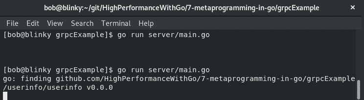
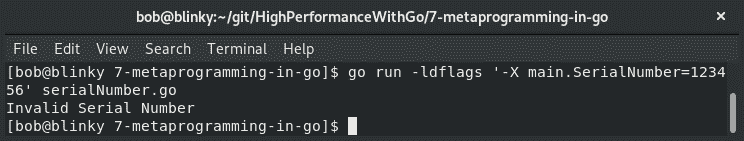
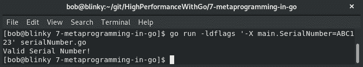
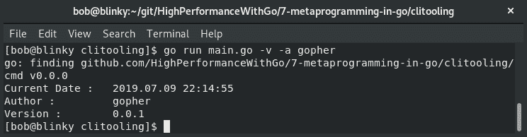
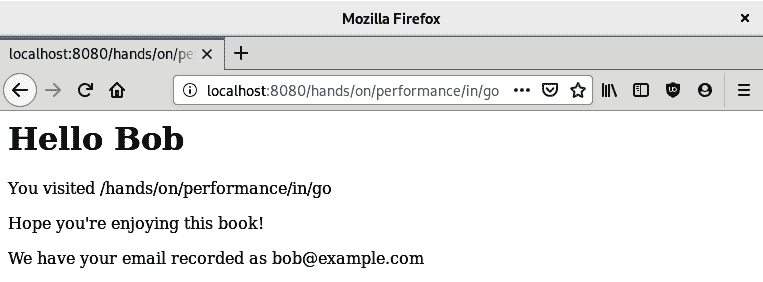
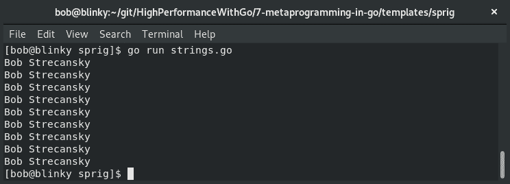

# 七、Go 中的模板编程

Go 中的模板编程允许最终用户编写生成、操作和运行 Go 程序的 Go 模板。Go 具有清晰的静态依赖关系，这有助于元编程。Go 中的模板编程，包括生成的二进制文件、CLI 工具和模板库，都是该语言的核心原则，可以帮助我们编写可维护、可伸缩、高性能的 Go 代码。

在本章中，我们将介绍以下主题：

*   去生成
*   Protobuf 代码生成
*   链接工具链
*   使用 Cobra 和 Viper 进行配置元编程
*   文本和 HTML 模板
*   Go 模板用小枝

所有这些主题都将帮助您更快、更有效地编写 Go 代码。在下一节中，我们将讨论 Go generate 以及它在 Go 编程语言中的用途。

# 理解去生成

从 Go 版本 1.4 开始，该语言包含一个有助于代码生成的工具，称为 Go generate。转到生成要运行的常规命令的源代码。它独立于`go build`运行，因此必须在构建代码之前运行。Go generate 由代码作者运行，而不是由已编译二进制文件的用户运行。此工具的运行方式与 Makefiles 和 shell 脚本的典型使用方式类似，但它是与 Go 工具打包的，我们不需要包含任何其他依赖项。

Go generate 将在代码库中搜索具有以下模式的行：`//go:generate command argument`。

生成的源文件应具有如下行，以便传达代码已生成：

```go
^// Code generated .* DO NOT EDIT\.$
```

Go generate 在生成器运行时使用一组变量：

*   `$GOARCH`：执行平台的架构
*   `$GOOS`：执行平台的操作系统
*   `$GOFILE`：文件名
*   `$GOLINE`：包含指令的源文件行号
*   `$GOPACKAGE`：包含指令的文件所在的包名
*   `$DOLLAR`：文字`$`

我们可以将这个 Go-generate 命令用于 Go 中的各种不同用例，它们可以被认为是 Go 的内置构建机制。使用 Go generate 执行的操作可以使用其他构建工具（如 Makefiles）来完成，但是使用 Go generate 意味着您不需要构建环境中的任何其他依赖项。这意味着您的所有构建工件都位于 Go 文件中，以保持项目之间的一致性

# 为 protobufs 生成的代码

在 Go 中生成代码的一个实际用例是使用 gRPC 生成协议缓冲区。协议缓冲区是一种用于序列化结构化数据的新方法。它通常用于在分布式系统中的服务之间传递数据，因为它往往比 JSON 或 XML 对应项更高效。协议缓冲区还可以在多个平台上跨多种语言扩展。它们具有结构化数据定义；数据结构化后，将生成可从数据源读取和写入的源代码。

首先，我们需要获取协议缓冲区的最新版本：[https://github.com/protocolbuffers/protobuf/releases](https://github.com/protocolbuffers/protobuf/releases) 。

在撰写本文时，该软件的稳定版本为 3.8.0。安装此软件包后，我们需要确保使用`go get github.com/golang/protobuf/protoc-gen-go`命令提取所需的 Go 依赖项。接下来，我们可以生成一个非常通用的协议定义：

```go
syntax = "proto3";
package userinfo;
  service UserInfo {
  rpc PrintUserInfo (UserInfoRequest) returns (UserInfoResponse) {}

} 

message UserInfoRequest {
  string user = 1;
  string email = 2;
} 

message UserInfoResponse {
  string response = 1; 
} 
```

在此之后，我们可以使用 Go generate 生成我们的原型文件。在与您的`.proto`文件相同的目录中创建一个包含以下内容的文件：

```go
package userinfo
//go:generate protoc -I ../userinfo --go_out=plugins=grpc:../userinfo ../userinfo/userinfo.proto
```

这允许我们仅使用 Go generate 生成 protobuf 定义。在这个目录中执行 Go generate 之后，我们得到一个文件`userinfo.pb.go`，其中包含 Go 格式的所有 protobuf 定义。我们可以在使用 gRPC 生成客户端和服务器体系结构时使用此信息。

接下来，我们可以创建一个服务器来使用前面添加的 gRPC 定义：

```go
package main

import (
    "context"
    "log"
    "net"      
    pb "github.com/HighPerformanceWithGo/7-metaprogramming-in-go/grpcExample/userinfo/userinfo"
    "google.golang.org/grpc"
)      
type userInfoServer struct{}       
func (s *userInfoServer) PrintUserInfo(ctx context.Context, in *pb.UserInfoRequest) (*pb.UserInfoResponse, error) {
    log.Printf("%s %s", in.User, in.Email)
    return &pb.UserInfoResponse{Response: "User Info: User Name: " + in.User + " User Email: " + in.Email}, nil 
} 
```

初始化服务器结构并具有返回用户信息的功能后，我们可以设置 gRPC 服务器，以便在标准端口上侦听并注册服务器：

```go
func main() {
  l, err := net.Listen("tcp", ":50051")
  if err != nil {
    log.Fatalf("Failed to listen %v", err)
  }
  s := grpc.NewServer()
  pb.RegisterUserInfoServer(s, &userInfoServer{})
  if err := s.Serve(l); err != nil {
    log.Fatalf("Couldn't create Server: %v", err)
  }
}
```

一旦我们设置了服务器定义，我们就可以关注客户机了。我们的客户机具有所有正常导入，以及两个默认常量声明，如下所示：

```go
package main

import (
  "context"
  "log"
  "time"

  pb "github.com/HighPerformanceWithGo/7-metaprogramming-in-go/grpcExample/userinfo/userinfo"
  "google.golang.org/grpc"
)

const (
  defaultGrpcAddress = "localhost:50051"
  defaultUser = "Gopher"
  defaultEmail = "Gopher@example.com"
)

```

在设置了导入和常量之后，我们可以在主函数中使用它们将这些值发送到服务器。我们设置了一个默认超时为 1 秒的上下文，我们发出一个`PrintUserInfo`protobuf 请求，我们得到一个响应并记录它。以下是我们的 protobuf 示例：

```go
func main() {
  conn, err := grpc.Dial(defaultGrpcAddress, grpc.WithInsecure())
  if err != nil {
    log.Fatalf("did not connect: %v", err)
  }
  defer conn.Close()
  c := pb.NewUserInfoClient(conn)

  user := defaultUser
  email := defaultEmail
  ctx, cancel := context.WithTimeout(context.Background(), time.Second)
  defer cancel()
  r, err := c.PrintUserInfo(ctx, &pb.UserInfoRequest{User: user, Email: email})
  if err != nil {
    log.Fatalf("could not greet: %v", err)
  }
  log.Printf("%s", r.Response)
}
```

我们可以在这里看到 protobuf 示例的实际应用。Protobufs 是一种通过分布式系统发送消息的强大方式。谷歌经常提到 Protobufs 对其规模稳定性的重要性。我们将在下一节讨论 protobuf 代码的结果。

# Protobuf 代码结果

一旦我们有了协议定义、服务器和客户机，我们就可以一起执行它们来查看我们的工作。首先，我们启动服务器：



接下来，我们执行客户机代码。我们可以看到我们在客户代码中创建的默认用户名和电子邮件地址：


在服务器端，我们可以看到我们发出的请求的日志：


gRPC 是一个非常高效的协议：它使用 HTTP/2 和协议缓冲区来快速序列化数据。多个调用可以使用从客户端到服务器的单个连接，这反过来又减少了延迟并提高了吞吐量

在下一节中，我们将讨论链接工具链。

# 链接工具链

Go 的链接工具中有一系列方便的工具，允许我们将相关数据传递给可执行函数。有了这个工具，程序员可以为具有特定名称和值对的字符串设置值。在 Go 中使用`cmd`/`link`包允许您在链接时将信息传递给手头的 Go 程序。将此信息从工具链传递到可执行文件的方法是利用构建参数：

```go
go build -ldflags '-X importpath.name=value'
```

例如，如果我们试图从命令行获取程序的序列号，我们可以执行以下操作：

```go
package main

import (
  "fmt"
)

var SerialNumber = "unlicensed"

func main() {
  if SerialNumber == "ABC123" {
    fmt.Println("Valid Serial Number!")
  } else {
    fmt.Println("Invalid Serial Number")
  }
}
```

如前面的输出所示，如果我们试图在不传递序列号的情况下执行此程序，程序将告诉我们序列号无效：


如果我们传入错误的序列号，我们将得到相同的结果：



如果我们输入正确的序列号，我们的程序将告诉我们有一个有效的序列号：



在对大型代码库进行故障排除时，能够在链接时将数据传递到程序中非常有用。当您有需要部署的已编译二进制文件，但以后可能需要以非确定性方式更新公共值时，它也很有用

在下一节中，我们将讨论两个常用于配置编程的工具 Cobra 和 Viper。

# 引入 Cobra 和 Viper 进行配置编程

两个常用的 Go 库`spf13/cobra`和`spf13/viper`用于配置编程。这两个库一起可用于创建具有许多可配置选项的 CLI 二进制文件。Cobra 允许您生成应用程序和命令文件，而 Viper 帮助您读取和维护 12 因子 Go 应用程序的完整配置解决方案。Cobra 和 Viper 用于一些最常用的 Go 项目，包括 Kubernetes 和 Docker。

要同时使用这两个库来创建一个`cmd`库，我们需要确保嵌套项目目录，如下所示：


一旦我们创建了嵌套目录结构，我们就可以开始设置主程序了。在我们的`main.go`文件中，我们特意简单地为 Cobra and Viper us 定义了日期命令`main.go`函数，以便调用在`cmd`目录中编写的函数（这是一个常见的 Go 习惯用法）。我们的`main`包如下所示：

```go
package main

import (
    "fmt"
    "os"

    "github.com/HighPerformanceWithGo/7-metaprogramming-in-go/clitooling/cmd"
) 

func main() {

    if err := cmd.DateCommand.Execute(); err != nil { 
        fmt.Println(err)
        os.Exit(1)
    } 
} 
```

一旦我们定义了`main`函数，我们就可以开始设置其余的命令工具。我们首先导入我们的需求：

```go
package cmd 

import (
    "fmt"
    "time"

    "github.com/spf13/cobra"
    "github.com/spf13/viper"
) 

var verbose bool
```

接下来，我们可以设置 root`date`命令：

```go
var DateCommand = &cobra.Command{
    Use: "date",
    Aliases: []string{"time"},
    Short: "Return the current date",
    Long: "Returns the current date in a YYYY-MM-DD HH:MM:SS format",
    Run: func(cmd *cobra.Command, args []string) {
        fmt.Println("Current Date :\t", time.Now().Format("2006.01.02 15:04:05"))
        if viper.GetBool("verbose") {
            fmt.Println("Author :\t", viper.GetString("author"))
            fmt.Println("Version :\t", viper.GetString("version"))
        } 
    }, 
} 
```

完成此设置后，我们还可以设置一个子命令来显示许可信息，如以下代码示例所示。子命令是 CLI 工具的第二个参数，用于提供`cli`更多信息：

```go
var LicenseCommand = &cobra.Command{
    Use: "license",
    Short: "Print the License",
    Long: "Print the License of this Command",
    Run: func(cmd *cobra.Command, args []string) {
        fmt.Println("License: Apache-2.0")
    }, 
}         
```

最后，我们可以设置我们的`init()`函数。Go 中的`init()`函数用于以下几项：

*   向用户显示的初始信息
*   初始变量声明
*   初始化与外部各方的连接（DB 连接池或 message broker 初始化）

我们可以利用代码最后一部分中新的`init()`函数知识来初始化前面定义的`viper`和`cobra`命令：

```go
func init() {
    DateCommand.AddCommand(LicenseCommand) 
    viper.SetDefault("Author", "bob")
    viper.SetDefault("Version", "0.0.1")
    viper.SetDefault("license", "Apache-2.0")
    DateCommand.PersistentFlags().BoolP("verbose", "v", false, "Date 
     Command Verbose")
    DateCommand.PersistentFlags().StringP("author", "a", "bob", "Date 
     Command Author")

    viper.BindPFlag("author",    
     DateCommand.PersistentFlags().Lookup("author"))
    viper.BindPFlag("verbose", 
     DateCommand.PersistentFlags().Lookup("verbose"))

} 
```

前面的代码片段向我们展示了 Viper 中常用的一些默认、持久和绑定标志。

# 眼镜蛇/毒蛇结果集

现在我们已经实例化了所有的功能，我们可以看到新代码正在运行

如果我们在没有任何可选参数的情况下调用新的`main.go`，我们将只看到我们在初始`DateCommand`运行块中定义的日期返回，如以下代码输出所示：


如果向输入中添加其他标志，我们可以收集详细信息，并使用命令行标志更改包的作者，如下所示：



我们还可以通过将其添加为参数来查看为授权而创建的子命令，如下所示：


我们已经看到了`spf13`Cobra 和 Viper 软件包的一小部分功能，但了解它们的基本原理很重要——它们的使用是为了促进 Go 中可扩展的 CLI 工具。在下一节中，我们将讨论文本模板。

# 文本模板

Go 有一种内置的模板语言`text/template`，它使用数据实现模板并生成基于文本的输出。我们使用结构来定义要在模板中使用的数据。与所有内容一样，Go 输入文本定义为 UTF-8，可以以任何格式传递。我们使用双括号`{{}}`表示我们希望对数据执行的操作。光标由`.`表示，允许我们将数据添加到模板中。这些东西结合起来创建了一种强大的模板语言，它允许我们为许多代码位重用模板。

首先，我们将初始化包，导入必要的依赖项，并为要传递到模板中的数据定义结构：

```go
package main

import (
  "fmt"
  "os"
  "text/template"
)

func main() {
  type ToField struct {
    Date string
    Name string
    Email string
    InOffice bool
  }
```

现在，我们可以使用前面提到的文本/模板定义设置模板和输入结构：

```go
     const note = `
{{/* we can trim whitespace with a {- or a -} respectively */}}
Date: {{- .Date}}
To: {{- .Email | printf "%s"}}
{{.Name}},
{{if .InOffice }}
Thank you for your input yesterday at our meeting.  We are going to go ahead with what you've suggested.
{{- else }}
We were able to get results in our meeting yesterday.  I've emailed them to you.  Enjoy the rest of your time Out of Office!
{{- end}}
Thanks,
Bob
`
    var tofield = []ToField{
        {"07-19-2019", "Mx. Boss", "boss@example.com", true},
        {"07-19-2019", "Mx. Coworker", "coworker@example.com", false},
    }
```

最后，我们可以执行模板并打印它。我们的示例打印到`Stdout`，但我们可以打印到文件、写入缓冲区或自动发送电子邮件：

```go
    t := template.Must(template.New("Email Body").Parse(note))
    for _, k := range tofield {
        err := t.Execute(os.Stdout, k)
        if err != nil {
            fmt.Print(err)
        }
    }
}
```

利用 Go 文本模板系统，我们可以重用这些模板来生成一致质量的内容。由于我们有了新的输入，我们可以调整模板并相应地导出结果。在下一节中，我们将讨论 HTML 模板。

# HTML 模板

我们还可以使用 HTML 模板，类似于我们执行文本诱惑的方式，以便为 Go 中的 HTML 页面生成动态结果。为此，我们需要初始化包，导入适当的依赖项，并设置一个数据结构来保存我们计划在 HTML 模板中使用的值，如下所示：

```go
package main

import (
    "html/template"
    "net/http"
)

type UserFields struct {
    Name string
    URL string
    Email string
}
```

接下来，我们创建`userResponse`HTML 模板：

```go
var userResponse = ` 
<html>
<head></head>
<body>
<h1>Hello {{.Name}}</h1>
<p>You visited {{.URL}}</p>
<p>Hope you're enjoying this book!</p> 
<p>We have your email recorded as {{.Email}}</p>
</body>
</html>
`
```

然后，我们创建一个 HTTP 请求处理程序：

```go
func rootHandler(w http.ResponseWriter, r *http.Request) {
    requestedURL := string(r.URL.Path)
    userfields := UserFields{"Bob", requestedURL, "bob@example.com"}
    t := template.Must(template.New("HTML Body").Parse(userResponse))
    t.Execute(w, userfields)
    log.Printf("User " + userfields.Name + " Visited : " + requestedURL)
}
```

之后，我们初始化 HTTP 服务器：

```go
func main() {
 s := http.Server{
 Addr: "127.0.0.1:8080",
 } 
 http.HandleFunc("/", rootHandler)
 s.ListenAndServe()
}
```

然后，我们使用`go run htmlTemplate.go`调用我们的 web 服务器。当我们请求此域上的页面时，我们将看到以下结果：



前面的输出来自 HTML 模板中的模板化代码。该示例可以扩展为包括通过 X-Forwarded-for 报头解析传入的 IP 地址请求、基于用户代理字符串的最终用户的浏览器信息，或可用于向客户端返回丰富响应的任何其他特定请求参数。在下一节中，我们将讨论 Sprig，一个用于 Go 模板函数的库。

# 探索小枝

Sprig 是一个用于定义 Go 模板函数的库。该库包含许多扩展 Go 模板语言功能的函数。Sprig 库有几个原则可以帮助确定哪些功能可用于驱动增强型模板：

*   只允许简单的数学运算
*   仅处理传递给模板的数据；从不从外部源检索数据
*   利用模板库中的函数构建生成的布局
*   从不覆盖 Go core 模板功能

在下面的小节中，我们将更详细地了解 Sprig 的功能。

# 字符串函数

Sprig 有一组字符串函数，可以在模板中操作字符串。

在我们的示例中，我们将使用`"   -  bob smith"`字符串（注意空格和破折号）。从这里开始，我们将做以下工作：

*   使用`trim()`实用程序修剪空白
*   将单词`smith`的实例替换为单词`strecansky`
*   修剪`-`前缀
*   将字符串改为标题大小写，即从`bob strecansky`改为`Bob Strecansky`
*   将字符串重复 10 次
*   创建一个包含 14 个字符（我名字的宽度）的换行符，并用新行分隔每个字符

Sprig 库可以在一行中实现这一点，类似于 bashshell 如何将函数传递给另一行。

我们首先初始化包并导入必要的依赖项：

```go
package main 

import ( 
    "fmt" 
    "os" 
    "text/template" 

    "github.com/Masterminds/sprig" 
) 

```

接下来，我们将字符串映射设置为`interface`，执行转换，并将模板呈现为标准输出：

```go
func main() {
  inStr := map[string]interface{}{"Name": " - bob smith"}
  transform := `{{.Name | trim | replace "smith" "strecansky" | trimPrefix "-" | title | repeat 10 | wrapWith 14 "\n"}}`

  functionMap := sprig.TxtFuncMap()
  t := template.Must(template.New("Name Transformation").Funcs(functionMap).Parse(transform))

  err := t.Execute(os.Stdout, inStr)
  if err != nil {
    fmt.Printf("Couldn't create template: %s", err)
    return
  }
}
```

执行程序后，我们将看到字符串操作以我们预期的方式发生：



能够像在我们的示例中那样操纵模板中的字符串有助于我们快速纠正传入模板中可能存在的任何问题，并动态操纵它们。

# 字符串切片函数

正如我们在前面的章节中所看到的，能够操纵字符串片段是很有帮助的。Sprig 库帮助我们执行一些字符串切片操作。在我们的示例中，我们将根据`.`字符拆分字符串。

首先，我们导入必要的库：

```go
package main

import (
    "fmt"
    "os"
    "text/template"

    "github.com/Masterminds/sprig"
) 

func main() {
```

接下来，我们使用`.`分隔符拆分模板字符串：

```go
    tpl := `{{$v := "Hands.On.High.Performance.In.Go" | splitn "." 5}}{{$v._3}}`

    functionMap := sprig.TxtFuncMap()
    t := template.Must(template.New("String 
     Split").Funcs(functionMap).Parse(tpl))

    fmt.Print("String Split into Dict (word 3): ")
    err := t.Execute(os.Stdout, tpl)
    if err != nil {
        fmt.Printf("Couldn't create template: %s", err)
        return
    } 
```

我们还可以使用`sortAlpha`函数将模板列表按字母顺序排序，如下所示：

```go
    alphaSort := `{{ list "Foo" "Bar" "Baz" | sortAlpha}}` 
    s := template.Must(template.New("sortAlpha").
      Funcs(functionMap).Parse(alphaSort))
    fmt.Print("\nAlpha Tuple: ")
    alphaErr := s.Execute(os.Stdout, tpl)
    if alphaErr != nil {
        fmt.Printf("Couldn't create template: %s", err)
        return
    } 

    fmt.Print("\nString Slice Functions Completed\n")
} 
```

这些字符串操作可以帮助我们组织模板函数中包含的字符串列表。

# 默认函数

Sprig 的默认函数返回模板化函数的默认值。我们可以检查特定数据结构的默认值，以及它们是否为*空*。为每个数据类型定义空：

| 数字的 | `0` |
| 一串 | `""`（空字符串） |
| 列表 | `[]`（空列表） |
| 口述 | `{}`（空目录） |
| 布尔值 | `false` |
| 而且总是 | 零（也称为空） |
| 结构体 | 没有空的定义；将永远不会返回默认值 |

我们从进口开始：

```go
package main

import (
    "fmt"
    "os"
    "text/template"

    "github.com/Masterminds/sprig"
) 

```

接下来，我们设置空和非空模板变量：

```go
func main() {

    emptyTemplate := map[string]interface{}{"Name": ""} 
    fullTemplate := map[string]interface{}{"Name": "Bob"}
    tpl := `{{empty .Name}}`
    functionMap := sprig.TxtFuncMap()
    t := template.Must(template.New("Empty 
     String").Funcs(functionMap).Parse(tpl))
```

然后，我们验证空模板和非空模板：

```go
    fmt.Print("empty template: ")
    emptyErr := t.Execute(os.Stdout, emptyTemplate)
    if emptyErr != nil {
        fmt.Printf("Couldn't create template: %s", emptyErr)
        return
    } 

    fmt.Print("\nfull template: ")
    fullErr := t.Execute(os.Stdout, fullTemplate)
    if emptyErr != nil {
        fmt.Printf("Couldn't create template: %s", fullErr)
        return
    } 
    fmt.Print("\nEmpty Check Completed\n") 
}
```

当需要验证输入是否为空的模板输入时，这非常有用。结果输出显示了我们的预期：空模板标记为 true，而完整模板标记为 false：


我们还可以将 JSON 文本编码为 JSON 字符串，并漂亮地打印它们。如果您使用的是 HTML 创建的模板，需要将 JSON 数组返回给最终用户，这一点尤其有用：

```go
package main
import (
    "fmt"
    "os"
    "text/template"
    "github.com/Masterminds/sprig"
)
func main() {
    jsonDict := map[string]interface{}{"JSONExamples": map[string]interface{}{"foo": "bar", "bool": false, "integer": 7}} 
    tpl := `{{.JSONExamples | toPrettyJson}}`
    functionMap := sprig.TxtFuncMap()
    t := template.Must(template.New("String Split").Funcs(functionMap).Parse(tpl))
    err := t.Execute(os.Stdout, jsonDict)
    if err != nil {
        fmt.Printf("Couldn't create template: %s", err)
        return
    } 
} 
```

在我们得到的输出中，我们可以看到一个基于`jsonDict`输入的漂亮打印 JSON blob：


这在与 HTML/模板内置和添加的`content-encoding:json`HTTP 头一起使用时非常有用。

Sprig 库有很多功能，我们将在本书的这一部分讨论其中的一些功能。

可以在[上找到通过 Sprig 提供的功能的完整列表 http://masterminds.github.io/sprig/](http://masterminds.github.io/sprig/) 。

# 总结

在本章中，我们讨论了生成 Go 代码。我们讨论了如何为最常见的生成 Go 代码片段 gRPC protobufs 生成 Go 代码。然后，我们讨论了使用 link 工具链添加命令行参数，以及使用`spf13/cobra`和`spf13/viper`创建元编程 CLI 工具。最后，我们讨论了使用 text/template、HTML/template 和 Sprig 库的模板编程。使用所有这些包将帮助我们编写可读、可重用、性能良好的代码。从长远来看，这些模板还将为我们节省大量工作，因为它们易于重用和扩展

在下一章中，我们将讨论如何优化内存资源管理。