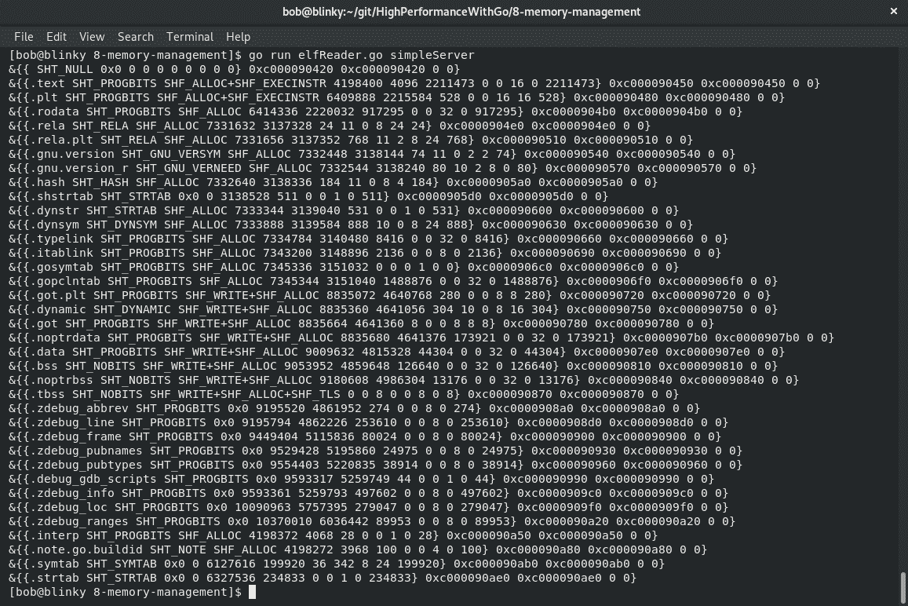
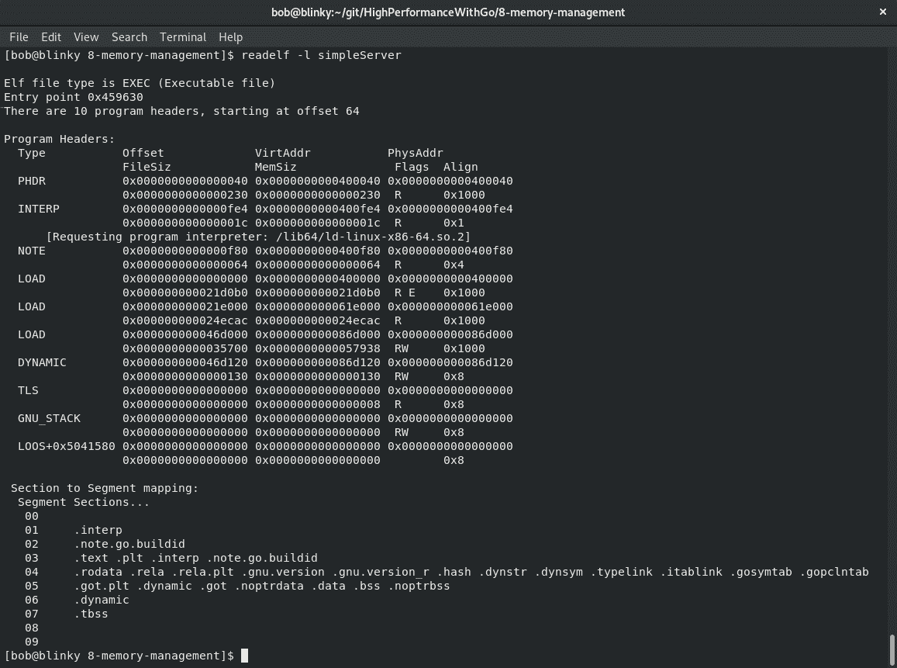
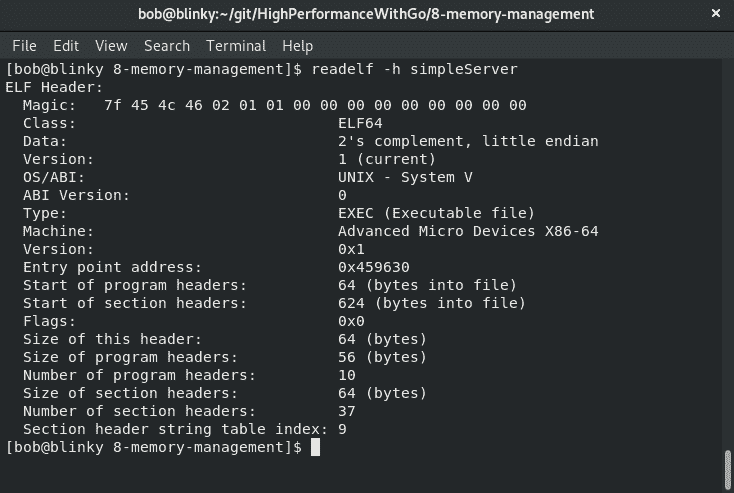
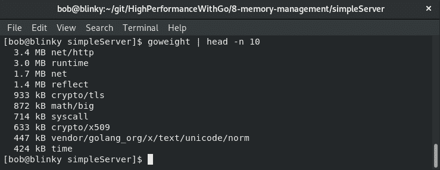
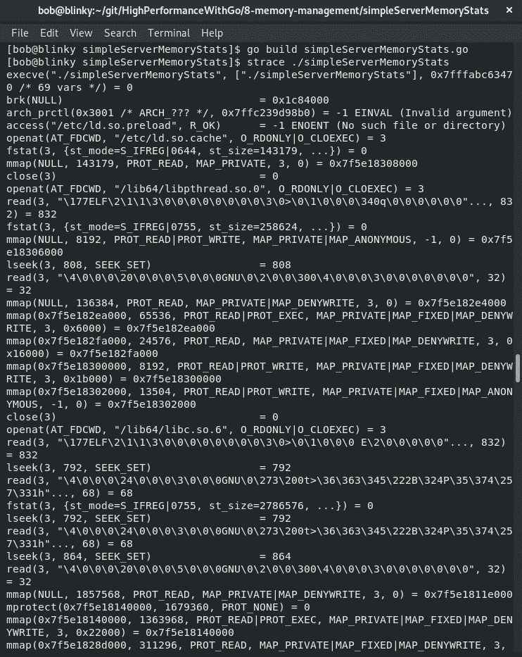
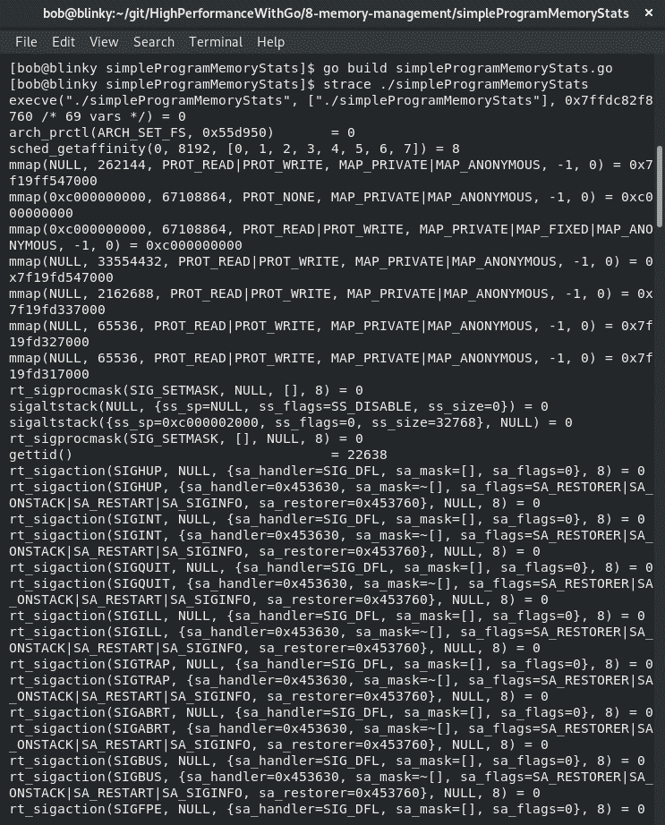

# 八、Go 中的内存管理

内存管理对系统性能至关重要。能够最大限度地利用计算机的内存占用，可以让您在内存中保留功能强大的程序，这样您就不必经常承受磁盘交换带来的巨大性能损失。能够有效地管理内存是编写高性能 Go 代码的核心原则。在本章中，我们将学习以下主题：

*   计算机存储器
*   如何分配内存
*   如何有效地利用记忆
*   对象在内存中的分配方式
*   内存有限的计算设备的策略

了解如何利用内存可以帮助您学会在程序中有效地利用内存。内存是计算机中存储和操作数据最快的地方之一，因此能够高效地管理它将对代码质量产生持久的影响。

# 了解现代计算机内存-入门

现代计算机有**随机存取存储器**（**RAM**），用于机器代码和数据存储。RAM 与 CPU 和硬盘一起使用，用于存储和检索信息。利用 CPU、RAM 和磁盘有性能权衡。在撰写本文时的现代计算机中，对于计算机中的一些常见操作，我们有以下通用的四舍五入计时：

| **数据存储类型** | **定时** |
| L1（处理器缓存）参考 | 1 纳秒 |
| L2（处理器缓存）引用 | 4 纳秒 |
| 主存参考 | 100 纳秒 |
| SSD 随机读取 | 16μs |
| 7200 RPM 硬盘寻道 | 2 毫秒 |

正如您从表中所注意到的，不同的存储类型对于现代计算机体系结构的不同部分具有极为不同的计时。新计算机具有 KBs 的一级缓存、MBs 的二级缓存、GBs 的主内存和 TBs 的 SSD/HDD。由于我们认识到这些不同类型的数据存储在成本和性能方面有很大差异，因此我们需要学习如何有效地使用它们中的每一种，以便编写性能良好的代码

# 分配内存

计算机的主存储器用于许多事情。**内存管理单元**（**MMU**是一个在物理和虚拟内存地址之间转换的计算机硬件。当 CPU 执行使用内存地址的指令时，MMU 获取该逻辑内存地址并将其转换为物理内存地址。这些是在称为页的物理内存地址分组中处理的。页面通常以 4KB 的段处理，使用一个称为页面表的表。MMU 还具有其他功能，包括使用缓冲区，例如**翻译查找缓冲区**（**TLB**）来保存最近访问的翻译。

虚拟内存很有用，因为它可以执行以下操作：

*   允许硬件设备内存映射到地址空间
*   允许特定内存区域的访问权限（rwx）
*   允许进程具有单独的内存映射
*   允许更轻松地移动内存
*   允许更轻松地将内存交换到磁盘
*   允许共享内存，其中物理 ram 同时映射到多个进程

在现代 Linux 操作系统中分配虚拟内存时，内核和用户空间进程都使用虚拟地址。这些虚拟地址通常分为两部分：虚拟地址空间中的内存的上部用于内核和内核进程，而内存的下部用于用户空间程序

操作系统利用这个内存。它在内存和磁盘之间移动进程，以优化计算机中可用资源的使用。计算机语言在其运行的底层操作系统中使用**虚拟内存空间**（**虚拟机**。Go也不例外。如果你用 C 语言编程，你就会知道 malloc 和 free 的习惯用法。在Go中，我们没有`malloc`功能。GO 也是一个垃圾收集语言，所以我们不必考虑释放内存分配。

我们在用户空间中有两种不同的主要内存度量：VSZ 和 RSS。

# 介绍 VSZ 和 RSS

**VSZ****虚拟内存大小**引用单个进程可以访问的所有内存，包括交换内存。这是在程序初始执行期间分配的内存大小。VSZ 以 KiB 报告。

**RSS****驻留集大小**表示特定进程在 RAM 中分配了多少内存，不包括交换内存。RSS 包括共享库内存，只要该内存当前可用。RSS 还包括堆栈和堆内存。RSS 内存可能大于系统中可用的总内存，因为这些内存引用通常是共享的。RSS 以千字节为单位报告。

当我们启动一个简单的 HTTP 服务器时，我们可以看到分配给各个进程的 VSZ 和 RSS，如下所示：

```go
package main
import (
    "io"
    "net/http"
)

func main() {
    Handler := func(w http.ResponseWriter, req *http.Request) {
       io.WriteString(w, "Memory Management Test")
    }
    http.HandleFunc("/", Handler)
    http.ListenAndServe(":1234", nil)
}
```

然后，我们可以查看在调用服务器时生成的进程 ID，如以下输出所示：


在这里，我们可以看到我们调用的`server.go`进程的 VSZ 和 RSS 值。

如果我们想减少 Go 二进制构建大小，我们可以使用`build`标志在不使用 libc 库的情况下构建二进制，如下所示：

```go
go build -ldflags '-libgcc=none' simpleServer.go
```

如果我们构建二进制文件而不包括 libc 库，那么示例服务器的内存占用就会小得多，如以下输出所示：


正如我们所看到的，我们的 VSZ 和 RSS 内存利用率都大大降低了。实际上，内存很便宜，我们可以将 libc 库保留在 Golang 二进制文件中。Libc 被用于许多标准库位，包括用户和组分辨率以及主机分辨率，这就是为什么它在构建时动态链接的原因。

在我们构建 Go 二进制文件之后，它们以容器格式存储。Linux 机器以一种称为**ELF**的格式（简称**可执行文件**和**可链接格式**）存储这种特定的二进制文件。Go 的标准库有一种读取 ELF 文件的方法。我们可以检查之前生成的`simpleServer`二进制文件：

```go
package main
import (
    "debug/elf"
    "fmt"
    "log"
    "os"
)
func main() {
    if len(os.Args) != 2 {
       fmt.Println("Usage: ./elfReader elf_file")
       os.Exit(1)
    }
    elfFile, err := elf.Open(os.Args[1])
    if err != nil {
       log.Fatal(err)
    }
    for _, section := range elfFile.Sections {
       fmt.Println(section)
    }
}
```

我们的`simpleServer`示例的结果输出如下：



我们还可以使用其他 Linux 工具来研究这些 ELF 二进制文件。`readelf`还将以更易于阅读的格式打印 ELF 文件。例如，我们可以按如下方式查看 ELF 文件：



ELF 文件具有特定的格式。该格式如下：

| **文件布局部分** | **说明** |
| 文件头 | **类字段**：将 32 位和 64 位地址分别定义为 52 或 64 字节长。**数据**：定义小端或大端。**版本**：存储 ELF 版本（目前只有一个版本，01）。**OS/ABI**：定义 OS 和应用程序二进制接口。**机器**：告诉您机器类型。**类型**：表示该文件的类型；常见的类型有 CORE、DYN（用于共享对象）、EXEC（用于可执行文件）和 REL（用于可重定位文件）。 |
| 程序头或程序段 | 包含有关如何创建进程或内存映像以在运行时执行的说明。然后内核使用这些映射到使用 mmap 的虚拟地址空间。 |
| 节标题或节 | `.text`：可执行代码（指令、静态常量、文字）`.data`：访问控制，初始化数据`.rodata`：只读数据`.bss`：读/写未初始化数据 |

我们还可以编译这个程序的 32 位版本来查看差异。如[第 1 章](01.html)、*Go*性能介绍中所述，我们可以为不同的架构构建 Go 二进制文件。我们可以使用以下构建参数为 i386 Linux 系统构建二进制文件：

`env GOOS=linux GOARCH=386 go build -o 386simpleServer simpleServer.go`

完成此构建后，我们可以检查生成的 ELF 文件，并确认生成的 ELF 与我们之前为 x86_64 计算机处理的 ELF 不同。为了简洁起见，我们将使用`-h`标志查看每个文件的标题：


正如您在结果输出中所看到的，这个特定的二进制文件是为 i386 处理器生成的，而不是最初生成的 x86_64 二进制文件：



了解系统、体系结构和内存限制有助于构建能够在主机上有效运行的 Go 程序。在本节中，我们将讨论内存利用率

# 了解内存利用率

一旦我们有了最初的二进制文件，我们就开始在 ELF 格式的基础上继续了解内存利用率。文本、数据和 BSS 字段是堆和堆栈放置的基础。堆从`.bss`和`.data`位的末尾开始，并不断增长以形成更大的内存地址。

堆栈是连续内存块的分配。此分配在函数调用堆栈中自动发生。调用函数时，其变量会在堆栈上分配内存。函数调用完成后，将释放变量的内存。堆栈具有固定大小，只能在编译时确定。从分配的角度来看，堆栈分配是便宜的，因为它只需要推送到堆栈并从堆栈中拉出来进行分配。

堆是一组可用于分配和取消分配的内存。内存按随机顺序分配，由程序员手动执行。它在时间上更昂贵，而且由于其非连续块，访问速度较慢。但是，可以调整堆中元素的大小。堆分配是昂贵的，因为 malloc 搜索足够的内存来保存新数据。当垃圾收集器稍后工作时，它会扫描堆中不再被引用的对象，并释放它们。这两个过程比堆栈分配/解除分配位要昂贵得多。因此，Go 更喜欢在堆栈上而不是堆上进行分配。

我们可以编译 gcflag 为`-m`的程序，以查看 Go 编译器如何使用转义分析（编译器确定在运行时对初始化的变量使用堆栈还是堆的过程）。

我们可以创建一个非常简单的程序，如下所示：

```go
package main

import "fmt"

func main() {
    greetingString := "Hello Gophers!"
    fmt.Println(greetingString) 
} 
```

然后，我们可以使用 escape analysis 标志编译程序，如下所示：


在我们得到的输出中，我们可以看到简单的`greetingString`被分配到堆中。如果我们需要这个标志的额外详细性，我们可以传递多个`m`值。在撰写本文时，最多传递 5 个`-m`标志会给我们带来不同程度的冗长。以下屏幕截图是一个带有 3 个`-m`标志的构建（为简洁起见）：


静态分配的 Go 变量往往位于堆栈上。指向内存或接口类型上方法的指针项往往是动态的，因此通常位于堆上。

如果我们想在执行构建时看到更多可用的优化，我们可以使用以下命令查看它们：`go tool compile -help`。

# Go 运行时内存分配

正如我们在[第 3 章](03.html)*理解并发*中所了解的，Go 运行时使用`G`结构表示单个 goroutine 的堆栈参数。`P`结构管理逻辑处理器的执行。用作 Go 运行时一部分的 malloc，在[中定义 https://golang.org/src/runtime/malloc.g](https://golang.org/src/runtime/malloc.go) [o](https://golang.org/src/runtime/malloc.go)做了很多工作。Go 使用 mmap 直接向底层操作系统请求内存。较小的分配大小（最大 32 kB 的内存分配）与较大的内存分配分开处理。

# 内存分配引物

让我们快速讨论与 Go 的小对象内存分配相关的两个对象。

我们可以在[中看到`mheap`和`mspan`结构 https://golang.org/src/runtime/mheap.go](https://golang.org/src/runtime/mheap.go) 。

`mheap`是主 malloc 堆。它跟踪全局数据以及许多其他堆细节。一些重要问题如下：

| **名称** | **说明** |
| 锁 | 互斥锁机制 |
| 自由的 | 未清除跨距的 mTreap（树和堆的混合数据结构） |
| scav | 自由跨度和扫掠跨度的平均值 |
| 斯威根 | 跟踪跨距扫描状态的整数 |
| 清扫 | 跟踪是否扫描所有跨距 |
| 清扫者 | 激活的`sweepone`呼叫数 |

`mspan`为主跨 malloc。它跟踪所有可用跨距。跨距是 8K 或更大的内存连续区域。它还保留了许多其他跨度细节。需要注意的一些重要问题如下：

| **名称** | **说明** |
| `next` | 列表中的下一个跨度；（无）如果没有人在场 |
| `previous` | 列表中以前的跨度；（零）如果没有 |
| `list` | 用于调试的范围列表 |
| `startAddr` | 跨距的第一个字节 |
| `npages` | 跨度中的页数 |

# 内存对象分配

内存对象有三种分类：

*   微小的：大小小于 16 字节的对象
*   小：大于 16 字节且小于或等于 32 kB 的对象
*   大：大于 32 kB 的对象

Go 内存中的一个小对象执行以下内存分配过程：

1.  如果`P`的 mcache 有空间，请使用该空间。
2.  获取 mcache 中现有的子对象，并将其四舍五入为 8、4 或 2 字节。
3.  如果对象适合分配的空间，请将其放入内存中。

Go 内存中的小对象遵循特定的内存分配模式：

1.  对象的大小被四舍五入并分类为[中生成的一个小大小类 https://golang.org/src/runtime/mksizeclasses.go](https://golang.org/src/runtime/mksizeclasses.go) 。在下面的输出中，我们可以看到在我的 x86_64 机器上定义的`_NumSizeClasses`和`class_to_size`变量分配。然后，该值用于在 P 的 mcache 中的 mspan 中查找空闲位图，如果有可用的内存插槽，则会相应地进行分配。以下屏幕截图说明了这一点：


2.  如果 P 的 mspan 中没有空闲点，则会从 mcentral 的 mspan 列表中获取一个新的 mspan，该列表中有足够的空间容纳新的内存对象。
3.  如果该列表为空，则执行来自 mheap 的页面运行，以便为 mspan 找到空间。
4.  如果失败、为空或没有足够大的页面可分配，则从操作系统分配一组新页面。这很昂贵，但至少需要 1MB 的数据块，这有助于降低与操作系统对话的成本。

从 mspan 中释放对象的过程类似：

1.  如果正在扫描 mspan 以响应分配，则 mspan 将返回到 mcache。
2.  如果 mspan 仍有分配给它的对象，则 mcentral free 列表将接收此 mspan 以进行释放
3.  如果 mspan 空闲（没有分配的对象），它将返回到 mheap。
4.  一旦 mspan 在给定的时间间隔内空闲，这些页面将返回到底层操作系统。

大型对象不使用 mcache 或 mcentral；他们只是直接使用 mheap。

我们可以使用先前创建的 HTTP 服务器来查看一些内存统计数据。使用运行时包，我们可以得出程序从操作系统检索到的内存量，以及 Go 程序的堆分配。让我们一步一步来看看这是如何发生的：

1.  首先，我们初始化包，执行导入，并设置第一个处理程序：

```go
package main
import (
    "fmt"
    "io"
    "net/http"
    "runtime"
)

func main() {
    Handler := func(w http.ResponseWriter, req *http.Request) {
       io.WriteString(w, "Memory Management Test")
    }
```

2.  然后，我们编写一个匿名函数来捕获运行统计信息：

```go
  go func() {
       for {
           var r runtime.MemStats
           runtime.ReadMemStats(&r)
           fmt.Println("\nTime: ", time.Now())
           fmt.Println("Runtime MemStats Sys: ", r.Sys)
           fmt.Println("Runtime Heap Allocation: ", r.HeapAlloc)
           fmt.Println("Runtime Heap Idle: ", r.HeapIdle)
           fmt.Println("Runtime Head In Use: ", r.HeapInuse)
           fmt.Println("Runtime Heap HeapObjects: ", r.HeapObjects)
           fmt.Println("Runtime Heap Released: ", r.HeapReleased)
           time.Sleep(5 * time.Second)
       }
    }()
    http.HandleFunc("/", Handler)
    http.ListenAndServe(":1234", nil)
}
```

3.  执行此程序后，我们可以看到服务的内存分配。以下结果中的第一个打印输出显示了内存的初始分配：


第二次打印输出是在发出`http://localhost:1234/`请求之后。您可以看到，系统和堆的分配大致保持不变，空闲堆和使用中的堆都会随着 web 请求的使用而改变。

Go 的内存分配器最初是从 TCMalloc 派生的，TCMalloc 是一个线程缓存 malloc。有关 TCMalloc 的更多信息，请访问[http://goog-perftools.sourceforge.net/doc/tcmalloc.html](http://goog-perftools.sourceforge.net/doc/tcmalloc.html) 。

Go 分配器，即 Go 内存分配器，使用线程本地缓存和 8K 或更大的内存连续区域。这 8 K 区域也称为跨度，通常用于以下三种承载力之一：

*   空闲：可重复用于堆/堆栈或返回操作系统的范围
*   正在使用：当前正在 Go 运行时中使用的范围
*   堆栈：用于 goroutine 堆栈的跨距

如果我们创建了一个没有共享库的程序，那么我们的程序应该会占用更少的内存：

1.  首先，我们初始化包并导入所需的库：

```go
package main
import (
    "fmt"
    "runtime"
    "time"
)
```

2.  然后，我们执行与之前简单 http 服务器相同的操作，但我们只使用`fmt`包打印字符串。然后我们睡眠，以便能够看到内存利用率输出：

```go
func main() {
    go func() {
       for {
           var r runtime.MemStats
           runtime.ReadMemStats(&r)
           fmt.Println("\nTime: ", time.Now())
           fmt.Println("Runtime MemStats Sys: ", r.Sys)
           fmt.Println("Runtime Heap Allocation: ", r.HeapAlloc)
           fmt.Println("Runtime Heap Idle: ", r.HeapIdle)
           fmt.Println("Runtime Heap In Use: ", r.HeapInuse)
           fmt.Println("Runtime Heap HeapObjects: ", r.HeapObjects)
           fmt.Println("Runtime Heap Released: ", r.HeapReleased)
           time.Sleep(5 * time.Second)
       }
    }()
    fmt.Println("Hello Gophers")
    time.Sleep(11 * time.Second)
}
```

3.  从该程序执行的输出可以看出，该可执行文件的堆分配比简单的 HTTP 服务器小得多：


但为什么会这样呢？我们可以使用 goweight 库[[https://github.com/jondot/goweight](https://github.com/jondot/goweight) 查看我们程序中依赖项的大小。我们只需要下载这个二进制文件：`go get github.com/jondot/goweight`。

4.  然后，我们可以确定 Go 计划中的大型依赖项：



我们可以看到`net/http`库占用了大量空间，运行时和网络库也占用了大量空间。

相比之下，让我们看一下我们的简单程序，其中包含内存统计信息：


我们可以看到，没有运行时的下一个最大段比`net/http`和`net`库小得多。为了制作更高效的二进制文件，准确地知道我们的资源在哪里被利用总是很重要的。

如果我们使用 strace 查看操作系统级别的调用，接下来我们可以看到与简单 web 服务器和简单程序的交互之间的区别。我们的简单 web 服务器示例如下：



我们的简单程序示例如下所示：



从输出中，我们可以注意到以下几点：

*   我们的`simpleWebServer`的输出比我们的`simpleProgram`长得多（这在截图中被截断了，但如果生成，我们可以看到响应长度更长）。
*   `simpleWebServer`加载了更多的 C 库（我们可以在截图中的 strace 捕获中看到`ld.so.preload`、`libpthread.so.0`和`libc.so.6`。
*   `simpleWebServer`中的内存分配比`simpleProgram`输出中的内存分配多得多。

我们可以看看这些是从哪里来的。`net/http`库没有任何 C 引用，但其父库网络有。在 net 库中的所有 cgo 包中，我们都有文档说明如何跳过对包使用底层 cgo 解析器：[https://golang.org/pkg/net/#pkg-概述](https://golang.org/pkg/net/#pkg-overview)。

本文档向我们展示了如何使用 Go 和 cgo 解析器：

```go
export GODEBUG=netdns=go    # force pure Go resolver
export GODEBUG=netdns=cgo   # force cgo resolver
```

让我们通过执行以下命令，在示例 web 服务器中仅启用 Go 解析器：

```go
export CGO_ENABLED=0
go build -tags netgo
```

在下面的屏幕截图中，我们可以看到在没有 C 解析器的情况下为我们的`simpleServer`执行的流程：


我们可以看到我们的 VSZ 和 RSS 都很低。通过键入以下命令，将其与使用 C 解析器进行比较：

```go
 export CGO_ENABLED=1
 go build -tags cgo
```

我们可以使用以下 C 解析器查看我们的`simpleServer`输出：


在未使用 cgo 解析器编译的服务器中，我们的 VSZ 要低得多。接下来，我们将讨论内存有限的情况以及如何解释和构建它们。

# 关于记忆有限情况的简报

如果您在嵌入式设备或内存非常有限的设备上运行 Go，那么有时了解运行时中的一些底层进程以做出有关进程的明智决策是明智的。Go 垃圾收集器*优先考虑低延迟和简单性*。它使用非代并发三色标记和扫描垃圾收集器。默认情况下，它自动管理内存分配。

Go 在调试标准库中有一个函数，它将强制执行垃圾收集并将内存返回操作系统。Go 垃圾收集器在 5 分钟后将未使用的内存返回操作系统。如果您在低内存设备上运行，可以在此处找到此功能`FreeOSMemory()`：[https://golang.org/pkg/runtime/debug/#FreeOSMemory](https://golang.org/pkg/runtime/debug/#FreeOSMemory) 。

我们也可以使用`GC()`函数，可以在这里找到：[https://golang.org/pkg/runtime/#GC](https://golang.org/pkg/runtime/#GC) 。

`GC()`功能也可能阻塞整个程序。使用这两种功能的风险自负，因为它们可能导致意外后果。

# 总结

在本章中，我们学习了 Go 如何分配堆和堆栈。我们还学习了如何有效地监控 VSZ 和 RSS 内存，以及如何优化代码以更好地利用可用内存。能够做到这一点使我们能够有效地利用现有资源进行扩展，用同样数量的硬件服务更多的并发请求。

在下一章中，我们将讨论 Go 中的 GPU 处理。