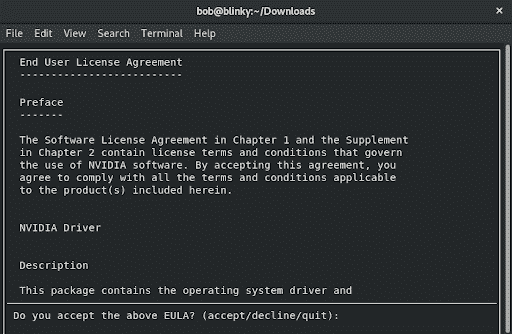
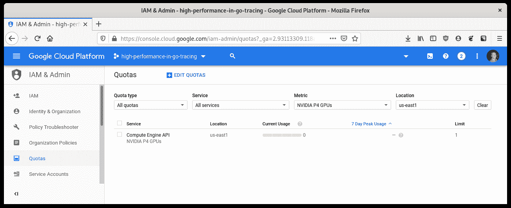
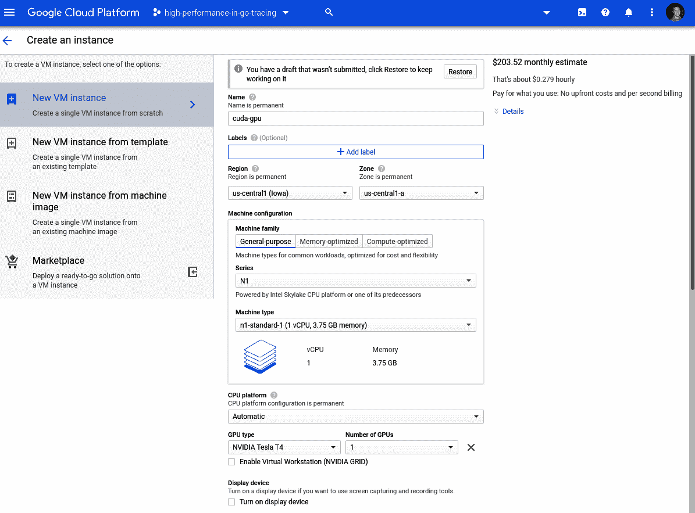
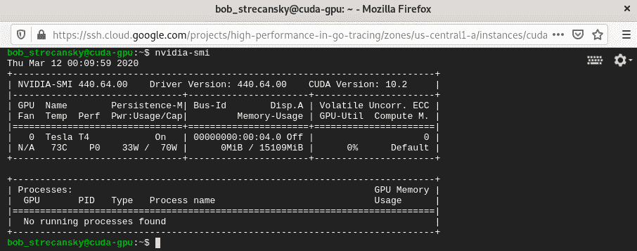
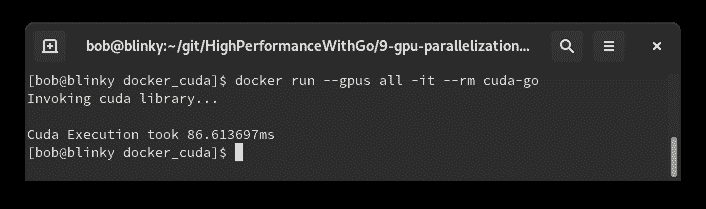

# 九、Go 中的 GPU 并行化

GPU 加速编程在当今的高性能计算堆栈中变得越来越重要。常用于**人工智能**（**AI**）和**机器学习**（**ML**等领域。GPU 通常用于这些任务，因为它们往往非常适合并行计算

在本章中，我们将学习 Cgo、GPU 加速编程、**CUDA**（简称**Compute Unified Device Architecture**）、生成命令、Go 程序的 C 风格链接，以及在 Docker 容器中执行启用 GPU 的流程。学习所有这些知识将有助于我们使用 GPU 来支持 CUDA 项目。这样做将有助于我们确定如何有效地使用 GPU 来帮助解决使用 Go 的计算问题：

*   Cgo–在 Go 中编写 C
*   GPU 加速计算——利用硬件
*   GCP 上的 CUDA
*   CUDA–为程序供电

# Cgo–在 Go 中编写 C

Cgo 是一个内置于标准 Go 库中的库，它允许用户在 Go 代码中调用底层 C 程序。Cgo 经常被用作当前用 C 编写但没有编写等效 Go 代码的事物的委托器。

Cgo 应该节约使用，并且只有在系统没有等效的 Go 库可用时才使用。Cgo 为您的 Go 程序增加了一些限制：

*   不必要的复杂性
*   故障排除困难
*   增加了构建和编译 C 代码的复杂性
*   去的许多工具无法在 Cgo 程序中使用
*   交叉编译没有按预期工作，或者根本没有工作
*   C 代码的复杂性
*   本机去调用比 Cgo 调用
*   慢很多构建时间

如果您能够（或必须）接受所有这些规定，Cgo 可能是您所从事项目的必要资源。

在一些情况下，使用 Cgo 是合适的。以下是几个主要示例：

*   当您必须使用专有的**软件开发工具包**（**SDK**或专有库时。
*   当您有一个 C 语言的遗留软件时，由于业务逻辑验证，很难移植。
*   您已经耗尽了 Go 运行时，需要进一步优化。我们很少接触到这种特殊情况。

更优秀的 cgo 文档可以在以下 URL 中找到：

*   [https://golang.org/cmd/cgo/](https://golang.org/cmd/cgo/) 
*   [https://blog.golang.org/c-go-cgo](https://blog.golang.org/c-go-cgo)

在下一节中，我们将看一个简单的 cgo 示例，以便熟悉 cgo 的工作原理，以及它的一些亮点和缺点。

# 一个简单的 Cgo 示例

让我们来看一个相对简单的 CGO 示例。在本例中，我们将编写一个简单的函数，从 C 绑定打印“Hello Gophers”，然后从 Go 程序调用该 C 代码。在这个函数中，我们返回一个常量字符串。然后，我们在 Go 程序中调用`hello_gophers`C 函数。我们还使用`C.GoString`函数转换 C 字符串类型和 Go 字符串类型：

```go
package main

/*

 #include <stdio.h>
 const char* hello_gophers() {
    return "Hello Gophers!";
 }
*/

import "C"
import "fmt"
func main() {
    fmt.Println(C.GoString(C.hello_gophers()))
}
```

执行此程序后，我们可以看到一个简单的`Hello Gophers!`输出：


这个例子虽然简单，但向我们展示了如何在 Go 程序中绑定 C 函数。为了进一步强调执行时间的差异，我们可以查看 Cgo 函数和 Go 函数的基准：

```go
package benchmark

/*
 #include <stdio.h>
 const char* hello_gophers() {
     return "Hello Gophers!";
 }
*/

import "C"
import "fmt"

func CgoPrint(n int) {
    for i := 0; i < n; i++ {
       fmt.Sprintf(C.GoString(C.hello_gophers()))
    }
}

func GoPrint(n int) {
    for i := 0; i < n; i++ {
       fmt.Sprintf("Hello Gophers!")
    }
}
```

然后，我们可以使用这些函数对我们的绑定 C 函数进行基准测试，与普通的`GoPrint`函数进行比较：

```go
package benchmark

import "testing"

func BenchmarkCPrint(b *testing.B) {
    CgoPrint(b.N)
}

func BenchmarkGoPrint(b *testing.B) {
    GoPrint(b.N)
}
```

执行此操作后，我们可以看到以下输出：


请注意，绑定 Cgo 函数比本机 Go 函数花费的时间长约一个数量级。这在某些情况下是可以的。这个基准测试只是进一步验证了这样一个事实：我们应该只在有意义的时候才使用 Cgo 绑定。重要的是要记住，在某些特定的时候，我们可以证明使用 Cgo 是合理的，例如当我们必须执行本机不可用的操作时。

在下一节中，我们将学习 GPU 加速编程和 NVIDIA 的 CUDA 平台。

# GPU 加速计算——利用硬件

在今天的现代计算机中，我们有几个硬件来完成系统的大部分工作。CPU 执行计算机其他部分的大部分指令操作，并提供这些操作的结果。内存是用于数据存储和操作的快速、短期位置。硬盘用于长期数据存储和操作，网络设备用于通过网络在计算设备之间发送这些数据位。现代计算系统中经常使用的设备是离散 GPU。无论是显示高保真图形的最新电脑游戏、解码 4K 视频，还是执行金融数字运算，GPU 都正在成为高速计算的更受欢迎的选择

GPU 是为高效执行特定任务而设计的。随着高通量计算的广泛应用，将 GPU 用作**通用图形处理单元**（**GPGPU**）变得越来越普遍

有许多不同的 API 可用于 GPU 编程，以最大限度地使用 GPU，包括：

*   OpenCL:[https://www.khronos.org/opencl/](https://www.khronos.org/opencl/)
*   OpenMP:[https://www.openmp.org/](https://www.openmp.org/)
*   英伟达的 CUDA 平台：[https://developer.nvidia.com/cuda-zone](https://developer.nvidia.com/cuda-zone)

NVIDIA 的 CUDA 库成熟、性能优异，并被广泛接受。我们将在本章的示例中使用 CUDA 库。让我们进一步讨论 CUDA 平台。

英伟达的 CUDA 平台是 NVIDIA 团队编写的 API，用于增加 CUDA 启用的图形卡的并行性和提高速度。使用 GPGPU 在数据结构上执行并行算法可以大大缩短计算时间。许多当前的 ML 和 AI 工具集在后台使用 CUDA，包括但不限于以下内容：

*   TensorFlow:[https://www.tensorflow.org/install/gpu](https://www.tensorflow.org/install/gpu)
*   努巴：[https://devblogs.nvidia.com/gpu-accelerated-graph-analytics-python-numba/](https://devblogs.nvidia.com/gpu-accelerated-graph-analytics-python-numba/)
*   Pytork:[https://pytorch.org/](https://pytorch.org/)

CUDA 提供了一个 API，用于访问 C++中的这些处理习惯用法。它使用内核的概念，内核是从在 GPU 设备上执行的 C++代码调用的函数。内核是并行执行的代码的一部分。CUDA 使用 C++语法规则来处理指令。

在云中有许多地方可以使用 GPU 执行计算作业，例如：

*   谷歌云 GPU:[https://cloud.google.com/gpu/](https://cloud.google.com/gpu/)
*   带有 GPU 的 AWS EC2 实例：[https://aws.amazon.com/nvidia/](https://aws.amazon.com/nvidia/)
*   纸质空间：[https://www.paperspace.com/](https://www.paperspace.com/)
*   FloydHub:[https://www.floydhub.com/](https://www.floydhub.com/)

您还可以在本地工作站上运行 CUDA 程序。这样做的要求如下：

*   具有 CUDA 功能的 GPU（我在示例中使用了 NVIDIA GTX670）
*   具有 GCC 编译器和工具链的**操作系统**（**操作系统**）（我在示例中使用了 Fedora 29）

在下一节中，我们将介绍如何为 CUDA 处理设置工作站：

1.  首先，我们必须为主机安装适当的内核开发工具和内核头。我们可以在示例 Fedora 主机上执行以下操作：

```go
sudo dnf install kernel-devel-$(uname -r) kernel-headers-$(uname -r)
```

2.  我们还需要安装`gcc`和适当的构建工具。我们可以通过以下方式实现：

```go
sudo dnf groupinstall "Development Tools"
```

3.  在安装了先决条件之后，我们可以检索 NVIDIA 为 CUDA 提供的本地`.run`文件安装程序。在撰写本文时，`cuda_10.2.89_440.33.01_linux.run`软件包是最新的。您可以从[下载最新的 CUDA 工具包包 https://developer.nvidia.com/cuda-downloads](https://developer.nvidia.com/cuda-downloads) ：

```go
wget http://developer.download.nvidia.com/compute/cuda/10.2/Prod/local_installers/cuda_10.2.89_440.33.01_linux.run
```

4.  然后，我们可以使用以下代码安装此软件包：

```go
sudo ./cuda_10.2.89_440.33.01_linux.run
```

这将为我们提供安装提示，如以下屏幕截图所示：



5.  在我们接受 EULA 后，我们可以选择需要安装的依赖项并选择`Install`：


接受安装提示后，CUDA 安装程序应成功完成安装。如果在安装过程中出现任何错误，查看以下位置可能有助于整理安装：

*   `/var/log/cuda-installer.log`
*   `/var/log/nvidia-installer.log`

在下一节中，我们将讨论如何将主机用于 CUDA 进程。

# CUDA–利用主机进程

成功安装 CUDA 后，需要设置一些环境变量，以便将安装的位添加到执行路径中。如果您无法访问主机上的 Docker，或者您更愿意使用裸机执行 GPU 密集型操作，则此功能可以正常工作。如果您想使用更具可复制性的构建，可以使用以下*Docker for GPU enabled programming*部分中定义的 Docker 配置。

我们需要更新我们的`PATH`以包含我们刚刚安装的 CUDA 二进制路径。我们可以通过执行以下命令来实现：`export PATH=$PATH:/usr/local/cuda-10.2/bin:/usr/local/cuda-10.2/NsightCompute-2019.1`。

我们还需要更新我们的`LD_LIBRARY_PATH`变量，这是您的操作系统在链接动态库和共享库时寻找的环境变量。我们可以通过执行`export LD_LIBRARY_PATH=:/usr/local/cuda-10.2/lib64`来添加 CUDA 库。

这会将 CUDA 库添加到库路径中。在本章的结束部分，我们将使用 GNU Makefile 以编程方式将这些内容添加到我们的路径中。在下一节中，我们将讨论如何与 Docker 一起使用 CUDA。

# 支持 GPU 编程的 Docker

如果您想在本章中使用 Docker 进行支持 GPU 的编程，您可以执行以下步骤，但要使用此步骤，您的计算机中必须具有兼容的 NVIDIA CUDA GPU。您可以在[找到启用卡的完整列表 https://developer.nvidia.com/cuda-gpus](https://developer.nvidia.com/cuda-gpus) 。

在 GPU 加速计算的生产环境中，我们可能不会以这种方式使用 Docker，因为您很可能希望尽可能靠近硬件进行 GPU 加速编程，但我选择在本章中使用这种方法，是为了让本书的消费者能够使用一个可复制的构建。大多数情况下，对于使用集装箱化方法的轻微性能损失来说，一个可复制的构建是一种可接受的权衡。

如果您不确定支持 NVIDIA 的 GPU 支持什么，可以使用`cuda-z`实用程序查找有关图形卡的更多信息。该程序的可执行文件位于[http://cuda-z.sourceforge.net/](http://cuda-z.sourceforge.net/) 。

下载特定操作系统的版本后，您应该能够执行如下文件：

```go
./CUDA-Z-0.10.251-64bit.run
```

您将看到一个输出，它为您提供有关当前使用的卡的各种信息：


一旦您确定您的卡支持所需的 GPU 处理，我们可以使用 Docker 连接到您的 GPU 进行处理。为此，我们将执行以下步骤：

1.  启用计算机的 NVIDIA 容器工具包。对于我的 Fedora 测试系统，我不得不对其进行一个小小的调整，将我的发行版更改为``centos7``——已安装的 RPM 仍按预期工作：

```go
distribution=$(. /etc/os-release;echo $ID$VERSION_ID)
curl -s -L https://nvidia.github.io/nvidia-docker/$distribution/nvidia-docker.repo | sudo tee /etc/yum.repos.d/nvidia-docker.repo
```

有关在其他操作系统上安装此软件的完整说明，请参见[https://github.com/NVIDIA/nvidia-docker#quickstart](https://github.com/NVIDIA/nvidia-docker#quickstart%7C) 。

2.  安装`nvidia-container-toolkit`：

```go
sudo yum install -y nvidia-container-toolkit
```

3.  重新启动 Docker 以获取这些新更改：

```go
sudo systemctl restart docker
```

4.  禁用 SELINUX，以便您的计算机能够使用 GPU 处理以下请求：

```go
setenforce 0 #as root
```

5.  执行测试`docker run`以确保您能够在 Docker 内执行 GPU 操作，并检查有关特定 NVIDIA 卡的信息：

```go
docker run --gpus all tensorflow/tensorflow:latest-gpu nvidia-smi
```

在下一节中，我们将介绍如何在 Google 云平台中设置支持 CUDA GPU 的机器。

# GCP 上的 CUDA

如果您没有必要的硬件，或者希望在云中为支持 GPU 的代码运行工作负载，您可以决定在共享托管环境中使用 CUDA。在下面的示例中，我们将向您展示如何在 GCP 上使用 GPU 进行设置。

还有许多其他托管 GPU 提供商（您可以在本章的*GPU 加速计算–利用硬件*部分中看到所有这些提供商）-我们将使用 GCP 的 GPU 实例作为示例。

您可以在[了解更多关于 GCP GPU 产品的信息 https://cloud.google.com/gpu](https://cloud.google.com/gpu) 。

# 使用 GPU 创建虚拟机

我们需要创建一个 Google 计算引擎实例，以便能够在 GCP 上使用 GPU。

您可能需要增加您的 GPU 配额。为此，您可以按照以下 URL 中的步骤进行操作：
https://cloud.google.com/compute/quotas#requesting_additional_quota

在编写时，NVIDIA P4GPU 是平台上最便宜的，并且有足够的力量来演示我们的工作。您可以通过检查 IAM 管理配额页面上的 NVIDIA P4GPU 度量来验证您的配额：



为此，我们可以访问 Google 云控制台上的 VM 实例页面。下面是本页的屏幕截图。单击屏幕中央的“创建”按钮：


接下来我们将创建一个带有 GPU 的 Ubuntu18.04 虚拟机。本例的 VM 实例配置如以下屏幕截图所示：



我们在这里使用 Ubuntu18.04 作为例子，而不是 Fedora29，来展示如何为多种架构设置 CUDA。

我们的操作系统和其他配置参数显示在以下屏幕截图中：


单击 Create 按钮后，我们将返回到 VM 实例页面。等待 VM 完全配置（它的名称左侧将有一个绿色复选标记）：


接下来，我们可以使用 SSH 连接到该实例，如以下屏幕截图所示：


在下一小节中，我们将安装运行支持 GPU 的 CGo 程序所需的所有依赖项。为了您的方便，我还在解释的末尾提供了执行所有这些操作的脚本。

# 安装 CUDA 驱动程序

按照[中的说明进行操作 https://cloud.google.com/compute/docs/gpus/install-drivers-gpu ALE T1：获得 NVIDIA CUDA 驱动程序安装：](https://cloud.google.com/compute/docs/gpus/install-drivers-gpu)

1.  检索 CUDA 存储库：

```go
curl -O http://developer.download.nvidia.com/compute/cuda/repos/ubuntu1804/x86_64/cuda-repo-ubuntu1804_10.0.130-1_amd64.deb
```

2.  安装`.deb`包：

```go
sudo dpkg -i cuda-repo-ubuntu1804_10.0.130-1_amd64.deb
```

3.  添加英伟达 GPG 密钥到 APT 源密钥环：

```go
sudo apt-key adv --fetch-keys http://developer.download.nvidia.com/compute/cuda/repos/ubuntu1804/x86_64/7fa2af80.pub
```

4.  安装英伟达 CUDA 驱动程序：

```go
sudo apt-get update && sudo apt-get install cuda
```

5.  我们现在在 GCP 虚拟机上有一个支持 CUDA 的 GPU。我们可以通过`nvidia-smi`命令验证这一点：

```go
nvidia-smi
```

6.  我们将在屏幕截图中看到以下输出：



# 在 GCP 上安装 Docker CE

我们接下来需要在支持 CUDA 的 GCE 虚拟机上安装 Docker CE。要在我们的虚拟机上安装 Docker CE，我们可以按照此页面上的说明进行操作：

[https://docs.docker.com/install/linux/docker-ce/ubuntu/](https://docs.docker.com/install/linux/docker-ce/ubuntu/)

在撰写本书时，以下步骤是必要的：

1.  验证主机上没有任何其他 docker 版本：

```go
sudo apt-get remove docker docker-engine docker.io containerd runc
```

2.  确保我们的存储库是最新的：

```go
sudo apt-get update
```

3.  安装 docker CE 所需的依赖项：

```go
sudo apt-get install apt-transport-https ca-certificates curl gnupg-agent software-properties-common
```

4.  添加 docker CE 存储库：

```go
curl -fsSL https://download.docker.com/linux/ubuntu/gpg | sudo apt-key add -
sudo add-apt-repository "deb [arch=amd64] https://download.docker.com/linux/ubuntu $(lsb_release -cs) stable"
```

5.  运行更新以确保 docker CE 存储库是最新的：

```go
sudo apt-get update
```

6.  安装必要的 docker 依赖项：

```go
sudo apt-get install docker-ce docker-ce-cli containerd.io
```

我们现在在主机上有一个 Docker CE 的工作实例。

# 在 GCP 上安装 NVIDIA Docker

要在我们的 VM 上安装英伟达坞驱动程序，我们可以遵循本页的说明：

[https://github.com/NVIDIA/nvidia-docker#ubuntu-16041804 debian jessiestretchbuster](https://github.com/NVIDIA/nvidia-docker#ubuntu-16041804-debian-jessiestretchbuster)

1.  设置分布变量：

```go
distribution=$(. /etc/os-release;echo $ID$VERSION_ID)
```

2.  添加`nvidia-docker`回购 gpg 密钥和 apt 存储库：

```go
curl -s -L https://nvidia.github.io/nvidia-docker/gpgkey | sudo apt-key add -
curl -s -L https://nvidia.github.io/nvidia-docker/$distribution/nvidia-docker.list | sudo tee /etc/apt/sources.list.d/nvidia-docker.list
```

3.  安装 nvidia 容器工具包：

```go
sudo apt-get update && sudo apt-get install -y nvidia-container-toolkit
```

4.  重新启动 VM 以使此驱动程序生效。

# 一起编写脚本

下面的 bash 脚本将同时执行前面的所有操作。首先，我们安装 CUDA 驱动程序：

```go
#!/bin/bash

# Install the CUDA driver
curl -O http://developer.download.nvidia.com/compute/cuda/repos/ubuntu1804/x86_64/cuda-repo-ubuntu1804_10.0.130-1_amd64.deb
dpkg -i cuda-repo-ubuntu1804_10.0.130-1_amd64.deb
apt-key adv --fetch-keys http://developer.download.nvidia.com/compute/cuda/repos/ubuntu1804/x86_64/7fa2af80.pub
apt-get -y update && sudo apt-get -y install cuda
```

然后安装 Docker CE：

```go
# Install Docker CE
apt-get remove docker docker-engine docker.io containerd runc
apt-get update
apt-get -y install apt-transport-https ca-certificates curl gnupg-agent software-properties-common
curl -fsSL https://download.docker.com/linux/ubuntu/gpg | sudo apt-key add -
add-apt-repository "deb [arch=amd64] https://download.docker.com/linux/ubuntu $(lsb_release -cs) stable"
apt-get -y update
apt-get -y install docker-ce docker-ce-cli containerd.io
```

最后我们安装`nvidia-docker`驱动程序：

```go
# Install nvidia-docker
distribution=$(. /etc/os-release;echo $ID$VERSION_ID)
curl -s -L https://nvidia.github.io/nvidia-docker/gpgkey | sudo apt-key add -
curl -s -L https://nvidia.github.io/nvidia-docker/$distribution/nvidia-docker.list | sudo tee /etc/apt/sources.list.d/nvidia-docker.list
apt-get -y update && sudo apt-get -y install nvidia-container-toolkit
usermod -aG docker $USER
systemctl restart docker
```

这包括在[的回购协议中 https://git/HighPerformanceWithGo/9-gpu-parallelization-in-go/gcp_scripts](https://github.com/bobstrecansky/HighPerformanceWithGo/blob/master/9-gpu-parallelization-in-go/gcp_scripts/nvidia-cuda-gcp-setup.sh) 并可通过运行执行：

```go
sudo bash nvidia-cuda-gcp-setup.sh
```

在目录中。在下一节中，我们将介绍一个使用 Cgo 执行的示例 CUDA 程序。

# CUDA–为程序供电

在我们安装和运行了所有的 CUDA 依赖项之后，我们可以从一个简单的 CUDA C++程序开始：

1.  首先，我们将包含所有必要的头文件，并定义要处理的元素数。`1 << 20`是 1048576，这是足够的元素来显示足够的 GPU 测试。如果希望看到处理时间的差异，可以更改此选项：

```go
#include <cstdlib>
#include <iostream>

const int ELEMENTS = 1 << 20;
```

我们的`multiply`函数被包装在`__global__`说明符中。这允许 MULT2 T2，即 CUDA 特定的 C++编译器，在 GPU 上运行特定的函数。这个乘法函数相对简单：它使用`a`和`b`数组，使用一些 CUDA 魔法将它们相乘，并返回`c`数组中的值：

```go
__global__ void multiply(int j, float * a, float * b, float * c) {

  int index = threadIdx.x * blockDim.x + threadIdx.x;
  int stride = blockDim.x * gridDim.x; 

  for (int i = index; i < j; i += stride)
    c[i] = a[i] * b[i];
}
```

此 CUDA magic 引用了 GPU 的并行处理功能。变量定义如下：

然后，我们需要添加一个`extern "C"`调用，为这个特定函数提供一个 C 风格的链接，这样我们就可以从我们的 Go 代码中有效地调用这个函数。此`cuda_multiply`函数创建三个数组：

```go
extern "C" {

  int cuda_multiply(void) {
    float * a, * b, * c;
    cudaMallocManaged( & a, ELEMENTS * sizeof(float));
    cudaMallocManaged( & b, ELEMENTS * sizeof(float));
    cudaMallocManaged( & c, ELEMENTS * sizeof(float));
```

2.  然后，我们创建随机浮点数组：

```go
    for (int i = 0; i < ELEMENTS; i++) {
      a[i] = rand() % 10;
      b[i] = rand() % 10;
    }
```

然后，我们根据块大小执行乘法函数（我们在文件开头定义了乘法函数）。我们根据数字计算要使用的块数：

```go
    int blockSize = 256;
    int numBlocks = (ELEMENTS + blockSize - 1) / blockSize;
    multiply << < numBlocks, blockSize >>> (ELEMENTS, a, b, c);
```

乘法完成后，我们将等待 GPU 完成，然后再访问主机上的信息：`cudaDeviceSynchronize();`。

3.  然后，我们可以将执行的乘法的值打印到屏幕上，以便让最终用户看到我们正在执行的计算。这在代码中被注释掉了，因为打印到`stdout`并不能显示此特定代码的良好性能。如果希望看到正在进行的计算，可以取消注释：

```go
    //for (int k = 0; k < ELEMENTS; k++) {
      //std::cout << k << ":" << a[k] << "*" << b[k] << "=" << c[k] << "\n";
    //}
```

4.  然后，我们通过在每个数组指针上调用`cudaFree`，然后返回`0`来完成我们的程序，从而用`cudaMallocManaged()`释放分配给乘法函数的 GPU 内存：

```go
    cudaFree(a);
    cudaFree(b);
    cudaFree(c);
    return 0;
  }
}
```

5.  然后，我们将添加头文件`cuda_multiply.h`：

```go
int cuda_multiply(void);
```

本章中我们的 Go 程序只是一个`cuda_multiply.cu`函数的包装器，我们用一点语法糖创建了这个函数。

6.  我们实例化`main`并导入必要的包：

```go
package main

import (
    "fmt"
    "time"
)
```

7.  然后，我们添加必要的`CFLAGS`和`LDFLAGS`，以引用我们使用 nvcc make 创建的库以及系统库。这里需要注意的是，这些注释在 cgo 代码中被称为*序言*，在编译我们包的 C 部分时用作头。我们可以在这里包含任何必要的 C 代码，以使代码的 Go 部分更受欢迎。如果您计划使用以下任何一种样式的标志，则必须使用`#cgo`指令抢占它们，以调整底层编译器的行为：
    8.  然后我们导入伪包`C`，它允许我们执行我们编写的 C（回忆一下我们在`cuda_multiply.cu`文件中的`extern C`调用）。我们还为此函数添加了一个计时包装器，以查看执行此函数所需的时间：

    ```go
    //#cgo CFLAGS: -I.
    //#cgo LDFLAGS: -L. -lmultiply
    //#cgo LDFLAGS: -lcudart
    //#include <cuda_multiply.h>

    import "C"
    func main() {
        fmt.Printf("Invoking cuda library...\n")
        start := time.Now()
        C.cuda_multiply()
        elapsed := time.Since(start)
        fmt.Println("\nCuda Execution took", elapsed)
    }
    ```

    9.  我们将为下一步构建的 Docker 容器提供一个 Makefile。我们的 Makefile 定义了构建 nvcc 库、运行 Go 代码和清理 nvcc 库的方法：

    ```go
    //target:
        nvcc -o libmultiply.so --shared -Xcompiler -fPIC cuda_multiply.cu
    //go:
        go run cuda_multiply.go
    ```

    ```go

    //clean:
        rm *.so
    ```

    我们的 Dockerfile 将其全部绑定在一起，以便我们的演示非常容易复制：

    ```go
    FROM tensorflow/tensorflow:latest-gpu
    ENV LD_LIBRARY_PATH=/usr/local/cuda-10.1/lib64
    RUN ln -s /usr/local/cuda-10.1/lib64/libcudart.so /usr/lib/libcudart.so
    RUN apt-get install -y golang
    COPY . /tmp
    WORKDIR /tmp
    RUN make
    RUN mv libmultiply.so /usr/lib/libmultiply.so 
    ENTRYPOINT ["/usr/bin/go", "run", "cuda_multiply.go"]  
    ```

    10.  接下来，我们将构建并运行 Docker 容器。以下是缓存生成的输出，以简化生成步骤：

    ```go
    $ sudo docker build -t cuda-go .
    Sending build context to Docker daemon  8.704kB
    Step 1/9 : FROM tensorflow/tensorflow:latest-gpu
     ---> 3c0df9ad26cc
    Step 2/9 : ENV LD_LIBRARY_PATH=/usr/local/cuda-10.1/lib64
     ---> Using cache
     ---> 65aba605af5a
    Step 3/9 : RUN ln -s /usr/local/cuda-10.1/lib64/libcudart.so /usr/lib/libcudart.so
     ---> Using cache
     ---> a0885eb3c1a8
    Step 4/9 : RUN apt-get install -y golang
     ---> Using cache
     ---> bd85bd4a8c5e
    Step 5/9 : COPY . /tmp
     ---> 402d800b4708
    Step 6/9 : WORKDIR /tmp
     ---> Running in ee3664a4669f
    Removing intermediate container ee3664a4669f
     ---> 96ba0678c758
    Step 7/9 : RUN make
     ---> Running in 05df1a58cfd9
    nvcc -o libmultiply.so --shared -Xcompiler -fPIC cuda_multiply.cu
    Removing intermediate container 05df1a58cfd9
     ---> 0095c3bd2f58
    Step 8/9 : RUN mv libmultiply.so /usr/lib/libmultiply.so
     ---> Running in 493ab6397c29
    Removing intermediate container 493ab6397c29
     ---> 000fcf47898c
    Step 9/9 : ENTRYPOINT ["/usr/bin/go", "run", "cuda_multiply.go"]
     ---> Running in 554b8bf32a1e
    Removing intermediate container 554b8bf32a1e
     ---> d62266019675
    Successfully built d62266019675
    Successfully tagged cuda-go:latest 
    ```

    然后，我们可以使用以下命令执行 Docker 容器（根据 Docker 守护程序的配置，可以选择使用 sudo）：

    ```go
    sudo docker run --gpus all -it --rm cuda-go
    ```

    以下是前面命令的输出：

    

    对于如此大的乘法运算来说，真是令人印象深刻！由于计算量大，GPU 编程通常是非常快速计算的好解决方案。使用 CPU 的等效 C++程序在同一台机器上运行大约 340 毫秒。

    # 总结

    在本章中，我们学习了 cgo、GPU 加速编程、CUDA、Make 命令、Go 程序的 C 风格链接，以及在 Docker 容器中执行启用 GPU 的流程。了解所有这些单独的元素有助于我们开发一个高性能的 GPU 驱动的应用程序，可以进行一些非常大的数学计算。我们还学习了如何在 GCP 中设置一个支持 GPU 的虚拟机，以便我们可以使用云资源来执行 GPU 计算。

    在下一章中，我们将讨论 Go 中的运行时评估。