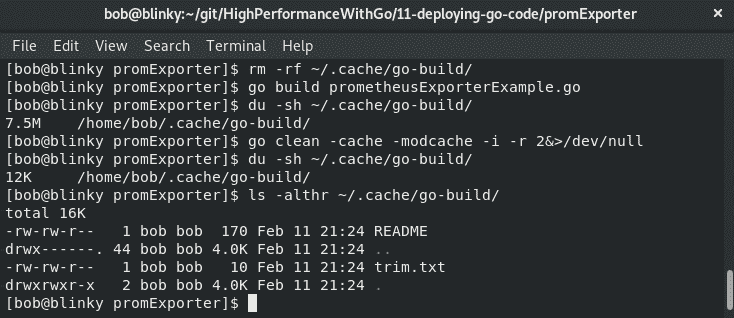
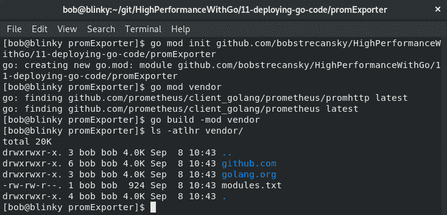
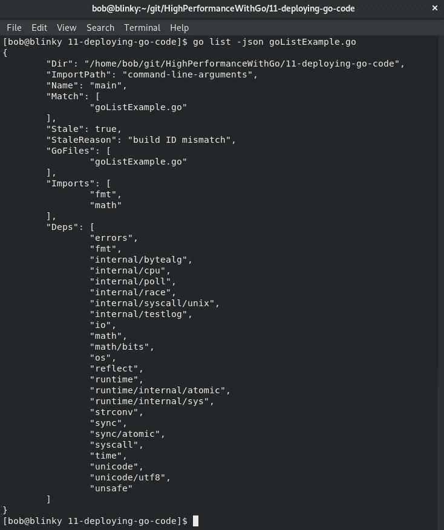
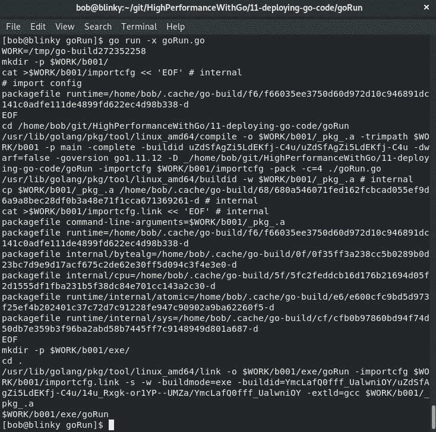
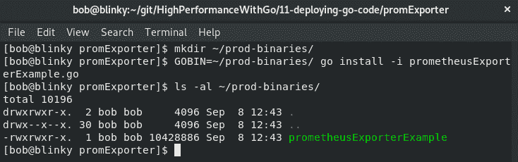

# 十一、构建和部署 Go 代码

一旦我们想出了一种编写 performant Go 代码的方法，我们就需要发布它，验证它，并继续迭代它。这个过程的第一步是部署新的 Go 代码。Go 的代码被编译成二进制文件，这允许在我们迭代代码开发时模块化部署新的 Go 代码。我们可以将其推广到一个或多个地方，以便针对不同的环境进行测试。这样做将允许我们优化代码，以充分利用系统中可用的吞吐量。

在本章中，我们将学习 Go 构建过程的所有内容。我们将了解 Go 编译器如何构建二进制文件，并将利用这些知识为手头的平台构建大小合适、经过优化的二进制文件。我们将讨论以下主题：

*   构建 Go 二进制文件
*   使用`go clean`删除目标文件
*   使用`go get`下载并安装依赖项
*   使用`go mod`进行依赖关系管理
*   使用`go list`列出包和模块
*   使用`go run`执行程序
*   使用`go install`安装软件包

这些主题将帮助我们从源代码构建高效的 Go 二进制文件。

# 构建 Go 二进制文件

在[第 10 章](10.html)、*Go*中的编译时评估中，我们讨论了一些 Go 构建优化，这些优化可能有助于优化我们的构建策略。Go 的构建系统有很多选项，可以帮助系统操作员在构建策略中添加额外的参数化。

Go 工具有许多不同的方法来构建我们的源代码。让我们调查一下对每一个包的顶级理解，然后我们将更深入地讨论每个包。了解这些命令之间的关键区别可以帮助您了解它们之间的相互作用，并为工作选择正确的工具。让我们来看看：

*   `go build`：为您的项目构建二进制文件，编译包和依赖项
*   `go clean`：从包源目录中删除对象和缓存文件
*   `go get`：下载和安装软件包及其依赖项
*   `go mod`：Go（相对较新）内置依赖模块系统
*   `go list`：列出命名包和模块，可以显示有关文件、导入和依赖项的重要构建信息
*   `go run`：运行并编译命名的 Go 程序
*   `go install`：为您的项目构建二进制文件，将二进制文件移动到`$GOPATH/bin`，并缓存所有非主包

在本章中，我们将研究 Go build 系统的这些不同部分。随着我们进一步了解这些程序如何相互操作，我们将能够看到如何利用它们来构建轻薄、功能丰富的二进制文件，从而在支持的体系结构和操作系统上按照我们的预期工作

在下一节中，我们将看穿`go build`。

# Go build–构建 Go 代码

go 构建的调用节如下所示：

```go
go build [-o output] [build flags] [packages]
```

使用`-o`定义输出使用特定命名的文件编译二进制文件。当您希望为文件保留特定的命名约定时，或者如果您希望基于不同的构建参数（平台/OS/git SHA 和其他）命名二进制文件，这将非常有用。

包可以定义为 go 源文件的列表，也可以省略。如果指定了 go 源文件列表，则生成程序将使用作为指定单个包的组传递的文件列表。如果没有定义包，构建程序将验证目录中的包是否可以构建，但它将放弃构建结果。

# 构建标志

Go 的构建标志都由`build`、`clean`、`install`、`list`、`run`和`test`命令共享。下表列出了构建标志及其使用说明：

| **建造标志** | **说明** |
| `-a` | 强制重新生成包。如果您希望确保所有的依赖项都是最新的，那么这将非常方便。 |
| `-n` | 打印编译器使用但不运行命令的命令（类似于其他语言中的试运行）。这有助于了解如何编译包。 |
| `-p n` | 并行化生成命令。默认情况下，此值设置为生成系统可用的 CPU 数量。 |
| `-race` | 启用种族检测。只有某些架构具有检测种族检测的能力：

*   linux/amd64
*   freebsd/amd64
*   达尔文/amd64
*   windows/amd64

 |
| `-msan` | 在 C 中检测未初始化的内存读取。这仅在具有 amd64 或 arm64 体系结构的 Linux 上受支持，并且必须为主机使用 clang/LLVM 编译器。这可以用`CC=clang go build -msan example.go`调用。 |
| `-v` | 编译程序时，生成的包的名称将列在标准输出中。这有助于验证用于生成的包。 |
| `-work` | 打印 Go 用于生成二进制文件的临时工作目录的值。通常默认存储在`/tmp/`中。 |
| `-x` | 显示生成过程中使用的所有命令。这有助于确定如何构建包。更多信息，请参见*构建信息*部分。 |
| `-asmflags '[pattern=]arg list'` | 调用`go tool asm`时要传递的参数列表。 |
| `-buildmode=type` | 这将告诉 build 命令要生成哪种类型的对象文件。`buildmode`当前有两个类型选项：

*   `archive`：将非主包构建到 `.a`文件中。
*   `c-archive`：将主包及其所有导入构建到 C 存档文件中。
*   `c-shared`：将主包及其导入构建到 C 共享库中。
*   `default`：创建主包列表。
*   `shared`：将所有非主包合并到一个共享库中。
*   `exe`：构建主包并将其导入可执行文件。
*   `pie`：将主包及其导入构建到 **位置独立可执行文件** （**馅饼**）
*   `plugin`：将主包及其导入构建到去插件中。

 |
| `-compiler name` | 确定要使用的编译器。常用的有`gccgo`和`gc`。 |
| `-gccgoflags` | `gccgo`编译器和链接器调用标志。 |
| `-gcflags` | `gc`编译器和链接器调用标志。有关更多详细信息，请参阅*编译器和链接器*部分。 |
| `-installsuffix suffix` | 向包安装目录的名称添加后缀。这是为了将输出与默认生成分开使用。 |
| `-ldflags '[pattern=]arg list' ` | 转到工具链接调用参数。有关更多详细信息，请参阅*编译器和链接器*部分。 |
| `-linkshared` | 在`-buildmode=shared`调用发生后，此标志链接到新创建的共享库。 |
| `-mod` | 确定要使用的模块下载模式。在撰写本文时，有两种选择：`- readonly`或`vendor`。 |
| `-pkgdir dir` | 使用定义的`dir`安装并加载所有软件包。 |
| `-tags tag,list` | 生成期间要满足的生成标记的列表。此列表以逗号分隔的列表形式传递。 |
| `-trimpath` | 生成的可执行文件将在可执行文件生成期间对文件系统路径使用不同的命名方案。如下所示：

*   去(标准库）
*   path@version（去模块）
*   普通导入路径（使用 `GOPATH`时）

 |
| `-toolexec 'cmd args'` | 调用工具链程序，如调试器或其他交互式程序。这用于 vet 和 asm 等程序 |

有了所有这些信息，您将能够有效地构建正确的链接器标志。

# 构建信息

为了获得对构建过程的一些理解，让我们来看看一些构建示例，这样我们就可以了解到构建工具是如何一起工作的。

假设我们想要构建一个简单的 HTTP 服务器，它有一个 Prometheus 导出器。我们可以创建这样的出口商：

```go
package main
import (
    "fmt"
    "net/http"
    "github.com/prometheus/client_golang/prometheus/promhttp"
)

func main() {
    http.Handle("/", promhttp.Handler())
    port := ":2112"
    fmt.Println("Prometheus Handler listening on port ", port)
    http.ListenAndServe(port, nil)
}                                                                
```

在我们的软件包准备就绪后，我们可以使用以下内容构建软件包：

```go
go build -p 4 -race -x prometheusExporterExample.go
```

当我们构建这个二进制文件时，我们将看到一些返回到 stdout 的东西（因为我们传递了`-x`标志以查看过程中使用的命令）。让我们来看一看：

1.  我们将截断输出，以便更容易读取结果。如果您自己进行测试，您将看到更大的构建输出：

```go
WORK=/tmp/go-build924967855
```

这将为生成设置临时工作目录。如前所述，除非另有规定，否则它通常位于`/tmp/`目录中：

```go
mkdir -p $WORK/b001/
```

2.  编译器也会创建一个子工作目录：

```go
cat >$WORK/b001/importcfg.link << 'EOF' # internal
```

3.  将创建并添加链接配置。这会将各种不同的参数添加到链接配置中：

```go
packagefile command-line-arguments=/home/bob/.cache/go-build/aa/aa63d73351c57a147871fde4964d74c9a39330b467c6d73640815775e6673084-d
```

4.  命令行参数的包从缓存中引用：

```go
packagefile fmt=/home/bob/.cache/go-build/74/749e110dc104578def1859fbd4ca5c5546f4032f02ffd5ea4d14c730fbd65b81-d
```

`fmt`是我们用来展示`fmt.Println("Prometheus Handler listening on port ", port)`的打印包。这是这样引用的：

```go
packagefile github.com/prometheus/client_golang/prometheus/promhttp=/home/bob/.cache/go-build/e9/e98940b17504e2f647dccc7832793448aa4e8a64047385341c94c1c4431d59cf-d
```

5.  编译器还为 Prometheus HTTP 客户端库添加了包。在此之后，将有许多其他引用添加到构建中。为简洁起见，已将其截断。

文件的结尾用`EOF`表示。

6.  将创建一个可执行目录：

```go
mkdir -p $WORK/b001/exe/
```

7.  然后，编译器使用前面创建的`importcfg`构建二进制文件：

```go
/usr/lib/golang/pkg/tool/linux_amd64/link -o $WORK/b001/exe/a.out -importcfg $WORK/b001/importcfg.link -installsuffix race -buildmode=exe -buildid=bGYa4XecCYqWj3VjKraU/eHfXIjk2XJ_C2azyW4yU/8YHxpy5Xa69CGQ4FC9Kb/bGYa4XecCYqWj3VjKraU -race -extld=gcc /home/bob/.cache/go-build/aa/aa63d73351c57a147871fde4964d74c9a39330b467c6d73640815775e6673084-
```

8.  然后添加一个`buildid`：

```go
/usr/lib/golang/pkg/tool/linux_amd64/buildid -w $WORK/b001/exe/a.out # internal
```

9.  接下来，将二进制文件重命名为导出器示例中的文件名（因为我们没有用`-o`指定不同的二进制文件名）：

```go
cp $WORK/b001/exe/a.out prometheusExporterExample
```

10.  最后，将删除工作目录：

```go
rm -r $WORK/b001/
```

该程序的输出为 Go 二进制。在下一节中，我们将讨论编译器和链接器标志。

# 编译器和链接器标志

在构建 Go 二进制文件时，`-gcflags`标志允许您传递可选的编译器参数，`-ldflags`标志允许您传递可选的链接器参数。通过调用以下命令，可以找到编译器和链接器标志的完整列表：

```go
go tool compile -help
go tool link -help
```

让我们看一个利用编译器和链接器标志的示例。我们可以构建一个简单的程序，返回未初始化字符串变量的值。以下程序似乎是无害的：

```go
package main
import "fmt"

var linkerFlag string
func main() {
    fmt.Println(linkerFlag)
}
```

如果我们使用一些常见的编译器和链接器标志构建它，我们将看到一些有用的输出：


我们在此处传递的编译器标志实现以下功能：

*   `"-m -m"`：打印有关编译器优化决策的信息。这是我们可以在前面的 build 命令后的屏幕截图中看到的输出。
*   `"-N"`：禁用 Go 二进制文件中的优化。
*   `"-l"`：禁用内联。

我们传递的链接器标志执行以下操作：

*   `"-X main.linkerFlag=Hi_Gophers"`：为`main`中的`linkerFlag`变量设置一个值。能够在编译期间添加变量非常重要，因为许多开发人员希望在编译期间向代码中添加某种类型的编译参数。我们可以使用``date -u +.%Y%m%d%.H%M%S``传递构建日期，或者使用`git rev-list -1 HEAD`传递 git 提交版本。这些值对于以后引用生成的状态很有帮助。
*   `"-s"`：禁用符号表，该数据结构将源代码中的每个标识符与声明信息一起存储。生产二进制文件通常不需要这样做。
*   `"-w"`：禁用矮星生成。dwarf 表通常不需要保存，因为 Go 二进制文件包含基本类型信息、PC 到行数据和符号表。

如果我们使用标准方法构建二进制文件，然后使用一些可用的编译器和链接器标志，我们将能够看到二进制文件大小的差异：

*   非优化构建：

```go
$ go build -ldflags "-X main.linkerFlag=Hi_Gophers" -o nonOptimized
```

*   优化构建：

```go
$ go build -gcflags="-N -l" -ldflags "-X main.linkerFlag=Hi_Gophers -s -w" -o Optimized
```

我们可以看到，`Optimized`二进制比`nonOptimized`二进制小 28.78%：


这两个二进制文件将为最终用户执行相同的功能，因此考虑使用编译器和链接器标志移除一些构建优化，以减少最终导致的二进制大小。这在所述二进制文件的存储和部署期间是有益的。

# 构建约束

如果要向 Go build 添加 build 约束，可以在文件开头添加注释行，该行前面只有空行和其他注释。本评论的形式为`// +build darwin,amd64,!cgo, android,386,cgo`。

这对应于布尔输出`darwin AND amd64 AND (NOT cgo)) OR (android AND 386 AND cgo`。

这需要在生成约束和包初始化之间使用换行符继续进行包声明。其形式如下：

```go
// +build [OPTIONS]

package main
```

构建约束的完整列表可在[中找到 https://golang.org/pkg/go/build/#hdr-构建约束](https://golang.org/pkg/go/build/#hdr-Build_Constraints)。此列表包括以下生成约束：

*   `GOOS`
*   `GOARCH`
*   编译器类型（`gc`或`gccgo`）
*   `cgo`
*   所有 1.xGO 版本（beta 版或次要版本无构建标签）
*   `ctxt.BuildTags`中列出的其他词语

如果库中有要从生成中排除的文件，还可以按以下形式添加注释：

```go
// +build ignore
```

相反，您可以使用以下形式的注释将文件构建限制为特定的`GOOS`、`GOARCH`和`cgo`位：

```go
// +build windows, 386, cgo
```

这将仅在您使用`cgo`并在 Windows 操作系统中的 386 处理器上构建时生成文件。这在 Go 语言中是一个强大的构造，因为您能够基于必要的构建参数构建包。

# 文件名约定

如果一个文件在去掉扩展名和后缀后匹配了`GOOS`和`GOARCH`模式（对于测试用例），那么该文件将针对特定的`GOOS`或`GOARCH`模式构建。这样的模式通常参考如下：

*   `*_GOOS`
*   `*_GOARCH`
*   `*_GOOS_GOARCH`

例如，如果您有一个名为`example_linux_arm.go`的文件，它将仅作为 Linux arm 构建的一部分构建。

在下一节中，我们将探讨`go clean`命令。

# 去清理-清理你的构建目录

Go 命令在临时目录中生成二进制文件。创建 go clean 命令是为了删除由其他工具或手动调用 go build 时创建的无关对象文件。Go clean 的用法节为`go clean [clean flags] [build flags] [packages]`。

以下标志可用于 clean 命令：

*   `-cache`标志删除整个 go build 缓存。如果您试图跨多个系统比较新构建，或者希望了解新构建所需的时间，那么这将非常有用。
*   `-i`标志将删除 go install 创建的归档文件或二进制文件。
*   `-n`旗是一个 noop；打印结果会删除命令，但不会执行它们。
*   `-r`标志将逻辑递归地应用于导入路径包的所有依赖项。
*   `-x`标志打印并执行生成的删除命令。
*   `-cache`标志删除整个 go build 缓存。
*   `-testcache`标志删除生成缓存中的测试结果。
*   `-modcache`标志删除模块下载缓存。

如果我们想要尝试一个没有依赖项的干净构建，我们可以使用一个命令从 go 构建系统中的许多重要缓存中删除项。让我们来看一看：

1.  我们将构建我们的`prometheusExporterExample`，以验证构建缓存的大小是否改变。我们可以使用 go 环境`GOCACHE`变量找到构建缓存位置：


2.  为了进行验证，我们将连续使用两个命令。首先，我们将使用`rm -rf ~/.cache/go-build/`删除整个缓存目录。
3.  接下来，我们可以通过运行`go build prometheusExporterExample.go`命令来构建 Go 二进制文件。
4.  然后，我们可以通过使用`du -sh ~/.cache/go-build/`检查缓存的大小来验证缓存的大小是否显著增长。
5.  现在，我们可以使用 go clean 程序清理缓存，即`go clean -cache -modcache -i -r 2&>/dev/null`。

需要注意的是，一些缓存信息存储在主库中，因此普通用户无法删除这些信息。如果需要的话，我们可以以超级用户的身份运行 clean 命令来解决这个问题，但这并不经常被推荐。

然后，我们可以验证缓存的大小是否已缩小。如果我们在清理后查看缓存目录，我们将看到缓存目录中只剩下三项：

*   解释目录的`README`文件。
*   告诉我们缓存信息的`log.txt`文件。
*   一个`trim.txt`文件，告诉我们上次完成缓存修剪的时间。在以下屏幕截图中，我们可以看到已清理的生成缓存：



作为构建的一部分，验证是否缓存了正确的内容将加快构建过程，并有助于减少费力的开发体验。

在下一节中，我们将研究`go get`和`go mod`命令。

# 使用 go get and go mod 检索包依赖项

在构建 Go 程序时，可能会遇到需要添加依赖项的地方。`go get`下载并安装软件包及其依赖项。`go get`的调用节是`go get [-d] [-f] [-t] [-u] [-v] [-fix] [-insecure] [build flags] [packages]`。

Go 1.11 增加了对 Go 模块的初步支持。我们在*Go 模块*部分的[第 6 章](06.html)中学习了如何使用 Go 模块，*编写可读的 Go 代码*。

Go mod 供应商通常作为 Go 构建系统的一部分，因为我们可以在 Go 程序中使用供应商依赖项。在您的代码库中，供应商依赖关系有积极的一面，也有消极的一面。在构建期间，在本地提供所有必需的依赖项可以加快构建速度。如果用于生成依赖项的上游存储库发生更改或被删除，则生成失败。这是因为您的程序将无法满足其上游依赖关系

拥有供应商依赖关系的负面影响包括，供应商依赖关系将保持软件包最新的责任放在程序员身上——如果依赖关系是供应商而不是更新的，则来自上游的更新（如安全更新、性能改进和稳定性增强）可能会丢失

许多企业采用供应商的方法，因为他们觉得存储所有必需依赖项的安全性超过了在供应商目录可用时使用上游的更新包更新供应商目录的需要。

初始化 go 模块后，我们提供依赖项，并使用提供的模块构建依赖项：



如前面的输出所示，我们有供应商依赖项（来自[https://github.com/](https://github.com/) 和[https://golang.org/](https://golang.org/) ），以满足项目中的构建约束。我们可以在构建中使用`go mod tidy`来验证`go.mod`是否包含存储库所需的所有元素

`go mod tidy`添加缺少的模块并删除未使用的模块，以便使用目录的`go.mod`匹配项验证我们的源代码

在下一节中，我们将了解`go list`命令。

# 名单

`go list`执行列出命名包和模块的操作，以及显示有关文件、导入和依赖项的重要构建信息。go 列表的调用节为`usage: go list [-f format] [-json] [-m] [list flags] [build flags] [packages]`。

访问作为构建过程主要部分的数据结构是非常强大的。我们可以使用`go list`来了解我们正在构建的许多程序。例如，以以下简单程序为例，它打印一条消息并为最终用户计算平方根：

```go
package main

import (
    "fmt"
    "math"
)

func main() {
    fmt.Println("Hello Gophers")
    fmt.Println(math.Sqrt(64))
}
```

如果我们想了解特定项目的所有依赖关系，我们可以调用`go list -f '{{.Deps}}'`命令。

结果将是存储库包含的所有依赖项的一部分：


`go list`数据结构可在此处找到：[https://golang.org/cmd/go/#hdr-列出组件或模块](https://golang.org/cmd/go/#hdr-List_packages_or_modules)。它有许多不同的参数。go list 程序的另一个流行输出是 JSON 格式的输出。在下面的屏幕截图中，您可以看到我们的`listExample.go`执行`go list -json`的输出：



`go list -m -u all`还将向您显示您拥有的依赖关系。如果有可用的升级，结果输出还将在括号中列出第二个版本。如果我们想使用`go mod`包密切监视我们的依赖项及其升级，这将非常有用

如果我们使用 Prometheus exporter 示例，我们可以看到我们的包是否具有需要升级的依赖项：


在本例中，我们可以看到有几个包具有可用的升级。如果我们为其中一个依赖项调用 go-get，我们将能够有效地升级它们。我们可以使用`go get github.com/pkg/errors@v0.8.1`将前面屏幕截图中列出的错误包从 v0.8.0 升级到 v0.8.1。

完成此升级后，我们可以通过运行`go list -m -u github.com/pkg/errors`来验证依赖项是否已升级。

我们可以在以下屏幕截图中看到此输出：


在前面的输出中，我们可以看到被引用的错误包现在是 v0.8.1，而不是 v0.8.0，这在前面的输出中显示。

接下来，让我们看看什么是 T0。

# 开始运行–执行您的包

`go run`运行并编译一个命名的 Go 程序。`go run`的调用节是`go run [build flags] [-exec xprog] package [arguments...]`。

Go-run 允许开发人员在一次操作中快速编译和运行 Go 二进制文件。在此过程中，`go run`构建并运行可执行文件，然后删除可执行文件。这在开发环境中特别有用。当您快速迭代 Go 程序时，`go run`可以作为一种快捷方式来验证您正在更改的代码是否会生成您认为可以使用的构建工件。正如我们在本章前面了解到的，这些工具的构建标志是一致的。

`goRun.go`是最简单的 go 程序之一。它没有参数，只是一个空的`main()`函数调用。我们将此作为一个示例来说明此过程，它没有额外的依赖项或开销：

```go
package main 
func main() {}
```

通过执行`go run -x goRun.go`命令，我们可以看到与`go run`调用相关的工作输出。

当我们执行此操作时，我们将能够看到作为`go run`程序一部分调用的构建参数：



这似乎很熟悉，因为输出与我们在 go build 示例中看到的输出非常相似。然后，我们可以看到我们的包被调用。

如果我们对我们的 Prometheus HTTP 服务器执行相同的操作，我们将看到我们的 Prometheus HTTP 服务器作为执行`go run`程序的结果启动并运行。在这个 go-run 调用中终止进程之后，我们会注意到本地目录中没有存储任何二进制文件。默认情况下，`go run`调用不会保存这些输出。

下一节（`go install`中的 Go 命令是本章的最后一个命令。让我们看看这是怎么回事。

# Go install–安装二进制文件

`go install`编译并安装一个命名的 Go 程序。go run 的调用节是`go install [-i] [build flags] [packages]`

这些是导入到`$GOPATH/pkg`的。如果未修改缓存项，则将在下一次编译时使用它们。go install 的结果输出是一个可执行文件，与使用 go build 命令编译的文件相同，安装在系统的`$GOBIN`路径上。例如，如果我们想在主机上安装 Prometheus HTTP 服务器，我们可以调用 go install 命令，即`GOBIN=~/prod-binaries/ go install -i prometheusExporterExample.go`。

设置我们的`GOBIN`变量会告诉编译器编译完成后在何处安装已编译的二进制文件。go install 程序允许我们将二进制文件安装到`GOBIN`位置。`-i`标志安装命名包的依赖项。我们可以在以下屏幕截图中看到这一点：



完成后，我们可以看到我们在示例中定义的`GOBIN`位置中有一个`prometheusExporterExample`二进制文件。

在本章即将到来的最后一节中，我们将看到如何使用 Docker 构建 Go 二进制文件。

# 使用 Docker 构建 Go 二进制文件

根据您的目标体系结构，您可能希望使用 Docker 构建 Go 二进制文件，以维护可复制的构建，限制构建大小，并将服务的攻击向量降至最低。使用多级 Docker 构建可以帮助我们完成此任务。

要执行这些操作，必须安装最新版本的 Docker。我们将要使用的多级构建功能要求守护进程和客户端中的 Docker 版本为 17.05 或更高版本。您可以在[找到适用于您的操作系统的最新版本的 Docker，以及如何安装它的说明 https://docs.docker.com/install/](https://docs.docker.com/install/) 。

考虑以下一个简单的包，它将调试消息记录到屏幕：

```go
package main
import "go.uber.org/zap"
func main() {
  zapLogger: = zap.NewExample()
  defer zapLogger.Sync()
  zapLogger.Debug("Hi Gophers - from our Zap Logger")
}
```

如果我们想在 Docker 容器中构建并执行它，同时最小化依赖关系，我们可以使用多级 Docker 构建。为此，我们可以执行以下步骤：

1.  通过执行以下操作，将当前目录初始化为模块的根目录：

```go
go mod init github.com/bobstrecansky/HighPerformanceWithGo/11-deploying-go-code/multiStageDockerBuild
```

2.  通过执行以下操作添加`vendor`存储库：

```go
go mod vendor

```

现在，我们的存储库中提供了所有必需的供应商软件包（在我们的示例中为 Zap logger）。这可以在以下屏幕截图中看到：


3.  构建我们的`zapLoggerExample`Docker 容器。我们可以使用以下 Docker 文件构建我们的容器：

```go
# Builder - stage 1 of 2
FROM golang:alpine as builder
COPY . /src
WORKDIR /src
RUN CGO_ENABLED=0 GOOS=linux go build -mod=vendor -o zapLoggerExample
# Executor - stage 2 of 2
FROM alpine:latest
WORKDIR /src/
COPY --from=builder /src/zapLoggerExample .
CMD ["./zapLoggerExample"]
```

请注意，我们使用`golang:alpine`图像构建 Go 二进制文件，因为它是最简单的 Docker 图像之一，包含成功构建 Go 二进制文件所需的元素。我们使用`alpine:latest`映像来执行 Go 二进制文件，因为它是最简单的 Docker 映像之一，包含成功运行 Go 二进制文件所必需的元素。

在这个 Dockerfile 示例中，我们使用多级 Docker 构建来构建和执行二进制文件。在 2 的第 1 阶段（构建阶段），我们使用 golang alpine 映像作为基础。我们将当前目录中的所有文件复制到 Docker 容器上的`/src/`目录中，我们创建`/src/`工作目录，然后构建 Go 二进制文件。禁用 cgo，构建 Linux 体系结构，添加我们在*步骤 1*中创建的供应商目录可以帮助最小化构建大小和时间

在 2 的第 2 阶段（executor 阶段），我们使用一个基本的 alpine Docker 映像，创建`/src/`我们的工作目录，并将我们在第一阶段构建的二进制文件复制到这个 Docker 容器中。然后，我们在这个 Docker 构建中执行我们的 logger 作为最终命令。

4.  在我们有了必要的依赖项之后，我们可以构建 Docker 容器。我们通过执行以下命令来执行此操作：

```go
docker build -t zaploggerexample .
```

5.  构建 Docker 容器后，我们可以通过执行以下命令来执行它：

```go
docker run -it --rm zaploggerexample
```

在以下屏幕截图中，您可以看到我们的构建和执行步骤正在完成：


在多级 Docker 容器中构建我们的 Go 程序有助于创建可复制的构建，限制二进制大小，并通过只使用我们需要的比特和片段来最小化我们服务的攻击向量。

# 总结

在本章中，我们了解了如何构建 Go 二进制文件。我们学会了如何有效和永久地做到这一点。我们还学习了如何理解和管理依赖关系，使用`go run`测试 go 代码，并使用 go install 将 go 二进制文件安装到特定位置。了解这些二进制文件的工作方式将有助于更有效地迭代代码

在下一章中，我们将研究如何分析 Go 代码以发现功能瓶颈。