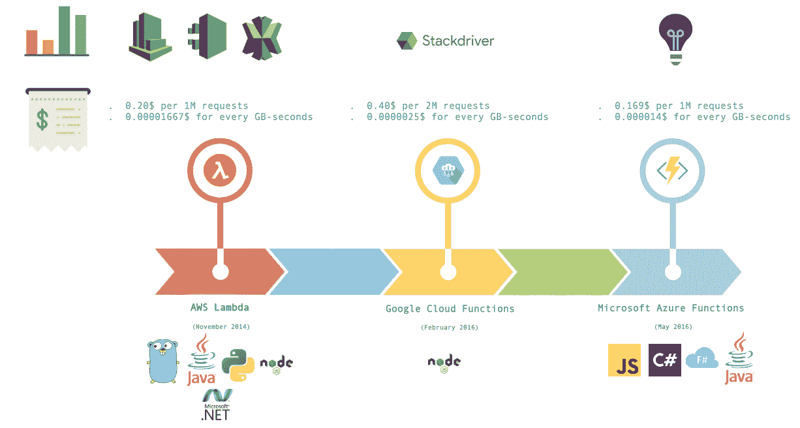
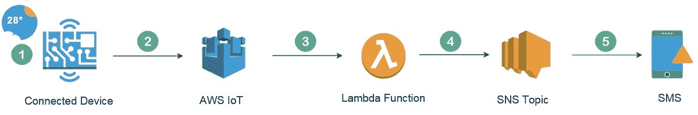
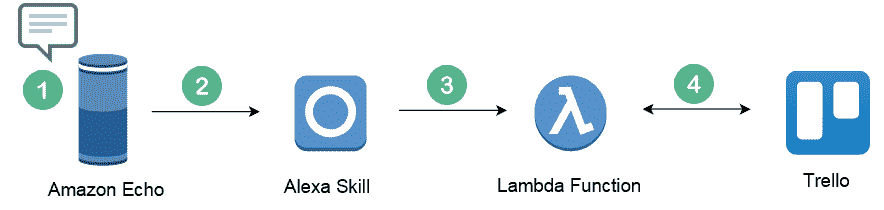
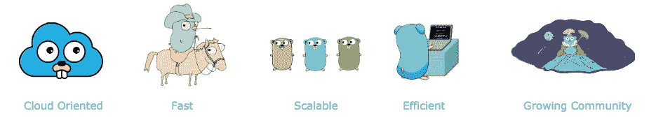
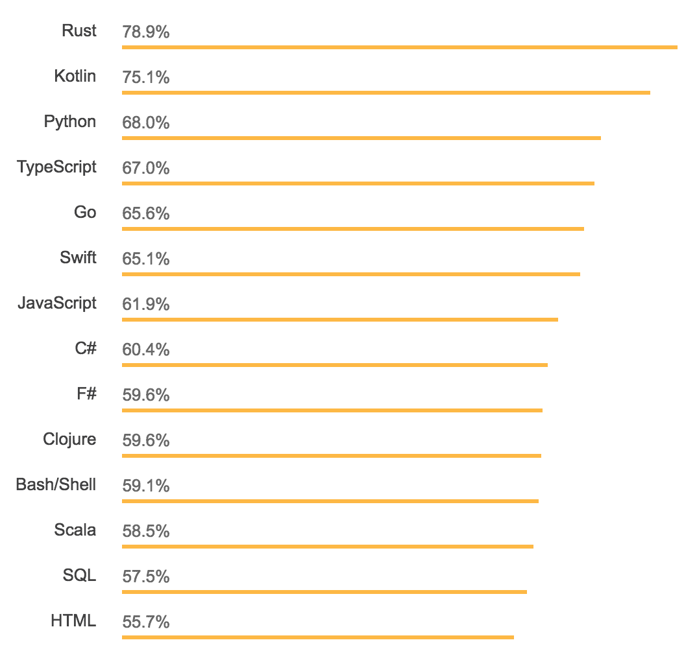

# 无服务器

本章将让您对什么是**无服务器架构**有一个基本的了解，它是如何工作的，以及它的功能是什么。您将了解如何 Athlambda Apple T3A.与谷歌云功能和微软 Azure 功能等大玩家相媲美。然后，您将了解 AWS Lambda 的不同执行环境及其 Go 支持。此外，我们将讨论使用 Go 作为构建无服务器应用程序的编程语言的优势。

本章将介绍以下主题：

*   云计算模型了解它们是什么以及它们可以用于什么。
*   无服务器体系结构的优点和缺点。
*   为什么 Go 非常适合 AWS Lambda。

# 无服务器模式

基于云的应用程序可以构建在底层基础设施上，也可以使用高层服务，这些服务提供核心基础设施的管理、架构和扩展需求的抽象。在下一节中，您将了解不同的云计算模型。

# 云计算的演进

云提供商根据四种主要模式提供服务：IaaS、PaaS、CaaS 和 FaaS。上面提到的所有模型都只是数千台服务器、磁盘、路由器和电缆，它们只是在顶部添加了抽象层，以简化管理并提高开发速度。

# 基础设施即服务

**基础设施即服务**（**IaaS**）有时缩写为 IaaS，是基本的云消费模式。它公开了一个构建在虚拟化平台之上的 API，用于访问计算、存储和网络资源。它允许客户无限扩展其应用程序（无容量规划）。

在这个模型中，云提供商抽象了硬件和物理服务器，云用户负责管理和维护其上的客户操作系统和应用程序。

根据 Gartner 的基础设施即服务幻方图，AWS 是领先者。无论您是在寻找内容交付、计算能力、存储还是其他服务功能，在 IaaS 云计算模型方面，AWS 都是各种可用选项中最具优势的。它主宰着公共云市场，而微软 Azure 正逐渐赶上亚马逊，紧随其后的是谷歌云平台和 IBM 云。

# 平台即服务

**平台即服务**（**PaaS**为开发人员提供了一个开发应用程序的框架。它简化、加快并降低了与开发、测试和部署应用程序相关的成本，同时隐藏了所有实现细节，如服务器管理、负载平衡器和数据库配置。

PaaS 构建在 IaaS 之上，因此隐藏了底层基础设施和操作系统，使开发人员能够专注于交付业务价值并减少运营开销。

最早推出 PaaS 的是 2007 年的 Heroku；后来，谷歌应用程序引擎和 AWS 弹性豆茎加入了这场斗争。

# 集装箱服务

**集装箱即服务**（**CaaS**随着 2013 年 Docker 的发布而流行。它使得在本地数据中心或云上构建和部署容器化应用程序变得容易。

容器改变了 DevOps 和现场可靠性工程师的规模单位。可以在单个虚拟机上运行多个容器，而不是每个应用程序一个专用的 VM，这样可以提高服务器利用率并降低成本。此外，它还消除了“在我的机器上工作”的笑话，使开发人员和操作团队更加紧密地团结在一起。这种向容器的过渡使多家公司能够对其遗留应用程序进行现代化，并将其移动到云上。

为了实现容错性、高可用性和可扩展性，需要一个编排工具（如 Docker Swarm、Kubernetes 或 Apache Mesos）来管理节点群中的容器。因此，引入了 CaaS 来快速高效地构建、运送和运行容器。它还处理繁重的任务，如集群管理、扩展、蓝/绿部署、金丝雀更新和回滚。

当今市场上最流行的 CaaS 平台是 AWS，57%的 Kubernetes 工作负载运行在亚马逊**弹性容器服务**（**ECS**）、**弹性 Kubernetes 服务**（**EKS**）和 AWS Fargate 上，其次是 Docker Cloud、CloudFoundry 和 Google 容器引擎。

此模型（CaaS）使您能够进一步拆分虚拟机以实现更高的利用率，并跨计算机集群协调容器，但云用户仍需要管理容器的生命周期；作为解决方案，引入了**功能即服务**（**FaaS**。

# 服务功能

FaaS 模型允许开发人员运行代码（称为函数），而无需配置或维护复杂的基础设施。云提供商将客户代码部署到完全管理、短暂、时间有限的容器中，这些容器仅在函数调用期间处于活动状态。因此，客户不必担心扩展或维护复杂的基础设施，业务就可以增长；这就是所谓的无服务器化。

2014 年，亚马逊通过 AWS Lambda 启动了无服务器革命，随后是微软 Azure 功能和谷歌云功能。

# 无服务器体系结构

无服务器计算（简称 FaaS）是第四种使用云计算的方式。在此模型中，供应、维护和修补服务器的责任从客户转移到云提供商。开发人员现在可以专注于构建新功能和创新，只需支付他们所消耗的计算时间。

# 无服务器的好处

无服务器运行之所以有意义，有很多原因：

*   **NoOps**：服务器基础设施由云提供商管理，这减少了开销，提高了开发速度。操作系统更新由 FaaS 提供商负责，补丁由 FaaS 提供商完成。这将缩短上市时间，加快软件发布速度，并消除对系统管理员的需求。
*   **自动缩放和高可用性**：作为一个缩放单元的功能会产生小型、松散耦合和无状态的组件，从长远来看，这些组件会产生可伸缩的应用程序。由服务提供商决定如何有效地使用其基础设施来服务客户的请求，并根据负载水平扩展功能。
*   **成本优化**：您只需支付所消耗的计算时间和资源（RAM、CPU、网络或调用时间）。你不会为闲置资源买单。没有工作就意味着没有成本。例如，如果 Lambda 函数的计费周期为 100 毫秒，则可以显著降低成本。
*   **Polygot**：无服务器方法带来的一个好处是，作为程序员，您可以根据您的用例在不同的语言运行时之间进行选择。应用程序的一部分可以用 Java 编写，另一部分可以用 Go 编写，另一部分可以用 Python 编写；只要能完成任务，这并不重要。

# 无服务器的缺点

另一方面，无服务器计算仍处于初级阶段；因此，它并不适用于所有用例，并且有其局限性：

*   **透明度**：基础设施由 FaaS 提供商管理。这是为了换取灵活性；您无法完全控制您的应用程序，无法访问底层基础设施，并且无法在平台提供商之间切换（供应商锁定）。在未来，我们期望为联邦航空管理局的统一做更多的工作；这将有助于避免供应商锁定，并允许我们在不同的云提供商甚至本地运行无服务器应用程序。
*   **调试**：构建监控和调试工具时没有考虑无服务器架构。因此，无服务器函数很难调试和监视。此外，在部署（预集成测试）之前，很难设置本地环境来测试您的功能。好消息是，在无服务器环境中，工具最终会出现以提高可观察性，随着无服务器应用的普及，社区和云提供商（AWS X-Ray、Datadog、Dashbird 和 Komiser）创建了多个开源项目和框架。
*   **冷启动**：由于云提供商需要为您的任务分配适当的资源（AWS Lambda 需要启动一个容器），您的职能部门需要一些时间来处理第一个请求。要避免这种情况，函数必须保持活动状态
*   **无状态**：功能需要无状态，以提供使无服务器应用程序透明可扩展的配置。因此，要持久化数据或管理会话，您需要使用外部数据库，如 DynamoDB 或 RDS，或内存缓存引擎，如 Redis 或 Memcached。

在说明了所有这些限制之后，随着越来越多的供应商提供其平台的升级版本，这些方面将在未来发生变化。

# 无服务器云提供商

有多个 FaaS 提供商，但为了简单起见，我们只比较最大的三个：

*   AWS Lambda
*   谷歌云功能
*   Microsoft Azure 功能

以下为图片对比：

如上图所示，AWS Lambda 是当今无服务器空间中使用最多、最知名、最成熟的解决方案，这就是为什么接下来的章节将全面介绍 AWS Lambda。

# AWS Lambda

AWS Lambda 是 AWS 无服务器平台的中心：

AWS Lambda 于 2014 年重新发布。这是第一次实现无服务器计算，用户可以将代码上传到 Lambda。它代表他们执行运营和管理活动，包括调配容量、监控车队运行状况、应用安全补丁、部署代码以及向 Amazon CloudWatch 发布实时日志和指标。

Lambda 遵循事件驱动的体系结构。您的代码被触发以响应事件并并行运行。每个触发器都被单独处理。此外，您仅在每次执行时收费，而在 EC2 中，您是按小时计费的。因此，您可以通过低成本和零前期基础设施投资从应用程序的自动缩放和容错中获益。

# 源事件

AWS Lambda 运行代码以响应事件。当这些事件源检测到以下事件时，将调用您的函数：

Amazon 现在支持 SQS 作为 Lambda 的源事件

# 用例

AWS Lambda 可用于无休止的应用场景：

*   **Web 应用程序****您可以将 S3 和 Lambda 结合起来，以更低的成本从可扩展性中获益，而不是使用 Web 服务器维护专用实例来托管静态网站。下图描述了无服务器网站的示例：**

 **

**路线 53**中的别名记录指向**云锋**分布。**CloudFront**发行版构建在**S3 存储桶**之上，该存储桶承载静态网站。**CloudFront**减少了对静态资产（JavaScripts、CSS、字体和图像）的响应时间，提高了网页加载时间，并缓解了分布式拒绝服务（DDoS）攻击。来自网站的 HTTP 请求然后通过**API 网关**HTTP 端点触发正确的**Lambda 函数**来处理应用程序逻辑并将数据持久化到完全管理的数据库服务，如**DynamoDB**

*   **移动和物联网**：**构建传感器应用程序的示意图，用于从实时传感器连接设备测量温度，并在温度超出范围时发送 SMS 警报，可给出如下信息：**

 **

**连接的设备**将数据摄取到**AWS 物联网**。**AWS IoT**规则将调用**Lambda 函数**，以便在紧急情况下分析数据并向**SNS 主题**发布消息。消息发布后，亚马逊 SNS 将尝试向订阅该主题的每个端点发送该消息。在这种情况下，它将是一条**短信**。

*   **数据摄取：**监控您的日志并保持审计跟踪是强制性的，您应该知道您的云基础设施中存在任何安全漏洞。下图显示了使用 Lambda 的实时日志处理管道：

VPC 流量日志功能捕获有关进出 VPC 网络接口的 IP 流量的信息，并将日志发送到 Amazon CloudWatch 日志。AWS CloudTrail 维护您帐户上所有 AWS API 调用的记录。所有日志被聚合并流式传输到 AWS Kinesis 数据流

Kinesis 触发 Lambda 函数，该函数分析日志中的事件或模式，并在出现异常活动时向 Slack 或 PagerDuty 发送通知。最后，Lambda 使用预安装的 Kibana 将数据集发布到 Amazon Elasticsearch，以可视化和分析网络流量和日志，并使用动态交互式仪表板。这样做是为了长期保留和归档日志，特别是对于具有法规遵从性计划的组织。Kinesis 将日志存储在 S3 存储桶中以备备份。bucket 可以配置生命周期策略，将未使用的日志归档到 Glacier。

*   **调度任务**：**调度任务和事件非常适合 Lambda。您可以使用 Lambda 创建备份、生成报告和执行 cron 作业，而不是让实例保持 24/7 运行。以下示意图描述了如何使用 AWS Lambda 执行后处理作业：**

 **

当视频到达 S3 bucket 时，事件会触发 Lambda 函数，将视频文件名和路径传递到弹性转码器管道进行视频转码，生成多种视频格式（`.avi`、`.h264`、`.webm`、`.mp3`等），并将结果存储在 S3 bucket 中。

*   **聊天机器人和语音助手：**您可以使用**自然语言理解**（**NLU**或**自动语音识别**（**ASR**等）服务，如亚马逊 Lex，构建能够触发 Lambda 函数以响应语音命令或文本来实现意图的应用程序 bot。下图描述了使用 Lambda 构建个人助理的用例：

用户可以向**亚马逊回声**询问其待办事项列表。Echo 将截获用户的语音命令并将其传递给定制的**Alexa Skill**，后者将执行语音识别并将用户的语音命令转换为意图，这将触发**Lambda 函数**，该函数反过来将查询**Trello**API 以获取今天的任务列表。

由于 Lambda 在内存、CPU 和超时执行方面的限制，它不适合长时间运行的工作流和其他大规模工作负载。

# 无服务器

AWS 于 2018 年 1 月宣布支持 Go 作为 AWS Lambda 的语言。已经有一些开源框架和库用于填充使用 Node.js（Apex serverless Framework）的 Go 应用程序，但现在 Go 得到了官方支持，并添加到了可用于编写 Lambda 函数的编程语言列表中：

*   去
*   Node.js
*   JAVA
*   python
*   网

但是我们应该使用哪种语言来编写高效的 Lambda 函数呢？选择无服务器的原因之一是成为一名多道手。无论您选择哪种语言，为 Lambda 函数编写代码都有一种通用模式。同时，您需要特别注意性能和冷启动。这就是围棋发挥作用的地方。下图突出显示了在 AWS Lambda 中使用 Go for serverless 应用程序的主要优势：

*   **面向云**：谷歌主要为云设计，考虑到可扩展性，减少构建时间。Go 是一种用于分布式系统和基础设施工具的可靠语言。Docker、Kubernetes、Terraform、etcd、Prometheus 以及许多编排、资源调配和监控工具都是使用 Go 构建的。
*   **快速**：进入单个二进制。因此，您需要向 AWS Lambda 提供预编译的 Go 二进制文件。AWS 不会为您编译 Go 源文件，这会产生某些后果，例如快速冷启动时间。Lambda 不需要设置运行时环境；另一方面，Java 需要旋转一个 JVM 实例，以使您的函数变热。Go 具有清晰的语法和清晰的语言规范。这为开发人员提供了一种易于学习的语言，并在生成可维护代码的同时快速显示良好的结果。
*   **可扩展**：Go 内置了与 goroutines 的并发性，而不是线程。它们从堆中消耗了几乎 2KB 的内存，并且工作速度比线程快；因此，您可以在任何时候启动数百万个 goroutine；Golang 社区构建了许多由 Go 的语言核心提供本地支持的工具：
    *   Go 的错误处理非常优雅。
    *   用于单元测试的轻量级框架。
    *   可靠的标准库 HTTP 协议支持开箱即用。
    *   通用数据类型和结构支持映射、数组、结构等。
*   **高效**：包括高效执行和编译。Go 是一种编译语言；它编译成一个二进制文件。它使用静态链接将所有依赖项和模块合并到一个二进制文件中。此外，它更快的编译速度允许快速反馈。快速发展节省时间和金钱；因此，对于预算紧张的人来说，这无疑是最显著的优势。此外，它还通过垃圾收集器提供了高效的内存利用率。
*   **成长社区**：下面的屏幕截图显示了最受欢迎、最可怕和最需要的编程语言的受欢迎程度和使用率不断上升（如 StackOverflow 调查 2017 中所观察到的）：

此外，Go 得到了 Google 的支持，拥有一个庞大的、不断增长的生态系统，GitHub 上的语言有众多贡献者，以及强大的 IDE 支持（IntelliJ、VSCode、Atom、GoGland）和调试。

# 总结

AWS Lambda 是第一个成功实现无服务器计算或 FaaS 的产品。它为用户提供了管理服务器的自由，提高了开发速度，降低了系统复杂性，并使小型企业能够在零前期基础设施投资的情况下发展壮大

对 AWS Lambda 的 Go 支持为那些在 Lambda 上运行业务的人提供了显著的成本节约和性能优势。因此，如果你正在寻找一种现代、快速、安全、简单的语言，Go 就是你的选择。

在下一章中，您将开始使用 AWS Lambda 控制台并设置 Golang 开发环境。

# 问题

1.  使用无服务器方法的优点是什么？
2.  什么使 Lambda 成为节省时间的方法？
3.  无服务器体系结构如何支持微服务？
4.  AWS Lambda 函数的最大时间限制是多少
5.  以下哪项是 AWS Lambda 支持的事件源？
    *   亚马逊运动数据流
    *   关系数据库服务
    *   AWS 编解码器
    *   自动气象站云层
6.  解释围棋中的 goroutine 是什么。你怎么能阻止戈罗季斯？
7.  什么 Lambda@Edge 在 AWS？
8.  功能即服务和平台即服务之间有什么区别？
9.  AWS Lambda 冷启动是什么？
10.  AWS Lambda 函数可以是无状态的还是有状态的？******